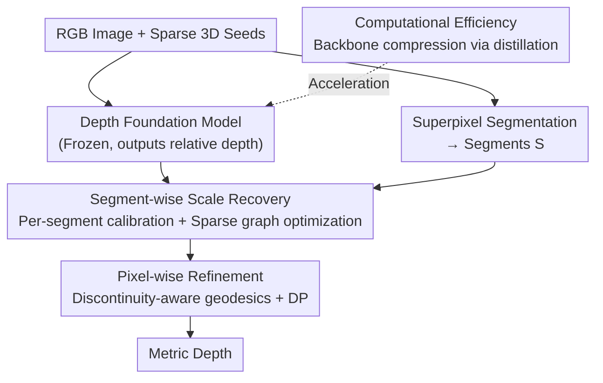

# The Midas Touch for Metric Depth

**Conference**: CVPR 2026  
**Paper**: [CVF Open Access](https://openaccess.thecvf.com/content/CVPR2026/html/Ma_The_Midas_Touch_for_Metric_Depth_CVPR_2026_paper.html)  
**Code**: https://mias.group/MTD (Project Page)  
**Area**: 3D Vision / Monocular Depth Estimation  
**Keywords**: Metric Depth, Relative Depth, Depth Completion, Sparse Point Clouds, Geodesics

## TL;DR
MTD (Midas Touch for Depth) employs a training-free, mathematically interpretable "coarse-to-fine" algorithm to convert relative depth from foundation models into metric depth using extremely sparse 3D seeds (e.g., LiDAR or stereo matching). It aligns local scales via segment-wise graph optimization and performs pixel-level detailing using "discontinuity-aware geodesic cost + dynamic programming." It outperforms SOTA methods like BP-Net, DMD3C, and Marigold-DC in zero-shot depth completion and estimation, with a backend latency of only 1.9 ms.

## Background & Motivation
**Background**: Depth foundation models such as MiDaS and DepthAnything exhibit strong cross-scene generalization for monocular relative depth estimation. However, they output **relative depth**, which suffers from inherent scale ambiguity and lacks absolute metric units.

**Limitations of Prior Work**: Obtaining metric depth previously followed two flawed paths. 1) Using 3D point clouds for **global least squares** to recover a single scale—but the scale ratio and offset actually vary across different objects/regions, making a global scalar inaccurate for local precision. 2) Training specific **metric depth networks** (Metric3D, UniDepth) or depth completion networks (BP-Net, DMD3C)—but these are often domain-specific, generalize poorly cross-domain, require massive datasets and days of training, and suffer from "edge-fattening" at object boundaries.

**Key Challenge**: There is a conflict between the strong generalization of relative models and the absolute scale of metric depth. Obtaining scale usually requires specialized training that sacrifices generalization. The essence of scale ambiguity is **local scale inconsistency**, which cannot be corrected by a single global scalar.

**Goal**: Convert relative depth into metric depth efficiently and accurately using only extremely sparse 3D cues (referred to as "3D seeds," such as depth, disparity, or correspondence) **without any fine-tuning** of the foundation model.

**Key Insight**: Decompose the problem into "local scale alignment" and "pixel-wise residual correction," solving both via **non-parametric methods with clear mathematical foundations** rather than training another network.

**Core Idea**: Replace "global scaling" or "end-to-end training" with a pure optimization pipeline using "segment-wise graph optimization for coarse scale recovery + discontinuity-aware geodesics for pixel-wise refinement" to transform relative depth into metric depth.

## Method

### Overall Architecture
MTD takes three inputs: the **relative depth map** $d$ predicted by a foundation model, **sparse 3D seeds** $X$, and a set of **segments** $S=\{S_i\}$ obtained via superpixel segmentation of the RGB image. It outputs reliable metric depth. The pipeline is **coarse-to-fine**: first, Segment-Wise Recovery aligns local scales to produce a coarse metric depth; then, Pixel-Wise Refinement corrects residuals to produce fine metric depth. Additionally, knowledge distillation is used to compress the frontend foundation model for real-world deployment.

The architecture's strength lies in the fact that both precision-enhancing modules (recovery and refinement) are backend mathematical optimizations with near-zero overhead (1.9 ms on an RTX 3090 for 480×640 input, <1.8 GB VRAM). The primary bottleneck is the frontend model, which can be swapped for lighter backbones to gain speed with minimal precision loss.

### Key Designs

**1. Segment-wise Scale Recovery: Replacing Global Scaling with Graph Optimization**

This step addresses the failure of global least squares to handle local scale inconsistencies. It involves two layers. First, **Per-Segment Calibration**: The image is partitioned into segments $S_i$, and 3D seeds are projected onto the image plane. For segments containing projected seeds (index set $Q$), a calibration function $g_i: d \mapsto \xi$ is fitted using the scalar proxy $\xi_i^j$ (monotonically mapped to ground truth depth $z_i^j$) and the relative depth $d_i^j$. Second, **Sparse Graph Optimization**: Segments without seeds ($i \notin Q$) cannot be calibrated directly. The segments are encoded into a superpixel graph $G=(V,E)$, where weights $w_{ij}$ are defined by a decay kernel based on centroid distances. The estimation of all calibration parameters $\{\theta_i\}$ is formulated as a graph-regularized quadratic problem:

$$\min_{\{\theta_i\}} \sum_{i\in Q}\lVert\theta_i-\hat\theta_i\rVert^2 + \sum_{(i,j)\in E} w_{ij}\lVert\theta_i-\theta_j\rVert^2.$$

The first term anchors seeded segments to their calibration points, while the second encourages smoothness between neighbors. This has an efficient closed-form approximate solution, resulting in a coarse metric depth where local scales are aligned but pixel-wise residuals remain.

**2. Pixel-wise Refinement: Discontinuity-aware Geodesic Propagation via DP**

Residuals persist after recovery; true depths of projected seeds still deviate from the coarse depth, and errors are often shared among adjacent pixels on the same physical surface. Standard smoothing diffuses errors across object boundaries. The solution formalizes depth propagation as a **geodesic cost** problem. An anti-symmetric first-order residual $R(p,q)$ is defined, and it is proven (Proposition 1) that its upper bound is controlled by the line integral of a **local discontinuity density** $\phi(u,v)=\sqrt{z_{uu}^2+z_{vv}^2}$ along a path. The discontinuity-aware geodesic cost is defined as:

$$d_\phi(p,q)=\inf_{L\in\mathcal{L}_{p\to q}} \int_L \phi(u,v)\, ds,$$

which corresponds to the geodesic distance under the conformal Riemannian metric $\phi^2 I_2$. Intuitively, large $\phi$ values at boundaries penalize "boundary crossing," confining depth propagation to reliable spatial regions.

This is solved by discretizing the line integral into a Riemann sum and rewriting it as a dynamic programming recurrence: $d_\phi(p_0,p_K)\le \inf W(p_{K-1}\to p_K)+d_\phi(p_0,p_{K-1})$. Starting from reliable seed pixels, $K$ iterations of DP determine the smoothest path to any pixel $p$. Depth is updated using a harmonic step size $\frac{1}{k+1}$ via convex combination: $z^{(k+1)}(p)=(1-\frac{1}{k+1})z^{(k)}(p)+\frac{1}{k+1}\hat z^{(k)}(p\mid q, \Delta p)$, where $\hat z^{(k)}$ is predicted using local coefficients $\alpha^{(k)}(q)^\top$ and basis functions $\Psi(\Delta p)$.

**3. Computational Efficiency: Compressing the Frontend via Distillation**

Since MTD's precision modules are computationally negligible, overall speed depends on the frontend. Knowledge distillation is applied using DepthAnythingV2 as the teacher and TinyViT/EfficientViT as student backbones. Feature and logit distillation are performed on datasets like VKITTI2, Hypersim, TartanAir, and SA-1B. This allows deployment on edge devices like Jetson AGX Orin, as MTD can compensate for lower-quality relative depth from smaller backbones.

## Key Experimental Results

### Main Results

In zero-shot depth completion (excluding KITTI/NYUv2 to avoid train-test overlap), MTD significantly outperforms SOTAs (lower is better):

| Dataset | Metric | Marigold-DC (Prev. SOTA) | MTD (Ours) | Gain |
|---------|----------|-----------------------|-------------|------|
| nuScenes | RMSE / MAE | 4.924 / 2.595 | 4.387 / 2.177 | -0.537 / -0.418 |
| DDAD | RMSE / MAE | 6.449 / 2.364 | 5.252 / 1.834 | -1.197 / -0.530 |
| VOID1500 | RMSE / MAE | 0.505 / 0.151 | 0.366 / 0.138 | -0.139 / -0.013 |
| SUN-RGBD | RMSE / MAE | 0.238 / 0.067 | 0.220 / 0.050 | -0.018 / -0.017 |
| ScanNet | RMSE / MAE | 0.145 / 0.059 | 0.129 / 0.049 | -0.016 / -0.010 |

When integrated as a plug-and-play module for zero-shot depth estimation, MTD consistently improves AbsRel and $\delta_1$ (Upper row = original model, Lower row = +Ours):

| Foundation Model | KITTI AbsRel↓ / δ1↑ | ScanNet AbsRel↓ / δ1↑ |
|----------|---------------------|------------------------|
| MiDaS → +Ours | 0.183 / 0.711 → **0.069 / 0.929** | 0.099 / 0.907 → **0.015 / 0.991** |
| DepthAnythingV2 → +Ours | 0.080 / 0.946 → **0.022 / 0.987** | 0.043 / 0.981 → **0.016 / 0.991** |
| UniDepthV2 → +Ours | 0.076 / 0.952 → **0.032 / 0.977** | 0.058 / 0.975 → **0.014 / 0.993** |

Efficiency: For 480×640 input on an RTX 3090, the MTD backend takes only **1.9 ms**, uses <1.8 GB VRAM, and <4% GPU utilization.

### Ablation Study

Summary of results on KITTI (outdoor) + VOID (indoor):

| Module | Configuration | KITTI RMSE | VOID RMSE | Note |
|------|------|-----------|-----------|------|
| Segment Calibration | median | 10.891 | 0.898 | Median alignment |
| Segment Calibration | least squares | 7.013 | 0.791 | LS is better |
| Segment Calibration | Domain: $z^{-1}$ | 6.782 | 0.614 | Inverse depth proxy improves further |
| Graph Optimization | global-based | 2.521 | 0.554 | Global baseline |
| Graph Optimization | graph-based | **2.232** | **0.459** | Graph > Global |
| Dynamic Programming | w/o $d_\phi$ | 2.618 | 0.482 | Geodesic cost is critical |
| Dynamic Programming | polynomial vs B-spline | 2.049 vs 2.112 | 0.429 vs 0.442 | Poly basis > B-spline |
| Dynamic Programming | k=3 / k=5 | 2.028 / 1.913 | 0.366 / 0.391 | Larger k expands receptive field |

### Key Findings
- **Geodesic cost is the lifeline of refinement**: Removing $d_\phi$ (w/o $d_\phi$) prevents the effective representation of discontinuities, causing KITTI RMSE to drop from ~2.0 to 2.618.
- **Graph Optimization > Global Scaling**: Switching from global-based to graph-based consistently reduces error, validating the motivation to model local scale inconsistency.
- **MTD bridges the backbone gap**: While DepthAnythingV2 and MiDaS show large MAE differences under global least squares, adding MTD significantly narrows this gap, demonstrating MTD's ability to save "medium quality" relative depths.
- **Advantageous with sparse seeds**: MTD's advantage over global least squares is more pronounced when the number of 3D seeds (NP) is low, particularly in sparse outdoor scenes like nuScenes.

## Highlights & Insights
- **Precision-Cost Decoupling**: Offloading precision to a near-zero-cost mathematical backend (1.9 ms) allows for a flexible "accuracy vs. efficiency" knob by simply swapping the frontend backbone.
- **Geodesic Reformulation**: Utilizing $\phi=\sqrt{z_{uu}^2+z_{vv}^2}$ as a discontinuity density to penalize cross-boundary propagation is a mathematically elegant and interpretable alternative to learned affinity propagation.
- **Zero-Training & Multi-Source Versatility**: The design accepts seeds from any source (LiDAR, iPhone, Stereo) and functions as a plug-and-play module for any relative model, offering high engineering value.

## Limitations & Future Work
- **Reliance on Segmentation & Projection**: The optimal superpixel scale is a hyperparameter that varies by dataset. A method for automatically selecting segment scales is currently missing.
- **Dependency on Seeds**: MTD cannot produce metric depth in purely monocular scenes without any 3D cues; it is a "relative-to-metric" converter, not an end-to-end estimator.
- **Mathematical Complexity**: The proofs for geodesic and DP equivalence are deferred to the supplement; implementation requires careful attention to discretization and initialization details.
- **Future Directions**: Developing data-adaptive segment scaling or integrating geodesic costs with foundation model features to further reduce seed density requirements.

## Related Work & Insights
- **vs. Global LS (MiDaS/DepthAnything)**: While global scaling uses one scalar, MTD uses segment-wise calibration + graph propagation, explicitly modeling local scale variations.
- **vs. Depth Completion SOTAs (BP-Net/DMD3C/Marigold-DC)**: These require massive training and struggle with cross-domain robustness. MTD is training-free, interpretable, and achieves better zero-shot MAE/RMSE with millisecond latency.
- **vs. Metric Depth Networks (Metric3D/UniDepth)**: These suffer from generalization issues and "edge-fattening." MTD retains the strong generalization of relative models while achieving metric accuracy through boundary-aware refinement.

## Rating
- Novelty: ⭐⭐⭐⭐⭐ Formulating "relative-to-metric" as graph optimization and geodesic refinement without training is highly innovative.
- Experimental Thoroughness: ⭐⭐⭐⭐⭐ Extensive coverage of 10+ zero-shot benchmarks, both completion and estimation tasks, multiple backbones, and detailed ablations.
- Writing Quality: ⭐⭐⭐⭐ Clear logic and rigorous propositions, though the geodesic section is dense and reliant on the supplement.
- Value: ⭐⭐⭐⭐⭐ Plug-and-play, millisecond backend, and deployment-ready for robotics and autonomous driving.

<!-- RELATED:START -->

## Related Papers

- [\[CVPR 2026\] Dense Metric Depth Completion from Sparse Direct Time-of-Flight Sensors](dense_metric_depth_completion_from_sparse_direct_time-of-flight_sensors.md)
- [\[CVPR 2026\] Radar-Guided Polynomial Fitting for Metric Depth Estimation](radar-guided_polynomial_fitting_for_metric_depth_estimation.md)
- [\[CVPR 2026\] MD2E: Modeling Depth-to-Edge Cues for Monocular Metric Depth Estimation](md2e_modeling_depth-to-edge_cues_for_monocular_metric_depth_estimation.md)
- [\[CVPR 2026\] UniDAC: Universal Metric Depth Estimation for Any Camera](unidac_universal_metric_depth_estimation_for_any_camera.md)
- [\[CVPR 2026\] LiteSense: Lifting Lightweight ToF with RGB for High-Resolution Metric Depth Estimation](litesense_lifting_lightweight_tof_with_rgb_for_high-resolution_metric_depth_esti.md)

<!-- RELATED:END -->
