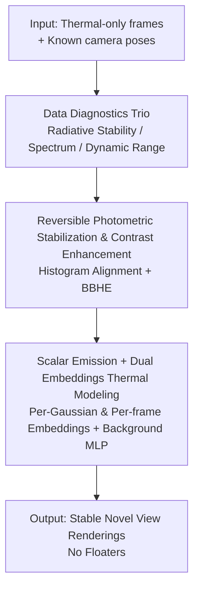

<!-- Automatically generated by tmp/gen_cvf_stubs.py (CVF-only, no arXiv) -->
# Thermal is Always Wild: Characterizing and Addressing Challenges in Thermal-Only Novel View Synthesis

**Conference**: CVPR 2026  
**Paper**: [CVF Open Access](https://openaccess.thecvf.com/content/CVPR2026/html/Aydin_Thermal_is_Always_Wild_Characterizing_and_Addressing_Challenges_in_Thermal-Only_CVPR_2026_paper.html)  
**Code**: [Project Page nubivlab.github.io/wild_thermal](https://nubivlab.github.io/wild_thermal)  
**Area**: 3D Vision  
**Keywords**: Thermal Imaging, Novel View Synthesis, 3D Gaussian Splatting, In-the-wild Appearance Modeling, Photometric Stabilization

## TL;DR
To address the long-standing challenge of "thermal-only, RGB-free" novel view synthesis (NVS), this paper first systematically characterizes three types of degradation caused by low-cost microbolometer sensors—ultra-low dynamic range, inter-frame photometric jitter + slow radiative drift, and lack of texture. Based on this, a lightweight "reversible photometric stabilization + thermal-specific 3DGS" pipeline is designed. The front-end leverages reversible histogram alignment + bi-histogram equalization to stretch the dynamic range and eliminate drift. The back-end simplifies each Gaussian to single-channel scalar emission, and employs "per-Gaussian + per-frame" dual embeddings to absorb residual jitter. The proposed method achieves state-of-the-art performance across six thermal-only datasets without dataset-specific parameter tuning (improving average PSNR from 22.25 dB of baseline 3DGS to 26.14 dB).

## Background & Motivation

**Background**: Novel view synthesis (NeRF / 3D Gaussian Splatting) has matured in the RGB domain, enabling reconstruction of geometry and appearance from a set of posed images. It is widely used in robotics, autonomous driving, and AR/VR. Its effectiveness relies on the rich texture, stable photometry, and cross-view consistency naturally present in RGB images.

**Limitations of Prior Work**: Directly applying RGB pipelines to thermal images leads to failure. While the value of thermal imaging lies in scenes where RGB fails (e.g., night, smoke, fire), low-cost microbolometer sensors suffer from several "wild" degradations: (1) inter-frame photometric inconsistency (drift of overall frame brightness caused by sensor self-heating), (2) "blurring" of microbolometers causing cold-hot transitions to smudge together, (3) view-dependent brightness attenuation due to vignetting, and (4) fixed-pattern noise. These corrupt multi-view consistency, destabilize correspondence estimation, and generate high-frequency "floaters" in synthesis.

**Key Challenge**: Due to the inherent difficulty of thermal imaging, most prior works rely on **paired RGB-thermal** inputs—using RGB to recover geometry and treating thermal imaging as an additional channel to "paint" onto the geometry. However, this assumes capture is done under conditions where RGB is still functional, deviating from the core intent of using thermal imaging "precisely when RGB fails." Thus, **thermal-only** NVS is genuinely needed; yet as soon as the RGB branch is removed, the geometric supervision of these cross-modal methods collapses.

**Goal**: (1) Rigorously characterize where real multi-view thermal data is "wild" and which degradations harm NVS the most; (2) build a thermal-only NVS pipeline that does not rely on RGB and requires no dataset-specific hyperparameter tuning.

**Key Insight**: The authors start with data analysis, quantifying the gap between thermal and RGB data using three diagnostic metrics (radiative stability, spatial frequency spectrum, effective dynamic range). They find that "low dynamic range + photometric drift" are the two most critical and mitigable degradations. Since the issue stems from input signal instability, the signal is first "smoothed out" via translation, after which a more expressive and frame-fluctuation-tolerant rendering representation is used to absorb residual jitter.

**Core Idea**: Use **reversible photometric stabilization/contrast enhancement** to "clean" the inputs, followed by **scalar-emitting + dual-embedded in-the-wild 3DGS** to model residual frame-dependent fluctuations. This is distinct from Thermal3D-GS, which merely applies an attenuation-based atmospheric model—the latter lacks expressiveness, failing to fit abnormally bright frames and consequently spitting out floaters.

## Method

### Overall Architecture
The entire methodology answers one question: given a set of thermal-only frames + known camera poses (poses are assumed to be known, as estimating poses directly from thermal images is also highly challenging, typically relying on RGB or IMU), how can novel views be synthesized stably? The pipeline consists of two sequential stages: **front-end preprocessing**, which aligns the radiation of each frame to a temporally smooth reference distribution and stretches the dynamic range to output stable and high-contrast training frames; and a **back-end thermal-specific 3DGS**, which models appearance using single-channel scalar emission + dual-embeddings + a background MLP to absorb residual frame-dependent fluctuations (self-heating, minor vignetting, fixed-pattern noise), thereby preserving geometry while stabilizing radiation. Both stages are driven by the initial diagnostic analysis of the data—measuring where the "wildness" lies first, and then applying targeted remedies.

### Key Designs

**1. Data Diagnostics Trio: Quantifying Where Thermal is "Wild" to Inform Preprocessing**

Instead of jumping straight into modifying the network architecture, the authors first perform diagnostics on six public multi-view thermal datasets (Lin et al., Ye et al., MVTV, MSX, ThermalMix, TI-NSD, covering uncooled microbolometers and cooled detectors, indoor and outdoor, static and mobile capture) and define three metrics. First, the **relative mean intensity change** $\Delta I_t = \frac{\mu_t - \bar{\mu}}{\bar{\mu}}$, where $\mu_t$ is the mean of frame $t$ and $\bar{\mu}$ is the average intensity over the entire sequence; large fluctuations of $\Delta I_t$ indicate exposure drift or sensor self-heating, which violates the brightness constancy assumption and breeds floaters—experimentally, the standard deviation of $\Delta I_t$ in thermal sequences is significantly higher than in RGB. Second, the **radially averaged power spectrum** $S_t(f) = \frac{1}{N_f}\sum_{\|(u,v)\|\approx f}|\mathcal{F}(I_t)(u,v)|^2$ describes the energy distribution across frequencies; due to the smoothing properties of microbolometers, thermal images generally exhibit suppressed high-frequency energy, meaning textures and sharp edges (which NVS relies on for alignment) are weakened. Third, the **pixel intensity histogram** is analyzed to check the effective dynamic range—thermal imaging often occupies only a very narrow range of the intensity space, leading to low contrast and weak optimization gradients. Together, these three diagnostics isolate "low dynamic range + photometric drift" as the two most critical factors that must be tackled first, directly shaping the design of the subsequent preprocessing module. This characterization is a key contribution representing the "Characterizing" part of the paper's title.

**2. Reversible Photometric Stabilization and Contrast Enhancement: Cleaning the Signal While Enabling Lossless Restoration to the Original Radiometric Scale**

To address the diagnosed inter-frame drift + low dynamic range, the authors design a **two-step, monotonic, analytically invertible** transformation. Step one is sequence-level histogram alignment: maintaining an exponentially smoothed reference cumulative distribution function (CDF) $F_t^{*}(x) = (1-\alpha)F_{t-1}^{*}(x) + \alpha F_t(x)$, and then mapping the current frame: $I_t'(x) = (1-\beta)x + \beta F_t^{*-1}(F_t(x))$, where $\alpha$ controls temporal smoothness and $\beta\in[0,1]$ balances between "keeping as-is" and "fully aligned"—this step suppresses photometric drift while smoothly tracking genuine slow scene changes. Step two performs **brightness-preserving bi-histogram equalization (BBHE)** on $I_t'$: splitting the histogram into two halves at the mean $T_t^{\mu}$, and equalizing the upper and lower sub-intervals independently: $\hat{I}_t(x)=T_t^{L}(x)$ if $x\le T_t^{\mu}$ and $T_t^{U}(x)$ otherwise, which stretches the dynamic range and enhances contrast without raising the overall brightness. Crucially, as both steps are monotonic one-to-one mappings, the entire transformation is **analytically invertible**. A lookup table (LUT) can losslessly map the enhanced intensities back to the original radiometric scale. This ensures that preprocessing does not destroy the potential for downstream radiometry/temperature retrieval tasks, distinguishing it from conventional histogram equalization methods which are irreversible and lose radiometric information.

**3. Scalar Emission + Dual-Embedded In-The-Wild Thermal Modeling: Leveraging Expressiveness for Stability, Absorbing Residual Jitter Without Distorting Geometry**

Since residual frame-dependent fluctuations remain even after preprocessing, the authors modify 3D Gaussian Splatting for thermal imaging to absorb them. First, **the emission model is simplified**: thermal emission is approximately isotropic and single-channel, so spherical harmonics (SH) are no longer used to predict color; instead, each Gaussian stores only a **scalar emission value**—aligning with thermal physics and reducing color modeling complexity, though at the cost of higher sensitivity to frame-dependent fluctuations. To counter this, **in-the-wild appearance embeddings** are introduced: each Gaussian is assigned a learnable embedding $\mathbf{e}_i^{(g)}$ (encoding spatial appearance) and each frame gets an embedding $\mathbf{e}_t^{(f)}$ (capturing residual temporal artifacts). A lightweight MLP maps these to an emission value: $c_i(t) = f_\theta(\mathbf{e}_i^{(g)}, \mathbf{e}_t^{(f)})$, which is then integrated into the standard 3DGS transmittance synthesis: $\hat{I}_t(\mathbf{r}) = \sum_i T_i\,\alpha_i\,c_i(t)$. Smooth frame-dependent variations like self-heating, minor vignetting, and fixed-pattern noise are thus "absorbed" by the per-frame embeddings without distorting the underlying geometry; during inference, **the frame embedding is kept fixed** to obtain temporally stable reconstructions without affecting spatial details. Additionally, a **background MLP** $b_\phi$ handles distant views, blending foreground and background intensities based on residual transmittance $m(\mathbf{r})=\exp(-\sum_i \alpha_i)$: $\tilde{I}_t(\mathbf{r}) = (1-m(\mathbf{r}))\hat{I}_t(\mathbf{r}) + m(\mathbf{r})\,b_\phi(\mathbf{d}, \mathbf{e}_t^{(f)})$. The fundamental difference from the state-of-the-art Thermal3D-GS lies in the design philosophy: its ATF module, stemming from atmospheric attenuation modeling, can only represent intensity decay. Faced with an abnormally bright frame, it underfits and spits it out as floaters visible from alternative views. Instead of modeling atmospheric scattering, the proposed method leverages a "stable input + highly expressive embedded conditional emission" strategy to accommodate both bright and dark frames in a consistent radiometric space, eradicating floaters from the ground up.

### Loss & Training
The training objective is a weighted sum of three terms: $\mathcal{L} = \lambda_1\mathcal{L}_{\text{L1}} + \lambda_2\mathcal{L}_{\text{HSSIM}} + \lambda_3\mathcal{L}_{\alpha}$, encompassing L1 pixel loss, heat-aware SSIM (HSSIM, emphasizing thermal contrast and structure), and a background regularization term $\mathcal{L}_\alpha$ (suppressing background areas from turning into floaters). The implementation is based on the GSplat differentiable rasterization backend, adapted for single-channel thermal imaging; the emission MLP consists of 3 hidden layers of width 128 with ReLU and linear outputs. Using Adam with weight decay, different learning rates are applied to geometry, opacity, and appearance parameters without a learning rate scheduler, training for 30k iterations (on a single RTX A6000). Gaussian centers are initialized from sparse COLMAP reconstructions (which remain stable yet sparse under thermal imaging). All scenes are rendered at 1080p, and cropped/scaled to the original sensor resolution during quantitative evaluation to align with ground-truth pixels.

## Key Experimental Results

### Main Results
A comparison of thermal-only NVS is conducted on six public multi-view thermal datasets (reporting mean PSNR / SSIM per scene). Baseline methods include general NeRF and 3DGS, thermal-specific ThermalMix-TS (based on InstantNGP), two cross-modal methods (ThermalNeRF and ThermoNeRF from Lin et al. with their RGB branches and cross-modal regularization disabled for a pure thermal-only evaluation), and the state-of-the-art Thermal3D-GS. All methods are trained on identical data splits, iterations, and hardware. The results show that the proposed method achieves the **best or second-best** PSNR/SSIM across all datasets while remaining highly stable (free of floaters) even on the most challenging sequences.

The table below shows the scene-by-scene comparison between the "3DGS baseline vs. Ours" readable from the ablation table (Tab. 2), intuitively showcasing the gains of the proposed method over standard 3DGS:

| Dataset Scene | Metric | 3DGS Baseline | Ours |
|------|------|------|------|
| MSX-Ebike | PSNR / SSIM | 20.45 / 0.86 | 25.97 / 0.92 |
| T.Mix-Lion | PSNR / SSIM | 19.25 / 0.71 | 24.25 / 0.81 |
| MVTV-Human | PSNR / SSIM | 21.21 / 0.81 | 26.18 / 0.90 |
| Lin et al.-Sink | PSNR / SSIM | 20.81 / 0.74 | 24.27 / 0.88 |
| Ye et al.-Seq.1 | PSNR / SSIM | 28.24 / 0.83 | 33.32 / 0.90 |
| TINSD-Sitting | PSNR / SSIM | 29.51 / 0.88 | 30.01 / 0.87 |
| **Average** | PSNR / SSIM | **22.25 / 0.81** | **26.14 / 0.88** |

> ⚠️ Note: While Tab. 1 (per-method numerical results on all six datasets) is provided as a table in the original paper, this note only provides textual conclusions (Ours is best/second-best). Please refer to the original paper for precise numbers of each method.

In terms of efficiency: training takes approximately 11 minutes per scene, which is slightly slower than 3DGS (5 min) and Thermal3D-GS (9 min). However, this is a highly worthwhile quality-efficiency trade-off given the substantial improvement in reconstruction fidelity and temporal stability.

### Ablation Study
Tab. 2 verifies that preprocessing and emission modeling are two independent and complementary sources of performance gain (averaged over six scenes):

| Configuration | Average PSNR (dB) | Average SSIM | Description |
|------|---------|---------|------|
| 3DGS (Baseline) | 22.25 | 0.81 | Standard 3DGS directly applied |
| 3DGS + Preprocessing | 23.01 | 0.83 | Reversible photometric stabilization/enhancement only |
| 3DGS + Emission MLP | 24.93 | 0.87 | Dual-embedded in-the-wild emission modeling only |
| Ours (Combined) | 26.14 | 0.88 | Full model |

### Key Findings
- **Emission modeling (in-the-wild dual embeddings) contributes the most**: adding it alone raises the average PSNR from 22.25 to 24.93 dB, as fixed Gaussian colors cannot express residual temporal artifacts, whereas per-frame embeddings successfully absorb them.
- **Preprocessing alone yields modest but stable gains**: 22.25 $\rightarrow$ 23.01 dB, primarily by stabilizing inter-frame radiative fluctuations. More importantly, it provides stronger optimization gradients for the emission model, resulting in a synergistic effect where **the combined model (26.14 dB) outperforms the sum of its individual parts**.
- **Gains are scene-dependent**: Significant improvements are observed in challenging scenes like Human, Ebike, Lion, and Seq.1, while Sitting (where the baseline already reconstructs well) sees smaller gains (30.01 vs. baseline 29.51).
- **Combating floaters is a core advantage**: Qualitatively (Fig. 7), a single photometric anomaly can cause Thermal3D-GS to develop frame-specific drift, which accumulates into bright floaters when viewed from training cameras. In contrast, the proposed method keeps the geometry stable through stable inputs + embedding-conditioned emission, which is particularly beneficial over long camera trajectories.

## Highlights & Insights
- **"Characterize before designing" methodology**: Utilizing three quantifiable diagnostics ($\Delta I_t$, power spectrum, dynamic range histogram) to dissect the "wildness" of thermal imaging into concrete, addressable degradations makes the module design far more convincing than blindly stacking networks, and explains *why* standard RGB pipelines fail.
- **Reversible preprocessing is an elegant, often overlooked design**: Ensuring that the sequence histogram alignment + BBHE are analytically invertible via a LUT preserves the possibility of downstream radiometry/temperature measurement. This is a critical distinction from standard histogram equalization, which irreversibly discards radiometric information.
- **"Leveraging expressiveness for stability" vs. "Forcing rigid physical models"**: Instead of explicitly modeling complicated atmospheric scattering, the authors acknowledge that thermal fluctuations are "wild" and let per-frame embeddings absorb them. This proves far more stable than the rigid ATF attenuation model in Thermal3D-GS. This "absorb rather than model" philosophy is highly transferable to any in-the-wild reconstruction where sensor noise cannot be precisely modeled.
- **Single-channel scalar emission + discarding SH**: This matches the isotropic, single-channel physics of thermal radiation, simplifying the representation and substituting data-driven learning with hand-crafted prior domain constraints—an elegant simplification.

## Limitations & Future Work
- **Reliance on known camera poses**: The authors explicitly assume poses are known for all methods, but estimating poses solely from thermal images is extremely difficult (often still requiring RGB or IMU). Thus, the pipeline does not yet achieve "end-to-end thermal-only" deployment.
- **Geometry initialization still relies on COLMAP**: Gaussian centers are initialized from sparse COLMAP reconstructions. Thermal images yield sparse geometry, and if COLMAP fails entirely in textureless scenes, the downstream pipeline suffers.
- **Slightly slower training**: Registering at ~11 minutes per scene, it is slower than 3DGS and Thermal3D-GS, demanding further acceleration for mobile or real-time scenarios.
- **Robustness of preprocessing to sudden real-world scene changes**: The extent to which the exponentially smoothed reference CDF might inadvertently "flatten out" actual rapid physical changes, and the sensitivity to the choice of $\alpha/\beta$, are mainly discussed in the supplementary materials and warrant further validation.

## Related Work & Insights
- **vs. RGB-Thermal Cross-Modal Methods (ThermalNeRF, ThermoNeRF)**: These utilize RGB to guide geometry and thermal data to paint radiation. They achieve good geometry but require paired collection, defying the utility of thermal imaging when RGB is unavailable. Excluding the RGB branch collapses their geometry and blurs textures. In contrast, the proposed method is designed from the ground up for thermal-only data, requiring no RGB guidance (except for poses).
- **vs. Thermal3D-GS (Current SOTA)**: Thermal3D-GS employs ATF (atmospheric attenuation) + TCM (temperature consistency) modules to adapt 3DGS. However, ATF only models intensity decay and fails to fit abnormally bright frames, generating floaters. This paper avoids explicit atmospheric modeling in favor of stable input preprocessing + expressive embedding-conditioned emission, housing both bright and dark frames in a unified radiometric space to eliminate floaters.
- **vs. Standard 3DGS / NeRF**: These assume rich texture, stable photometry, and cross-view consistency, all of which fail in thermal imaging. Consequently, standard NeRF performs poorly, and 3DGS suffers severe PSNR drops or fails to converge on datasets like ThermalMix/MVTV. This work injects domain priors (single-channel, reversible enhancement, frame embeddings) directly into the representation to bridge this gap.
- **Inherited from In-The-Wild NVS**: Adapting the "per-frame embedding to absorb appearance changes" paradigm from the RGB in-the-wild domain to the thermal domain, with specific domain adaptations for low contrast, radiative drift, and imprecise poses.

## Rating
- Novelty: ⭐⭐⭐⭐ Porting the in-the-wild paradigm to the thermal domain accompanied by reversible preprocessing is novel and the problem is clearly defined, though individual components lean towards engineering integration.
- Experimental Thoroughness: ⭐⭐⭐⭐ Features six datasets, comprehensive ablation studies, and qualitative floater analyses, though the per-method details of the main table are summarized.
- Writing Quality: ⭐⭐⭐⭐⭐ The "diagnose before design" narrative flows seamlessly, the equations align closely with motivations, and critical points like invertibility are well-explained.
- Value: ⭐⭐⭐⭐ Thermal-only NVS holds significant practical value for nighttime, smoke, and rescue operations, without requiring tedious dataset-specific hyperparameter tuning.

<!-- RELATED:START -->

## Related Papers

- [\[CVPR 2026\] PhysIR-Splat: Physically Consistent Thermal Infrared Radiative Transfer in 3D Gaussian Splatting](physir-splat_physically_consistent_thermal_infrared_radiative_transfer_in_3d_gau.md)
- [\[CVPR 2026\] From None to All: Self-Supervised 3D Reconstruction via Novel View Synthesis](from_none_to_all_self-supervised_3d_reconstruction_via_novel_view_synthesis.md)
- [\[CVPR 2026\] PR-IQA: Partial-Reference Image Quality Assessment for Diffusion-Based Novel View Synthesis](pr-iqa_partial-reference_image_quality_assessment_for_diffusion-based_novel_view.md)
- [\[ECCV 2024\] Thermal3D-GS: Physics-induced 3D Gaussians for Thermal Infrared Novel-view Synthesis](../../ECCV2024/3d_vision/thermal3d-gs_physics-induced_3d_gaussians_for_thermal_infrared_novel-view_synthe.md)
- [\[CVPR 2026\] Splatent: Splatting Diffusion Latents for Novel View Synthesis](splatent_splatting_diffusion_latents_for_novel_view_synthesis.md)

<!-- RELATED:END -->
