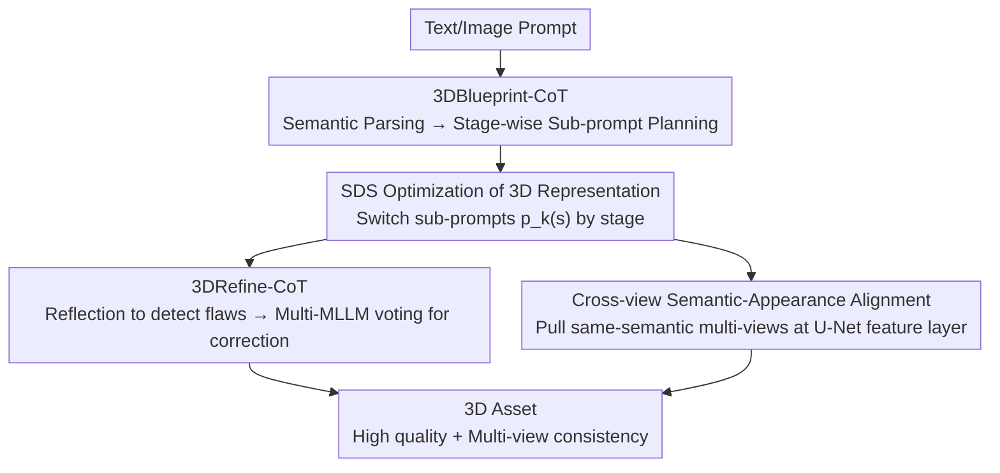

# Think-Then-Generate: Structural Chain-of-Thought Reasoning for Consistent 3D Generation

**Conference**: CVPR 2026  
**Paper**: [CVF Open Access](https://openaccess.thecvf.com/content/CVPR2026/html/Liu_Think-Then-Generate_Structural_Chain-of-Thought_Reasoning_for_Consistent_3D_Generation_CVPR_2026_paper.html)  
**Code**: To be confirmed  
**Area**: 3D Vision / Diffusion Models  
**Keywords**: Text-to-3D, SDS, Multi-view consistency, Janus problem, Structural CoT

## TL;DR
Thoughtful3D introduces Chain-of-Thought (CoT) reasoning into SDS-style 3D generation. It utilizes a "think-then-generate" two-stage structural reasoning framework: 3DBlueprint-CoT for semantic parsing and stage-wise sub-goal decomposition before generation, and 3DRefine-CoT for multi-round reflection-correction of rendering artifacts during generation. Coupled with a cross-view semantic-appearance alignment loss, the method significantly alleviates multi-view inconsistency, the Janus problem, and guidance collapse, achieving comprehensive improvements in quality and consistency for text-to-3D and image-to-3D tasks.

## Background & Motivation

**Background**: Current mainstream text/image-to-3D methods rely on Score Distillation Sampling (SDS), which utilizes pre-trained 2D diffusion models as visual supervision to progressively optimize 3D representations (such as 3D Gaussians or NeRF) based on their rendered outputs.

**Limitations of Prior Work**: 2D diffusion models inherently lack 3D geometric priors, leading to **structural hallucinations** and **multi-view inconsistency** in distilled 3D assets. This manifests as the classic **Janus problem** (multi-face/multi-head artifacts, e.g., a rabbit with three ears or a peacock with multiple heads) and **guidance collapse** when facing complex prompts (e.g., the "jar" entirely disappearing in the prompt "jelly in a jar").

**Key Challenge**: existing methods utilize a **fixed prompt** throughout the entire training process. When prompts are complex, simultaneously optimizing multiple attribute modifiers triggers **gradient competition and feature coverage**. Furthermore, abstract concepts like "elegant" or "cute" lack clear semantic anchors during early geometric initialization, leading to unstable core structure formation. Essentially, the model is expected to satisfy all constraints simultaneously within a single fixed prompt.

**Key Insight**: The authors observe that CoT has been proven effective for "problem decomposition, semantic alignment, and layout planning" in NLP and 2D generation. Consequently, they ask: Can 3D generation also leverage CoT to replace "one-time forced complex prompts" with "plan first, execute step-by-step, and correct while doing"?

**Core Idea**: A two-stage structural CoT is employed to decompose global goals into a series of sub-goals ranging from easy to difficult—**before generation** (3DBlueprint-CoT) for planning and **during generation** (3DRefine-CoT) for reflection and correction. This is supplemented by **cross-view semantic-appearance alignment** to lock in consistency at the feature level. These three components synergistically guide SDS optimization toward high-quality and highly consistent 3D assets.

## Method

### Overall Architecture
Thoughtful3D is a CoT-guided SDS optimization framework that decomposes the "one-step" fixed prompt approach into "think-then-generate + refine-while-generating." Given a text/image input, **before generation**, 3DBlueprint-CoT performs semantic parsing and logical planning to decompose complex prompts into stage-wise sub-prompts. **During generation**, the 3D model is jointly optimized using two mechanisms: 3DRefine-CoT detects rendering inconsistencies (reflection) through structural reasoning and selects the optimal correction via multi-MLLM voting (correction), while cross-view semantic-appearance alignment pulls multi-view features closer based on shared semantics at the U-Net feature layer. The final loss is a weighted sum of SDS, correction reconstruction, and cross-view alignment, driving the optimization of the 3D representation.

### Key Designs

**1. 3DBlueprint-CoT: Decomposing complex prompts into a stage-wise blueprint before generation**

Feeding complex prompts to SDS all at once leads to gradient competition and a lack of geometric anchors for abstract terms, causing structural failure. 3DBlueprint-CoT performs two-stage structural reasoning: **Stage 1: Semantic Parsing** uses a unified MLLM to decompose prompt $p$ into three components $S=\{S_o,S_a,S_h\}=M(p)$, representing the object $S_o$, measurable attribute pairs $S_a$ (e.g., geometric attributes), and abstract concepts $S_h$ (e.g., style). **Stage 2: Planning** combines $p$ and $S$ to generate stage-wise steps $I=\{I_1,\dots,I_K\}$, where each step $I_k=(\tau_k,p_k)$ provides a time interval and the corresponding sub-prompt, with complexity increasing as $k$ increases. During SDS optimization, the loss switches sub-prompts based on the stage: $L_{SDS}(\phi,x)=\mathbb{E}_{i,t,\pi}[\omega(t)\lVert \epsilon_\theta(x_t;t,p_{v(s)})-\epsilon\rVert^2]$, where $v(s)$ maps the $s$-th step to its interval. Typically, $K=3$ is used with a transition window $\Delta T$ for linear interpolation smoothing: $p_1$ focuses on the core object $S_o$, $p_2$ adds $S_c+\lambda_a(s)S_a$ to introduce explicit attributes, and $p_3$ overlays $S_c+S_a+\lambda_h(s)S_h$ for abstract concepts (⚠️ symbols $S_c$/$S_o$ follow the original paper). This allows the model to stabilize the "skeleton" first before adding details like "blue uniform" or "cute."

**2. 3DRefine-CoT: Multi-round reflection-correction with MLLM Consensus Selector**

Even with planning, 3D models may still exhibit hallucinations or low aesthetics. 3DRefine-CoT performs "reflection + correction" during generation. **Reflection Phase**: Each rendered image $V_i$ and prompt $p$ are fed through a structural template $P_e$ into an MLLM to generate hierarchical descriptions $D_i=M(V_i,p;P_e)$. Scores $s_i$ are calculated across three dimensions: structural integrity, semantic alignment, and visual quality. Renderings are categorized into a reference group $V_{ref}$ (above threshold $\theta$) and a target group $V_{target}$. For $V_{target}$, a comparison template $P_c$ takes $(V_i,D_i,V_{ref})$ as input for multi-angle problem analysis, which is then converted into a **negative prompt** $P_{neg}=M(V_i,D_i,V_{ref};P_c)$. Multiple rounds of independent reasoning are performed to yield robust correction suggestions. **Correction Phase**: The target image is noise-fortified to $x_T$ to preserve semantics (following Hallo3D logic), followed by DDIM sampling with positive and reflection-enhanced negative prompts to generate candidate corrections. An **MLLM Consensus Selector** then performs multi-model voting: given $m$ evaluators, evaluator $k$ selects the highest-scoring candidate $e_k=\arg\max_r s_{k,r}$. Candidate $r$ receives votes $c_r=\sum_{k=1}^m \mathbb{1}(e_k=r)$, and the final correction $\hat V$ is chosen via majority vote $r^*=\arg\max_r c_r$. An MSE loss $L_{rc}=\lVert V_i-\hat V_i\rVert_2^2$ between the final correction and the original image is used to update the 3D model.

**3. Cross-view Semantic-Appearance Alignment: Locking consistency across views at the U-Net feature layer**

Original SDS does not consider geometric/semantic correlations between views, leading to deformation and texture inconsistency. The authors find that maintaining feature similarity between views sharing semantics is sufficient for consistent geometry. They propose dynamic cross-view alignment: leveraging the cross-attention in the diffusion U-Net to measure image-text similarity. Given multi-view image query features $Q\in\mathbb{R}^{B,N,D}$ and text key features $K\in\mathbb{R}^{B,M,D}$ ($B$ is the number of viewpoints), a similarity matrix $S=QK^\top$ is computed. For each text feature, the Top-K most similar image query features $Q^K\in\mathbb{R}^{B,K,M,D}$ are retrieved. The alignment loss is defined as $L_{align}=\sum_{1\le i<j\le N}\lVert Q_i^K-Q_j^K\rVert_2$. This forces intermediate features of the same semantics to cluster across views inside the U-Net.

### Loss & Training
The total loss is a weighted sum of three terms: $L_\Theta=\lambda_1 L_{SDS}+\lambda_2 L_{rc}+\lambda_3 L_{align}$, corresponding to stage-wise SDS distillation, 3DRefine-CoT reconstruction MSE, and cross-view semantic-appearance alignment. $\{\lambda_1, \lambda_2, \lambda_3\}$ are hyperparameters. 3DBlueprint-CoT defaults to $K=3$ stages with linear interpolation using transition window $\Delta T$.

## Key Experimental Results

> Metrics: **CLIP Score** is the mean image-text similarity calculated on 16 views sampled uniformly at 360°; **CD** (Chamfer Distance, lower is better) and **Vol. IoU** (higher is better) measure geometric reconstruction quality; **PSNR/SSIM/LPIPS** measure visual quality; **User Study** reflects manual scores across Alignment (Align.), Quality (Qual.), and Consistency (Cons.).

### Main Results
text-to-3D (CLIP Score, higher is better; +Thoughtful3D indicates the method applied to the baseline):

| Method | B/32 | B/16 | L/14 | User Align. | User Qual. | User Cons. |
|------|------|------|------|------|------|------|
| GaussianDreamer | 21.45 | 26.71 | 27.33 | 6.44 | 5.58 | 6.14 |
| +Thoughtful3D | **24.65** | **29.15** | **30.39** | 8.03 | 8.75 | 8.55 |
| Magic3D | 16.28 | 22.52 | 22.75 | 5.02 | 6.30 | 5.32 |
| +Thoughtful3D | 19.64 | 25.14 | 25.27 | 7.72 | 8.31 | 8.09 |
| Fantasia3D | 16.71 | 20.45 | 21.28 | 4.78 | 5.26 | 6.31 |
| +Thoughtful3D | 23.33 | 26.75 | 27.26 | 8.72 | 9.03 | 7.88 |
| DreamFusion-IF | 16.40 | 22.98 | 23.22 | 4.99 | 5.19 | 5.23 |
| +Thoughtful3D | 21.98 | 27.87 | 28.67 | 8.26 | 8.19 | 8.39 |
| SJC | 21.03 | 26.16 | 26.56 | 5.54 | 5.08 | 5.71 |
| +Thoughtful3D | 24.39 | 29.63 | 29.98 | 8.36 | 9.10 | 8.25 |

image-to-3D (Geometric/Visual Quality):

| Method | CD ↓ | Vol. IoU ↑ | PSNR ↑ | SSIM ↑ | LPIPS ↓ |
|------|------|-----------|--------|--------|---------|
| Zero123 | 0.1521 | 0.3203 | 13.586 | 0.7808 | 0.2764 |
| +Thoughtful3D | 0.1398 | 0.3714 | 14.346 | 0.8085 | 0.2453 |
| Wonder3D | 0.1335 | 0.4025 | 16.050 | 0.8201 | 0.2047 |
| +Thoughtful3D | **0.1297** | **0.4343** | **16.353** | **0.8234** | **0.1965** |

### Ablation Study
Module-wise removal (Baseline: GaussianDreamer, CLIP Score). Module A = 3DBlueprint-CoT, B = 3DRefine-CoT, C = Cross-view Semantic-Appearance Alignment:

| Configuration | B/32 | B/16 | L/14 | Description |
|------|------|------|------|------|
| Baseline | 21.45 | 26.71 | 27.33 | Original GaussianDreamer |
| w/o A | 22.76 | 26.86 | 27.56 | w/o Planning: Object omissions, mismatch (green hat becomes blue) |
| w/o B | 23.56 | 28.87 | 29.11 | w/o Refinement: Duplicated facial features, extra limbs |
| w/o C | 23.97 | 27.90 | 29.42 | w/o Alignment: Color drift for the same part across views |
| Thoughtful3D (Full) | **24.65** | **29.15** | **30.39** | Full Model |

### Key Findings
- **Module A (3DBlueprint-CoT) causes the largest drop**: CLIP B/32 drops from 24.65 to 22.76, with qualitative object omissions and attribute mismatches—showing that "planning first" is the foundation of quality.
- **B and C are critical for multi-view consistency**: Removing B introduces duplicated features/limbs; removing C causes color drift between views.
- **Plug-and-play**: The method consistently improves performance across 5 text-to-3D and 2 image-to-3D baselines.

## Highlights & Insights
- Identifying **"fixed prompts" as a root cause** of SDS failure for complex prompts is a key insight: replacing them with stage-wise sub-prompts and transition windows directly mitigates gradient competition.
- **Multi-MLLM voting for correction** is pragmatic: it stabilizes correction quality by avoiding redundant or incorrect suggestions from a single model.
- **Cross-view alignment at the U-Net feature layer** is lightweight and effective, suggesting that consistency constraints should be applied deep within the feature space.

## Limitations & Future Work
- The performance depends heavily on MLLM calls, leading to higher inference costs and latency.
- Sensitivity analysis for hyperparameters like $K=3$, $\theta$, and the loss weights is insufficient.
- Evaluation sample sizes are relatively small, and some qualitative images are from external sources, limiting statistical significance.
- The correction mechanism is limited by the reasoning upper bound of the selected MLLMs.

## Related Work & Insights
- **vs. Original SDS (DreamFusion, etc.)**: These use fixed prompts, leading to Janus/collapse; Thoughtful3D uses CoT planning + refinement as a universal plug-in.
- **vs. Multi-view Diffusion Consistency (Wonder3D, etc.)**: Those often bined to specific architectures; Thoughtful3D's feature alignment and CoT refinement are architecture-agnostic.

## Rating
- Novelty: ⭐⭐⭐⭐ Systematic introduction of two-stage structural CoT to SDS generation.
- Experimental Thoroughness: ⭐⭐⭐ Wide baseline coverage, but small sample scale and lack of cost analysis.
- Writing Quality: ⭐⭐⭐⭐ Clear motivation and well-explained modules.
- Value: ⭐⭐⭐⭐ Practical as a plug-and-play consistency enhancer, though MLLM costs are a barrier.

<!-- RELATED:START -->

## Related Papers

- [\[CVPR 2026\] S$^2$-MLLM: Boosting Spatial Reasoning Capability of MLLMs for 3D Visual Grounding with Structural Guidance](s2-mllm_boosting_spatial_reasoning_capability_of_mllms_for_3d_visual_grounding_w.md)
- [\[CVPR 2026\] Unleashing the Power of Chain-of-Prediction for Monocular 3D Object Detection](unleashing_the_power_of_chain-of-prediction_for_monocular_3d_object_detection.md)
- [\[CVPR 2026\] Multi-view Consistent 3D Gaussian Head Avatars 'without' Multi-view Generation](multi-view_consistent_3d_gaussian_head_avatars_without_multi-view_generation.md)
- [\[CVPR 2026\] C-GenReg: Training-Free 3D Point Cloud Registration by Multi-View-Consistent Geometry-to-Image Generation with Probabilistic Modalities Fusion](c-genreg_training-free_3d_point_cloud_registration_by_multi-view-consistent_geom.md)
- [\[CVPR 2026\] FunFact: Building Probabilistic Functional 3D Scene Graphs via Factor-Graph Reasoning](funfact_building_probabilistic_functional_3d_scene_graphs_via_factor-graph_reaso.md)

<!-- RELATED:END -->
