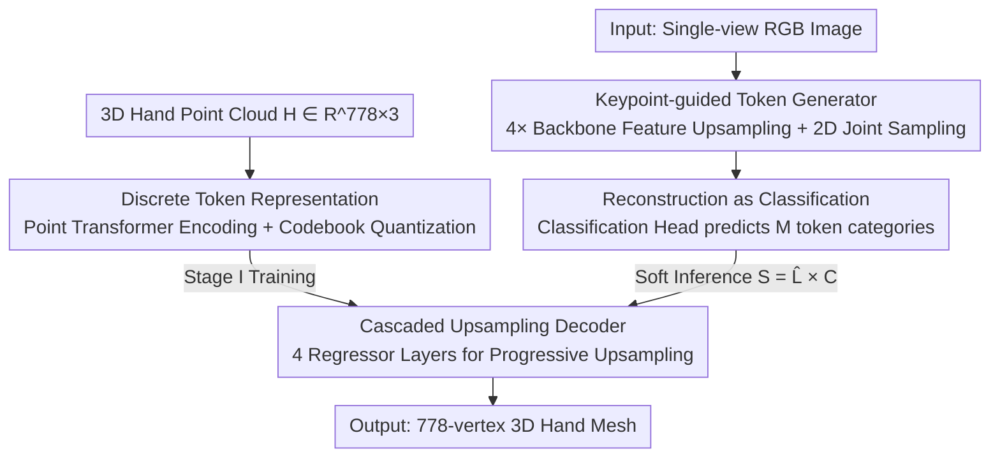

# TokenHand: Discrete Token Representation for Efficient Hand Mesh Reconstruction

**Conference**: CVPR 2026  
**Paper**: [CVF Open Access](https://openaccess.thecvf.com/content/CVPR2026/html/He_TokenHand_Discrete_Token_Representation_for_Efficient_Hand_Mesh_Reconstruction_CVPR_2026_paper.html)  
**Code**: None  
**Area**: 3D Vision  
**Keywords**: Hand mesh reconstruction, discrete tokens, vector quantization, classification-based reconstruction, real-time inference

## TL;DR
TokenHand encodes a 3D hand into $M$ discrete tokens within a shared codebook and reframes "single-image hand mesh reconstruction" from a regression problem to a token classification problem. The classifier predicts the category of each token, while a pre-trained lightweight decoder restores the 778-vertex mesh without post-processing. It achieves a PA-MPJPE of 5.7mm at 65 FPS with only 3.0M parameters on FreiHAND.

## Background & Motivation

**Background**: Mainstream single-view hand mesh reconstruction is divided into two categories. One uses the MANO parametric model as a prior to regress shape/pose coefficients (e.g., HandOccNet, MobRecon); the other directly regresses the 3D coordinates of 778 mesh vertices, utilizing Transformers/GCNs to model vertex relationships (e.g., METRO, MeshGraphormer, PointHMR).

**Limitations of Prior Work**: Both approaches have inherent drawbacks. MANO-based methods suffer from the kinematic chain structure, where pose errors accumulate along the joints—slight deviations at the wrist are amplified into significant displacements at the fingertips, leading to poor robustness. Vertex regression methods often rely on heavy Transformer decoders (102M parameters for METRO, 98M for MeshGraphormer) to recover details, resulting in high accuracy but slow inference and difficult deployment.

**Key Challenge**: A long-standing trade-off exists between reconstruction quality and inference efficiency. Direct regression of continuous vertex coordinates involves a massive output space without strong constraints, which can lead to unrealistic or incomplete hand meshes and requires large models to manage the complexity.

**Goal**: To simultaneously satisfy high accuracy, high robustness, and low latency for real-time applications such as AR/VR and robotic imitation learning.

**Key Insight**: The authors observe that hand geometry is highly structured. A hand can be decomposed into several "sub-structures" (e.g., segments of a finger) whose possible configurations are finite and enumerable. Rather than regressing coordinates in a continuous space, it is more effective to learn a "dictionary of hand parts" (codebook) and compress any hand into dictionary indices.

**Core Idea**: Replace "continuous coordinate regression" with "discrete token classification." First, use VQ to encode the hand into $M$ codebook tokens, then have the network **classify** which codebook entry each token belongs to. The classification results are passed to a frozen decoder to restore the mesh.

## Method

### Overall Architecture

TokenHand takes a cropped single-view RGB image as input and outputs a 3D hand mesh with 778 vertices following the MANO topology. The system consists of two stages: **Stage I learns a discrete token representation of the hand** (encoder + codebook + decoder, purely geometric, no images), and **Stage II reframes image reconstruction as token classification** (backbone + token generator + classification head, reusing the frozen decoder trained in Stage I). The link between the two stages is the shared codebook: Stage I teaches the codebook "what hand parts look like," and Stage II only needs to predict which "word" to use for each part.

### Key Designs

**1. Discrete Token Representation: Compressing a Hand into $M$ Codebook Indices**

The primary challenge is that continuous vertex regression is unconstrained and prone to producing deformed hands. Following the VQ-VAE approach, Stage I uses a Point Transformer encoder $f_e$ to map the hand point cloud $H \in \mathbb{R}^{778\times3}$ to $M$ token features $T=(t_1,\dots,t_M)=f_e(H)$. Each $t_i$ roughly corresponds to a specific hand sub-structure. A **shared codebook** $C=(c_1,\dots,c_K)^\top \in \mathbb{R}^{K\times D}$ is defined, and each token is quantized into a discrete index via nearest neighbor search:

$$q(t_i=k\mid H)=\begin{cases}1 & k=\arg\min_j \lVert t_i-c_j\rVert_2,\\ 0 & \text{otherwise.}\end{cases}$$

Sharing the codebook across all tokens ensures stable and efficient training. The codebook space is sufficient to express diverse hand shapes and poses, transforming "reconstruction" into "selecting combinations from a finite discrete set." This naturally introduces strong priors that prevent deformed meshes.

**2. Reconstruction as Classification: Replacing Coordinate Regression with Token Classification**

Since the hand is represented by $M$ codebook indices, Stage II predicts these instead of continuous coordinates. Given an image $I$, the backbone extracts features $X_b$, the token generator produces token features $X_m$, and the classification head directly predicts the class of each token among the $K$ codebook entries. The output logits $\hat L \in \mathbb{R}^{M\times K}$ are passed to the **frozen** Stage I decoder to restore the mesh.

This is effective because the discrete classification output space is more regular and smaller than the continuous regression space, making it easier for the classifier to learn. Reusing the pre-trained Stage I decoder keeps Stage II extremely lightweight, enabling 65 FPS and only 3.0M parameters. Training is supervised using cross-entropy $\ell_{cls}=\text{CE}(\hat L, L)$, where GT labels $L$ are obtained from the pre-trained encoder.

**3. Cascaded Upsampling Decoder & Anti-Codebook Collapse**

To recover 778 vertices from only $M$ tokens, a **cascaded upsampling mesh decoder** is implemented. It consists of 4 regressor layers in series, each containing a dimensionality reduction layer, a MetaFormer block (with multi-head self-attention), and an upsampling layer. The token count doubles progressively: $[48,97,194,389]\to[97,194,389,778]$, while feature dimensions narrow: $[256,128,64,32]$. Stage I uses a combination of reconstruction L1 and commitment losses:

$$\ell=w_{rec}L_1(\hat H,H)+\beta\sum_{i=1}^{M}\lVert t_i-\text{sg}[c_{q(t_i)}]\rVert_2^2,\quad w_{rec}=10,\ \beta=5,$$

where $\text{sg}$ denotes the stop-gradient. To mitigate **codebook collapse**, EMA updates and a Code Reset mechanism are used to ensure codebook utilization and training stability.

**4. Keypoint-guided Token Generator & Soft Inference**

The token generator extracts spatially aligned features from the backbone. Using keypoint-guidance, the backbone first predicts 2D joint positions. The feature map is **4× upsampled** (to $28\times28$), and spatial locations corresponding to predicted 2D joints are sampled to obtain token features $X_m$.

For training, **soft inference** is utilized: $S=\hat L \times C$. This replaces the non-differentiable argmax with a weighted sum of codebook entries, allowing gradients from the reconstruction loss to flow back to the classification head. The reconstruction loss supervises vertices ($\ell_{vert}$), 3D joints ($\ell_{3d}$), and 2D joints ($\ell_{2d}$):

$$\ell_{rec}=w_{3d}L_{J3d}+w_{2d}L_{J2d}+w_{vert}L_{vert},\quad (w_{3d},w_{2d},w_{vert})=(10,1,10).$$

### Loss & Training
- **Stage I (Tokenization)**: Point Transformer encoder, 4-layer regressor decoder; $512\times512$ codebook; AdamW, lr 6e-3, 200 epochs. Trained on point clouds generated from MANO parameters across multiple datasets (FreiHAND, DexYCB, etc.).
- **Stage II (Reconstruction)**: FastViT-MA36 backbone; AdamW, lr 5e-4, 300 epochs. The decoder remains frozen throughout this stage.

## Key Experimental Results

### Main Results

On FreiHAND (no TTA, no TensorRT), TokenHand leads in both accuracy and speed. Compared to MeshGraphormer, it is $\ge35$ FPS faster and more accurate. Compared to FastViT, it improves PA-MPJPE by 0.9mm at a similar speed.

| Method | Backbone | PA-MPJPE ↓ | PA-MPVPE ↓ | F@05 ↑ | FPS |
|------|------|-----------|-----------|--------|-----|
| MobRecon [9] | DenseStack | 6.9 | 7.2 | 0.694 | 80 |
| METRO [51] | HRNet | 6.7 | 6.8 | 0.717 | 27 |
| MeshGraphormer [29] | HRNet | 6.3 | 6.5 | 0.738 | 24 |
| FastViT [1] | FastViT-MA36 | 6.6 | 6.7 | 0.722 | 84 |
| **Ours** | FastViT-MA36 | **5.7** | **5.9** | **0.768** | 65 |

Regarding parameter efficiency (excluding the backbone), the TokenHand decoder uses only 3.0M parameters, approximately 10% of Transformer-based competitors.

### Ablation Study

| Configuration | PA-MPJPE / PA-MPVPE ↓ | Note |
|------|------|------|
| 1-layer regressor | 6.4 / 6.8 | Insufficient capacity |
| 4-layer, [48, 97, 194, 389] | **5.7 / 5.9** | Progressive ×2 upsampling (Best) |
| Token Gen Method A (Global) | 6.2 / 6.5 | Worst performance |
| Token Gen Method D (28×28 Upsampling) | **5.7 / 5.9** | Default configuration |

### Key Findings
- **Decoder Depth & ×2 Upsampling**: Increasing from 1 to 4 regressor layers significantly reduces PA-MPJPE. Token counts must double progressively; deviations from the ×2 ratio degrade performance.
- **MetaFormer Blocks**: Increasing blocks per layer from 1 to 3 provides no gain, supporting the philosophy of keeping the decoder lightweight.
- **Robustness to Codebook Size**: Performance is stable across codebook sizes (384/512/640), indicating the selected entries adequately cover the hand distribution.
- **Backbone Efficiency**: TokenHand achieves SOTA accuracy across various backbones (ResNet50, HRNet, FastViT).

## Highlights & Insights
- **Reframing Reconstruction as Classification**: This shift leverages the finite nature of hand sub-structures. The discrete output space is easier to learn and provides strong geometric priors.
- **Transferable Paradigm**: Pre-training a geometric codebook and freezing the decoder for downstream image tasks is a powerful paradigm applicable to bodies or faces.
- **Soft Inference**: Using $S=\hat L \times C$ effectively bridges the gap between discrete tokens and differentiable end-to-end training.

## Limitations & Future Work
- **MANO Dependency**: Stage I is tied to the MANO topology (778 vertices), and coverage for extreme hand shapes outside the training distribution remains unverified.
- **Two-Stage Training**: The non-end-to-end nature prevents joint fine-tuning between the codebook/decoder and the classification head.
- **Occlusion & Interaction**: The method lacks explicit modeling for heavy occlusions or complex two-hand interactions.

## Related Work & Insights
- **Vs. MANO Regression**: TokenHand avoids the error accumulation found in kinematic chains by treating sub-structures as discrete classification targets.
- **Vs. Vertex Regression**: Instead of heavy Transformer decoders to recover details (98M-102M params), TokenHand uses a lightweight 3.0M param decoder supported by a codebook prior.

## Rating
- Novelty: ⭐⭐⭐⭐ (Reframing as classification is a clean and effective insight).
- Experimental Thoroughness: ⭐⭐⭐⭐ (SOTA results on two major datasets and systematic ablations).
- Writing Quality: ⭐⭐⭐⭐ (Clear logic and helpful visualizations).
- Value: ⭐⭐⭐⭐ (High deployment value for real-time XR and robotics).

## Related Papers

- [\[CVPR 2026\] PartDiffuser: Part-wise 3D Mesh Generation via Discrete Diffusion](partdiffuser_part-wise_3d_mesh_generation_via_discrete_diffusion.md)
- [\[CVPR 2026\] Aligning Text, Images and 3D Structure Token-by-Token](aligning_text_images_and_3d_structure_token-by-token.md)
- [\[CVPR 2026\] SGI: Structured 2D Gaussians for Efficient and Compact Large Image Representation](sgi_structured_2d_gaussians_for_efficient_and_compact_large_image_representation.md)
- [\[ICCV 2025\] MaskHand: Generative Masked Modeling for Robust Hand Mesh Reconstruction in the Wild](../../ICCV2025/3d_vision/maskhand_generative_masked_modeling_for_robust_hand_mesh_reconstruction_in_the_w.md)
- [\[CVPR 2026\] PAD-Hand: Physics-Aware Diffusion for Hand Motion Recovery](pad-hand_physics-aware_diffusion_for_hand_motion_recovery.md)

<!-- RELATED:END -->

<!-- RELATED:START -->

## Related Papers

- [\[CVPR 2026\] PartDiffuser: Part-wise 3D Mesh Generation via Discrete Diffusion](partdiffuser_part-wise_3d_mesh_generation_via_discrete_diffusion.md)
- [\[CVPR 2026\] Aligning Text, Images and 3D Structure Token-by-Token](aligning_text_images_and_3d_structure_token-by-token.md)
- [\[CVPR 2026\] PAD-Hand: Physics-Aware Diffusion for Hand Motion Recovery](pad-hand_physics-aware_diffusion_for_hand_motion_recovery.md)
- [\[CVPR 2026\] PE3R: Perception-Efficient 3D Reconstruction](pe3r_perception-efficient_3d_reconstruction.md)
- [\[CVPR 2026\] ExMesh: EXplicit Mesh Reconstruction with Topology Adaptation](exmesh_explicit_mesh_reconstruction_with_topology_adaptation.md)

<!-- RELATED:END -->
