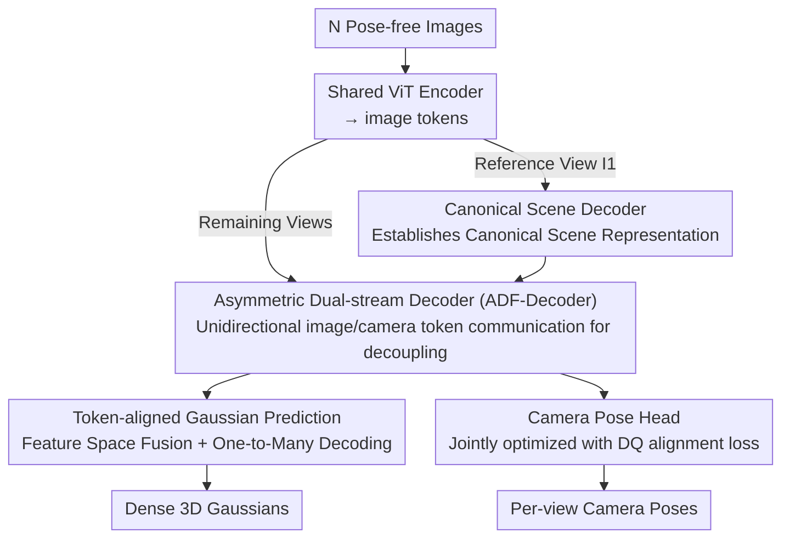

# TokenSplat: Token-aligned 3D Gaussian Splatting for Feed-forward Pose-free Reconstruction

**Conference**: CVPR 2026  
**Paper**: [CVF Open Access](https://openaccess.thecvf.com/content/CVPR2026/html/Li_TokenSplat_Token-aligned_3D_Gaussian_Splatting_for_Feed-forward_Pose-free_Reconstruction_CVPR_2026_paper.html)  
**Code**: https://kidleyh.github.io/tokensplat/ (project page)  
**Area**: 3D Vision  
**Keywords**: 3D Gaussian Splatting, Feed-forward Reconstruction, Pose-free, Multi-view Fusion, Camera Pose Estimation

## TL;DR
TokenSplat is a feed-forward framework that jointly predicts dense 3D Gaussians and camera poses in a single forward pass from arbitrary pose-free multi-view images. Its core is performing token-level cross-view fusion (**Token-aligned Gaussian Prediction**) in the **feature space** instead of pixel/3D space, and decoupling camera pose cues and scene semantics using an **asymmetric dual-stream decoder**, achieving higher reconstruction fidelity and more accurate poses under pose-free settings without iterative optimization.

## Background & Motivation

**Background**: 3D Gaussian Splatting (3DGS) achieves high-quality rendering at a significantly faster speed than NeRF, becoming the mainstream representation for novel view synthesis. To overcome the inefficiency of "optimizing per scene", feed-forward variants have emerged recently—directly predicting 3D Gaussians from input images, which generalize to unseen scenes.

**Limitations of Prior Work**: Most feed-forward methods rely on **precise camera poses** as input, which are usually obtained via SfM/COLMAP. This process is slow and prone to failure in challenging environments such as textureless or sparse-view scenes. To circumvent this, "pose-free" frameworks have emerged, but they generally suffer from two critical pain points:

- **Entanglement of pose and scene**: Scene content and viewpoint cues are crammed into the same set of feature embeddings, making it difficult to separate camera parameters from scene content, and allowing pose errors to directly propagate to 3D reconstruction.
- **Redundancy of pixel-aligned Gaussians**: They inherit pixel-aligned 3DGS heads to generate Gaussians pixel-by-pixel. As the number of views increases, this produces massive overlapping, redundant Gaussians, leading to geometric blur and color inconsistency. Existing efforts (FreeSplat / AnySplat) attempt to fuse Gaussian attributes in the 3D space to reduce redundancy, but the fusion scope is **local**, lacking global contextual reasoning, which often yields fragmented and disconnected reconstructions.

**Key Challenge**: To simultaneously accomplish two goals in a **single feed-forward pass**—both decoupling pose and scene (otherwise pose errors contaminate reconstruction) and aligning multi-view information globally to remove redundancy (otherwise more views lead to blurrier results). However, existing traditional approaches (pixel-level or 3D-space local fusion) break down concurrently when handling "multi-view, dense, and long-sequence" scenarios.

**Key Insight**: The authors observe that **the roots of both redundancy and entanglement lie in "where the fusion/modeling takes place"**. Rather than fusing post-hoc in pixel or 3D Gaussian space, it is better to perform cross-view alignment in the **feature token space** to allow semantically corresponding information to align across long ranges at the feature level. Rather than using symmetric attention to mix camera and image features bi-directionally, it is better to **force unidirectional information flow** to separate pose and scene modeling from the beginning.

**Core Idea**: Use **token-level feature fusion** instead of pixel/3D space fusion to eliminate redundancy, and use **asymmetric dual-stream decoding** instead of symmetric attention to decouple pose from scene, thereby obtaining consistent reconstruction and stable pose estimates simultaneously within a single feed-forward pass.

## Method

### Overall Architecture
TokenSplat takes $N$ pose-free images $\{I_i\}_{i=1}^N$ as input, and outputs a set of 3D Gaussians $\{(\mu_g,\sigma_g,r_g,s_g,c_g)\}$ in a canonical space and the relative camera extrinsic $P_i$ for each view relative to the reference view $I_1$. The entire pipeline is a pure Transformer without iterative refinement. First, a **weight-shared ViT encoder** independently encodes each image into image tokens. The reference view $I_1$ is processed by the **Canonical Scene Decoder** (which ingests information from other views via cross-attention to establish a canonical scene representation). The remaining views are processed by the **ADF-Decoder**, where image tokens and learnable camera tokens are simultaneously refined and decouple pose and scene features through direction-restricted communication. Afterwards, the pipeline branches: the **Camera Pose Head** regresses the pose of each view from the camera tokens, while the **Token-aligned Gaussian Prediction** fuses multi-view tokens in the feature space and decodes them into dense Gaussians.

### Key Designs

**1. Asymmetric Dual-stream Decoder (ADF-Decoder): Decoupling Poses and Scenes in a Single Feed-forward Pass**

Addressing the pain point of "pose and scene entanglement, and error propagation". Traditional methods either use symmetric attention to mix all features bi-directionally (viewpoint cues contaminate scene semantics), or rely on iterative refinement loops to slowly separate pose and geometry. ADF-Decoder introduces a set of **learnable camera tokens** (cloned for each non-reference view, specifically hosting the pose of that view) and imposes **direction-restricted asymmetric updates** on image tokens and camera tokens: image tokens mainly aggregate scene contexts, while camera tokens only extract geometric cues from image tokens and **only pass back stabilized low-frequency pose alignment signals** to the image tokens. Specifically, three-step communication is performed in 12 decoder blocks:
- **Split Self-Attention**: Image tokens perform intra-view self-attention to capture local scene structures $\hat t^I_i \leftarrow \mathrm{Softmax}(Q^I_i {K^I_i}^\top/\sqrt d)V^I_i$; camera tokens extract geometric cues using image tokens as key/value $\hat t^c_i \leftarrow \mathrm{Softmax}(Q^c_i {K^I_i}^\top/\sqrt d)V^I_i$.
- **Cross-View Attention for Image Tokens**: Each view only performs cross-attention with tokens from **other views** (explicitly excluding itself to prevent information leakage), with the key/value concatenated along the spatial dimension $[K^I_j]_{j\neq i}$; a hyperparameter $p_{nv}$ is used to restrict the attention to $p_{nv}-1$ nearest neighbors, balancing context and computation.
- **Cross-Attention for Camera Tokens**: Solely relying on camera tokens or image tokens is insufficient to capture global geometry. Thus, each camera token simultaneously ingests **other views' image tokens and camera tokens** by adding the replicated camera key/value and image key/value: $K^c_{cross_i}=[K^I_j]_{j\neq i}+[\mathrm{repeat}(K^c_j)]_{j\neq i}$ followed by attention.

Furthermore, because the number and information content of image tokens and camera tokens vary significantly, a **camera token modulation (pre/post-modulation)** is applied to image tokens before and after attention to stabilize updates. This "unidirectional, asymmetric" design allows pose inference and scene reconstruction to mutually benefit each other without mutual contamination, which is the key to clean decoupling without relying on iterations.

**2. Token-aligned Gaussian Prediction: Fusing Multi-views in Feature Space and Decoupling Gaussian Density from Pixel Resolution via One-to-Many Mapping**

Addressing the pain point of "pixel-aligned Gaussian redundancy + fragmented local fusion in 3D space". This module consists of two components: **Token Fusion** and **Gaussian Prediction Head**. Token Fusion first predicts a **coarse position** and a **fusion confidence** for each token, and then groups tokens based on spatial proximity with grid size $\epsilon$. They are fused into a set of merged tokens using softmax-normalized confidence weights. This step essentially performs early alignment and merging of semantically corresponding and spatially overlapping information across multiple views in the **feature level**, eliminating overlapping redundancy from the source (the fusion network uses a DPT architecture). The merged Gaussian Prediction Head performs a **one-to-many mapping**: each merged token decodes into **multiple** Gaussians (relative position offsets and Gaussian attributes relative to the token). This decouples the "number of Gaussians" from "pixel resolution", which generates denser, more expressive Gaussians than pixel-wise prediction while maintaining structural integrity and semantic consistency. During prediction, multi-scale features $\{F_i\}$ from different layers of the Transformer are first projected to align channels $\hat F_i=\mathrm{Proj}_i(F_i)$, and then progressively upsampled and fused from deep to shallow layers using residual fusion modules $F^{fusion}_i=\mathrm{RF}_i(\hat F_i,F^{fusion}_{i+1})$, combining fine-grained details and high-level semantics before generating Gaussians. This "feature-space fusion + one-to-many" design is the fundamental reason why TokenSplat does not degrade in long-sequence, high-density scenarios—whereas baseline methods performing local fusion in 3D Gaussian space suffer more severe accumulation of inconsistency and redundancy as the number of views increases.

**3. Camera Pose Head + Dual Quaternion Alignment Loss: Joint Optimization Forcing the Network to Learn Geometrically Consistent Features**

Addressing the issue where "poses require external SfM and pose is disconnected from reconstruction". The Camera Pose Head directly ingests the per-view camera tokens produced by the ADF-Decoder, and regresses the relative extrinsic $P_i$ of each non-reference view relative to $I_1$ via linear projection, completely bypassing external pose initialization such as COLMAP/RANSAC. For training, poses and Gaussian reconstructions are optimized **jointly in an end-to-end manner**: the rendering loss $L_{render}=L_2(I,\hat I)+\lambda_{lpips}L_{lpips}(I,\hat I)$ supervises image quality; the pose loss combines MSE with a **Unit Dual Quaternion (DQ) alignment loss** $L_{align}=\|p\bar I-p\hat p^*\|+\|p I-\hat p p^*\|$. DQ **unifies the representation** of rotation and translation, preventing inconsistencies that arise from separate predictions of rotation and translation. The total loss is $L=L_{render}+\lambda_c L_{pose}$. The significance of joint optimization is that pose supervision forces the network to learn geometrically consistent 3D features, thereby **mutually improving both pose estimation and reconstruction**, rather than calculating them independently and concatenating them.

> ⚠️ The precise notation of terms in the DQ alignment loss formula (such as $p\bar I$ / $pI$, etc.) is subject to Eq.(15) in the original paper.

### Loss & Training
End-to-end training with a total loss of $L=L_{render}+\lambda_c L_{pose}$. The encoder uses ViT-Large (patch size 16), and the encoder-decoder and Gaussian center heads are initialized with MASt3R weights, while the ADF-Decoder and other heads are randomly initialized. Training is conducted on RE10K following the 4-view / 8-view reference setups, and generalizes zero-shot to ScanNet (3/10/28 views). All quantitative results are reported at a resolution of $256\times256$.

## Key Experimental Results

### Main Results

Novel View Synthesis (NVS, RE10K and cross-dataset ScanNet, selected from Tab.1):

| Dataset/Setting | Metric | TokenSplat | Second Best | Description |
|-----------|------|------|----------|------|
| RE10K 8 views | PSNR↑ | **26.15** | 25.20 (FreeSplat) | Even outperforms pose-required FreeSplat by 0.95 dB under dense view settings |
| RE10K 8 views | SSIM↑ | **0.858** | 0.832 (NoPoSplat) | — |
| ScanNet 4 views | PSNR↑ | **28.15** | 27.23 (FreeSplat) | Cross-dataset zero-shot generalization |
| ScanNet 28 views | PSNR↑ | **26.87** | 24.30 (FreeSplat) | No degradation in long sequences, while baselines drop significantly |

Camera Pose Estimation (only compared with pose-free methods, lower is better, selected from Tab.3/4):

| Dataset/Setting | Metric | TokenSplat | Second Best | Description |
|-----------|------|------|----------|------|
| RE10K 8 views | RPE-r↓ | **0.458** | 0.578 (AnySplat) | Decreases by 0.335/0.147 compared to VicaSplat/AnySplat respectively |
| RE10K 8 views | ATE↓ | **0.012** | 0.020 (AnySplat\*) | — |
| ScanNet 28 views | ATE↓ | **0.080** | 0.097 (AnySplat) | Remains stable under multi-view settings |

### Ablation Study (RE10K 8-view, Tab.5)

| Configuration | PSNR↑ | SSIM↑ | RPE-r↓ | Description |
|------|------|------|------|------|
| (a) Full model | 26.15 | 0.858 | 0.458 | Full model |
| (b) w/ Pixel Head | 25.33 | 0.832 | 0.496 | Reverting to pixel-aligned Gaussian head: SSIM ↓0.026, RPE-r ↑0.038 |
| (c) w/ AnySplat Fusion | 25.77 | 0.847 | 0.489 | Using AnySplat-style 3D Gaussian fusion: PSNR is still lower by 0.38 dB |
| (d) w/o ADF-Decoder | 25.88 | 0.845 | 0.504 | Replaces with standard ViT decoder: RPE-r ↑0.046, aggravated pose/scene entanglement |
| (e) w/o intrinsic emb. | 25.54 | 0.835 | 0.471 | Removing camera intrinsic token: scale capture is compromised, while pose remains competitive |

### Key Findings
- **Token-Level Feature Fusion > Pixel-Aligned > 3D Space Fusion**: The progression from (b) $\rightarrow$ (c) $\rightarrow$ (a) demonstrates that performing fusion in the feature token space eliminates redundancy and preserves consistency, contributing most significantly to reconstruction quality. Furthermore, it directly benefits from "the more views, the more stable"—our method does not degrade under 28 views, whilst baselines do.
- **ADF-Decoder Primarily Manages Pose Decoupling**: Removing it (d) mainly spikes RPE-r by 0.046 and increases LPIPS by 0.011, validating the role of direction-restricted communication in separating pose and scene features.
- **Intrinsic Embeddings Primarily Help Scale**: Removing it (e) mainly harms NVS (due to scale ambiguity), while pose degradation is relatively mild.

## Highlights & Insights
- **"Where to fuse" is the core insight**: Shifting cross-view alignment from pixel or 3D Gaussian space to feature token space simultaneously solves redundancy and fragmentation, and naturally scales with the number of views. This is a more structural approach than simply applying a stronger backbone, and can be transferred to any multi-view feed-forward reconstruction.
- **Asymmetric unidirectional attention for decoupling is elegant**: Using direction constraints—where camera tokens only pass back low-frequency stabilized signals, and image tokens mainly absorb scene contexts—replaces expensive iterative refinement to separate pose and geometry. This is an elegant way of embedding "decoupling" directly into the attention architecture.
- **One-to-many token $\rightarrow$ Gaussian mapping decouples density and resolution**: The number of Gaussians is no longer tied to the number of pixels, which can be applied to any scenario where pixel-aligned representations suffer from redundancy.
- **DQ unifies rotation and translation**: Using unit dual quaternions to avoid inconsistencies caused by independently predicting rotation and translation is a valuable minor trick worth replicating in pose regression.

## Limitations & Future Work
- **Dependence on pretrained geometric priors**: The encoder and Gaussian center head are initialized with MASt3R weights. The extent of reliance on this prior and whether training from scratch would work are not fully discussed.
- **Hyperparameter sensitivity**: The cross-view nearest neighbor count $p_{nv}$ and token grouping size $\epsilon$ directly affect fusion granularity and computational cost, but the paper lacks systematic sensitivity analysis.
- **Low evaluation resolution**: All results are reported at $256 \times 256$ resolution. The performance and overhead of token-level fusion under high-resolution or large outdoor scenes remain to be validated.
- **Interpretability of learnable camera tokens**: What geometric quantities the camera tokens actually learn, and whether they remain stable under extreme baselines/pure rotations, warrants further exploration.

## Related Work & Insights
- **vs NoPoSplat / SPFSplat / VicaSplat (pose-free feed-forward)**: They still rely on pixel-aligned 3D Gaussians and pack scene and viewpoint into a single embedding. TokenSplat instead performs token fusion in the feature space alongside asymmetric decoupling, achieving comprehensively superior reconstruction fidelity and pose accuracy.
- **vs FreeSplat / AnySplat (3D-space Gaussian fusion)**: They perform local fusion on 3D Gaussian attributes to reduce redundancy, which lacks global context and becomes fragmented as the number of views increases. Ours dynamically aligns tokens globally in the feature level, remaining stable even at 28 views while competitors degrade.
- **vs MVSplat / FreeSplat (pose-required feed-forward)**: These methods require external SfM poses. TokenSplat jointly estimates poses without requiring any, and even outperforming the pose-required FreeSplat in novel view synthesis under dense view settings.

## Rating
- Novelty: ⭐⭐⭐⭐ Shifting multi-view fusion from pixel/3D space to feature token space + asymmetric dual-stream decoupling is both novel and highly targeted.
- Experimental Thoroughness: ⭐⭐⭐⭐ Evaluated on two datasets spanning sparse to 28-view, covering NVS, poses, cross-dataset generalization, and comprehensive ablations; though the resolution is on the lower side and hyperparameter sensitivity is slightly lacking.
- Writing Quality: ⭐⭐⭐⭐ Clear logical progression overall from motivation to challenges and methods, complete formulations, and well-supported figures and tables.
- Value: ⭐⭐⭐⭐ Pose-free feed-forward reconstruction is a highly practical demand, and the scalability to long sequences stands out as a major highlight.

<!-- RELATED:START -->

## Related Papers

- [\[CVPR 2026\] AnchorSplat: Feed-Forward 3D Gaussian Splatting with 3D Geometric Priors](anchorsplat_feed-forward_3d_gaussian_splatting_with_3d_geometric_priors.md)
- [\[CVPR 2026\] Off The Grid: Detection of Primitives for Feed-Forward 3D Gaussian Splatting](off_the_grid_detection_of_primitives_for_feed-forward_3d_gaussian_splatting.md)
- [\[CVPR 2026\] E2EGS: Event-to-Edge Gaussian Splatting for Pose-Free 3D Reconstruction](e2egs_event-to-edge_gaussian_splatting_for_pose-free_3d_reconstruction.md)
- [\[CVPR 2026\] SR3R: Rethinking Super-Resolution 3D Reconstruction With Feed-Forward Gaussian Splatting](sr3r_rethinking_super-resolution_3d_reconstruction_with_feed-forward_gaussian_sp.md)
- [\[CVPR 2026\] UIKA: Fast Universal Head Avatar from Pose-Free Images](uika_fast_universal_head_avatar_from_pose-free_images.md)

<!-- RELATED:END -->
