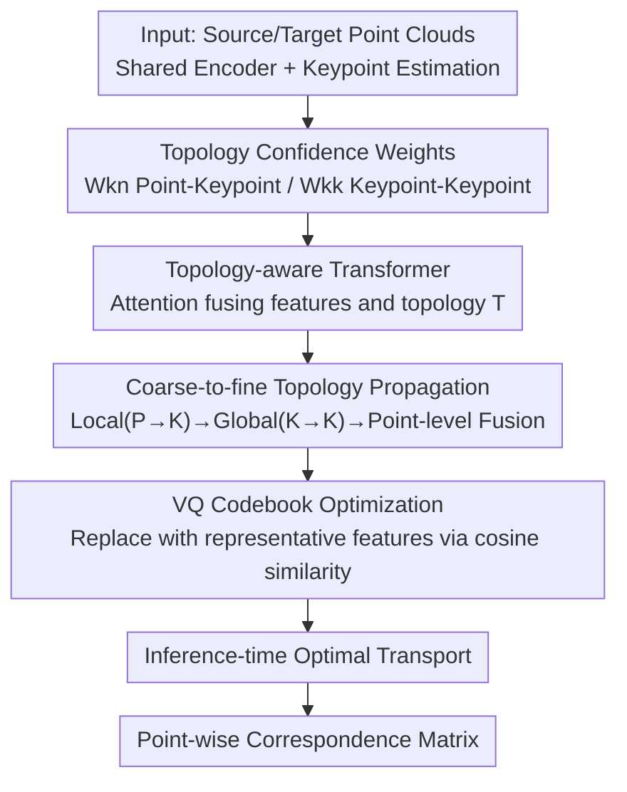

# Topology-aware Feature Propagation for Unsupervised Non-rigid Point Cloud Correspondence

**Conference**: CVPR 2026  
**Paper**: [CVF Open Access](https://openaccess.thecvf.com/content/CVPR2026/html/Chen_Topology-aware_Feature_Propagation_for_Unsupervised_Non-rigid_Point_Cloud_Correspondence_CVPR_2026_paper.html)  
**Area**: 3D Vision  
**Keywords**: Non-rigid point cloud correspondence, unsupervised learning, shape topology, feature propagation, vector quantization codebook

## TL;DR
Addressing the limitation in unsupervised non-rigid point cloud correspondence where "feature propagation based on spatial proximity connects physically disjoint parts," this paper proposes learning deformation-robust **shape topology**. It utilizes topology confidence weights and a Topology-aware Transformer within a "coarse-to-fine" pipeline to propagate features, supplemented by a vector quantization (VQ) codebook, achieving SOTA results across four benchmarks.

## Background & Motivation

**Background**: Non-rigid point cloud correspondence aims to predict a point-wise matching function $f: P_{src}\to P_{tgt}$ between a source point cloud $P_{src}$ and a target point cloud $P_{tgt}$. Since manual annotation of dense correspondence is extremely costly, recent mainstream research has shifted toward unsupervised methods (e.g., CorrNet3D, DPC, SE-ORNet, HSTR), which use "cycle-reconstruction loss" as a proxy supervision to implicitly learn correspondence by reconstructing the source and target from each other.

**Limitations of Prior Work**: These methods almost exclusively rely on **spatial relationships** (typically KNN based on Euclidean distance) for feature propagation or aggregation. However, non-rigid deformations cause drastic changes in spatial positions—for example, when a person raises their hand, the wrist and waist may become spatially close, leading KNN to connect them for feature propagation. Such "non-physical connections" are highly unstable under deformation, causing feature contamination across spatially adjacent but gecometrically distinct regions and leading to mismatches.

**Key Challenge**: While the spatial features of points (coordinates, local orientations) change with deformation, the **shape topology**—the physical connectivity between different parts—remains invariant under changes in pose or coordinates. Existing methods utilize the former while ignoring the latter, essentially discarding the most stable information available.

**Goal**: Under an unsupervised setting, explicitly learn topology information that is robust to deformation and use it to constrain feature propagation, ensuring features are only shared between regions that are "truly physically connected."

**Key Insight**: The authors observe that if a "topology confidence" can be assigned to connections between point pairs or keypoint pairs—high for physical connectivity and low for separation—harmful non-physical connections can be suppressed during propagation. Unsupervised semantic keypoint estimation naturally provides relationship matrices for "point-keypoint" and "keypoint-keypoint" interactions, which can serve as the source for such topology confidence weights.

**Core Idea**: Replace pure spatial proximity with learned **topology confidence weights** to guide feature propagation within a "coarse-to-fine" pipeline. Furthermore, use a vector quantization (VQ) codebook to replace shape-specific features with dataset-level representative features, further enhancing robustness to deformations and shape variations.

## Method

### Overall Architecture
Given source and target point clouds under a shared encoder, the method first utilizes an unsupervised semantic keypoint estimation module to produce $K$ keypoints (acting as superpoints) along with two sets of topology confidence matrices: a point-keypoint matrix $W_{kn}$ and a keypoint-keypoint matrix $W_{kk}$. The base encoder simultaneously provides point-wise features, keypoint features, and "relative geometric relationships in the Local Reference Frame (LRF)." These inputs then enter the **Topology-aware Feature Propagation module**: first performing local propagation (Point → Keypoint), then global propagation (Keypoint → Keypoint), using topology confidence weights to suppress non-physical connections. Subsequently, a **vector quantization codebook** replaces keypoint features with dataset-wide representative features. Finally, the topology-aware keypoint features are fused back into point-wise features to calculate the cosine similarity correspondence matrix, followed by **Optimal Transport** for global optimization during inference to obtain the final correspondence.

### Key Designs

**1. Topology Confidence Weights: Learning "Which Parts are Physically Connected" as a Differentiable Soft Matrix**

The pain point is that KNN-style spatial proximity introduces non-physical connections. This method leverages a semantic keypoint estimation module to output two types of confidence matrices. The point-keypoint matrix $W_{kn}\in\mathbb{R}^{K\times N}$ indicates which points each keypoint should "attend" to, with keypoints themselves aggregated via weighting: $P_K=\text{Softmax}(W_{kn})\times P_N$, making keypoints semantically meaningful superpoints. The keypoint-keypoint matrix $W_{kk}\in\mathbb{R}^{K\times K}$ encodes global topology—connections consistent with the shape topology are assigned high confidence, while those between physically separated parts receive low confidence. These weights are robust to deformation because they are supervised by an unsupervised keypoint loss $\mathcal{L}_{key}$ and learn part connectivity rather than absolute coordinates. While coordinates change with pose, the fact that "the hand is connected to the forearm" remains constant. Visualizations in Fig. 4 confirm that while fully connected graphs are filled with errors, the learned topology maps suppress or eliminate edges across distinct body parts.

**2. Topology-aware Transformer: Propagating Features by "Looking at Features and Topology"**

Standard attention propagates information based solely on feature similarity, failing to inject topological priors. The designed Topology-aware Transformer computes the attention map by multiplying and summing query features $F_Q$, reference features $F_R$, and topology information $T$:

$$A=\text{Softmax}(F_Q\times T + F_Q\times F_R + F_R\times T)$$

Output features are similarly aggregated using three-way cross-multiplication:

$$F_{out}=T\times A + T\times F_R + F_R\times A$$

Where $T$ represents the relative geometric relationship $G$ re-weighted element-wise by the topology confidence $W$. Denoting this process as $\text{Prop}(F_Q,F_R,T)$, the key is that relative geometry between physically separated points in $T$ is "masked" by low confidence. Consequently, attention only passes information along topologically plausible connections, making it more deformation-resistant than pure feature-similarity attention.

**3. Coarse-to-fine Topology Propagation: Local Aggregation → Global Interaction → Point-wise Back-injection**

Propagation at a single scale either captures only local details or only global structures. This method strings $\text{Prop}(\cdot)$ together in three steps:

- **Local Topology Propagation (Point → Keypoint)**: $F_K=\text{Prop}(F_K,F_N,\,G_{kn}\cdot\text{Softmax}(W_{kn}))$. Point-keypoint confidence aggregates features of "topologically related points" into keypoints, creating superpoint features more robust than those from spatial-nearest aggregation.
- **Global Topology Propagation (Keypoint → Keypoint)**: $\hat{F}_K=\text{Prop}(F_K,F_K,\,G_{kk}\cdot\text{Softmax}(W_{kk}))$. Keypoints propagate among themselves while non-physical connections are suppressed by $W_{kk}$, ensuring global feature consistency under deformation.
- **Point-level Feature Fusion (Keypoint → Point)**: $\hat{F}_N=\text{Prop}(F_N,\hat{F}_K,\,G_{nk}\cdot\text{Softmax}(W_{nk}))+F_N$, where $W_{nk}=W_{kn}^{T}$. This injects topology-aware keypoint features back into dense point-wise features, with a residual connection to preserve original details.

This coarse→fine→coarse loop ensures final point-wise features possess both global topological structure and local resolution.

**4. VQ Codebook Optimization: Replacing Shape-specific Features with Dataset-level Representative Features**

Even with topology awareness, features may overfit to specific shape characteristics. This method introduces a vector quantization (VQ) codebook shared across the entire dataset. For each topology-aware keypoint feature $\hat{F}_K$, the most similar representative feature is retrieved via cosine similarity and **directly replaces** it as the output. Since the codebook is shared during training, it forces the model to learn "universal representative features" rather than "shape-specific features," improving robustness to shape/pose variations. Codebook training follows standard VQ strategies with an additional orthogonality term to ensure code vectors are distinct, resulting in loss $\mathcal{L}_{vq}$. Ablations show that the codebook must act on **superpoint (keypoint) features** to be effective; applying it directly to point-wise features causes the error to explode to 32.4 (see Table A2/A) because the point-wise space is too complex for the codebook to learn effectively.

### Loss & Training
The total loss combines correspondence learning with modular constraints:

$$\mathcal{L}_{total}=\lambda_{cc}\mathcal{L}_{cc}+\lambda_{sc}\mathcal{L}_{sc}+\lambda_{m}\mathcal{L}_{neigh}+\lambda_{vq}\mathcal{L}_{vq}+\lambda_{key}\mathcal{L}_{key}$$

Including cycle-reconstruction and neighborhood regularization losses ($\mathcal{L}_{cc}, \mathcal{L}_{sc}, \mathcal{L}_{neigh}$) from DPC, the VQ loss $\mathcal{L}_{vq}$, and keypoint supervision $\mathcal{L}_{key}$. Hyperparameters are $\lambda_{cc}=1, \lambda_{sc}=10, \lambda_m=1, \lambda_{vq}=\lambda_{key}=1$. During implementation, the keypoint network only receives gradients from $\mathcal{L}_{key}$, and backpropagation from the topology module to the base encoder is truncated (the encoder only receives gradients from the residual term of point-level fusion) to prevent the topology module from interfering with basic features. Keypoint count $K=16$, feature dimension $C=512$, codebook size 64, latent dimension 32. Trained on a single 3090 GPU, batch=2, Adam optimizer, initial LR 3e-4. Inference uses Optimal Transport for global correspondence refinement: $f(x_i)=y_{j^*},\ j^*=\arg\max_{j\in\mathcal{N}_Y(x_i)} w_{ij}$.

## Key Experimental Results

Datasets: SURREAL (Train) / SHREC'19 (Test) for humans; SMAL (Train) / TOSCA (Test) for animals. Uniformly $N=1024$ points. Metrics: accuracy (acc, threshold $\epsilon=0.01$, higher is better) and mean correspondence error (err, lower is better). "Ours+" indicates inference with Optimal Transport.

### Main Results

| Method | SURREAL/SHREC acc↑ | SURREAL/SHREC err↓ | SMAL/TOSCA acc↑ | TOSCA/TOSCA acc↑ |
|------|------|------|------|------|
| DPC | 17.7% | 6.1 | 33.2% | 34.7% |
| SE-ORNet | 21.5% | 4.6 | 36.4% | 38.3% |
| DiffCorr | 22.5% | 4.3 | 41.6% | 66.7% |
| DV-Matcher | 27.1% | 4.0 | 39.5% | 56.2% |
| EquiShape(+) | 24.2%(30.3%) | - | -(57.7%) | - |
| **Ours** | **33.2%** | **4.0** | **54.0%** | 63.6% |
| **Ours+** | **37.9%** | **3.2** | **60.5%** | **71.5%** |

Ours shows significant advantages in cross-dataset generalization (SMAL→TOSCA), where it reaches 54.0% compared to DiffCorr's 41.6% (a 12+ percentage point gain), with Ours+ reaching 60.5%. On small training sets (SHREC/SHREC), Ours is "competitive but not optimal" (Ours+ 24.0% vs DV-Matcher 23.9%, DIFF3F 26.4%). The authors note that DIFF3F and DV-Matcher utilize large vision models like DINOv2/ControlNet, which have much higher computational costs.

### Ablation Study

| Config | Coarse-to-fine | Superpoints | $W_{kn}$ | $W_{kk}$ | Codebook | acc↑ | err↓ |
|------|------|------|------|------|------|------|------|
| A | ✗ | - | ✗ | ✗ | ✗ | 31.63% | 5.8 |
| A2 | ✗ | - | ✗ | ✗ | ✔(N×4) | 38.88% | 32.4 |
| B | ✔ | FPS | ✗ | ✗ | ✗ | 32.39% | 5.3 |
| D | ✔ | Keypoint | ✗ | ✔ | ✔ | 32.90% | 4.4 |
| E | ✔ | Keypoint | ✔ | ✔ | ✗ | 32.73% | 4.6 |
| **F (Full)** | ✔ | Keypoint | ✔ | ✔ | ✔ | **33.18%** | **4.0** |

Codebook size ablation (applied to topology-aware features): $K\times4$ (33.18%/4.0) performs best compared to $K\times1$ (32.49%/4.9) or $K\times8$ (32.61%/4.6), suggesting a moderate size is most stable. In terms of efficiency, Ours uses 71.5 GFLOPs / 8.7M parameters / 1044ms, significantly lighter than DIFF3F (>1000 GFLOPs, >100M).

### Key Findings
- **Topology Weights are the Primary Driver**: Moving from A (no topology/no coarse-to-fine) at 31.63%/5.8 to F (Full) at 33.18%/4.0 reduces the error from 5.8 to 4.0. Removing $\mathcal{L}_{vq}$ or $\mathcal{L}_{key}$ causes a drop to acc≈32.5%/err≈4.6, proving both auxiliary losses are essential.
- **Codebook must act on Superpoints**: A2 applies the codebook directly to point-wise features; while acc seems high at 38.88%, err collapses to 32.4. This indicates that the point-wise space is too complex for a codebook to learn meaningful quantization, leading to failed matching. This underscores that one must look at err alongside acc.
- **Robustness to Imperfect Topology**: Selecting 10% of samples with the highest $\mathcal{L}_{key}$ (worst topology estimation) on SHREC, the version with topology (27.3%/5.9) still outperforms the version without (26.8%/6.0), indicating that even fragmentary topology provides useful cues.

## Highlights & Insights
- **Topology Invariance as a Core Prior**: Pose changes, but topology does not. This straightforward observation was often ignored by prior methods relying on spatial-proximity propagation. Using keypoint estimation as a source for "soft topology" avoids the need for extra annotations.
- **Topology-aware Transformer's Cross-Aggregation**: Coupling "Features × Topology" into attention is a transferable module—any graph/point cloud task seeking to inject structural priors into propagation can adopt this $F_Q\times T+F_Q\times F_R+F_R\times T$ construction.
- **Codebook Scale Insight**: VQ codebooks are not "finer is better." Applying them to dense point-wise features leads to failure; they must be applied at the abstract level of semantic superpoints.
- **Coarse→Fine→Coarse Loop**: Aggregating points to keypoints, performing keypoint interaction, and back-injecting into points enables the circulation of global topological structure and local resolution within a single pipeline.

## Limitations & Future Work
- The authors acknowledge: (1) Superpoint and topology estimation quality are not yet perfect, leading to some instability; better keypoint or skeleton estimation is a potential future direction. (2) Sensitivity to unseen point distributions and noise requires density-invariant analysis and denoising.
- Personal Observation: In small training set scenarios (SHREC/SHREC), Ours is not optimal and trails large vision model-based methods (DIFF3F), suggesting that the "dataset-shared codebook" may lack representativeness with very few samples.
- The fixed keypoint count $K=16$ may be insufficient for complex structures or shapes with many parts. Topology confidence is entirely driven by unsupervised keypoint loss, lacking direct topological correctness constraints, which can lead to errors on difficult samples.
- Potential improvements: Introduce explicit skeleton or part-segmentation supervision, make $K$ adaptive to shape complexity, and add density augmentation to improve robustness to real-world scans.

## Related Work & Insights
- **vs Spatial Propagation (DPC / CorrNet3D / HSTR)**: These rely on KNN or Euclidean distance, introducing non-physical connections. Ours suppresses these connections via topology confidence, significantly improving cross-dataset generalization.
- **vs Spectral Methods (Functional Maps)**: Spectral methods rely on the Laplace-Beltrami operator, which is effective on meshes but unstable on point clouds due to noise or disconnected components. Ours is an end-to-end point cloud method that does not require high-quality connectivity.
- **vs Large Vision Models (DIFF3F / DV-Matcher)**: These leverage DINOv2/ControlNet for strong descriptors but have massive GFLOPs/memory requirements. Ours achieves comparable or superior performance on most benchmarks with an order of magnitude higher efficiency.
- **vs SE-ORNet / EquiShape (Rotation Alignment/Equivariance)**: These focus on pose alignment or equivariant features. Ours approaches the problem via topological invariance, which is complementary and shows stronger performance.

## Rating
- Novelty: ⭐⭐⭐⭐ The "topology invariance + topology-aware propagation" approach is clear; while it uses existing keypoint modules, the combination of topology-guided propagation and superpoint-level codebooks is novel.
- Experimental Thoroughness: ⭐⭐⭐⭐ Four benchmarks, cross/same-dataset tests, thorough ablations, and efficiency analysis, though performance on small datasets is not top-tier.
- Writing Quality: ⭐⭐⭐⭐ The transition from motivation to method and experiment is logical, with helpful formulas and visualizations.
- Value: ⭐⭐⭐⭐ A practical SOTA for unsupervised non-rigid correspondence, with insights on topology-aware propagation and codebook scaling that are valuable for related dense matching tasks.

<!-- RELATED:START -->

## Related Papers

- [\[CVPR 2026\] RINO: Rotation-Invariant Non-Rigid Correspondences](rino_rotation-invariant_non-rigid_correspondences.md)
- [\[CVPR 2026\] PointGS: Semantic-Consistent Unsupervised 3D Point Cloud Segmentation with 3D Gaussian Splatting](pointgs_semantic-consistent_unsupervised_3d_point_cloud_segmentation_with_3d_gau.md)
- [\[NeurIPS 2025\] U-CAN: Unsupervised Point Cloud Denoising with Consistency-Aware Noise2Noise Matching](../../NeurIPS2025/3d_vision/u-can_unsupervised_point_cloud_denoising_with_consistency-aware_noise2noise_matc.md)
- [\[CVPR 2026\] Generalized-CVO: Fast and Correspondence-Free Local Point Cloud Registration with Second Order Riemannian Optimization](generalized-cvo_fast_and_correspondence-free_local_point_cloud_registration_with.md)
- [\[CVPR 2026\] Image-to-Point Cloud Feature Back-Projection for Multimodal Training of 3D Semantic Segmentation](image-to-point_cloud_feature_back-projection_for_multimodal_training_of_3d_seman.md)

<!-- RELATED:END -->
