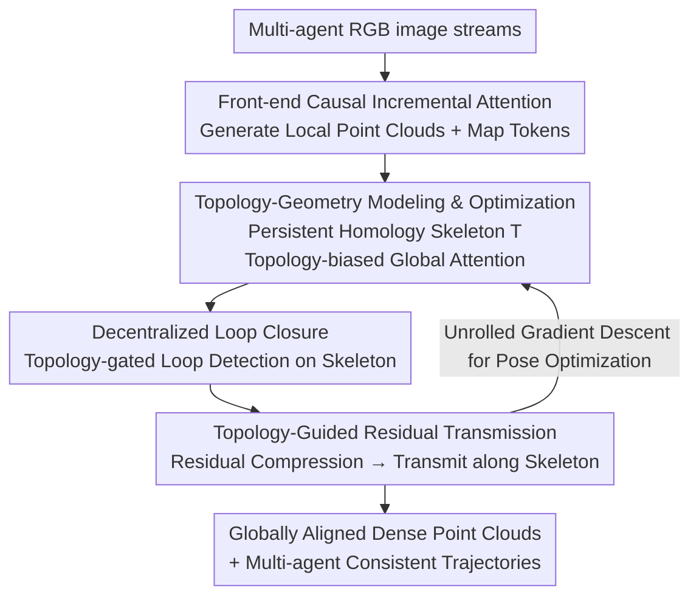

# TopoMA: Topology-Guided Multi-Agent Dense RGB 3D Reconstruction via Distributed Inference

**Conference**: CVPR 2026  
**Paper**: [CVF Open Access](https://openaccess.thecvf.com/content/CVPR2026/html/Zhang_TopoMA_Topology-Guided_Multi-Agent_Dense_RGB_3D_Reconstruction_via_Distributed_Inference_CVPR_2026_paper.html)  
**Area**: 3D Vision  
**Keywords**: Multi-agent 3D reconstruction, Topological skeleton, Distributed inference, Loop closure detection, End-to-end SLAM

## TL;DR
TopoMA utilizes persistent homology to learn a "scene topological skeleton" connecting subgraphs of various agents. This skeleton serves as a unified coordination core for attention bias, loop closure gating, and residual transmission. This allows multiple agents to reconstruct and incrementally optimize local maps under purely distributed, server-free conditions, achieving globally consistent large-scale RGB dense reconstruction using only lightweight topological messages.

## Background & Motivation

**Background**: Multi-agent collaborative 3D reconstruction is the foundation for large-scale VR/AR, robot swarms, and digital twins. Single-camera coverage of complex large scenes is inefficient, necessitating multiple agents to share workloads, accelerate exploration, and compensate for blind spots. Recent end-to-end (learning-based) pointmap methods (VGGT series, SLAM3R, MASt3R-SLAM, etc.) show strong performance in single-agent scenarios.

**Limitations of Prior Work**: These end-to-end methods designed for "single-camera, single-trajectory" scenarios fail when directly applied to multi-agent settings, resulting in unstable tracking, memory explosion, and frequent loop closure failures. In practice, either agents maintain individual maps with severe scale drift and inconsistency, or computation is centralized on a single server, saturating GPU/CPU resources. Furthermore, loop closure detection remains reliant on local geometric heuristics, failing to enforce "global topological consistency" between agents.

**Key Challenge**: The true difficulty in multi-agent reconstruction is not "running several SLAMs in parallel," but rather how to align and fuse sub-maps from different agents in terms of scale and spatial structure under **communication-constrained and heterogeneous trajectory** conditions. Pairwise geometric registration is costly and unstable, while centralized optimization compromises distributed scalability—creating a conflict between accuracy, resources, and decentralization.

**Goal**: To develop a real-time, end-to-end, map-first framework capable of solving both "inter-agent spatial alignment" and "sub-map fusion" while being deployable in a distributed manner under realistic bandwidth constraints.

**Key Insight**: The authors observe that instead of parallelizing individual SLAM systems, it is better to learn a **scene-level topological skeleton**. This skeleton summarizes the connectivity and geometric relationships between different agent sub-maps, which can directly guide attention, fusion, and optimization. Topological structures are inherently more robust to viewpoint changes and scale drift, making them better suited as global anchors across agents than frame-by-frame geometric matching.

**Core Idea**: Treat the "topological skeleton" as the unified coordination core throughout the entire pipeline. Use persistent homology to calculate topological distances between views, serving simultaneously as a global attention bias, a loop closure detection gate, and a routing path for residual transmission. By sharing one graph for these three tasks, globally consistent reconstruction is achieved in a distributed architecture.

## Method

### Overall Architecture
The input to TopoMA consists of RGB image streams from multiple agents, and the output is globally aligned, scale-consistent dense point clouds along with individual agent trajectories. The pipeline consists of two interleaved threads: **Mapping** tokenizes RGB observations from each agent, aggregates them into a topology-aware skeleton, and integrates them with geometric cues to recover consistent structure and scale; **Tracking** allows agents to perform local loop closure detection, update topological constraints, and apply topology-consistent loop closures via "Topological Transformers" in the front-end and back-end. The front-end uses causal incremental attention for local updates, while the back-end uses global attention for global and topological optimization; the entire system runs fully distributed, with each agent maintaining its own local sub-map, gradually converging to global topological consistency.

Three topology-driven contributing components are linked sequentially: **Topology-Geometry Modeling and Optimization** constructs the skeleton and uses it for topology-regularized global attention; **Decentralized Loop Closure** performs topology-gated loop detection and pose correction on the skeleton; **Topology-Guided Residual Transmission** compresses multi-modal residuals and transmits them along the skeleton to an anchor agent, serving as supervision signals while minimizing communication and memory overhead.

### Key Designs

**1. Topology-Geometry Modeling and Optimization: Learning "Which Views to Fuse" via Persistent Homology**

Traditional collaborative methods cannot meet the requirements of end-to-end unified optimization, while end-to-end methods only perform local associations along trajectories, lacking a cross-agent global structural anchor. TopoMA's approach is to first build a topological skeleton: the front-end uses causal attention $f^{causal}_\theta$ on each agent's image $X_{m,t}$ to generate local point clouds $P_{m,t}$ and map tokens $F_{m,t}$, reusing KV-cache $C_m$ to speed up incremental updates. Then, **persistent homology** computes the topological distance matrix $D_{topo}=\{d^{topo}_{mn}\}$ between all pairs of views. A **Maximum Spanning Tree** with candidate return edges is extracted from the similarity graph $G$ to obtain the skeleton $T=(V,E_T)$. Clouds are fused only when topological similarity between two views exceeds a threshold $\tau$ ($S_{mn}=\psi_{topo}(P_{m,t},P_{n,t})>\tau$), with a global update forced every 100 frames.

Crucially, the topological distance is inserted into the global attention as a **bias**. All tokens are pooled into a global memory $Z$, and attention weights are calculated as:

$$\alpha_{ij}=\frac{\exp\left(\frac{Q_i^\top K_j}{\sqrt{d}}-\lambda domestic\, d^{topo}_{ij}\right)}{\sum_{j'}\exp\left(\frac{Q_i^\top K_{j'}}{\sqrt{d}}-\lambda\, d^{topo}_{ij'}\right)}$$

$\lambda$ controls the strength of topological regularization—tokens further away topologically have their attention suppressed, guiding the model to focus only on topologically similar point clouds. Updated tokens $\tilde z_i=\sum_j \alpha_{ij}V_j$ directly regress pose corrections $\Delta T_{m,t}$ and fusion weights $w_{m,t}$, resulting in $P_{global}=\sum_{m,t} w_{m,t}T^{new}_{m,t}P_{m,t}$. Compared to "pairwise geometric registration," topological bias provides a structural prior for global alignment that is more robust to viewpoint/scale changes.

**2. Decentralized Loop Closure: Blocking "False Loops" with Topology Gating**

Classic loop closure relies on expensive global optimization and degrades in dynamic scenes; multi-agent scenarios are particularly vulnerable to cross-agent false loops that distort the map. TopoMA designs an end-to-end, topology-driven loop closure: for each pair of views, a small MLP calculates an appearance-based loop score $s_{(m,t),(n,s)}=\sigma(f_{loop}(F_{m,t},F_{n,s}))$. However, a loop edge is accepted **only if both appearance and topology gates are satisfied**—$s\ge\tau_{loop}$ and the geodesic distance on the skeleton $d^{topo}\le\delta_{topo}$. This topological gate is key: it rejects views that "look similar but are far apart on the skeleton," a common failure point for NaiveLoop.

Accepted loop pairs form $E_{loop}$, which are anchored to the skeleton alongside tree edges $E_T$. The back-end calculates the multi-modal residual between the current estimated relative pose $\tilde T_e=T^{-1}_{n,s}T_{m,t}$ and the network-predicted loop-consistent relative pose $\hat T_e$, applied across pointmaps, depth, and color. This forms the pose refinement energy:

$$E_{pose}=\sum_{e\in E_T\cup E_{loop}}\sum_{j\in\Omega_e}\left(\lambda_{depth}\|r^{depth}_{e,j}\|_2^2+\lambda_{color}\|r^{color}_{e,j}\|_2^2+\lambda_{pointmap}\|r^{pointmap}_{e,j}\|_2^2+\lambda_{topo}\|r^{topo}_{e,j}\|_2^2\right)$$

Unrolled gradient descent steps within the global attention block yield $T^{new}_{m,t}=\Delta T_{m,t}\circ T^{old}_{m,t}$. This process requires no central server for global BA, as topological consistency on the skeleton anchors the loops.

**3. Topology-Guided Residual Transmission: Compressing and Routing Residuals to reduce Distributed Memory**

During loop closure, each edge carries four types of residuals (depth/color/pointmap/topology). If every agent stored all residuals, memory would explode linearly with the sequence length. The residual transmission module uses a permutation-invariant aggregator $g_{edge}$ to compress per-sample residuals into a single edge descriptor $r_e$, then aggregates adjacent edges into a node residual $u_v$. Then, **topology-aware message passing** is performed along the skeleton: $\tilde u_v=\sum_{u\in N(v)}\beta_{v,u}u_u$, where transmission weights $\beta_{v,u}=f_{topo}(d^{topo}_{v,u})$ are a monotonically decreasing function of geodesic distance.

A critical engineering trade-off is made: the skeleton is rooted at a designated **anchor agent** $a_{ref}$. All residuals aggregate toward this anchor, **centralizing global residual information** on a single agent while others retain only local summaries. This significantly reduces overall memory usage. The transmitted residuals serve as extra supervision for the back-end Transformer, requiring consistency with original residuals and pose increments predicted from global tokens:

$$E_{trans}=\sum_{v=(m,t)\in V}\|\tilde u_v-u_v\|_2^2+\mu\,\|h_\theta(\tilde z_{k(m,t)})-g_\theta(\tilde u_v)\|_2^2$$

The total objective is $E_{total}=E_{pose}+\lambda_{trans}E_{trans}$. This "dense but lightweight, frequent but low-overhead" transmission enables distributed reconstruction to maintain global consistency while keeping per-agent memory usage low.

### Loss & Training
The total back-end energy is $E_{total}=E_{pose}+\lambda_{trans}E_{trans}$. $E_{pose}$ is the weighted multi-modal residual energy across four terms ($\lambda_{depth}, \lambda_{color}, \lambda_{pointmap}, \lambda_{topo}$), and $E_{trans}$ is the residual transmission consistency loss ($\mu$ balances the terms). Optimization is performed by **unrolling** several gradient descent steps inside the global attention block. The heaviest supervision is applied to the nodes of the anchor agent $a_{ref}$ to further decrease per-agent memory.

## Key Experimental Results

Datasets: KITTI (outdoor large-scale), Replica (indoor complex), ScanNet (indoor surface reconstruction). Metrics: Trajectory accuracy via RMSE / Mean ATE, reconstruction accuracy via Accuracy (ACC) and Depth L1, alongside FPS and GPU/CPU usage. Single-agent competitors (VGGT-Long, TTT3R, SLAM3R, MASt3R-SLAM, VGGT-SLAM) were simulated as multi-agent; multi-agent competitors include MAGiC-SLAM and CP-SLAM.

### Main Results

KITTI Odometry Trajectory Accuracy (ATE, meters, lower is better, Avg across 5 sub-sequences):

| Method | Avg. RMSE↓ | Avg. Mean↓ | Notes |
|------|-----------|-----------|------|
| VGGT-Long | 24.36 | 19.68 | Strongest single-agent baseline |
| TTT3R | 42.75 | 36.16 | |
| SLAM3R | 71.71 | 58.93 | |
| MASt3R-SLAM | 84.48 | 73.93 | |
| VGGT-SLAM | 94.23 | 77.26 | Frequent [TL] tracking loss |
| **Ours** | **22.51** | **18.32** | Strong performance on KITTI-07 (3.95/3.67) |

Replica Trajectory Accuracy (RMSE, cm), including multi-agent competitors:

| Method | Type | Average RMSE↓ |
|------|------|--------------|
| VGGT-SLAM | Single-agent | 1.17 |
| MAGiC-SLAM | Multi-agent | 1.06 |
| CP-SLAM | Multi-agent | 1.39 |
| **Ours** | Multi-agent | **0.53** |

ScanNet Surface Reconstruction (Avg, cm, lower is better): Ours achieved Depth L1 = 12.19, Acc = 11.10, outperforming the next best VGGT-SLAM (13.80 / 12.60).

### Ablation Study

Loop Closure Ablation (Replica apartment-00, average of 5 runs):

| Configuration | ATE[cm]↓ | FPS↑ | GPU[GB]↓ | CPU[GB]↓ | Description |
|------|---------|------|---------|---------|------|
| NoLoop | 23.81 | 7.35 | 5.10 | 8.20 | Local tracking only, max drift |
| NaiveLoop | 17.94 | 6.82 | 5.50 | 9.10 | MASt3R-style loop, prone to false loops |
| ICP | 15.73 | 6.70 | 5.40 | 9.40 | Sensitive to local minima/scale inconsistency |
| Single-Loop | 11.68 | 6.45 | 5.80 | 9.70 | Single agent loops, no cross-agent consistency |
| **Ours** | **10.45** | 6.21 | 5.92 | 9.96 | Lowest ATE with minimal resource increase |

Residual Transmission Ablation (Replica apartment-00, average of 5 runs):

| Configuration | ATE[cm]↓ | FPS↑ | GPU[GB]↓ | CPU[GB]↓ | Description |
|------|---------|------|---------|---------|------|
| NoTrans-Center| 14.82 | 5.83 | 6.50 | 11.00 | Centralized fusion, heaviest resources |
| NoTrans-Single| 18.34 | 7.42 | 5.10 | 8.50 | Purely local, most efficient but worst ATE |
| MNE-SLAM | 16.71 | 6.01 | 6.80 | 10.50 | Heavyweight fusion |
| Trans-500 | 12.32 | 6.57 | 6.00 | 9.80 | Fusion every 500 frames, drift remains |
| **Ours** | **10.48** | 6.23 | 5.90 | 9.93 | Dense, lightweight, frequent fusion |

### Key Findings
- **Topology-gated loop closure is critical for accuracy**: NaiveLoop (17.94) and ICP (15.73) perform better than NoLoop (23.81) but are significantly outperformed by Ours (10.45). The former methods create false loop edges between topologically distant views, whereas the topology gate blocks these false matches.
- **Multi-agent collaboration provides incremental gains**: Single-Loop (11.68) ranks second but cannot leverage complementary viewpoints from other agents or guarantee multi-agent consistency. Ours reduces this to 10.45, proving the value of cross-agent topological consistency.
- **"Dense but lightweight" is superior to "coarse fusion"**: Trans-500 fuses every 500 frames, leaving visible drift between intervals (12.32). Ours achieves the best ATE (10.48) with frequent lightweight transmission while maintaining lower resource usage than other fusion configurations.
- Centralized approaches (NoTrans-Center, MNE-SLAM) are more accurate than purely local ones but are heavier in GPU/CPU usage and have lower FPS, validating distributed residual transmission as the "sweet spot" for accuracy and efficiency.

## Highlights & Insights
- **Unified reuse of a single topological skeleton**: Topological distances from persistent homology serve as attention bias, loop closure gating, and residual transmission routing. Consolidating these three decisions onto one graph is a highly efficient and self-consistent design.
- **Topology-gated loop closure is a versatile trick**: This structural consistency check can be added to any appearance-based loop closure system to suppress false positives by separating "looking similar" from "structurally proximal."
- **Anchor-centralized residuals solve memory issues**: Centralizing global residuals on a single anchor agent while others retain only local summaries effectively balances "global consistency" with "per-agent lightweight memory."
- Framing pose refinement as a differentiable optimization layer by "unrolling gradient descent into the attention block" allows end-to-end coupling of pose refinement and representation learning.

## Limitations & Future Work
- **Scope limited to static scenes**: The system assumes stable scene structures. Performance degrades with strong dynamic object interference; future work aims to incorporate explicit dynamic modeling.
- **Computation overhead of persistent homology**: The complexity of computing the $D_{topo}$ matrix as agent/view counts scale is not fully discussed, nor is the sensitivity to thresholds like $\tau, \lambda, \delta_{topo}$.
- **Anchor dependency**: Centralizing residuals on one anchor agent saves memory but creates a single point of failure. Robustness to anchor loss or handover was not demonstrated.

## Related Work & Insights
- **vs CP-SLAM**: CP-SLAM uses neural point clouds and a "distributed-to-centralized" strategy which is resource-intensive. TopoMA is purely distributed and more efficient (Replica RMSE 0.53 vs 1.39).
- **vs MAGiC-SLAM**: MAGiC-SLAM uses 3D Gaussians but is restricted in large-scale environments. TopoMA's pointmap fusion is more flexible (RMSE 0.53 vs 1.06).
- **vs MNE-SLAM**: MNE-SLAM is fully distributed but faces persistent communication issues. TopoMA addresses this via topology-guided residual transmission, achieving better ATE (10.48 vs 16.71) and lower resource usage.
- **vs Single-agent end-to-end (VGGT-Long / SLAM3R / MASt3R-SLAM)**: These degrade in multi-agent settings due to tracking loss and drift. TopoMA provides the missing "cross-agent spatial alignment and fusion" component for end-to-end frameworks.

## Rating
- Novelty: ⭐⭐⭐⭐ The triple reuse of a topological skeleton for attention, gating, and routing is highly innovative.
- Experimental Thoroughness: ⭐⭐⭐⭐ Three datasets and various baselines, though lacking sensitivity and overhead analysis for persistent homology.
- Writing Quality: ⭐⭐⭐⭐ Clear formulas and flow, though some notation (e.g., $\psi_{topo}$) is slightly ambiguous regarding distance vs similarity.
- Value: ⭐⭐⭐⭐ Provides a practical direction for server-free reconstruction in large-scale multi-agent scenarios with low memory and global consistency.

<!-- RELATED:START -->

## Related Papers

- [\[CVPR 2026\] ExMesh: EXplicit Mesh Reconstruction with Topology Adaptation](exmesh_explicit_mesh_reconstruction_with_topology_adaptation.md)
- [\[CVPR 2026\] Ov3R: Open-Vocabulary Semantic 3D Reconstruction from RGB Videos](ov3r_open-vocabulary_semantic_3d_reconstruction_from_rgb_videos.md)
- [\[CVPR 2026\] S2D: Sparse to Dense Lifting for 3D Reconstruction with Minimal Inputs](s2d_sparse_to_dense_lifting_for_3d_reconstruction_with_minimal_inputs.md)
- [\[CVPR 2026\] 3D-Aware Multi-Task Learning with Cross-View Correlations for Dense Scene Understanding](3d-aware_multi-task_learning_with_cross-view_correlations_for_dense_scene_unders.md)
- [\[CVPR 2026\] ReWeaver: Towards Simulation-Ready and Topology-Accurate Garment Reconstruction](reweaver_towards_simulation-ready_and_topology-accurate_garment_reconstruction.md)

<!-- RELATED:END -->
