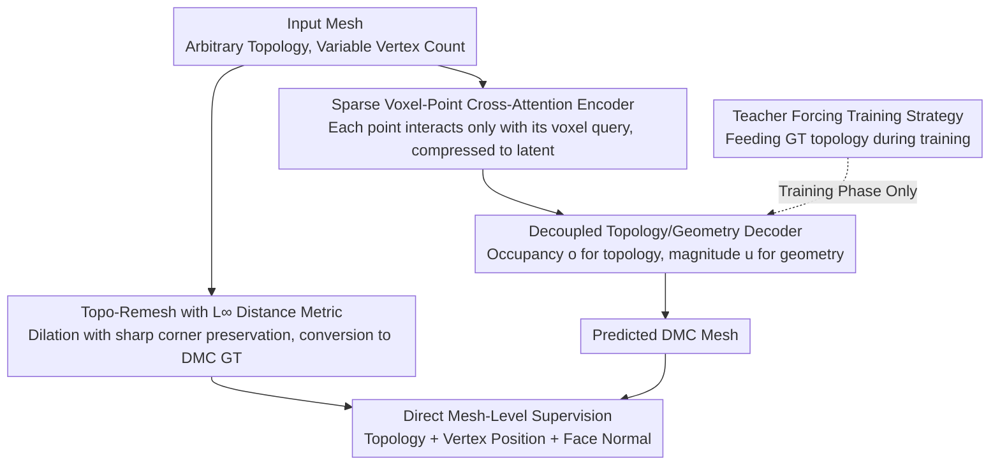

# TopoMesh: High-Fidelity Mesh Autoencoding via Topological Unification

**Conference**: CVPR 2026  
**arXiv**: [2603.24278](https://arxiv.org/abs/2603.24278)  
**Code**: [Project Page](https://logan0601.github.io/projects/topomesh/index.html)  
**Area**: 3D Vision / 3D Generation  
**Keywords**: 3D VAE, Mesh Autoencoding, Topological Unification, Dual Marching Cubes, Sharp Feature Preservation

## TL;DR

TopoMesh is proposed to unify Ground Truth (GT) and predicted meshes under the Dual Marching Cubes (DMC) topological framework. This enables explicit vertex- and face-level correspondence for the first time, supporting direct mesh-level supervision (topology, vertex positions, face normals). The F1-Sharp metric improves by 5.9-7.1% over previous SOTA, demonstrating significant advantages in sharp feature preservation.

## Background & Motivation

1. **Background**: The mainstream paradigm for 3D generation is the VAE-Diffusion pipeline, where the reconstruction capability of the VAE serves as a hard upper bound for generation quality. Existing 3D VAEs encode meshes with arbitrary topology into regular latent representations and decode them for reconstruction.

2. **Limitations of Prior Work**: The core bottleneck is **representation mismatch**. GT meshes possess arbitrary and variable topology (irregular connectivity, different vertex counts), while VAEs typically predict fixed structures (such as SDF on regular grids or rendered images). Establishing explicit mesh-level correspondences between them is difficult, leading to two types of indirect supervision dilemmas:
    - **SDF Supervision** (e.g., 3DShape2VecSet, TripoSG, Direct3D-S2): Meshes are extracted via Marching Cubes (MC). However, MC constrains vertices to linear interpolation on grid edges, making it inherently incapable of representing sharp edges and corners.
    - **Rendering Supervision** (e.g., Trellis, SparseFlex): Decoding via FlexiCubes is more expressive, but supervision is ambiguous—limited resolution, occlusion, and sparse views lead to loss of detail gradients.

3. **Key Challenge**: To achieve high-fidelity reconstruction (especially for sharp features), precise vertex/face correspondence must be established between the predicted and GT meshes, which is hindered by their differing topological structures.

4. **Goal**: Design a VAE that possesses the capability to represent sharp features while maintaining a structure aligned for precise correspondence to enable direct, unambiguous mesh-level supervision.

5. **Key Insight**: Unify both ends (GT and prediction) under the same DMC topological framework. GT is converted to DMC format via remeshing, and the decoder directly outputs DMC-formatted meshes.

6. **Core Idea**: Establish the same DMC structure for both predicted and GT meshes through topological unification, enabling direct vertex/face-level supervision for the first time.

## Method

### Overall Architecture

TopoMesh consists of two core modules: **Topo-Remesh** (converts arbitrary input meshes into DMC-compatible representations while preserving sharp features) and **Topo-VAE** (a sparse voxel encoder + decoupled FlexiCubes decoder to reconstruct meshes in the unified DMC format). The pipeline involves sampling vertices and normals from the input mesh, encoding them into a compact latent representation via sparse voxel-point cross-attention, and decoding a DMC-format mesh. Supervision is applied directly to topology, vertex positions, and face normals using the established correspondences.

### Key Designs

**1. Sparse Voxel-Point Cross-Attention Encoder: Compressing millions of points into computable sparse attention.**

Sampling input meshes often yields millions of points, making global attention computationally infeasible. The authors leverage the fact that each point resides within a specific voxel; thus, interactions are restricted locally. Global attention is replaced with sparse local attention, where each point only scores against the query of its corresponding voxel. This reduces the complexity from $O(N \times P)$ to $O(P)$, lowering VRAM usage from 74GB to 3.8MB. By normalizing point coordinates to the voxel's local coordinate system, all voxels share a single learnable query token. The aggregation for each voxel is:

$$O_i = \sum_{j=1}^{n_i} \text{Softmax}_i\!\left(\frac{Q K_j^\top}{\sqrt{d}}\right) \cdot V_j$$

where $j$ iterates only over $n_i$ points within voxel $i$. This shared query saves parameters and makes the encoder invariant to voxel resolution, supporting progressive training from $32^3 \to 64^3 \to 128^3$.

**2. Decoupled Topology and Geometry Decoder: Splitting SDF sign and magnitude to prevent interference.**

Standard FlexiCubes use a single SDF value $s$ to determine both connectivity (sign) and vertex placement (magnitude). These tasks conflict during training: a sign flip suddenly activates a large geometry loss, which then pushes the topology back into an incorrect state. The solution splits $s$ into occupancy $o$ (topology) and magnitude $u$ (geometry), dividing decoder parameters into a topology group $\text{Topo}=\{o, \gamma\}$ and a geometry group $\text{Geom}=\{u, \alpha, \beta, \delta\}$. Faces are determined independently by topology parameters:

$$F_o = \text{DMC}(o), \qquad V_o = \text{FlexiCubes}(o \times u, \alpha, \beta, \delta, \gamma)$$

Faces receive separate topological supervision, while vertices are refined by all parameters. This prevents gradient contamination.

**3. Topo-Remesh and $L_\infty$ Distance Metric: Replacing point distance with planar distance to avoid rounding sharp corners.**

To convert GT meshes to DMC format, a surface dilation (offset) is required. Traditional $L_2$ distance is point-to-point and rounds off sharp corners. The authors adopt $L_\infty$ distance:

$$D_\infty(P,Q) = \max_{T_i \in \mathcal{T}(Q)} d(P, \Pi_i)$$

This represents the maximum distance from point $P$ to the planes $\Pi_i$ of all adjacent triangular faces of the nearest surface point $Q$. Dilation occurs equidistantly along these planes, forming a polyhedral envelope that preserves original angles. This mathematically prevents sharp corner degradation and allows the entire GPU-based remeshing process to complete in ~15 seconds at $1024^3$ resolution.

**4. Teacher Forcing Training Strategy: Using GT topology to stabilize geometry learning from step one.**

Even with decoupled architecture, early training is difficult because predicted topology is often wrong. Geometry parameters learning on incorrect topology receive unstable gradients. Inspired by sequence models, the authors apply teacher forcing by feeding GT occupancy $o_{gt}$ to the decoder during training. Geometry parameters thus receive stable gradients under the correct topological configuration. During inference, both are predicted independently. Stabilization also includes GT-guided voxel pruning and progressive resolution training.

### Loss & Training

The total loss includes: topology loss (BCE on occupancy), vertex loss (L1 on vertex positions), normal loss (L1 on face normals), FlexiCubes regularization, consistency loss, voxel pruning loss, and KL divergence loss. Training utilizes AdamW (lr=0.0001) on a dataset of 320K shapes with a batch size of 64. Resolution progresses from $32^3 \to 64^3 \to 128^3$ over 700K steps.

## Key Experimental Results

### Remesh Quality

| Method | Device | Thingi10K CD↓ | Thingi10K ANC↑ | Objaverse ANC↑ | Time↓ |
|------|------|--------------|----------------|----------------|-------|
| ManifoldPlus | CPU | **1.347** | 0.981 | 0.780 | 79.4s |
| Dora | GPU | 1.492 | 0.970 | 0.961 | 116.3s |
| **TopoMesh** | **GPU** | 1.479 | **0.984** | **0.964** | **18.5s** |

Topo-Remesh achieves the highest normal consistency (ANC) while being 4-9 times faster than other methods.

### VAE Autoencoding Reconstruction

| Method | #Latent | Topo-Bench F1-S↑ | Dora-Bench F1-S↑ | Dora-Bench CD↓ |
|------|---------|------------------|------------------|----------------|
| TripoSG | 4096 | 0.715 | 0.717 | 1.697 |
| Dora | 4096 | 0.754 | 0.768 | 1.814 |
| SparseFlex | 244691 | 0.873 | 0.844 | 1.625 |
| **TopoMesh** | **56006** | **0.932** | **0.915** | **1.126** |

F1-Sharp results show a 5.9% improvement over SparseFlex on Topo-Bench and 7.1% on Dora-Bench, using only 1/4 of the latent tokens.

### Ablation Study

| Configuration | CD↓ | F1↑ | F1-S↑ | ANC↑ |
|------|-----|-----|-------|------|
| Rendering Supervision | 1.731 | 0.776 | 0.711 | 0.932 |
| **Mesh-Level Supervision** | **0.150** | **0.975** | **0.991** | **0.999** |
| Res 32 | 1.812 | 0.933 | 0.790 | 0.968 |
| Res 128 | 1.126 | 0.973 | 0.915 | 0.995 |

Direct mesh-level supervision shows an absolute advantage over rendering supervision, with CD reduced by a factor of 11.5.

### 3D Generation

| Method | Toys4K FID↓ | Toys4K KID (×10³)↓ |
|------|-------------|---------------------|
| Hunyuan3D-2.1 | 59.43 | 5.97 |
| Trellis | 59.61 | 6.03 |
| Direct3D-S2 | 45.33 | 5.47 |
| **TopoMesh** | **42.48** | **4.63** |

### Key Findings

- Topological unification is the core breakthrough: DMC enables exact vertex and face correspondence.
- $L_\infty$ distance metric is vital for sharp feature preservation, maintaining original dihedral angle distributions.
- Teacher Forcing effectively resolves the "see-saw" conflict between topology and geometry during training.
- Topo-VAE achieves superior quality with only 56K latent tokens (1/4 of SparseFlex) due to efficient gradient propagation from direct supervision.

## Highlights & Insights

- **Fundamental Innovation in "Topological Unification"**: Rather than seeking better indirect supervision for mismatched representations, the authors eliminate the mismatch itself.
- **Angle-Preserving Property of $L_\infty$**: Using max-over-incident-planes mathematically solves the angle degradation problem during dilation and is naturally robust to topological defects.
- **Combination of Decoupling and Teacher Forcing**: Splitting FlexiCubes parameters and breaking conditional dependence via Teacher Forcing creates a synergistic effect.
- **DMC Compression Efficiency**: A voxel's mesh information is stored using only 3×10 bit coordinates + 8 bit occupancy + 3×10 bit offset + 3 bit triangulation logic, significantly faster than Draco.

## Limitations & Future Work

- High-resolution upsampling generates millions of voxels, incurring significant computational overhead.
- Remeshing is constrained by base resolution; details smaller than voxel size cannot be captured.
- Progressive training takes 700K steps; training efficiency could be improved.
- The Teacher Forcing training-inference gap might manifest in extreme scenarios.
- Adaptive resolution strategies for sharp feature areas could be explored.

## Related Work & Insights

- **vs SparseFlex**: SparseFlex uses rendering supervision with an F1-Sharp of 0.873; TopoMesh reaches 0.932 with direct supervision and 1/4 the latent tokens.
- **vs Trellis**: Trellis is limited by $256^3$ resolution and rendering supervision, yielding lower reconstruction quality.
- **vs TripoSG/Dora**: VecSet-based VAEs struggle with fine-grained geometry. TopoMesh's sparse voxel design is naturally suited for high-resolution local details.
- **Insight**: The concept of unifying prediction and GT formats can be extended to point clouds, implicit fields, and other 3D representations.

## Rating

- Novelty: ⭐⭐⭐⭐⭐ The topological unification paradigm addresses the core bottleneck of 3D VAEs.
- Experimental Thoroughness: ⭐⭐⭐⭐⭐ Comprehensive coverage across Remesh, Autoencoding, and Generation.
- Writing Quality: ⭐⭐⭐⭐⭐ Precise problem definition and clear logical derivation.
- Value: ⭐⭐⭐⭐⭐ A foundational improvement for 3D VAEs that raises the upper bound for downstream generation quality.

<!-- RELATED:START -->

## Related Papers

- [\[CVPR 2026\] FACE: A Face-based Autoregressive Representation for High-Fidelity and Efficient Mesh Generation](face_a_face-based_autoregressive_representation_for_high-fidelity_and_efficient_.md)
- [\[CVPR 2026\] CraftMesh: High-Fidelity Generative Mesh Manipulation via Poisson Seamless Fusion](craftmesh_high-fidelity_generative_mesh_manipulation_via_poisson_seamless_fusion.md)
- [\[CVPR 2026\] HyperGaussians: High-Dimensional Gaussian Splatting for High-Fidelity Animatable Face Avatars](hypergaussians_high-dimensional_gaussian_splatting_for_high-fidelity_animatable_.md)
- [\[CVPR 2026\] LATTICE: Democratize High-Fidelity 3D Generation at Scale](lattice_democratize_high-fidelity_3d_generation_at_scale.md)
- [\[CVPR 2026\] High-Fidelity Mobile Avatars with Pruned Local Blendshapes](high-fidelity_mobile_avatars_with_pruned_local_blendshapes.md)

<!-- RELATED:END -->
