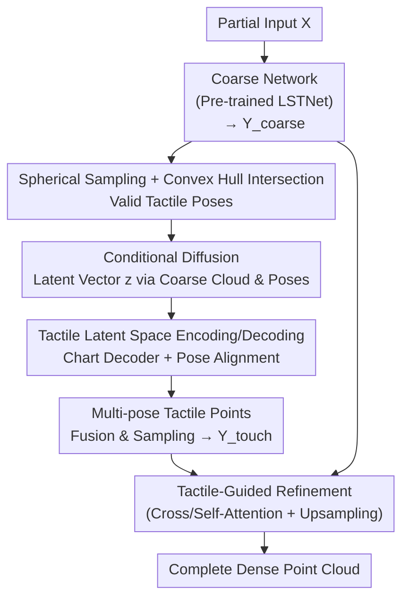

# TouchDream: 3D Object Completion through Imagined Touch

**Conference**: CVPR 2026  
**Paper**: [CVF Open Access](https://openaccess.thecvf.com/content/CVPR2026/html/Wang_TouchDream_3D_Object_Completion_through_Imagined_Touch_CVPR_2026_paper.html)  
**Area**: 3D Vision  
**Keywords**: Point cloud completion, tactile generation, diffusion model, local geometry, cross-modal guidance

## TL;DR
TouchDream uses a conditional diffusion model to "imagine" tactile signals on object surfaces—generating compact tactile latent vectors from coarse point clouds and sampled poses. These vectors are decoded into local geometry and fused back into the point cloud. This provides fine-grained local geometric guidance for point cloud completion without any physical touch, achieving SOTA performance on PCN, ShapeNet55-34, and KITTI.

## Background & Motivation

**Background**: There are two mainstream paradigms for point cloud completion (recovering complete dense geometry from partial scans). One is coarse-to-fine: generating a coarse shape first and then refining missing regions using multi-granularity features or geometric symmetry (e.g., PCN, SeedFormer, AnchorFormer, CRA-PCN, SymmCompletion). The second is the generative paradigm: using diffusion models to directly denoise complete point clouds or generate auxiliary cues to facilitate reconstruction (e.g., PVD, NSDS, 3DQD, PCDreamer).

**Limitations of Prior Work**: In coarse-to-fine methods, when the input lacks critical structures, the refinement stage relies on "unconstrained local guessing" without geometric basis for the generated details. Generative paradigms often suffer from poor reconstruction quality for severely incomplete inputs and tend to introduce geometric inconsistencies due to a lack of supplementary information. Both paths share a common weakness—the absence of a reliable external signal to "constrain local geometry."

**Key Challenge**: Completion is ill-posed; while global structure can be extrapolated based on priors, local details in missing regions are impossible to constrain without additional information. Visual auxiliary signals (multi-view depth/RGB) excel at global structure but do not directly correspond to precise local 3D contact geometry. Tactile signals, which excel at local geometry, traditionally require multiple physical contacts with real sensors—a process that is risky, potentially damaging, and often requires fixing the object in place.

**Goal**: To obtain the benefits of tactile signals—high-fidelity local 3D geometry that can be directly fused with point clouds—while eliminating the cost of physical touch.

**Key Insight**: The authors observe two unique advantages of tactile signals over vision: (1) tactile signals provide high-fidelity local 3D shapes (contact point positions, fine surface details), which are exactly what is missing for reconstructing local geometry; (2) decoded local tactile point clouds can be directly fused with coarse point clouds in 3D space, which is more direct and effective than visual cues. Since tactile signals are so beneficial, can they be "imagined" instead of physically collected?

**Core Idea**: Reformulate "tactile perception" as a **learnable generative modeling task**. A diffusion model is used to "dream" tactile signals on the object surface in a latent space, which are then decoded into local geometry to refine the coarse point cloud. In short: replace physical touch with diffusion-generated "imagined touch" to inject fine-grained local constraints into the completion network.

## Method

### Overall Architecture

The TouchDream pipeline follows a "coarse completion → imagined touch → tactile-guided refinement" sequence. During inference, the partial input $X$ passes through a pre-trained coarse completion network (LSTNet from SymmCompletion) to obtain $Y_{coarse}$. Then, a batch of tactile poses is sampled on the object surface. For each pose, a conditional diffusion model generates a tactile latent vector, which a chart decoder then transforms into local geometry in the world coordinate system. Local points from all poses are merged and sampled into $Y_{touch}$. Finally, $Y_{touch}$ serves as guidance to refine $Y_{coarse}$, outputting the complete dense point cloud.

The tactile generation model consists of three components: tactile pose sampling from the coarse point cloud (§3.1), a tactile encoder with a chart predictor for latent encoding/decoding (§3.1), and a conditional diffusion model generating tactile latent vectors from poses and coarse points (§3.2).

### Key Designs

**1. Spherical Sampling + Convex Hull Intersection: Determining "Where to Touch" without actual touching**

To "imagine touch," the model must first determine the tactile poses on the object. The authors follow the interaction action space definition from [23,28]: 50 discrete points are uniformly sampled on a sphere centered at the object's centroid. Each point projects an approach ray toward the object, and the intersection with the object's convex hull defines the contact point, determining rotation and translation. Only valid poses (where rays intersect the hull) are used for training and inference. This step discretizes the "infinite 3D contact space" into a set of enumerable, batch-processable candidate poses.

**2. Tactile Latent Space Encoding/Decoding + Pose Alignment: Compressing tactile signals and correcting "Coarse Pose vs. Real Surface" misalignment**

Generating 3D tactile signals or images directly is difficult because tactile distribution is strongly correlated with local curvature. The authors map tactile signals to a 1D latent vector $z$. An encoder extracts $z$ from tactile images, and a local chart prediction network decodes it. The chart starts from a template of 25 vertices/faces; the network predicts deformed 3D coordinates for each vertex while keeping connectivity fixed, essentially parameterizing the local surface as a deformable "patch."

A critical conflict is addressed: the poses used by the model come from the **coarse point cloud**, while the supervision signals come from the **ground truth (GT) surface**, leading to pose bias. An additional pose alignment network is introduced. It extracts features from coarse points and sampled poses, concatenates them with $z$, and uses an MLP to predict rotation/translation parameters to align the predicted chart with the GT surface. This alignment network is essential for bridging the gap between coarse sampling and the true surface.

**3. Conditional Diffusion for Tactile Latent Vectors: Turning tactile perception into a generative distribution**

With the latent space established, the authors use a diffusion model $\epsilon$ to model the distribution of tactile latent vectors. During training, Gaussian noise is added to $z_0$ at random timesteps $t$ to obtain $z_t$. The model reconstructs $z_0$ conditioned on the coarse point cloud and pose:

$$L_{diff} = \big\| \epsilon\big(z_t,\ \tau(t)\,\big|\,\omega_Y(Y_{coarse}),\ \omega_p(p)\big) - z_0 \big\|_2$$

where $\tau(t)$ is the timestep embedding. Conditions are provided by a point embedding module $\omega_Y$ (using FPS+KNN and MLP+max pooling) and a pose encoder $\omega_p$. The diffusion network is based on the DiffusionSDF framework with a DALLE-2 architecture, using cross-attention for condition injection. During inference, it iteratively denoises from $z_T \sim N(0,1)$. This "imagines" tactile signals consistent with the current coarse shape and pose without physical interaction.

**4. Tactile-Guided Refinement: Using imagined touch as local detail cues**

Finally, local charts from all poses are merged and sampled into a tactile point set $Y_{touch}$ to refine $Y_{coarse}$. The refinement network follows SymmCompletion but replaces symmetry guidance with tactile guidance. Cross-attention allows coarse point geometric features to "query" imagined tactile features, followed by self-attention for internal aggregation. The merged representation is fed into an upsampling network (self-attention + point-shuffle) to predict offsets for a dense point cloud. The loss is the total Chamfer Distance (CD):

$$L = \sum_{i=1}^{n} L_{CD}(Y_{gt},\ Y_i)$$

This is effective because tactile points provide actual local geometry (contact positions and surface details), filling the gap where coarse-to-fine methods otherwise perform "unconstrained guessing."

### Loss & Training
The model is trained in three stages: tactile latent space (500 epochs, Adam, lr 1e-5); diffusion model (500 epochs, Adam, lr 2e-4); and tactile-guided refinement (420 epochs, AdamW, lr 2e-4). All training was conducted on a single RTX 4090 with a batch size of 16. During fusion, 256 tactile points are randomly sampled from valid poses. Tactile data is downscaled by 3.1x before entering the diffusion model and rescaled after generation.

## Key Experimental Results

### Main Results

PCN Dataset (L1 CD ×10³, lower is better; F1@1% higher is better):

| Method | CD-Avg ↓ | F1 ↑ | Plane | Chair | Lamp |
|------|---------|------|-------|-------|------|
| SeedFormer | 6.74 | 0.82 | 3.85 | 7.06 | 5.21 |
| AnchorFormer | 6.59 | 0.83 | 3.70 | 7.05 | 5.21 |
| CRA-PCN | 6.39 | - | 3.59 | 6.70 | 5.06 |
| PCDreamer | 6.49 | 0.86 | 3.52 | 6.71 | 5.64 |
| SymmCompletion | 6.28 | 0.85 | 3.53 | 6.52 | 5.06 |
| **TouchDream (Ours)** | **6.05** | **0.87** | **3.39** | **6.34** | **4.91** |

ShapeNet55/34 (L2 CD ×10³, lower is better):

| Method | 55-Class Avg ↓ | 34 seen ↓ | 21 unseen ↓ |
|------|------------|-----------|-------------|
| AnchorFormer | 0.58 | 0.70 | 1.19 |
| CRA-PCN | 0.66 | 0.76 | 1.24 |
| PCDreamer | 0.98 | 0.76 | 1.09 |
| SymmCompletion | 0.50 | 0.60 | 0.97 |
| **TouchDream** | **0.42** | **0.59** | **0.66** |

KITTI real-world generalization (sim-to-real trained on ShapeNet Car): FD 1.43 (Ours) vs 2.54 (SymmCompletion); MMD 0.71 (Ours) vs 1.72 (SymmCompletion), showing significant leads in both metrics.

### Ablation Study

| Configuration | CD-Avg ↓ | Description |
|------|---------|------|
| Skeleton Guidance S-GT | 6.04 | Guided by GT skeleton points |
| Gen. Tactile T-GEN (Ours) | 6.05 | Guided by imagined touch |
| GT Tactile T-GT | 5.93 | Guided by simulator GT tactile (Upper bound) |
| Symmetry only (SymmCompletion) | 6.28 | Using only symmetry prior |
| Tactile only | 6.05 | Using only imagined touch |
| Symm + Tactile combo | 6.02 | Combination of both |

### Key Findings
- **Imagined Touch ≈ GT Tactile**: T-GEN (6.05) is very close to T-GT (5.93), proving that diffusion-based "dreaming" closely approximates real tactile data from a simulator. GT tactile (5.93) is better than GT skeleton points (6.04), indicating tactile information is more useful for completion than skeletal structures.
- **Tactile Guidance exceeds Symmetry Guidance**: Tactile only (6.05) significantly outperforms symmetry only (6.28). Tactile signals provide robust detail recovery for highly incomplete inputs where symmetry priors might fail.
- **Strongest Improvement in Unseen Categories**: In ShapeNet34, the 21 unseen categories improved from 0.97 to 0.66. This suggests imagined touch learns fundamental local shape priors rather than memorizing category templates.
- **Sensitivity to Pose Error**: CD increases when pose estimation is noisy. Training with data augmentation (DA) using random noise significantly improves robustness, reducing CD from 6.183 to 6.087 under higher noise levels.

## Highlights & Insights
- **Reframing Perception as Generation**: Traditional tactile reconstruction requires physical contact. Reframing this as a generative task using diffusion in latent space avoids physical risks and the need to fix objects. This approach is transferable to other high-cost sensing modalities.
- **Generation in 1D Latent Space**: By mapping tactile signals to 1D latent vectors and using a chart decoder, the model avoids high-dimensional 3D generation while preserving fine local geometry.
- **Pose Alignment Network for Distribution Gap**: The alignment network explicitly compensates for the systematic bias between poses sampled from coarse clouds and the GT surface.
- **Direct 3D Fusion**: Tactile signals decode directly into 3D points, bypassing the cross-modal alignment issues often found with visual auxiliary cues.

## Limitations & Future Work
- **Dependency on Coarse Quality**: If the initial coarse prediction is too far from the ground truth, the "imagined" tactile signals will also be biased.
- **Requirement for Mesh Supervision**: Training requires object meshes to render tactile images, limiting scalability to data without meshes (e.g., raw real-world scans).
- **Computational Overhead**: Generating latent vectors and decoding/sampling for each pose is expensive (6.7 hours for 1200 PCN shapes on one 4090), which is far from real-time.
- **Future Directions**: The authors suggest learnable active pose sampling (via RL) instead of uniform sampling, integrating tactile and vision into a unified multimodal generative framework, and using imagined touch to refine 3D Gaussians from single images.

## Related Work & Insights
- **vs. SymmCompletion**: Uses a similar refinement structure but replaces symmetry priors with tactile guidance. Tactile guidance is superior for asymmetric objects or those with missing critical structures.
- **vs. Physical Tactile Reconstruction**: Methods using GelSight/Digit require physical interaction; TouchDream requires only a coarse point cloud to "imagine" these signals.
- **vs. Visual-Aided Completion**: Visual cues (multi-view depth/RGB) are better for global structure but weaker for precise local geometry and require complex cross-modal alignment.
- **vs. Direct Diffusion Completion**: Directly denoising entire clouds can lead to inconsistency in severely incomplete inputs; TouchDream uses diffusion only for "tactile cues," delegating fusion to a deterministic network.

## Rating
- Novelty: ⭐⭐⭐⭐⭐ Reframing tactile perception as a diffusion task is a novel and self-consistent entry point for point cloud completion.
- Experimental Thoroughness: ⭐⭐⭐⭐ Solid benchmarking on PCN/ShapeNet/KITTI with detailed ablations. However, gains on "seen" categories are modest.
- Writing Quality: ⭐⭐⭐⭐ Clear motivation and methodology. More formulas regarding the latent space/alignment network would enhance reproducibility.
- Value: ⭐⭐⭐⭐ The "generation as sensing" paradigm is valuable for unseen generalization, though computational costs limit immediate deployment.

<!-- RELATED:START -->

## Related Papers

- [\[CVPR 2026\] Wave-Former: Through-Occlusion 3D Reconstruction via Wireless Shape Completion](wave-former_through-occlusion_3d_reconstruction_via_wireless_shape_completion.md)
- [\[CVPR 2026\] The Midas Touch for Metric Depth](the_midas_touch_for_metric_depth.md)
- [\[CVPR 2026\] MAGICIAN: Efficient Long-Term Planning with Imagined Gaussians for Active Mapping](magician_efficient_long-term_planning_with_imagined_gaussians_for_active_mapping.md)
- [\[CVPR 2026\] LaS-Comp: Zero-shot 3D Completion with Latent-Spatial Consistency](las-comp_zero-shot_3d_completion_with_latent-spatial_consistency.md)
- [\[CVPR 2026\] ComPose: A Unified Completion-Pose Framework for Robust Category-Level Object Pose Estimation](compose_a_unified_completion-pose_framework_for_robust_category-level_object_pos.md)

<!-- RELATED:END -->
