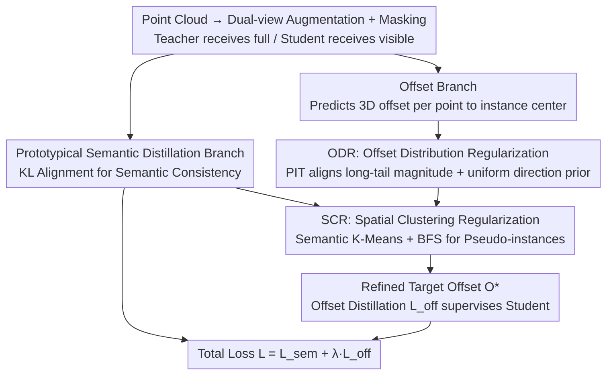

# Towards Foundation Models for 3D Scene Understanding: Instance-Aware Self-Supervised Learning for Point Clouds

**Conference**: CVPR 2026  
**Paper**: [CVF Open Access](https://openaccess.thecvf.com/content/CVPR2026/html/Yang_Towards_Foundation_Models_for_3D_Scene_Understanding_Instance_Aware_Self_Supervised_Learning_CVPR_2026_paper.html)  
**Area**: 3D Vision  
**Keywords**: Point cloud self-supervised learning, instance-aware, offset regression, self-distillation, 3D foundation models

## TL;DR
PointINS adds an "offset branch" to point cloud self-supervised pre-training, enabling the model to learn to predict offset vectors pointing to instance centers without any labels. It prevents representation collapse using two complementary regularizers: ODR (Offset Distribution Regularization), which aligns with global statistical priors, and SCR (Spatial Clustering Regularization), which enforces local grouping. This transforms traditional SSL representations from being "semantics-only" to "semantics and geometry-aware," resulting in an average improvement of +3.5% mAP in indoor instance segmentation and +4.1% PQ in outdoor panoptic segmentation across five datasets.

## Background & Motivation

**Background**: The mainstream path for point cloud self-supervised learning (SSL) in recent years involves either contrastive learning (aligning point features from different augmented views) or masked scene reconstruction (completing geometry from partial points). Methods like Sonata and DOS, based on teacher–student self-distillation and prototypical clustering, have shown strong performance on semantic segmentation benchmarks—particularly in linear probing settings.

**Limitations of Prior Work**: Representations learned by these methods are "semantically compact but geometrically entangled." They force point features of the same semantic class to cluster together, effectively erasing the fine-grained geometric differences required to distinguish between different instances of the same class. Consequently, performance lags significantly on tasks requiring instance separation (e.g., instance or panoptic segmentation). Furthermore, these models often require full finetuning of the backbone to be viable, with a wider gap observed under linear or decoder probing.

**Key Challenge**: There is a natural tension between semantic invariance (same class points should be similar) and geometric sensitivity (different instances of the same class must be distinguishable). Moreover, a deep-rooted concern in the community is that point cloud SSL easily collapses into trivial low-level geometric shortcuts like normals or poses. Consequently, strong invariance is often used to "avoid" geometric information, which inadvertently discards the geometric clues necessary for instance awareness.

**Goal**: To allow self-supervised representations to additionally learn "instance awareness"—meaning each point perceives which instance it belongs to and the center it should gravitate toward—without introducing any manual annotations or undermining existing semantic capabilities.

**Key Insight**: The authors argue that the "geometric proximity" required for instance awareness is not a low-level shortcut like normals, but a **high-level relational attribute** termed "geometric reasoning." Drawing inspiration from classic supervised instance/panoptic segmentation architectures, where semantic and offset branches run in parallel on a shared backbone—semantics for region proposal and offsets for spatial separation—the authors ask: if supervised models can benefit from this, why can't self-supervised ones?

**Core Idea**: Reformulate instance-aware learning as a "regularized self-distillation" problem. An offset branch is appended to the existing semantic self-distillation framework. It uses two statistical regularities observed in real-world scenes as "unlabeled supervisory signals" to regularize the offset prediction, injecting geometric reasoning while preventing unsupervised regression collapse.

## Method

### Overall Architecture
PointINS operates on a standard teacher–student self-distillation framework. A point cloud $P=\{(x_i,f_i)\}_{i=1}^N$ (coordinates $x_i$, features $f_i$) is augmented into two views $P^{(1)}, P^{(2)}$. A visible subset $P_v$ is fed to the student, while the teacher processes the full point cloud. The teacher's parameters are updated via Exponential Moving Average (EMA) of the student. Two branches are used: the **Semantic Branch** follows prototypical clustering (projecting features onto learnable prototypes and aligning soft assignments via KL divergence) to maintain semantic consistency. The **Offset Branch**, the core novelty, regresses a 3D offset vector for each point pointing to its instance center.

The key challenge is learning the offset branch without labels. The solution lies in applying two regularizations only on the **teacher side**: ODR pulls predicted offsets toward distributions observed in real scenes, and SCR uses pseudo-instance masks clustered from semantic features to group local offsets. Together, they produce a refined target offset $O^*$, which then supervises the student's offset prediction via distillation. The total loss is $L = L_{\text{sem}} + \lambda_{\text{off}} L_{\text{off}}$.

### Key Designs

**1. Offset Branch: Translating "Instance Awareness" into Unlabeled Point-level Offset Regression**

The bottleneck is that semantic branches naturally cause same-class points to cluster, with no mechanism to distinguish separate instances. Borrowing from supervised instance segmentation, an offset branch is added to the shared backbone to predict a 3D vector for each point, ideally pointing to its geometric center $\hat c_i = x_i + \tilde O_i$. Unlike semantic features which seek view invariance, offsets are **view-dependent** (rotation/scaling changes them). The authors track the geometric transformations of the augmentations and transform the predicted offsets back to the original coordinate system to ensure they are comparable and distillable. Regressing point-level offsets rather than complex instance embeddings keeps the framework lightweight and compatible with existing SSL.

**2. ODR (Offset Distribution Regularization): Using Global Statistical Priors as a Safety Net**

Without ground truth, direct regression often collapses into trivial solutions (e.g., all offsets shrinking to zero). The observation is that while individual offsets are unknown, they exhibit stable global statistics: when an offset $O\in\mathbb{R}^3$ is split into "magnitude" (distance to center) and "direction" (unit vector), the **magnitude follows a long-tail distribution** (reflecting scene layout and object scales) while the **direction is approximately uniformly distributed** over the unit sphere. ODR uses these as global priors to constrain the predicted offsets.

Implementation uses Probability Integral Transform (PIT), a non-parametric method mapping scalars to a target distribution while preserving relative order. For predicted magnitudes $\{M_i\}$, they are ranked $\pi(i)=\text{rank}(M_i)$, converted to probability levels $u_i = \frac{\pi(i)-0.5}{N}$, and mapped via the inverse CDF of the target distribution to get aligned magnitudes $\tilde M_i = F^{-1}(u_i)$. Directions $\{D_i\}$ are aligned to a uniform distribution across coordinates. This forces geometrically plausible offsets without destroying learned relative structures. Experiments show these priors are robust; even using indoor distributions for outdoor scenes only marginally affects performance.

**3. SCR (Spatial Clustering Regularization): Creating Pseudo-instance Masks from Early Semantic Features**

ODR handles global distributions but lacks local consistency—it doesn't guarantee that adjacent points in the same instance point to the same center. SCR fills this gap. The authors observe (Fig. 5) that semantic features in modern SSL mature **very early** (reaching 85% of final linear probing performance by 10% of epochs). These features can thus be used to generate "pseudo-instances."

Specifically: K-means ($K=20$) is applied to teacher features $F=\{f_i\}$ to get class-level segments $S=\{S_1,\dots,S_K\}$. For each point, the ODR-refined predicted center is calculated: $\hat c_i = x_i + \tilde O_i$. Within each segment $S_k$, a k-NN graph of predicted centers is built, and Breadth-First Search (BFS) identifies connected components $I_{k,j}$ as pseudo-instances. The final target offset is $O^*_i = \bar c_{k,j} - x_i$, where $\bar c_{k,j}$ is the mean of real coordinates within the pseudo-instance. This enforces local convergence. ODR and SCR are mutually beneficial: SCR provides local consistency, while ODR provides stable geometric anchors.

**4. Teacher-side Regularization + Offset Distillation: Stabilizing Signal Flow**

ODR and SCR are applied only to the teacher side to produce target $O^*$, which supervises the student prediction $o_i$ via:

$$L_{\text{offset}} = \frac{1}{N}\sum_{i=1}^{N}\left(\|o_i - O^*_i\|_1 + (1 - \cos(o_i, O^*_i))\right)$$

This penalizes magnitude deviation ($\ell_1$) and direction deviation (cosine). Regularizing only the teacher prevents gradient conflict in the student backbone, providing a structured supervision signal that allows the student to adapt smoothly without disrupting representation learning.

### Loss & Training
Total objective: $L = L_{\text{sem}} + \lambda_{\text{off}} L_{\text{off}}$, with $\lambda_{\text{off}}=0.25$. The backbone uses DOS + a decoder-free PTv3. Multi-scale features are upsampled and concatenated. The offset head is a 2-layer MLP. K-means uses $K=20$. Offset loss is introduced after a 10% epoch warm-up. Evaluations follow PointGroup protocols across linear probing, decoder probing, and full finetuning.

## Key Experimental Results

### Main Results

PointINS outperforms existing SSL methods in semantic and instance segmentation across three indoor datasets (ScanNet / ScanNet200 / S3DIS). Table below: ScanNet val instance segmentation mAP:

| Method | Linear Probing | Decoder Probing | Full Finetuning |
| :--- | :---: | :---: | :---: |
| Sonata | 25.0 | 37.1 | 39.5 |
| DOS (Prev. SOTA) | 28.7 | 38.9 | 40.5 |
| **Ours (PointINS)** | **32.1** | **40.2** | **41.5** |
| PTv3 (Supervised Ref.)| — | — | 40.9 |

Outdoor panoptic segmentation PQ on nuScenes / SemanticKITTI (linear probing):

| Method | nuScenes PQ | SemanticKITTI PQ |
| :--- | :---: | :---: |
| Sonata | 50.7 | 34.5 |
| DOS | 57.4 | 49.6 |
| **Ours (PointINS)** | **62.2** | **52.8** |

Notably, under linear probing, PointINS achieves 80–90% of supervised performance on indoor tasks, indicating the representation itself is "instance-ready." The gain in outdoor PQ (+4.8 for nuScenes) occurs without sacrificing semantic segmentation performance.

### Ablation Study

Component ablation on ScanNet (InsSeg mAP) and nuScenes (PanSeg PQ) in linear probing:

| Configuration | InsSeg mAP | PanSeg PQ | Description |
| :--- | :---: | :---: | :--- |
| Baseline (Semantics only) | 28.7 | 57.4 | DOS |
| + Offset Branch (No Reg) | 28.9 | 58.5 | Adding branch alone is ineffective |
| + Offset + ODR | 30.2 | 60.4 | Global prior alone provides limited gain |
| + Offset + SCR | 30.5 | 60.1 | Local clustering alone provides limited gain |
| **+ Offset + ODR + SCR** | **32.1** | **62.2** | Complementary use leads to major jump |

### Key Findings
- **Complementarity is Key**: Adding the branch alone gives only +0.2 mAP. ODR/SCR individually provide ~+1.5 mAP, but together yield +3.4 mAP / +4.8 PQ.
- **Robustness of ODR**: Using indoor priors for outdoor scenes or using coarse priors from HDBSCAN clustering results in negligible performance drops, proving ODR requires only "typical object scale" rather than precise labels.
- **Regularization Position**: Applying ODR to the student side causes gradient conflict and performance degradation. Teacher-side regularization is essential.
- **Label Efficiency**: On nuScenes, finetuning with 0.1% labels achieves 34.9 PQ (beating 10% labels supervised baseline).
- **Plug-and-play**: Integrating PointINS into other frameworks like PSA or Sonata improves both instance and semantic metrics, proving the objectives are complementary.

## Highlights & Insights
- **Curing Regression Collapse with Statistical Priors**: Rather than inventing complex pretext tasks, the authors leverage the simple "long-tail magnitude + uniform direction" regularity via PIT mapping. This is a lightweight, transferable anti-collapse mechanism.
- **Leveraging "Early-Maturing" Features**: Since semantic features stabilize very early (10% of training), they are repurposed to generate pseudo-instance masks—effectively using the model's early semantic knowledge to teach its later geometric reasoning.
- **Teacher-side Regularization Mastery**: By regularizing only the EMA teacher and distilling to the student, the authors bypass the issue of regularization fighting against representation learning.
- **Redefining Geometric Shortcuts**: The conceptual shift of viewing instance-aware geometry not as a "low-level shortcut to be avoided" but as a "high-level relational attribute to be learned" is the work's primary contribution.

## Limitations & Future Work
- **Reliance on ODR Assumptions**: While robust in testing, the magnitude/direction assumptions were primarily validated on standard indoor/outdoor scenes. Performance on highly sparse or unusual scales (e.g., pure aerial scans) remains to be seen.
- **SCR Sensitivity**: Pseudo-instances rely on K-means of teacher features. Errors in early semantic features for long-tail classes could propagate noise into the offset targets.
- **Task Scope**: While labeled a "Foundation Model," the evidence is currently limited to segmentation (semantic/instance/panoptic). Evidence for detection, registration, or cross-domain tasks would strengthen this claim.
- **Opportunities**: Future work could explore adaptive cluster numbers (K), anisotropic direction priors (accounting for architectural scene structures), or extending offset targets to bounding boxes or poses.

## Related Work & Insights
- **vs Sonata / DOS**: These methods excel at semantic consistency but suffer from geometric entanglement. PointINS is a plug-and-play enhancement that adds geometric reasoning without replacement.
- **vs Supervised Segmentation (PointGroup)**: PointINS adapts the "semantics + offset" dual-branch paradigm into the self-supervised domain by replacing ground truth with ODR/SCR.
- **vs Contrastive/Masked SSL**: Contrastive learning lacks spatial clues to separate identical adjacent objects, and masked reconstruction focuses on local completion. PointINS explicitly injects instance awareness through the point-to-center objective.

## Rating
- Novelty: ⭐⭐⭐⭐⭐ First framework to explicitly inject instance awareness into point cloud SSL via global and local geometric regularizers.
- Experimental Thoroughness: ⭐⭐⭐⭐⭐ Comprehensive evaluation across 5 datasets, multiple protocols, and extensive ablation of priors and architecture.
- Writing Quality: ⭐⭐⭐⭐ Clear logic and motivation with good visualizations.
- Value: ⭐⭐⭐⭐⭐ Plug-and-play nature and extreme label efficiency provide a practical path toward unified 3D foundation models.

<!-- RELATED:START -->

## Related Papers

- [\[CVPR 2025\] Sonata: Self-Supervised Learning of Reliable Point Representations](../../CVPR2025/3d_vision/sonata_self-supervised_learning_of_reliable_point_representations.md)
- [\[CVPR 2026\] Consistent Instance Field for Dynamic Scene Understanding](consistent_instance_field_for_dynamic_scene_understanding.md)
- [\[CVPR 2026\] Emergent Extreme-View Geometry in 3D Foundation Models](emergent_extreme-view_geometry_in_3d_foundation_models.md)
- [\[CVPR 2026\] I-Scene: 3D Instance Models are Implicit Generalizable Spatial Learners](i-scene_3d_instance_models_are_implicit_generalizable_spatial_learners.md)
- [\[CVPR 2026\] 3D-Aware Multi-Task Learning with Cross-View Correlations for Dense Scene Understanding](3d-aware_multi-task_learning_with_cross-view_correlations_for_dense_scene_unders.md)

<!-- RELATED:END -->
