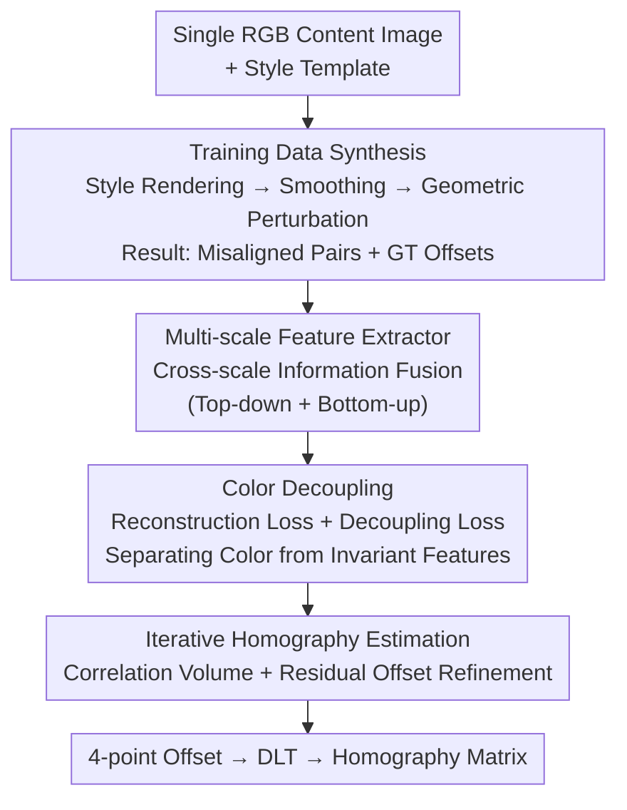

# Towards Generalized Multimodal Homography Estimation

**Conference**: CVPR 2026  
**Paper**: [CVF Open Access](https://openaccess.thecvf.com/content/CVPR2026/html/You_Towards_Generalized_Multimodal_Homography_Estimation_CVPR_2026_paper.html)  
**Area**: 3D Vision / Image Registration  
**Keywords**: Homography Estimation, Multimodal Registration, Zero-shot Generalization, Data Synthesis, Style Transfer

## TL;DR
Addressing the issue where homography estimation models fail when switching modalities, this paper utilizes style transfer to synthesize misaligned image pairs from a single image with varying textures/colors but identical structures (with ground truth offsets). This allows supervised training on synthetic data to generalize zero-shot to unseen modalities. Simultaneously, CCNet is designed to fuse cross-scale information and decouple color from features, further significantly reducing cross-dataset MACE errors.

## Background & Motivation

**Background**: Homography estimation aims to find a projective transformation matrix to align two images of the same scene captured from different perspectives. It serves as a fundamental module for image stitching, image fusion, and guided super-resolution. The mainstream deep learning approach follows the "four-point offset regression" paradigm proposed by DeTone et al., which feeds a concatenated image pair into a network to regress corner displacements and uses Direct Linear Transformation (DLT) to calculate the homography matrix. Recent works have added the inverse compositional Lucas-Kanade (IC-LK) iterative framework for refined offsets.

**Limitations of Prior Work**: Both supervised and unsupervised methods are "tailored for specific modalities." They maintain high accuracy when trained and tested on the same dataset (e.g., GoogleMap) but experience a sharp decline in performance when applied to unseen modalities (e.g., RGB-NIR, PDSCOCO). Current solutions require collecting new image pairs from the target modality for retraining, which is costly in terms of time and labor. Moreover, collecting aligned multimodal image pairs from different sensors is inherently difficult, making ground truth offsets hard to obtain.

**Key Challenge**: The model's "alignment capability" is tightly coupled with "modality appearance." Supervised methods rely on ground truth to adapt to specific textures/colors, while unsupervised methods rely on maximizing visual similarity—both assuming similar appearances between images. Consequently, they fail when faced with large cross-modal appearance differences. Furthermore, existing networks have two structural flaws: they only use intra-scale information, ignoring complementary cross-scale cues beneficial for correspondence, and color information is mixed into features, interfering with multimodal processing.

**Goal**: (1) Enable the model to generalize without relying on target modality data (zero-shot multimodal homography estimation); (2) Design an estimation network that is inherently more accurate and robust to color.

**Key Insight**: The authors observe that differences between modalities essentially consist of variations in texture and color, while the geometric structure remains invariant. Since style transfer networks excel at rendering an image into various textures/colors, they can be used to generate training data with "identical structure but diverse appearances" from a single image, forcing the model to focus on structure rather than appearance.

**Core Idea**: Replace "specific modality data collection" with "style transfer to synthesize diverse appearances with consistent structure + ground truth offsets" to decouple alignment capability from modality appearance. Then, use a cross-scale fusion and color decoupling network to enhance estimation accuracy.

## Method

### Overall Architecture
The method consists of two components: an offline **training data synthesis** pipeline and an online **cross-scale color-invariant network (CCNet)**. The synthesis starts with a standard RGB content image, uses style transfer to render it into two different appearances, and applies known geometric perturbations to obtain a "misaligned, structurally identical, but appearance-distinct" image pair with ground truth offset $O_{gt}$. During training, these synthetic pairs are used as supervised samples to optimize CCNet:

$$\theta^* = \max_{\theta} P(\text{Net}(I_{src}, I_{tar}, \theta), O_{gt})$$

where $P(\cdot,\cdot)$ measures estimation accuracy. Due to the high diversity of synthetic appearances and consistent structures, the trained model maintains accuracy on unseen modalities $I'_{src}, I'_{tar}$, i.e., $\max P(\text{Net}(I'_{src}, I'_{tar}, \theta^*), O'_{gt})$. Internally, CCNet fuses cross-scale information, decouples color from features, and uses an iterative strategy to refine offsets level by level.

### Key Designs

**1. Training Data Synthesis: Decoupling Alignment from Appearance**

This step directly addresses the coupling of alignment capability and modality appearance. A patch $I_{patch}=\text{Crop}(I_c, x, y, S_m+S)$ is cropped from a random content image $I_c$. Two style images $I_t^i, I_t^j$ are sampled to render $I_{patch}$ using a style transfer network $\text{Net}_s$, followed by convex combinations with content weight $\alpha$:

$$I_{src} = \alpha_i \cdot I_{patch} + (1-\alpha_i)\cdot \text{Net}_s(I_{patch}, I_t^i)$$
$$I_{tar} = \alpha_j \cdot I_{patch} + (1-\alpha_j)\cdot \text{Net}_s(I_{patch}, I_t^j)$$

Larger $\alpha\in[0,1]$ keeps the result closer to the original. Since style networks do not control texture smoothness, smoothing $\text{Smooth}(\cdot,\beta)$ is applied. Finally, a geometric perturbation is applied: $I_{src}=\text{Warp}(I_{src}, O_{gt})$, where $O_{gt}$ is sampled from $\{-p,\dots,p\}$. Patches of size $S\times S$ are then cropped from the centers. This simulates multimodal pairs (different appearance, same structure), forcing the model to learn structural correspondences that generalize to real unseen modalities.

**2. Cross-scale Feature Extraction: Complementary Multi-resolution Cues**

To address the lack of cross-scale information in existing networks, the extractor uses convolutions and residual blocks to get full-resolution features $F^1\in\mathbb{R}^{C\times S\times S}$. A **top-down** path performs downsampling and aggregation: $F^2_i=\text{ResBlock}(\text{ResBlock}_{\downarrow}(F^1_i)\circ \text{MaxPool}_{\downarrow}(F^1_i))$, followed by $F^3$. Crucially, a **bottom-up** path re-fuses information: $F^2_i=\text{Conv}(F^2_i\circ \text{Up}(F^3_i))$. This bidirectional flow ensures features at each scale contain both local details and global context.

**3. Color Decoupling: Removing Modality Interference**

To prevent color from interfering with multimodal processing, each feature $F^j_i$ is split into a color representation $F^{j,i}_{color}$ and a color-invariant feature $F^{j,i}_{invar}$. Two constraints are used. The **color reconstruction loss** ensures the color branch captures the original image's histogram:

$$L^{j,i}_{color} = \text{MSE}(\text{Net}_c(F^{j,i}_{color}), \text{Hist}(I_i))$$

The **color decoupling loss** suppresses correlation using the L1 norm of cosine similarity:

$$L^{j,i}_{dis} = \|\text{CosSim}(F^{j,i}_{color}, F^{j,i}_{invar})\|_1$$

Minimizing this ensures $F^{j,i}_{invar}$ is orthogonal to color features, allowing only color-invariant features to proceed to estimation.

**4. Iterative Homography Estimation: Correlation-based Refinement**

The IC-LK iterative approach is refined on color-invariant features. At scale $j$ and iteration $k$, the source feature is warped: $F^{j,k}_{src}=\text{Warp}(F^j_{src}, O^{j,k-1}_{pred}+O^{j+1}_{pred})$. A local correlation volume is calculated within radius $r$:

$$C^{j,k}(u,v,m,n)=\sum_{u=-r}^{r}\sum_{v=-r}^{r} F^{j,k}_{src}{}^{T}(m+u,n+v)\cdot F^j_{tar}(m,n)$$

This 4D tensor is reshaped and fed into an estimation block to update the residual offset. Offsets are accumulated across scales $O^j_{pred}=O^{j,K}_{pred}+O^{j+1}_{pred}$, with $O^1_{pred}$ as the final output.

### Loss & Training
The total loss is a weighted sum of offset supervision and color-related terms:

$$L = L_{pred} + \lambda \cdot \sum_{i\in\{src,tar\}}\sum_{j=1}^{3}\left(L^{j,i}_{color}+L^{j,i}_{dis}\right)$$

where $L_{pred}=\sum_{O_{pred}\in \mathbf{O}}\|O_{pred}-O_{gt}\|_1$ provides supervision for all intermediate offsets. The model was implemented in PyTorch and trained on an RTX A6000 using AdamW. MSCOCO served as content and Painter by Numbers as style templates. Training ran for $1.2\times10^5$ iterations with a learning rate of $4\times10^{-4}$ and $\lambda=0.5$.

## Key Experimental Results

Evaluation used MACE (Mean Average Corner Error, lower is better) across four datasets: GoogleMap, GoogleEarth, RGB-NIR, and PDSCOCO. "*" denotes training on synthetic data (zero-shot), and "+" denotes using synthesis as augmentation.

### Main Results: Zero-shot Generalization (Cross-dataset)
MACE results when trained on GoogleMap and tested on other datasets:

| Method | →GoogleEarth | →RGB-NIR | →PDSCOCO |
|------|------|------|------|
| MHN (Original) | 39.474 | 30.372 | 33.490 |
| MHN∗ (Synthetic) | **3.110** | 7.549 | 4.251 |
| IHN (Original) | 3.038 | 12.491 | 5.352 |
| IHN∗ | 1.853 | 5.647 | 1.684 |
| MCNet (Original) | 20.518 | 16.557 | 8.202 |
| MCNet∗ | 1.402 | 5.239 | 1.423 |

Original models fail significantly in cross-dataset scenarios (MHN reaches 39.47). Using synthetic data reduces error by multiple factors. The authors report improvements ranging from **1.93% to 93.17%**, with over 50% improvement in nearly half the cases.

### Main Results: Within-dataset & Zero-shot Comparison
MACE results for CCNet vs. baselines ("Zero-shot" = trained on synthetic data):

| Type | Method | GoogleMap | GoogleEarth | RGB-NIR | PDSCOCO |
|------|------|------|------|------|------|
| Supervised | MCNet | 0.261 | 0.577 | 3.226 | 1.062 |
| Supervised | **CCNet (Ours)** | **0.184** | **0.526** | **2.992** | **1.001** |
| Unsupervised | SSHNet | 1.394 | 5.888 | 6.743 | 1.610 |
| Zero-shot | MCNet∗ | 5.093 | 1.402 | 5.239 | 1.423 |
| Zero-shot | **CCNet∗ (Ours)** | **4.383** | **1.399** | **4.461** | **1.368** |

In the same-dataset setting, CCNet outperforms others by up to 29.50%. In zero-shot settings, it achieves up to 14.85% improvement.

### Key Findings
- **Synthetic data drives generalization**: Baselines fail cross-modality without it. Using synthesis as augmentation also improves generalization by 8.82%–79.54%.
- **RGB-NIR generalizes better**: Since NIR captures less texture/color and more structural info, models trained on it generalize more easily, supporting the "structure-driven = generalization" hypothesis.
- **Cross-scale + Color Decoupling contributions**: CCNet outperforms all baselines in both settings due to improved correspondence quality and reduced modal interference.
- **Low overhead**: CCNet runs in 32.73ms with a 1.21MB model, a marginal increase over MCNet (31.01ms / 0.76MB) for significantly better accuracy.

## Highlights & Insights
- **Generating data vs. collecting data**: Abstracting multimodal differences as "variant appearance, invariant structure" bypasses the bottleneck of multimodal data collection.
- **Clean color decoupling**: The dual "reconstruction + orthogonality" loss is more reliable than implicitly hoping the network ignores color.
- **Plug-and-play augmentation**: Synthesis can either stand alone for zero-shot or enhance existing datasets at almost zero cost.
- **Efficiency**: Achieves cross-domain robustness with minimal impact on parameters and runtime.

## Limitations & Future Work
- **Trade-off between generalization and specialization**: Using synthetic augmentation on existing datasets slightly reduces within-domain accuracy as the model is discouraged from exploiting specific modality cues.
- **Dependency on style transfer quality**: Synthetic diversity is bounded by the style transfer network and template library.
- **Geometric assumptions**: Training assumes planar or pure projective transformations; performance may hit a ceiling with non-planar scenes or large parallax.
- **Limited benefit for weak learners**: Low-capacity models (like DHN) benefit less or even degrade, suggesting the paradigm works best with high-capacity networks.

## Related Work & Insights
- **vs. Supervised 4-point Paradigms (DHN / MHN / IHN / MCNet)**: These methods are strong within-domain but fail cross-domain. Ours keeps the architecture but changes the **data source** for generalization.
- **vs. Unsupervised Methods (UDHN / SSHNet / AltO)**: Unsupervised methods fail when appearance differences are large. Ours uses supervised learning without requiring real multimodal pairs.
- **vs. Self-supervised Pseudo-pairs (SCPNet)**: While similar in generating pairs from single images, ours explicitly targets **cross-modal zero-shot** using style transfer.

## Rating
- Novelty: ⭐⭐⭐⭐ Utilizing style transfer for structurally consistent but appearance-diverse data to achieve zero-shot multimodal homography is novel and practical.
- Experimental Thoroughness: ⭐⭐⭐⭐ Covers four datasets with various settings (cross-dataset, zero-shot, augmentation); however, lacks stress testing on highly non-planar scenarios.
- Writing Quality: ⭐⭐⭐⭐ Clear motivation and well-defined modules with corresponding formulas.
- Value: ⭐⭐⭐⭐ Directly addresses the data bottleneck in multimodal registration with a plug-and-play approach.

<!-- RELATED:START -->

## Related Papers

- [\[CVPR 2026\] Omni-3DEdit: Generalized Versatile 3D Editing in One-Pass](omni-3dedit_generalized_versatile_3d_editing_in_one-pass.md)
- [\[CVPR 2026\] Adapting Point Cloud Analysis via Multimodal Bayesian Distribution Learning](adapting_point_cloud_analysis_via_multimodal_bayesian_distribution_learning.md)
- [\[CVPR 2026\] ORD: Object-Relation Decoupling for Generalized 3D Visual Grounding](ord_object-relation_decoupling_for_generalized_3d_visual_grounding.md)
- [\[CVPR 2026\] Multimodal Semantic Bias Mitigation for Diverse Text-To-3D Generation](multimodal_semantic_bias_mitigation_for_diverse_text-to-3d_generation.md)
- [\[ICLR 2026\] MultiMat: Multimodal Program Synthesis for Procedural Materials using Large Multimodal Models](../../ICLR2026/3d_vision/multimat_multimodal_program_synthesis_for_procedural_materials_using_large_multi.md)

<!-- RELATED:END -->
