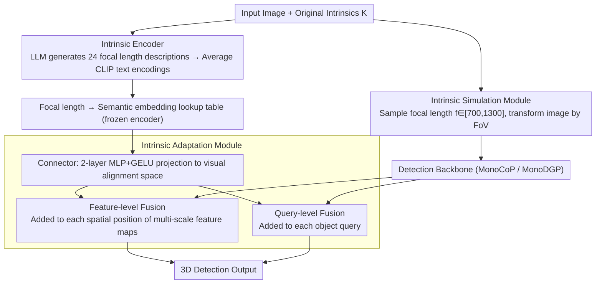

# Towards Intrinsic-Aware Monocular 3D Object Detection

**Conference**: CVPR 2026  
**arXiv**: [2603.27059](https://arxiv.org/abs/2603.27059)  
**Code**: [https://github.com/alanzhangcs/MonoIA](https://github.com/alanzhangcs/MonoIA)  
**Area**: 3D Vision  
**Keywords**: Monocular 3D Detection, Camera Intrinsics, Language-Guided Representation, Cross-Dataset Training, Focal Length Generalization

## TL;DR

MonoIA proposes transforming numerical camera intrinsics into language-guided semantic representations (generated via LLM descriptions + CLIP encoding). These are integrated into the detection network through a hierarchical adaptation module, achieving zero-shot generalization to unseen focal lengths and unified cross-dataset training, reaching new SOTA on KITTI, Waymo, and nuScenes.

## Background & Motivation

**Background**: Monocular 3D object detection (Mono3D) infers 3D object positions and dimensions from a single RGB image, a critical task for autonomous driving and robotics. Recent Transformer-based methods (MonoDETR, MonoDGP, MonoCoP) have made significant progress but assume identical camera intrinsics for training and testing.

**Limitations of Prior Work**: Existing SOTA methods are highly sensitive to camera intrinsics. Performance drops sharply when testing on images from cameras with different focal lengths—for instance, MonoCoP performs excellently at training focal lengths but suffers severe accuracy decay at unseen ones. In practical deployment, intrinsics vary significantly across different vehicles and sensors, and the lack of cross-camera generalization limits real-world application.

**Key Challenge**: Changes in intrinsics represent more than just numerical differences; they constitute a "perceptual transformation." Changes in focal length alter apparent object size, perspective relationships, and spatial geometry. However, current methods treat intrinsics as raw numerical inputs. Networks struggle to infer the perceptual effects of intrinsic changes from limited supervision, leading them to either ignore intrinsic cues or overfit to specific training values.

**Goal**: Design a unified intrinsic-aware framework that enables the detector to (1) understand the perceptual meaning of intrinsic changes, (2) generalize zero-shot to unseen focal lengths, and (3) support joint multi-dataset training.

**Key Insight**: The fundamental nature of intrinsic variation is perceptual transformation rather than numerical variance. Short focal lengths create wide fields of view (FoV) emphasizing global context, while long focal lengths compress perspective and magnify distant objects. This "perceptual effect" can be precisely described in natural language.

**Core Idea**: Use an LLM to generate text describing the visual effects for each focal length, then encode these into semantic embeddings via CLIP. This shifts intrinsic modeling from numerical conditioning to semantic representation, enabling a deeper understanding of intrinsic variations.

## Method

### Overall Architecture

MonoIA addresses a specific deployment pain point: the accuracy collapse of monocular detectors when camera focal lengths change. It transforms the "focal length value" from a raw number into a semantic signal understandable by the network through a three-step pipeline. During training, the **Intrinsic Simulation Module** applies FoV transformations to original images to create various focal lengths, ensuring the network sees a broad intrinsic distribution. Simultaneously, the **Intrinsic Encoder** translates each focal length into text and encodes it into an embedding vector, forming a "focal length-to-semantics" lookup table. Finally, the **Intrinsic Adaptation Module** bridges these embeddings into the detection network, injecting intrinsic information at both the feature map and object query levels. The detection backbone (e.g., MonoCoP/MonoDGP) is reused, with all three modules serving as plug-and-play components.

### Key Designs

**1. Intrinsic Simulation Module: Augmenting the training distribution with "unseen focal lengths"**

The first barrier to cross-focal length generalization is the lack of focal length diversity in training data, preventing the network from learning the relationship between focal length and imaging. The simulation module fills this gap via geometric transformations: given an original image and intrinsics $\mathbf{K}_{\text{orig}}$, a target focal length $f_i \in [700, 1300]$ is randomly sampled, and the image is rescaled according to the FoV formula $\theta = 2\arctan(\frac{w}{2f_i})$. Short focal lengths correspond to wide FoV where objects appear smaller (zoom-out), while long focal lengths compress perspective and magnify distant objects (zoom-in). Notably, the authors observe that this step alone is insufficient: training MonoCoP solely with simulated images actually reduces $AP_{3D}$ by 1.93%. Simply "seeing more focal lengths" does not solve the problem; it merely provides a diverse distribution for subsequent semantic learning.

**2. Intrinsic Encoder: Attaching semantic representations of geometric structures to numerical focal lengths**

This is the central hypothesis: because intrinsic changes are perceptual transformations, language describing perception should characterize them. Encoding involves two steps: first, each focal length $f_i$ (and its simulated image) is fed to ChatGPT-4o to generate $N=24$ descriptions of its visual effects (e.g., "A short focal length provides a wide field of view, making objects appear small and emphasizing global context"). Then, the CLIP ViT-H/14 text encoder encodes and averages these descriptions to obtain the intrinsic embedding:

$$\mathbf{t}_{\text{avg}} = \frac{1}{N}\sum_{i=1}^{N}\text{CLIP}_{\text{text}}(p_i)$$

For example, similar focal lengths like 800 and 850 generate nearly identical descriptions and reside closely in semantic space. Conversely, 800 and 1300 generate distinct descriptions and distant embeddings. This captures geometric structure that numerical encoding misses; cosine similarity analysis reveals that linear mapping of scalar focal lengths results in a near-uniform distribution, whereas language-guided embeddings show monotonic similarity patterns. This confirms the model successfully encodes the geometry of focal length variations, providing the basis for zero-shot generalization.

**3. Intrinsic Adaptation Module: Integrating frozen semantic embeddings into the detection network**

To utilize the semantic lookup table, the **Connector** (a 2-layer MLP + GELU) projects frozen intrinsic embeddings into a trainable visual alignment space. Keeping the encoder frozen and training only the projection head is crucial; ablation shows that updating the embeddings with task gradients destroys the established semantic structure (dropping performance by 2.55%). Post-projection, **dual-level fusion** is performed. At the feature level, the intrinsic embedding is added to every spatial position of the multi-scale backbone feature maps:

$$\tilde{\mathbf{F}}_i(x,y) = \mathbf{F}'_i(x,y) + \mathbf{t}_{\text{intr}}$$

This ensures low-level geometric consistency. At the query level, it is added to each object query $\tilde{\mathbf{q}}_j = \mathbf{q}_j + \mathbf{t}_{\text{intr}}$, enabling the decoder to interpret visual evidence under specific focal length configurations. Ablation proves both levels are essential: removing feature-level fusion drops results to 23.43%, and removing query-level fusion drops them to 23.99%. The former handles pixel-level geometry, while the latter handles object-level reasoning.

### Loss & Training

During training, the Intrinsic Encoder remains frozen, while only the Intrinsic Adaptation Module and the detector are trained. Using DETR-style Hungarian matching, the total loss is:

$$\mathcal{L}_{\text{overall}} = \frac{1}{N_{gt}} \sum_{n=1}^{N_{gt}} (\mathcal{L}_{2D} + \mathcal{L}_{3D} + \mathcal{L}_{\text{dmap}})$$

where $\mathcal{L}_{2D}$ is the 2D bounding box loss, $\mathcal{L}_{3D}$ supervises 3D attributes, and $\mathcal{L}_{\text{dmap}}$ is the object-level depth map prediction loss.

For inference, a **Hybrid Interpolation Strategy** is used: for a test intrinsic, the nearest two training focal lengths and their embeddings are identified. If the difference is $\le 32px$, the nearest embedding is reused; otherwise, the target embedding is synthesized via linear interpolation. The $32px$ threshold corresponds to the $32\times$ spatial downsampling of the backbone, as finer differences are indistinguishable in feature space.

## Key Experimental Results

### Main Results

| Dataset | Metric | MonoIA | MonoCoP (Prev. SOTA) | Gain |
|--------|------|--------|------------------|------|
| KITTI Test (Mod.) | AP₃D | 21.57% | 20.39% | +1.18% |
| KITTI Val (Mod.) | AP₃D | 24.40% | 23.98% | +0.42% |
| KITTI Val (Easy) | AP₃D | 33.61% | 32.06% | +1.55% |
| nuScenes Val (Mod.) | AP₃D | 10.74% | 9.71% | +1.03% |
| Multi-dataset KIT+NU+Way | AP₃D (KITTI) | 28.91% | 17.26%* | +11.65% |

*MonoCoP degrades severely under multi-dataset training.

### Ablation Study

| Configuration | AP₃D (Mod.) | Description |
|------|-------------|------|
| Single focal baseline (MonoCoP) | 23.64% | No intrinsic awareness |
| + Multi-focal simulated images | 21.71% | Mere data augmentation decreases performance |
| + Linear intrinsic encoding | 22.16% | Numerical encoding lacks geometric structure |
| + Trainable embeddings (not frozen) | 21.85% | Training destroys semantic structure |
| + Without Connector | 22.85% | Lacks spatial bridging |
| + Without Feature-level fusion | 23.43% | Loss of low-level geometric consistency |
| + Without Query-level fusion | 23.99% | Affects object-level reasoning |
| **MonoIA Full Version** | **24.40%** | All components working synergistically |

### Key Findings

- Simply increasing multi-focal length data during training is counterproductive (-1.93%), proving that "understanding intrinsics" is more important than "seeing more intrinsics."
- Freezing the CLIP encoder is critical: failing to do so leads to a 2.55% performance drop as task gradients erode the semantic space structure.
- MonoIA shows minimal performance drop under intrinsic mismatch tests (focal perturbation ±15px), significantly improving robustness (18.98% vs baseline 15.42%).
- Multi-dataset joint training provides a massive advantage: MonoIA improves from 24.40% (single dataset) to 28.91% (triple dataset), while MonoCoP drops from 23.98% to 17.26%.
- Minimal overhead: Only 0.13M additional parameters are added, with no change in GFLOPs.

## Highlights & Insights

- **Paradigm Shift**: Shifting intrinsic modeling from "numerical conditioning" to "semantic representation" is an inspiring approach—physical parameters (lighting, weather, sensor models) can likely benefit from language-described representations.
- **LLM as Prior Knowledge Source**: Cleverly utilizes LLM world knowledge to describe perceptual effects of focal length instead of relying on manually defined rules.
- **Comprehensive Experimental Design**: Covers zero-shot generalization, intrinsic mismatch, multi-dataset training, multiple backbones, and multiple baseline methods.
- **Plug-and-play Design**: The Intrinsic Awareness module can be integrated into different detectors like MonoDGP and MonoCoP with consistent improvements.

## Limitations & Future Work

- MonoIA requires pre-generating LLM descriptions and CLIP embeddings for each focal length; new focal lengths rely on interpolation rather than true emergent generalization.
- Currently focuses primarily on focal length; the impact of other intrinsics like principal point offsets is less explored (though authors note focal length is the dominant factor).
- It is not an intrinsic-invariant architecture but relies on explicit embedding learning.
- Future directions: Designing naturally intrinsic-invariant networks; extending language-guided representations to extrinsic parameters, weather, etc.
- Deep integration of multi-modal foundation models with 3D perception remains an open challenge.

## Related Work & Insights

- **MonoDETR/MonoDGP/MonoCoP Series**: MonoIA builds upon MonoCoP, continuing the chain of improvements in monocular 3D detection.
- **CLIP in 3D Tasks**: While projects like OpenScene and ULIP bridge 2D and 3D via CLIP, MonoIA is the first to use CLIP for encoding camera intrinsics.
- **Omni3D**: Uses virtual depth normalization for cross-dataset training; MonoIA provides a superior semantic-level solution.
- **Insight**: In other sensor-calibration sensitive tasks (e.g., depth estimation, BEV perception), can language-guided parameter representation be introduced similarly?

## Rating

- Novelty: ⭐⭐⭐⭐⭐ (Strong originality in introducing LLM+CLIP for intrinsic modeling)
- Experimental Thoroughness: ⭐⭐⭐⭐⭐ (KITTI/Waymo/nuScenes + multi-focal + multi-dataset + ablation + efficiency)
- Writing Quality: ⭐⭐⭐⭐⭐ (Clear logical chain, rich visualization, detailed appendix)
- Value: ⭐⭐⭐⭐⭐ (Addresses real deployment pains; methodology is inspiring for 3D perception)

<!-- RELATED:START -->

## Related Papers

- [\[CVPR 2026\] Unleashing the Power of Chain-of-Prediction for Monocular 3D Object Detection](unleashing_the_power_of_chain-of-prediction_for_monocular_3d_object_detection.md)
- [\[CVPR 2026\] MonoSAOD: Monocular 3D Object Detection with Sparsely Annotated Label](monosaod_monocular_3d_object_detection_with_sparsely_annotated_label.md)
- [\[CVPR 2026\] SPAN: Spatial-Projection Alignment for Monocular 3D Object Detection](span_spatial-projection_alignment_for_monocular_3d_object_detection.md)
- [\[CVPR 2026\] H²A²: Homogeneity-Aware and Heterogeneity-Aware Feature Perception for Unified Indoor 3D Object Detection](h2a2_homogeneity-aware_and_heterogeneity-aware_feature_perception_for_unified_in.md)
- [\[AAAI 2026\] MonoCLUE: Object-Aware Clustering Enhances Monocular 3D Object Detection](../../AAAI2026/3d_vision/monoclue_object-aware_clustering_enhances_monocular_3d_object_detection.md)

<!-- RELATED:END -->
