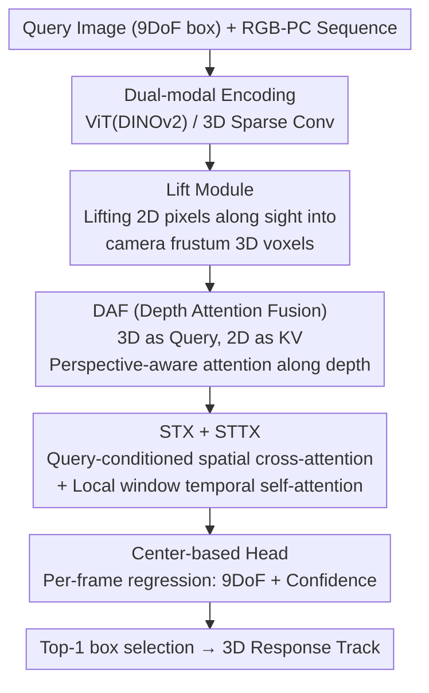

# Towards Visual Query Localization in the 3D World

**Conference**: CVPR 2026  
**arXiv**: [2605.01498](https://arxiv.org/abs/2605.01498)  
**Code**: https://github.com/wuhengliangliang/3DVQL (Available)  
**Area**: 3D Vision  
**Keywords**: Visual Query Localization, 3D Multimodal, Point Cloud-Image Fusion, 9DoF Localization, Benchmark Dataset

## TL;DR
This work extends "Visual Query Localization (VQL)" from 2D video to the 3D world. The authors construct **3DVQL**, the first 3D multimodal VQL benchmark (2002 sequences, 170k frames, 6.4K response tracks, 38 categories, Point Cloud+RGB+Depth modalities, per-frame 9DoF box annotations). Furthermore, they propose **LaF**, a method that lifts 2D features into 3D voxels along the viewing frustum and performs point cloud-image fusion via depth-aware attention, significantly outperforming multimodal baselines adapted from VQLoC across all metrics.

## Background & Motivation
**Background**: Visual Query Localization (VQL) is a core task in video understanding and embodied AI. Given a query image of a target, the goal is to find the **most recent occurrence** of that target in a long egocentric video and return the response track. Leveraging large-scale datasets like Ego4D, 2D VQL frameworks (e.g., VQLoC, PRVQL) have achieved high localization accuracy.

**Limitations of Prior Work**: Existing VQL is almost exclusively performed in 2D, which naturally limits performance due to "two-dimensional" constraints. Real-world ambiguities such as object occlusion, dramatic changes in appearance, and viewpoint variations cannot be fully resolved in 2D images, creating a gap with our inherently 3D world. The primary reason 3D VQL has remained unexplored is the **lack of a suitable benchmark**, as 3D data collection and 9DoF annotation are extremely costly.

**Key Challenge**: Baseline experiments revealed a phenomenon opposite to 2D: while deepening networks to improve single-modal feature discriminativeness is the standard path for gains in 2D VQL, this approach is unstable or even detrimental in 3D. This indicates that the true bottleneck of 3D VQL is **not the strength of single-modal features, but cross-modal observability and spatio-temporal alignment**. RGB is affected by motion blur and occlusion, while point clouds suffer from long-range sparsity, non-rigid deformation, and a lack of fine-grained appearance. Neither modality can support stable long-term localization alone.

**Goal**: (1) Create a 3D VQL benchmark supporting single/multimodal settings with high-quality 9DoF annotations; (2) Identify the true difficulties of 3D VQL and provide comparable multimodal baselines; (3) Design a fusion method that effectively utilizes geometric correspondences.

**Key Insight**: Instead of the crude element-wise addition used in baselines, the authors resolve the cross-modal alignment bottleneck by "lifting 2D features into 3D frustum voxels along the line of sight and then applying perspective-aware attention along the depth axis" for precise point cloud-image registration.

## Method

### Overall Architecture
The input for the 3DVQL task is a target query (with a 9DoF query box) and a synchronized RGB-Point Cloud sequence. The output is the temporal segment of the target's most recent occurrence along with the 9DoF 3D boxes and confidence scores for each frame. This paper pursues two paths: **benchmark + baselines** (three fusion variants—AF, GAF, and PAF—adapted from the VQLoC architecture, differing only in the fusion module) and the **proposed LaF method**.

The LaF pipeline: RGB frames are encoded using ViT-B/14 pre-trained with DINOv2; point clouds are cropped to a fixed workspace $\mathcal{W}$, voxelized ($16^3$ grid), and encoded using 3D sparse convolutions pre-trained with PV-RCNN. The **Lift module** projects each 2D pixel token into a sequence of 3D voxel candidates along the line of sight (retaining only those within the camera frustum). **DAF (Depth-aware Attention Fusion)** uses 3D features as queries and lifted 2D features as keys/values to perform perspective-aware multi-head attention slice-wise along the depth axis, yielding geometrically aligned fused features. Subsequently, a 3D query box RoI is used to crop the query representation $Q_f$. **STX (Spatial Transformer)** performs cross-attention between $Q_f$ and search frame features $C_f$ to aggregate spatial cues, producing query-to-frame features $f$. **STTX (Spatio-Temporal Transformer)** applies self-attention within a local temporal window on $f$ to reason about temporal consistency, yielding query-video features $V^*$. Finally, these are upsampled to a fixed resolution, and a CenterPoint-style anchor/center head regresses 9DoF boxes and confidence scores per frame. The top-1 box is selected and associated with the query to form the response track.

### Key Designs

**1. 3DVQL Benchmark: Extending VQL into 3D Multimodal Long Sequences**

To address the fundamental lack of a 3D VQL benchmark, the authors used a Clearpath Husky A200 mobile robot equipped with a 64-beam LiDAR, depth camera, and RGB camera to collect data in 18 real-world scenarios (streets, parks, bedrooms, libraries, etc.). They gathered 2002 synchronized multimodal sequences (20 fps), totaling 170k frames and 6.4K response tracks across 38 sub-categories under 8 meta-categories. Each frame is manually annotated with the **tightest 9DoF 3D box** (center $x,y,z$, size $l,w,h$, and yaw/pitch/roll). Quality control involved multiple iterations: "expert demonstration → per-frame annotation → expert verification → re-annotation for inconsistencies," ensuring temporal continuity and geometric plausibility. Compared to Ego4D, 3DVQL has a similar number of sequences (2002 vs 2538) but nearly double the response tracks (6.4K vs 3.2K), and uniquely supports PC-only, RGB-PC, and RGB-D settings. Sequences were specifically designed with "target appears → leaves → returns with significant viewpoint/spatial change" to make the "most recent occurrence" a genuine long-range retrieval challenge.

**2. Lift Module: Lifting 2D Features into Camera Frustum 3D Voxels**

In the baselines, 2D and 3D features are fused via simple element-wise addition, failing to exploit precise geometric correspondences. The Lift module borrows from BEV perception in autonomous driving: it unrolls each 2D pixel token along its line of sight into a ray in 3D space, generating a sequence of 3D voxel candidates. To ensure relevance and computational efficiency, this lifting is strictly constrained to **voxels within the camera frustum**—only aligning modalities where the camera can "actually see," avoiding blind expansion across the entire 3D space. This aligns 2D image information and 3D geometric positions within the same frustum coordinate system, providing a geometric prior for subsequent attention fusion.

**3. DAF (Depth-aware Attention Fusion): Slice-wise Attention along the Depth Axis**

This is the core module distinguishing LaF from the baselines. After lifting 2D features into the frustum, the model must decide which depth's 2D appearance should be aggregated for each 3D query. DAF employs perspective-aware multi-head attention: using **3D features as queries and lifted 2D image features as keys/values**, attention is computed **slice-wise along the depth axis**. This ensures geometrically aware alignment, where each 3D query adaptively aggregates the most relevant appearance cues from different depths along its line of sight. The fused features $Q_f$ are then cropped using a 3D RoI precisely aligned with the initial 3D query box. Ablation studies show that this depth-aware attention is the primary driver of LaF's performance gains (see ablation table), as it precisely stitches "where" (point cloud) and "what" (image) according to actual imaging geometry.

**4. STX + STTX: Query-conditioned Spatial-Temporal Consistency Modeling**

Single-frame fused features are insufficient for stable tracking in long videos. STX (Spatial Transformer) uses cross-attention to let the query feature $Q_f$ attend to and aggregate relevant spatial cues from search frame features $C_f$, producing frame-level query-to-frame features $f$. STTX (Spatio-Temporal Transformer) applies self-attention under a **local temporal window mask**, allowing $f$ to reason about temporal consistency and target dynamics across multiple frames to obtain query-video features $V^*$. The local window mask enhances robustness to occlusion/blur while keeping the computational cost of temporal attention manageable—crucial for 170k-frame long-sequence retrieval.

**5. Center-based Prediction Head: Circumventing Non-differentiable 9DoF IoU**

A uniform grid of $16^3$ anchors $\{\mathbf{a}_n\}$ is laid over $\mathcal{W}$. A CenterPoint-style head predicts center offsets, sizes, rotations, and presence scores for each anchor in every frame. The final prediction uses the anchor with the highest confidence:

$$n_t^{\ast}=\arg\max_n p_{t,n},\quad \hat{\mathbf{b}}_t=\text{Decode}(\mathbf{a}_{n_t^{\ast}},\text{pred}_{t,n_t^{\ast}})$$

A key engineering trade-off was made: due to the **absence of a 9DoF IoU operator capable of backpropagation**, stable IoU supervision for multiple candidate boxes was impossible. The authors instead used center-point regression as the training target. Positive anchors are those whose centers fall within a radius $\tau_c=0.3$ m of the GT center and are among the top-5 closest. The total loss is:

$$\mathcal{L}=\lambda_c\mathcal{L}_c+\lambda_s\mathcal{L}_s+\lambda_r\mathcal{L}_r+\lambda_{\text{cls}}\mathcal{L}_{\text{cls}}+\lambda_{\text{dist}}\mathcal{L}_{\text{dist}}$$

where $\mathcal{L}_c/\mathcal{L}_s/\mathcal{L}_r$ are L1 regression losses for center, size, and rotation; $\mathcal{L}_{\text{cls}}$ is the focal loss for presence; and $\mathcal{L}_{\text{dist}}$ penalizes the distance between the predicted positive anchor center (after offset) and the GT center.

### Loss & Training
LaF is trained end-to-end for 400 epochs with a peak learning rate of $10^{-4}$ and weight decay of $5\times10^{-2}$. Images are resized to $448\times448$, point clouds are resampled to 4096 points, and the RoIAlign pooling size is 5. Each segment is cropped to $T=20$ frames (randomly sampled with balanced positive/negative frames). Loss weights $\lambda_c,\lambda_s,\lambda_r,\lambda_{\text{cls}},\lambda_{\text{dist}}$ are empirically set to $1.0, 1.0, 0.1, 100, 0.3$. The workspace $\mathcal{W}=[0,10]\times[-2,2]\times[-1,1]$ m contains $16^3$ centers.

## Key Experimental Results

### Main Results
Evaluation protocol (custom metrics extended from 2D VQL to 3D):
- **tAP (Temporal AP)**: Matching degree between predicted time segment and GT response track, calculated as the mean mAP across tIoU thresholds $\{0.25, 0.5, 0.75, 0.95\}$ following ActivityNet style.
- **3D-stAP (3D Spatio-Temporal AP)**: Per-frame 3D IoU of 9DoF boxes aggregated over time into spatio-temporal IoU $\mathrm{stIoU}_{3D}$. Due to the extreme difficulty of 9DoF localization, a loose threshold of 0.05 is included, averaging over $\{0.05, 0.25, 0.5, 0.75, 0.95\}$.
- **Succ (Success Rate)**: Percentage of queries with $\mathrm{stIoU}_{3D} \ge 0.05$, measuring "presence of valid overlap."
- **Rec% (Recovery Rate)**: Percentage of frames within the GT temporal segment with $\mathrm{IoU}_{3D} \ge 0.5$, inspired by VOT robustness.

Main results on 3DVQL (RGB-PC) test set, LaF vs. three baselines:

| Method | tAP | tAP$_{0.25}$ | stAP | stAP$_{0.05}$ | rec.% | Succ. |
|------|------|------|------|------|------|------|
| AF (anchor + 7DoF GIoU loss) | 0.181 | 0.442 | 0.003 | 0.015 | 0.093 | 11.693 |
| GAF (Guided-Attention fusion) | 0.291 | 0.597 | 0.015 | 0.075 | 0.049 | 26.309 |
| PAF (Projection-Aware fusion) | 0.224 | 0.577 | 0.021 | 0.104 | 0.115 | 32.156 |
| **LaF (Ours)** | **0.293** | **0.607** | **0.044** | **0.222** | **0.264** | **46.041** |

LaF performs best across all 6 metrics. Absolute gains relative to the strongest baseline: tAP +0.002, tAP$_{0.25}$ +0.010, stAP +0.023, stAP$_{0.05}$ +0.118, rec +0.149, Succ +13.885. Temporal metrics (tAP) show similar performance across models; the true gap lies in **spatial 9DoF localization** (stAP, Succ, Rec%), confirming that the bottleneck is cross-modal alignment, not temporal reasoning.

### Ablation Study
Ablation of the DAF module (removing DAF and reverting lifted 2D features to element-wise addition with 3D features):

| Config | tAP | tAP$_{0.25}$ | stAP | stAP$_{0.05}$ | rec.% | Succ. | Description |
|------|------|------|------|------|------|------|------|
| LaF (w/o DAF) | 0.134 | 0.347 | 0.007 | 0.033 | 0.029 | 18.027 | Reverts to element-wise addition |
| **LaF (w/ DAF)** | **0.293** | **0.607** | **0.044** | **0.222** | **0.264** | **46.041** | Full model |

### Key Findings
- **DAF is the core driver**: Removing DAF leads to a precipitous drop across all metrics—Succ falls from 46.0% to 18.0%, and stAP drops from 0.044 to 0.007 (over a 6x difference). This proves that LaF's gains stem almost entirely from "perspective-aware attention fusion along the depth axis."
- **Deepening single-modal networks is unstable in 3D**: Strategies to deepen backbones that work for 2D VQL fail or cause performance degradation in 3DVQL, confirming that alignment and observability are more critical than single-modal discriminativeness.
- **Fusion methods vary significantly**: The three baselines (AF/GAF/PAF), differing only in their fusion modules, show a massive spread in Succ (11.7% to 32.2%), highlighting that robust multimodal fusion is more important than optimizing single-modal backbones.

## Highlights & Insights
- **Migration of BEV Lifting + Frustum Constraints to VQL**: The Lift module unrolls 2D pixels along sightlines and **restricts cross-modal attention to the camera frustum**, ensuring geometric relevance while controlling computation. This approach is transferable to any retrieval/tracking task requiring precise point cloud-image alignment.
- **Ingenious slice-wise attention along the depth axis**: It explicitly delegates the choice of appearance depth to the attention mechanism based on imaging geometry. This is more accurate and efficient than element-wise addition or full spatial attention, and it is the sole source of performance gains in the ablations.
- **Engineering Honesty**: The authors candidly state that center regression was used due to the lack of a differentiable 9DoF IoU operator. This identification of a "lack of a differentiable 9DoF IoU operator" provides a concrete target for future work.
- **Benchmark design captures the essence of VQL**: By prioritizing "leave-and-return" segments and characterizing the long-tail distribution of $d_{\text{sep}}$ (retrieval distance), the benchmark ensures "most recent occurrence" is a long-range retrieval problem rather than a standard detection task.

## Limitations & Future Work
- The authors acknowledge that experiments focused on 3DVQL$_{\text{RGB-PC}}$, leaving **RGB-D settings unstudied**. Sequences are also relatively short, which may not be ideal for true long-term localization.
- Observed limitation: Absolute metrics remain low (best stAP is only 0.044, Succ 46%), indicating 9DoF spatio-temporal localization is far from solved. The work "establishes a feasible benchmark" rather than "solving the task." Center regression is a compromise for non-differentiable IoU, potentially limiting box tightness.
- Future directions: Filling in RGB-D / PC-only baselines, collecting longer sequences, developing a differentiable 9DoF IoU operator, and introducing memory mechanisms (like PRVQL's online memory) to handle long missing segments.

## Related Work & Insights
- **vs. VQLoC (2D single-stage end-to-end)**: VQLoC uses DINO features + cross-attention (query-frame) + Spatio-Temporal Transformer + unified head. It serves as the architecture template for LaF; this work expands it to RGB-PC 3D and discovers that 2D "deepening" heuristics fail in 3D where fusion is the bottleneck.
- **vs. PRVQL (2D progressive hybrid)**: PRVQL uses global retrieval + local refinement + online memory to counter long absences. LaF currently lacks an explicit memory mechanism, making robustness to long misses a clear area for improvement.
- **vs. BEVFusion / PointPainting (Multimodal 3D Detection)**: These focus on per-frame scene detection initialized from the first frame. 3DVQL is a query-driven, long-video retrieval task focused only on the "most recent occurrence," representing a previously un-evaluated problem. LaF's lifting logic aligns with BEV-style methods but uses depth-axis perspective attention rather than a unified BEV grid.

## Rating
- Novelty: ⭐⭐⭐⭐⭐ First 3D multimodal VQL benchmark + frustum-constrained depth attention fusion; creates an entirely new setting.
- Experimental Thoroughness: ⭐⭐⭐⭐ Main results and DAF ablation are solid, though lacking system comparisons for RGB-D / PC-only (some details deferred to supplement).
- Writing Quality: ⭐⭐⭐⭐ Motivation (bottleneck as alignment vs. discriminativeness) is clear, and modules are well-explained; minor ambiguity in some notation/loss naming.
- Value: ⭐⭐⭐⭐⭐ Provides the first reproducible benchmark, a set of baselines, and a SOTA method; a foundational work for 3D retrieval in embodied AI.

<!-- RELATED:START -->

## Related Papers

- [\[CVPR 2026\] AsymLoc: Towards Asymmetric Feature Matching for Efficient Visual Localization](asymloc_towards_asymmetric_feature_matching_for_efficient_visual_localization.md)
- [\[CVPR 2026\] VGA: Empowering Aerial-Ground Localization by Visual Geometry Alignment](vga_empowering_aerial-ground_localization_by_visual_geometry_alignment.md)
- [\[CVPR 2026\] ULF-Loc: Unbiased Landmark Feature for Robust Visual Localization with 3D Gaussian Splatting](ulf-loc_unbiased_landmark_feature_for_robust_visual_localization_with_3d_gaussia.md)
- [\[CVPR 2026\] CoLoR: The Devil is in Scene Coordinate Regression for Large-Scale Visual Localization](color_the_devil_is_in_scene_coordinate_regression_for_large-scale_visual_localiz.md)
- [\[CVPR 2026\] Simple but Effective Triplet-Based Compression Strategies for Compact Visual Localization](simple_but_effective_triplet-based_compression_strategies_for_compact_visual_loc.md)

<!-- RELATED:END -->
