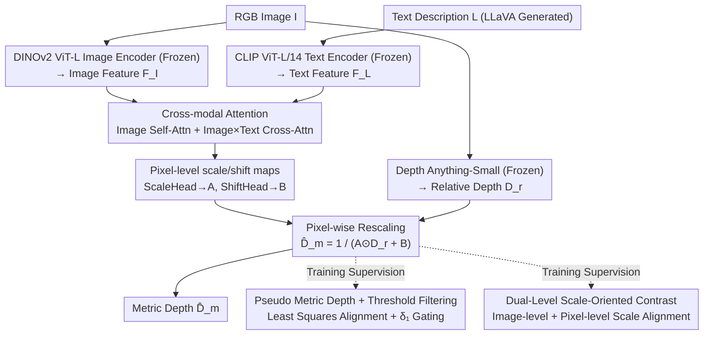

# TR2M: Transferring Monocular Relative Depth to Metric Depth with Language Descriptions and Dual-Level Scale-Oriented Contrast

**Conference**: CVPR2026  
**arXiv**: [2506.13387](https://arxiv.org/abs/2506.13387)  
**Code**: [GitHub](https://github.com/BeileiCui/TR2M)  
**Institution**: The Chinese University of Hong Kong
**Area**: 3D Vision  
**Keywords**: Monocular Depth Estimation, Relative to Metric Depth, Language Descriptions, Cross-modal Attention, Contrastive Learning, Pixel-level Scaling

## TL;DR

The TR2M framework is proposed to predict pixel-level scale/shift maps using image and text descriptions, converting highly generalizable but scale-less relative depth into metric depth. Achieving cross-domain zero-shot metric depth estimation is realized with only 19M trainable parameters and 102K training images.

## Background & Motivation

Monocular Depth Estimation (MDE) is divided into two primary paradigms:

- **Metric Depth Estimation (MMDE)**: Outputs real-world scale (meters) but is typically restricted to specific domains with poor cross-domain generalization; mitigating this requires camera intrinsics or massive data at high costs.
- **Relative Depth Estimation (MRDE)**: Trained via affine-invariant loss, showing strong cross-domain generalization, but the output lacks absolute scale, limiting downstream applications (robotic navigation, 3D reconstruction).

Existing relative-to-metric conversion methods face two core issues:

1. **Limitations of Single-factor Scaling**: Prior methods (e.g., RSA) only estimate a global scale and shift factor, which cannot correct local errors in relative depth and may even amplify them.
2. **Semantic Description Ambiguity**: Objects of the same category can result in different depths under various distributions and scales, yet text descriptions may remain similar, leading to inaccurate scale estimation.

## Core Problem

How can scale uncertainty in relative depth be efficiently removed to convert it into metric depth while preserving the cross-domain generalization of MRDE? The key challenge lies in achieving **pixel-level** fine-grained scaling rather than global scaling and establishing scale consistency at the feature level.

## Method

### Overall Architecture

TR2M aims to resolve the dilemma where "relative depth generalizes well but lacks scale, while metric depth has scale but generalizes poorly." The objective is to retain the generalization of relative depth while appending real-world scale. Instead of directly regressing depth, it predicts a pair of **pixel-level** rescale maps. Given an RGB image $I \in \mathbb{R}^{H \times W \times 3}$ and a text description $L$ (automatically generated by LLaVA), the network outputs a scale map $A \in \mathbb{R}^{H \times W}$ and a shift map $B \in \mathbb{R}^{H \times W}$. These are used to transform the relative depth $D_r$ provided by a frozen Depth Anything-Small into metric depth pixel-by-pixel:

$$\hat{D}_m = \frac{1}{A \odot D_r + B}$$

where $\odot$ denotes element-wise multiplication. In this pipeline, the relative depth model, image encoder, and text encoder are all frozen; only the intermediate fusion and decoding modules (totaling 19M parameters) are trained.

### Key Designs

**1. Pixel-level scale/shift maps: Replacing global factors with pixel-wise correction**

Prior methods (e.g., RSA) estimate only a single global scale and shift. If a local region in the relative depth is incorrect, it cannot be fixed and is instead amplified by global scaling. TR2M directly predicts maps $A$ and $B$ at the same resolution as the image, providing a set of scaling parameters for every pixel. This allows local error regions to be corrected individually. This step is the primary source of performance gain: in ablation studies, switching from a single factor to mapping maps reduced NYUv2 AbsRel from 0.118 to 0.084.

**2. Cross-modal Attention: Utilizing text as a global scale prior injected into every pixel**

Image features $F_I \in \mathbb{R}^{HW \times D}$ are extracted by a frozen DINOv2 ViT-L, and text features $F_L \in \mathbb{R}^{1 \times D}$ by a frozen CLIP ViT-L/14. During fusion, image features serve as the Query for self-attention and cross-attention (with text):

$$\text{Attn}_{cm}^{i}(Q_I, K_i, V_i) = \text{softmax}\left(\frac{Q_I K_i^T}{\sqrt{d}}\right) \cdot V_i, \quad i \in \{I, L\}$$

The fused feature $F_{out} = F_I + \text{Attn}_{cm}^I + \text{Attn}_{cm}^L$ is processed by two lightweight DPT-style decoding heads to derive $A = \text{ScaleHead}(F_f)$ and $B = \text{ShiftHead}(F_f)$. This setup maintains pixel-level spatial resolution through image-based Queries while injecting global scale information (e.g., "indoor tabletop" vs. "outdoor street view") into each pixel location.

**3. Pseudo Metric Depth + Threshold Filtering: Supervising pixels beyond sparse Ground Truth**

Metric depth GT is often sparse. TR2M first aligns relative depth to GT using least squares to generate pseudo metric depth:

$$(\tilde{\alpha}, \tilde{\beta}) = \arg\min_{\tilde{\alpha}, \tilde{\beta}} \sum_{i=1}^{HW} (\tilde{\alpha} D_r(i) + \tilde{\beta} - D_m^{gt}(i))^2$$

yielding $D_m^{pseudo} = \tilde{\alpha} D_r + \tilde{\beta}$. To account for potential unreliability, a quality gate using threshold accuracy $\delta_1$ (the proportion of pixels where $\max(D_m^{gt}/D_m^{pseudo}, D_m^{pseudo}/D_m^{gt}) < 1.25$) is applied. Supervision is only included if $\delta_1 > \rho$:

$$\mathcal{L}_{tp\text{-}si} = \mathbf{1}(\delta_1 > \rho) \cdot \mathcal{L}_{si}(\hat{D}_m, D_m^{pseudo})$$

This provides credible supervision for regions outside sparse annotations, improving zero-shot iBims $\delta_1$ by +0.051.

**4. Dual-Level Scale-Oriented Contrast: Aligning scale distributions at image and pixel levels**

Beyond regression supervision, the feature space is organized by "scale." At the **coarse-grained** level, image-level embeddings $\tilde{F}_f$ are obtained via average pooling and sorted by the pseudo scale factor $\tilde{\alpha}$. Pairs with similar scales ($|i - j| < t$) are treated as positive and those with large differences ($|i - j| \geq t$) as negative within an InfoNCE-style loss. At the **fine-grained** level, GT depth is discretized into $|\mathcal{C}|$ classes:

$$Y = \text{round}\left(\frac{d_{max} - D}{d_{max} - d_{min}} \times |\mathcal{C}|\right)$$

Using an EMA dual-branch structure (similar to MoCo), Query pixels find positive samples in Key feature maps among pixels of the same depth category. The total loss $\mathcal{L}_{soc} = \mathcal{L}_{coarse} + \mathcal{L}_{fine}$ ensures global scale consistency and local depth distribution consistency, further improving zero-shot performance (DIODE $\delta_1$ +0.031).

### Loss & Training

The total loss is a weighted sum of four components:

$$\mathcal{L} = \lambda_1 \mathcal{L}_{si} + \lambda_2 \mathcal{L}_{tp\text{-}si} + \lambda_3 \mathcal{L}_{soc} + \lambda_4 \mathcal{L}_{es}$$

where $\mathcal{L}_{es}$ is an edge-aware smoothness loss (constraining $A$ and $B$), with weights $\lambda_1=1, \lambda_2=0.5, \lambda_3=0.1, \lambda_4=0.01$. Key training configurations:

| Configuration | Setting |
|:---|:---|
| GPU | NVIDIA RTX 4090 |
| Optimizer | AdamW |
| Batch size | 8 |
| Learning rate | $1 \times 10^{-5}$, decaying by 0.9 per epoch |
| Training epochs | 20 |
| Trainable Scale Embeddings | 256 |
| Relative Depth Model | Depth Anything-Small (Frozen) |
| Image Encoder | DINOv2 ViT-L (Frozen) |
| Text Encoder | CLIP ViT-L/14 (Frozen) |
| Trainable Parameters | 19M |
| Training Data Size | 102K images |
| Training Datasets | NYUv2 + KITTI + VOID + C3VD |
| Text Generation | LLaVA v1.6 Vicuna & Mistral |

## Key Experimental Results

### Main Results on NYUv2 Indoor Benchmark (Table 1)

| Method | Type | Trainable Params | $\delta_1\uparrow$ | AbsRel$\downarrow$ | RMSE$\downarrow$ |
|:---|:---|:---|:---|:---|:---|
| DA V2 | Direct Metric | 25M | 0.969 | 0.073 | 0.261 |
| UniDepth | Zero-shot Metric | 347M | 0.981 | 0.072 | 0.229 |
| Metric3Dv2 | Zero-shot Metric | 1011M | 0.980 | 0.067 | 0.260 |
| RSA | Lang + Scale Factor | 4.7M | 0.752 | 0.156 | 0.528 |
| ScaleDepth | Lang + Domain Adapt | 109M | 0.913 | 0.099 | 0.329 |
| WorDepth | Lang + Domain Adapt | 137M | 0.926 | 0.090 | 0.330 |
| **TR2M** | **Lang + Rescale Map** | **19M** | **0.954** | **0.082** | **0.293** |

### Zero-shot Cross-domain Generalization (Table 3, 5 unseen datasets)

| Method | Backbone | Training Images | SUN δ₁ | iBims δ₁ | HyperSim δ₁ | DIODE δ₁ | SimCol δ₁ | Avg Rank |
|:---|:---|:---|:---|:---|:---|:---|:---|:---|
| ZoeDepth | BeiT384-L | - | 0.545 | 0.656 | 0.302 | 0.237 | 0.438 | 4.70 |
| DA Single | ViT-L | - | 0.660 | 0.714 | 0.361 | 0.288 | 0.553 | 2.80 |
| UniDepth | ViT-L | 3M | 0.443 | 0.217 | 0.545 | 0.635 | - | 4.00 |
| RSA | ViT-S | 102K | 0.527 | 0.450 | 0.230 | 0.244 | 0.162 | 5.80 |
| **TR2M** | **ViT-S** | **102K** | **0.591** | **0.736** | **0.361** | **0.274** | **0.445** | **2.40** |

TR2M achieves the best average rank (2.40) using a ViT-Small backbone and 102K training images, significantly outperforming methods with larger models and more data.

### Ablation Study

| Rescale Maps | $\mathcal{L}_{tp\text{-}si}$ | $\mathcal{L}_{soc}$ | NYUv2 AbsRel | iBims δ₁ | DIODE δ₁ |
|:---:|:---:|:---:|:---:|:---:|:---:|
| ✕ | ✕ | ✕ | 0.118 | 0.566 | 0.225 |
| ✓ | ✕ | ✕ | 0.084 | 0.657 | 0.237 |
| ✓ | ✓ | ✕ | 0.085 | 0.708 | 0.243 |
| ✓ | ✓ | ✓ | **0.082** | **0.736** | **0.274** |

- From single factor $\rightarrow$ pixel-level maps: AbsRel decreased from 0.118 to 0.084, the largest gain.
- Adding pseudo-depth supervision: Significant zero-shot improvement (iBims $\delta_1$ +0.051).
- Adding scale contrastive learning: Further zero-shot gains (DIODE $\delta_1$ +0.031).

## Highlights & Insights

1. **Novelty**: Replacing global scaling factors with **pixel-level rescale maps** is the core innovation, allowing for local error correction in relative depth which was impossible in prior work like RSA.
2. **Value**: Extremely high parameter efficiency; with only 19M trainable parameters (frozen encoders), it is 1-2 orders of magnitude smaller than UniDepth (347M) or Metric3Dv2 (1011M) while achieving comparable performance.
3. **Mechanism**: The dual-level contrastive learning design is sophisticated, where coarse-grained ensures global scale consistency and fine-grained ensures local depth distribution consistency.
4. **Experimental Thoroughness**: The pseudo-depth with threshold filtering concisely addresses sparse GT issues, enhancing zero-shot generalization.
5. Language descriptions serve as a "free" auxiliary prior, requiring no camera parameters or sensor data.

## Limitations & Future Work

1. **Dependency on LLaVA**: Text quality is limited by the VLM's capability; descriptions for extreme scenarios (e.g., medical endoscopy) may be inaccurate.
2. **Ceiling of Relative Depth**: Framework performance is capped by the quality of the frozen relative depth model (Depth Anything-Small).
3. **Zero-shot Gap**: AbsRel remains high in some domains (e.g., 0.451/0.673 on SUN RGB-D and DIODE Outdoor), indicating that massive cross-domain scale gaps are still challenging.
4. **Computational Overhead**: Pixel-level contrastive learning requires an EMA dual-branch structure, increasing training time and memory usage.
5. Future work could explore stronger relative depth backbones (e.g., Depth Anything V2) to further push the performance ceiling.

## Related Work & Insights

| Dimension | RSA | ScaleDepth/WorDepth | UniDepth/Metric3Dv2 | **TR2M** |
|:---|:---|:---|:---|:---|
| Input | Text | Text + Image | Image (+ Camera) | Text + Image + Rel Depth |
| Scaling Method | Global dual-factor | Implicit decoding | End-to-end metric head | **Pixel-level maps** |
| Trainable Params | 4.7M | 109-137M | 347-1011M | **19M** |
| Training Data | 102K | Single domain | 3-16M | **102K** |
| Cross-domain | Poor | Single domain | Good | **Strong** |
| Key Limitation | Global factor lacks detail| Limited by domain adaptation | Requires Big Data/Model | Rel Depth quality dependent |

## Insights

- The relative-to-metric paradigm is similar to "pre-training + lightweight adaptation" in NLP; using frozen large models with parameter-efficient fine-tuning is a highly effective strategy.
- The pixel-level rescale map concept can be extended to other tasks requiring scale recovery (e.g., monocular normal estimation, optical flow scale recovery).
- Dual-level contrastive learning (global + local) can be transferred to other dense prediction tasks for feature regularization.
- Text-assisted depth estimation combined with stronger MLLMs (e.g., GPT-4V) may further enhance scene understanding and scale reasoning capabilities.

## Rating

- Novelty: ⭐⭐⭐⭐ (Combining pixel-level rescale maps with dual-level contrastive learning is novel)
- Experimental Thoroughness: ⭐⭐⭐⭐ (4 training sets + 5 zero-shot test sets + extensive ablation)
- Writing Quality: ⭐⭐⭐⭐ (Clear structure, well-articulated motivation)
- Value: ⭐⭐⭐⭐ (An efficient relative-to-metric depth conversion solution with high practicality)

<!-- RELATED:START -->

## Related Papers

- [\[CVPR 2026\] MD2E: Modeling Depth-to-Edge Cues for Monocular Metric Depth Estimation](md2e_modeling_depth-to-edge_cues_for_monocular_metric_depth_estimation.md)
- [\[CVPR 2026\] Iris: Integrating Language into Diffusion-based Monocular Depth Estimation](iris_integrating_language_into_diffusion-based_monocular_depth_estimation.md)
- [\[CVPR 2026\] The Midas Touch for Metric Depth](the_midas_touch_for_metric_depth.md)
- [\[ICLR 2026\] DepthLM: Metric Depth from Vision Language Models](../../ICLR2026/3d_vision/depthlm_metric_depth_from_vision_language_models.md)
- [\[CVPR 2026\] Depth Hypothesis Guided Iterative Refinement for Event-Image Monocular Depth Estimation](depth_hypothesis_guided_iterative_refinement_for_event-image_monocular_depth_est.md)

<!-- RELATED:END -->
