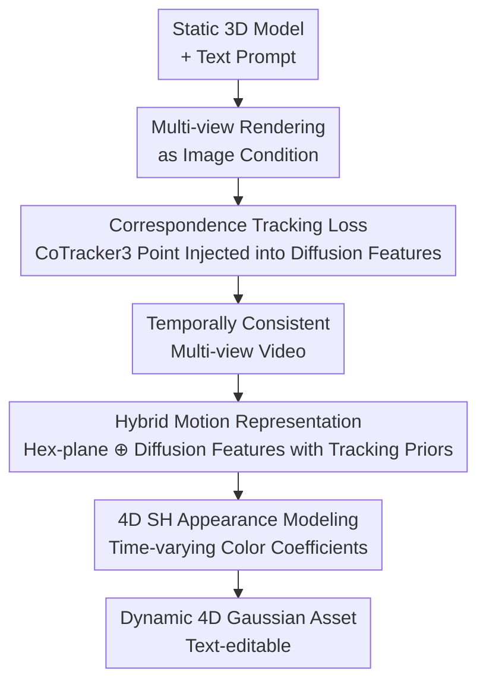

# Tracking-Guided 4D Generation: Foundation-Tracker Motion Priors for 3D Model Animation

**Conference**: CVPR 2026  
**Paper**: [CVF Open Access](https://openaccess.thecvf.com/content/CVPR2026/html/Sun_Tracking-Guided_4D_Generation_Foundation-Tracker_Motion_Priors_for_3D_Model_Animation_CVPR_2026_paper.html)  
**Area**: 3D Vision / 4D Generation  
**Keywords**: 4D Generation, 3D Model Animation, Point Tracking Prior, Multi-view Video Diffusion, 4D Gaussian Splatting

## TL;DR
Track4DGen injects frame-by-frame point correspondences from a foundation point tracker (CoTracker3) into the intermediate features of multi-view video diffusion models and 4D Gaussian reconstruction. By using explicit feature-level temporal supervision to suppress appearance drift in 4D asset generation, it outperforms baselines like Animate3D on both video generation and 4D generation benchmarks.

## Background & Motivation

**Background**: The goal of 4D asset generation is to synthesize a dynamic 3D object that evolves over time with coherent geometry, appearance, and motion, starting from text, a single image, a monocular video, or a static 3D model. The current mainstream paradigm is a "two-stage" approach: first generating temporally consistent multi-view videos using diffusion models, and then reconstructing or refining these videos into dynamic representations (deformable neural fields, dynamic 3D Gaussians, or 4D meshes). The 3D→4D pipeline (e.g., Animate3D) is particularly practical—animating an existing static mesh by conditioning a multi-view video diffusion model.

**Limitations of Prior Work**: Even if the underlying multi-view video diffusion model (MV-VDM) achieves high single-frame quality, **appearance drift** remains a persistent issue—the same object gradually degrades or changes inconsistently across frames, and Janus (multi-face) effects and temporal jitter occur across views. Maintaining spatio-temporal consistency for both appearance and motion under sparse input is the most difficult aspect of 4D generation.

**Key Challenge**: The authors attribute the root cause of drift to the supervision signal—supervision in existing methods **occurs only on the video diffusion loss in pixel or latent space** (i.e., $\mathcal{L}_{\text{diff}}$), lacking an **explicit, feature-level, and temporal-aware tracking supervision**. Diffusion loss only requires each frame to "look right" but never enforces that "a point at frame t should match the same point at frame t+1 in the feature space," leaving temporal consistency unmanaged.

**Goal**: To introduce an explicit motion prior channel to both the diffusion generator and the 4D reconstructor, ensuring that the generated intermediate features themselves carry information about "which point tracks to which point."

**Key Insight**: The authors observe two things—(1) The latent states of diffusion models actually encode discriminative features usable for point tracking (as shown in prior work), and block-by-block probing reveals that the **features in the second spatio-temporal upsampling block of the U-Net decoder are the most stable for long-range temporal correspondence**; (2) The foundation tracker CoTracker3 utilizes cross-track attention for joint multi-point tracking with strong occlusion robustness, providing high-quality frame-by-frame correspondences.

**Core Idea**: Use dense point correspondences derived from a foundation tracker as auxiliary supervision acting directly on diffusion features (Stage One), and then feed these "tracking-prior-aware diffusion features" into 4D Gaussian reconstruction (Stage Two), replacing pure pixel supervision with explicit temporal supervision to eliminate drift.

## Method

### Overall Architecture
Track4DGen is a two-stage framework. The input consists of an existing static 3D model (mesh) and a text prompt, and the output is a temporally coherent, text-editable dynamic 4D asset. **Stage One** renders the static mesh into multi-view images as image conditions to train a multi-view video diffusion model for generating temporally consistent multi-view videos; the key is using CoTracker3 to extract dense point trajectories from ground-truth videos and locating these points within diffusion features to force feature-level alignment across frames through a tracking loss. **Stage Two** reconstructs the multi-view videos from Stage One into dynamic 4D Gaussians (4D-GS): using static Gaussians as the canonical pose, a hybrid motion representation (Hex-plane features $\oplus$ diffusion features with tracking priors) is used to predict pose deformation per frame, while 4D spherical harmonics model time-varying colors. Both stages are reinforced by the motion prior provided by the same foundation tracker.

### Key Designs

**1. Correspondence Tracking Loss: Injecting Foundation Tracker Correspondences into Diffusion Features for Explicit Temporal Supervision**

This is the core of the paper, targeting the pain point that "pure diffusion loss cannot control appearance drift." The authors first conducted a feature probing experiment: adding light noise to real videos, running the denoiser, extracting feature maps block-by-block, and using cosine similarity nearest neighbor matching to track query points from the first frame. They found that features in the **second spatio-temporal upsampling block of the U-Net decoder** (especially the temporal motion module within spatio-temporal attention) are strongest for long-range correspondence. Based on this, points are sampled on a $15\times 15$ grid in the first frame of each view (excluding points outside the object via instance masks). During training, 8 points are randomly selected per view (total $8n$), their trajectories in the multi-view video are tracked using CoTracker3, and these points are localized in the diffusion feature space via bilinear interpolation of pixel-to-feature coordinates to extract latent descriptors $h(p^{i,j})$.

Supervision consists of two loss terms. The **Correspondence Loss** $\mathcal{L}_{\text{corr}}$ requires descriptors of the same tracked point in adjacent frames to be consistent in feature space, implemented via cosine similarity:

$$\mathcal{L}_{\text{corr}} = \frac{1}{nf}\sum_{i=1}^{n}\sum_{j=1}^{f-1}\left(1-\operatorname{cos\_sim}\big(h(p^{i,j}),\,h(p^{i,j+1})\big)\right)$$

The **Position Loss** $\mathcal{L}_{\text{pos}}$ further constrains geometry: it uses cosine similarity maps in the diffusion feature space to predict point positions $\hat{p}^{i,j}$ via soft-argmax, then aligns them with tracking ground truth using Huber loss: $\mathcal{L}_{\text{pos}}=\frac{1}{nf}\sum_i\sum_{j\ge 2}L_{\text{Huber}}(p^{i,j}-\hat{p}^{i,j})$. The total objective for Stage One is $\mathcal{L}_1=\lambda_1\mathcal{L}_{\text{diff}}+\lambda_2\mathcal{L}_{\text{corr}}+\lambda_3\mathcal{L}_{\text{pos}}$. This is effective because it transforms "temporal correspondence" from an implicit expectation into an explicit constraint directly applied to the most sensitive feature layer—furthermore, tracking information is only used as an extra constraint during training; **no tracker is needed during inference**, resulting in zero additional inference overhead. The network follows the MV-VDM backbone of Animate3D, multi-view 3D attention from MVDream, and temporal attention from AnimateDiff, while freezing multi-view 3D attention and only training the MV2V-Adapter and spatio-temporal blocks to save VRAM.

**2. Hybrid Motion Representation: Concatenating Diffusion Features with Tracking Priors and Hex-plane Features to Drive 4D-GS Deformation**

Classic 4D-GS uses only Hex-plane features to learn the motion field without any external motion priors, often resulting in blurry reconstructed dynamic geometry. This work constructs a **hybrid feature** for each spatio-temporal sample point: it interpolates both Hex-plane features (six planes $\zeta_1\in\{(x,y),(x,z),(y,z),(x,t),(y,t),(z,t)\}$) and the diffusion features from the second upsampling block of Stage One:

$$\mathcal{F}=\bigcup_{\text{Hex}}\prod_{\zeta_1}\operatorname{interp}\big(\mathcal{H}^{\zeta_1},(\mathcal{X},f)\big)\;\oplus\;\bigcup_{\text{Diff}}\prod_{\zeta_2}\operatorname{interp}\big(\mathcal{D}^{\zeta_2},K[E](\mathcal{X},f)\big)$$

The diffusion features are sampled by projecting Gaussian centers $\mathcal{X}$ onto the 2D diffusion feature plane using camera intrinsics $K$ and extrinsics $E$. To avoid incorrect supervision from wrong projections at self-occlusions, a visibility check based on ray casting is performed to discard occluded 3D→2D projections. The hybrid feature $\mathcal{F}$ is passed through a lightweight three-head MLP deformation decoder $\phi$ to predict displacement, rotation, and scale increments per frame: $\Delta\mathcal{X}=\phi_{\mathcal{X}}(\mathcal{F}),\ \Delta r=\phi_r(\mathcal{F}),\ \Delta s=\phi_s(\mathcal{F})$. Why it works: these diffusion features are trained under Stage One CoTracker supervision and inherently encode motion priors, effectively providing semantic guidance to the pure geometric Hex-plane interpolator on "where points should move," thereby strengthening the point representation of dynamic geometry and appearance.

**3. 4D Spherical Harmonics Appearance Modeling: Converting SH Coefficients into Time-varying Fourier Series for Dynamic Color**

The spherical harmonics (SH) in static 3D-GS only express view-dependent colors, making it difficult to accurately model color/lighting for moving objects. The authors replace each SH coefficient $k_l^m$ with a set of truncated cosine (Fourier) basis coefficients $fr_i$ that vary over time, optimized as Gaussian attributes during the GS optimization stage:

$$\mathcal{C}_{4D}=\sum_{l=0}^{l_{\max}}\sum_{m=-l}^{l}k_l^m\,Y_l^m(\psi,\gamma),\qquad k_l^m=\sum_{i=0}^{w-1}fr_i\cos\!\left(\frac{i\pi}{N_t}t\right)$$

Here $Y_l^m(\psi,\gamma)$ is the real SH basis, $l_{\max}$ controls angular detail bandwidth, $N_t$ is the total number of frames, and $w$ is the number of retained cosine terms. Thus, each coefficient becomes a continuous function of time $t$, allowing color to evolve smoothly with motion and improving the color fidelity of 4D assets. Finally, the canonical 4D Gaussians are updated at time $t$ as $\mathcal{G}_{4D}=\{\mathcal{X}+\Delta\mathcal{X},\,\mathcal{C}_{4D},\,\alpha,\,r+\Delta r,\,s+\Delta s\}$, then splatted, depth-sorted, and $\alpha$-blended into images.

### Loss & Training
Stage One utilizes $\mathcal{L}_1=\lambda_1\mathcal{L}_{\text{diff}}+\lambda_2\mathcal{L}_{\text{corr}}+\lambda_3\mathcal{L}_{\text{pos}}$. During the diffusion process, noise $z_t^{1:n,2:f}=\sqrt{\bar\alpha_t}z_0+\sqrt{1-\bar\alpha_t}\epsilon$ is added to frames 2 to f, while a time-dependent noise $z_t^{1:n,1}=z_0+\beta_t\epsilon'$ is injected into the first frame (multi-view condition frame) to encourage sufficient motion magnitude. Stage Two utilizes $\mathcal{L}_2=\lambda_4\mathcal{L}_{\text{rec}}+\lambda_5\mathcal{L}_{\text{4D-SDS}}+\lambda_6\mathcal{L}_{\text{ARAP}}$: the motion reconstruction loss $\mathcal{L}_{\text{rec}}$ uses Stage One videos and masks to capture coarse motion, a $z_0$-reconstruction 4D-SDS loss distills diffusion priors to refine fine-grained motion, and the ARAP loss constrains rigid deformation to stabilize shapes.

## Key Experimental Results

### Main Results
Evaluation is split into multi-view video generation (five VBench-style metrics) and 4D generation (CLIP semantic alignment + User Study). Baselines are Animate3D and DG4D.

Video Generation (Diffusion4D Filtered Set):

| Method | I2V↑ | M.Sm↑ | T.Fli↑ | Dy.Sc↑ | Aest.Q↑ |
|------|------|-------|--------|--------|---------|
| DG4D | 0.834 | 0.983 | 0.982 | 1.019 | 0.445 |
| Animate3D | 0.919 | 0.991 | 0.989 | 1.348 | 0.465 |
| **Ours** | **0.933** | **0.992** | **0.991** | **1.356** | **0.470** |

4D Generation (Sketchfab28, CLIP Metrics):

| Method | CLIP-O(img)↑ | CLIP-O(text)↑ | CLIP-F(img)↑ | CLIP-F(text)↑ | CLIP-C↑ |
|------|------|------|------|------|------|
| DG4D | 0.8619 | 0.2578 | 0.8708 | 0.2592 | 0.9700 |
| Animate3D | 0.8812 | 0.2653 | 0.8906 | 0.2634 | 0.9801 |
| **Ours** | **0.8884** | **0.2664** | **0.8955** | **0.2664** | **0.9819** |

In the User Study (Sketchfab28, scale 1–5), the method ranked first in all four categories (Text Align: 3.57 / 3D Align: 3.87 / Motion: 3.73 / Appearance: 3.44).

### Ablation Study

| Config | I2V↑ | Aest.Q↑ | Dy.Sc↑ | Description |
|------|------|---------|--------|------|
| w/o Corrs. Loss | 0.844 | 0.347 | 1.505 | Correspondence loss removed; consistency/aesthetics collapse |
| w/o Pos. Loss | 0.921 | 0.462 | 1.435 | Position loss removed; consistency drops |
| Ours full (Video) | 0.933 | 0.470 | 1.356 | Full Stage One |

Ablation for 4D Generation (Sketchfab28):

| Config | I2V↑ | M.Sm↑ | T.Fli↑ | Aest.Q↑ |
|------|------|-------|--------|---------|
| w/o Di. Feat | 0.932 | 0.994 | 0.990 | 0.532 |
| w/o 4D SH | 0.937 | 0.995 | 0.993 | 0.536 |
| **Ours full** | **0.940** | **0.996** | **0.994** | **0.538** |

### Key Findings
- **Correspondence loss is the main driver for drift control**: Removing it causes I2V to plummet from 0.933 to 0.844 and Aest.Q from 0.470 to 0.347, though Dy.Sc paradoxically rises to 1.505—this indicates that without temporal constraints, motion appears "more dynamic" but is actually noisy jitter at the cost of appearance consistency. Position loss further boosts consistency from 0.921 to 0.933. This directly confirms the hypothesis that "drift originates from lack of explicit feature-level temporal supervision."
- **Hybrid diffusion features and 4D SH both contribute**: Removing diffusion features (w/o Di.Feat) or 4D SH (w/o 4D SH) in 4D generation results in slight drops across I2V and aesthetic metrics, showing both assist in final geometric and color fidelity, though the gains are smaller than those from Stage One tracking supervision.
- **Dy.Sc is not always the highest**: On the Animate3D dataset, the method's Dy.Sc (0.778) is slightly lower than Animate3D's (0.787)—tracking supervision makes motion more "restrained and clean" rather than pursuing raw dynamic scores, suggesting the metric may have a bias toward noisy motion and should be viewed alongside consistency metrics.

## Highlights & Insights
- **Foundation tracker as a "temporal supervision source" rather than an "inference component"**: CoTracker3 only provides correspondence supervision during training and does not participate in inference. This achieves zero extra inference cost while significantly improving temporal consistency—a paradigm of "borrowing from foundation models during training but discarding them during inference" that is worth migrating to other generative tasks.
- **Block-by-block probing to find the strongest correspondence features**: Conducting a feature tracking analysis to locate the "temporal module of the second decoder upsampling block" before applying supervision is more precise than blindly constraining all layers—this "probing—locating—supervision" methodology can be reused for any work aiming to inject structural priors into diffusion features.
- **Co-localized feature concatenation bridges the two stages**: Stage Two directly reuses the diffusion features trained in Stage One from the same layer, allowing tracking priors to flow naturally into 4D reconstruction without designing a redundant motion prior, which is engineeringly efficient.

## Limitations & Future Work
- **Tracking quality as an upper bound**: The method heavily relies on the correspondence quality of CoTracker3; tracking failures during strong self-occlusion, thin structures, or highly non-rigid motion directly pollute the supervision. Visibility checks alleviate this but cannot fully solve it.
- **Sparse supervision of 8 points per view**: Randomly sampling only 8 points per view during training limits coverage of large areas or fine-grained local motion. The density and sampling strategy may limit the description of complex motions.
- **Small evaluation scale**: 4D generation is mainly evaluated on Sketchfab28 (28 assets) and Animate3D (20 assets), which have limited object diversity; broader horizontal comparisons against more baselines would be more convincing.
- **Dy.Sc trade-off**: Lower dynamic scores in some data indicate a need to optimize the balance between suppressing drift and not inhibiting reasonable large-scale motion.

## Related Work & Insights
- **vs Animate3D**: The most direct competitor. Animate3D also uses 3D→4D, conditioning multi-view video diffusion then 4D-SDS refinement, but its supervision is only in pixel/latent space, leaving appearance drift; this work adds feature-level tracking supervision (Stage One) and hybrid features + 4D SH (Stage Two) to its backbone, improving drift and fidelity.
- **vs DG4D / EG4D (image-to-4D)**: These methods generate multi-view videos then reconstruct dynamic Gaussians; this work shares the "video then reconstruction" paradigm but introduces foundation tracker motion priors, leading in temporal consistency metrics.
- **vs Classic 4D-GS**: Classic 4D-GS only uses Hex-planes for motion; this work injects tracking-prior diffusion features and time-varying SH, effectively supplementing the geometric interpolator with semantic motion guidance.
- **vs SC4D / DreamMesh4D (video-to-4D)**: These rely on sparse control points or rigged meshes for motion decoupling; this work uses dense correspondence priors in diffusion features, offering a complementary approach.

## Rating
- Novelty: ⭐⭐⭐⭐ "Treating foundation tracker dense correspondences as feature-level temporal supervision during training with zero inference overhead" is a clean and logical new angle.
- Experimental Thoroughness: ⭐⭐⭐⭐ Solid dual-track evaluation on video and 4D generation plus ablation and user study, though the 4D evaluation set and baseline count are small.
- Writing Quality: ⭐⭐⭐⭐ Clear chain of motivation—hypothesis—methodology, with formulas matching diagrams; discussion of metric trade-offs (Dy.Sc) could be deeper.
- Value: ⭐⭐⭐⭐ Drift is a core pain point in 4D generation, and this work provides a reusable "training-time tracking supervision" solution alongside the Sketchfab28 benchmark, offering practical value to the community.

<!-- RELATED:START -->

## Related Papers

- [\[CVPR 2026\] KV-Tracker: Real-Time Pose Tracking with Transformers](kv-tracker_real-time_pose_tracking_with_transformers.md)
- [\[CVPR 2026\] RigMo: Unifying Rig and Motion Learning for Generative Animation](rigmo_unifying_rig_and_motion_learning_for_generative_animation.md)
- [\[ICCV 2025\] AnimateAnyMesh: A Feed-Forward 4D Foundation Model for Text-Driven Universal Mesh Animation](../../ICCV2025/3d_vision/animateanymesh_a_feedforward_4d_foundation_model_for_textdri.md)
- [\[CVPR 2026\] Motion 3-to-4: 3D Motion Reconstruction for 4D Synthesis](motion_3-to-4_3d_motion_reconstruction_for_4d_synthesis.md)
- [\[CVPR 2026\] Human Geometry Distribution for 3D Animation Generation](human_geometry_distribution_for_3d_animation_generation.md)

<!-- RELATED:END -->
