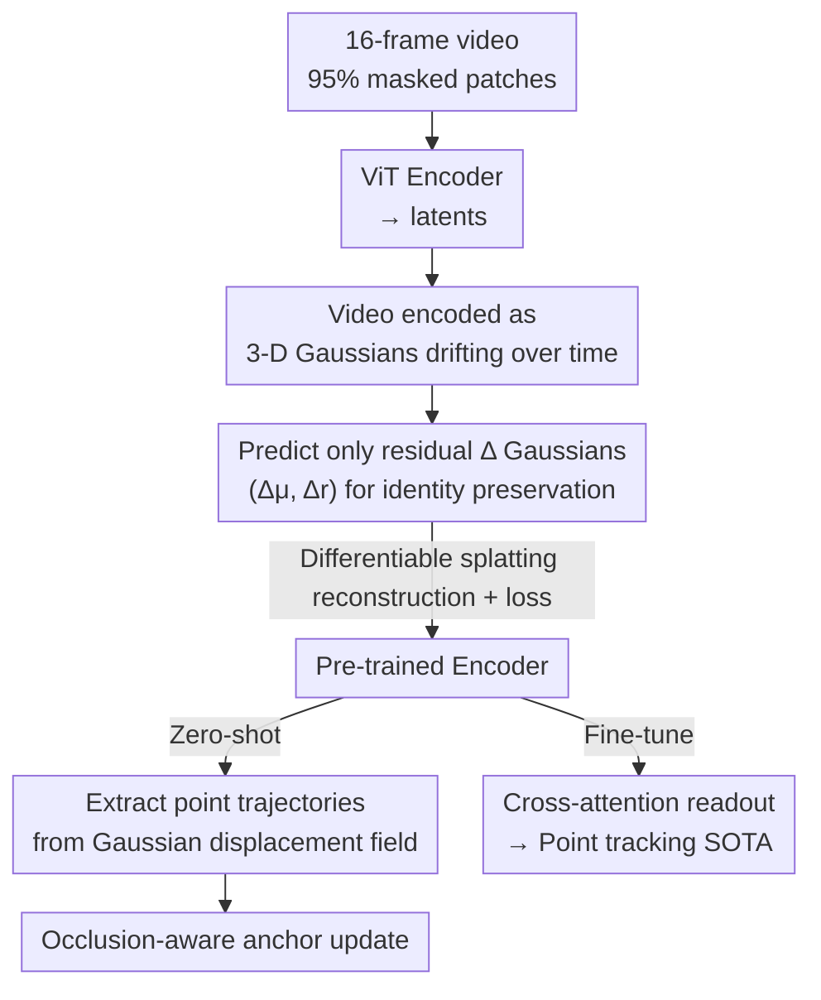

# Tracking by Predicting 3-D Gaussians Over Time

**Conference**: CVPR 2026  
**Paper**: [CVF Open Access](https://openaccess.thecvf.com/content/CVPR2026/html/Baranwal_Tracking_by_Predicting_3-D_Gaussians_Over_Time_CVPR_2026_paper.html)  
**Code**: https://github.com/tekotan/video-gmae (Project Page: https://videogmae.org/)  
**Area**: 3D Vision / Self-supervised Video / Point Tracking  
**Keywords**: Gaussian Splatting, Self-supervised Video Pre-training, Point Tracking, Masked Autoencoder, Temporal Correspondence

## TL;DR
Video-GMAE self-supervisedly encodes a video into "a set of 3-D Gaussian primitives drifting over time"—predicting complete Gaussians for the first frame and only residual displacements for subsequent frames. This inductive bias forces the network to learn cross-frame pixel correspondences, enabling zero-shot point tracking without any tracking annotations. After fine-tuning, it exceeds previous self-supervised methods by 34.6% and 13.1% on Kinetics and Kubric, respectively.

## Background & Motivation

**Background**: Video self-supervised learning (SSL) is dominated by discriminative (contrastive learning, e.g., SimCLR, MoCo, DINO) and generative (masked modeling, e.g., MAE, VideoMAE, MAE-ST) approaches. MAE-ST/VideoMAE use high mask ratios (90%+) to reconstruct spatio-temporal patches, learning strong representations for classification and detection. Meanwhile, point tracking follows a different trajectory: RAFT, TAP, CoTracker, and TAPIR rely almost entirely on supervised training with synthetic data or specifically designed architectures.

**Limitations of Prior Work**: The authors identify a discrepancy—representations learned by existing video SSL perform poorly on point tracking tasks. The reason is that the classic "(spatio-temporal) patch prediction" objective does not enforce temporal consistency: the model can reconstruct patches in each frame independently without understanding where a pixel moves across a long sequence. Consequently, reconstruction loss can be minimized without learning correspondences, as the supervision signal does not mandate them.

**Key Challenge**: Supervised tracking methods depend on expensive point trajectory annotations or synthetic data, limiting generalization. Self-supervised methods do not require labels but fail to learn correspondences due to "loose" objective functions. The core issue is that **reconstructive SSL objectives lack an inductive bias that explicitly encodes the identity preservation of a physical point across frames**.

**Key Insight**: The motion of objects in the 3-D world, when projected onto the image plane, constitutes point tracking. If a video is explicitly modeled as a "continuous projection of a dynamic 3-D scene," then by maintaining the identity of the same 3-D primitive over time and allowing only displacement, correspondence is naturally embedded in the representation. 3-D Gaussian Splatting provides a fully differentiable rendering pipeline to implement this idea end-to-end.

**Core Idea**: Replace "independent patch reconstruction per frame" with "predicting a set of 3-D Gaussians drifting over time and reconstructing the video via differentiable rendering." This causes temporal correspondence to emerge as a hard inductive bias in the representation, leading to the zero-shot emergence of tracking capabilities.

## Method

### Overall Architecture
Video-GMAE is an MAE-style encoder-decoder: the input consists of $k=16$ RGB frames (partitioned into $16\times16$ patches with a 95% mask ratio). The ViT encoder processes only visible patches to obtain latents. The ViT decoder receives these latents along with learnable query tokens and outputs $k\times n$ Gaussian primitives ($n=256$ per frame). Specifically, **the first frame predicts $n$ complete Gaussians in free space**, while for subsequent frames, the decoder **only outputs residual $\Delta$ Gaussians**, which are accumulated frame-by-frame. The resulting set of Gaussians is rendered back into all frames via differentiable Gaussian Splatting, using reconstruction loss for end-to-end training. Once pre-training is complete, the model provides transferable latents and can extract point trajectories from Gaussian trajectories using a zero-shot algorithm. For SOTA performance, a cross-attention readout is attached to the latents for fine-tuning.

### Key Designs

**1. Encoding Video as Drifting 3-D Gaussians: Forcing Temporal Correspondence via Rendering Inductive Bias**

To address the "loose patch reconstruction" problem, the authors replace the internal representation of the video with a set of 3-D Gaussian primitives. Each primitive follows the 3DGS definition: center $\mu\in\mathbb{R}^3$, covariance $\Sigma=RSS^TR^T$ (decomposed into scale $s\in\mathbb{R}^3$ and quaternion $\phi\in\mathbb{R}^4$), color $r\in\mathbb{R}^3$, and opacity $o\in\mathbb{R}$, combined into a 14-dimensional vector $g=\{\mu,s,\phi,r,o\}$. Crucially, **the same Gaussian maintains its identity across $N$ frames, evolving only through displacement**. Since rendering (projection + voxel splatting alpha-blending) is fully differentiable, reconstruction gradients flow back to each Gaussian parameter. Thus, "2-D video as a consistent projection of a dynamic 3-D scene" becomes a hard inductive bias: to reconstruct the video well, the model must determine the motion of each Gaussian (i.e., each physical point) across frames. The authors note that this bias makes the SSL task harder, forcing long-range correspondence into the latents.

**2. Predicting Only Residual $\Delta$ Gaussians ($\Delta\mu$, $\Delta r$): Identity Preservation as Architectural Constraint**

If the model independently predicted complete Gaussians for every frame, identity correspondence would be lost. Instead, the decoder predicts complete $G_0=\{g_1,\dots,g_n\}$ only for the **first frame**. From the second frame onwards, it predicts only residuals $\Delta G_t=\{\Delta\mu_i^{(t)}, \Delta r_i^{(t)}\}_{i=1}^n$, which are integrated frame-by-frame:

$$G_t=\Delta G_t+G_{t-1},\qquad \mu_i^{(t+1)}=\mu_i^{(t)}+\Delta\mu_i^{(t)}.$$

Note that residuals only cover **position $\Delta\mu$ and color $\Delta r$**, while scaling, rotation, and opacity remain constant over time. This parameterization of "fixed primitives with evolving displacement" makes "the $i$-th Gaussian being the same entity across all frames" an architectural constraint. Ablations (Table 3, left) verify that **$\Delta\mu$** is the key term that enables zero-shot tracking and improves fine-tuned representations: using only $\Delta\mu$ integration achieves 44.4 Davis AJ, only $\Delta r$ yields 42.5, static Gaussians (no integration) drop to 39.1, and using both yields 44.7.

**3. Zero-shot Point Trajectory Extraction from Gaussian Displacement Field**

To convert drifting Gaussians into evaluatable point trajectories, the authors designed a zero-shot algorithm. First, the 3-D center of each Gaussian is projected to pixel coordinates $x_i^{(t)}=\Pi(K[R|t],\mu_i^{(t)})$ using the camera intrinsics $K$ and extrinsics $[R|t]$ from training, yielding frame-by-frame image plane displacements $\Delta x_i^{(t+1)}=x_i^{(t+1)}-x_i^{(t)}$. These **2-D displacements are then treated as pseudo-RGB colors** $c_i^{(t)}=(\Delta x_{i,x}^{(t)},\Delta x_{i,y}^{(t)},0)$ and splatted back onto the image plane, weighted by opacity to produce a dense optical flow field:

$$F^{(t)}(u)=\sum_{i=1}^{n}\alpha_i^{(t)}(u)\cdot\Delta x_i^{(t)},$$

where $\alpha_i^{(t)}(u)$ is the differentiable splatting visibility of Gaussian $i$ at pixel $u$. Any query point $p$ is tracked by bilinear interpolation of $F^{(t)}(p)$. This "reuses the renderer itself"—the same splatting mechanism generates a motion field simply by changing the color channel, without requiring new learnable modules.

**4. Occlusion-aware Update via Anchor Sets: Handling Occlusion via Gaussian Mixture Weights**

Raw optical flow forward-propagation fails during occlusions. The authors add robustness using the renderer's soft assignment. At $t=0$, a fixed set of top-$k$ anchor Gaussians $\mathcal{S}=\text{Topk}\{\alpha_j^{(t)}(u)\}$ is identified for each point. A per-frame **anchor quality** is defined:

$$\omega^{(t)}=\sum_{i\in\mathcal{S}}\alpha_i^{(t)}\big(p^{(t)}\big),$$

and mixed weights $\tilde\pi_i^{(t)}$ are renormalized over the anchor set. A point is judged visible if $\omega^{(t)}\ge\tau_{\text{vis}}$ and occluded otherwise. The position update is a mixture of "pure flow propagation $a^{(t)}$" and "top-$k$ Gaussian mixture proposal $s^{(t+1)}$" weighted by $\beta$: for visible points $p^{(t+1)}=(1-\beta)a^{(t)}+\beta s^{(t+1)}$, and for occluded points, $s^{(t+1)}$ is used directly. Hyperparameters $k=8, \tau_{\text{vis}}=0.5, \beta=0.3$ were determined on the Kubric training set. This design leads to smoother, more "conservative" trajectories with fewer jitters and more accurate occlusion detection.

### Loss & Training
Pre-training data includes videos from Kinetics, Kubric, and Davis training sets (unlabeled). The model is trained end-to-end with rendering reconstruction loss. Hardware/Schedule: 64×V100, 90 epochs, batch size 128, learning rate 1e-3, AdamW (weight decay 5e-2), 2000-step warm-up + cosine decay, gradient clipping 2.0. Fine-tuning uses a cross-attention readout: LayerNorm on encoder features, learnable temporal embeddings, 64-dim Fourier position queries per frame, 16-head cross-attention → residual MLP → linear + sigmoid outputting 3-D vectors (2-D point + occlusion). Frozen evaluation only trains the readout; fine-tuning updates both encoder and readout (single A100, batch 8, 50k steps).

## Key Experimental Results

### Main Results
Evaluation follows the TAP-Vid protocol on three datasets (Kinetics, Davis, Kubric) using three metrics: AJ (Average Jaccard), $\delta^x_{\text{avg}}$ (precision within threshold), and OA (Occlusion Accuracy).

Table 1: Comparison of three video pre-training backbones under the same frozen encoder setting (all using masked autoencoding; the difference lies in Video-GMAE's correspondence-aware decoder).

| Backbone (frozen) | Kinetics AJ | Davis AJ | Kubric AJ |
|-------------------|-------------|----------|-----------|
| MAE-ST            | 42.3        | 28.3     | 41.5      |
| VideoMAE          | 46.9        | 31.8     | 44.8      |
| **Video-GMAE**    | **65.1**    | **46.7** | **62.4**  |

Under the same masked autoencoding framework, replacing the decoder with the correspondence-aware Gaussian residual version leads to massive gains across all datasets (Kinetics +38.8% relative to VideoMAE), confirming the value of the inductive bias.

Table 2 (Excerpt): Comparison with self-supervised and supervised tracking methods (stride=5).

| Method | Type | Kubric AJ | Davis AJ | Kinetics AJ |
|--------|------|-----------|----------|-------------|
| GMRW-C | Self-sup | 54.2 | 41.8 | 31.9 |
| **Video-GMAE zeroshot** | Self-sup·Zero-shot | 54.3 | 41.3 | **60.1** |
| **Video-GMAE large frozen** | Self-sup·Frozen | 65.1 | 46.7 | 62.4 |
| CoTracker3 | Supervised | – | 63.8 | 55.8 |
| **Video-GMAE large finetune** | Fine-tune | **75.1** | 57.9 | **75.1** |

Zero-shot Video-GMAE significantly outperforms the strongest self-supervised baseline GMRW-C on Kinetics (60.1 vs 31.9 AJ). After fine-tuning, it exceeds all supervised methods on Kubric and Kinetics, falling behind only CoTracker3/LocoTrack/BootsTAPIR on Davis (likely due to the spatial resolution limit of 256 Gaussians).

### Ablation Study

Table 3 Left ($\Delta$Gaussian ablation, Video-GMAE-large, Davis AJ) + Right (Frame length vs stride, Video-GMAE-base):

| Configuration | Metric | Description |
|---------------|--------|-------------|
| $\Delta\mu + \Delta r$ (Full) | 44.7 | Full model, position + color residuals integrated |
| Only $\Delta\mu$ | 44.4 | Color residual removed, minor impact |
| Only $\Delta r$ | 42.5 | Position residual removed, drops 2.2 |
| No integration (Static) | 39.1 | Significant drop of 5.6 |
| 4 frames / stride 2 | 64.2 | Moderate future information is beneficial |
| 24 frames / stride 2 | 52.4 | Excessive length regresses representation quality |

### Key Findings
- **Position residual $\Delta\mu$ is essential for tracking**: Keeping only $\Delta\mu$ causes almost no performance loss, whereas removing it or using static Gaussians results in significant degradation—proving that motion correspondence, rather than appearance change, drives the emergence of trackable representations.
- **Frame length "Sweet Spot"**: Training with 4–8 frames provides useful future context, but 16/24 frames impose an overly strong correspondence regularization that harms the representation.
- **Stable and Conservative Behavior**: Compared to GMRW-C, Video-GMAE exhibits less trajectory jitter and higher occlusion accuracy (e.g., Kinetics zeroshot OA 90.7 vs 72.9). The trade-off is that 256 Gaussians limit resolution for small, fast-moving objects, where GMRW-C can be more precise.
- **Robustness to Visual Ambiguity**: On a custom Kubric benchmark with "2–5 nearly identical objects," Video-GMAE-zeroshot scores 51.1 AJ vs GMRW-C 48.1, showing superior handling of identical distractors.

## Highlights & Insights
- **Trading "Rendering Difficulty" for "Representation Quality"**: The core insight is that making the SSL task harder (enforcing 3-D correspondence) improves the representation. This mirrors the logic of high mask ratios in MAE but uses explicit physical inductive biases, making it more interpretable.
- **"Free" Zero-shot Tracker**: Tracking capability is not the training objective but a byproduct of correspondence-aware pre-training. Reusing the renderer for 2-D motion fields is an elegant, parameter-free trick.
- **Residual Parameterization as Identity Constraint**: Hard-coding "the same point across frames is the same entity" into the architecture (via $\Delta\mu/\Delta r$) is superior to soft loss constraints.

## Limitations & Future Work
- **Static Camera Assumption**: Pre-training assumes a static camera, which is often untrue for web videos and prevents recovering true metric 3-D geometry. Integrating camera pose estimation is a natural next step.
- **Correspondence Regularization in Long Videos**: Overly long sequences harm learning; more flexible or adaptive correspondence constraints are needed to scale to longer temporal windows.
- **Resolution Limit of 256 Gaussians**: The small number of Gaussians limits rendering and representation precision, particularly for small objects with large displacements. Increasing primitive count or using adaptive density control may improve zero-shot tracking.

## Related Work & Insights
- **vs VideoMAE / MAE-ST**: Both use masked autoencoding but reconstruct independent patches. Video-GMAE's "drifting 3-D Gaussian" objective forces correspondences, leading to significantly higher AJ scores (e.g., 65.1 vs 46.9 on Kinetics).
- **vs GMRW / CRW (Self-supervised Tracking)**: These methods model tracking as random walks or cycle consistency. Video-GMAE achieves nearly double the zero-shot AJ of GMRW-C on Kinetics and produces more stable trajectories, though it lacks pixel-level detail in high-motion areas.
- **vs CoTracker3 / TAPIR / LocoTrack (Supervised Tracking)**: These rely on supervised synthetic data. Video-GMAE matches or exceeds them on Kubric and Kinetics with almost no tracking labels, significantly lowering the "annotation cost" for SOTA performance.

## Rating
- Novelty: ⭐⭐⭐⭐⭐ Seamlessly merges video SSL with differentiable Gaussian rendering to emerge tracking from correspondence-aware pre-training.
- Experimental Thoroughness: ⭐⭐⭐⭐ Excellent coverage across three datasets and multiple settings; however, evaluations on videos with significant camera motion are limited.
- Writing Quality: ⭐⭐⭐⭐ Clear motivation, complete formulas, and honest qualitative analysis of failure cases.
- Value: ⭐⭐⭐⭐⭐ Approaches supervised SOTA using unlabeled video and proposes a generalizable "correspondence-aware generative objective" for video SSL.

<!-- RELATED:START -->

## Related Papers

- [\[CVPR 2026\] KV-Tracker: Real-Time Pose Tracking with Transformers](kv-tracker_real-time_pose_tracking_with_transformers.md)
- [\[CVPR 2026\] AnthroTAP: Learning Point Tracking with Real-World Motion](anthrotap_learning_point_tracking_with_real-world_motion.md)
- [\[ICLR 2026\] VoMP: Predicting Volumetric Mechanical Property Fields](../../ICLR2026/3d_vision/vomp_predicting_volumetric_mechanical_property_fields.md)
- [\[CVPR 2026\] Fast Spatial Tracking with Visual Geometry Transformer](fast_spatial_tracking_with_visual_geometry_transformer.md)
- [\[CVPR 2025\] 4DTAM: Non-Rigid Tracking and Mapping via Dynamic Surface Gaussians](../../CVPR2025/3d_vision/4dtam_non-rigid_tracking_and_mapping_via_dynamic_surface_gaussians.md)

<!-- RELATED:END -->
