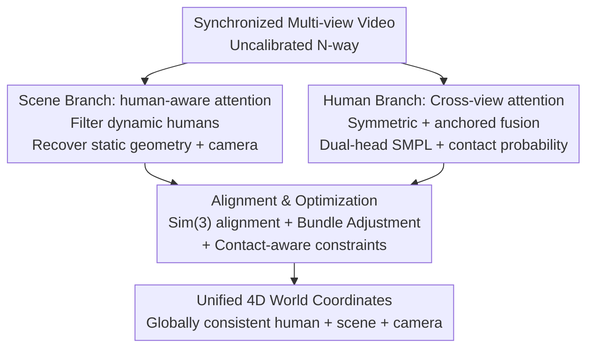

# TROPHIES: Temporal Reconstruction of Places, Humans, and Cameras from Multi-view Videos

**Conference**: CVPR 2026  
**Paper**: [CVF Open Access](https://openaccess.thecvf.com/content/CVPR2026/html/Liu_TROPHIES_Temporal_Reconstruction_of_Places_Humans_and_Cameras_from_Multi-view_CVPR_2026_paper.html)  
**Area**: 3D Vision  
**Keywords**: Multi-view video, Human-scene joint reconstruction, 4D reconstruction, Camera pose, Contact constraints

## TL;DR
TROPHIES proposes the new task of "unified reconstruction of humans, scenes, and cameras from multi-view videos." Using a decoupled human branch + a plug-and-play scene branch + a global alignment optimization module, it integrates dynamic humans, static geometry, and camera trajectories into a single metric-consistent 4D world coordinate system, reducing W-MPJPE by more than half on EgoHumans / EgoExo4D.

## Background & Motivation

**Background**: Understanding how humans move and interact within 3D environments is a long-standing goal in CV and embodied AI. For years, human motion estimation (HMR2, TRAM, GVHMR, etc.) and static scene reconstruction (DUSt3R, MonST3R, CUT3R, etc.) have performed well individually, but they reconstruct "two disconnected worlds."

**Limitations of Prior Work**: Human estimators predict poses in local camera coordinates, leading to temporal drift. Scene reconstruction pipelines only recover up-to-scale geometry and often treat dynamic humans as noise to be ignored. A few joint methods (JOSH, Human3R) only support single-view inputs and rely heavily on priors, resulting in physical inconsistencies like scale mismatch, foot-ground penetration, or floating. Multi-view HSfM optimizes frames independently, causing scale drift over time and jittery human positions when aggregated.

**Key Challenge**: There is a lack of a unified framework to integrate **human, scene, and camera into a globally consistent 4D world**. The difficulty lies in simultaneously integrating geometric cues, motion cues, and physical constraints while aligning multiple independent coordinate systems into a single reference frame—doing any part alone is insufficient; the key is "coupling."

**Goal**: To define and solve the new task of *unified human–scene–camera reconstruction from multi-view videos*: given time-synchronized multi-view videos, jointly estimate dynamic humans $H_t^h$, static scene point maps $S_t^n$, and camera parameters $(R_t^n, t_t^n, \alpha_t)$, all unified in a metric world coordinate system.

**Key Insight**: The authors choose a **multi-view** format because it provides stronger geometric cues and mitigates scale ambiguity. They emphasize that the structure is view-agnostic—it degrades to a temporally coherent and scale-stable version in single-view scenarios, thus covering multi-camera arrays, sparse cameras, and handheld monocular captures.

**Core Idea**: Utilizing a "human branch + scene branch + global alignment optimization" trio, the scene branch uses human-aware attention to "filter out" dynamic humans from static geometry. The human branch employs cross-view attention to obtain multi-view consistent SMPL models. Finally, Sim(3) alignment + bundle adjustment + contact constraints **tightly couple** the two branches into the same coordinate system.

## Method

### Overall Architecture
The input to TROPHIES is a set of uncalibrated, time-synchronized multi-view videos $\{V^n\}_{n=1}^N$. The output includes temporally coherent humans, static scene point maps, and camera trajectories in a unified metric world coordinate system. It decomposes reconstruction into three collaborative components: the **scene branch** uses human-aware attention to recover static geometry and camera poses without interference from human motion; the **human branch** uses symmetric + anchored cross-view attention to estimate temporally coherent SMPL models and outputs "stationary/contact probabilities"; the **alignment and optimization module** first uses Sim(3) to register external estimates (SLAM trajectories, monocular depth) to the scene branch coordinate system, then uses joint human-scene bundle adjustment + contact-aware optimization to bind the three components together for physically plausible 4D reconstruction.

### Key Designs

**1. Scene Branch: Stabilizing static geometry in the presence of dynamic humans via human-aware attention**

The limitation is straightforward: dense multi-view reconstruction methods like DUSt3R / MonST3R / CUT3R assume static scenes. If people move, features from human regions "contaminate" cross-view matching, causing geomery and camera trajectories to collapse. Unlike explicit segmentation and removal, the authors **modulate weights in the attention layers** to implicitly suppress dynamic regions. This branch is **training-free** (frozen backbone, inference-only modifications).

For DUSt3R / MonST3R, given images of different views/times, the backbone $\mathcal{B}$ predicts point maps and camera parameters. The authors inject a human mask $M_{\text{human}}^{a\leftarrow b} = (1-M_{\text{human}}^a)\otimes(M_{\text{human}}^b)^T$ (where $\otimes$ is the outer product), ensuring tokens from human regions in view $b$ do not pass information to static regions in view $a$. This is implemented by zeroing out the corresponding attention:

$$\text{softmax}^{a\leftarrow b}(\hat{A})=\begin{cases}0 & \text{if } M_{\text{human}}^{a\leftarrow b}\\ \text{softmax}(A^{a\leftarrow b}) & \text{otherwise}\end{cases}$$

For CUT3R, which has a memory mechanism, the authors use **multi-memory decoupling**: one memory bank aggregates multi-view human+scene features at the same timestamp (ensuring spatial consistency), while another stores static scene features across time (ensuring temporal stability), separating static and dynamic information across time and views.

**2. Human Branch: Two-step cross-view attention (Symmetric Interaction + Anchored Fusion)**

Single-view methods only model temporal dependence and cannot resolve cross-view ambiguities or ensure multi-camera consistency. The human branch uses a **weight-sharing** Human Video Transformer for each view to extract spatio-temporal tokens, followed by two-step cross-view interaction. First, **symmetric interaction**: tokens from all views attend to each other to capture geometric correspondence and complementary visibility, yielding multi-view contextual features $F'_n$. Second, **anchored fusion**: a designated anchor view (typically the frontal/most stable camera) provides the query, while other reference views provide the key/value:

$$F''_{\text{anchor}}=\text{softmax}\!\left(\frac{Q_{\text{anchor}}K_{\text{ref}}^T}{\sqrt{d}}\right)V_{\text{ref}}$$

The anchor view representation is thus enhanced by the geometry/appearance cues of reference views while maintaining its spatial structure. The system outputs **only the 3D joints of the anchor view**. Global features are decoded by a Transformer Decoder + Temporal Layer to output: (1) SMPL parameters $(\phi_{(n,t)}^h,\theta_{(n,t)}^h,\beta_n^h)$; (2) stationary/contact probability maps $p_{(n,t)}^h$, identifying regions likely in contact with the scene to provide physical constraints.

**3. Alignment & Optimization: Sim(3) Alignment + Joint Bundle Adjustment + Contact-aware Optimization**

The two branches have inconsistent coordinate systems and scales. In the **alignment** stage, a similarity transform $S_i=[s_i,R'_i,T'_i]\in\text{Sim}(3)$ is solved to register external estimates to the scene branch coordinate system:

$$S_i=\arg\min_{S\in\text{Sim}(3)}\sum_{\mathbf{x}\in\Omega_i}\left\|S\cdot K^{-1}[\mathbf{x},D_i(\mathbf{x})]-\mathbf{P}_i(\mathbf{x})\right\|_2^2$$

This covers both dynamic sequences (using DROID-SLAM and ZoeDepth) and static cameras (using ZoeDepth).

The **optimization** stage performs two tasks. First, **joint human-scene bundle adjustment** minimizes reprojection errors across all frames/views while updating camera parameters, scene geometry, and human poses: $\mathcal{L}_{\text{BA}}=\frac{1}{NT}\sum_{n,t}\mathcal{L}_{\text{Scene}}+\frac{1}{NTH}\sum_{n,t,h}\mathcal{L}_{\text{Human}}$. Second, **contact-aware optimization**: based on gravity alignment and the estimated floor, a set of potential contact vertices $\mathcal{C}$ on SMPL hands/feet is encouraged to stay close to the scene surface while penalizing penetration:

$$\mathcal{L}_{\text{contact}}=\sum_{\mathbf{v}\in\mathcal{C}}\Big(w_c\cdot\text{dist}(\mathbf{v},\mathcal{S}_{\text{surface}})^2+w_p\cdot\max(0,-\mathbf{n}_{\mathcal{S}}^\top(\mathbf{v}-\mathbf{p}_{\mathcal{S}}))^2\Big)$$

### Loss & Training
The scene branch is entirely **training-free**. The human branch is trained on 2 A800 GPUs using AdamW with a batch of 16 sequences (16-frame windows) in three stages: ① Initialize with TRAM weights, train only the contact head for 10K steps; ② Train only anchored cross-attention for 20K steps (EgoHumans); ③ Full fine-tuning for 2K steps.

## Key Experimental Results

### Main Results
Evaluated on EgoHumans and EgoExo4D. Human metrics include W-MPJPE / PA-MPJPE / Accel; camera metrics include TE / s-CCA. All three backbones integrated into the framework outperform frame-wise HSfM:

| Dataset | Method | W-MPJPE↓ | PA-MPJPE↓ | Accel↓ | TE↓ | s-CCA@100↑ |
|--------|------|----------|-----------|--------|-----|-----------|
| EgoHumans | HSfM* | 227.82 | 21.93 | 57.89 | 1.79 | 0.52 |
| EgoHumans | Ours (DUSt3R) | 106.31 | 22.74 | 13.74 | 1.31 | 0.63 |
| EgoHumans | Ours (CUT3R) | **97.54** | **20.71** | 14.23 | **1.03** | **0.63** |
| EgoExo4D | HSfM* | 123.12 | 17.82 | 49.27 | 2.85 | 0.91 |
| EgoExo4D | Ours (CUT3R) | **91.7** | 16.92 | 16.72 | **1.38** | **0.99** |

Compared to HSfM, W-MPJPE decreases by over 50%, and Accel (temporal smoothness) is significantly lower, showing the qualitative benefit of global joint optimization.

### Ablation Study
Ablation of the human branch (EgoHuman):

| Configuration | PA-MPJPE↓ | MPJPE↓ | Accel↓ | Description |
|------|-----------|--------|--------|------|
| VIMO (with finetuning) | 41.4 | 81.2 | 17.9 | Strongest single-view baseline |
| Human Branch (w/o gravity) | 39.2 | 79.1 | 17.6 | Cross-view attn alone beats baseline |
| Human Branch (with gravity) | **38.8** | **77.7** | **16.8** | Best with gravity constraints |

Ablation of the scene branch human-aware attention:

| Backbone | TE↓ | AE↓ | RRA@100↑ | Description |
|------|-----|-----|----------|------|
| DUSt3R | 3.20 | 107.21 | 0.65 | baseline |
| DUSt3R + human-aware attn | 3.05 | 104.93 | 0.69 | Improvement across all metrics |

### Key Findings
- **Backbone-agnostic**: All backbones benefit, showing the framework is plug-and-play. Scene branches improve trajectory error by 4–6% without training.
- **CUT3R achieves maximum gain** with multi-memory decoupling, as separating static/dynamic across time and views complements its memory mechanism.
- **Gravity constraints provide a "free lunch"**: Adding gravity alignment to the human branch stabilizes vertical motion and reduces drift.

## Highlights & Insights
- **Turning "dynamic humans" into masks for attention**: Using the outer product $M^{a\leftarrow b}_{\text{human}}=(1-M^a)\otimes(M^b)^T$ to zero out attention is more robust than explicit "cut-outs" and requires zero training for DUSt3R/MonST3R.
- **Decoupled multi-view fusion**: The "Symmetric Interaction + Anchored Fusion" strategy captures multi-view complementarity while converging output to one view, avoiding heavy multi-view post-fusion.
- **Closing the loop with contact probabilities**: The stationary probability head is not just an auxiliary output; it directly feeds into the optimization as a physical constraint, making "firm contact with the ground" differentiable.

## Limitations & Future Work
- Alignment relies heavily on external components (DROID-SLAM, ZoeDepth). Failure in low-texture or motion-blurred scenes directly affects global scale recovery.
- Human-aware attention depends on mask quality (EgoHumans uses annotations; EgoExo4D uses Grounded SAM 2).
- Absolute human error on EgoHumans remains at the ~97mm level (W-MPJPE), which is still far from "physically exact."
- Implementation of multi-memory decoupling is different for CUT3R compared to mask-based backbones, increasing system complexity.

## Related Work & Insights
- **vs HSfM**: HSfM optimizes frame-by-frame, leading to inconsistent scales. TROPHIES optimizes the entire sequence jointly, providing a qualitative jump in temporal consistency.
- **vs JOSH / Human3R**: These are limited to single-view and suffer from scale mismatch; TROPHIES uses true multi-view + Sim(3) coupling + contact constraints to solve this.
- **vs TRAM / GVHMR**: These single-view human methods only model time; TROPHIES' human branch explicitly uses multi-view cues to resolve ambiguities.

## Rating
- Novelty: ⭐⭐⭐⭐⭐ Systematic approach to unified 4D reconstruction.
- Experimental Thoroughness: ⭐⭐⭐⭐ Good cross-backbone evaluation, though sensitivity analysis on loss weights is limited.
- Writing Quality: ⭐⭐⭐⭐ Clear definitions and well-structured diagrams.
- Value: ⭐⭐⭐⭐⭐ Highly relevant for AR/VR and embodied AI applications requiring a global understanding of human-scene interaction.

<!-- RELATED:START -->

## Related Papers

- [\[CVPR 2025\] Reconstructing People, Places, and Cameras](../../CVPR2025/3d_vision/reconstructing_people_places_and_cameras.md)
- [\[CVPR 2026\] LiDAR Prompted Spatio-Temporal Multi-View Stereo for Autonomous Driving](lidar_prompted_spatio-temporal_multi-view_stereo_for_autonomous_driving.md)
- [\[CVPR 2026\] 4D Reconstruction from Sparse Dynamic Cameras](4d_reconstruction_from_sparse_dynamic_cameras.md)
- [\[CVPR 2026\] SparseCam4D: Spatio-Temporally Consistent 4D Reconstruction from Sparse Cameras](sparsecam4d_spatio-temporally_consistent_4d_reconstruction_from_sparse_cameras.md)
- [\[CVPR 2026\] WeatherCity: Urban Scene Reconstruction with Controllable Multi-Weather Transformation](weathercity_urban_scene_reconstruction_with_controllable_multi-weather_transform.md)

<!-- RELATED:END -->
