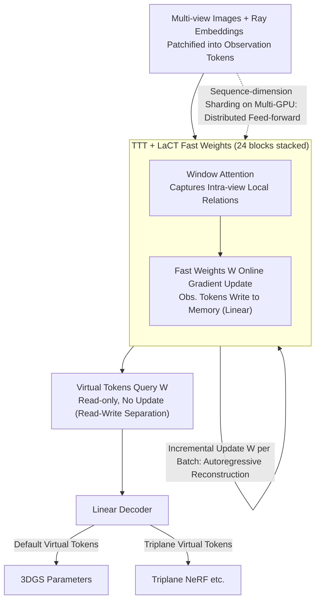

# tttLRM: Test-Time Training for Long Context and Autoregressive 3D Reconstruction

**Conference**: CVPR 2026  
**arXiv**: [2602.20160](https://arxiv.org/abs/2602.20160)  
**Area**: 3D Vision  
**Keywords**: 3D Reconstruction, Test-Time Training, Large Reconstruction Model, Gaussian Splatting, Autoregressive Reconstruction  

## TL;DR

tttLRM introduces Test-Time Training (TTT) into large-scale 3D reconstruction models for the first time. By utilizing LaCT layers, it achieves long-context and autoregressive 3D Gaussian reconstruction with linear complexity. It compresses multi-view observations into TTT fast weights to form an implicit 3D representation, which is then decoded into explicit formats like 3DGS, achieving SOTA performance on both object-level and scene-level datasets.

## Background & Motivation

Reconstructing explicit 3D representations from streaming visual input is a core objective of 3D vision, yet existing methods face significant bottlenecks:

**Traditional Optimization Methods** (NeRF, 3DGS): Require per-scene optimization, taking minutes to hours.

**Feed-forward Large Reconstruction Models** (LRM, GS-LRM): Based on attention mechanisms, the number of input views is limited (typically $\le 4$) because attention complexity is $O(N^2)$.

**Long-LRM**: Although extended to 32 views, bidirectional attention still hinders further scaling and cannot handle streaming inputs.

**Implicit Latent 3D Representations** (LVSM, etc.): Produce high-quality novel view synthesis but suffer from slow rendering and lack of controllability and interpretability.

**Key Challenge**: Long-context modeling requires schemes beyond the quadratic complexity of attention, while also supporting streaming/autoregressive inference.

**Key Insight**: The inspiration for tttLRM comes from an analogy to human perception: humans observe continuous visual streams $\to$ build abstract internal representations $\to$ decode them into explicit 3D structures as needed. The fast weights in the TTT framework correspond precisely to this "internal memory" mechanism.

## Method

### Overall Architecture

tttLRM aims to solve the limitation where existing feed-forward reconstruction models rely on attention with $O(N^2)$ complexity, making them unable to handle many input views (GS-LRM $\le 4$, Long-LRM caps at 32 and lacks streaming support). The solution is to replace "sequence modeling" with Test-Time Training: multi-view observations are compressed into a set of "fast weights" $W$ updated online during inference. $W$ acts as an implicit 3D memory that refines as observations increase, which is then queried by virtual view tokens to linearly decode explicit 3DGS. The process consists of three steps: projecting image patches into tokens $\to$ iteratively updating fast weights $W$ with tokens via LaCT layers $\to$ querying $W$ with virtual tokens and outputting 3DGS parameters through a linear decoder.

### Key Designs

**1. TTT + LaCT Fast Weights: Replacing Attention with Linear Complexity Online Learning**

The quadratic complexity of attention is the fundamental bottleneck for long contexts. TTT transforms sequence modeling into online learning—fast weights $W$ are updated via gradients based on input key-value pairs during inference, compressing the KV cache into fixed-size neural memory:

$$W \leftarrow W - \eta \nabla \mathcal{L}_{\text{MSE}}(f_W(k), v)$$

LaCT (Large Chunk TTT) further utilizes large chunk updates (up to 1M tokens) and intra-chunk gradient accumulation to maximize GPU utilization. Each LaCT layer contains three components: window attention (local relations), fast weight update (linear), and fast weight application (linear). This removes the quadratic constraint on input views and unlocks streaming/autoregressive inference.

**2. Model Architecture and Virtual Token Decoding: Obs. in, 3D out**

The model consists of 24 stacked LaCT blocks with 768 hidden dimensions and $8 \times 8$ patches. Each input image $\mathbf{I}_i$ and ray embedding $\mathbf{R}_i \in \mathbb{R}^{H \times W \times 9}$ are concatenated and tokenized, following three steps:

$$\mathbf{T}_i = \mathbf{T}_i + \text{WinAttn}(\mathbf{T}_i)$$
$$W = \text{Update}(\{\mathbf{T}_i\}_{i=1}^N)$$
$$\mathbf{T}_i^v = \text{Apply}(W, \mathbf{T}_i^v)$$

Virtual tokens $\mathbf{T}^v$ only participate in Apply and do not update $W$, ensuring "read-write separation." The decoder transforms them into per-patch Gaussian parameters (color, scale, rotation, opacity, depth). Because the output is determined by virtual tokens, the architecture is generalizable to different 3D formats (e.g., Triplane NeRF) by simply swapping the virtual token types.

**3. Autoregressive Reconstruction: Online Streaming Inference**

Due to linear updates, the model can run incrementally like an RNN: initialize $W \leftarrow W_0$; as each batch $b$ arrives, update $W \leftarrow \mathcal{F}(W, \mathcal{I}_{(b)})$ and immediately predict $G_{(b)} \leftarrow \mathcal{F}(W, \mathcal{I}^v_{(b)})$. This enables progressive online reconstruction.

**4. Distributed Feed-forward Reconstruction: Sequence Parallelism**

To accommodate more views and higher resolutions, tokens are sharded across GPUs along the sequence dimension. GPUs independentally predict Gaussians for their batches after syncing fast weights, and gradients are synced via All-Reduce during training.

### Loss & Training

$$\mathcal{L} = \mathcal{L}_{\text{RGB}} + \lambda_{\text{depth}} \mathcal{L}_{\text{depth}} + \lambda_{\text{opacity}} \mathcal{L}_{\text{opacity}}$$

Rendering loss combines MSE and VGG-19 perceptual loss. Depth regularization uses scale-invariant depth loss against pseudo-GT from a monocular estimator. Opacity regularization reduces the number of opaque Gaussians.

## Key Experimental Results

### Main Results

**Object-level Reconstruction (GSO Dataset, Tab. 1)**

| Method | Res | Views | Time (s) | PSNR ↑ | SSIM ↑ | LPIPS ↓ |
|------|--------|--------|----------|--------|--------|---------|
| GS-LRM | 256² | 8 | 0.1 | 31.55 | 0.964 | 0.028 |
| **Ours** | 256² | 8 | 0.1 | **33.14** | **0.972** | **0.024** |
| GS-LRM | 512² | 8 | 0.7 | 32.83 | 0.969 | 0.029 |
| **Ours** | 512² | 8 | **0.3** | **34.02** | **0.974** | **0.025** |
| GS-LRM | 512² | 16 | 2.5 | 33.55 | 0.976 | 0.023 |
| **Ours** | 512² | 16 | **0.8** | **34.67** | **0.978** | **0.022** |
| GS-LRM | 512² | 24 | 5.5 | 33.26 | 0.976 | 0.022 |
| **Ours** | 512² | 24 | **1.1** | **34.80** | **0.979** | **0.022** |

At $512^2$ resolution, inference is $2 \times$ faster than attention models, with a PSNR Gain of **>1 dB**.

**Scene-level Reconstruction (DL3DV-140 + Tanks&Temples, Tab. 2)**

| Views | Method | Time | DL3DV PSNR ↑ | T&T PSNR ↑ |
|--------|------|------|-------------|------------|
| 16 | Long-LRM | 0.4s | 22.66 | 17.51 |
| 16 | **Ours** | 3.6s | **23.60** | **18.15** |
| 32 | Long-LRM | 1s | 24.10 | 18.38 |
| 32 | Long-LRM + optim | 12s | 24.99 | 18.69 |
| 32 | **Ours** | 7.2s | **25.07** | **19.22** |
| 64 | Long-LRM | 3.7s | 24.63 | 19.11 |
| 64 | **Ours** | 14.8s | **25.95** | **20.31** |

### Ablation Study

**Impact of Pre-training (Tab. 3)**:

| 3D Repr. | Pre-trained | PSNR ↑ | LPIPS ↓ |
|---------|-----------|--------|---------|
| GS | No | 32.77 | 0.026 |
| GS | **Yes** | **33.14** | **0.024** |
| Triplane | No | 26.40 | 0.093 |
| Triplane | **Yes** | **27.87** | **0.075** |

Initializing from TTT-LVSM pre-training significantly accelerates convergence and improves quality.

**Autoregressive Strategy (Tab. 4)**:

| Strategy | PSNR ↑ | SSIM ↑ | LPIPS ↓ |
|------|--------|--------|---------|
| Predict & Merge | 21.50 | 0.891 | 0.318 |
| **Full Reconst. (Ours)** | **23.63** | **0.904** | **0.259** |

"Predict & Merge" is efficient but suffers from error accumulation (2.13 dB drop in PSNR).

## Highlights & Insights

1.  **TTT Fast Weights as Implicit 3D Memory**: This is an elegant analogy—fast weights update dynamically during inference, naturally representing a 3D internal state that refines with more observations.
2.  **Significance of Linear Complexity**: Not only supports more views but also unlocks **autoregressive/streaming reconstruction**, which is impossible for standard attention models.
3.  **Effectiveness of Pre-training Transfer**: The transfer from NVS to explicit 3D is effective, showing that implicit 3D understanding can transfer across representation formats.
4.  **Multi-format Unification**: The same framework can output 3DGS or Triplane NeRF by simply changing virtual tokens.
5.  **Sequence Parallelism**: Leveraging the linear nature of LaCT updates allows for near-linear multi-GPU acceleration.

## Limitations & Future Work

1.  **Fixed Fast Weight Capacity**: Neural memory has finite capacity; extremely complex scenes might exceed the capacity to encode details.
2.  **Quality-Speed Trade-off**: Compared to implicit models like LVSM, explicit 3D quality is slightly lower, though it gains real-time rendering.
3.  **Dependency on Depth Pseudo-GT**: Scene-level training relies on monocular depth estimators; errors propagate to the final 3D reconstruction.
4.  **Non-real-time Inference for Scenes**: While $100 \times$ faster than optimization, scene-level 64-view reconstruction takes $\sim 15$s, not yet achieving real-time streaming.

## Rating

⭐⭐⭐⭐⭐ (5/5)

This is a forward-looking work. Introducing TTT to 3D reconstruction is a natural yet profound innovation. Linear complexity enables long-context and autoregressive modeling. The experiments are comprehensive, and the strategy of transferring from NVS pre-training to explicit 3D is practical. This architecture sets a foundation for future real-time 3D perception systems.

<!-- RELATED:START -->

## Related Papers

- [\[CVPR 2026\] ZipMap: Linear-Time Stateful 3D Reconstruction via Test-Time Training](zipmap_linear-time_stateful_3d_reconstruction_via_test-time_training.md)
- [\[CVPR 2026\] Scal3R: Scalable Test-Time Training for Large-Scale 3D Reconstruction](scal3r_scalable_test-time_training_for_large-scale_3d_reconstruction.md)
- [\[CVPR 2026\] Learning 3D Reconstruction with Priors in Test Time](tco_learning_3d_reconstruction_with_priors_in_test_time.md)
- [\[ICLR 2026\] TTT3R: 3D Reconstruction as Test-Time Training](../../ICLR2026/3d_vision/ttt3r_3d_reconstruction_as_test-time_training.md)
- [\[CVPR 2026\] Low-Rank Test-Time Training for Pre-Trained Point Cloud Models](low-rank_test-time_training_for_pre-trained_point_cloud_models.md)

<!-- RELATED:END -->
