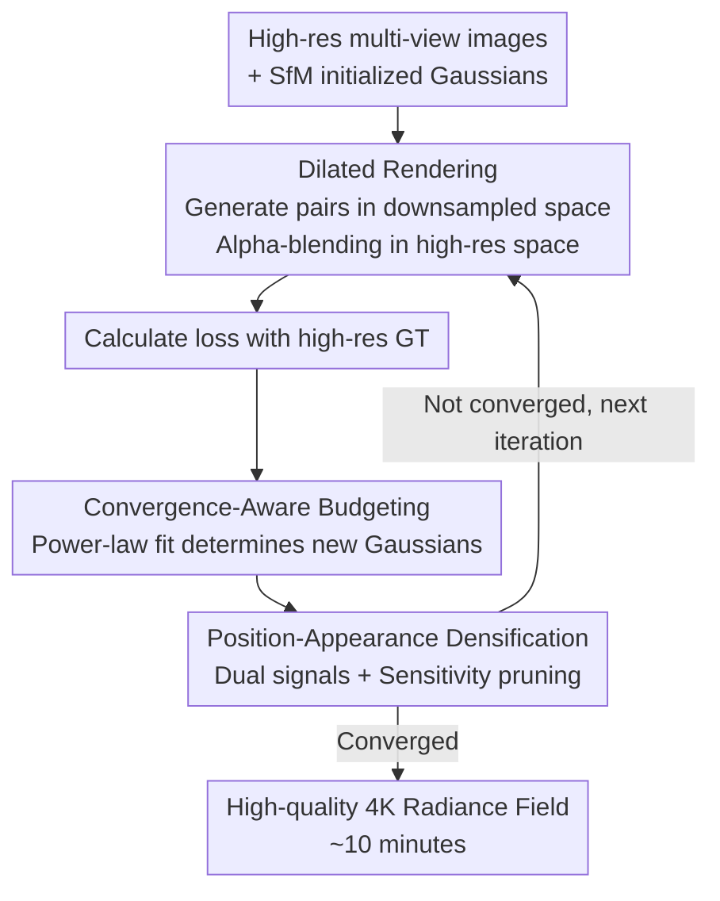

# Turbo-GS: Accelerating 3D Gaussian Fitting for High-Resolution Radiance Fields

**Conference**: CVPR 2026  
**arXiv**: [2412.13547](https://arxiv.org/abs/2412.13547)  
**Code**: https://ivl.cs.brown.edu/research/turbo-gs (Project Page)  
**Area**: 3D Vision / Radiance Fields / Gaussian Splatting  
**Keywords**: 3D Gaussian Splatting, High-Resolution, Dilated Rendering, Densification, Training Acceleration

## TL;DR
Turbo-GS reduces the 3DGS fitting time for 4K scenes from hours to approximately 10 minutes (e.g., 13 minutes for 4K bicycle, 3× faster than Taming 3DGS and 14× faster than 3DGS) through a trifecta of "dilated rendering computing sparse sub-pixel pairs + power-law convergence-aware Gaussian budget scheduling + color gradient-assisted densification," while maintaining or even improving rendering quality (especially LPIPS).

## Background & Motivation

**Background**: 3D Gaussian Splatting (3DGS) has become the mainstream solution for New View Synthesis (NVS), enabling high-quality real-time rendering at 1K resolution. However, "fast rendering" does not equate to "fast fitting"—fitting a high-quality Gaussian set for a static scene with 200 views takes about half an hour at 1K and several hours at 4K.

**Limitations of Prior Work**: Existing acceleration efforts mostly focus on CUDA kernels (faster backpropagation, more accurate tile-Gaussian pairing, load balancing), attribute quantization, point reduction, or second-order optimizers. However, these are almost exclusively analyzed at low resolutions, ignoring the true bottlenecks in high-resolution scenes. Another category of feed-forward/learning-based methods produces results in seconds but is restricted to a fixed number of views and low resolutions, failing to handle dense 4K inputs.

**Key Challenge**: Runtime profiling across different resolutions (Fig. 2) reveals that as resolution increases, the overhead of tile-Gaussian pair generation (`duplicateWithKeys`) and depth sorting (`sortPairs`) explodes proportionally to the number of pixels, becoming even more expensive than alpha-blending itself at high resolutions. In other words, a massive amount of computation at high resolution is spent on "pixel-wise dense supervision," which is highly redundant since a single Gaussian affects multiple pixels in tile-based rendering.

**Goal**: To specialize in per-scene optimization for high-resolution 3DGS without relying on learning priors or sacrificing quality, maximizing the "computational units spent on supervision." This can be broken into two sub-problems: (1) reducing the computational footprint of each iteration; (2) improving the optimization efficiency of each iteration (better budgeting and densification).

**Key Insight**: Since one Gaussian impacts multiple pixels and dense supervision is redundant, **only a subset of pixels should be rendered to calculate the loss** (analogous to ray sampling in NeRF). However, the coupling between tile-based rendering and Gaussian projection in 3DGS makes it impossible to extract single rays independently like NeRF—this is the primary engineering challenge addressed.

**Core Idea**: Use checkerboard "dilated sampling" to generate tile-Gaussian pairs in a downsampled space while performing alpha-blending in the original high-resolution space (saving computation while preserving quality). This is combined with power-law convergence-aware Gaussian budget scheduling and color gradient-assisted densification to make every iteration cost-effective and efficient.

## Method

### Overall Architecture
Turbo-GS does not change the 3DGS representation but modifies "how to fit Gaussians quickly and effectively." Built upon 3DGS / Scaffold-GS (with optimized CUDA backpropagation kernels from Taming 3DGS), it introduces three independent and stackable modules within the training iteration: first, **Dilated Rendering** reduces rendering overhead (pairing in downsampled grids, blending in high-res); second, **Convergence-Aware Budget Scheduling** determines the number of new Gaussians (dynamically controlled by power-law fitting of the loss curve); finally, **Position-Appearance Densification** determines where to add points (using both position and color gradient signals to fix gradient vanishing in textureless areas), supplemented by sensitivity pruning to remove redundancy.

### Key Designs

**1. Dilated Rendering: Pairing in downsampled space, blending in high-res space**

Address the bottleneck where tile-Gaussian generation and sorting scale linearly with pixel count. Turbo-GS uses checkerboard dilated sampling to extract a pixel subset from the original image (controlled by dilation factor $d$ and offsets $(o_x, o_y)$). The key is the separation of two steps: (1) **Tile-Gaussian pairing is done on the downsampled map**—projecting 3D positions to resolution-independent NDC space $p^{\mathrm{NDC}}$, mapping to downsampled image planes $p_x^{\mathrm{ds}} = W^{\mathrm{ds}} p_x^{\mathrm{NDC}}$, $p_y^{\mathrm{ds}} = H^{\mathrm{ds}} p_y^{\mathrm{NDC}}$, and calculating the 2D covariance with a $3\sigma$ radius $r$. The search radius in downsampled space is $r^{\mathrm{ds}} = r/d$. (2) **Alpha-blending returns to the original high-resolution space**, where downsampled coordinates are mapped back $p_x = d\,p_x^{\mathrm{ds}} + \tfrac{1}{2}(d-1)$ to be supervised by corresponding high-res ground truth pixels.

This keeps GPU computation, scheduling, and memory access at a cheaper downsampled scale, while high-res blending prevents quality degradation. Since tile size is fixed at $16\times16$, one tile in downsampled space equals $d^2$ tiles in high-res, introducing slight tile mismatch; however, PSNR remains above 70dB, proving the error is negligible. Training uses $d=2$ with random offsets per iteration. This is the primary driver of acceleration.

**2. Convergence-Aware Budget Scheduling: Power-law fitting of loss curves**

Address the difficulty of managing the growth rate from initial $N$ to maximum $M$ Gaussians—growing too fast contaminates optimization, too slow wastes iterations. A pattern was observed (Fig. 4): after the initial stage, $\log(\text{loss})$ and $\log(\text{iterations})$ are almost perfectly linear, suggesting convergence follows a power function. The adaptive budget begins with a base exponent $\alpha_{\text{base}}$, fits the historical exponent $\alpha_{\text{history}}$ using EMA-smoothed history, and adjusts the current power $\alpha$ based on the deviation of the recent local exponent $\alpha_{\text{recent}}$:

$$\alpha = \alpha_{\text{base}} + \lambda \cdot \tanh(\epsilon),\qquad B(t) = N + \frac{t^{\alpha} - 1}{100^{\alpha} - 1}\,(M - N).$$

Where $\lambda=0.5$ and $B(t)$ is the allowed Gaussian budget at step $t$. The intuition is: if convergence is slower than expected, slow down densification; otherwise, speed it up. This matches point growth with optimization speed.

**3. Position-Appearance Densification: Dual signals to solve gradient vanishing**

Address the limitation where 3DGS only densifies at high position gradients. In textureless areas (e.g., grass), small position changes barely affect error, leading to zero gradients and blurry results. Visualization (Fig. 5) shows that **color gradients provide richer signals across overall and blurry regions**. Thus, both position gradient threshold $\tau_{\text{position}}$ and color gradient threshold $\tau_{\text{color}}$ are used. As color gradients are smaller, $\tau_{\text{color}} = 0.01\,\tau_{\text{position}}$ is used. To avoid overfitting training views, appearance densification is activated with a 20% probability.

Additionally, **sensitivity pruning** is implemented. Despite dilated rendering skipping pixels, the sensitivity scores remain consistent, allowing pruning at a 60% threshold to remove redundant points without quality loss.

### Loss & Training
The standard MSE + L1 rendering supervision is used. 3DGS-based models run for 30k iterations; Scaffold-GS-based models are optimized for 10k iterations for speed, with densification occurring in the first 3k steps. All evaluations were performed on a single NVIDIA A100.

## Key Experimental Results

### Main Results

4K scenes (MipNeRF-360 + EyefulTower) compared against original and "accelerated community" baselines (MipNeRF-360 4K selection):

| Method | SSIM↑ | PSNR↑ | LPIPS↓ | Training Time↓ |
|------|-------|-------|--------|-----------|
| 3DGS | 0.797 | 26.75 | 0.410 | 113 m |
| 3DGS-accel | 0.791 | 26.52 | 0.364 | 40 m |
| **Turbo-3DGS (Ours)** | **0.805** | **26.80** | **0.327** | **24 m** |
| Scaffold-GS | 0.794 | 26.84 | 0.359 | 143 m |
| Scaffold-GS-accel | 0.784 | 25.81 | 0.373 | 12 m |
| **Turbo-Scaffold-GS (Ours)** | 0.800 | 26.65 | **0.327** | **9 m** |

Representative Gain: 4K bicycle scene converges in 13 minutes, 3× faster than Taming 3DGS (40m) and 14× faster than 3DGS (187m). LPIPS is consistently superior.

### Ablation Study

MipNeRF-360 (9 scenes), cumulative modules added (DR=Dilated Rendering, CA=Convergence-Aware, CG=Color Gradient):

| Configuration | Time | PSNR | SSIM | LPIPS | Note |
|------|------|------|------|-------|------|
| 3DGS (accel) | 31m | 26.52 | 0.791 | 0.364 | Baseline |
| +DR | 14m | 26.66 | 0.799 | 0.338 | DR: ~2× Speedup, quality improves |
| +CA | 12m | 26.58 | 0.795 | 0.347 | CA: Further time reduction |
| +CG | 16m | 26.75 | 0.803 | 0.328 | CG: Significant quality gain |
| Scaffold-GS (10k) | 12m | 25.81 | 0.784 | 0.373 | Baseline |
| +DR | 7m | 25.58 | 0.780 | 0.375 | Main speedup |
| +CA | 8m | 26.22 | 0.795 | 0.344 | Stabilizes Scaffold-GS, quality jump |
| +CG | 9m | 26.34 | 0.797 | 0.332 | Further quality improvement |

### Key Findings
- **Dilated Rendering is the primary speedup**: DR alone provides ~2× speedup and improves SSIM/LPIPS by removing redundant supervision.
- **Backbone differences for CA**: CA benefits Scaffold-GS significantly (PSNR 25.58→26.22) but slightly affects 3DGS, likely because 3DGS opacity resets disturb the power-law assumption.
- **Color Gradient improves quality**: Does not affect speed but recovers details in textureless/high-frequency areas, lowering LPIPS.

## Highlights & Insights
- **Resolution as a neglected dimension**: While others optimize CUDA or memory, this work questions the necessity of every supervision unit. Sub-pixel supervision is essentially "subtraction" in the resolution dimension.
- **Engineering elegance of DR**: Decoupling pairing at low-res and blending at high-res via NDC space is a clever solution to tile-based coupling. This is highly portable.
- **Power-law for 3DGS convergence**: Converting the $\log(\text{loss})$-$\log(\text{iter})$ linear observation into an operational control law for model capacity is an effective bridge from empirical observation to mechanism.
- **Gradient-driven diagnosis**: Visualizing gradient distribution to identify vanishing signals in textureless regions ensures densification improvements are principled.

## Limitations & Future Work
- The learning-free design does not utilize geometric foundation models.
- CA modules are backbone-dependent; the 3DGS opacity reset mechanism may conflict with power-law assumptions.
- Power-law assumptions are based on MSE/L1; validity under perceptual or adversarial losses is unverified.
- Focused on dense, static scenes; performance on sparse-view or dynamic scenes is not addressed.

## Related Work & Insights
- **vs Taming 3DGS**: Taming uses a score-based framework for quality, taking >10 mins; Turbo-GS targets supervision redundancy, achieving 3× speedup on 4K with better LPIPS.
- **vs Mini-Splatting / Speedy-Splat**: These focus on point reduction; Turbo-GS uses sensitivity scores for pruning but derives main speed from Dilated Rendering.
- **vs 3DGS-LM**: 3DGS-LM replaces Adam with an LM optimizer; Turbo-GS reduces per-step footprint and schedules densification, offering an orthogonal approach.
- **vs Feed-forward (PixelSplat, MVSplat)**: Feed-forward models are fast but resolution-locked; Turbo-GS handles arbitrary view counts at high resolution.

## Rating
- Novelty: ⭐⭐⭐⭐⭐ 
- Experimental Thoroughness: ⭐⭐⭐⭐☆ 
- Writing Quality: ⭐⭐⭐⭐☆ 
- Value: ⭐⭐⭐⭐⭐ 

<!-- RELATED:START -->

- **Scaffold-GS**: Structured 3D Gaussians for View-Consistent Rendering.
- **Taming 3DGS**: High-Quality Rendering with Optimized Backpropagation.
- **Speedy-Splat**: Sensitive Pruning for Efficient Gaussian Splatting.

<!-- RELATED:END -->

## Related Papers

- [\[CVPR 2026\] Evidential Neural Radiance Fields](evidential_neural_radiance_fields.md)
- [\[CVPR 2026\] Confidence-Guided Multi-Scale Aggregation for Sparse-View High-Resolution 3D Gaussian Splatting](confidence-guided_multi-scale_aggregation_for_sparse-view_high-resolution_3d_gau.md)
- [\[CVPR 2026\] BEA-GS: BEyond RAdiance Supervision in 3DGS for Precise Object Extraction](bea-gs_beyond_radiance_supervision_in_3dgs_for_precise_object_extraction.md)
- [\[CVPR 2026\] Faster-GS: Analyzing and Improving Gaussian Splatting Optimization](faster-gs_analyzing_and_improving_gaussian_splatting_optimization.md)
- [\[CVPR 2026\] LoG3D: Ultra-High-Resolution 3D Shape Modeling via Local-to-Global Partitioning](log3d_ultra-high-resolution_3d_shape_modeling_via_local-to-global_partitioning.md)

<!-- RELATED:END -->
