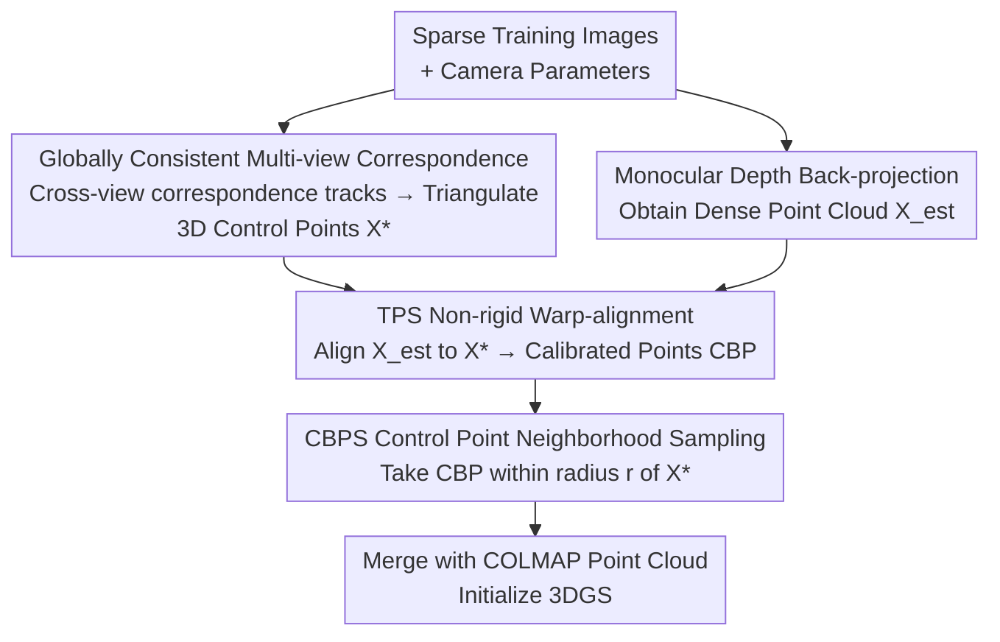

# TWINGS: Thin Plate Splines Warp-aligned Initialization for Sparse-View Gaussian Splatting

**Conference**: CVPR 2026  
**arXiv**: [2605.22069](https://arxiv.org/abs/2605.22069)  
**Code**: None  
**Area**: 3D Vision  
**Keywords**: Sparse-view, 3D Gaussian Splatting, Thin Plate Splines (TPS), Point cloud initialization, Non-rigid registration

## TL;DR
TWINGS utilizes Thin Plate Splines (TPS) to non-rigidly align dense point clouds back-projected from monocular depth to sparse 3D control points obtained via multi-view triangulation. Dense and geometrically accurate initial point clouds are then sampled near these control points and provided as a plug-and-play module for 3DGS. This significantly outperforms existing methods in Extremely Sparse-view scenarios on DTU / LLFF / Mip-NeRF360 (e.g., DTU 3-view PSNR 21.52, >1.6 dB higher than the runner-up).

## Background & Motivation
**Background**: The rendering quality of 3D Gaussian Splatting (3DGS) is highly dependent on the quality of the initial point cloud. The standard practice is to use SfM (e.g., COLMAP) to reconstruct point clouds from multiple views to initialize Gaussian positions, providing critical geometric constraints for optimization.

**Limitations of Prior Work**: In sparse-view scenarios (e.g., 3 images), COLMAP fails to find sufficient feature matches, resulting in extremely sparse point clouds that lack geometric cues to constrain the scene. Consequently, 3DGS tends to overfit training views, converge to incorrect local optima, and produce floaters. Although 3DGS includes a densification mechanism, it cannot place new Gaussians in geometrically reasonable positions if the initial points are too sparse.

**Key Challenge**: To alleviate sparsity, many works introduce monocular depth as a geometric prior. However, there is a fundamental dilemma: COLMAP point clouds are sparse and unreliable, while alternative monocular depths inherently suffer from **scale ambiguity**, which is **spatially varying and non-rigid**. Existing methods, such as multiplying depth by a single global scale factor (LS) or learning a correlation (CoMapGS), are limited to **single rigid transformations**. They fail to correct complex non-rigid distortions between different views, thus introducing errors into the initialization.

**Goal**: To warp-align dense but geometrically inconsistent monocular depth point clouds to the true scene geometry, obtaining an initial point cloud that is both dense and geometrically accurate.

**Key Insight**: The authors intervene solely at the **initialization** stage (without modifying the 3DGS training process) and select Thin Plate Splines (TPS) as the deformation model. TPS is specifically designed for "correspondence-driven alignment," enabling exact interpolation at control points while minimizing bending energy. This allows the corrections at reliable references to propagate smoothly to the neighborhood within seconds, avoiding an initialization bottleneck.

**Core Idea**: Replace single global scaling with TPS non-rigid deformation to align back-projected depth to triangulated control points, followed by sampling near the control points for 3DGS initialization.

## Method

### Overall Architecture
TWINGS is a **plug-and-play initialization module (TWINGS-Init)**. The pipeline consists of three steps: ① Establishing globally consistent multi-view correspondences across all training views and triangulating reliable 3D "desired control points" (pink); ② Back-projecting monocular depth for each image to obtain dense "back-projected points" (green), then fitting a TPS deformation field using the "back-projected point ↔ triangulated point" correspondence to warp the dense point cloud to the scene geometry, resulting in Calibrated Backprojected Points (CBP); ③ Sampling CBP only within a radius $r$ of reliable control points (CBPS), merging them with the original COLMAP point cloud to initialize 3DGS positions. The input consists of sparse training images and camera parameters; the output is a dense, geometrically accurate initial point cloud.

### Key Designs

**1. Globally Consistent Multi-view Correspondence and Triangulated Control Points: Providing Reliable "Targets" for TPS**

TPS deformation requires a set of high-quality desired control points as alignment targets, and their geometric consistency determines the deformation quality. Instead of pairwise matching, the authors use a dense matcher to construct **global correspondence tracks** across all training views: for each query pixel $p_i^q$, they collect matches $C^j(p_i^q)$ in all other images $I^j (j \neq q)$, forming a global correspondence set $\mathcal{M}$ (Eq. 4). Assuming all pixels in a track observe the same 3D point $X_i$, an initial estimate is solved via Direct Linear Transformation (DLT) $AX_i=0$ (Eq. 5), followed by non-linear optimization to minimize total reprojection error $X_i^* = \arg\min_X \sum_{k=1}^{K+1} \|\pi(P^k X) - p_i^k\|_2^2$ (Eq. 6). Ablations show that multi-view correspondence yields more coherent and accurate 3D points than pairwise matching, improving TPS deformation and rendering quality (DTU 3-view PSNR 21.32 → 21.52).

**2. TPS Non-rigid Warp-alignment: Warping Dense Depth Point Clouds to Real Geometry**

This is the core contribution addressing the "spatially varying, non-rigid scale ambiguity of monocular depth." Estimated depth $D_{est}$ is back-projected using camera intrinsics $K$ (Eq. 3: $X_{i,j} = K^{-1}[i,j,1]^T D_{i,j}$) to get dense points $X_{est}$. "Initial control points" $X_{est}(p^q)$ are extracted at matched pixels and paired with "target control points" $X^*(p^q)$ to solve for TPS parameters. The TPS deformation field is decomposed into global affine and local non-affine parts (Eq. 11):

$$TPS(X) = t + AX + \sum_{p^q \in M} w_{p^q} U(\|X - X^*(p^q)\|)$$

where $t \in \mathbb{R}^3$ and $A \in \mathbb{R}^{3 \times 3}$ represent the global affine transformation (translation, rotation, scaling), $w_{p^q}$ are local non-linear weights for each control point, and $U(r) = r$ is the radial basis function. These parameters are solved via a linear system. Applying TPS to the entire $X_{est}$ yields the **Calibrated Backprojected Points (CBP)**. Compared to LS (single scale + offset), FFD (grid-based, no alignment guarantee), and NURBS (high overhead), TPS provides the best trade-off between performance and computation by exactly interpolating correspondences and minimizing bending energy in seconds.

**3. Calibrated Backprojected Point Sampling (CBPS): Trusting Points Near Control Points**

Even after alignment, geometric errors may persist in regions far from reliable control points. CBPS performs spatial filtering: it retains only CBP that fall within a radius $r$ of a triangulated control point:

$$\mathcal{S}_{\text{CBPS}} = \bigcup_{x \in X^*} \{b \in \mathcal{B} \mid \|b - x\| \le r\}$$

where $\mathcal{B}$ is the set of all CBP. The radius $r$ is defined as a fraction of the scene scale $S$ (bounding sphere radius of camera poses). This preserves density while locking initial points into reliable geometric neighborhoods. The radius $r$ is adaptive: 3-view scenes require a larger $r$ ($S \cdot 1/8$) to compensate for extreme COLMAP sparsity, while 9-view scenes prioritize quality over quantity since the point cloud is already relatively dense.

### Loss & Training
TWINGS is responsible only for initialization. 3DGS training follows the structural regularization strategy of DropGaussian, with a total loss (Eq. 13):

$$\mathcal{L} = \mathcal{L}_1(\hat I, I) + \lambda_1 \mathcal{L}_{D\text{-}SSIM}(\hat I, I) + \lambda_2 \mathcal{L}_D(\hat D, D_{est})$$

where $\mathcal{L}_1$ and $\mathcal{L}_{D\text{-}SSIM}$ are photometric losses, and $\mathcal{L}_D$ is the depth loss between rendered depth $\hat D$ and estimated depth $D_{est}$ ($\lambda_1=0.2, \lambda_2=0.01$). The TWINGS-Init process takes approximately 12.45 s, adding nearly zero overhead to 3DGS training.

## Key Experimental Results

### Main Results
On the DTU dataset (3/6/9 views), TWINGS achieves SOTA across PSNR/SSIM/LPIPS/AVGE, with the most significant gain in the 3-view setting:

| Dataset | Views | Metric | TWINGS | Next Best | Notes |
| :--- | :--- | :--- | :--- | :--- | :--- |
| DTU | 3-view | PSNR↑ | **21.52** | 19.92 (FreeNeRF) | +1.6 dB |
| DTU | 3-view | SSIM↑ | **0.880** | 0.853 (CoR-GS) | |
| DTU | 3-view | LPIPS↓ | **0.107** | 0.119 (CoR-GS) | |
| DTU | 9-view | PSNR↑ | **28.22** | 27.75 (DropGaussian) | |
| Mip-NeRF360 | 12-view | PSNR↑ | **20.35** | 19.74 (DropGaussian) | |
| Mip-NeRF360 | 12-view | SSIM↑ | **0.618** | 0.591 (CoMapGS) | |
| LLFF | 3-view | PSNR↑ | **21.49** | 21.11 (CoMapGS) | |
| LLFF | 3-view | LPIPS↓ | **0.167** | 0.182 (CoMapGS) | |

Qualitatively, competing methods fail to reconstruct window frames or misalign text on DTU, miss white columns on Mip-NeRF360, or lose ceiling sprinklers on LLFF. TWINGS faithfully recovers these high-frequency details.

### Ablation Study
| Configuration | Key Metric | Notes |
| :--- | :--- | :--- |
| Full (multi-view correspondence) | DTU 3-view PSNR 21.52 / SSIM 0.880 | Complete model |
| w/ pairwise correspondence | DTU 3-view PSNR 21.32 / SSIM 0.875 | Global consistency drops |
| TPS (Proposed deformation) | LLFF 3-view PSNR 21.49 / SSIM 0.754 | Best deformation method |
| FFD Replacement | LLFF 3-view PSNR 20.96 / SSIM 0.727 | Introduces distortion |
| Linear Scaling Replacement | LLFF 3-view PSNR 20.90 / SSIM 0.725 | Unstable local geometry |

Plug-and-play Gain (TWINGS-Init, DTU 3-view):

| Baseline | PSNR (w/o → w/ Init) | Gain |
| :--- | :--- | :--- |
| 3DGS | 17.65 → 20.21 | **+2.56 dB** |
| FSGS | 17.24 → 20.42 | +3.18 dB |
| CoR-GS | 19.21 → 21.27 | +1.96 dB (Surpasses original SOTA) |

### Key Findings
- **Initialization alone carries performance**: Simply replacing initialization with TWINGS-Init allows vanilla 3DGS to gain +2.56 dB, matching previous SOTA methods and proving the immense value of "good initialization" in sparse views.
- **Non-rigid deformation is crucial**: TPS > FFD > LS, validating that monocular depth scale bias is spatially varying.
- **Adaptive sampling radius**: 3-view benefits from large radii ($S \cdot 1/8$) for density, while 9-view requires quality over quantity.
- **Efficiency**: TWINGS-Init takes ~12.45 s; the TPS deformation itself is only a few seconds.

## Highlights & Insights
- **Clever use of TPS for 3DGS**: TPS is a classic image registration tool. The authors map its "correspondence-driven + minimum bending" properties to the 3DGS need for "aligning to reliable points + smooth neighbor propagation."
- **Focus on initialization, not training**: By being purely plug-and-play, TWINGS-Init improves 3DGS/FSGS/CoR-GS, showing it addresses a common upstream bottleneck (initial point cloud quality).
- **Pragmatism of CBPS**: Acknowledging residuals in deformation far from references, the simple radius filter is more robust than using all calibrated points.
- **Accurate Diagnosis**: The problem is precisely framed as a trade-off between "sparse/unreliable" and "scale ambiguity," identifying that rigid transformations are insufficient.

## Limitations & Future Work
- **Sparsity Dependency**: Improvements diminish as the view count increases or textures become rich enough for SfM to work reliably.
- **External Dependency**: Performance is bounded by the quality of monocular depth estimators and dense matchers.
- **TPS Scaling**: Linear system complexity grows with control points; large-scale scenes may need more efficient scaling.
- **Future Work**: Potential for 3-view surface reconstruction in AR/VR where fast, precise initialization is required for fine facial details.

## Related Work & Insights
- **vs DNGaussian / FSGS (Depth Regularization)**: They use monocular depth as a loss during training. TWINGS is orthogonal and can be combined for additive gains (+3.18 dB for FSGS).
- **vs CoMapGS / Linear Scaling**: These use global/rigid transformations. TWINGS uses non-rigid TPS to correct complex warping.
- **vs CoR-GS / DropGaussian (Robust Training)**: They focus on pruning outliers or dropout; TWINGS improves the source quality.
- **vs FFD / NURBS (Alternative Deformation)**: TPS is uniquely optimized for exact correspondence alignment with minimal bending, balanced for speed.

## Rating
- Novelty: ⭐⭐⭐⭐ High medical/registration tool migration, though based on established components.
- Experimental Thoroughness: ⭐⭐⭐⭐⭐ Comprehensive benchmarks and extensive ablations on all modules.
- Writing Quality: ⭐⭐⭐⭐ Clear diagnosis and motivation; complete formulas.
- Value: ⭐⭐⭐⭐ Plug-and-play, low overhead, and significant gains for sparse-view 3DGS engineering.

<!-- RELATED:START -->

## Related Papers

- [\[CVPR 2026\] Intrinsic Geometry-Appearance Consistency Optimization for Sparse-View Gaussian Splatting](intrinsic_geometry-appearance_consistency_optimization_for_sparse-view_gaussian_.md)
- [\[CVPR 2026\] DropAnSH-GS: Dropping Anchor and Spherical Harmonics for Sparse-view Gaussian Splatting](dropping_anchor_and_spherical_harmonics_for_sparse-view_gaussian_splatting.md)
- [\[CVPR 2026\] SV-GS: Sparse View 4D Reconstruction with Skeleton-Driven Gaussian Splatting](sv-gs_sparse_view_4d_reconstruction_with_skeleton-driven_gaussian_splatting.md)
- [\[CVPR 2026\] Confidence-Guided Multi-Scale Aggregation for Sparse-View High-Resolution 3D Gaussian Splatting](confidence-guided_multi-scale_aggregation_for_sparse-view_high-resolution_3d_gau.md)
- [\[CVPR 2026\] SGS-Intrinsic: Semantic-Invariant Gaussian Splatting for Sparse-View Indoor Inverse Rendering](sgs-intrinsic_semantic-invariant_gaussian_splatting_for_sparse-view_indoor_invers.md)

<!-- RELATED:END -->
