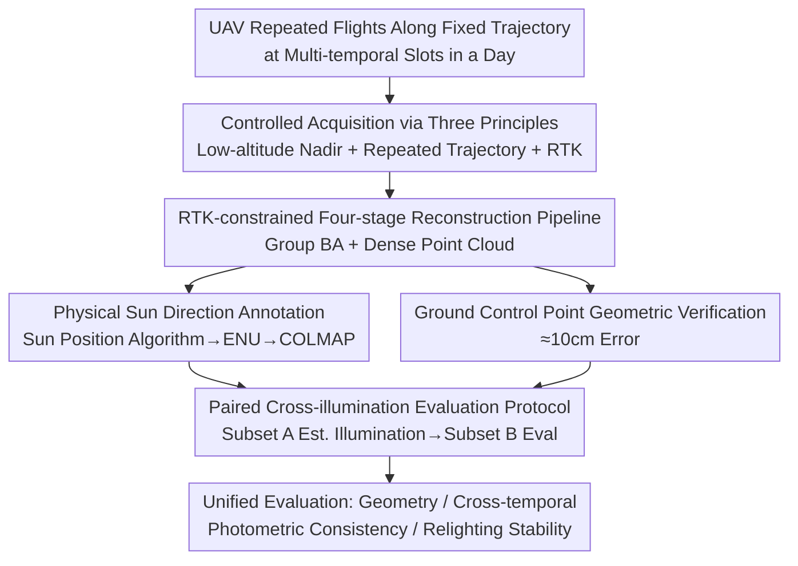

# UAVLight: A Benchmark for Illumination-Robust 3D Reconstruction in Unmanned Aerial Vehicle (UAV) Scenes

**Conference**: CVPR 2026  
**Paper**: [CVF Open Access](https://openaccess.thecvf.com/content/CVPR2026/html/Du_UAVLight_A_Benchmark_for_Illumination-Robust_3D_Reconstruction_in_Unmanned_Aerial_CVPR_2026_paper.html)  
**Code**: Project page https://uavlight.github.io/ (dataset / benchmark)  
**Area**: 3D Vision  
**Keywords**: UAV Reconstruction, Illumination Robustness, Neural Rendering, 3D Benchmark, Inverse Rendering

## TL;DR
UAVLight constructs the first multi-view 3D reconstruction benchmark for UAV scenes that isolates "natural illumination variation" as a single control variable. It contains 18 real outdoor scenes captured via repeated flights along fixed trajectories at multiple times of day, keeping the geometry, viewpoints, and calibration consistent while only the sunlight changes. Equipped with centimeter-level ground-truth point clouds calibrated by RTK and physical sun direction annotations, it enables the first fair quantitative comparison of robustness between "implicit vs. explicit illumination modeling" under cross-illumination conditions.

## Background & Motivation
**Background**: From classical SfM/MVS to NeRF and 3D Gaussian Splatting, multi-view 3D reconstruction can now recover photorealistic renderings and precise geometry from casually captured images. However, almost all commonly used benchmarks (such as MipNeRF-360, Tanks&Temples, and NeRF Synthetic) implicitly assume that **the scene is captured within a few minutes under almost constant illumination**, which is the "constant illumination assumption."

**Limitations of Prior Work**: UAV reconstruction directly violates this assumption—a single flight often lasts for hours, or is conducted at different times of day, during which the sun position, intensity, and cloud cover change significantly. Non-constant outdoor illumination leads to geometry drift, view-dependent color shifts, shadow imprinting into albedo, and unstable relighting. Existing solutions fall into two categories: (1) **Implicit appearance modeling**, which adds per-view/per-ray latent variables to neural fields to absorb variations in exposure, white balance, shadows, and weather. While robust, they lack physical interpretability and yield unreliable relighting; (2) **Explicit illumination estimation**, which decomposes appearance into albedo and illumination via inverse rendering. This is physically grounded and enables relighting, but heavily relies on strong priors (e.g., the sun-sky model), requires precise calibration, and is highly fragile under automatic exposure.

**Key Challenge**: To fairly compare the "illumination robustness" of these two types of methods, a dataset where **only illumination changes and everything else remains constant** is required. However, existing datasets either compress acquisition into a very short time window (resulting in almost unchanging illumination, offering little research value) or span several months or even years (e.g., NeRF-OSR), during which geometry, vegetation, and transient objects also change, **confounding illumination effects with other temporal variations** and making them impossible to isolate. Consequently, the relative strengths and weaknesses of implicit and explicit methods remain unquantifiable and unclear.

**Goal**: To construct a "controlled-yet-real" benchmark that decouples illumination variations from other real-world factors while retaining the complexity of real UAV acquisition, thereby supporting unified quantitative evaluation of geometric accuracy, cross-temporal photometric consistency, and relighting stability.

**Key Insight**: The authors propose three acquisition principles to "freeze other variables and only let illumination vary": (i) focus on outdoor, low-altitude scenes where sunlight is the dominant light source, avoiding indoor or multi-light-source interference; (ii) collect data during the same period over consecutive days to suppress non-illumination changes like spatial layout, vegetation, and human activity; (iii) perform repeated flights along the same waypoint trajectory to ensure comparable viewpoint coverage and parallax. Additionally, nadir flight paths significantly reduce sky pixels, mitigating high-dynamic-range (HDR) sky ambiguities.

**Core Idea**: To lock down geometry and viewpoints using "repeated trajectories + multi-temporal acquisition + centimeter-level RTK calibration," rendering natural sunlight the **sole controlled variable**. This elevates "illumination robustness" from a subjective perception to a measurable metric.

## Method

### Overall Architecture
UAVLight is essentially a combination of **data acquisition, reconstruction, annotation, and evaluation protocols** rather than a new reconstruction algorithm. Its inputs are multiple sets of RGB images (with RTK poses) captured repeatedly along fixed trajectories at different times of a day by a UAV. The outputs are: multi-illumination image sequences for each scene, a centimeter-level georeferenced point cloud (geometric ground truth), physical sun direction annotations for each temporal slot, and standardized train/val/test splits along with cross-illumination evaluation scripts. The overall data is produced through a standardized **four-stage pipeline**: data acquisition $\rightarrow$ frame sampling and reconstruction $\rightarrow$ post-processing $\rightarrow$ sun light estimation.

### Key Designs

**1. Controlled Acquisition with Three Principles: Isolating Illumination from Other Real-world Variables**

The usability of a benchmark hinges on whether "only illumination changes." The authors lock down all other variables using three acquisition principles. First, **low-altitude nadir imaging**: performing nadir flights at low altitudes ensures that direct sunlight dominates while diffuse environmental components are negligible, meaning illumination changes are physically determined by the sun's position, which simplifies physical interpretation. Furthermore, nadir paths exclude almost all sky pixels, avoiding the high-dynamic-range (HDR) ambiguity of sky capturing, thus improving comparability across methods. Second, **repeated trajectories**: each scene is repeatedly acquired along the exact same waypoint path at several scheduled moments of a day, guaranteeing consistent viewpoint coverage and parallax across different flights. In large-scale outdoor scenes, illumination within a single flight session can be considered uniform—the sun position, projection shadow directions, and ambient light contributions remain stable during the short flight interval. Third, **RTK alignment**: RTK positioning is leveraged for all cameras to provide a metric-scale prior, which is fed into SfM/MVS to mitigate drift and align reconstructions from different periods into a unified world coordinate system. Together, these three principles guarantee the experimental premise that "geometry and viewpoint remain constant while only sunlight changes," which previous cross-month or cross-season datasets failed to achieve.

**2. RTK-constrained Four-stage Reconstruction Pipeline: Producing Metric-scale Geometric Ground-truth Point Clouds**

For illumination to serve as the sole independent variable, the geometric reference must be highly accurate and aligned across different periods. The pipeline consists of four stages: data acquisition (DJI platform + RTK + global shutter RGB camera, 1280×960, 30 fps, automatic exposure; RTK records timestamps, latitude, longitude, and altitude of each frame to achieve centimeter-level pose accuracy); frame sampling and reconstruction (uniform sampling at 1 fps associated with RTK-GNSS positions); post-processing (manually filtering out bad frames with motion-blur, extreme exposure, or weak textures like water bodies, followed by standard SfM undistortion); and sun light estimation. The core is to inject geographic priors into the reconstruction through **group bundle adjustment with RTK constraints**, where the total energy is:

$$E_{\text{total}} = E_{\text{group}} + \sum_i \kappa_i \left\| \mathbf{c}_i - \mathbf{t}_{\text{RTK}_i} \right\|_2^2,$$

where the group reprojection error is:

$$E_{\text{group}} = \sum_j \rho_j \left( \left\| \pi_g(\mathbf{G}_r, \mathbf{P}_c, \mathbf{X}_k) - \mathbf{x}_{jk} \right\|_2^2 \right),$$

and the second term softly constrains the camera center $\mathbf{c}_i$ to the RTK measurement $\mathbf{t}_{\text{RTK}_i}$ ($\kappa_i$ is the weight). This simultaneously enhances pose accuracy and ensures scale consistency, maintaining geometric alignment of MVS dense reconstructions across different flights. The reliability of the final point cloud is independently validated via **ground control points + checkpoints measurements**, with an average vertical/horizontal error of approximately 10.31 cm / 11.83 cm, complying with standard UAV photogrammetry accuracy—meaning that evaluations can be conducted on an absolute, metric scale.

**3. Physical Sun Direction Annotation: Providing Reliable Supervision for Illumination Estimation**

To evaluate "relighting/illumination decomposition," ground-truth illumination is indispensable. Instead of capturing real-world environment maps on-site (which is prohibitively expensive to perform for all time periods), UAVLight assumes a global directional light source and **directly calculates the sun direction from timestamps and GPS coordinates using a sun position algorithm**. Given time $t$, longitude $\lambda$, and latitude $\phi$, the sun altitude angle $\alpha_{\text{sun}}$ and azimuth angle $\gamma_{\text{sun}}$ are calculated, with the zenith angle $\theta_{\text{sun}} = 90^\circ - \alpha_{\text{sun}}$. The unit sun direction in the local East-North-Up (ENU) coordinate system is:

$$s_{\text{E}} = \sin(\gamma_{\text{sun}}),\quad s_{\text{N}} = \cos(\gamma_{\text{sun}}),\quad s_{\text{U}} = \sin(\alpha_{\text{sun}}) = \cos(\theta_{\text{sun}}),$$

which is then transformed into the COLMAP coordinate system via a rotation matrix: $\mathbf{s}_{\text{Colmap}} = \mathbf{R}\,\mathbf{s}_{\text{ENU}}$. This physically grounded sun annotation serves as a direct supervision sign for illumination estimation, inverse rendering, and relightable reconstruction, making it far more reliable than "blind learning via latent variables."

**4. Paired Cross-illumination Evaluation Protocol: Making Illumination the Sole Varying Factor during Evaluation**

With the dataset ready, a fair evaluation protocol is required. Existing protocols have distinct limitations: NeRF-W style "half-split" uses half of the viewpoints to estimate illumination and the other half for evaluation, but using only half of the viewpoints provides incomplete illumination cues and easily leads the embeddings to overfit view-specific appearances; NeRF-OSR style is physically realistic using calibrated environmental maps, but calibrating environments for all times of day is costly and hard to scale over large outdoor areas. As a compromise, the authors propose a **paired cross-illumination protocol**: for each test temporal slot, the camera viewpoints are divided into two matched subsets $A_t$ and $B_t$ based on altitude and viewing angles, where illumination is estimated from one subset and evaluated on the other within the same time period. Consequently, the geometry remains consistent while only the illumination changes, facilitating the evaluation of appearance consistency in image space via PSNR/SSIM/LPIPS, backed by the metric geometric reference. For reproducibility, the authors release the fixed random seeds, A/B viewpoint indices, exposure normalization parameters, and official evaluation scripts.

## Key Experimental Results

### Comparison with Existing Datasets (Excerpt of Table 1)
The authors present a categorized comparison across six dimensions: content, task, intra-sequence constant illumination, light source, number of illumination conditions, and number of scenes. UAVLight is the only UAV dataset that is "outdoor + multi-view + intra-sequence constant illumination + natural light" with a significant scene scale.

| Dataset | Content | Task | Intra-seq. Const. Illum. | Light Source | No. of Illum. Cond. | No. of Scenes |
|--------|------|------|--------------|------|-----------|--------|
| NeRF Synthetic | Object | Multi-view | - | Synthetic | - | 8 |
| OpenIllumination | Object | Multi-view | - | Light Stage | 13+142 OLAT | 64 |
| Phototourism | Outdoor | Multi-view | No | Natural | - | 13 |
| NeRF-OSR | Outdoor | Multi-view | Yes | Natural | 5+ | 9 |
| **UAVLight (Ours)** | **UAV** | **Multi-view** | **Yes** | **Natural** | **3–11** | **18** |

### Main Results: Cross-illumination Reconstruction of 5 Representative Baselines (Excerpt of Tables 3 & 4, PSNR↑ / SSIM↑ / LPIPS↓)
Five baselines were evaluated across 12 representative scenes. The table below extracts the PSNR for three scenes: Town, Residential, and Footbridge:

| Method | Type | Town | Residential | Footbridge |
|------|------|------|-------------|-----------|
| NeRF-W | Implicit | 19.63 | 20.74 | 17.25 |
| NeRF-OSR | Explicit | 18.95 | 20.77 | 17.13 |
| GS-W | Implicit | 22.27 | 25.66 | 17.85 |
| WildGaussians | Implicit | 23.95 | 23.62 | 17.45 |
| LumiGauss | Explicit | 23.59 | 25.14 | **20.89** |

Specifically, regarding the SSIM/LPIPS in the Town scene: LumiGauss achieves 0.841 / 0.128, GS-W achieves 0.787 / 0.161, WildGaussians yields 0.792 / 0.175, and NeRF-W only obtains 0.653 / 0.410—demonstrating that Gaussian-based methods generally outperform NeRF-based counterparts on standard metrics.

### Dataset and Geometric Accuracy Statistics (Table 5 / Table 6)

| Dimension | Value |
|------|------|
| Total Scenes | 18 (e.g., Residential 37,044 $m^2$/3 illumination conditions, Grove 11 illumination conditions, Park 49,920 $m^2$) |
| No. of Illumination Periods per Scene | 3–11 |
| No. of Images per Scene | Approx. 126–336 |
| Checkpoint Geometric Accuracy | Vertical error 10.31 cm, horizontal error 11.83 cm (flight altitude 80–100 m, all nadir, ~10 checkpoints per scene) |

### Key Findings
- **Explicit > Implicit (under cross-illumination scenes)**: When evaluated across different illumination periods, the explicit illumination model LumiGauss consistently outperforms the implicit GS-W / WildGaussians / NeRF-W. The reason is that implicit methods, which "entangle" illumination and color, struggle to maintain geometry-material consistency under varying illumination, often imprinting shadows into the albedo or distorting the geometry. Explicit decomposition provides a more reliable supervision signal, which is precisely the core challenge that UAVLight aims to expose.
- **Gaussian-based > NeRF-based (standard metrics)**: Gaussian-based methods (GS-W, WildGaussians, LumiGauss) generally outperform NeRF-W / NeRF-OSR in PSNR/SSIM/LPIPS, validating the stability of their multi-view reconstructions.
- **Qualitative Observations**: Implicit methods sometimes appear sharper in high-frequency regions like shadow boundaries but tend to bake shadows into the albedo across different temporal slots. Explicit methods (such as LumiGauss in the Town scene at the 16:55 period) generate soft shadows and consistent shading that are closer to the ground truth. ⚠️ The "353 hr/179 hr/42 hr..." labels annotated in front of each method row in the headers of Tables 3 & 4 correspond to time-related values; their exact meanings are not explicitly clarified in the original paper, so the original text should be referred to.

## Highlights & Insights
- **A clever "controlled-yet-real" compromise**: In contrast to previous datasets that were either fully synthetic (controlled but unrealistic) or purely in the wild (realistic but uncontrolled), UAVLight achieves laboratory-level variable control within real-world acquisitions through "repeated trajectories + matching time periods + RTK." This makes "illumination robustness" an isolatable and quantifiable research object for the first time.
- **Replacing environment map calibration with a sun position algorithm**: Calculating the sun direction from timestamps and GPS coordinates yields physically reliable light ground truth with virtually zero additional acquisition overhead. This trick is readily transferable to any outdoor, sunlight-dominated reconstruction or inverse-rendering dataset.
- **Paired cross-illumination protocol as a core evaluation contribution**: Conducting "illumination estimation" and "appearance evaluation" on two matched viewpoint subsets within the same temporal slot avoids the view-overfitting of half-split strategies and eliminates the high cost of per-period environment map calibration. This presents a highly practical and reproducible evaluation design.
- **Exposing core, real-world issues**: The benchmark does not merely compile data; instead, it clearly reveals the fundamental trade-off that "implicit illumination modeling leads to entangled artifacts under cross-illumination," charting a clear course for future research in illumination-robust reconstruction.

## Limitations & Future Work
- **Static scene assumption**: The current dataset intentionally suppresses changes from dynamic objects, vegetation, and human activity to isolate illumination, and thus lacks structured dynamic objects. The authors list "introducing dynamic objects under multi-illumination" as a future direction.
- **Single light source**: The framework is built on the low-altitude nadir assumption where "sunlight dominates, diffuse components are negligible, and the sun can be modeled as a global directional light." Thus, its applicability to scenes with multiple light sources, strong diffuse reflections, or diffuse overcast skies is limited.
- **Analytical estimation rather than physical measurement of sun direction**: The sun direction is derived from timestamps/GPS via a sun position algorithm. This represents a theoretical value from a physical model rather than one verified by on-site photometer measurements; the actual incident light under cloud cover may deviate from it.
- **Evaluation still relies heavily on image-space metrics**: While PSNR/SSIM/LPIPS assess appearance consistency and geometry is backed by point clouds, there is a lack of independent, standardized metrics for evaluating properties like "relighting stability." The authors mention plans to introduce feedforward methods for more efficient illumination-aware evaluation.

## Related Work & Insights
- **vs. NeRF-OSR**: While both feature outdoor, multi-view, and natural illumination with constant intra-sequence lighting, NeRF-OSR captures data spanning months or years, where geometry and semantics change alongside illumination, failing to isolate lighting. UAVLight locks down non-illumination variables using repeated flights at matching times of day over consecutive days, boasting more scenes (18 vs. 9) and a wider range of illumination periods (3–11 vs. 5+).
- **vs. Object-centric datasets (e.g., OWL, OpenIllumination)**: Although they support relighting and material analysis, they feature low geometric complexity (single objects/light stages). In contrast, UAVLight provides scene-level, large-scale, and geometrically complex real outdoor environments.
- **vs. Indoor single-view datasets (e.g., LSMI, Multi-Illumination in the Wild)**: The latter focus on single-image illumination estimation, omitting multi-view consistency and stable geometry, and thus cannot be utilized for reconstruction or cross-view evaluation.
- **vs. MipNeRF-360 / Tanks&Temples / Phototourism**: These outdoor reconstruction datasets either compress acquisition into a short time window (yielding negligible illumination variation) or collect internet images with completely uncontrolled lighting. UAVLight strikes a sweet spot between the two, offering "natural illumination variations while keeping all other variables controlled."

## Rating
- Novelty: ⭐⭐⭐⭐⭐ The first UAV multi-illumination 3D reconstruction benchmark; its "controlled-yet-real" isolation design fills a distinct gap.
- Experimental Thoroughness: ⭐⭐⭐⭐ Evaluated on 18 scenes across 5 representative baselines with a complete cross-illumination protocol. However, evaluation is primarily centered on image-space metrics, and relighting stability lacks independent metrics.
- Writing Quality: ⭐⭐⭐⭐ The motivation, principles, pipeline, and evaluation protocols are clearly articulated, though the meanings of some header labels (e.g., "353 hr") are left unexplained.
- Value: ⭐⭐⭐⭐⭐ Provides a reproducible and quantifiable unified evaluation platform for illumination-robust reconstruction, while clearly exposing the underlying trade-off between implicit and explicit methods.

<!-- RELATED:START -->

## Related Papers

- [\[CVPR 2026\] IR-HGP: Physically-Aware Gaussian Inverse Rendering for High-Illumination Scenes via Generative Priors](ir-hgp_physically-aware_gaussian_inverse_rendering_for_high-illumination_scenes_.md)
- [\[ICLR 2026\] SkyEvents: A Large-Scale Event-Enhanced UAV Dataset for Robust 3D Scene Reconstruction](../../ICLR2026/3d_vision/skyevents_a_large-scale_event-enhanced_uav_dataset_for_robust_3d_scene_reconstru.md)
- [\[CVPR 2026\] SunFaded: Illumination-Aware Gaussian Splatting for Dark Scenes with Camera-Mounted Active Lighting](sunfaded_illumination-aware_gaussian_splatting_for_dark_scenes_with_camera-mount.md)
- [\[CVPR 2026\] AeroGS: Scale-Aware Gaussian Splatting for Pose-Free Dynamic UAV Scene Reconstruction](aerogs_scale-aware_gaussian_splatting_for_pose-free_dynamic_uav_scene_reconstruc.md)
- [\[AAAI 2026\] Griffin: Aerial-Ground Cooperative Detection and Tracking Dataset and Benchmark](../../AAAI2026/3d_vision/griffin_aerial-ground_cooperative_detection_and_tracking_dataset_and_benchmark.md)

<!-- RELATED:END -->
