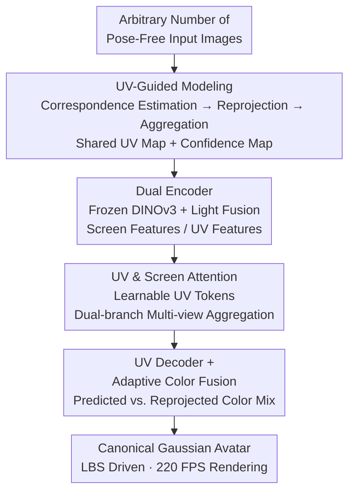

# UIKA: Fast Universal Head Avatar from Pose-Free Images

**Conference**: CVPR 2026  
**arXiv**: [2601.07603](https://arxiv.org/abs/2601.07603)  
**Code**: https://zijian-wu.github.io/uika-page/ (Project Page)  
**Area**: 3D Vision  
**Keywords**: 3D Gaussian Splatting, Head Avatar, Feed-forward Reconstruction, Pose-free, UV Attention, Drivable Avatar

## TL;DR
UIKA proposes a feed-forward drivable 3D Gaussian head avatar model. It projects an arbitrary number of "pose-free" input images (single image, multi-view, or mobile video) into a shared UV space via per-pixel face UV correspondence. A UV attention branch aggregates multi-view information to decode canonical space Gaussians, enabling reconstruction in a single forward pass and real-time driving at 220 FPS. It outperforms existing SOTA in both monocular and multi-view settings.

## Background & Motivation
**Background**: Mainstream 3D head avatar reconstruction follows two paths. Traditional optimization-based methods (NeRF / 3D Gaussian Splatting) require studio-level multi-view capture systems and lengthy per-person optimization, alongside precise camera calibration and expression capture. Recent feed-forward methods infer avatars directly from single or sparse images using large reconstruction models, eliminating test-time optimization.

**Limitations of Prior Work**: Existing feed-forward methods have stiff constraints. LAM and GAGAvatar reconstruct from single images but are typically trained on monocular videos, leading to poor generalization for novel view synthesis under large camera poses. Avat3r requires exactly four calibrated images, limiting practicality and restricting training to multi-view datasets with limited identity diversity. While GPAvatar and PF-LHM support an arbitrary number of inputs, they **lack explicit cross-frame correspondence**, leading to unreliable aggregation of multi-view information.

**Key Challenge**: Simultaneously satisfying "flexible capture (arbitrary count, no camera/expression labels) + feed-forward speed + high fidelity with 3D consistency" is extremely difficult. The root cause is the lack of explicit geometric alignment between pose-free input images. Models are forced to perform implicit matching using Transformers in screen space, which is neither structured nor robust to extreme views. Conversely, explicit alignment traditionally depends on camera calibration and expression capture.

**Goal**: Reconstruct photo-realistic, real-time drivable avatars from an arbitrary number of pose-free images, completely removing dependencies on camera parameters and expression estimation.

**Key Insight**: Faces naturally possess a UV parameterization independent of camera pose and expression. By estimating per-pixel UV coordinates for every valid facial pixel, colors from different frames can be reprojected onto a single shared UV map. This transforms the difficult problem of "cross-view alignment" into an information aggregation problem in a canonical UV space.

**Core Idea**: Align multiple pose-free images into a unified canonical space using "per-pixel face UV correspondence + UV-space attention + per-Gaussian adaptive color fusion," decoding feed-forward canonical Gaussians drivable via Linear Blend Skinning (LBS).

## Method

### Overall Architecture
The input to UIKA is an arbitrary number $N$ of pose-free face images $\{\mathrm{I}_s^i\}_{i=1}^N$ (no camera or expression labels), and the output is a set of canonical space 3D Gaussians $\mathcal{G}=\{c_k,o_k,\mu_k,s_k,r_k\}$, which can be driven by FLAME-based LBS and rendered in real-time. The pipeline consists of four serial steps: first, a face correspondence estimator predicts per-pixel UV coordinates for each image to reproject and aggregate colors into a shared UV observation map and a confidence map; second, screen images and reprojected UV maps are passed through a frozen DINOv3 encoder + lightweight fusion to obtain screen and UV features; third, learnable UV tokens consume both screen and UV attention to inject multi-view information; finally, a UV decoder combined with the aggregated map decodes tokens into canonical Gaussian attributes and performs adaptive fusion between predicted and reprojected colors.

### Key Designs

**1. UV-Guided Modeling: Aligning Pose-Free Images in Shared UV Space**

This step addresses the root cause of the lack of explicit alignment. Inspired by Pixel3DMM, the authors design a face correspondence estimator $\mathcal{U}(\cdot)$. Input images pass through a frozen pretrained encoder, and a trainable DPT head decodes dense per-pixel UV coordinate maps $\mathrm{U}^i=\mathcal{U}(\mathrm{I}_s^i),\ \mathrm{U}=(u,v)\in[0,1]^2$. With UV coordinates, each screen-space image can be reprojected into the shared UV space $\mathrm{I}_{uv}^i=\mathrm{Reproj}(\mathrm{I}_s^i,\mathrm{U}^i)$. Crucially, **UV coordinates are independent of camera pose and expression**, so colors from different frames, views, and expressions are naturally pixel-aligned once mapped to UV space. $N$ reprojected images are then pixel-averaged to form an aggregated observation $\mathrm{I}_{aggr}$. A confidence map $\gamma_{aggr} \coloneqq \mathrm{Norm}(\log(1+n_{hit}))$ is defined based on the hit count $n_{hit}$ per UV pixel. Regions with higher hits are more reliable, guiding the subsequent fusion.

**2. UV Attention Branch: Aggregating Local Details and Global Context**

Previous works (e.g., LAM, PF-LHM) only use Transformers in screen space to relate tokens with image features, **lacking structured correspondence**, which makes multi-view aggregation unstable. UIKA introduces an additional UV attention branch alongside standard screen attention. Screen images and reprojected UV maps pass through encoders $\mathcal{E}_j$ (frozen DINOv3 backbone + trainable lightweight CNN to fuse shallow and deep features), yielding screen features $\mathcal{F}_s$ and UV features $\mathcal{F}_{uv}$. Learnable UV tokens $\mathcal{Z}\in\mathbb{R}^{L_z\times D}$ perform attention in both spaces:

$$\Delta\mathcal{Z}_j,\Delta\mathcal{F}_j=\mathrm{Attn}_j(\mathcal{Z},\mathcal{F}_j),\quad \mathcal{Z}'=\mathcal{Z}+\mathrm{MLP}(\mathcal{Z}+\Delta\mathcal{Z}_s+\Delta\mathcal{Z}_{uv})$$

The increments $\Delta\mathcal{Z}_s$ (screen) and $\Delta\mathcal{Z}_{uv}$ (UV) are added and injected into the tokens. The screen branch provides local high-frequency details, while the UV branch provides global context across views due to its structured coordinate system. This prevents performance degradation when increasing input views, unlike GPAvatar/InvertAvatar.

**3. Adaptive Color Fusion: Per-Gaussian Balancing of Predictions and Observations**

The UV decoder transforms multi-depth tokens and aggregated maps $\{\mathrm{I}_{aggr},\gamma_{aggr}\}$ into canonical Gaussian attributes, including predicted color $\hat{c}_k$, fusion weight $w_k$, opacity, position offset $\Delta\mu_k$, scale, and rotation. While network-predicted appearances are globally coherent, they often lack realistic details; conversely, colors reprojected from inputs $c_k^{aggr}$ are accurate but may be incomplete due to occlusion. The authors learn a weight $w_k$ per Gaussian to dynamically mix the two:

$$c_k = w_k\hat{c}_k + (1-w_k)c_k^{aggr}$$

This weights "accurate but potentially partial local observations" against "globally coherent but sometimes inaccurate predictions." Regions with sufficient observations rely more on reprojected colors. Gaussians are initialized on the FLAME template mesh surface $\mu_k^m$, with final positions being $\mu_k^m+\Delta\mu_k$. During driving, Gaussians inherit LBS weights/posedirs/shapedirs from the template (obtained via FLAME UV rasterization and barycentric interpolation) to deform from canonical space to target poses for differentiable rendering. No extra neural renderer is needed, enabling 220 FPS.

**4. Synthetic Multi-view Head Dataset: Filling the Data Gap**

Existing datasets are either monocular (limited views/expressions) or multi-view but with few identities and studio lighting that fails to generalize. The authors built a scalable generation pipeline: using SphereHead (a 3D head generator trained on in-the-wild images) to sample 9 fixed views for each identity, and LivePortrait (an efficient 2D driver) to animate each view with a synchronized motion library. This curated dataset contains 7500+ identities, each with 9 views and 13000+ frames covering exaggerated expressions, improving robustness while avoiding expensive studio capture.

### Loss & Training
During training, 1 to $N_{ref}$ frames are randomly sampled from a video as source inputs, and $N_d$ frames are sampled for reenactment supervision. Supervision uses a combination of L1 + SSIM + LPIPS (VGG) photometric losses, plus a geometric regularization $\mathcal{L}_{reg}=\|\max(\Delta\mu, \epsilon)\|_2$ to prevent Gaussians from drifting too far ($\epsilon \approx 0$). Total loss is a weighted sum with $\lambda_{l1}=\lambda_{lpips}=1.0$ and $\lambda_{ssim}=\lambda_{reg}=0.1$. The Transformer uses $L=12$ MM-Transformer blocks with 1024 dimensions. UV tokens of size $L_z=9216$ are reshaped to $96\times96$ to decode $384\times384\times256$ feature maps. After rasterizing the FLAME UV mask, approximately 130K feature points are sampled to decode attributes. Training used $N_{ref}=16, N_d=8$, with Adam and cosine warm-up for 150K steps on 32 H20 GPUs over 2 weeks.

## Key Experimental Results

### Main Results
Evaluated on VFHQ + NeRSemble-v2 for both monocular and multi-view inputs across self-reenactment and cross-reenactment. Metrics: PSNR/SSIM/LPIPS for quality, CSIM (ArcFace cosine similarity) for identity, AED/APD (3DMM regression) for expression/pose, and AKD for keypoint consistency.

**Monocular Setting (Table 2, self reenactment)**:

| Method | PSNR↑ | SSIM↑ | LPIPS↓ | CSIM↑ | AED↓ | AKD↓ |
|------|-------|-------|--------|-------|------|------|
| Portrait4D-v2 | 21.03 | 0.859 | 0.134 | 0.688 | 0.094 | 3.718 |
| GAGAvatar | 20.34 | 0.850 | 0.160 | 0.693 | 0.071 | 4.372 |
| LAM | 18.29 | 0.810 | 0.206 | 0.602 | 0.104 | 4.631 |
| **Ours (UIKA)** | **21.69** | **0.867** | **0.105** | **0.738** | **0.055** | **3.066** |

**Multi-view Setting (Table 3, self reenactment)**:

| Method | PSNR↑ | SSIM↑ | LPIPS↓ | CSIM↑ | AED↓ | AKD↓ |
|------|-------|-------|--------|-------|------|------|
| DiffusionRig | 16.97 | 0.768 | 0.395 | 0.598 | 0.209 | 9.585 |
| GPAvatar | 17.11 | 0.783 | 0.313 | 0.553 | 0.129 | 6.423 |
| InvertAvatar | 16.35 | 0.776 | 0.394 | 0.449 | 0.084 | 7.402 |
| **Ours (UIKA)** | **22.50** | **0.855** | **0.120** | **0.740** | **0.064** | **3.437** |

The advantage in the multi-view setting is substantial: PSNR is 5+ dB higher than the runner-up GPAvatar, and LPIPS drops from 0.31 to 0.12. UIKA demonstrates that while other models may degrade with more views due to alignment issues, UIKA improves thanks to UV correspondence.

### Ablation Study
On monocular NeRSemble-v2, self reenactment (Table 4):

| Config | PSNR↑ | LPIPS↓ | AED↓ | AKD↓ | Description |
|------|-------|--------|------|------|------|
| **Full** | 22.61 | 0.082 | 0.055 | 3.037 | Full Model |
| w/o synth | 21.86 | 0.093 | 0.060 | 3.078 | Remove synth dataset, PSNR drops 0.75 |
| w/o uv_attn | 22.21 | 0.091 | 0.056 | 3.086 | Remove UV attention, loss of detail |
| w/o aggr | 22.39 | 0.088 | 0.059 | 3.120 | Remove aggregated UV injection, incoherent details |

### Key Findings
- **Synthetic Dataset is Crucial**: Removing it caused the largest drop in PSNR (0.75) and LPIPS, proving that the identity/view/expression gap in real data is a major bottleneck. Synthetic multi-view data provides better consistency and high-frequency details.
- **UV Attention Branch Controls Details**: Without it, tokens lack structured context, leading to significant qualitative loss in facial details.
- **Adaptive Fusion Ensures Coherence**: Injecting aggregated UV maps into the decoding stage is vital for producing correct and consistent details.
- **Scalability with Views**: UIKA effectively utilizes additional views to resolve occlusions and improve 3D consistency, generalizing well to out-of-domain data like Ava-256.

## Highlights & Insights
- **Transforming "Cross-View Alignment" to "UV-Space Aggregation"**: The core insight is that UV parameterization is independent of pose and expression. Reprojecting pose-free images into UV space naturally aligns pixels, reducing a complex geometric calibration problem into a canonical space feature aggregation task.
- **Per-Gaussian Adaptive Color Fusion**: Using a learned scalar to interpolate between "network prediction (global coherence)" and "reprojected observation (local accuracy)" allows each point to decide its own reliability. This concept is transferable to any reconstruction task involving a Generator vs. Observation trade-off.
- **Removing Inference Neural Renderers for 220 FPS**: Directly outputting LBS-drivable canonical Gaussians provides real-time performance by design, avoiding the overhead of secondary neural rendering stages used by GPAvatar.
- **Synthetic Data Generation via Foundation Models**: Combining SphereHead (3D multi-view) and LivePortrait (2D driving) creates diverse identities with extreme expressions without studio capture—a practical paradigm for filling data gaps.

## Limitations & Future Work
- **Dependency on UV Estimator Accuracy**: Alignment quality relies on per-pixel UV prediction. Accuracy may degrade under extreme occlusions, large accessories, or profile views.
- **FLAME Topology Ceiling**: Initializing on a FLAME mesh means hair, glasses, and the inner mouth may be limited by the template's topology.
- **Synthetic Data Distribution Bias**: Heavy reliance on synthetic data may introduce biases from the generators (artifacts, expression library limits).
- **High Training Cost**: Requiring 32 H20 GPUs for two weeks poses a significant barrier to reproduction.

## Related Work & Insights
- **vs. LAM / GAGAvatar**: These use canonical Gaussians but train on monocular data, leading to poor extrapolation. UIKA supports arbitrary views and explicit aggregation, leading even in monocular settings (PSNR 21.69 vs. 20.34/18.29).
- **vs. Avat3r**: Avat3r requires fixed calibrated views. UIKA accepts any number of images without camera/expression labels.
- **vs. GPAvatar / InvertAvatar**: These lack explicit cross-frame correspondence; UIKA utilizes the UV attention branch for structured correspondence, ensuring performance scales with view count.
- **vs. Diffusion / Optimization Methods**: These require per-identity fine-tuning or iterative denoising. UIKA is a single forward pass with 220 FPS driving.

## Rating
- Novelty: ⭐⭐⭐⭐ The combination of UV-guided alignment, dual-branch attention, and adaptive fusion is surgical and effective.
- Experimental Thoroughness: ⭐⭐⭐⭐ Comprehensive evaluation across mono/multi-view settings, though failure case analysis could be more in-depth.
- Writing Quality: ⭐⭐⭐⭐ Clear motivation, well-described pipeline, and complete formulation.
- Value: ⭐⭐⭐⭐ High practical value for production-grade avatar systems by balancing capture flexibility, speed, and real-time driving.

<!-- RELATED:START -->

## Related Papers

- [\[CVPR 2026\] GeoDiff4D: Geometry-Aware Diffusion for 4D Head Avatar Reconstruction](geodiff4d_geometry-aware_diffusion_for_4d_head_avatar_reconstruction.md)
- [\[CVPR 2026\] Feed-forward Gaussian Registration for Head Avatar Creation and Editing](feed-forward_gaussian_registration_for_head_avatar_creation_and_editing.md)
- [\[CVPR 2026\] Fresco: Frequency-Spatial Consistent Optimization for Fine-Grained Head Avatar Modeling](fresco_frequency-spatial_consistent_optimization_for_fine-grained_head_avatar_mo.md)
- [\[CVPR 2026\] HumanNOVA: Photorealistic, Universal and Rapid 3D Human Avatar Modeling from a Single Image](humannova_photorealistic_universal_and_rapid_3d_human_avatar_modeling_from_a_sin.md)
- [\[CVPR 2026\] Learning Scene Coordinate Reconstruction from Unposed Images via Pose Graph Optimization](learning_scene_coordinate_reconstruction_from_unposed_images_via_pose_graph_opti.md)

<!-- RELATED:END -->
