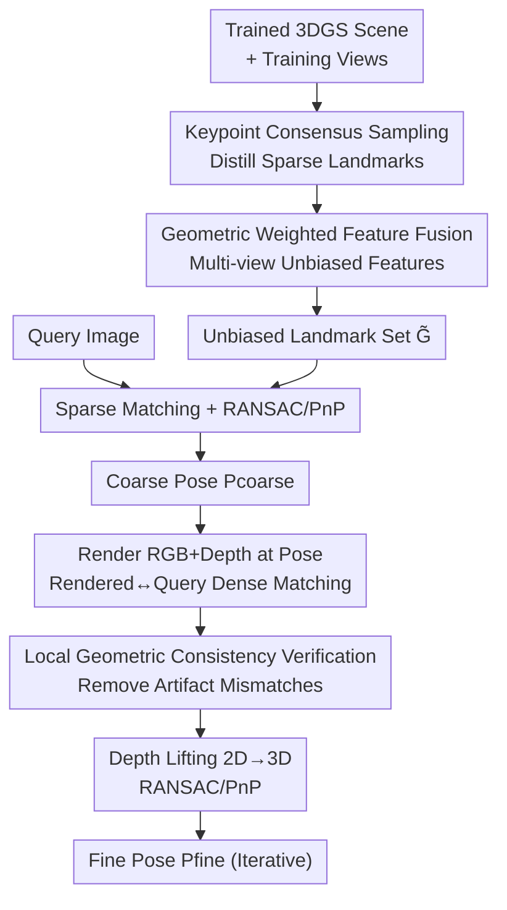

# ULF-Loc: Unbiased Landmark Feature for Robust Visual Localization with 3D Gaussian Splatting

**Conference**: CVPR 2026  
**Paper**: [CVF Open Access](https://openaccess.thecvf.com/content/CVPR2026/html/Gu_ULF-Loc_Unbiased_Landmark_Feature_for_Robust_Visual_Localization_with_3D_CVPR_2026_paper.html)  
**Code**: Available (Open sourced per paper, link on CVF page)  
**Area**: 3D Vision  
**Keywords**: Visual Localization, 3D Gaussian Splatting, Feature Bias, Geometric Weighted Fusion, Pose Estimation

## TL;DR
This paper theoretically proves that optimizing 3DGS feature fields via $\alpha$-blending introduces inherent bias to 3D point features. It proposes ULF-Loc, which replaces biased feature optimization with "Geometric Weighted Multi-view Feature Fusion," selects reliable landmarks through "Keypoint Consensus Sampling," and eliminates mismatches caused by rendering artifacts using "Local Geometric Consistency Verification." On Cambridge Landmarks, it reduces the average median translation error by 17% compared to SOTA, while requiring only 1/10 of the training time and 1/6 of the VRAM of STDLoc.

## Background & Motivation

**Background**: The mainstream of visual localization (estimating 6-DoF camera pose from a single image) includes structure-based methods (SfM + feature matching + RANSAC/PnP) and regression-based methods (APR / SCR). Recently, a direction combining the efficient rendering of 3D Gaussian Splatting (3DGS) with feature matching has emerged: attaching high-dimensional feature vectors to each Gaussian primitive, rendering dense 2D feature maps via $\alpha$-blending, and optimizing the 3D feature field using consistency losses between "rendered features $\leftrightarrow$ pre-trained features" (e.g., GSplatLoc, STDLoc). In localization, the 2D query features are matched directly with the 3D Gaussian feature field.

**Limitations of Prior Work**: These methods assume that "optimized 3D Gaussian features are reliable" for precise 2D-3D matching. However, the authors find this assumption incorrect—3D point features optimized via $\alpha$-blending carry systematic bias, leading to frequent matching errors and degraded pose accuracy. Furthermore, learning high-dimensional descriptors for every Gaussian significantly increases training time and VRAM; the "rendered $\leftrightarrow$ query" matching pipeline is also contaminated by blurriness and artifacts in Gaussian rendering.

**Key Challenge**: The root of the bias lies in the coupled nature of $\alpha$-blending. When rendering a pixel feature, the target Gaussian's feature is forced to "compensate" for the collective contribution of neighboring Gaussians, causing the optimized feature to deviate from the ground truth it is supposed to represent. As long as occlusion or viewpoint changes exist (where the target Gaussian cannot exclusively dominate the pixel's contribution), bias is inevitable. This is a flaw at the representation mechanism level, not a parameter-tuning issue.

**Goal**: ① Theoretically characterize this bias (origin and zero-conditions); ② Design a feature construction pipeline independent of $\alpha$-blending optimization to ensure unbiased and viewpoint-invariant 3D landmark features; ③ Build a coarse-to-fine localization framework that handles mismatches from rendering artifacts.

**Key Insight**: Since "optimizing the feature field" is the source of bias, it is better to avoid optimization entirely. The authors instead perform weighted average fusion of 2D features observed from multiple views on a sparse set of reliable 3D landmarks—linear fusion naturally satisfies unbiased estimation, mathematically bypassing the coupling of $\alpha$-blending.

**Core Idea**: Replace "$\alpha$-blending feature optimization" with "Geometric Weighted Multi-view Feature Fusion" on a small set of high-quality landmarks, achieving unbiased features, robust matching, and extremely low training/VRAM overhead simultaneously.

## Method

### Overall Architecture

ULF-Loc addresses the fundamental problem of biased 3D features in 3DGS-based localization. The pipeline consists of two steps: **Offline construction of unbiased landmarks** and **Online coarse-to-fine pose estimation**.

Construction Phase: On a trained 3DGS scene, **Keypoint Consensus Sampling (K.C. Sampling)** is used to distill a small set of geometrically stable and uniformly distributed landmarks $\tilde{\mathcal{G}}$ from dense, redundant Gaussians. Then, **Geometric Weighted Feature Fusion (GWFF)** aggregates multi-view 2D features for each landmark without $\alpha$-blending optimization, ensuring unbiased and viewpoint-invariant 3D features.

Localization Phase: For a query image, 2D keypoints and descriptors are extracted and matched with landmark features via cosine similarity to obtain sparse correspondences $\mathcal{M}_{coarse}$, from which a coarse pose $P_{coarse}$ is solved via RANSAC+PnP. RGB and depth maps are then rendered from this pose. Dense matching is performed between "rendered $\leftrightarrow$ query" images, utilizing **Local Geometric Consistency Verification (LGCV)** to prune mismatches from rendering artifacts. Finally, 2D matches are lifted to 3D using the depth map, and a refined pose $P_{fine}$ is obtained via RANSAC+PnP (iterative).

### Key Designs

**1. Theoretical Decomposition of $\alpha$-blending Feature Bias**

The authors isolate the contribution of a target Gaussian (at rank $t$) to a rendered pixel $F_s(u)=\sum_{i\in\mathcal{N}(u)} f_i\alpha_i T_i$. Defining the cumulative weight $w_k=\alpha_t T_t$ and the normalized "background feature" $B_k=(\sum_{i\neq t} f_i\alpha_i T_i)/(1-w_k)$, the rendered feature is:

$$F_s(u_k) = w_k f_t + (1-w_k) B_k.$$

Assuming 2D features $f_k^{2D}$ are ground truth plus noise $\mu+\epsilon_k$, the expected bias of the optimized solution $f_t^*$ relative to $\mu$ is derived as:

$$\text{bias} = \mathbb{E}[f_t^*]-\mu = \mathbb{E}\!\left[\frac{1-w_k}{w_k}(\mu - B_k)\right].$$

Bias is zero only if (1) **Complete Contribution** ($w_k=1$), or (2) **Background Consistency** ($B_k=\mu$). In reality, $w_k<1$ is almost certain due to occlusion/viewpoint changes, and $B_k$ rarely equals $\mu$, proving that bias is an inherent property of Feature-3DGS.

**2. Keypoint Consensus Sampling (K.C. Sampling)**

Dense 3DGS is redundant for localization. Reliable matching candidates must have strong multi-view consistency. A consensus score $\mathcal{S}^i$ is calculated for each Gaussian $g_i$ by checking how many training views project its center near a detected 2D keypoint:

$$\mathcal{S}^i = \sum_{v\in\mathcal{V}} \mathbb{I}\!\left[\min_{k\in\mathcal{K}_v}\|\mathcal{P}^i_v - k\|\le \tau_D\right],$$

Gaussians with high scores are geometrically stable and discriminative. Randomized k-NN sampling guided by these scores yields a sparse set $\tilde{\mathcal{G}}$ (default 20,000), reducing computation and mismatches.

**3. Geometric Weighted Feature Fusion (GWFF)**

Following the theory, the authors use weighted multi-view 2D feature averaging: $f^{fus}=\sum_{k=1}^K w_k f_k^{2D}$, where $\sum_k w_k=1$. To handle non-Lambertian surfaces where appearance varies with viewpoint, GWFF assigns weights based on geometry: $w_{i,k}=\bm{n}_i\cdot\bm{d}_{i,k}$, where $\bm{n}_i$ is the surface normal of landmark $\tilde{g}_i$ and $\bm{d}_{i,k}$ is the viewing direction. Observations closer to the surface normal (frontal views) receive higher weights.

**4. Local Geometric Consistency Verification (LGCV)**

For dense matching during refinement, Gaussian rendering artifacts can introduce many false positives. LGCV filters candidates $(x_i,y_i)$ by constructing triangle pairs $\mathcal{T}_i$ within the K-nearest neighbors and enforcing two topological constraints: **Angular Consistency** $|\cos\theta_x-\cos\theta_y|<1-\tau_a$ and **Scale Consistency** $\max(|s_a-s_b|,|s_a-s_c|,|s_b-s_c|)<\tau_s$. Matches with insufficient "consensus" from their local neighborhood are discarded.

### Loss & Training
ULF-Loc does not introduce new feature learning losses. 3DGS is trained traditionally (30,000 iterations per scene with photometric loss). Feature extraction uses SuperPoint, and pose solving uses RANSAC+PnP from Poselib. For sampling, $\tau_D=1$ px, landmarks = 20,000. In LGCV, $\tau_a=0.9659$ and $\tau_s=0.1$. Experiments were conducted on a single RTX 4090.

## Key Experimental Results

### Main Results
Evaluation on 7Scenes, 12Scenes, and Cambridge Landmarks using median translation/rotation error (cm/°).

| Dataset | Metric (Avg) | Ours | STDLoc (GS SOTA) | Best SCR | Gain |
|---------|---------------|------|-----------------|----------|------|
| 7Scenes | Med. Trans/Rot | **0.7 / 0.20** | 0.8 / 0.24 | ACE 1.10 / 0.34 | ~36% lower than ACE |
| 12Scenes| Med. Trans/Rot | **0.3 / 0.15** | 0.4 / 0.18 | ACE 0.7 / 0.26 | Best in all scenes |
| Cambridge| Med. Trans/Rot | **8.3 / 0.13** | 10.1 / 0.14 | NeuMap 12 / 0.29 | 17% lower than STDLoc|

Efficiency comparison (7Scenes Heads scene):

| Method | Training Time↓ | VRAM↓ |
|--------|----------------|-------|
| STDLoc | 50 min | 6566 MB |
| **ULF-Loc** | **5 min** | **1086 MB** |

Compared to STDLoc, ULF-Loc achieves 10× training speedup and 1/6 VRAM usage because it avoids learning high-dimensional descriptors for every Gaussian.

### Ablation Study
Ablation on Cambridge Landmarks (recall at [50cm/5° | 15cm/5°]):

| Config | Sampling | Feature | LGCV | Final [50/5] | Final [15/5] |
|--------|----------|---------|------|--------------|--------------|
| #1 | RS | Blending| No | 89.3 | 68.2 |
| #6 | RS+K.C. | GWFF | No | 91.7 | 70.9 |
| #8 | RS+K.C. | GWFF | Yes| **93.7** | **72.0** |

### Key Findings
- **GWFF vs. $\alpha$-blending**: Replacing blending with GWFF significantly improves initial matching quality, validating the theoretical prediction that unbiased features match better.
- **K.C. Sampling**: Consistently outperforms random or farthest point sampling by selecting multi-view consistent landmarks.
- **Efficiency**: Only ~20,000 landmarks are needed for saturation, much fewer than the total number of primitives.

## Highlights & Insights
- **"No-Optimization" is Better**: The paper identifies a widespread flawed paradigm ($\alpha$-blending for feature fields) and provides a simple, theoretically sound linear fusion alternative.
- **Interpretability**: The bias formula provides clear diagnostic boundaries for when $\alpha$-blending might fail.
- **Geometric Weights**: Using $\bm{n}_i\cdot\bm{d}_{i,k}$ is an elegant way to incorporate the intuition that frontal views are more reliable into a single weight.

## Limitations & Future Work
- **Dependency on 3DGS Quality**: Landmark sampling and fusion depend on the coverage of training views and reconstruction quality.
- **Component Specificity**: The study used SuperPoint + Poselib; the sensitivity to different matchers/solvers remains to be explored.
- **Rigidity Assumption**: LGCV assumes local rigidity, which might be violated by significant perspective distortion or dynamic objects.
- **Normal Estimation**: Defaults to the minimum scale direction, which might not always correspond to the true surface normal.

## Related Work & Insights
- **vs. STDLoc / GSplatLoc**: ULF-Loc proves the inherent bias in their optimization route; by using sparse landmarks + multi-view fusion, ULF-Loc is faster, more memory-efficient, and more accurate.
- **vs. SCR Methods**: Unlike SCR, which requires dense 3D supervision and is hard to scale, ULF-Loc performs better in large-scale outdoor environments like Cambridge.
- **vs. Inverse-rendering**: ULF-Loc is more robust to initial pose estimates by using explicit coarse-to-fine matching and LGCV to handle rendering artifacts.

## Rating
- Novelty: ⭐⭐⭐⭐⭐ Disproving a standard paradigm and providing a closed-form bias solution is high-level innovation.
- Experimental Thoroughness: ⭐⭐⭐⭐ Extensive benchmarks and ablations, though sensitivity to different matchers could be deeper.
- Writing Quality: ⭐⭐⭐⭐⭐ Clear theoretical derivation and logical flow.
- Value: ⭐⭐⭐⭐⭐ Drastically reduces training/VRAM costs while hitting SOTA, making it highly attractive for real-world deployment.

<!-- RELATED:START -->

## Related Papers

- [\[CVPR 2026\] AsymLoc: Towards Asymmetric Feature Matching for Efficient Visual Localization](asymloc_towards_asymmetric_feature_matching_for_efficient_visual_localization.md)
- [\[CVPR 2025\] Gaussian Splatting Feature Fields for Privacy-Preserving Visual Localization](../../CVPR2025/3d_vision/gaussian_splatting_feature_fields_for_privacy-preserving_visual_localization.md)
- [\[CVPR 2026\] Towards Visual Query Localization in the 3D World](towards_visual_query_localization_in_the_3d_world.md)
- [\[CVPR 2026\] Robust3DGSW: Toward Robust Watermarking for Quantization-Aware 3D Gaussian Splatting](robust3dgsw_toward_robust_watermarking_for_quantization-aware_3d_gaussian_splatt.md)
- [\[CVPR 2026\] Hierarchical Visual Relocalization with Nearest View Synthesis from Feature Gaussian Splatting](hierarchical_visual_relocalization_with_nearest_view_synthesis_from_feature_gaus.md)

<!-- RELATED:END -->
