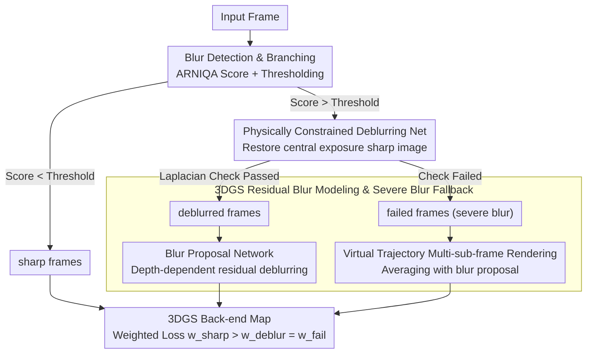

# Unblur-SLAM: Dense Neural SLAM for Blurry Inputs

**Conference**: CVPR 2026  
**arXiv**: [2603.26810](https://arxiv.org/abs/2603.26810)  
**Code**: [https://github.com/SlamMate/Unblur-SLAM.git](https://github.com/SlamMate/Unblur-SLAM.git)  
**Area**: 3D Vision / Neural SLAM  
**Keywords**: Blur-robust SLAM, 3DGS, Single-frame deblurring, Sub-frame modeling, Hybrid bundle adjustment

## TL;DR

Unblur-SLAM does not simply integrate a deblurring network into the SLAM front-end. Instead, it revolves around the critical decision of "which blurry frames can be deblurred before tracking and which must be modeled directly in 3D space." It designs a complete pipeline including blur detection, physically constrained deblurring, 3D Gaussian blur refinement, and a fallback mechanism for severe blur, effectively handling both motion and defocus blur while significantly improving tracking and reconstruction quality.

## Background & Motivation

Most SLAM systems assume that input frames are sufficiently sharp. Both traditional feature-based methods and modern dense/neural SLAM essentially require establishing reliable correspondences between adjacent views. Once images are affected by motion or defocus blur, front-end tracking weakens, and back-end reconstruction suffers.

Existing blur-aware SLAM works face two main issues. First, many assume blur originates solely from camera motion, focusing on motion blur while ignoring defocus blur. However, real-world data from smartphones, handheld cameras, or low-light indoor environments often involve both. Second, many methods treat all frames as blurry, which significantly increases computational costs and contradicts the fact that blurry frames only constitute a portion of real data.

The authors propose a more refined problem setting:

- Not all frames require expensive blur optimization.
- Not all blurry frames can be fixed by a single-frame deblurring network.
- If single-frame deblurring fails, the system should not crash but switch to a more robust 3D modeling approach.

In other words, SLAM needs a system that can triage different blur levels and types rather than a "universal deblurrer." Unblur-SLAM is designed under this premise.

## Method

### Overall Architecture

The system first evaluates the blur level of input frames and classifies them into three categories:

- **sharp frames**: Processed directly by the Droid-SLAM front-end and 3DGS back-end without expensive overhead.
- **successfully deblurred blurry frames**: Frames that can be restored by the single-frame network are deblurred before tracking and mapping, with residual blur further refined in the back-end.
- **failed blurry frames**: Frames with excessive blur or complex types where single-frame deblurring fails. These are not forced into the tracker but modeled via multi-sub-frame rendering and a blur network to explain the imaging process within the 3DGS space.

This tri-path branching is the core of the paper, avoiding the extremes of either assuming heavy optimization for all frames or discarding information when deblurring fails.

### Key Designs

**1. Blur Detection and Branching: Quantifying blur before deciding on heavy optimization**

The entry point is a branching decision rather than deblurring itself. The authors note that blurry frames only represent a portion of real sequences. To identify blur levels, a benchmark was constructed comparing 39 quality/blur metrics, selecting ARNIQA as the default detector. The logic involves two stages: if the blur score is low, it passes as a sharp frame; if high, it enters the deblurring branch, followed by a post-check (e.g., Laplacian ratio) to determine if restoration succeeded. This "quantify then branch" design concentrates the computational budget on frames that truly need it.

**2. Physically Constrained Single-frame Deblurring Network: Restoring the mid-exposure ground truth rather than simple sharpening**

For "repairable" frames, a two-stage trained network provides sharp images near the mid-exposure time for tracking and depth estimation. It is trained on semi-synthetic motion blur data (RED, GoPro) and fine-tuned on defocus data (DPDD). The key is the training constraint: using mid-frame constraints based on imaging physics to ensure alignment with real mid-exposure imaging rather than pursuing visual "sharpness." This avoids the generation of clear but geometrically inconsistent pseudo-textures that could harm multi-view matching.

**3. 3DGS Residual Blur Modeling and Severe Blur Fallback: Repairing light blur for tracking, modeling heavy blur in 3D**

The map uses 3D Gaussian Splatting (as in Splat-SLAM). For successful but imperfectly deblurred frames, a Blur Proposal Network estimates pixel-wise kernels and masks to apply depth-dependent residual deblurring in the back-end. For failed frames, the system synthesizes an observation by rendering multiple sub-frames along a virtual camera trajectory and averaging them with blur proposals. This follows the insight that light blur is best "fixed before tracking," while heavy blur is better "explained in 3D space" by modeling why it became blurry.

### Loss & Training

Back-end optimization involves three types of losses:

- **Sharp frame loss**: High weight assigned to sharp frames as strong geometric and appearance anchors.
- **Deblur frame loss**: Multi-scale RGB and depth consistency optimization for successfully deblurred frames, with sparse mask regularization.
- **Fail frame loss**: Optimization using RGB/Depth error after multi-sub-frame synthesis for failed frames.

The total loss is a weighted sum where $w_{sharp} > w_{deblur} = w_{fail}$. The system maintains sliding-window BA, loop closure, and global BA, using regularization on Gaussian scales to prevent over-stretching.

## Key Experimental Results

### Main Results

Tests were conducted on synthetic extreme blur scenes, offline deblurring benchmarks, and real SLAM datasets, measuring Tracking ATE and reconstruction PSNR/SSIM/LPIPS.

| Dataset / Method | Key Metric 1 | Key Metric 2 | Result |
|---|---|---|---|
| ArchViz-1 MBA-SLAM | ATE | PSNR | 0.0075 / 28.45 |
| ArchViz-1 Ours | ATE | PSNR | **0.0075 / 28.76** |
| ArchViz-2 MBA-SLAM | ATE | PSNR | 0.0036 / 30.16 |
| ArchViz-2 Ours | ATE | PSNR | **0.0027 / 32.71** |
| ArchViz-3 MBA-SLAM | ATE | PSNR | 0.0141 / 27.85 |
| ArchViz-3 Ours | ATE | PSNR | **0.0067 / 30.09** |
| Deblur-NeRF offline SOTA (CoMoGaussian) | PSNR / SSIM / LPIPS | - | 27.85 / 0.8431 / 0.0822 |
| **Ours** | PSNR / SSIM / LPIPS | - | **29.49 / 0.9213 / 0.0728** |

Unblur-SLAM is more robust than MBA-SLAM in extreme blur scenes (ArchViz), particularly in sequence 3. Notably, this online method outperforms several offline methods on the Deblur-NeRF benchmark, demonstrating the effectiveness of its 3D blur modeling.

### Key Findings

- **Blur branching is critical**: Treating all frames with heavy refinement is slow; ignoring blur leads to tracking failure. Branching balances stability and speed.
- **Physically constrained mid-frame training is necessary**: Standard single-frame deblurring without 3D consistency can harm SLAM.
- **Severe blur fallback is not a corner case**: During fast motion or significant defocus, this path prevents frame dropping or system collapse.
- While slower than pure Splat-SLAM, it is significantly faster than I2-SLAM (0.74 FPS vs 0.095 FPS), retaining online usability.

## Highlights & Insights

- The paper emphasizes a **systems approach**, designing different branches for different failure modes rather than just a better deblurring network.
- Single-frame deblurring is treated as a pre-processor rather than a silver bullet. The fallback to 3D space when it fails reflects mature engineering thinking.
- The fact that an online method surpasses offline SOTA on Deblur-NeRF proves that the 3DGS + blur network combination possesses intrinsic deblurring power beyond SLAM utility.

## Limitations & Future Work

- **Latency**: At 0.74 FPS, the system is not yet truly real-time, especially for mobile platforms.
- **Dynamic Scenes**: Blur and geometric changes become coupled in dynamic environments, which the current model may not handle stably.
- **Parameters**: The severe blur branch depends on virtual sub-frames and blur proposal networks, which are computationally heavy.
- **Thresholding**: The blur detector currently relies on fixed thresholds; generalization across different devices remains to be tested.

## Related Work & Insights

- **vs MBA-SLAM / Deblur-SLAM**: Those focus on motion blur and assume all frames are blurry; "Ours" covers both motion and defocus and explicitly handles three frame categories.
- **vs I2-SLAM**: While I2-SLAM models the imaging process, its use of single-frame consistency is less effective; "Ours" succeeds via physical constraints and 3DGS refinement.
- **Related Insight**: Pre-processing modules should not be designed in isolation. System performance often depends on "what happens when pre-processing fails." The branching concept is applicable to other challenging conditions like low light or rain.

## Rating

- **Novelty**: ⭐⭐⭐⭐ Simultaneously handles motion and defocus blur and systematizes a fallback for deblurring failure.
- **Experimental Thoroughness**: ⭐⭐⭐⭐ Evaluated on synthetic, real, and offline benchmarks, though dynamic scenes need further testing.
- **Writing Quality**: ⭐⭐⭐⭐ Clear organization of a complex pipeline.
- **Value**: ⭐⭐⭐⭐⭐ High relevance for real-world SLAM on handheld and mobile devices where blur is frequent.

<!-- RELATED:START -->

## Related Papers

- [\[CVPR 2026\] SGAD-SLAM: Splatting Gaussians at Adjusted Depth for Better Radiance Fields in RGBD SLAM](sgad-slam_splatting_gaussians_at_adjusted_depth_for_better_radiance_fields_in_rg.md)
- [\[CVPR 2026\] S2D: Sparse to Dense Lifting for 3D Reconstruction with Minimal Inputs](s2d_sparse_to_dense_lifting_for_3d_reconstruction_with_minimal_inputs.md)
- [\[CVPR 2026\] ODGS-SLAM: Omnidirectional Gaussian Splatting SLAM](odgs-slam_omnidirectional_gaussian_splatting_slam.md)
- [\[CVPR 2026\] Flow4DGS-SLAM: Optical Flow-Guided 4D Gaussian Splatting SLAM](flow4dgs-slam_optical_flow-guided_4d_gaussian_splatting_slam.md)
- [\[CVPR 2026\] SCE-SLAM: Scale-Consistent Monocular SLAM via Scene Coordinate Embeddings](sce-slam_scale-consistent_monocular_slam_via_scene_coordinate_embeddings.md)

<!-- RELATED:END -->
