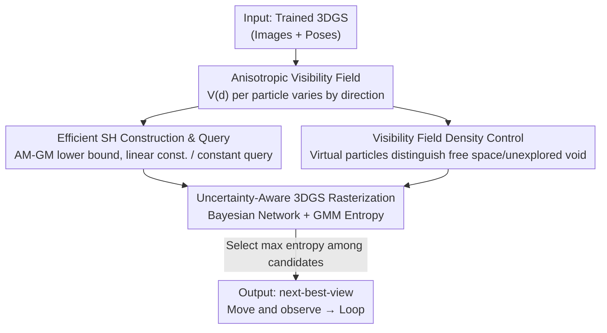

# Uncertainty-driven 3D Gaussian Splatting Active Mapping via Anisotropic Visibility Field

**Conference**: CVPR 2026  
**arXiv**: [2605.30342](https://arxiv.org/abs/2605.30342)  
**Code**: Project page available (see original paper for URL)  
**Area**: 3D Vision / 3DGS / Active Mapping  
**Keywords**: 3D Gaussian Splatting, Uncertainty Quantification, Anisotropic Visibility Field, Active Mapping, Spherical Harmonics

## TL;DR
GAVIS is proposed—a method modeling the "visibility" of each Gaussian particle relative to training viewpoints as a direction-dependent **anisotropic visibility field** in 3DGS. This field is analytically constructed and queried (training-free, within 1 second) using Spherical Harmonics (SH). Integration into Bayesian-style uncertainty-aware rasterization provides reliable, 200 FPS real-time uncertainty estimation for robotic active mapping, significantly outperforming FisherRF, VIMC, and NVF in both accuracy and efficiency.

## Background & Motivation
**Background**: Robots entering unknown environments perform "active mapping" (active mapping / next-best-view planning)—simultaneously reconstructing and choosing the most informative next viewpoint to minimize map uncertainty and achieve full coverage. Due to its high reconstruction quality and fast rendering, 3DGS is becoming an ideal representation for active mapping, provided it can **accurately quantify uncertainty**: the robot should explore areas where the reconstruction is unreliable.

**Limitations of Prior Work**: Quantifying uncertainty for 3DGS is challenging due to its massive parameter count. Existing methods directly adopt "epistemic uncertainty" tools from machine learning—FisherRF uses Laplace approximation to estimate the Hessian, while VIMC uses variational inference. The core issue is that active mapping specifically concerns "regions never seen from training viewpoints." Predictions in these regions are **inherently** unreliable and should be assigned high uncertainty. However, as approximation methods, these learning-based UQ approaches cannot guarantee this and often **underestimate** uncertainty in unseen, out-of-distribution (OOD) regions, leaving robots unmotivated to explore them.

**Key Challenge**: The requirement of a "hard guarantee" that "unseen equals high uncertainty" for active mapping conflicts with the "smooth, extrapolating" nature of learning-based approximate UQ. NVF (Neural Visibility Field on NeRF) captured the insight that "visibility is key to regional uncertainty," but it requires **training a neural network** for the visibility field (retrained at each planning step, taking minutes to hours) and models visibility only as a **function of position** (isotropic), ignoring that visibility is essentially "direction-dependent"—viewing one side of a wall provides zero information about the other.

**Goal**: ① Design a visibility field for 3DGS that reliably assigns high uncertainty to unobserved regions; ② Make it analytical, training-free, and real-time (construction < 1s, constant-time query); ③ Ensure it can be used independently or as a post-hoc module to enhance existing UQ frameworks.

**Key Insight**: Since 3DGS already uses SH to represent "direction-dependent color," the same SH mechanism can be used to analytically represent "direction-dependent visibility" without training a network.

**Core Idea**: Analytically store and query the **anisotropic visibility field** $V^{(i)}(\mathbf{d})$ for each Gaussian particle using SH coefficients, then inject it into uncertainty-aware 3DGS rasterization using entropy as the information gain objective for active mapping.

## Method

### Overall Architecture
The input to GAVIS is a trained 3DGS (from observed images and poses), and the output is the "next-best-view." The pipeline consists of three steps: ① **Visibility Field Construction (VF CONST)**—Analytically calculate the anisotropic visibility of each Gaussian particle relative to all training views and store them as SH coefficients $\{\gamma^{\mathcal{P}}_{\ell m}\}$; simultaneously insert "virtual particles" to distinguish between "true free space" and "unexplored voids." ② **Uncertainty-aware Rasterization**—For a set of candidate views sampled from a prior, a Bayesian-style 3DGS rasterizer queries the visibility field (VF QUERY) to model the color distribution of each ray as a Gaussian Mixture Model (GMM), utilizing the GMM's entropy as the uncertainty for that view. ③ **View Selection**—Select the candidate view with the maximum entropy (maximum information gain) as the next-best-view for the robot to observe, repeating the cycle.

The core improvements over NVF are: replacing the "neural-approximate, isotropic" field with an "SH-analytical, anisotropic" field; and using virtual particles to resolve "void ambiguity" caused by 3DGS density control.

### Key Designs

**1. Anisotropic Visibility Field: Modeling Directional Visibility to Resolve Self-occlusion**

NVF models visibility as a scalar position function $V(\mathbf{x})$, which is insufficient for 3DGS: a Gaussian particle exhibits **self-occlusion**—seeing it from one direction provides no information about its reverse side. Seeing one side of a wall does not mean knowing the other side; that side should retain high uncertainty. Thus, visibility is defined as a function $V^{(i)}(\mathbf{d})$ dependent on the rendering direction $\mathbf{d}$. The visibility of particle $i$ relative to a single training view $\mathbf{p}$ is the product of three terms:

$$V^{(i)}_{\mathbf{p}}(\mathbf{d}) = \underbrace{\Phi_{i,\mathbf{p}}}_{\text{FOV}} \cdot \underbrace{T_{\mathbf{p}}(t_i^{\mathbf{p}})}_{\text{Transmittance}} \cdot \underbrace{\nu(\mathbf{d};\mathbf{d}_{\mathbf{p}})}_{\text{Directional Visibility}}$$

Where $\Phi_{i,\mathbf{p}}\in\{0,1\}$ indicates if particle $i$ is in the FOV of camera $\mathbf{p}$; $T_{\mathbf{p}}(t_i^{\mathbf{p}})$ is the unoccluded transmittance from the camera to the particle along $\mathbf{d}_{\mathbf{p}}$ (obtained from the radiance field). These first two terms comprise the isotropic visibility of NVF. **The new third term**, the directional visibility function $\nu(\mathbf{d};\mathbf{d}_{\mathbf{p}}) = \zeta\exp(\kappa\,\mathbf{d}\cdot\mathbf{d}_{\mathbf{p}})$ (proportional to the von Mises–Fisher distribution on a sphere, where $\kappa$ controls concentration and $\zeta=\exp(-\kappa)$ ensures a value of 1 when $\mathbf{d}=\mathbf{d}_{\mathbf{p}}$), characterizes how visibility decreases (and uncertainty increases) as the rendering direction $\mathbf{d}$ deviates from the training direction $\mathbf{d}_{\mathbf{p}}$. Aggregation over the set of training views $\mathcal{P}$ uses the probability of being "seen by at least one view": $V^{(i)}(\mathbf{d}) = 1 - \prod_{\mathbf{p}\in\mathcal{P}}\big(1 - V^{(i)}_{\mathbf{p}}(\mathbf{d})\big)$. This ensures that if only the front of a wall is seen, the visibility from the rear direction remains low, driving the robot to investigate the back.

**2. Efficient SH Construction and Query: Reducing Complexity from Quadratic to Constant via AM-GM Lower Bound**

Directly calculating $V^{(i)}(\mathbf{d})$ is infeasible in real robotic scenarios: every query would require iterating over all historical training directions $\mathbf{d}_{\mathbf{p}}$, with runtime and memory scaling linearly with trajectory length. Borrowing from 3DGS color representation, visibility is projected onto SH orthogonal bases $Y^m_\ell(\mathbf{d})$. The challenge: while $\nu$ can be analytically expanded into SH (coefficients $a_{\ell m} = 4\pi\,i_\ell(\kappa)\,Y^{m*}_\ell(\mathbf{d}_{\mathbf{p}})$), the aggregation formula involves **product series**. SH multiplication is extremely expensive—directly calculating SH coefficients for $V^{(i)}(\mathbf{d})$ would require $O(|\mathcal{P}|^4 L^3)$ construction complexity and $O(|\mathcal{P}|^2 L^2)$ memory, with query time scaling **quadratically** with $|\mathcal{P}|$.

The key trick is using the Arithmetic-Geometric Mean (AM-GM) inequality to provide an **analytical lower bound that avoids SH multiplication**:

$$V^{(i)}(\mathbf{d}) \;\ge\; 1 - \Big(1 - \tfrac{\tilde{V}^{(i)}(\mathbf{d})}{|\mathcal{P}|}\Big)^{|\mathcal{P}|}, \qquad \tilde{V}^{(i)}(\mathbf{d}) := \sum_{\mathbf{p}} V^{(i)}_{\mathbf{p}}(\mathbf{d})$$

This transforms the "product" into a "sum" of single-view visibilities $\tilde{V}^{(i)}$. Summation in SH space is simply coefficient addition—thus, SH coefficients for the auxiliary function $\tilde{V}^{(i)}(\mathbf{d})$ can be written as $\gamma^{\mathcal{P}}_{\ell m} = 4\pi\zeta\,i_\ell(\kappa)\sum_{\mathbf{p}\in\mathcal{P}}\Phi_{i,\mathbf{p}}T_{\mathbf{p}}(t_i^{\mathbf{p}})Y^{m*}_\ell(\mathbf{d}_{\mathbf{p}})$, with **linear construction complexity** relative to $|\mathcal{P}|$. Each particle stores only $(L+1)^2$ coefficients (experimentally, $L=2$ is sufficient, matching the 3DGS color SH degree). At query time, $\tilde{V}^{(i)}(\mathbf{d})$ is computed from coefficients and substituted into the AM-GM bound (Alg. 1), yielding visibility in **constant time**, independent of trajectory length. Consequently, construction takes < 1s, approximately 500× faster than NVF.

**3. Visibility Field Density Control: Distinguishing "True Free Space" from "Unexplored Voids" via Virtual Particles**

Adaptive density control in 3DGS prunes particles in free space and densifies them in regions of interest. While beneficial, this creates a pitfall for UQ: unexplored regions receive no gradient and **are not densified**. Thus, "true free space" and "unexplored voids that need exploration" look identical in particle distribution. Particle-centric UQ would label both as low uncertainty, whereas active mapping must label unexplored voids as high uncertainty.

Ours fixes this by introducing **virtual particles**: given a trained 3DGS, zero-opacity virtual particles are uniformly distributed in the scene. Their visibility relative to training views is calculated as $1 - \prod_{\mathbf{p}\in\mathcal{P}}(1-\Phi_{i,\mathbf{p}}T_{\mathbf{p}}(t_i^{\mathbf{p}}))$. Particles with low visibility (located in unexplored areas) are retained and assigned $V^{(i)}(\mathbf{d})=0$ (maximum uncertainty); those with high visibility (in free space) are pruned. Retained virtual particles are appended to the original 3DGS for UQ. Only 5–10% of the total particle count is needed to distinguish these voids.

**4. Uncertainty-aware 3DGS Rasterization: GMM Entropy as Information Gain**

The visibility field is integrated into a Bayesian-style uncertainty-aware rasterizer. Along each ray, the probability density of observed pixel color is modeled as a GMM, explicitly injecting visibility corrections:

$$p(\mathbf{z}_0) = \sum_i w^*_i\, v_i\, \mathcal{N}(\boldsymbol{\mu}_{\mathbf{c}_i},\mathbf{Q}_{\mathbf{c}_i}) + \mathcal{N}(\boldsymbol{\mu}_0,\mathbf{Q}_0)\sum_i w^*_i(1-v_i)$$

Where $v_i = V(\mathbf{x}_i)$ is the visibility probability queried along direction $\mathbf{d}$, and $\mathcal{N}(\boldsymbol{\mu}_0,\mathbf{Q}_0)$ is a high-variance prior representing "invisible region color." Lower visibility shifts more mass to the high-variance prior, increasing entropy. Using GMM entropy as the uncertainty for synthesized views, active mapping selects the view with maximum entropy $\tau^* = \arg\max_\tau \mathcal{H}(\mathbf{Z}_\tau)$, serving as a practical approximation for "maximizing expected information gain from new observations." The UQ pipeline achieves 200 FPS real-time performance.

### Loss & Training
GAVIS **does not introduce training**: the visibility field is analytically constructed on top of a trained 3DGS (closed-form SH coefficient calculation, gradient-free). Hyperparameters include SH degree $L=2$, concentration $\kappa$, virtual particle ratio (~5–10%), and pruning threshold. Planning steps follow dataset defaults: 10 for NeRF-Synthetic, 40 for Gibson, 80 for HM3D.

## Key Experimental Results

### Main Results
Three scene categories / 4 datasets: NeRF-Synthetic, Space (HST + ISS), and indoor (HM3D x8 + Gibson x8). Comparison against 3DGS-based FisherRF and VIMC, and NeRF-based NVF, using identical active mapping pipelines and view samplers (A40 GPU).

| Dataset | Metric | GAVIS | Next Best | Description |
|--------|------|-------|------|------|
| NeRF-Synthetic | PSNR↑ | **24.26** | 23.14 (VIMC) | Best across all metrics |
| Space | PSNR↑ | **26.14** | 24.56 (VIMC) | SSIM 0.857, VIS 0.582 (Best) |
| Gibson | PSNR↑ | **24.42** | 23.29 (NVF) | FisherRF 18.11, VIMC 15.70 |
| HM3D | PSNR↑ | **23.97** | 22.69 (NVF) | Most significant indoor advantage |

Efficiency (Higher UQ FPS is better, lower $T_{\text{UP}}$ is better):

| Method | UQ FPS (Gibson) | $T_{\text{UP}}$ (HM3D) | Notes |
|------|-----------------|----------------------|------|
| GAVIS | **207.3** | **0.79 s** | ~500× faster constr., ~30× faster UQ than NVF |
| NVF | 4.2 | 285.26 s | Strongest baseline but requires retraining |
| FisherRF | 39.8 | 1.59 s | Requires gradients through rasterizer |
| VIMC | 50.1 | 14.51 s | Requires co-training + multi-sampling |

> $T_{\text{UP}}$ (Uncertainty Preparation Time) = Extra time after radiance field training, independent of candidate view count; UQ FPS = Rate of uncertainty quantification for each candidate view.

### Ablation Study
(Tab. 2, Average across all datasets)

| Configuration | PSNR↑ | CR↑ | VIS↑ | Description |
|------|-------|-----|------|------|
| GAVIS (Full) | **24.70** | **0.748** | **0.697** | Full Model |
| Isotropic | 23.97 | 0.741 | 0.671 | $\nu(\mathbf{d};\mathbf{d}_p)=1$, removing anisotropy |
| w/o DC | 24.18 | 0.712 | 0.668 | Removing virtual particles |
| Iso. w/o DC | 23.38 | 0.691 | 0.625 | Removing both (NVF-3DGS equivalent, worst) |

UQ Quality (Tab. 4): GAVIS scores **AUSE-D = 0.24, AUSE-V = 0.176**, significantly better than NVF (0.381 / 0.231), FisherRF (0.463 / 0.496), and VIMC (0.504 / 0.447). AUSE-V is a proposed visibility-based area-under-sparsity-error-curve variant, more suited for active mapping than depth-based AUSE-D.

### Key Findings
- **Anisotropy and Density Control are essential**: Removing either component drops all metrics; removing both degrades performance to the worst level. Anisotropy aids image metrics like PSNR, while its gain is smaller on isotropic metrics (VIS/Mesh) since a surface is "visible" if seen from any single direction.
- **Indoor scenes benefit most**: On Gibson/HM3D, GAVIS outperforms non-visibility models (FisherRF, VIMC) by 6–9 dB PSNR, confirming visibility is the dominant factor in active mapping.
- **Ours as post-hoc plug-and-play** (Tab. 3): Integrating GAVIS into FisherRF/VIMC boosted PSNR from 20.73→24.70 and 20.14→24.21 respectively. FisherRF+GAVIS performed similarly to GAVIS alone, implying visibility dictates performance; VIMC+GAVIS underperformed GAVIS due to sampling noise.

## Highlights & Insights
- **Leveraging 3DGS SH for visibility**: Since 3DGS already uses SH for direction-dependent color, it is elegant to use the same mechanism for visibility, bypassing NVF's neural training overhead. "Use SH for direction-dependent properties" is a transferable motif for 3DGS attributes.
- **AM-GM bound is a clever engineering feat**: Avoids the $O(|\mathcal{P}|^4 L^3)$ explosion of SH multiplication by replacing products with sums (coefficient addition). This "analytical lower bound" trick for cost reduction is widely applicable.
- **Virtual particles fix the hidden 3DGS-UQ pitfall**: The inability to distinguish free space from unexplored voids is a common blind spot in particle-centric UQ. Zero-opacity virtual particles with visibility thresholds provide a low-cost (~5-10% overhead) fix.
- **AUSE-V metric contribution**: The authors highlight the misalignment between standard AUSE-D and active mapping goals; the visibility-based AUSE-V better reflects exploration quality, reminding researchers to tailor metrics to tasks.

## Limitations & Future Work
- **Isotropic metrics underestimate benefits**: VIS and CR metrics don't capture the value of "multi-directional revisit," so some advantages aren't fully reflected in the numbers. There is a lack of metrics for directional coverage completeness.
- **High uncertainty ≠ Low GT visibility**: Large deviations between test and training directions may trigger high uncertainty even if the region is technically visible. The visibility-uncertainty correspondence is only a one-way guarantee (low GT visibility → high uncertainty).
- **Dependence on trained 3DGS and transmittance**: Construction requires a reasonably formed 3DGS. Reliability in extremely sparse initial stages is not fully explored.
- **Hyperparameter robustness**: Values for $\kappa$ and virtual particle ratios are given in narrow ranges; stability across diverse scales/topologies requires further validation.

## Related Work & Insights
- **vs NVF**: NVF introduced visibility for active mapping but used a neural, **isotropic** field requiring slow retraining. GAVIS uses **analytical anisotropic** SH, making it ~500× faster for construction and ~30× faster for UQ, with superior accuracy in self-occluded areas.
- **vs FisherRF**: FisherRF uses Laplace approximation with backpropagation, which is computationally heavy and **underestimates uncertainty in unseen zones**. GAVIS provides a hard guarantee for unobserved regions and dominates in indoor scenes.
- **vs VIMC**: VIMC's variational inference involves high runtime and sampling noise that can mask visibility gains; GAVIS is training-free, deterministic, and real-time.
- **Insights**: Treating visibility as a direction-dependent property and resolving it via SH is a strategy useful beyond active mapping, including inpainting, occlusion-aware synthesis, and relighting.

## Rating
- Novelty: ⭐⭐⭐⭐⭐ Excellent realization of anisotropic visibility through SH with AM-GM lower bound.
- Experimental Thoroughness: ⭐⭐⭐⭐ Extensive datasets and space scenarios; included post-hoc and UQ quality. Lacks closed-loop robot testing and extreme-sparsity stability tests.
- Writing Quality: ⭐⭐⭐⭐⭐ Clear progression from motivation to formulas and complexity analysis.
- Value: ⭐⭐⭐⭐⭐ High real-time utility for 3DGS on robots; both a standalone SOTA and a post-hoc enhancer.

<!-- RELATED:START -->

## Related Papers

- [\[CVPR 2026\] Paparazzo: Active Mapping of Moving 3D Objects](paparazzo_active_mapping_of_moving_3d_objects.md)
- [\[CVPR 2026\] NVGS: Neural Visibility for Occlusion Culling in 3D Gaussian Splatting](nvgs_neural_visibility_for_occlusion_culling_in_3d_gaussian_splatting.md)
- [\[CVPR 2026\] MAGICIAN: Efficient Long-Term Planning with Imagined Gaussians for Active Mapping](magician_efficient_long-term_planning_with_imagined_gaussians_for_active_mapping.md)
- [\[CVPR 2026\] VAD-GS: Visibility-Aware Densification for 3D Gaussian Splatting in Dynamic Urban Scenes](vad-gs_visibility-aware_densification_for_3d_gaussian_splatting_in_dynamic_urban.md)
- [\[AAAI 2026\] Surface-Based Visibility-Guided Uncertainty for Continuous Active 3D Neural Reconstruction](../../AAAI2026/3d_vision/surface-based_visibility-guided_uncertainty_for_continuous_active_3d_neural_reco.md)

<!-- RELATED:END -->
