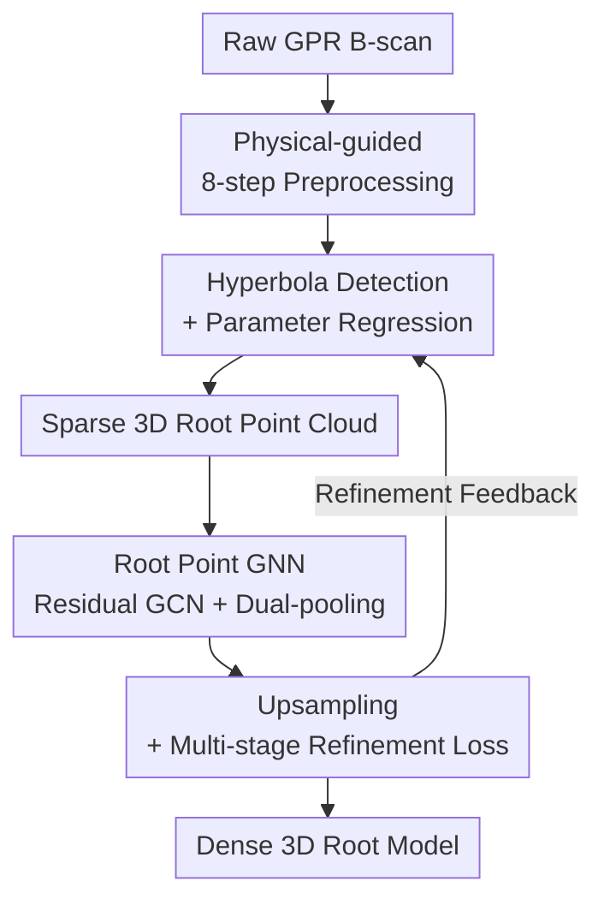

# Underground Plant Exploration: Non-Destructive 3D Root Assessment with GPR Based on Point Graph Neural Network

**Conference**: CVPR 2026  
**Paper**: [CVF Open Access](https://openaccess.thecvf.com/content/CVPR2026/html/Zhou_Underground_Plant_Exploration_Non-Destructive_3D_Root_Assessment_with_GPR_Based_CVPR_2026_paper.html)  
**Area**: 3D Vision / Underground Sensing / Point Cloud Reconstruction  
**Keywords**: Ground Penetrating Radar (GPR), 3D Root Reconstruction, Point Graph Neural Network, Hyperbola Detection, Point Cloud Upsampling  

## TL;DR
This paper reconstructs underground plant root systems as 3D point clouds non-destructively using Ground Penetrating Radar (GPR). The method first detects hyperbolas formed by root reflections on GPR B-scans and regresses their geometric parameters to obtain sparse 3D points. These points are then completed into a dense root system using a Point Graph Neural Network (Point GNN) featuring residual graph convolutions and dual-pooling attention, followed by an upsampling module. On simulated data, it achieves a detection AP of 0.857 and a reconstruction EMD of 5.03%, outperforming existing methods with the smallest parameter count of 20.98M.

## Background & Motivation

**Background**: Understanding root systems is critical for crop health, yield, and global food security. However, roots grow underground, and traditional observation methods are either destructive (excavation) or costly (rhizotrons). Ground Penetrating Radar (GPR) provides non-destructive detection by transmitting electromagnetic pulses and receiving reflections from subsurface material interfaces. It has been widely used for detecting "regular-shaped, high-reflectivity" buried objects like pipelines and cavities.

**Limitations of Prior Work**: Applying GPR to root systems faces two primary difficulties. First, roots are fine, irregular, branching structures that generate sparse and weak reflections, often buried under noise from stones, soil impurities, and system clutter. Traditional GPR interpretation relies heavily on manual expertise. Second, existing deep learning GPR methods are almost exclusively designed for "large object classification/detection" (e.g., pipes, roadbed defects), outputting only rectangular bounding boxes which fail to capture precise hyperbolic geometry or assemble sparse reflections into coherent 3D structures.

**Key Challenge**: There is a mismatch between the "sparse, weak, and branching" characteristics of root reflections and the "dense, strong, and regular" capabilities of existing methods. It is challenging to extract faint hyperbolic signals from noise while simultaneously recovering continuous branching topology from extremely sparse 3D points—tasks that neither general-purpose detectors nor standard point cloud completion networks handle well.

**Goal**: To construct an end-to-end framework that takes raw GPR signals as input and outputs non-destructively reconstructed 3D root structures. This is decomposed into two sub-problems: (a) accurately detecting root hyperbolas and regressing curve parameters on 2D B-scans; (b) completing sparse 3D points from multiple slices into a dense, topology-preserving root model.

**Key Insight**: The characteristic GPR signature of a root in a B-scan is a "hyperbola" (the vertex forms when the antenna is directly above the root). By leveraging this geometric prior, the authors directly regress hyperbola parameters (vertex, curvature, arc length) instead of predicting bounding boxes, transforming detection into geometric fitting. In the 3D stage, each point is treated as a graph node to propagate local geometry via GNNs to counter sparsity.

**Core Idea**: Non-destructive reconstruction achieved by "hyperbolic shape prior for detection + curve parameter regression" to obtain sparse 3D root points, followed by a "Residual Point GNN + upsampling" to complete the dense root system.

## Method

### Overall Architecture
The system is a two-stage sequential pipeline. **Stage 1 (Root Hyperbola Detection)**: Raw GPR B-scans undergo a physical-guided 8-step preprocessing pipeline for noise removal and energy focusing. These are then fed into a modified detection network based on SE-SSD (MobileNetV2 backbone + multi-task head), which outputs bounding boxes, classification confidence, and hyperbolic geometric parameters. By projecting the detected vertices onto 3D space along scanning trajectories, a **sparse 3D root point cloud** is generated. **Stage 2 (3D Root Reconstruction)**: Sparse points are enhanced via point feature attention before entering the core **Point GNN** (residual graph convolutions + dual-pooling attention) to learn geometric topology. Finally, an **upsampling module** interpolates dense points. The reconstruction uses hierarchical coarse (CD) and fine (EMD) losses with outlier suppression, and the refined results are **fed back** to the detection network to improve its accuracy.

### Key Designs

**1. Physical-guided 8-step GPR Preprocessing Pipeline: Extracting weak signals from subsurface noise**

Root reflections are sparse and weak relative to background clutter. The authors designed an 8-step pipeline based on GPR physics: ① Zero-time correction to align the ground surface; ② Dewow filtering to remove low-frequency DC bias; ③ Horizontal noise removal to suppress antenna ringing; ④ Mean profile subtraction to remove horizontal soil layers and antenna coupling (deemed "most critical" for weak root signals); ⑤ Band-pass FIR filtering tailored to root diameters; ⑥ SEC gain compensation using a combined model of geometric spreading and exponential absorption; ⑦ Soil dielectric correction to calibrate EM wave velocity (preventing >20-30% depth errors); ⑧ Kirchhoff/f-k migration to collapse hyperbolas to their point sources.

**2. Hyperbola Detection + Parameter Regression Network: Regressing geometry instead of bounding boxes**

To improve 3D projection accuracy, the authors modified SE-SSD using a MobileNetV2 backbone (first 6 inverted residual blocks + conv_7–conv_11 layers for multi-scale context). Each feature layer connects to a hybrid head containing four modules: box proposal, localization refinement, classification confidence, and a **curve fitting module**. The latter regresses three parameters: arc length $len$, vertex coordinates $vert=(x_v,t_v)$, and curvature $K=a/b^2$. The localization loss $L_{local}$ uses log-space terms for width/height and normalized coordinates:

$$L_{local}=\sum_{i\in P}\sum_{k\in\{w,h\}}\!S_{L1}\!\left(\log\frac{P^i_k}{D^{j(i)}_k}\right)+\sum_{i\in P}\sum_{k\in\{x,y\}}\!S_{L1}\!\left(\frac{P^i_k-D^{j(i)}_k}{D^{j(i)}_k}\right)$$

Curve fitting loss is defined as $L_{curve}=\frac{1}{N}\sum_q\sum_{n\in\{len,vert,K\}}S_{L1}(F^q_n-G^q_n)$, with the total detection objective $L_{det}=L_{local}+w_1 L_{conf}+w_2 L_{curve}$ ($w_1=1.0, w_2=0.5$).

**3. Root Point GNN: Recovering branching topology from sparse points**

To prevent feature degradation and over-smoothing in deep GNNs, the authors introduce residual connections and Layer Normalization into graph convolutions. The update rule for node $i$ is:

$$h^{(l+1)}_i=\sigma\!\Big(\mathrm{LN}\big(\sum_{j\in N(i)}\tfrac{1}{Z_{ij}}W^{(l)}h^{(l)}_j\big)+h^{(l)}_i\Big)$$

Additive skip connections preserve low-level geometric cues. Nodes aggregate three complementary signals: relative edge features (local variations), absolute features (context), and learnable positional encodings. **Dual-pooling attention** maximizes sensitivity by combining Max Pooling $F_{max}$ and Average Pooling $F_{avg}$ as $F_{att}=F_{max}\odot F_{avg}$ to highlight branch intersections.

**4. Upsampling + Multi-stage Refinement Loss: Completing the geometry**

The upsampling module uses Farthest Point Sampling (FPS) and kNN aggregation to cluster points from the same root segments. Reconstruction follows hierarchical refinement: $L_{coarse}$ using Chamfer Distance (CD) for bidirectional alignment, and $L_{fine}$ using Earth Mover’s Distance (EMD) for structural consistency:

$$L_{fine}=\min_\phi\sum_x\|x-\phi(x)\|^2$$

An isolation loss $L_{iso}$ is added to suppress outliers caused by soil impurities by penalizing points whose average kNN distance exceeds a dynamic threshold.

### Loss & Training
Two loss functions guide the learning: $L_{det}$ for detection and $L_{recon} = L_{coarse} + w_3 L_{fine} + w_4 L_{iso}$ ($w_3=1.0, w_4=0.2$) for reconstruction. Detection uses hard negative mining to maintain a 1:3 ratio, while reconstruction uses a coarse-to-fine strategy because EMD is sensitive to the mismatched point counts in initial stages.

## Key Experimental Results

### Main Results
The dataset includes synthetic GPR data (18,000 B-scans from gprMax 3.0 simulations) and real data (SIR-4000). 

Detection Performance (Simulation):
| Method | Backbone | AP | AP-50 | AP-75 |
|------|------|------|-------|-------|
| SE-SSD | VGG-16 | 0.784 | 0.870 | 0.802 |
| DiffusionDet500 | Swin | 0.838 | 0.897 | 0.859 |
| **Ours** | MobileNet | **0.857** | **0.902** | **0.870** |

3D Reconstruction Performance (CD/EMD ×100, Mean across test roots):
| Metric | Polis et al. | VAPCNet | PointLLM-V2 | Ours |
|-------|------|------|------|------|
| Mean | 2.90 / 7.08 | 3.29 / 7.57 | 3.00 / 7.12 | **2.03 / 5.03** |

Ours achieves the lowest CD (2.03%) and EMD (5.03%), demonstrating superior structural fidelity.

### Ablation Study
Ablation results highlight the contributions:
- **Point GNN and Upsampling module**: Removing either significantly degrades point cloud accuracy and root integrity more than any other component.
- **Complexity**: Ours uses 20.98M parameters, less than VAPCNet (22.15M) and Feng et al. (63.48M).

### Key Findings
- **GNN-based topology recovery is critical**: Propagating local geometry is vital for recovering fine branches from sparse points.
- **Efficiency**: High precision is achieved via shape priors rather than massive parameter stacking.
- **Simulation vs. Real**: While real results show qualitative improvement, quantitative benchmarks rely on simulations due to the "non-destructive" constraint preventing ground truth extraction for real buried roots.

## Highlights & Insights
- **Geometric Parameterization**: Shifting from bounding boxes to hyperbolic parameter regression utilizes physical priors effectively, allowing smaller models to outperform heavy ones.
- **Physical-Learning Synergy**: The 8-step preprocessing highlights that in underground sensing, addressing physics (e.g., mean profile subtraction) is often more effective than simply increasing network depth.
- **Res-GNN for Sparsity**: Residual connections and dual-pooling attention mitigate "feature collapse" and "over-smoothing" in sparse point cloud completion.

## Limitations & Future Work
- **Lack of Quantitative Real-world Validation**: Real-world quantitative data is still missing due to the difficulty of creating non-destructive ground truth.
- **Sim-to-Real Gap**: Methods rely heavily on gprMax simulations which assume uniform soil; real fields with varied moisture and inhomogeneous soil may degrade performance.
- **Resolution Limits**: Extremely fine lateral roots might not form distinct hyperbolas, leading to missing 3D nodes that the GNN cannot recover from "nothing."

## Related Work & Insights
- **vs. General Detectors (SE-SSD, DiffusionDet)**: Ours provides precise geometry for 3D projection via a custom curve head, which standard box-based detectors lack.
- **vs. Point Cloud Completion (VAPCNet, PointLLM-V2)**: General completion models struggle with branching topologies and noise from impurities; our GNN with isolation loss is specifically tuned for branching structures.

## Rating
- Novelty: ⭐⭐⭐⭐ 
- Experimental Thoroughness: ⭐⭐⭐ 
- Writing Quality: ⭐⭐⭐⭐ 
- Value: ⭐⭐⭐⭐ 

<!-- RELATED:START -->

## Related Papers

- [\[CVPR 2026\] QD-PCQA: Quality-Aware Domain Adaptation for Point Cloud Quality Assessment](qd-pcqa_quality-aware_domain_adaptation_for_point_cloud_quality_assessment.md)
- [\[CVPR 2026\] Topology-aware Feature Propagation for Unsupervised Non-rigid Point Cloud Correspondence](topology-aware_feature_propagation_for_unsupervised_non-rigid_point_cloud_corres.md)
- [\[CVPR 2026\] MHopReg: Efficient Hierarchical Multi-Hop Graph Search for Point Cloud Registration](mhopreg_efficient_hierarchical_multi-hop_graph_search_for_point_cloud_registrati.md)
- [\[CVPR 2026\] RINO: Rotation-Invariant Non-Rigid Correspondences](rino_rotation-invariant_non-rigid_correspondences.md)
- [\[ECCV 2024\] Equi-GSPR: Equivariant SE(3) Graph Network Model for Sparse Point Cloud Registration](../../ECCV2024/3d_vision/equi-gspr_equivariant_se3_graph_network_model_for_sparse_point_cloud_registratio.md)

<!-- RELATED:END -->
