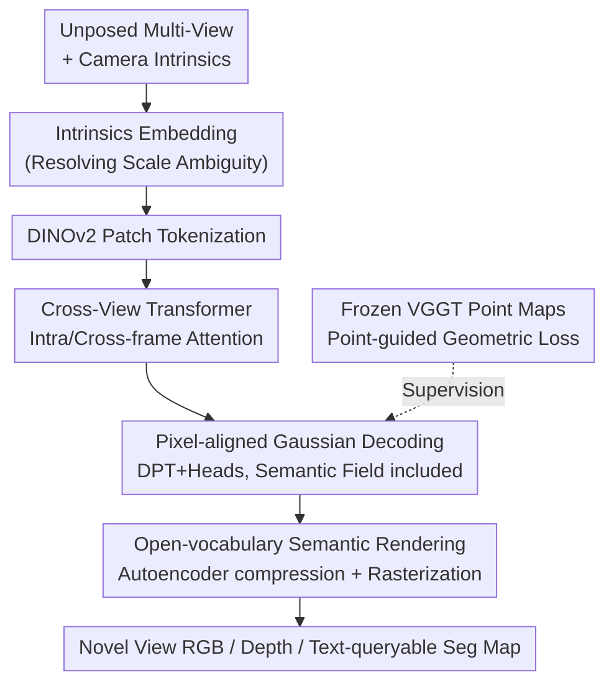

# Uni3R: Unified 3D Reconstruction and Semantic Understanding via Generalizable Gaussian Splatting from Unposed Multi-View Images

**Conference**: CVPR 2026  
**Paper**: [CVF Open Access](https://openaccess.thecvf.com/content/CVPR2026/html/Sun_Uni3R_Unified_3D_Reconstruction_and_Semantic_Understanding_via_Generalizable_Gaussian_CVPR_2026_paper.html)  
**Code**: https://horizonrobotics.github.io/robot_lab/uni3R/ (Project Page)  
**Area**: 3D Vision  
**Keywords**: 3D Gaussian Splatting, feed-forward reconstruction, open-vocabulary semantics, unposed multi-view, VGGT

## TL;DR
Uni3R utilizes a VGGT-style Cross-View Transformer to perform a single feed-forward prediction of 3D Gaussians with semantic features from an arbitrary number of unposed multi-view images. It achieves novel view synthesis, open-vocabulary 3D segmentation, and depth estimation simultaneously in 0.15 seconds, setting new SOTAs on multiple benchmarks including RE10K and ScanNet.

## Background & Motivation

**Background**: Reconstructing 3D scenes from sparse 2D images typically follows two paths. One involves high-fidelity representations like NeRF or 3DGS, which require per-scene optimization taking minutes to hours, preventing generalization to new scenes. The other involves generalizable feed-forward methods like pixelSplat, MVSplat, and DepthSplat, which learn geometric priors across scenes to produce Gaussians in one pass but ignore semantic understanding.

**Limitations of Prior Work**: Existing approaches to making 3D representations "perceptive" have significant drawbacks. LangSplat and Feature-3DGS distill CLIP/semantic features into Gaussians but still rely on per-scene optimization, making zero-shot deployment impossible. LSM and UniForward attempt to unify semantic and radiance fields via feed-forward inference but are built upon DUSt3R—an architecture inherently designed for **two views**. Extending them to multi-view scenarios requires expensive pairwise feature matching, which is slow and leads to fragmented reconstruction due to a lack of global 3D context.

**Key Challenge**: Achieving "generalizable feed-forward inference," "multi-view global consistency," and "semantic understanding" simultaneously is difficult. Methods based on pairwise architectures (DUSt3R-based) degrade with multi-view inputs, while robust multi-view geometric foundation models haven't been successfully connected to appearance rendering and semantics.

**Goal**: To create a truly feed-forward, unposed-independent unified model supporting an arbitrary number of views that outputs novel views, open-vocabulary 3D segmentation, and depth in a single pass.

**Key Insight**: The authors observe that the Cross-View Transformer (alternating intra- and cross-frame attention) in the geometric foundation model VGGT can naturally fuse arbitrary views to produce globally consistent geometric features. Its predicted dense point maps also serve as strong geometric priors. Thus, this "geometry-only" model can be extended to support both photometric reconstruction and semantic understanding.

**Core Idea**: Use VGGT as the backbone for cross-view fusion to regress a set of **pixel-aligned 3D Gaussians with semantic feature fields**. Stabilize training using point maps from a frozen VGGT as geometric supervision, enabling a unified representation to carry geometry, appearance, and open-vocabulary semantics simultaneously.

## Method

### Overall Architecture

Uni3R takes an arbitrary number of unposed multi-view images (plus camera intrinsics) as input and outputs a set of 3D Gaussian primitives. Each Gaussian carries position, scale, rotation, opacity, color, and a high-dimensional semantic feature vector. These Gaussians can be rendered via real-time differentiable rasterization to produce novel view RGB, depth maps, and text-queryable semantic maps—all in one forward pass without per-scene optimization.

The pipeline is as follows: Each image is combined with **intrinsics embeddings** to resolve scale ambiguity and processed by DINOv2 into patch tokens. Tokens enter a **Cross-View Transformer** for intra-frame and cross-frame attention to fuse into a globally consistent latent representation. This representation is decoded via DPT and multiple MLP heads to regress pixel-aligned **Gaussian parameters (including semantic features)**. Gaussians are rendered via differentiable rasterization; semantic features are compressed by an autoencoder before rendering to save memory. The system is driven by three losses: RGB photometric loss, semantic distillation loss (from LSeg), and geometric loss using frozen VGGT point maps.

### Key Designs

**1. Cross-View Transformer Encoder: Global Attention for Arbitrary Views**

DUSt3R-based methods struggle with multi-view scaling because they lack "global 3D context." Uni3R replaces this with the VGGT Cross-View Transformer, consisting of blocks alternating between **intra-frame self-attention** and **cross-frame global attention** ($L=24$ layers). Intra-frame attention refines local features, while cross-frame attention aggregates tokens from all views to establish correspondences and infer global 3D geometry. To support arbitrary view counts and maintain permutation invariance, a learnable camera token is added to each view. The resulting latent tokens encode a **globally consistent** scene understanding.

**2. Pixel-Aligned Gaussian Decoding + Semantic Feature Fields**

To transform global features into an explicit representation, the latent tokens pass through a DPT (Dense Prediction Transformer) to fuse patch features into dense pixel-wise feature maps. Independent MLP heads then predict **pixel-aligned** Gaussians. Each Gaussian is parameterized as $G_j = \{\mu_j, \alpha_j, c_j, s_j, r_j, f_j^{\text{sem}}\}$. The point head is initialized with pre-trained VGGT weights and fine-tuned for metric scale alignment. Parameters are constrained by specific activations:

$$\alpha_j = \sigma(f_j^\alpha),\quad s_j = \exp(f_j^s)\cdot d_{\text{median}},\quad r_j = \text{normalize}(f_j^r)$$

where $d_{\text{median}}$ is the median depth calculated from predicted 3D positions, used to normalize scales across scenes. Integrating semantic features into Gaussians ensures semantics and geometry share the same 3D anchors, allowing simultaneous alpha-blending during rendering.

**3. Open-Vocabulary Semantic Rendering: Autoencoder Compression + LSeg Distillation**

High-dimensional semantic features consume excessive memory. Uni3R uses an autoencoder to compress $f_j^{\text{sem}}$ into a lower dimension $\hat f_j^{\text{sem}}=\mathcal{F}_{\text{enc}}(f_j^{\text{sem}})$. Rendering uses alpha-blending:

$$\hat F = \sum_i \hat f_i^{\text{sem}}\,\alpha_i\prod_{j=1}^{i-1}(1-\alpha_j),\qquad \hat F' = \mathcal{F}_{\text{dec}}(\hat F)$$

The autoencoder is trained end-to-end to align decoded features with CLIP image features. At inference, segmentation is achieved via cosine similarity between pixel-wise features and text prototypes: for a category (e.g., "chair"), CLIP yields $f^{\text{txt}}$, and logits are $S_p = \text{softmax}(f^{\text{txt}}\cdot\hat F')$. Since semantics are integrated into a **globally consistent 3D representation**, multi-view geometry acts as a spatial filter, outperforming the 2D teacher (LSeg) by "voting out" single-view errors.

**4. Point-Map Guided Geometric Loss: Soft Priors from Frozen VGGT**

RGB-only supervision often fails to provide explicit geometric constraints, leading to local minima. Uni3R introduces a geometric regularization inspired by PM-Loss, using frozen VGGT dense point maps $\hat\mu^{(i)}$ as supervision. Since VGGT can be unreliable in reflective or occluded areas, a **confidence mask** $M^{(i)}$ is used (top 90% most confident pixels). After aligning the predicted point map with $\hat\mu^{(i)}$ using the Umeyama algorithm, a **one-way Chamfer distance** is calculated:

$$\mathcal{L}_{\text{geo}} = \sum_{i=1}^{N}\frac{1}{N_{pts}^{(i)}}\sum_{x\in X_U^{(i)}}\min_{x'\in X_V^{(i)}}\|x-x'\|_2^2$$

This improves structural accuracy at boundaries and stabilizes training by pulling the 3D point distribution out of local minima.

### Loss & Training

The total objective is a weighted sum: $\mathcal{L}_{\text{total}} = \mathcal{L}_{\text{rgb}} + \lambda_{\text{sem}}\mathcal{L}_{\text{sem}} + \lambda_{\text{geo}}\mathcal{L}_{\text{geo}}$, with $\lambda_{\text{sem}}=0.02$ and $\lambda_{\text{geo}}=0.005$.

- **Photometric Loss** $\mathcal{L}_{\text{rgb}}$: Pixel-level L1 + LPIPS ($\lambda_{\text{LPIPS}}=0.05$).
- **Semantic Loss** $\mathcal{L}_{\text{sem}}$: Distilled from the frozen 2D LSeg model via cosine similarity.
- Encoder/decoder initialized with pre-trained VGGT; intrinsics layers and Gaussian heads randomly initialized. 8×A100, ~22h training on 2 views, results reported at 256×256.

## Key Experimental Results

### Main Results

Novel view synthesis / Depth / Open-vocabulary segmentation on ScanNet (Tab. 1):

| Method | Recon Time↓ | mIoU↑ | Acc↑ | AbsRel↓ | PSNR↑ | SSIM↑ | LPIPS↓ |
|------|-----------|-------|------|---------|-------|-------|--------|
| LSeg (2D Teacher) | N/A | 0.482 | 0.793 | - | - | - | - |
| Feature-3DGS | 18min+SfM | 0.422 | 0.717 | 12.95 | 24.49 | 0.813 | 0.229 |
| LSM* (needs 3D label) | 0.108s | 0.508 | 0.769 | 3.38 | 24.39 | 0.807 | 0.251 |
| **Ours (Uni3R)** | 0.162s | **0.558** | **0.827** | 3.87 | **25.53** | **0.873** | **0.138** |

Unposed multi-view synthesis (Tab. 3/Tab. 4):

| Setup | Method | PSNR↑ | SSIM↑ | LPIPS↓ |
|------|------|-------|-------|--------|
| RE10K 2-view | NoPoSplat (Prev. SOTA) | 25.04 | 0.838 | 0.162 |
| RE10K 2-view | **Ours** | **25.07** | 0.837 | **0.158** |
| RE10K 8-view | VicaSplat | 24.50 | 0.806 | 0.164 |
| RE10K 8-view | **Ours** | **26.63** | **0.874** | **0.118** |

Advantages increase with more views: At 8 views, it outperforms VicaSplat by **~2.0 dB** and is orders of magnitude faster (0.36–0.64s) than per-scene optimization methods.

### Ablation Study

Impact of components on ScanNet (Tab. 7):

| Config | mIoU↑ | AbsRel↓ | τ↑ | PSNR↑ | Note |
|------|-------|---------|----|-------|------|
| Full (Ours) | 0.548 | 3.9 | 61.2 | 25.53 | Full model |
| Frozen transformer | 0.063 | 51.1 | 7.6 | 5.49 | Fails without fine-tuning backbone |
| w/o Semantic Loss | 0.018 | 5.8 | 47.4 | 25.38 | Segmentation collapses |
| w/o Geometric Loss | 0.554 | 5.6 | 48.2 | 25.53 | Depth error rises, 3D consistency drops |

### Key Findings

- **Semantic and rendering losses are vital**: Removing semantic loss drops mIoU from 0.548 to 0.018; without rendering loss, the model fails to converge.
- **Geometric loss targets structure, not semantics**: Removing it leaves mIoU nearly unchanged but increases AbsRel from 3.9 to 5.6, proving its role in depth accuracy and training stability.
- **Scaling with views**: Unlike pairwise methods, Uni3R improves with more views (ScanNet 2→8 views improves mIoU 0.542→0.554).
- **Student surpasses Teacher**: By distilling LSeg into a consistent 3D representation, the model "filters" 2D errors through multi-view voting (mIoU 0.558 vs LSeg 0.482).

## Highlights & Insights
- **Repurposing Geometric Foundation Models**: Uses VGGT's global attention for fused reconstruction, appearance, and semantics, avoiding the need to design multi-view fusion from scratch.
- **Autoencoder for Semantic Efficiency**: Resolves the conflict between high-dimensional features and differentiable rendering memory constraints.
- **Soft Geometric Priors**: Using frozen foundation model point maps with confidence masking stabilizes training when explicit 3D labels are absent.
- **3D Consistency as a Spatial Filter**: Highlights that 3D representations naturally denoise 2D predictions, a valuable insight for 2D-to-3D lifting tasks.

## Limitations & Future Work
- **Semantic upper bound**: Inherently limited by the quality of the 2D teacher (LSeg/CLIP); errors in the teacher can only be partially mitigated by 3D voting.
- **Dependency on VGGT**: Relies on the quality of VGGT point maps; systematic biases in the foundation model may propagate.
- **Scale and Resolution**: Verified mainly at 256×256 and in indoor environments; outdoor or high-resolution scalability remains to be fully explored.
- **Arbitrary-view stability**: Performance slightly fluctuates at mid-range view counts (e.g., 4 views), suggesting training stability could be further refined.

## Related Work & Insights
- **vs NoPoSplat / Splatt3R**: These use DUSt3R bone structures for unposed feed-forward reconstruction but suffer from fragmentation in multi-view due to lack of global context. Uni3R's VGGT-based backbone is inherently global.
- **vs LSM / UniForward**: While sharing the goal of unifying semantics/radiance fields, LSM requires 3D ground truth and is limited to two views. Uni3R is unsupervised regarding 3D labels and supports arbitrary views.
- **vs Feature-3DGS / LangSplat**: These require per-scene optimization. Uni3R is ~20,000x faster for new scenes and provides better segmentation.

## Rating
- Novelty: ⭐⭐⭐⭐ First framework to unify "geometry + appearance + semantics" in a feed-forward pass from arbitrary unposed views.
- Experimental Thoroughness: ⭐⭐⭐⭐ Robust results across RE10K/ScanNet/ACID, though high-res/outdoor testing is limited.
- Writing Quality: ⭐⭐⭐⭐ Clear logic, comprehensive ablation.
- Value: ⭐⭐⭐⭐ Simultaneous 0.15s reconstruction/segmentation/depth is highly valuable for real-time robotics and autonomous driving.

<!-- RELATED:START -->

## Related Papers

- [\[CVPR 2026\] Learning 3D Representations for Spatial Intelligence from Unposed Multi-View Images](learning_3d_representations_for_spatial_intelligence_from_unposed_multi-view_ima.md)
- [\[CVPR 2026\] BRepGaussian: CAD Reconstruction from Multi-View Images with Gaussian Splatting](brepgaussian_cad_reconstruction_from_multi-view_images_with_gaussian_splatting.md)
- [\[CVPR 2026\] Generalizable Sparse-View 3D Reconstruction from Unconstrained Images](generalizable_sparse-view_3d_reconstruction_from_unconstrained_images.md)
- [\[CVPR 2026\] Nope-SGS: 3D Gaussian Reconstruction from Unposed Spike Streams](3d_gaussian_splatting_from_unposed_spike_stream.md)
- [\[CVPR 2026\] EcoSplat: Efficiency-controllable Feed-forward 3D Gaussian Splatting from Multi-view Images](ecosplat_efficiency-controllable_feed-forward_3d_gaussian_splatting_from_multi-v.md)

<!-- RELATED:END -->
