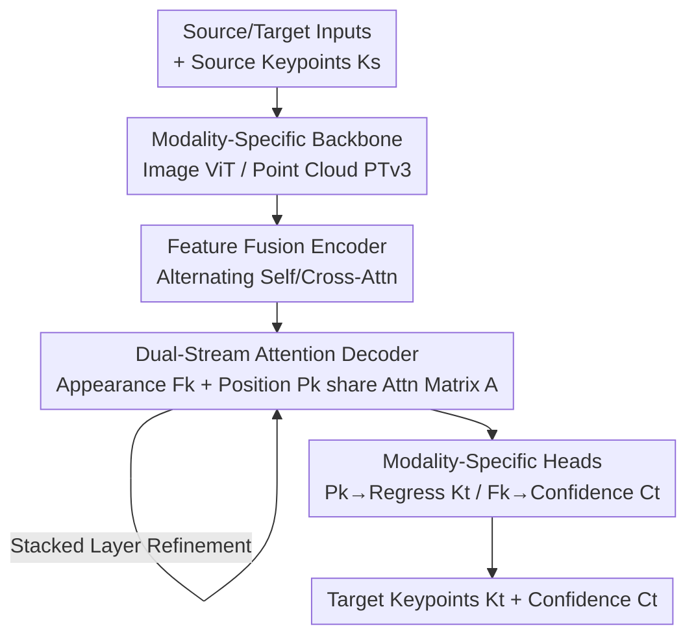

# UniCorrn: Unified Correspondence Transformer Across 2D and 3D

**Conference**: CVPR 2026  
**arXiv**: [2605.04044](https://arxiv.org/abs/2605.04044)  
**Code**: https://neu-vi.github.io/UniCorrn/ (Project Page)  
**Area**: 3D Vision  
**Keywords**: Geometric correspondence, cross-modal matching, dual-stream attention, point cloud registration, unified model

## TL;DR
UniCorrn unifies three types of geometric correspondence—image-image (2D-2D), image-point cloud (2D-3D), and point cloud-point cloud (3D-3D)—into a single "query keypoint $\rightarrow$ regress correspondence coordinate" task using a **weight-sharing** Transformer. It achieves stackable end-to-end matching via a **dual-stream attention decoder** (where appearance and position streams share the same attention matrix). It matches SOTA performance on 2D-2D tasks and outperforms previous best methods by 8% and 10% in registration recall on 7Scenes (2D-3D) and 3DLoMatch (3D-3D), respectively.

## Background & Motivation
**Background**: Visual correspondence (finding matching features between different observations of the same scene) is the foundation of 3D vision, supporting point cloud registration, camera pose estimation, and SfM/SLAM. It can be categorized by modality into 2D-2D (image matching), 2D-3D (image-to-point cloud), and 3D-3D (point cloud registration). While these problems are structurally similar—"given a source keypoint, find the corresponding target location"—the research community has traditionally developed **specialized models for each category**, each with separate network designs and supervision methods.

**Limitations of Prior Work**: Although there have been "unified matching" attempts in the 2D domain, they have not been extended to 3D. The authors categorize existing 2D unified methods into three types and explain why they fail to migrate to 3D: ① **Cost volume methods** rely on local similarity and image pyramids/RNNs for coarse-to-fine matching, but fixed pyramid depths or serial RNNs struggle with the sparse, irregular, and long-range structures of point clouds. ② **Nearest Neighbor (NN) search** matches dense descriptors, but NN is a one-off operation that cannot be embedded into stacked network layers for end-to-end training, preventing iterative refinement. ③ **Direct displacement regression** methods (e.g., UFM) perform poorly on 2D-3D/3D-3D tasks that require explicit 3D geometric reasoning.

**Key Challenge**: To build a truly unified model, the matching mechanism must simultaneously: (1) enable end-to-end learning through **stackable layers**, (2) handle **irregular structures** across modalities, and (3) allow for **iterative refinement** of correspondence estimates. Existing paradigms each lack at least one of these requirements.

**Core Idea**: The authors' key insight is that **the attention matrix in a Transformer naturally measures the similarity between two sets of features, which is the essence of all correspondence tasks**. Thus, they treat "calculating attention" as "calculating matching cost." To make this stackable for iterative refinement, they address the obstacle where updated queries lose appearance features. UniCorrn uses a **dual-stream design** (splitting appearance features and position encodings into independent residual streams sharing the same attention matrix), making "attention-as-matching" stackable, end-to-end, and cross-modal.

## Method

### Overall Architecture
UniCorrn unifies the three correspondence tasks into a single query interface: inputs are source and target observations $\mathbf{I}_s, \mathbf{I}_t$ (either images or point clouds, dimension $m\in\{2,3\}$), plus a set of source keypoints $\mathbf{K}_s\in\mathbb{R}^{N\times m}$; outputs are target correspondence coordinates $\mathbf{K}_t\in\mathbb{R}^{N\times l}$ ($l\in\{2,3\}$) and a confidence score $\mathbf{C}_t\in\mathbb{R}^N$ for each match.

The pipeline comprises four modules: **Modality-specific backbones** encode images or point clouds (ViT for images, Point Transformer v3 for point clouds; Siamese weights for same modalities); a **Feature fusion encoder** uses alternating self-attention and cross-attention blocks to exchange information regardless of modality; a **Matching decoder** (the core contribution) upsamples fused features and refines them through stacked **dual-stream Transformer layers** to output position encodings $\mathbf{P}_k$ and appearance features $\mathbf{F}_k$; and **Modality-specific prediction heads** use linear layers to regress $\mathbf{P}_k$ into coordinates and an MLP to estimate confidence from $\mathbf{F}_k$. Aside from the modality-specific ends, the middle fusion and decoder weights are **completely shared** across all three tasks.

### Key Designs

**1. Unified Weights for Three Tasks: Modality-Specific Ends + Shared Middle**

UniCorrn addresses the inefficiency of separate models by splitting the network into modality-specific ends and a modality-agnostic shared middle. While backbones and regression heads must differ (due to different input structures and 2D/3D output spaces), the fusion encoder and matching decoder use **identical weights** for 2D-2D, 2D-3D, and 3D-3D task combinations. This sharing allows the model to leverage **geometric priors** across tasks, enabling data-rich 2D-2D tasks to benefit data-scarce 2D-3D/3D-3D registration. Rotary Position Embedding (RoPE) is used to unify position representation for both image and point cloud tokens.

**2. Dual-Stream Attention Decoder: Splitting Appearance and Position (Core Contribution)**

This is the core of the method, solving the obstacle of making "attention-as-matching" stackable. A naive approach would use source keypoint descriptors $\mathbf{F}_k$ as queries and target features $\mathbf{F}_t$ as keys, where the attention matrix $\mathbf{A}=\texttt{Softmax}(\mathbf{F}_k'\mathbf{F}_t'^{T}/\sqrt{D})$ acts as a matching cost table. If the values are target absolute position encodings, the updated query $\mathbf{Q}=\mathbf{A}\mathbf{V}+\mathbf{Q}$ would carry the correct coordinate encoding. However, this updated query **loses appearance information**, preventing further refinement in subsequent layers. UniCorrn solves this with **two independent residual streams**: an appearance stream $\mathbf{F}_k=\mathbf{A}(\mathbf{W}_V\mathbf{F}_t)+\mathbf{F}_k$ and a position stream $\mathbf{P}_k=\mathbf{A}(\texttt{AbsPE}(\mathbf{X}_t))+\mathbf{P}_k$ (where $\mathbf{P}_k$ is initialized to zero and $\texttt{AbsPE}(\mathbf{X}_t)=\mathbf{W_p}\mathbf{X}_t+\mathbf{b_p}$ is a learnable absolute position encoding). Both streams are driven by the same attention matrix, allowing the appearance stream to maintain matching capability while the position stream accumulates location data.

**3. Gaussian Kernel Attention + Pseudo-inverse Coordinate Regression**

Standard dot-product attention computes similarity using a linear kernel, which is sensitive to feature scale. UniCorrn utilizes a **Gaussian kernel variant**: $\mathbf{A}=\texttt{Softmax}\big(-\texttt{Pair\_L2}(\mathbf{F}_k',\mathbf{F}_t')/D\big)$, using negative pairwise L2 distance to capture non-linear correlations, similar to classical descriptor matching. For coordinate regression, since $\texttt{AbsPE}$ is a learnable **bijective linear mapping**, the coordinates can be recovered from $\mathbf{P}_k$ using the Moore–Penrose pseudo-inverse: $\mathbf{K}_t=\mathbf{W_p^{+}}(\mathbf{P}_k-\mathbf{b_p})$. This design keeps "matching" and "localization" within a single attention mechanism without extra decoding layers.

### Loss & Training
The total loss is the sum across tasks $\mathcal{L}_{total}=\mathcal{L}_{2d2d}+\mathcal{L}_{2d3d}+\mathcal{L}_{3d3d}$, where each task uses:

- **Confidence-aware L1 Loss** $\mathcal{L}_{conf}=\frac{1}{N}\sum_i \mathbf{C}_t(i)\|\mathbf{K}_t(i)-\bar{\mathbf{K}}_t(i)\|_1-\alpha\log\mathbf{C}_t(i)$: Directly supervises coordinate error while training the model to assign low confidence to difficult regions like sky or occlusions.
- **Contrastive Loss** $\mathcal{L}_{desc}=\mathcal{L}_c(\mathbf{F}_s^{desc},\mathbf{F}_t^{desc})+\mathcal{L}_c(\mathbf{F}_k,\mathbf{F}_t^{desc})$: Uses InfoNCE to align descriptors of ground-truth pairs, enhancing the quality of the attention matrix.
- **Auxiliary Supervision** $\mathcal{L}_{aux}=\sum_{l=1}^{L}\gamma^{L-l}\frac{1}{N}\sum_i\|\mathbf{K}_t^{(l)}(i)-\bar{\mathbf{K}}_t(i)\|_1$: Supervizes coordinate regression at **every layer** of the decoder with increasing weights for deeper layers to ensure iterative refinement.

**Training Strategy**: To handle scarce 3D correspondence labels, the authors convert depth maps from DUSt3R training data into **pseudo-point clouds** and mix them with high-quality 3D data (ScanNet++, ARKitScenes). The backbone uses pre-trained CroCo v2.

## Key Experimental Results

### Main Results
Comparison with SOTA specialized models (RR = Registration Recall, AUC = Area Under Curve for pose error):

| Task / Dataset | Metric | Ours | Prev. SOTA | Gain |
|--------|------|------|----------|------|
| 2D-2D / MegaDepth-1500 | AUC@5° | 55.5 | RoMa 62.6 / MASt3R 53.1 | Comparable |
| 2D-2D / ScanNet-1500 | AUC@20° | 71.3 | LoFTR 50.6 | Strong Gen. |
| 2D-3D / 7Scenes | RR | 91.0 | B2-3Dnet 77.7 / Diff-Reg 83.8 | **+8%** |
| 3D-3D / 3DLoMatch | RR | 86.7 | PEAL-3D 79.0 | **+10%** |
| 3D-3D / 3DMatch | RR | 97.5 | Diff-Reg 95.0 | +2.5% |

While UniCorrn is slightly behind DKM/RoMa on 2D-2D (which use high-res warping that doesn't apply to 3D), it significantly resets SOTA for the specialized 2D-3D and 3D-3D tasks using a single unified model.

### Ablation Study
Comparison of matching paradigms (Small model, RR/IR):

| Matching Paradigm | MegaDepth AUC@10° | 7Scenes RR | 3DMatch RR | Notes |
|------|------|------|------|------|
| Nearest Neighbor | 67.1 | 63.4 | 87.5 | Significantly weaker in 3D |
| Global Matching | 64.9 | 75.8 | 96.5 | Similar but 2x slower to train |
| Direct Regression | 1.5 | 17.0 | 18.2 | Fails |
| **Dual-stream Decoder** | **67.1** | **77.8** | **96.9** | Accurate and efficient |

### Key Findings
- **Dual-stream decoder is crucial**: Direct regression and COTR-style sequence concatenation both failed, proving that "stackable attention matching" is essential for cross-modal tasks.
- **Largest gains from upsampling and contrastive loss**: 4x upsampling boosted AUC@5° from 43.9 to 48.5; contrastive loss significantly improved attention matrix quality.
- **Synergy and Conflict in Joint Training**: Registration Recall on 7Scenes (2D-3D) jumped from 67.7 (single task) to 91.0 (joint), showing 2D data benefits 3D. However, 2D-2D performance slightly dipped. Gradient analysis shows most parameters align, but **normalization layers exhibit high conflict** as they struggle to accommodate varying 2D/3D feature statistics.

## Highlights & Insights
- **Attention Matrix as Cost Volume**: Viewing the attention matrix as a normalized cost volume allows "correspondence" to be subsumed into the general Transformer framework, providing the conceptual basis for unification.
- **Solving Stackability**: The diagnosis of why naive queries cannot be stacked (loss of appearance) and the dual-stream solution is elegant and applicable to other iterative refinement tasks like tracking or optical flow.
- **Pseudo-point clouds**: Leveraging depth maps to augment 3D data is a practical engineering path to overcome the lack of 3D correspondence labels.

## Limitations & Future Work
- **Normalization layers as a bottleneck**: High gradient conflict in shared normalization layers limits the performance of joint training; better cross-modal alignment or normalization strategies are needed.
- **2D-2D Trade-off**: UniCorrn sacrifices sub-pixel 2D accuracy (relative to warping-based methods) in exchange for cross-modal generality.
- **GT Keypoints**: While the authors argue the comparison is fair, the performance under pure detector-based queries requires further validation.

## Related Work & Insights
- Compared to **2D Unified Matching** (UFM/MatchAnything), UniCorrn extends unification to 3D and demonstrates why direct regression fails in geometric reasoning.
- Compared to **2D-3D Specialized Methods** (B2-3Dnet/Diff-Reg), UniCorrn's unified model outperforms them without the overhead of diffusion sampling.
- Compared to **3D-3D Registration** (PEAL-3D/GeoTransformer), UniCorrn shows that making matching an explicit stackable attention process is more robust for difficult, low-overlap samples.

## Rating
- Novelty: ⭐⭐⭐⭐⭐ 
- Experimental Thoroughness: ⭐⭐⭐⭐⭐ 
- Writing Quality: ⭐⭐⭐⭐ 
- Value: ⭐⭐⭐⭐⭐ 

<!-- RELATED:START -->

## Related Papers

- [\[CVPR 2026\] RnG: A Unified Transformer for Complete 3D Modeling from Partial Observations](rng_a_unified_transformer_for_complete_3d_modeling_from_partial_observations.md)
- [\[CVPR 2026\] MimiCAT: Mimic with Correspondence-Aware Cascade-Transformer for Category-Free 3D Pose Transfer](mimicat_mimic_with_correspondence-aware_cascade-transformer_for_category-free_3d.md)
- [\[CVPR 2026\] Generalizable Structure-Aware Keypoint Correspondence for Category-Unified 3D Single Object Tracking](generalizable_structure-aware_keypoint_correspondence_for_category-unified_3d_si.md)
- [\[CVPR 2026\] Best Segmentation Buddies for Image-Shape Correspondence](best_segmentation_buddies_for_image-shape_correspondence.md)
- [\[CVPR 2026\] Generalized-CVO: Fast and Correspondence-Free Local Point Cloud Registration with Second Order Riemannian Optimization](generalized-cvo_fast_and_correspondence-free_local_point_cloud_registration_with.md)

<!-- RELATED:END -->
