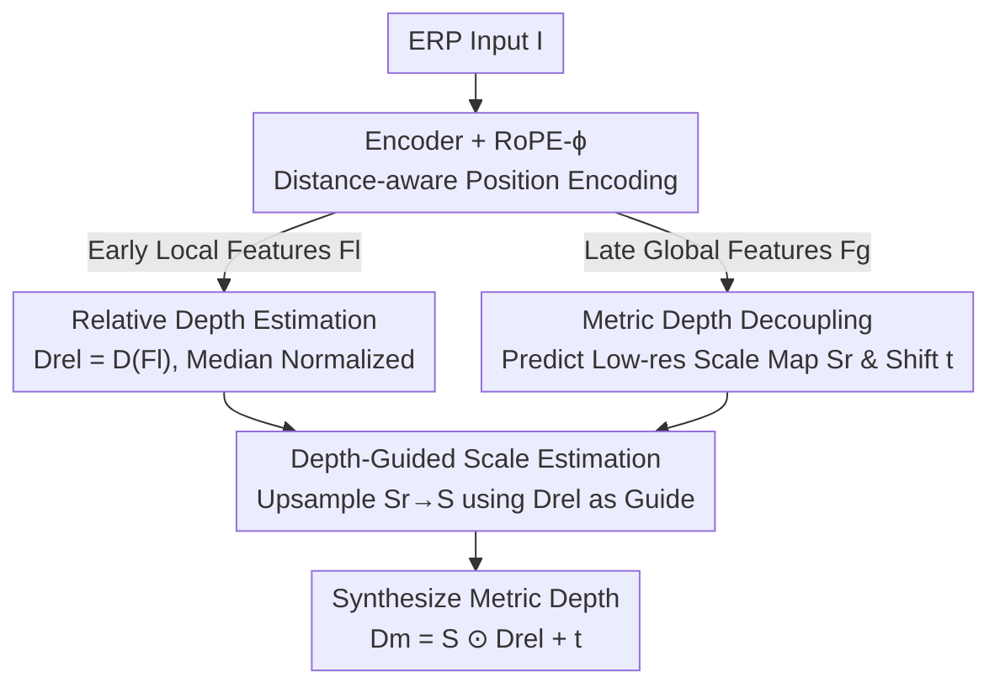

# UniDAC: Universal Metric Depth Estimation for Any Camera

**Conference**: CVPR 2026  
**Paper**: [CVF Open Access](https://openaccess.thecvf.com/content/CVPR2026/html/Ganesan_UniDAC_Universal_Metric_Depth_Estimation_for_Any_Camera_CVPR_2026_paper.html)  
**Code**: https://girish1511.github.io/UniDAC (Project Page)  
**Area**: 3D Vision  
**Keywords**: Monocular Metric Depth, Cross-Camera Generalization, ERP, Scale Estimation, Rotary Positional Embedding

## TL;DR
UniDAC decouples monocular metric depth into two components: relative depth and a spatially-varying scale map. Using a unified model trained exclusively on perspective views, it achieves zero-shot metric depth estimation on wide field-of-view cameras like fisheye and 360°. By leveraging a depth-guided scale upsampling module and RoPE-ϕ, a positional encoding adapted for Equirectangular Projection (ERP) geometry, it significantly outperforms previous SOTA in cross-camera generalization.

## Background & Motivation
**Background**: Monocular Metric Depth Estimation (MMDE) aims to directly regress depth with real physical scale from a single image. Recent methods (e.g., UniDepth, Metric3Dv2) have achieved impressive zero-shot metric depth on perspective cameras by conditioning on camera parameters, mapping to canonical spaces, or explicitly estimating scale.

**Limitations of Prior Work**: These methods are developed almost entirely for perspective views and fail when applied to fisheye or 360° cameras. Two existing "unified camera" approaches have significant drawbacks: UniK3D uses spherical harmonic representations but **requires large-FOV data during training** (essentially "cheating" by matching test distributions); DAC uses perspective views but projects to an ERP canonical space, yet it **must train separate models for indoor and outdoor scenes**, suffering performance degradation when fused into a single unified model.

**Key Challenge**: The root cause is the massive difference in depth ranges across domains—maximal depth is ~10m indoors vs. ~80m outdoors. Forcing a model to directly regress this vast range of absolute depths leads to training conflicts. Moreover, unified models like DAC attempt to use a **single global scalar** to align domains, which is insufficient for capturing local variations.

**Goal**: To build a **single model** MMDE framework capable of generalizing across both "camera geometries" and "scene domains" without significantly increasing model or data scale.

**Key Insight**: The authors observe that metric depth can be decoupled into two components depending on **different contextual ranges**: relative depth relies on local pixel structures (object shapes, boundaries) and is domain-agnostic; whereas scale/shift relies on global scene semantics (indoor vs. outdoor) and is domain-dependent. These components also happen to benefit from different layers of a pre-trained backbone.

**Core Idea**: Decouple metric depth into "relative depth (predicted from early-layer local features)" and a "spatially-varying scale map (predicted from late-layer global features)". Then, use the relative depth as a guide to upsample the coarse scale map to high resolution, thereby unifying both camera geometries and scene domains.

## Method

### Overall Architecture
Given an input image $I \in \mathbb{R}^{H\times W\times 3}$ projected into ERP space, UniDAC follows a "one encoder, two-way decoder" pipeline to synthesize metric depth: the encoder $E$ extracts features and splits them into local features $F_l$ (early layers, rich in structural detail) and global features $F_g$ (late layers, rich in scene-level semantics). The local path uses decoder $D$ to produce relative depth $D_{rel}$, while the global path produces a scale map $S$. Finally, metric depth is synthesized per-pixel as $D_m = S \odot D_{rel} + t$. Theoretically, relative and metric depth differ by a pair of global scalars $\{s,t\}$ (see Eq. 1), but in practice, relative depth is often "stretched or compressed" by local errors or occlusions. To resolve this, the authors predict a **per-pixel scale map** $S$ instead of a scalar. The scale map is predicted at low resolution and upsampled using relative depth as a guide. Additionally, the encoder's positional encoding is replaced with RoPE-ϕ, which makes pixel distances more consistent with true spherical geodesic distances on ERP.

### Key Designs

**1. Metric Depth Decoupling: Managing Relative Depth and Scale with Local/Global Features**

This step addresses the problem of inconsistent depth ranges across domains. Based on the decomposition $D_m = sD_{rel} + t$ in Equation 1, the authors split metric depth into **domain-agnostic relative depth** and **domain-dependent scale/shift**. Relative depth $D_{rel}$ relies on local pixel changes and is predicted from local features $F_l$. Scale $s$ and shift $t$ are low-dimensional global quantities predicted from global features $F_g$ ($t$ is obtained via a shallow MLP from the $F_g$ CLS token). The predicted relative depth is median-normalized $D_{rel} = \hat{D}_{rel}/\hat{s},\ \hat{s} = \text{Median}(\hat{D}_{rel})$ to bring it to a unified scale, preventing domain bias from polluting subsequent scale estimation. With this decoupling, the model no longer struggles with depth range labels; the relative depth path looks similar across domains. Ablations show that direct metric regression works on ScanNet++ but fails on KITTI-360, proving the necessity of decoupling.

**2. Depth-Guided Scale Estimation (DGSE): Upsampling Coarse Scale Maps via Relative Depth**

While a global scalar is theoretically sufficient, relative depth often exhibits spatially non-uniform scaling due to local errors. Predicting a high-resolution scale map $S$ directly is computationally expensive. DGSE adopts a "coarse-to-fine, non-parametric" approach: first, it generates a low-resolution scale map $S_r = \text{MLP}(\text{SelfAttn}(F_g))$ (self-attention ensures similar patches receive similar scales). Then, it upsamples $S_r$ to $S$ using relative depth as a **non-parametric guide**. Specifically, a median-pooled relative depth $D_{rel}^{r}$ is computed with kernel/stride $r$. Each high-res pixel $p$ is mapped to $p_r=[\lfloor u/r\rfloor, \lfloor v/r\rfloor]$, and distances are calculated in a $3\times3$ neighborhood $\Omega$:

$$\Delta[p] = \{\,|D_{rel}[p] - D_{rel}^{r}[p_r+\delta p]| : \forall \delta p \in \Omega\,\},$$

Applying a softmax on negative distances yields weights $W[p] = \text{softmax}(-\Delta[p]) \in \mathbb{R}^{H\times W\times 9}$. Finally, $S[p] = W[p,:]^\top N(S_r, p_r)$ aggregates neighborhood scales. This uses the existing boundary information in the relative depth as a "routing signal"—regions with consistent boundaries share consistent scales, while boundaries remain sharp. The process requires no learnable parameters and adds negligible overhead.

**3. RoPE-ϕ: Respecting ERP Geodesic Distance in Positional Encoding**

Feeding ERP images into Transformers with standard 2D-RoPE poses a problem: 2D-RoPE relative positions only consider pixel coordinates $p=[u,v]$. This is fine for perspective views, but in ERP, **identical pixel intervals correspond to different spherical (geodesic) distances at different latitudes**. Geodesic distance decreases toward the poles for a fixed longitude difference. The geodesic distance between two pixels is:

$$G(p_1,p_2) = \arccos(\sin\phi_1\sin\phi_2 + \cos\phi_1\cos\phi_2\,\Delta\theta).$$

For $\Delta\phi=0$, $G \propto \cos\phi\,\Delta\theta$. The authors introduce a latitude-dependent cosine weight to the 2D-RoPE rotation matrix:

$$R_\phi[n] = R[n]\,w(\phi_n), \quad w(\phi) = \delta + (1-\delta)\cos\phi,$$

where $\delta$ controls the minimum decay at poles ($w(\phi)\in[\delta,1]$). Setting $\delta=1$ reverts to standard 2D-RoPE. This effectively compresses positional distances at high latitudes (distorted polar regions in ERP), aligning them with true spherical adjacency and improving Transformer attention in wide-FOV regions.

### Loss & Training
Both outputs use Scale-Invariant Logarithmic (SILog) loss. SILog can be written as $L_{SIlog} = \sqrt{V[\epsilon_p] + (1-\lambda)E^2[\epsilon_p]}$, where $\epsilon_p = \ln\bar{D}[p] - \ln D[p]$ and $\lambda$ balances scale-invariant and scale-dependent components. The authors use purely scale-invariant loss $L_{rel} = L_{SIlog}^{\lambda=1}$ for relative depth and standard mixed loss $L_m = L_{SIlog}^{\lambda=0.85}$ for metric depth. Training uses a ViT-L (DINO pre-trained) encoder and DPT decoder with AdamW and cosine annealing for 120k iterations (batch 128), following DAC's FOV alignment and multi-resolution sampling.

## Key Experimental Results

### Main Results
Training is conducted on 7 perspective datasets (Indoor: HM3D/Hypersim/Taskonomy; Outdoor: DDAD/LYFT/Argoverse2/A2D2; total 1.1M images). Zero-shot evaluation is performed on 2 fisheye (ScanNet++, KITTI-360) and 2 panoramic (Pano3D-GV2, Matterport3D) datasets. The following table shows "Universal Domain Robustness" (all methods trained on indoor+outdoor; UniK3D includes large-FOV data in training):

| Dataset | Metric | UniDAC-V | DACU-S | UniK3D-V |
|--------|------|----------|--------|----------|
| ScanNet++ | δ1 ↑ | **0.918** | 0.658 | 0.651 |
| ScanNet++ | A.Rel ↓ | **0.097** | 0.233 | 0.253 |
| Pano3D-GV2 | δ1 ↑ | 0.768 | 0.684 | **0.785** |
| KITTI-360 | δ1 ↑ | **0.836** | 0.708 | 0.817 |
| Model Size | params | 1.45M | 0.79M | 7.94M |

Ours improves δ1 by ~26% over UniK3D/DACU on ScanNet++. On KITTI-360, it outperforms UniK3D by ~2% (even though UniK3D's training includes outdoor fisheye data). On Pano3D-GV2, it matches UniK3D despite UniK3D having seen similar training data.

In cross-camera generalization, domain-specific DAC models (DACI, DACO) **fail catastrophically** when switching domains. The unified DACU also generalizes poorly due to its single global scale. UniDAC significantly leads DACU across all four datasets, validating the decoupling strategy.

### Ablation Study
Ablated Using ViT-B on HM3D + KITTI-360.

| Configuration | ScanNet++ δ1 ↑ | KITTI-360 δ1 ↑ | Note |
|------|------|------|------|
| Direct Metric Regression (No Decoupling) | 0.782 | 0.563 | OK for indoor, fails for outdoor (indoor bias) |
| Scalar Scale $s\in\mathbb{R}$ | 0.773 | 0.601 | Decoupled but single global scalar |
| Scale Map $S\in\mathbb{R}^{H\times W}$ (Ours) | **0.792** | **0.622** | Gain of ~2% over scalar |

| Positional Encoding | ScanNet++ δ1 ↑ | ScanNet++ A.Rel ↓ | KITTI-360 δ1 ↑ |
|----------|------|------|------|
| 2D RoPE | 0.750 | 0.177 | 0.592 |
| RoPE-ϕ (Ours) | **0.792** | **0.140** | **0.622** |

### Key Findings
- **Scale Map > Scalar > No Decoupling**: Direct regression in outdoor settings (KITTI-360) is only 0.563. Decoupling with a single scalar raises it to 0.601, and using a spatially-varying scale map reaches 0.622, verifying both steps.
- **RoPE-ϕ Benefits Large FOV Most**: The Gain on ScanNet++ is larger than on KITTI-360. In KITTI-360, valid depth is concentrated near the equator, whereas ScanNet++ provides dense depths across the FOV, highlighting the advantage of latitude weighting.
- **Parameter Efficiency**: UniDAC’s trainable parameters (1.45M) are far fewer than UniK3D (7.94M), yet it outperforms it on most metrics, showing the designs are more effective than simple parameter scaling.

## Highlights & Insights
- **Precise "Divide and Conquer" Decoupling**: Decoupling depth based on "local vs. global context" and mapping them to backbone feature hierarchies is physically intuitive and elegant. This can be adapted for any task where local structure is coupled with global dimensions.
- **Clever Non-parametric Upsampling**: Using high-resolution relative depth boundaries as routing weights for low-resolution scale upsampling is a zero-cost trick that ensures boundary alignment. This "routing via another signal" approach is applicable to segmentation or normal estimation.
- **Geometric Prior in RoPE-ϕ**: Injecting ERP spherical distortion directly into RoPE rotation weights is a brilliant example of embedding domain knowledge into Transformers with minimal modification.

## Limitations & Future Work
- **Dependency on ERP Canonical Space**: The method assumes images are projected to ERP; its effectiveness on non-central cameras or extreme distortions is not fully explored.
- **Transformer Scale Equivariance**: The authors noted that on some Pano3D benchmarks, ResNet-based DACI outperforms their Transformer version, likely due to Transformer weaknesses in scale equivariance—a structural challenge not solved here.
- **Reliance on Relative Depth Quality**: DGSE relies entirely on the boundaries in relative depth. Errors in relative depth will propagate to the scale map.
- **Validation on Real Hardware**: Evaluation relies primarily on synthetic/captured wide-FOV datasets; end-to-end deployment on real-world fisheye devices for latency/performance has not been demonstrated.

## Related Work & Insights
- **vs. UniK3D**: UniK3D uses spherical harmonics but requires large-FOV training data. UniDAC generalizes to large-FOV cameras using only perspective training and 5x fewer parameters.
- **vs. DAC**: While both use ERP projection, DAC requires separate domain-specific models. UniDAC’s scale map allows a single model to cover both domains by fixing the DAC "single scalar scale" bottleneck.
- **vs. UniDepth / Metric3Dv2**: These are strong on perspective views but ignore wide-FOV distortion. UniDAC fills this gap by explicitly modeling geometry in ERP and RoPE-ϕ.

## Rating
- Novelty: ⭐⭐⭐⭐ The combination of decoupling, DGSE, and RoPE-ϕ is well-targeted and clear.
- Experimental Thoroughness: ⭐⭐⭐⭐ Extensive zero-shot testing across 4 datasets and multiple DAC variants; lacks real-world deployment/failure analysis.
- Writing Quality: ⭐⭐⭐⭐ Strong logical flow (range difference → decoupling) and clear technical descriptions.
- Value: ⭐⭐⭐⭐ High utility for multi-camera systems (autonomous driving, AR/VR) due to single-model unification and parameter efficiency.

<!-- RELATED:START -->

## Related Papers

- [\[CVPR 2026\] MD2E: Modeling Depth-to-Edge Cues for Monocular Metric Depth Estimation](md2e_modeling_depth-to-edge_cues_for_monocular_metric_depth_estimation.md)
- [\[CVPR 2025\] Depth Any Camera: Zero-Shot Metric Depth Estimation from Any Camera](../../CVPR2025/3d_vision/depth_any_camera_zero-shot_metric_depth_estimation_from_any_camera.md)
- [\[CVPR 2026\] Depth Any Panoramas: A Foundation Model for Panoramic Depth Estimation](depth_any_panoramas_a_foundation_model_for_panoramic_depth_estimation.md)
- [\[CVPR 2026\] Radar-Guided Polynomial Fitting for Metric Depth Estimation](radar-guided_polynomial_fitting_for_metric_depth_estimation.md)
- [\[CVPR 2026\] The Midas Touch for Metric Depth](the_midas_touch_for_metric_depth.md)

<!-- RELATED:END -->
