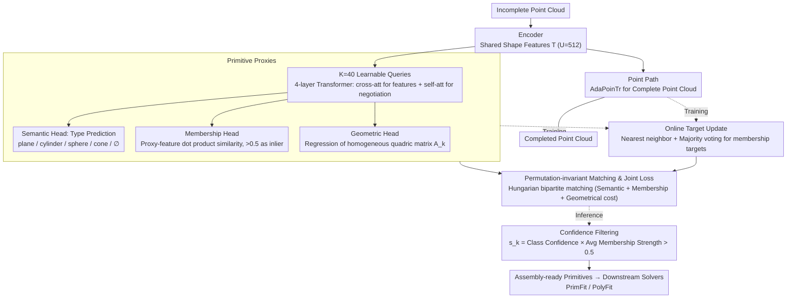

# Unified Primitive Proxies for Structured Shape Completion

**Conference**: CVPR 2026  
**arXiv**: [2601.00759](https://arxiv.org/abs/2601.00759)  
**Code**: [https://unico-completion.github.io](https://unico-completion.github.io)  
**Area**: 3D Vision  
**Keywords**: Shape Completion, Primitive Assembly, 3D Reconstruction, Transformer, Structured Understanding

## TL;DR
UniCo is proposed to learn unified primitive representations on shared shape features via primitive proxies. It jointly predicts complete point clouds and assembly-ready quadric primitives (including geometry, semantics, and membership) in a single forward pass, reducing Chamfer distance by up to 50% and improving normal consistency by up to 7% on synthetic and real-world point cloud benchmarks.

## Background & Motivation

1. **Background**: 3D shape completion aims to recover missing geometry from incomplete scans. Prevailing methods (PoinTr, AdaPoinTr, ODGNet, etc.) optimize point-wise differences, which recovers local geometry but lacks structured understanding. Primitive assembly models surfaces as compact sets of parameterized primitives, providing structured, interpretable geometric representations suitable for downstream editing and topological control.

2. **Limitations of Prior Work**: Current practices often use a "completion-then-assembly" cascade, which faces fundamental issues: (a) assembly solvers (e.g., PrimFit, PolyFit) expect structured inputs, whereas point-wise completion outputs are unstructured; (b) cascade pipelines propagate early errors—incorrect primitive counts or parameters adversely affect subsequent association steps; (c) two-stage methods like PaCo regress primitive parameters before enforcing membership, leading to overfitting in sparse regions and support only for planar primitives.

3. **Key Challenge**: Point completion and primitive inference are driven by different supervisory signals—the former requires point-wise guidance, while the latter relies on discrete and relational cues. The challenge lies in coordinating their optimization rather than cascading them.

4. **Goal**: To directly predict assembly-ready structured primitives (including geometry, semantic types, and inlier membership) from incomplete point clouds in a single forward pass.

5. **Key Insight**: Three design principles are introduced: (a) Coordinated paths: Point completion and primitive inference decode shared features in parallel; (b) Unified representation: Learnable queries (primitive proxies) aggregate scattered structural information from features; (c) Consistent optimization: Online update of primitive targets combined with permutation-invariant matching.

6. **Core Idea**: Use learnable primitive proxy queries to probe shared shape features, jointly predicting point completion and assembly-ready primitives within a single network.

## Method

### Overall Architecture
Given an incomplete point cloud, UniCo outputs two components in one forward pass: a completed dense point cloud and a set of assembly-ready quadric primitives. An encoder first compresses the input into a set of shared shape features $\mathcal{T} = \{\mathbf{t}^u\}_{u=1}^U$ ($U=512$). Subsequently, two parallel paths decode the same features: the point path follows AdaPoinTr to recover the complete point cloud, while the primitive path employs $K=40$ learnable "primitive proxy" queries to extract structural information. Sharing features is essential—completion and primitive inference are simultaneously constrained by the same representation, preventing the propagation of early errors. During training, online target updates and Hungarian matching coordinate the two paths. During inference, confidence scores filter effective primitives for downstream assembly solvers.

### Key Designs

**1. Primitive Proxies: Aggregating scattered structural information into unified primitive representations**

Features from point-wise completion are unstructured, while downstream solvers require structured input. UniCo employs a set of learnable queries to actively probe these features. $K=40$ queries $\mathcal{R}^{(0)}$ are contextualized through a 4-layer Transformer decoder. In each layer, cross-attention allows queries to extract information from shared features $\mathcal{T}$, followed by self-attention for inter-proxy negotiation (avoiding multiple proxies competing for the same primitive):

$$\mathcal{R}^{(l)} = \text{self-att}\big(\text{cross-att}(\mathcal{R}^{(l-1)}, \text{MLP}(\mathcal{T}))\big)$$

The contextualized proxies are shared by three heads: a semantic head uses MLP + softmax for classification (plane / cylinder / sphere / cone / $\emptyset$); a membership head projects proxy embeddings and shape features into a joint latent space to compute dot-product similarity $m_k^u = \text{sigmoid}(\langle \text{MLP}(\mathbf{r}_k), \text{MLP}(\mathbf{t}^u)\rangle)$, where values $> 0.5$ indicate inliers; a geometric head regresses a homogeneous quadric matrix $\mathbf{A}_k \in \mathbb{R}^{4 \times 4}$, providing a unified representation for planes, cylinders, spheres, and cones.

**2. Online Target Update: Synchronizing membership supervision with evolving point predictions**

Predicted points shift during training. Supervising "which point belongs to which primitive" based on fixed points would cause misalignment and optimization instability. UniCo recomputes targets in each iteration: for each predicted point $\hat{\mathbf{y}}_j^u$, the nearest neighbor is found in the GT points to inherit a primitive label $p_{i^*}$. Majority voting per patch determines the patch-level label $\hat{\mathcal{P}}^u$. Patches assigned to the same primitive comprise the online target $\mathcal{I}_g$. These targets refresh alongside predictions, binding the assignment to the network parameters. Ablation shows that removing this design increases CD from 2.44 to 12.22 and drops NC from 0.924 to 0.631.

**3. Permutation-invariant Matching and Joint Loss: Aligning unordered predictions with GT**

Predicted primitive sets are unordered. UniCo utilizes bipartite matching (similar to DETR). A cost matrix is constructed between predictions and GT, incorporating three costs: semantic cost (classification), membership cost (CE + Dice), and geometric cost (Chamfer distance of inliers and parameter L1 distance). Hungarian matching yields the optimal assignment. The total loss is the sum of matched primitive costs plus a global object-level Chamfer distance. Unmatched predictions are penalized via the semantic term. During inference, a confidence score is computed:

$$s_k = \pi_k[\hat{c}_k] \cdot \frac{1}{|\hat{\mathcal{I}}_k|} \sum_{u \in \hat{\mathcal{I}}_k} m_k^u$$

Primitives with $s_k > 0.5$ are passed to downstream solvers.

## Key Experimental Results

### Main Results (ABC-multi + PrimFit Assembly)

| Method | Primitive Extractor | CD ↓ | HD ↓ | NC ↑ | FR ↓ |
| :--- | :--- | :--- | :--- | :--- | :--- |
| AdaPoinTr | HPNet | 4.41 | 13.36 | 0.872 | 8.97% |
| ODGNet | HPNet | 4.33 | 13.63 | 0.873 | 7.41% |
| ODGNet | RANSAC | 4.80 | 22.15 | 0.868 | 0.39% |
| SymmComplete | HPNet | 4.57 | 13.58 | 0.865 | 9.84% |
| **UniCo (Ours)** | **Built-in** | **2.18** | **7.53** | **0.935** | **1.49%** |

### Ablation Study (ABC-multi, 200 epochs)

| Configuration | CD ↓ | NC ↑ |
| :--- | :--- | :--- |
| Full model (UniCo) | 2.44 | 0.924 |
| no param. head | 2.52 (-0.08) | 0.921 |
| no prim. Chamfer | 2.53 (-0.09) | 0.920 |
| CE-only membership | 2.53 (-0.09) | 0.923 |
| Dice-only membership | 2.66 (-0.22) | 0.914 |
| **no online target** | **12.22 (-9.78)** | **0.631** |
| two-stage training | 2.55 (-0.11) | 0.919 |

### Main Results (Building-PCC + PolyFit)

| Method | CD ↓ | HD ↓ | NC ↑ | FR ↓ |
| :--- | :--- | :--- | :--- | :--- |
| AdaPoinTr | 4.87 | 10.61 | 0.934 | 0.85% |
| ODGNet | 3.97 | 9.09 | 0.947 | 0.87% |
| PaCo | 4.89 | 10.74 | 0.932 | 0.54% |
| **UniCo (Ours)** | **3.84** | **9.18** | **0.949** | **0.39%** |

### Key Findings
- **Online target update** is the most critical design; removing it causes CD to degrade by 5x (2.44 → 12.22) and NC to plummet (0.924 → 0.631). This confirms that dynamic synchronization of primitive supervision with changing point predictions is necessary in completion tasks.
- Point-wise metrics do not always correlate with reconstruction quality: SymmComplete has the lowest point-wise CD but results in some of the highest CD after assembly, highlighting that structured output is more valuable than raw point accuracy.
- UniCo consistently outperforms baselines across four different assembly solvers (PrimFit, PolyFit, KSR, COMPOD), proving the generalizability of its primitives.
- Robustness: As incompleteness increases from 25% to 75%, UniCo's CD only rises from 1.8 to 2.7, whereas baselines double to ~6.0.
- Observations show that primitive proxies automatically develop consistent proxy-level semantics, where specific proxies consistently represent the same semantic parts across different inputs.

## Highlights & Insights
- Implementing a DETR-style query mechanism for 3D shape completion is an elegant transfer: primitive proxies function like object queries but handle geometry, semantics, and membership simultaneously in a completion context.
- The online target update addresses a fundamental problem—maintaining stable structured supervision while predictions evolve. This approach could extend to other learning tasks with dynamic targets.
- Using homogeneous quadric parametrization provides a unified representation for diverse primitives (planes, cylinders, spheres, cones), simplifying network design and facilitating expansion to new primitive types.

## Limitations & Future Work
- The method prioritizes assembly-ready structures over point-wise precision; benefits are limited for highly unstructured geometries.
- Final reconstruction quality remains dependent on the downstream assembly solver.
- The fixed count of $K=40$ proxies may be insufficient for extremely complex models.
- Future work: Leveraging emergent correspondence in primitive proxies for part-aware assembly and scaling to large-scale scenes.

## Related Work & Insights
- **vs. PaCo**: PaCo uses a cascade approach (predicting parameters then associating points) and supports only planes. UniCo jointly optimizes both paths and supports mixed primitives, reducing CD from 1.87 to 1.69 on ABC-plane and 4.89 to 3.84 on Building-PCC.
- **vs. AdaPoinTr/ODGNet**: These methods show good point-wise metrics but poor assembly results because their outputs lack primitive-aware structural information.
- **vs. Point2CAD/BSP-Net**: These reconstruction methods struggle with partial inputs. Even with high-quality completion (e.g., from ODGNet) as input, Point2CAD's CD remains 55% higher than UniCo's.

## Rating
- Novelty: ⭐⭐⭐⭐ Primitive proxies and online target updates effectively adapt query mechanisms to structured completion.
- Experimental Thoroughness: ⭐⭐⭐⭐⭐ Comprehensive evaluation across three datasets, four solvers, and detailed ablations.
- Writing Quality: ⭐⭐⭐⭐⭐ Clear design principles and logical derivation from problem to solution.
- Value: ⭐⭐⭐⭐ Provides a robust recipe for 3D structured understanding, though application-specific.

<!-- RELATED:START -->

## Related Papers

- [\[CVPR 2026\] Proxy-GS: Unified Occlusion Priors for Training and Inference in Structured 3D Gaussian Splatting](proxy-gs_unified_occlusion_priors_for_training_and_inference_in_structured_3d_ga.md)
- [\[CVPR 2026\] Differentiable Adaptive 4D Structured Illumination for Joint Capture of Shape and Reflectance](differentiable_adaptive_4d_structured_illumination_for_joint_capture_of_shape_an.md)
- [\[CVPR 2026\] RnG: A Unified Transformer for Complete 3D Modeling from Partial Observations](rng_a_unified_transformer_for_complete_3d_modeling_from_partial_observations.md)
- [\[CVPR 2026\] FlashMesh: Faster and Better Autoregressive Mesh Synthesis via Structured Speculation](flashmesh_faster_and_better_autoregressive_mesh_synthesis_via_structured_specula.md)
- [\[CVPR 2025\] ESCAPE: Equivariant Shape Completion via Anchor Point Encoding](../../CVPR2025/3d_vision/escape_equivariant_shape_completion_via_anchor_point_encoding.md)

<!-- RELATED:END -->
