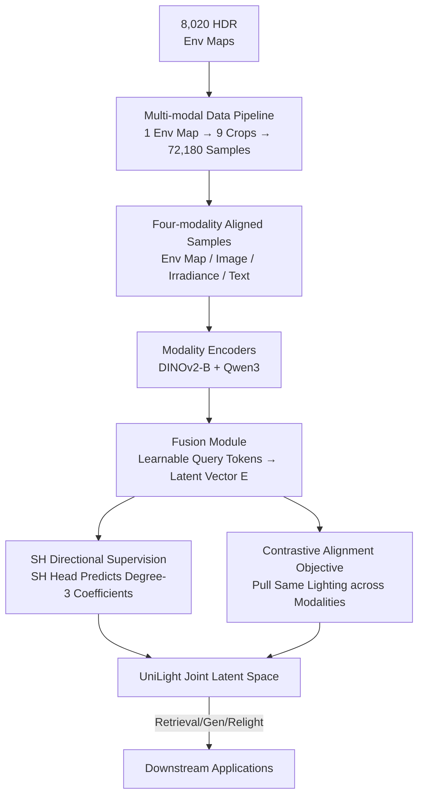

# UniLight: A Unified Representation for Lighting

**Conference**: CVPR 2026  
**Paper**: [CVF Open Access](https://openaccess.thecvf.com/content/CVPR2026/html/Zhang_UniLight_A_Unified_Representation_for_Lighting_CVPR_2026_paper.html)  
**Code**: Project Page https://lvsn.github.io/UniLight (Code TBD)  
**Area**: 3D Vision / Lighting Representation / Relighting  
**Keywords**: Unified Lighting Representation, Cross-modal Contrastive Learning, Environment Map, Spherical Harmonics, Relighting

## TL;DR
UniLight projects four historically incompatible lighting representations—environment maps, images, irradiance maps, and text—into a single joint latent space via contrastive learning. By adding a Spherical Harmonics (SH) prediction auxiliary task to lock in light direction information, it supports three downstream tasks: cross-modal lighting retrieval, environment map generation, and diffusion-based relighting.

## Background & Motivation
**Background**: Lighting profoundly impacts image appearance, but it is represented in diverse ways—environment maps, irradiance maps, Spherical Harmonics (SH) coefficients, reference images, and text descriptions—each with its own strengths. Environment maps provide high fidelity but are difficult to acquire; text is intuitive but vague; irradiance maps are common in generative rendering pipelines but lack global directional information.

**Limitations of Prior Work**: These representations are **incompatible**, leading almost all lighting estimation/control methods to be designed around a single representation. If the input format changes, the model becomes unusable. For instance, a relighting model designed for environment maps cannot directly ingest a text prompt, and a text-driven method cannot leverage existing irradiance maps. Users are effectively locked into a specific lighting interface.

**Key Challenge**: While lighting is physically the same quantity (direction, color, and intensity of light in a scene), different modalities are different "projections" of it with unequal information density (text is far sparser than environment maps). To make them interchangeable, one must find a **common space that is decoupled from specific modalities but preserves lighting structure (especially direction)**. Existing implicit lighting representations (NeRF-like, PCA, or optimized interpretable directions) are either task-specific or require manual annotation, failing to achieve general alignment.

**Goal**: Learn a joint latent space where different modalities describing the "same lighting condition" map to similar vectors, enabling one-time training and cross-modal reuse.

**Key Insight**: The authors draw inspiration from CLIP-style multi-modal contrastive alignment but observe that pure contrastive learning fails to accurately capture **light direction**—the most critical attribute of lighting. Consequently, they explicitly inject directionality into the latent space by requiring latent vectors to predict SH coefficients.

**Core Idea**: Use "contrastive alignment + SH directional supervision" to unify four lighting modalities into a 512-dimensional latent space, allowing lighting to be freely translated and transferred across modalities.

## Method

### Overall Architecture
UniLight takes one of four lighting modalities (360° environment map, standard image, irradiance map, or text) as input and outputs a unified latent vector $E \in \mathbb{R}^{T \times D}$ (defaulting to $T=8$ tokens and $D=512$ dimensions). Image-based modalities pass through a DINOv2-B backbone, while text passes through a Qwen3-Embedding backbone. The backbone outputs are compressed into fixed-length latent vectors via a lightweight "Fusion Module" (composed of learnable query tokens and attention). During training, a cross-modal contrastive loss pulls different modalities of the "same lighting" together, while an SH prediction head supervised by irradiance ensures the latent space explicitly encodes light direction. Once trained, this latent space directly drives three types of downstream applications: cross-modal retrieval, environment map generation (fine-tuned SD3.5), and relighting (integrated into X→RGB).

To facilitate training, the authors developed a multi-modal data pipeline that automatically derives 72,180 aligned samples from 8,020 HDR environment maps.

### Key Designs

**1. Multi-modal Data Pipeline: Automatically expanding one environment map into four-modality aligned samples**

The biggest obstacle to cross-modal alignment is the lack of paired data containing "the same lighting in multiple representations." The authors address this by using HDR environment maps as the "source of truth" to derive other modalities. Specifically, they rotate each environment map every $40°$ around the vertical axis to project 9 perspective views ($512\times512$, $90°$ FOV) using Reinhard tone mapping (auto-exposure $F_d=0.35$, $\gamma=2.2$). Prism is used for intrinsic decomposition to obtain irradiance maps for each view. InternVL3-38B (a VLM) generates lighting text—the key is first detecting **large connected components with intensity above a threshold** in the HDR map to locate primary light sources (starting at $\tau_0=4$ and decreasing by $\tau_{i+1}=\tau_i/\sqrt{2}$ until detection). Primary light directions are then included in structured prompts for the VLM to ensure the generated text contains accurate directional cues. Finally, DiffusionLight-Turbo estimates an environment map for each image and fits degree-3 SH coefficients. This turns 8,020 environment maps into 72,180 fully aligned samples of "Env Map / Image / Irradiance / Text / SH / Estimated Env Map."

**2. HDR-Aware Modality Encoder: Enabling DINOv2 to handle HDR, LDR, and direction simultaneously**

Environment maps are HDR and possess inherent equirectangular directionality; feeding them directly into DINOv2 as standard images would lose high dynamic range and directional information. The authors designed a three-channel composite input $\{I_{ldr}, I_{log}, I_{dir}\}$ for environment maps: $I_{ldr}$ is the Reinhard tone-mapped LDR image; $I_{log}=\log(I_{hdr}+1)/\log(I_{max})$ (with $I_{max}=1000$ for normalization and truncation) preserves HDR dynamic range; and $I_{dir}$ encodes per-pixel $x,y,z$ coordinates corresponding to the equirectangular projection to provide explicit directional cues. During training, environment maps are randomly sampled from either ground truth or DiffusionLight-Turbo estimates, with random dropout applied to the $I_{log}$ channel—allowing the model to be compatible with both estimated and ground truth maps while remaining functional with LDR-only inputs. Image and irradiance modalities use independent DINOv2-B encoders, while text uses a 0.6B Qwen3-Embedding, fine-tuned with prompts appended with instructions for "encoding lighting, primary light position, overall brightness, and color temperature."

**3. Learnable Query Token Fusion Module: Compressing variable-length backbone features into fixed-length lighting vectors**

Backbones output different sequence lengths $T_{backbone}$ and dimensions $D_{backbone}$, making direct alignment impossible. The fusion module assigns $T$ **learnable query tokens** to each modality. These tokens "query" the backbone features via multi-head attention (followed by LayerNorm) and are then projected via a linear layer into a shared latent space $E \in \mathbb{R}^{T \times D}$ ($T=8, D=512$). This summary mechanism unifies backbone features of any length and dimension into fixed-length lighting vectors, a prerequisite for cross-modal comparison. Ablations show that increasing the token count from 1 to 16 only marginally improves retrieval accuracy (R@1 from 23.8 to 26.5), making 8 tokens a balanced trade-off between precision and memory.

**4. Contrastive Alignment + SH Directional Supervision: Baking "where light comes from" into the latent space**

Direction is the core attribute of lighting, but pure contrastive learning only ensures "paired modalities" are close, not that the latent space explicitly encodes direction. The authors added a Spherical Harmonics supervision term. The contrastive loss $L_C$ calculates cosine similarity for all modality pairs within a batch, using cross-entropy to maximize the consistency of matching pairs. An SH head predicts degree-3 SH coefficients from the latent vectors, supervised by Mean Squared Error against ground truth: $L_{SH}=\|SH_{pred}-SH_{GT}\|_2^2$. The total loss is $L=L_C+L_{SH}$. This auxiliary task is critical: removing SH supervision (NOSH) causes R@1 to plummet from 24.9 to 10.2. Furthermore, degree-3 is the "sweet spot"; degree-1 is too coarse (R@1 20.7), while degree-5 shows a slight decline. Rotating the environment map results in a monotonic decrease in the latent vector's cosine similarity relative to the rotation angle, proving that the latent space indeed encodes light direction.

### Loss & Training
The total loss is the sum of the contrastive and SH terms: $L = L_C + L_{SH}$, both equally weighted without further tuning. The contrastive term is a symmetric cross-entropy loss across all four modalities. Environment map inputs are randomly sampled between ground truth and estimated versions with log-HDR dropout to improve robustness to various input formats.

## Key Experimental Results

### Main Results
In cross-modal retrieval, UniLight's custom lighting latent space significantly outperforms general embeddings. The following table shows average results for Image↔Text bidirectional retrieval on 603 test samples (compared to CLIP and Qwen3-VL):

| Method | R@1↑ | R@5↑ | R@10↑ | MRR↑ | Median Rank↓ |
|------|------|------|-------|------|-----------|
| CLIP ViT-B/32 | 2.6 | 10.8 | 16.9 | 0.077 | 72.0 |
| Qwen3-VL 2B | 8.9 | 26.3 | 37.1 | 0.179 | 36.6 |
| UniLight (8 token, SH3) | 24.9 | 49.0 | 60.6 | 0.367 | 9.8 |

For environment map generation, UniLight outperforms DiffusionLight-Turbo across all 6 metrics when comparing rendered results from estimated HDR maps:

| Method | PSNR↑ | RMSE↓ | SI-RMSE↓ | SSIM↑ | MAE↓ | LPIPS↓ |
|------|-------|-------|----------|-------|------|--------|
| DiffusionLight-Turbo | 27.77 | 0.157 | 0.062 | 0.902 | 0.148 | 0.088 |
| UniLight | **28.85** | **0.133** | **0.060** | **0.915** | **0.124** | **0.079** |

### Ablation Study

| Config | R@1 | R@5 | MRR | Note |
|------|-----|-----|------|------|
| 8 token, SH3 (Full) | 24.9 | 49.0 | 0.367 | Default configuration |
| 8 token, NOSH | 10.2 | 31.9 | 0.215 | No SH supervision; performance collapses |
| 8 token, SH1 | 20.7 | 43.3 | 0.320 | SH degree too low; direction too coarse |
| 8 token, SH5 | 24.1 | 47.7 | 0.358 | Higher degree slightly decreases performance |
| 1 token, SH3 | 23.8 | 47.4 | 0.355 | 1 token shows only minor drop |
| 16 token, SH3 | 26.5 | 50.7 | 0.382 | 16 tokens shows minor improvement |

### Key Findings
- **SH supervision is the linchpin**: Removing SH (NOSH) nearly halves R@1 (24.9 $\rightarrow$ 10.2), proving contrastive alignment alone cannot learn direction; it must be explicitly injected via auxiliary tasks. Degree-3 is the optimal balance.
- **Token count sensitivity is low**: Between 1 and 16 tokens, R@1 only shifts from 23.8 to 26.5, allowing flexibility based on memory budgets.
- **Text modality is the weakest**: Text R@K is significantly lower than other modalities (e.g., Text $\rightarrow$ Others R@5 is $\sim$0.19–0.25) due to the inherent ambiguity of text descriptions. However, SH predicted from text still aligns reasonably with ground truth, indicating sparse text is mapped to the correct lighting regions.
- **Estimated environment maps are inherently weaker**: Similarity scores for environment maps estimated by DiffusionLight-Turbo are lower than for ground truth maps, consistent with expected estimation errors.

## Highlights & Insights
- **"Using Env Maps as Anchors for Data Gen" is clever**: Automatically deriving 72,180 aligned samples from 8,020 HDR maps avoids the nightmare of multi-modal paired annotation. The VLM + primary light detection pipeline ensures text bears accurate directional cues and can be reused for other tasks.
- **Auxiliary tasks specifically patch contrastive learning blind spots**: Since CLIP-style alignment is "direction-blind," the authors injected physical priors via a lightweight SH head rather than modifying the contrastive loss itself—a prime example of "using task supervision to compensate for representation flaws."
- **One latent space for three downstream categories**: Retrieval, environment map generation (replacing SD3.5's text branch with lighting embeddings), and relighting (via X→RGB) share the same representation. This eliminates the need to retrain representation layers for each task and enables "translation" of lighting across modalities.
- **HDR three-channel encoding is transferable**: Combining LDR + log-HDR + directional coordinates to feed an LDR-pretrained DINOv2 (with dropout for pure LDR compatibility) is a useful technique for any HDR vision task utilizing LDR backbones.

## Limitations & Future Work
- **Lack of spatially-varying lighting**: The current representation only encodes global light direction and lacks point-wise spatial variation, which is a significant drawback for complex indoor scenes with multiple light sources or local shadows.
- **Weakness in text modality**: Text retrieval and SH reconstruction are notably inferior to image-based modalities due to low information density in text; precise light control via pure text remains limited.
- **Dependence on external tools**: The "upper bound" of the representation is constrained by the tools in the data pipeline (InternVL3, Prism, DiffusionLight-Turbo). Bias in these tools propagates into the latent space.
- **HDR normalization**: The hard-coded constant $I_{max}=1000$ for HDR normalization may cause truncation or distortion in extremely high-dynamic-range scenes.

## Related Work & Insights
- **vs DiffusionLight-Turbo**: DL-Turbo only supports image-conditioned, single-modality estimation. UniLight supports four-modality conditions and achieves better environment map generation across all metrics (PSNR 28.85 vs 27.77).
- **vs CLIP / Qwen3-VL**: General embeddings capture semantics but are insensitive to lighting. CLIP R@1 is only 2.6 and Qwen3-VL 2B is 8.9, whereas UniLight reaches 24.9 by focusing specifically on lighting. This proves "customizing representations for specific physical attributes" is more effective than using large-scale general models.
- **vs X→RGB / LumiNet**: These methods are limited to a single lighting control modality. UniLight integrates its unified embedding into the text-condition branch of X→RGB, allowing the same relighting model to accept any modality as input.
- **vs Implicit Lighting (NeRF/PCA)**: Unlike existing implicit methods that are task-specific or require manual annotation for interpretability, UniLight learns a label-free, cross-modal joint latent space.

## Rating
- Novelty: ⭐⭐⭐⭐
- Experimental Thoroughness: ⭐⭐⭐⭐
- Writing Quality: ⭐⭐⭐⭐
- Value: ⭐⭐⭐⭐

<!-- RELATED:START -->

## Related Papers

- [\[CVPR 2026\] OLATverse: A Large-scale Real-world Object Dataset with Precise Lighting Control](olatverse_a_large-scale_real-world_object_dataset_with_precise_lighting_control.md)
- [\[CVPR 2026\] LuxRemix: Lighting Decomposition and Remixing for Indoor Scenes](luxremix_lighting_decomposition_and_remixing_for_indoor_scenes.md)
- [\[ICLR 2026\] Learning Unified Representation of 3D Gaussian Splatting](../../ICLR2026/3d_vision/learning_unified_representation_of_3d_gaussian_splatting.md)
- [\[CVPR 2026\] SunFaded: Illumination-Aware Gaussian Splatting for Dark Scenes with Camera-Mounted Active Lighting](sunfaded_illumination-aware_gaussian_splatting_for_dark_scenes_with_camera-mount.md)
- [\[ACL 2026\] CodeBind: Decoupled Representation Learning for Multimodal Alignment with Unified Compositional Codebook](../../ACL2026/3d_vision/codebind_decoupled_representation_learning_for_multimodal_alignment_with_unified.md)

<!-- RELATED:END -->
