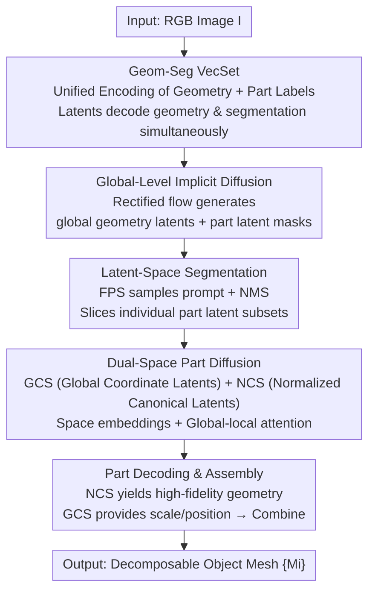

# UniPart: Part-Level 3D Generation with Unified 3D Geom-Seg Latents

**Conference**: CVPR 2026  
**Paper**: [CVF Open Access](https://openaccess.thecvf.com/content/CVPR2026/html/He_UniPart_Part-Level_3D_Generation_with_Unified_3D_Geom-Seg_Latents_CVPR_2026_paper.html)  
**Code**: Not publicly available  
**Area**: 3D Vision / 3D Generation / Diffusion Models  
**Keywords**: Part-level 3D generation, joint geometry-segmentation latent space, VecSet, dual-space diffusion, implicit segmentation

## TL;DR
UniPart proposes Geom-Seg VecSet—a representation that unifies global geometry and part segmentation into the same latent space. Based on this, a two-stage implicit diffusion framework is proposed: the first stage jointly generates global geometry and part latent segmentations, while the second stage generates high-fidelity meshes part-by-part using dual-space diffusion ("Global Coordinate Space + Normalized Canonical Space"). This approach outperforms existing methods like X-Part and OmniPart in both part geometry quality and segmentation controllability.

## Background & Motivation

**Background**: 3D content generation is shifting from generating a single monolithic mesh to producing decomposable, semantically structured part-level objects. Downstream applications like part editing, physical simulation, robotic grasping, and modular design require knowledge of the constituent parts and their spatial relationships. Mainstream native 3D generation methods (e.g., CLAY, Hunyuan3D, Trellis) yield global geometries and lack part decomposition capabilities.

**Limitations of Prior Work**: Existing part-level generation approaches trace two problematic paths. First, **implicit segmentation** (clustering and grouping latent vectors) suffers from hard-to-control segmentation granularity and limited part fidelity. Second, **generate-then-segment** pipelines generate global explicit representations (multi-view images, dense points, low-resolution voxels, or meshes) before slicing them with an external segmenter. This segmenter requires expensive training on large-scale part-annotated datasets. Moreover, the "decoding-re-encoding" loop of explicit representations degrades geometry (e.g., decoding to SDF, marching cubes to extract a mesh, then sampling points for re-encoding, incurring error at each step), which particularly degrades small and thin parts.

**Key Challenge**: There is a trade-off between the "granularity" and "robustness" of part segmentation: dense point methods offer fine granularity but are fragile, whereas low-resolution voxel methods are robust but coarse. Furthermore, balancing overall geometry quality and fine-part fidelity is difficult. Existing pipelines isolate "segmentation" and "generation" into separate stages, failing to exploit the part priors already implicit in global geometry generation.

**Key Insight**: The authors present a key observation: **part awareness naturally emerges during global geometry learning**. By visualizing the latent correlation maps of self-attention during Hunyuan3D-2.1 DiT inference (Fig. 1), they find that latent vectors (points) within the same semantic part exhibit significantly stronger correlations. This suggests that part structures are already pre-formed inside the pure global geometry generator. Thus, training an external segmenter is redundant.

**Core Idea**: Directly integrate ("weld") segmentation capabilities into the geometry latent space. This is achieved by constructing a unified geometry-segmentation latent space (Geom-Seg VecSet), enabling a single latent vector to concurrently decode geometric contributions and part labels. Furthermore, casting "segmentation" as a diffusion sampling task (instead of deterministic regression) naturally accommodates the inherent ambiguity of part decomposition.

## Method

### Overall Architecture
UniPart aims to generate a decomposable mesh $O=\{M_i\}_{i=1}^N$ given an RGB image $I$, where each part is an independent mesh and the number of parts $N$ is variable. The entire pipeline consists of "one unified representation + two-stage diffusion": first, a **Geom-Seg VAE** encodes the object's geometry and part segmentation into a unified Geom-Seg VecSet latent representation; then, a **global-level DiT** generates global geometry latents embedded with part segmentation information, decrypting part latent masks to slice individual part latent subsets; finally, a **part-level DiT** uses dual-space diffusion to generate high-resolution components conditioned on "global latents + part latents + input image", which are then assembled into the final object.

### Key Designs

**1. Geom-Seg VecSet: Packing part segmentation into the geometry latent space, allowing one latent vector to solve both geometry and part labels**

This serves as the foundational representation of the paper, addressing the pain point where segmentation relies either on external segmenters or fragile latent clustering. In the classic VecSet formulation, dense points $P\in\mathbb{R}^{C\times 6}$ (positions + normals) sampled from the mesh surface are compressed via cross-attention into a fixed-length latent set $Z\in\mathbb{R}^{L\times d}$, which a decoder $D$ reconstructs into an occupancy field/SDF. The training objective is $\mathcal{L}_\text{vecset}=\mathcal{L}_\text{recon}+\lambda_\text{kl}\cdot\mathcal{L}_\text{kl}$. UniPart modifies this pipeline by first decomposing the object mesh into $N$ parts based on geometry and semantics. The sampled point cloud includes an extra dimension for the part label, yielding $P\in\mathbb{R}^{C\times 7}$, and is encoded as $Z=E(P)$. While the geometry decoder $D_\text{geom}$ reconstructs the geometry as before, an **additional** segmentation decoder $D_\text{seg}$ is introduced. Inspired by the promptable segmentation paradigm of SAM2, $D_\text{seg}$ takes the latent set $Z$ and a latent index prompt $q$, outputting the corresponding part mask. The VAE training objective is updated with a segmentation loss term: $\mathcal{L}_\text{vecset}=\mathcal{L}_\text{recon}+\mathcal{L}_\text{seg}+\lambda_\text{kl}\cdot\mathcal{L}_\text{kl}$.

This design is effective because geometric cues naturally delineate semantic boundaries; geometric features and part segmentation patterns are intrinsically coupled. Encoding them into a shared latent space mutually enhances both tasks. Crucially, the VAE does not need to be trained from scratch. By **fine-tuning** a pre-trained geometric-only VecSet VAE, the latent space dimensions ($L$ and $d$) remain unchanged while simultaneously encoding both segmentation and geometry, with virtually no drop in reconstruction quality (as validated in Tab. 2). Consequently, part understanding leverages the pre-existing priors of the global geometry generator essentially "for free."

**2. Global-Level Implicit Diffusion + Latent-Space Segmentation: Jointly generating geometry and part masks, treating segmentation as a sampling task**

This addresses the disconnect in generate-then-segment pipelines and the need for expensive segmenter retraining. The global-level DiT employs rectified flow. During the forward pass, clean Geom-Seg latents $Z_0$ are linearly interpolated to $Z_t$ with noise $\epsilon$ using $Z_t=(1-t)Z_0+t\epsilon$. During the backward pass, the model learns the velocity field $v(Z_t,t)$ optimized under the conditional flow matching objective:

$$\mathcal{L}_\text{cfm}(\theta)=\mathbb{E}_{t,Z_0,\epsilon}\|v_\theta(Z_t,t\mid I)-(\epsilon-Z_0)\|_2^2.$$

During inference, iterative denoising starting from noise yields the global latent $\hat{Z}_0$. Given $\hat{Z}_0$, the frozen $D_\text{seg}$ takes $\hat{Z}_0$ and dense prompts $r=[1,2,\dots,L]$ to predict the part label of each latent vector. Meanwhile, a small decoder $D_\text{pos}$ reconstructs anchor point positions $p_i^\text{latent}=D_\text{pos}(\hat{z}_i)$ from the latent vectors (these specify the positions of downsampled points during encoding, used solely for localization without affecting latent space structure). Armed with the mask set and anchor positions, Farthest Point Sampling (FPS) selects prompts, and Non-Maximum Suppression (NMS) post-processes the masks to obtain the final $N$ part masks $\{m_i\}_{i=1}^N$. The global latent $\hat{Z}_0$ is then partitioned into individual part latent subsets $\{X_i\}_{i=1}^N$ accordingly.

The advantages of this approach are threefold: first, geometry generation and part segmentation are completed **jointly**, recycling the part priors implicit in the geometry generator more efficiently than a separate segmenter. Second, latent-space segmentation strikes a stable balance between the fine granularity of dense point methods and the robustness of low-resolution voxel methods. Finally, the authors emphasize that modeling segmentation as diffusion-based sampling rather than regression is conceptually more robust. While regression forces a single deterministic prediction, diffusion sampling captures the inherent multi-modality and ambiguity of part decomposition (i.e., a single object can be partitioned in multiple valid ways).

**3. Dual-Space Part Diffusion: Generating latents in both global coordinate space and normalized canonical space to prevent geometric degradation of small parts**

To address the issues of lost details in small or thin parts due to limited global resolution, as well as the geometric degradation from explicit decoding-re-encoding loops, the part-level DiT operates **directly using latent conditions**. The global latent $\hat{Z}_0$ provides global geometry and part-to-global context, while the part latent $X_i$ provides local information. This bypasses the geometric errors of a decoding-encoding cycle and ensures alignment between conditioning signals and the latent diffusion domain. The core innovation is the simultaneous generation of dual-space latents $X_i^*:=(X_i^\text{gcs},X_i^\text{ncs})\in\mathbb{R}^{L\times 2d}$ for the $i$-th part: $X_i^\text{gcs}$ lies in the **Global Coordinate Space (GCS)**, encoding the scale, position, and assembly relationship of the part relative to the entire object. Conversely, $X_i^\text{ncs}$ resides in the **Normalized Canonical Space (NCS)** $[0,1]^3$ to capture the high-fidelity geometry of the part itself at the same resolution as the global latent. This effectively "magnifies" each small part to full resolution to depict it in high detail.

To help the transformer distinguish tokens from the two spaces, a learnable space embedding $e_s\in\mathbb{R}^{1\times d}$ ($s\in\{\text{gcs},\text{ncs}\}$) is injected and broadcast-added to the corresponding latents. It utilizes a global-local attention mechanism:

$$\text{Attn}_\text{local}=\text{Softmax}\!\Big(\tfrac{\sigma_q(X_i^s)^\top\sigma_k(X_i^s)}{\sqrt{h}}\Big)\sigma_v(X_i^s),\quad \text{Attn}_\text{global}=\text{Softmax}\!\Big(\tfrac{\sigma_q(X_i^*)^\top\sigma_k(X_i^*)}{\sqrt{h}}\Big)\sigma_v(X_i^*).$$

Local attention manages intra-space interactions, whereas global attention enables both spaces to jointly attend to global and local geometries. Under this design: $X_i^\text{gcs}$ shares the coordinate system with the conditioning latents and can be viewed as a geometric completion of $X_i$, making it easier to predict. Meanwhile, $X_i^\text{gcs}$ is highly correlated with $X_i^\text{ncs}$ as they share underlying part geometry. Consequently, the coupled dual-space diffusion more efficiently learns high-quality part geometry within the canonical space. During inference, denoising two noise tensors yields $X_i^\text{gcs}$ and $X_i^\text{ncs}$, which are decoded by a shared geometric decoder into $M_i^\text{gcs}$ and $M_i^\text{ncs}$ respectively. The scale and position of the part are computed from $M_i^\text{gcs}$, and the high-fidelity $M_i^\text{ncs}$ is transformed back into global coordinates to achieve seamless assembly.

### Loss & Training
- **VAE**: $\mathcal{L}_\text{recon}+\mathcal{L}_\text{seg}+\lambda_\text{kl}\mathcal{L}_\text{kl}$, where the segmentation loss $\mathcal{L}_\text{seg}$ is adopted from SAM2. The model is fine-tuned from a pure geometry VecSet VAE instead of being trained from scratch.
- **Two-Level Diffusion**: Both stages utilize rectified flow with a conditional flow matching objective $\mathcal{L}_\text{cfm}$. The part-level DiT predicts $X_i^*$ conditioned on the global latent $Z_0$ (replaced by $\hat{Z}_0$ during inference), the part latent $X_i$ (padded to length $L$), and the input image $I$.
- **Data**: Multiple open-source datasets are integrated to build a dataset of 300k objects with part segmentations. Part labels are first extracted using mesh connectivity, manually filtered via exploded-view rendering, and post-processed with winding number remeshing to fill holes and seal surfaces, guaranteeing watertight meshes before backfilling the original surface with nearest-face label matching.
- **Implementation**: Built upon Hunyuan3D-2.1 with a CFG dropout of 0.1, optimized using AdamW (weight decay 0.01) on 8× A800 GPUs (80GB) with a batch size of 32.

## Key Experimental Results

During evaluation, all generated parts are assembled into a single mesh for global geometric fidelity assessment (since there is no reliable correspondence between individual generated parts and ground truth parts). Evaluation metrics include Chamfer Distance, F-Score, and IoU. To ensure pose-invariant comparisons, meshes are normalized to $[-1,1]$ and evaluated at 0°/90°/180°/270° rotations to report the optimal score.

### Main Results

Comparison of part-level generation quality (5 baselines, with the first three accepting a single image as input and the last two operating on meshes generated using Hunyuan3D-2.1 for a fair comparison):

| Method | CD↓ (×10²) | F1@0.1↑ (×10²) | IoU↑ (×10²) |
|------|-----------|----------------|-------------|
| HoloPart | 2.86 | 82.33 | 23.40 |
| PartPacker | 2.18 | 74.35 | 13.97 |
| PartCrafter | 1.03 | 46.08 | 5.63 |
| OmniPart | 1.99 | 85.04 | 27.94 |
| XPart | 0.82 | 88.90 | **31.95** |
| **UniPart (Ours)** | **0.72** | **92.21** | 21.99 |

UniPart consistently leads in CD and F-Score (CD 0.72 vs. X-Part 0.82, F1@0.1 92.21 vs. 88.90), demonstrating higher geometric quality and better target alignment. Although X-Part scores slightly higher on IoU (31.95 vs. 21.99), global geometric fidelity remains a clear advantage for UniPart.

### Ablation Study

Geom-Seg VAE reconstruction quality (verifying that adding segmentation information causes almost no geometric degradation, CD units in ×10⁴):

| Method | CD↓ (×10⁴) | F1@0.01↑ (×10²) |
|------|-----------|------------------|
| TRELLIS | 1.32 | 80.59 |
| Dora | 1.45 | 78.54 |
| Craftsman | 1.51 | 77.47 |
| XCubes | 1.42 | 77.57 |
| Hunyuan3D-2.1 | 1.29 | 80.85 |
| **UniPart (Ours)** | 1.30 | **80.89** |

The reconstruction quality of UniPart is almost on par with the original Hunyuan3D-2.1 VAE (CD 1.30 vs. 1.29, F1 80.89 vs. 80.85), proving that embedding segmentation data within the latent space results in virtually zero geometric quality loss.

Ablation of the three key designs in part-level DiT (qualitative results in Fig. 7; the authors did not supply a quantitative table, so the table below summarizes the qualitative findings):

| Configuration | Phenomenon | Description |
|------|------|------|
| Full model | High part geometric fidelity, seamless assembly | Complete model |
| w/o NCS Generation | Fidelity of small and thin parts decreases | Removing the Normalized Canonical Space, equivalent to generating directly in global coordinates |
| w/o Local Attn. | Decreased intra-part cohesion, discordant spatial layout | Removing local attention |
| w/o Space Embed. | Frequent confusion of part spaces, causing catastrophic assembly failures | Removing space embedding injection |

### Key Findings
- **Space embeddings are a critical "safeguard" component**: Without them, the model frequently fails to distinguish which space each part belongs to, leading to catastrophic failures during the assembly stage. This underscores the necessity of explicit space indicators to stabilize the dual-space design.
- **NCS generation targets small parts**: Generating in the Normalized Canonical Space brings the most significant fidelity gains for small, highly detailed parts, validating the motivation to "magnify small parts to full resolution for standalone depiction."
- **Local attention governs cohesion**: It promotes coherence within individual parts, yielding more harmonized spatial arrangements and better global geometric consistency.
- **Failure Cases**: For inputs with highly complex structures, joint geometry and segmentation generation can fail, yielding geometrically invalid or semantically inconsistent structures.

## Highlights & Insights
- **The "emergent part awareness" observation is highly robust**: Directly proving that part structure is already implicit in global geometry generators via the attention correlation maps of the off-the-shelf Hunyuan3D-2.1 DiT successfully substantiates the slogan of "eliminating external segmenters" with empirical evidence, serving as the most compelling point of the paper.
- **Framing segmentation as diffusion sampling rather than regression**: This is a great conceptual transfer. Since part decomposition is inherently ambiguous, regression forces a single deterministic answer. Diffusion sampling naturally models this ambiguity; this "task-to-sampling" formulation is transferable to other ambiguous structural prediction tasks.
- **Dual-space decodes "shape" from "placement"**: NCS encodes high-fidelity part geometry while GCS handles scale and position; after decoding, GCS computes the transform to project the NCS mesh back. This cleanly decouples "what it looks like" from "where it goes and how big it is," mitigating the degradation of small parts due to global resolution limits.
- **Latent conditions instead of explicit conditions**: Leveraging latents directly as conditions bypasses the lossy "decode to SDF $\rightarrow$ extract mesh $\rightarrow$ re-encode" loop. It provides domain-aligned signals while carrying implicit part-global relationship cues, presenting a natural yet often overlooked optimization in latent diffusion frameworks.

## Limitations & Future Work
- The authors acknowledge that for highly complex structural objects, joint geometry and segmentation generation can fail, yielding geometrically invalid or semantically inconsistent results.
- The preprocessing pipeline for part labels relies on mesh connectivity + manual filtering via exploded views + winding-number remeshing. Connectivity is unreliable on raw scanned data; hence, data construction costs and label noise are noteworthy concerns.
- To bypass the lack of direct correspondence between generated parts and ground-truth parts during evaluation, the parts are reassembled into a global mesh to compute CD/F-Score/IoU. Consequently, this primarily measures global geometric fidelity. Quantitative evidence regarding **part segmentation accuracy itself** is confined to the appendix (not elaborated in the main text), leaving the evaluation of part-level semantic correctness relatively thin.
- Future Directions: Introduce stronger structural priors or hierarchical part modeling to handle complex objects; explore automated part annotation workflows without manual filtering to scale up training data.

## Related Work & Insights
- **vs. X-Part / HoloPart (generate-then-segment, explicit conditioning)**: These methods segment explicit representations (meshes/points/voxels) and use them to condition part diffusion, yielding geometric degradation from the decoding-encoding loop. In contrast, UniPart performs segmentation and conditioning entirely in the latent space, avoiding geometric degradation, offering domain-aligned signals, and preserving part-to-global relationships. X-Part remains slightly superior in global geometric IoU, but UniPart leads across the board in CD and F-Score.
- **vs. PartCrafter / PartPacker (implicit segmentation, latent clustering)**: These approaches segment implicitly by grouping latent vectors, leading to difficult-to-control granularity and limited part fidelity. UniPart produces explicit part latent masks, enabling more flexible segmentation granularity and higher part-level controllability.
- **vs. SAMPart3D / P3-SAM / GeoSAM2 (external 3D segmenters)**: These methods either distill 2D SAM priors or train on large-scale part-annotated meshes to perform masked prompting. UniPart allows segmentation capabilities to directly emerge from global geometry generation without relying on an independently trained hard segmentation mask, completing generation and segmentation end-to-end.

## Rating
- **Novelty**: ⭐⭐⭐⭐⭐ The observation of "emergent part awareness" + unified geometry-segmentation latent space + dual-space part diffusion form a coherent pipeline. The perspective is highly novel and self-consistent.
- **Experimental Thoroughness**: ⭐⭐⭐⭐ Comparing with 5 baselines with two quantitative tables and ablation studies is solid, though the quantitative evaluation of part segmentation itself is relegated to the appendix, and main-text ablations are mostly qualitative.
- **Writing Quality**: ⭐⭐⭐⭐⭐ Clear derivation of motivation, strong empirical support from Fig. 1, and a well-structured three-part methodology.
- **Value**: ⭐⭐⭐⭐⭐ Eliminating external segmenters to enable end-to-end latent-space part generation offers a tangible contribution toward editable 3D content creation and part-aware generative modeling.

<!-- RELATED:START -->

## Related Papers

- [\[ICCV 2025\] From One to More: Contextual Part Latents for 3D Generation](../../ICCV2025/3d_vision/from_one_to_more_contextual_part_latents_for_3d_generation.md)
- [\[CVPR 2026\] Native and Compact Structured Latents for 3D Generation](native_and_compact_structured_latents_for_3d_generation.md)
- [\[CVPR 2026\] Grounded Latents for Entity-Centric 4D Scene Generation](grounded_latents_for_entity-centric_4d_scene_generation.md)
- [\[CVPR 2026\] PartDiffuser: Part-wise 3D Mesh Generation via Discrete Diffusion](partdiffuser_part-wise_3d_mesh_generation_via_discrete_diffusion.md)
- [\[CVPR 2026\] Learning Hierarchical Hyperbolic Mixture Model for Part-aware 3D Generation](learning_hierarchical_hyperbolic_mixture_model_for_part-aware_3d_generation.md)

<!-- RELATED:END -->
