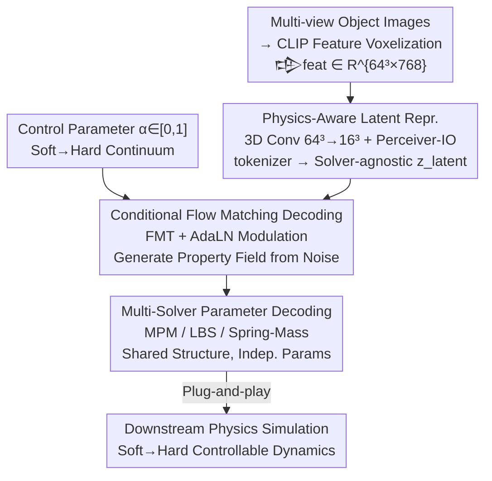

# UniPixie: Unified and Probabilistic 3D Physics Learning via Flow Matching

**Conference**: CVPR 2026  
**arXiv**: [2606.05399](https://arxiv.org/abs/2606.05399)  
**Code**: https://unipixie.github.io/ (Project Homepage)  
**Area**: 3D Vision / Physical Property Prediction / Flow Matching Generation  
**Keywords**: Physical Property Prediction, Flow Matching, Controllable Generation, Multi-Solver, Soft-to-Hard Continuum

## TL;DR
UniPixie reformulates "inferring physical properties from vision" from deterministic point estimation to controllable probabilistic distribution modeling. Using a shared Perceiver-IO encoder and a conditional Flow Matching decoder, it generates physical parameters along a "soft-to-hard" continuum from a single visual input. It is the first unified architecture to simultaneously produce plug-and-play parameters for MPM, LBS, and Spring-Mass solvers, reducing Young's modulus error by over 50% compared to the strongest deterministic baseline.

## Background & Motivation

**Background**: Technologies like 3D Gaussian Splatting can reconstruct realistic static digital twins from images, but these models lack knowledge of "how objects move and deform." This led to the "Physics-from-Pixels" task—directly inferring material properties like Young's modulus and density from vision. Existing approaches fall into two categories: test-time optimization, which backpropagates through differentiable simulators per scene to fit parameters; and feed-forward prediction, such represented by PIXIE, which uses a U-Net trained on large-scale data to provide material properties in a single forward pass.

**Limitations of Prior Work**: Test-time optimization takes hours per object and fails to generalize to new ones. Feed-forward methods (like PIXIE), though fast, are **inherently deterministic—spitting out only a single point estimate per object**. More critically, all existing methods are deeply coupled with a single simulation paradigm (mostly MPM), making predicted parameters unusable if switched to a different solver, resulting in poor portability.

**Key Challenge**: Physical reality is **ambiguous**—an identical-looking object could correspond to a range of plausible stiffnesses (e.g., a teddy bear can be soft or firm). Deterministic point estimation fundamentally fails to capture this ambiguity; forcing a regression to a single point discards the critical fact that "real physics is a distribution."

**Goal**: (1) Reformulate physics prediction to learn a **controllable physical continuum** rather than regressing a single point; (2) Use a unified architecture to serve multiple heterogeneous physical solvers simultaneously.

**Key Insight**: The authors identify the primary axis of physical ambiguity as the continuous interval from the "softest state" to the "hardest state," controlled by a scalar parameter $\alpha\in[0,1]$. This task is assigned to a generative model (Flow Matching), as Flow Matching is naturally adept at modeling mappings from "noise to a distribution."

**Core Idea**: Use Conditional Flow Matching (CFM) to model the "soft → hard" physical continuum in a shared latent space, then decode this into parameters for MPM, LBS, and Spring-Mass solvers through different decoding heads—replacing "point estimation regression" with "controllable distribution generation + multi-solver unified decoding."

## Method

### Overall Architecture
UniPixie is a feed-forward framework: the input consists of multi-view CLIP features of an object, and the output is simulation parameters ready for physical engines. The pipeline consists of three stages: "Unified Encoder → Conditional Flow Matching Decoder → Multi-Solver Decoding Heads."

Specifically: Dense CLIP features from multi-view images are lifted to 3D and voxelized to obtain a sparse feature grid $\mathcal{G}_{\text{feat}}\in\mathbb{R}^{N\times N\times N\times D}$ ($N=64,D=768$). A unified Grid Encoder compresses this into a set of solver-agnostic latent tokens $\boldsymbol{z}_{\text{latent}}\in\mathbb{R}^{L\times C}$. This latent representation is key to the framework's portability as it is not tailored to any specific solver. Subsequently, a user-provided control parameter $\alpha$ (0 = softest, 1 = hardest) and $\boldsymbol{z}_{\text{latent}}$ are fed into a conditional Flow Matching Transformer (FMT) decoder to generate the corresponding physical property field. Finally, three dedicated decoding heads—sharing the same network structure but having independent parameters—decode the same latent representation into the parameter formats required by MPM, LBS, and Spring-Mass engines. Training labels come from the newly constructed PixieMultiVerse dataset (labeling property ranges $[\boldsymbol{y}_{\min},\boldsymbol{y}_{\max}]$ instead of single values), with targets for any intermediate $\alpha$ obtained via linear interpolation.

### Key Designs

**1. Physics-Aware Latent Representation: Learning Solver-Agnostic "Physical Geometry" via a Unified Encoder**

To allow one representation to serve three heterogeneous solvers, the encoder must learn physical geometric structures decoupled from specific simulation paradigms. The Grid Encoder $\mathcal{E}$ in UniPixie draws from Perceiver-IO and operates in two steps: first, a 3D convolution backbone gradually downsamples the input grid from $64^3$ to $16^3$, reducing subsequent attention overhead while forcing the network to extract higher-level geometric structures. Then, $N_{\text{blocks}}$ cascaded blocks update $L$ learnable latent queries—each block performs cross-attention between latent queries and convolutional features, followed by two self-attention layers for refinement, resulting in $\boldsymbol{z}_{\text{latent}}=\mathcal{E}(\mathcal{G}_{\text{feat}})\in\mathbb{R}^{L\times C}$. These tokens represent a unified, solver-agnostic latent space, which enables the portability of "one encoding → multiple solvers."

**2. Conditional Flow Matching Generation: Controlling the "Soft → Hard" Continuum with a Scalar α**

To upgrade deterministic point estimation to a controllable distribution, the authors model physical property generation as a Conditional Flow Matching (CFM) problem. During training, the target property is synthesized via linear interpolation (LERP) between soft and hard endpoints:

$$\boldsymbol{y}_{\text{target}}=(1-\alpha)\boldsymbol{y}_{\min}+\alpha\boldsymbol{y}_{\max}$$

Treating $\boldsymbol{y}_{\text{target}}$ as the flow matching endpoint $\boldsymbol{x}_1$, the model learns a vector field $\boldsymbol{v}_\theta$ to push Gaussian noise $\boldsymbol{x}_0\sim\mathcal{N}(0,\boldsymbol{I})$ along a straight line to the target. The loss is defined as $\mathcal{L}_{\text{CFM}}=\mathbb{E}_{t,\boldsymbol{x}_0,\boldsymbol{y}_{\text{target}},\boldsymbol{c}}\lVert\boldsymbol{v}_\theta(\boldsymbol{x}_t,t,\boldsymbol{c})-(\boldsymbol{y}_{\text{target}}-\boldsymbol{x}_0)\rVert_2^2$, where $\boldsymbol{x}_t=(1-t)\boldsymbol{x}_0+t\boldsymbol{y}_{\text{target}}$. Crucially, the control parameter $\alpha$ is encoded into the conditional signal $\boldsymbol{c}$ and modulates the Transformer layers via Adaptive Layer Normalization (AdaLN). Thus, at inference time, simply smoothly interpolating $\alpha$ allows for the continuous generation of a valid material field ranging from soft to hard, rather than being fixed to a single point. Compared to PIXIE’s U-Net regression, this generative formulation both captures physical ambiguity and turns "controllability" into an intuitive knob.

**3. Multi-Solver Unified Decoding: One Latent Representation, Three Heads for Heterogeneous Engines**

Existing methods are bound to a single solver (usually MPM), which is the root cause of poor portability. UniPixie conditions three decoding heads on the same $\boldsymbol{z}_{\text{latent}}$, but adapts each to the parameter structure of its respective solver:
- **MPM**: The FMT decoder $\mathcal{D}_{\text{MPM}}:(\boldsymbol{z}_{\text{latent}},\alpha)\to\{(E_i,\nu_i,\rho_i,l_i)\}_{i=1}^K$ generates spatially varying material fields (continuous values for Young's modulus $E$, Poisson's ratio $\nu$, density $\rho$, and discrete material category $l$) for all $K$ foreground voxels.
- **LBS**: Uses a dual-decoder design. Continuous material properties $(E,\nu)$ are still generated as voxel fields by the standard FMT decoder. However, deformation models require different parameterization—borrowing from Vid2Sim, a HyperNetwork regresses object-specific LBS parameters $\theta_{\text{LBS}}$ (skinning weight network parameters) directly from global latent tokens. Note that the deformation structure remains static; the soft-to-hard continuum is driven entirely by the $\alpha$-modulated material field.
- **Spring-Mass**: The decoder $\mathcal{D}_{\text{Spring}}:(\boldsymbol{z}_{\text{latent}},\alpha)\to\boldsymbol{m}_{\text{spring}}=(\boldsymbol{k},\eta)$ outputs stiffness vectors $\boldsymbol{k}\in\mathbb{R}^{N_a}$ for $N_a$ anchor points and a global softness scalar $\eta$ (following the simplified design of Spring-Gaus).

This is the first unified architecture capable of producing consistent, plug-and-play parameters for fundamentally different downstream physics backends, turning "retraining for a new solver" into "switching a decoding head."

### Loss & Training
The core training objective is the conditional Flow Matching loss $\mathcal{L}_{\text{CFM}}$. Target properties are synthesized by LERP-ing soft and hard endpoints, with $\alpha$ randomly sampled during training. Data relies on PixieMultiVerse: For the MPM side, an Actor-Critic VLM + manual verification is used to label property ranges $[\boldsymbol{y}_{\min}, \boldsymbol{y}_{\max}]$ (GPT-4o acts as the Actor proposing ranges and cross-part constraints like $E_{\text{trunk}}\gg E_{\text{leaf}}$; Gemini-2.5-Flash acts as the Critic selecting the most geometrically consistent query, followed by manual boundary simulation verification, with an 8.9% rejection rate and 38.3% correction rate). For LBS/Spring-Mass, labels are not directly annotated; instead, ground-truth MPM simulation videos are generated at the soft ($\alpha=0$) and hard ($\alpha=1$) endpoints, which are then used by slow test-time methods (Vid2Sim / Spring-Gaus) to fit solver parameters. Intermediate $\alpha$ labels are obtained via interpolation, ensuring consistent dynamic behavior across the three solvers for the same state $\alpha$.

## Key Experimental Results

### Main Results
PixieMultiVerse contains 1,410 high-quality assets re-annotated from PIXIEVERSE. The MPM test set includes 41 objects; LBS/Spring-Mass are evaluated on a subset of 10 elastic objects. Continuous properties use log-space MSE ($\log E,\log\rho$) and linear-space $\nu$ MSE, while material classification uses Accuracy. Simulation quality is measured by PSNR/SSIM/LPIPS.

**Property Regression Comparison vs. Deterministic Baselines (Generative models averaged over $\alpha\in\{0,0.5,1\}$)**:

| Method | $\log E$ MSE ↓ | $\log\rho$ MSE ↓ | $\nu$ MSE ↓ | Material Acc. ↑ | Runtime ↓ |
|------|------|------|------|------|------|
| NeRF2Physics | 0.5236 | 0.2958 | 0.3430 | 63.4% | 119.5s |
| PUGS* | 1.0591 | 0.2335 | — | 36.3% | 36.3s |
| PIXIE* (Strongest Deterministic) | 0.0205 | 0.0244 | 0.0557 | **97.3%** | **0.137s** |
| 3D U-Net (Ablation) | 0.0410 | 0.1464 | 0.4604 | 96.3% | 10.77s |
| **Ours** | **0.0091** | **0.0194** | **0.0240** | 93.9% | 12.16s* |

UniPixie's $\log E$ MSE of 0.0091 is more than twice as accurate as the previous best, PIXIE (0.0205) (>50% error reduction); $\rho$ and $\nu$ are also optimal. The trade-off is slightly lower discrete material classification compared to PIXIE (93.9% vs 97.3%). The runtime of 12.16s reflects MPM single-head inference; full generation for all three solvers takes ~21.6s.

**Video Reconstruction Fidelity across Solvers (PSNR, Selected)**:

| Solver / Method | $\alpha{=}0$ Soft | $\alpha{=}0.5$ Mid | $\alpha{=}1$ Hard | Runtime ↓ |
|------|------|------|------|------|
| MPM: PIXIE | 23.16 | 30.17 | 26.04 | 0.14s |
| MPM: **Ours** | **29.25** | **30.43** | **32.87** | 21.6s |
| LBS: Vid2Sim(full) | 28.30 | **36.94** | 40.13 | 521s |
| LBS: **Ours** | **33.83** | 36.81 | **41.63** | **21.6s** |
| Spring: Spring-Gaus(tuned) | 30.53 | 37.60 | 36.57 | 4375s |
| Spring: **Ours** | **33.88** | **38.79** | **38.51** | **21.6s** |

A single unified model generally matches or exceeds dedicated models across three solvers while being two to three orders of magnitude faster than test-time optimization (Vid2Sim 521s, Spring-Gaus 4375s).

### Ablation Study

| Configuration | $\log E$ MSE ↓ | Note |
|------|------|------|
| Ours (Flow Matching) | 0.0091 | Full generative model |
| 3D U-Net (Backbone change) | 0.0410 | Generative but using 3D Diffusion U-Net; error ~4.5x higher |
| PIXIE (Deterministic) | 0.0205 | Single-point regression, no controllable distribution |

### Key Findings
- **Learning distributions is more accurate than point learning**: UniPixie’s point prediction (averaged over $\alpha$) is twice as accurate as PIXIE, which specifically optimizes for single points. The authors suggest that learning a continuous distribution forces a more robust and accurate underlying representation.
- **Generative backbone choice matters**: Switching to a 3D Diffusion U-Net increased the $\log E$ MSE from 0.0091 to 0.0410, showing that the combination of Flow Matching and Transformer is the effective recipe, rather than "any generative model."
- **α learns meaningful physical mapping**: Predicted distributions for $\alpha=0$ and $\alpha=1$ are clearly separable and aligned with GT soft-hard boundaries. A rubber duck deforms upon impact at $\alpha=0$ and behaves nearly like a rigid body at $\alpha=1$; the continuum translates directly into controllable dynamics.
- **Unification does not sacrifice precision**: A single unified model is more stable than dedicated baselines in difficult extreme stiffness regions (soft and hard ends) for LBS and Spring solvers.

## Highlights & Insights
- **Explicitly modeling physical ambiguity as a controllable knob**: While previous work pursued a "single correct answer," this paper acknowledges that "one appearance corresponds to a range of plausible stiffnesses" as the physical reality. Using a single scalar $\alpha$ to turn this ambiguity into a user-controllable continuum is an elegant perspective shift that leverages the strengths of generative models.
- **Solver-Agnostic Latent Representation + Multi-Decoding Heads**: Decoupling perception from specific simulation paradigms into "shared encoding + pluggable decoding heads" provides a strategy transferable to any "one perception, multiple downstream engines" scenario (e.g., one scene representation for different renderers/simulators).
- **Practical cross-solver labeling trick**: The LBS/Spring labels are not manually annotated but distilled from MPM GT videos at both ends via slow methods, then interpolated. Reducing "expensive multi-solver annotation" to "endpoint annotation + interpolation" is a reusable data engineering trick.

## Limitations & Future Work
- **Slight dip in discrete material classification**: The material category accuracy (93.9%) is lower than PIXIE’s (97.3%), as the generative formulation handles discrete labels less cleanly than deterministic regression.
- **Only models the soft-hard axis**: Physical ambiguity is simplified to a 1D $\alpha$ continuum. The authors acknowledge the need to explore multi-dimensional material manifolds, as real-world physical ambiguity involves more than just stiffness.
- **Occluded regions remain unsolved**: Property prediction relies on visible visual features; estimating properties in occluded areas is listed as an open problem.
- **Full inference for three solvers takes ~21.6s**: While orders of magnitude faster than test-time optimization, it is still two orders of magnitude slower than PIXIE (0.14s), remaining far from real-time interaction.

## Related Work & Insights
- **vs. PIXIE (Prior Work)**: PIXIE uses a U-Net to regress deterministic properties from distilled CLIP features and serves only MPM. This work switches to a Flow Matching Transformer to generate a continuum with a unified multi-solver architecture, reducing $\log E$ error by over half at the cost of slightly lower material classification. The core difference is "point estimate vs. controllable distribution" and "single vs. multi-solver."
- **vs. Test-time Optimization (Vid2Sim / Spring-Gaus)**: These methods backpropagate through differentiable simulators per scene, yielding high quality but taking hundreds to thousands of seconds and failing to generalize. UniPixie produces all three solver parameters in ~21s and uses those slow methods as GT sources for distillation.
- **vs. VLM Zero-shot (NeRF2Physics / PUGS)**: These query VLMs for coarse part-level properties. They are fast but noisy and low-resolution. Ours produces fine-grained voxel-level material fields with much higher accuracy (0.0091 vs. 0.52/1.06 $\log E$ MSE).
- **vs. PhysX-3D and 3D Physics Generation**: Related methods learn joint distributions of shape and physics to generate new assets. Ours does not create new assets but augments existing 3D objects with a controllable physical continuum. It is the first CFM framework to generate continuous voxel material fields for static 3D objects.

## Rating
- Novelty: ⭐⭐⭐⭐⭐ Reformulating physics prediction to a controllable distribution + first unified multi-solver architecture are both highly novel.
- Experimental Thoroughness: ⭐⭐⭐⭐ Three solvers, multiple baselines, and complete ablations, though the test set is somewhat small (41/10 objects).
- Writing Quality: ⭐⭐⭐⭐ Clear motivation, well-explained formulas, and multi-solver decoding with complete charts.
- Value: ⭐⭐⭐⭐⭐ The solver-agnostic representation + controllable physics continuum paradigm has high transfer value for the "perception-to-simulation" pipeline.

<!-- RELATED:START -->

## Related Papers

- [\[CVPR 2026\] Optical Flow Matching: Reframing Optical Flow as Continuous Transport Dynamics](optical_flow_matching_reframing_optical_flow_as_continuous_transport_dynamics.md)
- [\[CVPR 2026\] ARES: Unifying Asymmetric RGB-Event Stereo for Probabilistic Scene Flow Estimation](ares_unifying_asymmetric_rgb-event_stereo_for_probabilistic_scene_flow_estimatio.md)
- [\[CVPR 2026\] GeodesicNVS: Probability Density Geodesic Flow Matching for Novel View Synthesis](geodesicnvs_probability_density_geodesic_flow_matching_for_novel_view_synthesis.md)
- [\[ICML 2026\] PLAID: A Unified Data Model for Machine Learning on Heterogeneous Physics Simulations](../../ICML2026/3d_vision/plaid_a_unified_data_model_for_machine_learning_on_heterogeneous_physics_simulat.md)
- [\[CVPR 2025\] Flow-NeRF: Joint Learning of Geometry, Poses, and Dense Flow within Unified Neural Representations](../../CVPR2025/3d_vision/flow-nerf_joint_learning_of_geometry_poses_and_dense_flow_within_unified_neural_.md)

<!-- RELATED:END -->
