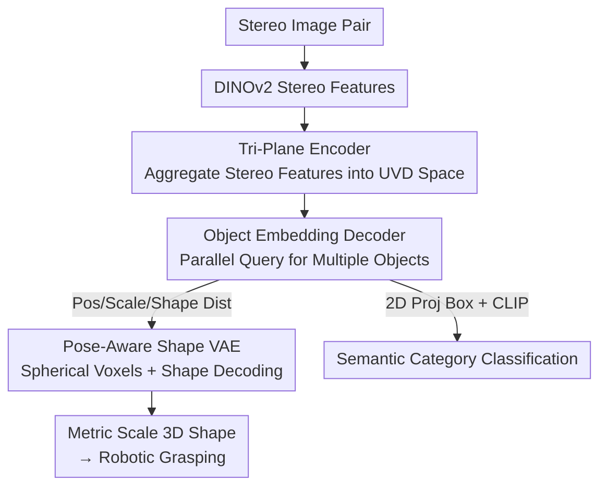

# UniPR: Unified Object-level Real-to-Sim Perception and Reconstruction from a Single Stereo Pair

**Conference**: CVPR 2026  
**Paper**: [CVF Open Access](https://openaccess.thecvf.com/content/CVPR2026/html/Zhang_UniPR_Unified_Object-level_Real-to-Sim_Perception_and_Reconstruction_from_a_Single_CVPR_2026_paper.html)  
**Area**: 3D Vision / Object-level real-to-sim / 6D Pose and Shape Reconstruction  
**Keywords**: Stereo Vision, real-to-sim, End-to-end Reconstruction, Pose-Aware Shape Representation, Robotic Grasping

## TL;DR
UniPR uses a single stereo image pair and a single forward pass to simultaneously detect and reconstruct all objects in a scene with true physical scale. It eliminates scale ambiguity via stereo geometric constraints and abandons "per-category pre-defined canonical spaces" through Pose-Aware Shape Representation (PASR), achieving 100× faster scene reconstruction and approximately 3× higher shape proportion accuracy compared to image-to-3D models.

## Background & Motivation
**Background**: Transferring real-world objects into simulators (object-level real-to-sim transfer) is crucial for robotic manipulation. It requires both visual fidelity and physically accurate geometric positioning for reliable grasping. Current mainstream approaches employ a modular pipeline: 2D detection → segmentation → shape reconstruction → pose estimation, processing objects serially.

**Limitations of Prior Work**: This pipeline suffers from three primary issues. First, **error accumulation**: each stage only receives local information (bbox, mask) cropped by the previous stage, losing global context and magnifying errors, especially in occluded scenes. Second, **low efficiency**: objects must be processed one by one; recent large-scale image-to-3D models (HunYuan3D, Trellis) can only handle a single object at a time, requiring multiple passes for a full scene. Third, **scale distortion**: monocular image-to-3D models lack metric information, leading to inherent **scale ambiguity** where generated meshes often have incorrect proportions, causing robotic grasping failures.

**Key Challenge**: Modularization forcibly splits "perception" and "reconstruction" into non-communicating stages, refining locally while losing the global view. Furthermore, monocular inputs cannot recover metric scale. Achieving physical accuracy requires both unified information flow and calibratable geometric constraints.

**Goal**: (1) Eliminate intermediate modules (detection/segmentation/reconstruction/pose estimation) for true end-to-end processing; (2) Enable parallel processing of all objects in a scene in a single forward pass; (3) Reconstruct world-aligned shapes with true physical proportions.

**Key Insight**: The authors leverage two components: using **stereo (binocular) vision** to provide the geometric constraints needed to eliminate scale ambiguity (triangulation naturally provides metric scale and is more reliable than depth sensors for transparent objects); and using **Pose-Aware Shape Representation** to fuse "pose estimation" and "shape reconstruction," bypassing the "pre-defined canonical spaces" of category-level methods.

**Core Idea**: Encode object pose and geometry **directly in the observation space** (rather than normalizing to a category-canonical frame and then aligning). A transformer decoder with a set of object queries is used to end-to-end predict the position, scale, and "already posed" 3D shape of every object in parallel from stereo images.

## Method

### Overall Architecture
UniPR is a single-forward network: it inputs a stereo image pair and outputs semantic labels, 3D positions $(x,y,z)$, physical scales $s$, and posed 3D shapes (occupancy representation, convertible to point clouds/meshes in camera coordinates) for every object. No serial sub-modules exist.

The pipeline consists of four steps: (1) Extract 2D features from left/right images using DINOv2; (2) Aggregate stereo features into a **Tri-Plane View (TPV)** global representation via stereo cross-attention, establishing a UVD space as a unified frame; (3) A set of object queries interacts with TPV features in a transformer decoder to "claim" objects and produce object embeddings; (4) Lightweight heads decode position, scale, and shape distributions, which are fed into a **pre-trained PASR shape decoder** to compute occupancy. The shape decoder originates from a separately pre-trained **Pose-Aware Shape VAE**, which is frozen during main pipeline training.

### Key Designs

**1. Pose-Aware Shape Representation (PASR): Fusing Pose and Shape to Abandon Canonical Spaces**

Category-level methods (e.g., NOCS) define a "canonical space" for each category, requiring objects to be normalized before predicting relative pose. Defining canonical orientations is difficult, and intra-category variation is high, limiting such methods to fewer than 6 categories. PASR **jointly encodes pose and geometry in the observation space**—the shape itself is "already oriented as it appears in the world." This transforms pose estimation and shape reconstruction from decoupled tasks into a tightly coupled prediction. This removes dependence on pre-defined canonical spaces (scaling to 192 categories and 6300+ objects) and eliminates rotation ambiguity for geometrically similar objects.

**2. Pose-Aware Shape VAE + Spherical Voxel Space: Preventing Scale Drift in Rotated Objects**

PASR handles "rotated objects," and traditional cubic voxel spaces have a hidden risk: when an object is normalized into a unit cube, rotation might cause it to exceed boundaries. Re-normalization causes "perceived scale to change with orientation," confusing training. The authors adopt a **spherical voxel space** using unit ball normalization—ensuring objects stay within the boundary regardless of rotation. This eliminates rotation-induced scale ambiguity. For the VAE: given surface point cloud $P_{\text{surface}} \in \mathbb{R}^{N\times3}$, surface embeddings are generated via positional encoding and compressed into an object-level embedding $z_{\text{object}} = \text{CrossAttn}(z_{\text{object}}, z_{\text{surface}})$; MLPs predict Gaussian $\mu, \sigma^2$ with KL regularization. During decoding, $z_{\text{sampled}} = \mu + \sigma \cdot \epsilon$ is sampled, and query points are projected into occupancy:

$$\mathcal{O}(x,y,z) = \phi(z_{\text{query}}(x,y,z))$$

**3. Tri-Plane View Encoder: Lifting Stereo Info into a UVD Global Coordinate System**

To reconstruct a scene in parallel, a global representation must hold both "spatial position" and "geometry." The authors initialize three orthogonal plane features $T = [T_{UV}, T_{UD}, T_{VD}]$, where $U,V$ are image dimensions and $D$ is depth, forming a **UVD space**. Each voxel $(u,v,d)$ is back-projected to both images, and **stereo cross-attention** aggregates features $F_l, F_r$ into the TPV: $T(u,v,d) = \mathcal{F}(T(u,v,d), F_l(u_l,v_l), F_r(u_r,v_r))$. This "stereo + back-projection" step introduces geometric constraints, resolving the scale ambiguity of monocular methods.

**4. Object Query Decoder + CLIP Open-Vocabulary: Parallel Multi-Object Output**

Using a DETR-like structure: $L$ layers of decoders allow object queries to interact via self-attention and absorb stereo features from the TPV via cross-attention. Each query encodes high-level object information, decoded by heads: 3D MLP for position/scale and shape MLP for distribution $(\mu, \sigma^2)$. Crucialally, the **classification head is removed**. The authors found it dragged down detection performance for hard categories. Instead, they use CLIP: the 3D position is projected to a 2D box to match pre-set categories, supporting open-vocabulary without interfering with detection.

### Loss & Training
Two-stage strategy. VAE pre-training: occupancy uses binary cross-entropy $\mathcal{L}_{\text{recon}} = \text{BCE}(\hat{\mathcal{O}}(X), \mathcal{O}(X))$ plus KL regularization. Main pipeline: Hungarian algorithm for one-to-one matching between GT and predictions. Position and scale use L1; shape distribution uses KL distance: $\mathcal{L}_{\text{detection}} = \mathcal{L}_{\text{position}} + \mathcal{L}_{\text{scale}} + \lambda_{\text{shape}} \cdot \mathcal{L}_{\text{shape}}$.

## Key Experimental Results

### Main Results
The **LVS6D** dataset was constructed (OmniObject3D + Google Scanned Objects, 192 categories, 6300+ objects, ~0.4M training pairs). Subsets are Easy/Medium/Hard.

In shape reconstruction (even when baselines are provided with GT 2D boxes/masks/poses), UniPR leads significantly. It processes a 5-object scene in 0.63s, whereas generative baselines take hundreds of seconds:

| Method | Inputs | CD ↓ | F-Score ↑ | SPE ↓ | Single Obj Time (s) | Scene Time (s) |
|------|----------|------|-----------|-------|---------------|---------------|
| Trellis | GT Box/Mask/Pose | 0.1096 | 0.334 | 0.475 | 8.62 | 43.08 |
| HunYuan2.1 | GT Box/Mask/Pose | 0.0644 | 0.553 | 0.320 | 74.16 | 370.78 |
| **UniPR (Ours)** | Stereo Only | **0.0083** | **0.883** | **0.109** | **0.63** | **0.63** |

*Note: SPE (Shape Proportion Error) measures relative error in width/height/depth; CD is Chamfer Distance.*

In the joint detection+reconstruction task on LVS6D:

| Subset | Method | AP ↑ | APE ↓ | ACD ↓ |
|------|------|------|-------|-------|
| Easy | Coders | 0.102 | 2.200 | 2.348 |
| Easy | **Ours** | **0.702** | **0.885** | **0.413** |
| Hard | Coders | 0.070 | 2.230 | 10.146 |
| Hard | Coders + PASR | 0.483 | 1.711 | 1.816 |
| Hard | **Ours** | **0.752** | **1.248** | **1.224** |

Injecting PASR into Coders (Hard ACD drops from 10.146 to 1.816) proves the gain comes primarily from the PASR representation.

### Ablation Study

| Configuration | Hard AP ↑ | Hard ACD ↓ | Description |
|------|----------------|-----------------|------|
| Full UniPR | 0.752 | 1.224 | — |
| w/o PASR (Canonical) | 0.196 | 12.363 | ACD rises ~10×; canonical fails on diverse categories |
| Monocular (Left Only) | 0.270 | 2.444 | Lack of depth significantly degrades geometry |
| w/o Spherical Voxel | 0.677 | 1.310 | Rotation introduces scale ambiguity |

### Key Findings
- **PASR is the core contributor**: Removing it causes Hard ACD to jump from 1.224 to 12.363. Porting it to other models yields immediate gains, verifying its independent value.
- **Stereo is indispensable**: Monocular performance drops sharply, confirming that stereo geometric constraints are the primary solution to scale ambiguity.
- **Spherical voxels offer stability**: This small design choice provides a +0.075 AP gain on the Hard subset by ensuring rotation consistency.
- **Advantage grows with complexity**: Unlike category-level methods that fail as diversity increases, UniPR maintains relative performance gaps.

## Highlights & Insights
- **Encoding pose and shape in observation space**: Removing the "canonical space" shackle enables scaling from <6 to 192 categories and eliminates rotation ambiguity for similar geometries.
- **Spherical vs. Cubic Voxels**: A precise engineering fix for the invisible bug where normalization causes scale to drift with orientation.
- **CLIP over Classification Heads**: Decoding 3D positions and using 2D projections for CLIP matching is a counter-intuitive but effective way to decouple detection from semantic confusion.
- **DETR-style queries for real-to-sim**: Using unified queries for parallel detection and reconstruction is the structural source of the 100× speedup.

## Limitations & Future Work
- **Stereo reliance**: Performance drops in monocular setups. Future work could integrate large-scale depth priors for monocular PASR.
- **Synthetic data bias**: LVS6D is rendered. While real-world grasping was tested, cross-domain evaluation in messy industrial environments remains limited.
- **Occupancy resolution**: The representation might struggle with thin-walled or intricate structures.
- **Improvement directions**: Merging stereo constraints with monocular depth priors for an elastic "stereo-if-available" solution.

## Related Work & Insights
- **vs. Instance-level (Any6D)**: These depend on CAD priors or multi-view NeRF and process objects serially. UniPR generalizes to unseen objects in parallel without priors.
- **vs. Category-level (NOCS)**: Limited to few categories due to canonical space definitions. UniPR uses PASR to scale to hundreds of categories.
- **vs. Image-to-3D (HunYuan3D)**: These have high visual fidelity but suffer from scale distortion and require upstream masks. UniPR provides much lower SPE and is 100× faster.
- **vs. Coders**: The most direct baseline. UniPR outperforms it across the board, and the PASR module is proven to be the key differentiator.

## Rating
- Novelty: ⭐⭐⭐⭐⭐ First end-to-end object-level real-to-sim framework; PASR + spherical voxels + stereo constraints effectively address modular pipeline flaws.
- Experimental Thoroughness: ⭐⭐⭐⭐ 192 categories + large dataset + real robot tests. Ablations are migratory and verifiable. Some lack of deep evaluation in messy real-world clutter.
- Writing Quality: ⭐⭐⭐⭐ Clear logic chain (Motivation-Conflict-Method). Visuals effectively explain PASR vs. Canonical space.
- Value: ⭐⭐⭐⭐⭐ Addresses real-world robotic pain points (scale + efficiency). 100× speedup + 3× accuracy + real-world validation.

<!-- RELATED:START -->

## Related Papers

- [\[CVPR 2026\] SPARK: Sim-ready Part-level Articulated Reconstruction with VLM Knowledge](spark_sim-ready_part-level_articulated_reconstruction_with_vlm_knowledge.md)
- [\[CVPR 2026\] H²A²: Homogeneity-Aware and Heterogeneity-Aware Feature Perception for Unified Indoor 3D Object Detection](h2a2_homogeneity-aware_and_heterogeneity-aware_feature_perception_for_unified_in.md)
- [\[CVPR 2026\] Generalizable Structure-Aware Keypoint Correspondence for Category-Unified 3D Single Object Tracking](generalizable_structure-aware_keypoint_correspondence_for_category-unified_3d_si.md)
- [\[CVPR 2026\] SE(3)-Equivariance with Geometric and Topological Guidance for Category-Level Object Pose Estimation](se3-equivariance_with_geometric_and_topological_guidance_for_category-level_obje.md)
- [\[CVPR 2026\] PE3R: Perception-Efficient 3D Reconstruction](pe3r_perception-efficient_3d_reconstruction.md)

<!-- RELATED:END -->
