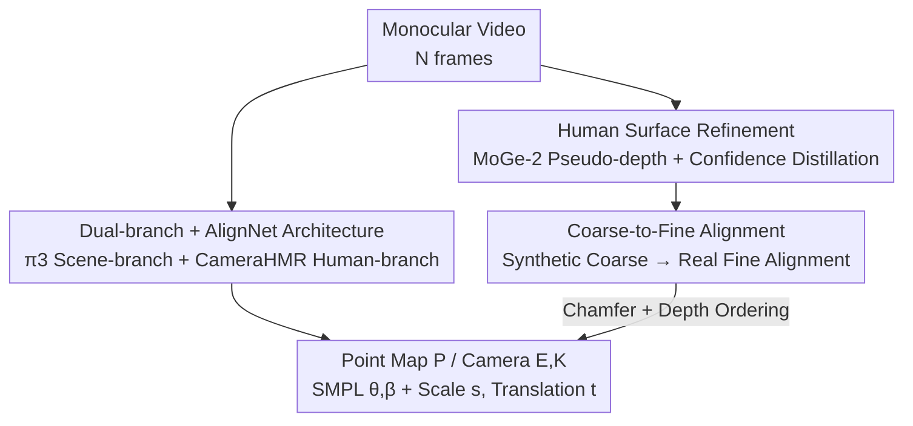

# UniSH: Unifying Scene and Human Reconstruction in a Feed-Forward Pass

**Conference**: CVPR 2026  
**Paper**: [CVF Open Access](https://openaccess.thecvf.com/content/CVPR2026/html/Li_UniSH_Unifying_Scene_and_Human_Reconstruction_in_a_Feed-Forward_Pass_CVPR_2026_paper.html)  
**Code**: Project Page https://murphylmf.github.io/UniSH/ (Code TBD)  
**Area**: 3D Vision / Human Reconstruction / Feed-forward Reconstruction  
**Keywords**: Joint Scene-Human Reconstruction, Feed-forward, SMPL, Metric Scale Alignment, sim-to-real  

## TL;DR
UniSH employs a feed-forward network to simultaneously output scene geometry, camera parameters, and metric-scale SMPL humans from monocular videos. By utilizing "expert depth model distillation + coarse-to-fine human-scene alignment," it transfers priors trained on synthetic data to real-world in-the-wild videos, achieving joint scene and human reconstruction in a single forward pass.

## Background & Motivation

**Background**: 3D scene reconstruction (the "3R" feed-forward line: DUSt3R/VGGT/π3) and Human Mesh Recovery (HMR, e.g., CameraHMR) have long operated independently. The former focuses on static scene geometry and cameras, while the latter focuses on human pose and shape. Neither addresses the absolute metric position of the human within the scene.

**Limitations of Prior Work**: Current methods for joint 4D "human-in-scene" reconstruction either follow optimization-based routes (HSfM, JOSH, SyncHMR), which are too slow for practical use due to per-scene optimization, or use feed-forward approaches like JOSH3R, which attaches an HMR head to a scene backbone but suffers from drift and global inconsistency due to two-frame inference and requires expensive 3D annotations.

**Key Challenge**: The primary bottleneck is **data**, not network architecture. Large-scale real-world datasets with simultaneous "3D scene + human motion + camera parameters" annotations are virtually non-existent. This forces reliance on synthetic data like BEDLAM, which lacks scene diversity and exhibits a significant sim-to-real domain gap. Direct transfer to real videos results in degraded scene quality, blurred human surfaces, and misalignment between SMPL and the scene.

**Goal**: To build a model capable of a single forward pass to output "high-fidelity scene point clouds + cameras + metric-scale aligned SMPL humans," specifically designed to utilize **unlabeled real-world videos** to bridge the domain gap.

**Key Insight**: Rather than training from scratch, the method leverages two strong pre-trained priors—π3 for scenes and CameraHMR for humans—and designs a training paradigm to "align and refine" these heterogeneous priors using unlabeled real data.

**Core Idea**: A lightweight AlignNet is used to fuse the two priors into a unified metric-scale output. The training paradigm incorporates "expert depth model distillation for human surface refinement + coarse-to-fine human-scene geometric alignment" to fill the gaps left by synthetic data using unlabeled real videos.

## Method

### Overall Architecture
UniSH takes a monocular video $I=\{I_i\}_{i=1}^N$ of $N$ frames and outputs per-frame metric point maps $P=\{P_i\}$ (shared by human and scene), camera extrinsics $E=\{[R_i|T_i]\}$ and intrinsics $K$, along with SMPL poses $\theta_i$, translations $t_i$, and a cross-frame shared shape $\beta$.

The network consists of three components: a **scene reconstruction branch** (π3 prior for geometry, cameras, and confidence), a **human branch** (CameraHMR prior for poses and shape), and an **AlignNet** that fuses features to predict global scale $s$ and per-frame SMPL translations $t_i$. The framework is enabled by specialized training stages: expert distillation for surface details (Stage 1) and coarse-to-fine alignment for spatial positioning (Stage 2/3).

### Key Designs

**1. Dual-branch + AlignNet: Single Forward Metric Reconstruction**

To preserve the **π3 pre-trained prior**, which would be damaged if the entire scene branch were fine-tuned directly on synthetic data for metric scale, the model decouples "absolute scale." A lightweight two-layer transformer decoder, AlignNet, handles the scale $s$ and translation $t_i$.

The scene branch (π3) extracts geometry features $F_{geo}$ to output cameras $E$, point maps $P$, and confidence $C$. Identically, the human branch (CameraHMR) uses detected bounding boxes $b_i$ and focal lengths to predict $\theta_i$ and $\beta$. AlignNet treats $F_{geo}$ as key-value and combines $F_{hmr}$ with a scale token $T_s$ as query:

$$(s, T) = \text{AlignNet}(F_{geo},\ [T_s|F_{hmr}])$$

This ensures global consistency and avoids the drift seen in two-frame methods like JOSH3R.

**2. Human Surface Refinement: Distillation from Expert Depth Models**

General scene models often fail to capture sharp human geometry. UniSH uses a large-scale unlabeled real-world human video set and generates pseudo-labels using the SOTA monocular depth estimator MoGe-2. To address scale/translation ambiguities in pseudo-depth, a **confidence-aware local human loss** is introduced. Local patches are sampled on the human foreground mask $M_i$, and a ROE Solver estimates local alignment $(s_k, t_k)$ before calculating confidence-weighted L1 loss:

$$L_{h,i} = \frac{1}{K}\sum_{k=1}^{K}\left(\frac{1}{|N_k|}\sum_{j=1}^{|N_k|} C_k^j\cdot \left|(s_k\cdot \hat D_k^j + t_k) - D_k^j\right|\right)$$

A regularization term $L_{preg}$ prevents catastrophic forgetting of the original π3 prior. This stage refines high-frequency human surface details without relying on brittle global pseudo-depth scales.

**3. Coarse-to-Fine Alignment: Bridging the Domain Gap**

**Coarse Alignment (Stage 2)** uses synthetic BEDLAM data to learn initial positioning. Global scale $s$ and translations $t_i$ are supervised using ground truth, with additional HMR losses $L_{smpl,i}$ for vertices and keypoints.

**Fine Alignment (Stage 3)** is the key to cross-domain generalization. On unlabeled real data, the model minimizes the geometric error between the predicted SMPL mesh and the reconstructed human point cloud. A visibility-aware Chamfer distance $L_{align,i}$ is calculated between visible SMPL vertices $V_{src,i}$ and points filtered by the SAM2 mask $V_{tgt,i}$. Additionally, a **depth ordering regularization** $L_{dreg,i}$ enforces the physical prior that reconstructed human points should be closer to the camera than the SMPL mesh:

$$L_{dreg,i} = \mathrm{ReLU}(\bar d_{tgt,i}-\bar d_{src,i})$$

### Loss & Training
Sequential three-stage training: Stage 1 refines the point map decoder; Stage 2 trains the human branch and AlignNet on BEDLAM; Stage 3 fine-tunes only AlignNet on unlabeled real data using geometric correspondence.

## Key Experimental Results

### Main Results

Human-centric Video Depth Estimation (Bonn Dataset):

| Method | Abs Rel ↓ | δ<1.25 ↑ | Note |
|------|-----------|----------|------|
| VGGT | 0.057 | 0.966 | Strong feed-forward baseline |
| π3 | 0.049 | 0.975 | Scene prior for UniSH |
| MonST3R | 0.072 | 0.957 | Dynamic scene reconstruction |
| **UniSH (Ours)** | **0.035** | **0.980** | Significantly outperforms baseline π3 |

Global Human Motion Estimation (EMDB-2 / RICH, error in mm):

| Method | Feed-forward | Joint Recon | EMDB-2 WA-MPJPE ↓ | EMDB-2 W-MPJPE ↓ |
|------|------|----------|-------------------|------------------|
| JOSH | ✗ (Opt) | ✓ | 68.9 | 174.7 |
| GVHMR | ✓ | ✗ | 111.0 | 276.5 |
| JOSH3R | ✓ | ✓ | 220.0 | 661.7 |
| **UniSH (Ours)** | ✓ | ✓ | **118.5** | **270.1** |

UniSH is the **only method providing both feed-forward speed and joint scene reconstruction** that remains competitive with HMR-only methods (GVHMR), while significantly outperforming the joint feed-forward baseline JOSH3R.

### Ablation Study

Human Surface Refinement (Bonn Dataset):

| Training Data | Abs Rel ↓ | δ<1.25 ↑ | Note |
|----------|-----------|----------|------|
| No Refinement (π3) | 0.049 | 0.975 | Baseline |
| BEDLAM | 0.062 | 0.960 | Synthetic GT hurts performance |
| **Real (Ours)** | **0.035** | **0.980** | Best performance via real-world distillation |

### Key Findings
- **Synthetic fine-tuning is harmful**: Fine-tuning on BEDLAM degraded Abs Rel from 0.049 to 0.062, proving the sim-to-real gap. Distillation on real data is the effective solution.
- **Scale decoupling is essential**: Directly supervising the scene branch destroys structural priors; AlignNet serves as a necessary buffer.
- **Fine alignment is crucial**: Stage 3 geometric correspondence on real data is required to firmly anchor SMPL in the wild.

## Highlights & Insights
- **Decoupling absolute scale**: By isolating the task most prone to overfitting on synthetic data (metric scale), the structural strength of pre-trained models is preserved.
- **Unlabeled real data for domain transfer**: The training paradigm avoids the need for expensive joint annotations by using "expert distillation + geometric alignment."
- **Local patch distillation**: Utilizing ROE Solver to handle local scale/translation ambiguity is a robust technique for leveraging imperfect pseudo-labels.

## Limitations & Future Work
- **Surface Artifacts**: Non-parametric human geometry still exhibits floaters; SMPL could potentially be used to further regularize the surface.
- **Dependency on Experts**: System performance is capped by the quality of MoGe-2, SAM2, and CameraHMR.
- **Motion Accuracy Trade-off**: Pure HMR metrics are slightly lower than specialized HMR-only models, though UniSH provides additional scene context.

## Related Work & Insights
- **vs JOSH3R**: UniSH overcomes drift issues by using a single-pass global consistency strategy instead of two-frame tracking.
- **vs Optimization-based methods (JOSH/SyncHMR)**: UniSH offers significant speed advantages required for real-time applications, sacrificing minimal accuracy.
- **vs Scene-only methods (π3)**: UniSH improves human surface reconstruction significantly (Abs Rel 0.049 → 0.035 on Bonn).

## Rating
- **Novelty**: ⭐⭐⭐⭐ Innovative paradigm for using unlabeled real data to bridge sim-to-real gaps.
- **Experimental Thoroughness**: ⭐⭐⭐⭐ Strong benchmarks in scene reconstruction, though code is pending.
- **Writing Quality**: ⭐⭐⭐⭐ Logical flow from motivation to solution.
- **Value**: ⭐⭐⭐⭐ High practical value for AR/VR and embodied AI.

<!-- RELATED:START -->

## Related Papers

- [\[CVPR 2026\] Coherent Human-Scene Reconstruction from Multi-Person Multi-View Video in a Single Pass](coherent_humanscene_reconstruction_from_multiperso.md)
- [\[CVPR 2026\] PanoVGGT: Feed-Forward 3D Reconstruction from Panoramic Imagery](panovggt_feed-forward_3d_reconstruction_from_panoramic_imagery.md)
- [\[CVPR 2026\] MoRe: Motion-aware Feed-forward 4D Reconstruction Transformer](more_motion-aware_feed-forward_4d_reconstruction_transformer.md)
- [\[CVPR 2026\] VGG-T3: Offline Feed-Forward 3D Reconstruction at Scale](vgg-t3_offline_feed-forward_3d_reconstruction_at_scale.md)
- [\[CVPR 2026\] AMB3R: Accurate Feed-forward Metric-scale 3D Reconstruction with Backend](amb3r_accurate_feed-forward_metric-scale_3d_reconstruction_with_backend.md)

<!-- RELATED:END -->
