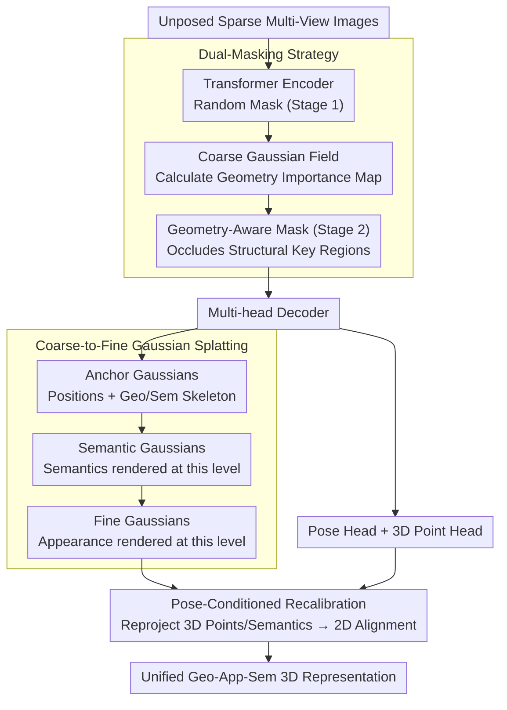

# UniSplat: Learning 3D Representations for Spatial Intelligence from Unposed Multi-View Images

**Conference**: CVPR 2026  
**arXiv**: [2604.10573](https://arxiv.org/abs/2604.10573)  
**Code**: [https://bobochow.github.io/UniSplat](https://bobochow.github.io/UniSplat)  
**Area**: 3D Vision  
**Keywords**: 3D Representation Learning, Spatial Intelligence, Gaussian Splatting, Self-Supervised Learning, Unposed Multi-View

## TL;DR
UniSplat learns a unified geometry-appearance-semantic 3D representation from unposed multi-view images using a dual-masking strategy, coarse-to-fine Gaussian splatting, and pose-conditioned recalibration, establishing a perceptual foundation for spatial intelligence.

## Background & Motivation

**Background**: 3D representation learning is evolving from supervised methods (requiring calibrated poses) to self-supervised methods (learning directly from raw multi-view images). However, existing self-supervised methods generally suffer from weak geometric awareness, insufficient appearance detail, and geometric-semantic inconsistency.

**Limitations of Prior Work**: (1) Methods like Masked Autoencoders lack rigorous global 3D consistency; (2) Novel view synthesis methods assume known poses or rely on dense video; (3) Unposed methods, while jointly estimating cameras and scenes, exhibit insufficient coupling between the three dimensions.

**Key Challenge**: Geometry, appearance, and semantics each have different optimal granularities—semantics are naturally coarse-grained while appearance requires fine details—direct unified learning leads to mutual interference.

**Goal**: Design a feed-forward framework to unify the learning of geometry, appearance, and semantic representations from unposed sparse multi-view images.

**Core Idea**: Use three complementary mechanisms to address geometric awareness (dual-masking), appearance precision (coarse-to-fine splatting), and consistency (pose recalibration) respectively.

## Method

### Overall Architecture
UniSplat addresses a complex task: extracting consistent scene geometry, appearance, and semantics using only a few sparse multi-view images without pose calibration. The method employs a feed-forward pipeline where multi-view images are first processed by a masked Transformer encoder to extract features. A multi-head decoder then predicts point clouds, semantics, and appearance. These predictions are not output directly but are assembled into a **coarse-to-fine three-level Gaussian field** for differentiable rendering. Finally, camera parameters estimated by a pose head are used to align predictions through reprojection. Three key mechanisms drive the pipeline: dual-masking for geometric understanding, coarse-to-fine splatting to coordinate semantic and appearance granularity, and pose recalibration to anchor geometry and semantics together.

### Key Designs

**1. Dual-Masking Strategy: Forcing 3D Reasoning over Texture Interpolation**

Self-supervised methods often use random masking, but random masks may cover irrelevant background areas, allowing models to reconstruct pixels using local textures without learning 3D structure. UniSplat splits masking into two steps: first, a random mask is applied at the encoder to extract preliminary features and splat a coarse Gaussian field. Second, an importance map is calculated from this coarse field to identify structurally critical regions (edges, geometric transitions) for "geometry-aware masking" at the decoder. This forces the decoder to reason about missing structural components via cross-view geometric relationships rather than simply copying neighboring textures.

**2. Coarse-to-Fine Gaussian Splatting: Rendering Semantics and Appearance at Optimal Granularities**

Optimizing geometry, appearance, and semantics within a single Gaussian layer causes interference, as semantics are object-level coarse signals while appearance requires high-frequency texture details. UniSplat decouples them using a three-level hierarchical Gaussian field: the top layer consists of **Anchor Gaussians**, which define geometry and semantic skeletons; the middle layer consists of **Semantic Gaussians**, which add offsets and semantic features for rendering; the bottom layer consists of **Fine Gaussians**, which inject high-frequency details from 2D feature maps for appearance rendering. Consequently, semantics are rendered at a coarser level and appearance at the finest, preventing compromises between the two.

**3. Pose-Conditioned Recalibration: Anchoring Geometry and Semantics via Reprojection**

A common issue in multi-head decoding is the lack of consistency between branches—the point cloud and semantic heads may output independent results. UniSplat utilizes camera parameters from the pose head to enforce constraints: 3D point clouds and semantic predictions are reprojected back to the 2D image plane using estimated poses to align with RGB and semantic targets. The pose serves both as an estimated target and a bridge to anchor various predictions to the same coordinate system, forcing geometric and semantic alignment without additional labels.

### Loss & Training
The model is trained using self-supervised signals and knowledge distillation: a photometric loss for novel view synthesis constrains appearance, while 3D point cloud distillation (using DUSt3R/VGGT as teachers) and semantic feature distillation (using DINOv2/SigLIP as teachers) supervise geometry and semantics. The aforementioned reprojection consistency loss further binds the different heads together.

## Key Experimental Results

### Main Results

| Task | Dataset | Metric | UniSplat (Ours) | Prev. SOTA |
|------|--------|------|----------|----------|
| Novel View Synthesis | RealEstate10K | PSNR | Competitive | SelfSplat |
| Camera Pose Estimation | CO3Dv2 | RTE | Improved | RayZer |
| Depth Estimation | ScanNet | Abs Rel | Improved | Baseline |

### Ablation Study

| Configuration | Key Metrics | Note |
|------|---------|------|
| Full model | Optimal | Best performance |
| w/o Dual-Masking | Decrease | Weakened geometric awareness |
| w/o Coarse-to-Fine | Decrease | Increased app-sem inconsistency |
| w/o Recalibration | Decrease | Poorer cross-task consistency |

### Key Findings
- The three components are complementary; removing any leads to performance degradation.
- Geometry-guided masking enhances 3D reasoning capability more effectively than random masking.
- The unified representation demonstrates strong generalization on downstream tasks such as navigation and manipulation.

## Highlights & Insights
- **Granularity Decoupling**: The coarse-to-fine strategy elegantly solves the granularity conflict between semantics and appearance, a concept transferable to other multi-task 3D learning frameworks.
- **Reprojection as Natural Alignment**: Utilizing estimated poses for cross-head consistency provides strong supervision and alignment without requiring additional annotations.

## Limitations & Future Work
- Dependency on the quality of teacher models for knowledge distillation.
- High computational overhead due to multi-head decoders and hierarchical Gaussians.
- Future work could explore more lightweight architectures and larger-scale pre-training.

## Related Work & Insights
- **vs. RayZer**: While RayZer uses implicit renderers, UniSplat utilizes explicit Gaussian Splatting to provide better interpretability.
- **vs. SelfSplat**: Unlike SelfSplat, which decouples depth and pose modules, UniSplat achieves tighter coupling through pose-conditioned recalibration.

## Rating
- Novelty: ⭐⭐⭐⭐ The collaborative design of the three components is innovative, though individual elements have precedents.
- Experimental Thoroughness: ⭐⭐⭐⭐ Comprehensive multi-task evaluation.
- Writing Quality: ⭐⭐⭐⭐ Framework descriptions are clear.
- Value: ⭐⭐⭐⭐ Provides a practical solution for the perceptual foundation of spatial intelligence.

<!-- RELATED:START -->

## Related Papers

- [\[CVPR 2026\] Learning Multi-View Spatial Reasoning from Cross-View Relations](learning_multi-view_spatial_reasoning_from_cross-view_relations.md)
- [\[CVPR 2026\] Uni3R: Unified 3D Reconstruction and Semantic Understanding via Generalizable Gaussian Splatting from Unposed Multi-View Images](uni3r_unified_3d_reconstruction_and_semantic_understanding_via_generalizable_gau.md)
- [\[CVPR 2026\] Learning Scene Coordinate Reconstruction from Unposed Images via Pose Graph Optimization](learning_scene_coordinate_reconstruction_from_unposed_images_via_pose_graph_opti.md)
- [\[CVPR 2026\] Learning Compact 3D Representations from Feed-Forward Novel View Synthesis](learning_compact_3d_representations_from_feed-forward_novel_view_synthesis.md)
- [\[CVPR 2026\] A Survey of Spatial Memory Representations for Efficient Robot Navigation](a_survey_of_spatial_memory_representations_for_efficient_robot_navigation.md)

<!-- RELATED:END -->
