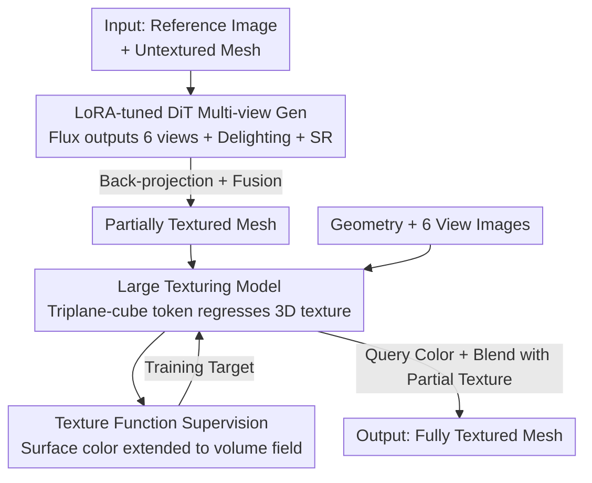

# UniTEX: Universal High Fidelity Generative Texturing for 3D Shapes

**Conference**: CVPR 2026  
**Paper**: [CVF Open Access](https://openaccess.thecvf.com/content/CVPR2026/html/Liang_UniTEX_Universal_High_Fidelity_Generative_Texturing_for_3D_Shapes_CVPR_2026_paper.html)  
**Code**: https://github.com/HKUST-SAIL/UniTEX  
**Area**: 3D Vision  
**Keywords**: 3D texture generation, texture function, UV-independent, Diffusion Transformer, LoRA fine-tuning

## TL;DR
UniTEX textures arbitrary 3D meshes using a two-stage framework: the first stage efficiently fine-tunes a large-scale 2D Diffusion Transformer (Flux) using LoRA to generate six-view delighted maps, while the second stage discards traditional UV mapping in favor of a Large Texturing Model (LTM) that directly regresses texture in 3D space. This model is supervised by a "Texture Function" that extends surface colors into a volumetric field, thereby obtaining more complete and higher-fidelity textures on both artist-crafted and AI-generated meshes.

## Background & Motivation

**Background**: High-quality texture generation is a key step in 3D asset production, directly determining the visual realism and semantic fidelity of rendered models. Dominant approaches leverage the success of 2D image/video diffusion models to apply 2D generative priors to 3D—first generating multi-view texture maps via 2D diffusion models, and then projecting these views back onto the 3D mesh surface.

**Limitations of Prior Work**: Multi-view projected textures often suffer from self-occlusion and multi-view inconsistency, leading to incomplete or fractured textures on 3D surfaces. To fill these gaps, early works (Paint3D, Meta 3D TextureGen, etc.) added a **second-stage UV-based inpainting**: unwrapping the mesh into UV space and fusing scattered views into a complete map. While this works reasonably well on artist-crafted meshes with clean UV layouts, it fails significantly when applied to meshes extracted via AI-generation pipelines (e.g., Craftsman, Hunyuan3D using Marching Cubes).

**Key Challenge**: The authors attribute this generalization bottleneck to a fundamental flaw in UV mapping: **topological ambiguity**. A single 3D mesh can correspond to multiple valid UV layouts. The unwrapped result is determined not only by the geometry but is also highly dependent on the vertex/face distribution and the specific UV unwrapping algorithm. Consequently, the UV parameterization used during inference cannot be guaranteed to be consistent with that during training. The UV inpainting model fails when encountering highly fragmented UV layouts (typical of generated meshes) unseen during training. In other words, **the UV space itself is an unstable and uncontrollable intermediate representation**, and building texture completion on top of it inevitably limits generalization.

**Goal**: Deliver second-stage texture completion/prediction from UV dependence, enabling stable, complete, and high-fidelity texture completion for meshes of arbitrary topology.

**Key Insight**: Since UV is the root cause of the problem, it should be bypassed entirely. The authors **reformulate texture inpainting/prediction as a native 3D regression task**—taking images and geometry as inputs and directly regressing color in a unified 3D function space. Inspired by experiences in geometric generation (such as SDF/UDF) showing that dense volumetric supervision is superior to sparse rendering supervision, they also extend the texture signals defined only on the surface into a continuous volume field to serve as the training target.

**Core Idea**: Replace "UV inpainting" with "directly regressing texture in 3D function space (LTM)" to bypass topological ambiguity, and replace sparse rendering supervision with "Texture Function which extends surface color into a volume field," achieving a generalizable and scalable second stage. This is paired with an efficiently LoRA-fine-tuned 2D Diffusion Transformer in the first stage to generate high-quality multi-view images.

## Method

### Overall Architecture
UniTEX is a **two-stage** texture generation pipeline that takes a reference image and an untextured 3D mesh as input and outputs a fully textured mesh.

The first stage (multi-view generation) efficiently fine-tunes two large-scale Diffusion Transformers (Flux) using LoRA. The first Flux receives the reference image along with the normal map and CCM (canonical coordinate map, where each pixel encodes the 3D coordinates of the surface point) rendered from the untextured mesh, and generates shaded maps from six orthogonal views. The second Flux is responsible for delighting and generating diffuse colors. The generated images can optionally pass through a super-resolution (SR) module. After back-projection and fusion, these view images yield a **partially textured mesh**.

The second stage (texture completion/refinement) feeds the images generated in the first stage along with the partially textured geometry into the Large Texturing Model (LTM). LTM regresses the **complete texture function** within a unified 3D function space. The final texture is blended from the "predicted texture function" and the "initial partially textured geometry." When training LTM, a Texture Function that extends surface colors into a volumetric field is used as the supervision signal.

The diagram below illustrates the main flow of the two stages from input to output, where the node names correspond to the four design points described in "Key Designs":

### Key Designs

**1. Large Texturing Model (LTM): Direct texture regression in a unified 3D function space to bypass UV topological ambiguity**

This is the core design of the paper, directly targeting the aforementioned UV topological ambiguity. Instead of inpainting in UV space, LTM treats texture prediction as a **color regression task taking 3D coordinates as independent variables**. Specifically, the architecture (see Fig. 4 in the paper) initializes a **triplane-cube** representation with a set of learnable tokens, consisting of a high-resolution triplane $T \in \mathbb{R}^{3\times32\times32}$ and a low-resolution cube $C \in \mathbb{R}^{8\times8\times8}$ (the paper shows that the hybrid triplane+cube representation outperforms pure triplanes). The 6 orthogonal view images, CCM, and alpha maps are encoded into the triplane in a CRM-like manner and added to the initial tokens. Geometric information is encoded following the concept of Shape2VecSets—sampling colored point clouds from the partially textured geometry, and querying them using triplane-cube tokens via **cross-attention**. After fusing 2D images and 3D geometry information, a Transformer with **self-attention** processes these flattened features. The output is then reshaped back into the triplane and cube, which are upsampled using 2D/3D deconvolutions, respectively.

Ultimately, when sampling textures, a lightweight MLP predicts colors from the triplane-cube features $\mathcal{TC}$. Given a query point $x$, the predicted color is:

$$\hat{\mathbf{c}}(x, \mathcal{TC}) = \text{MLP}_\theta(\mathit{gridsample}(x, \mathcal{TC}))$$

where $\hat{\mathbf{c}} \in \mathbb{R}^3$ represents the RGB of point $x$. Once training is complete, querying colors for arbitrary spatial points completes texture prediction/inpainting. The key benefit of this is that textures are modeled as a **complete spatial field** rather than depending on a specific UV unwrapping, making it naturally robust to meshes with diverse topologies (especially fragmented AI-generated meshes).

**2. Texture Function (TF): Outward-extending surface colors into continuous volumetric fields to provide dense and complete supervision**

This design addresses the problem of "how to train LTM effectively." Traditional textures are only defined on the object surface, and prior works could only rely on 2D projection supervision via surface rendering/volume rendering. This supervision is **sparse and incomplete**, lagging far behind dense volumetric supervision like SDF/UDF in geometric tasks. Drawing an analogy to UDF, the authors extend texture into a continuous function defined over the entire 3D space: for any spatial coordinates $x \in \mathbb{R}^3$, the closest point on the mesh surface $\Omega$ is found, and its color is used as the texture value for $x$. In this way, surface texture is transformed into a smooth, continuous volumetric field, which can be learned jointly with volumetric geometric representations.

The training target for LTM is defined as:

$$\mathcal{L}_{\text{texture}} = \mathbb{E}_{x \sim \Omega}\left[\|\hat{\mathbf{c}}(x, \mathcal{TC}) - \mathbf{c}(x)^*\|^2\right] + \lambda \mathcal{L}_{tv}(\mathcal{T})$$

where $\mathbf{c}(x)^*$ is the ground-truth color derived from the texture function, and $\mathcal{L}_{tv}$ is the total-variation regularization applied to the 3D representation of the mesh, with weight $\lambda = 0.0005$. Analogous to truncated SDF, the authors use a **truncated texture function** with a threshold set to $0.025$. Points outside the truncation range use the background color as the ground truth—effectively extending the colored region into a thin shell around the geometry. This thin shell brings three benefits: first, it forces the model to develop a volumetric understanding of 3D objects; second, it reduces dependency on highly accurate mesh modeling (one can still query correct colors even if the geometry is imprecise); third, complete supervision helps learn a well-structured latent space, enhancing generalization. The authors emphasize that while similar texture extension has been discussed before, **proving for the first time that this representation can serve as a strong training target for boosting texture generation** is a key contribution of this paper.

**3. Drop Training: Randomly dropping partial tokens for efficient fine-tuning of multi-view Diffusion Transformers**

This is the core efficiency design of the first stage, addressing the bottleneck that adapting 2D diffusion models to 3D texturing tasks involves too many conditioning signals, resulting in excessively long tokens that slow down training and exhaust VRAM. Generating 6 views at $512\times512$ requires providing reference images and geometric information (normal, CCM) for each view, and DiT relies on in-context learning (all inputs and conditions are encoded together into tokens), leading to a token explosion. Inspired by Long-LoRA (truncating the attention window during training and restoring full attention during inference) and MVDiffusion++ (using fewer views during training and more views during inference), the authors point out that what fine-tuning actually needs the model to learn are "multi-view consistency + alignment with condition inputs," which **does not require seeing all input tokens simultaneously**. Thus, drop training retains only a subset of all tokens at each training step, and the Diffusion Transformer performs conditioning and generation based solely on these selected tokens. Experiments show that discarding 50% of tokens maintains a generation quality comparable to full-input fine-tuning at the same number of iterations, while significantly accelerating training and reducing VRAM usage—making it a plug-and-play fine-tuning trick.

> ⚠️ Note: The original paper refers to this as "drop training" in some places and "patch dropout strategy" in others; both refer to the same method, and the original text is authoritative.

### Loss & Training
The core loss for LTM is the aforementioned $\mathcal{L}_{\text{texture}}$: RGB L2 reconstruction loss of surface sampled points + total-variation regularization ($\lambda=0.0005$), with truncated texture function at a threshold of $0.025$, where regions outside truncation are supervised with the background color. In the first stage, the two Flux models are fine-tuned using LoRA + in-context learning, accelerated by drop training (dropping 50% of tokens). Multi-view generation is trained on A800 GPUs with a batch size of 4.

## Key Experimental Results

### Main Results: Texture generation comparison (Artist-crafted meshes + Generated meshes)
The authors established two complementary benchmarks: artist-crafted meshes (following the evaluation standards of MetaTexGen) and AI-generated meshes (synthesized via Craftsman and HY2.0). Indicators include CMMD (fine-grained fidelity), FIDCLIP (semantic similarity), CLIP-Score (alignment with prompts), LPIPS (perceptual similarity), and User-perf. (user study preference rate).

| Method | Artist Mesh CMMD↓ | Artist Mesh FIDCLIP↓ | Artist Mesh CLIP-Score↑ | Generated Mesh LPIPS↓ | Generated Mesh CLIP-Score↑ | User-perf.↑ |
|------|------|------|------|------|------|------|
| Paint3D | 1.196 | 20.52 | 0.840 | 0.107 | 0.720 | 6.82% |
| TexPainter | 1.632 | 27.13 | 0.804 | 0.112 | 0.709 | 1.36% |
| TexGaussians | 1.290 | 21.08 | 0.836 | 0.095 | 0.681 | 4.55% |
| Hunyuan3D-Paint | 0.909 | 20.38 | 0.824 | 0.091 | 0.800 | 21.36% |
| **Ours (UniTEX)** | **0.826** | **16.03** | **0.844** | **0.090** | **0.807** | **65.91%** |

UniTEX leads in almost all metrics across both benchmarks: the FIDCLIP of artist meshes drops from the runner-up of 20.38 to 16.03, and the user study preference rate is as high as 65.91% (while the runner-up, Hunyuan3D-Paint, is only 21.36%). Notably, the single-stage native 3D model TexGaussians performs poorly on generated meshes (CLIP-Score of only 0.681), confirming the conclusion that "while native 3D supervision is necessary, native 3D methods are more suitable for refinement/completion rather than independent generation (due to 3D data scarcity), and still require 2D diffusion priors."

### Refinement Stage Comparison (3D Space vs. UV Space)
To support the core argument that "refinement should be performed in 3D space rather than UV space," the authors take the first-stage generated images as input and compare the completion quality of different refinement methods of self-occluded regions. Here, PSNRuv calculates PSNR on the predicted surface of sampled UV points, and PSNRuv* calculates PSNR only on invisible regions.

| Method | PSNRuv↑ | PSNRuv*↑ | PSNR↑ | SSIM↑ | LPIPS↓ |
|------|------|------|------|------|------|
| Paint3D-UVpaint | 18.61 | 15.22 | 23.90 | 0.971 | 0.042 |
| TexGEN | 20.47 | 17.07 | 25.19 | 0.977 | 0.040 |
| **Ours** | **23.01** | **19.89** | **30.45** | **0.989** | **0.023** |

UniTEX leads across all metrics, especially raising PSNR from 25.19 to 30.45, and PSNRuv* in invisible areas from 17.07 to 19.89—proving that refinement in the 3D function space is significantly better at completing self-occluded and invisible areas.

### Ablation Study

**Drop Training (DT) Ablation** (multi-view texture generation, A800 / batch size 4):

| Configuration | CMMD↓ | FIDCLIP↓ | CLIP-Score↑ | LPIPS↓ | VRAM↓ | Speed↓ |
|------|------|------|------|------|------|------|
| w/o DT | 0.912 | 17.49 | 0.839 | 0.087 | 69.2GB | 38.76 s/it |
| **w/ DT** | **0.826** | **16.03** | **0.844** | 0.090 | **53.6GB** | **21.50 s/it** |

Dropping 50% of tokens not only maintains but slightly improves quality (with better CMMD/FIDCLIP/CLIP-Score) while reducing VRAM usage by 22.5% and accelerating speed by approximately 44.5%.

**Texture Function Supervision (TFS) Ablation** (directly coloring the entire model via LTM query points, without blending with the partial texture):

| Configuration | PSNRuv↑ | PSNR↑ |
|------|------|------|
| w/o TFS | 20.31 | 25.81 |
| **w/ TFS** | **20.99** | **27.01** |

Using TF supervision improves PSNR from 25.81 to 27.01 and PSNRuv from 20.31 to 20.99 under the same number of iterations, indicating that volumetric-field supervision yields higher fidelity and more complete textures.

### Key Findings
- **Drop training is a "free lunch"**: Dropping half of the tokens saves VRAM and almost doubles the generation speed while slightly improving quality—validating the insight that "fine-tuning genuinely needs to learn multi-view consistency and alignment with constraints, and there is no need to observe all tokens."
- **Refinement in 3D function space >> Refinement in UV space**: The advantage is most pronounced in self-occluded/invisible regions ($PSNRuv^*$), directly reinforcing the main thesis of "bypassing UV."
- **Native 3D is suited for refinement rather than standalone generation**: The failure of the single-stage TexGaussians scheme on generated meshes demonstrates that 2D diffusion priors remain indispensable under 3D data scarcity, vindicating UniTEX's partitioning into "2D generation + 3D refinement" as a reasonable trade-off.

## Highlights & Insights
- **Identifying UV topological ambiguity as the root cause of the generalization bottleneck**: While many works empirically observe that UV inpainting fails on generated meshes, UniTEX provides a clear attribution (multiple valid UVs for a single mesh, discrepancy between training and inference UV definitions) and designs a clean "stay entirely out of UV space" solution, creating a tight logical loop.
- **Texture Function borrowing the dense supervision paradigm of SDF/UDF**: Porting the successful experience of "volumetric field supervision over sparse rendering" from geometry tasks into texturing is an elegant analogy; shell supervision also incidentally reduces the reliance on precise geometry—this side-effect is highly beneficial for the inaccurate meshes typical of AI generation.
- **Transferability of drop training**: As a plug-and-play DiT fine-tuning efficiency booster, its insight (it is unnecessary to preserve full forward tokens during fine-tuning) can be transferred to other diffusion fine-tuning scenarios with heavy conditioning and long token sequences (e.g., multi-view normal estimation, which the authors validate in the supplementary material).

## Limitations & Future Work
- **Dependence on the quality of the first-stage 2D diffusion**: The pipeline is a "2D generation + 3D refinement" composition; if the first-stage multi-view generation deviates significantly, the second stage can fill in but can hardly correct semantic errors out of nowhere.
- **Resolution limitations of the triplane-cube representation**: The resolution of high-res triplane ($32\times32$) and low-res cube ($8\times8\times8$) may limit the upper bound for representing extremely fine textures (ultra-high-frequency details); this is not investigated in-depth in extreme detail scenarios.
- **Fewer iterations for some ablations**: The authors acknowledge that, due to computing resource constraints, some ablation experiments were trained with fewer iterations than the full model. The absolute values in these conclusions should be interpreted with caution (⚠️ subject to the original text).
- **Evaluation remains biased toward single reference image conditioning**: The system is evaluated primarily under the single-image + mesh setting, leaving robustness under multi-image or complex text conditions less explored.

## Related Work & Insights
- **vs. Paint3D / TexGen (UV inpainting based)**: These methods are effective on artist-crafted meshes with clean UV layouts but fail on the fragmented UV layouts of generated meshes. UniTEX operates completely outside UV space, achieving a refinement stage PSNR of 30.45 vs. Paint3D's 23.90, manifesting superior generalization.
- **vs. Hunyuan3D-Paint (multi-view diffusion based)**: HY2.0/2.1 uses rule-based inpainting to process occluded areas, leaving noticeable artifacts. UniTEX's LTM can learn to recover missing parts (e.g., occluded legs), achieving a user study preference rate of 65.91% vs. 21.36%.
- **vs. TexGaussians (single-stage native 3D)**: Pure native 3D generation is constrained by the scarcity of 3D data and generalizes poorly on generated meshes (CLIP-Score of 0.681). UniTEX repositioned native 3D as a second-stage refinement module, relying on 2D foundation models for multi-view conditioning, which is more robust given limited data.
- **vs. FlashTex / SDS optimization based**: SDS-based approaches rely on continuous iterative optimization from single-view diffusion, suffering from the Janus problem and high optimization costs. UniTEX utilizes feed-forward multi-view generation + one-pass 3D regression, delivering superior scalability.

## Rating
- Novelty: ⭐⭐⭐⭐⭐ Moving texture completion entirely from UV space to a 3D function space, and being the first to introduce "outward-extending textures as a volumetric field" as a strong training target represent highly creative problem formulations and solutions.
- Experimental Thoroughness: ⭐⭐⭐⭐ Dual benchmarks (artist-crafted + generated meshes), main comparisons, refinement comparisons, two ablation sets, and user studies are complete, with the only caveat being that some ablations used fewer iterations due to compute constraints.
- Writing Quality: ⭐⭐⭐⭐ The motivation derivation (topological ambiguity -> 3D regression -> volumetric supervision) is highly logical, and illustrations complement the text well; some terminology (e.g., drop training / patch dropout) is not entirely consistent throughout.
- Value: ⭐⭐⭐⭐⭐ Provides a generalizable and scalable high-fidelity texturing scheme for fragmented topologies such as AI-generated meshes, possessing direct practical value for game, VR, and digital content creation. Furthermore, drop training can be readily transferred to other DiT fine-tuning tasks.

<!-- RELATED:START -->

## Related Papers

- [\[CVPR 2026\] Lafite: A Generative Latent Field for 3D Native Texturing](lafite_a_generative_latent_field_for_3d_native_texturing.md)
- [\[CVPR 2026\] CustomTex: High-fidelity Indoor Scene Texturing via Multi-Reference Customization](customtex_high-fidelity_indoor_scene_texturing_via_multi-reference_customization.md)
- [\[CVPR 2026\] CraftMesh: High-Fidelity Generative Mesh Manipulation via Poisson Seamless Fusion](craftmesh_high-fidelity_generative_mesh_manipulation_via_poisson_seamless_fusion.md)
- [\[CVPR 2026\] LATTICE: Democratize High-Fidelity 3D Generation at Scale](lattice_democratize_high-fidelity_3d_generation_at_scale.md)
- [\[CVPR 2026\] HyperGaussians: High-Dimensional Gaussian Splatting for High-Fidelity Animatable Face Avatars](hypergaussians_high-dimensional_gaussian_splatting_for_high-fidelity_animatable_.md)

<!-- RELATED:END -->
