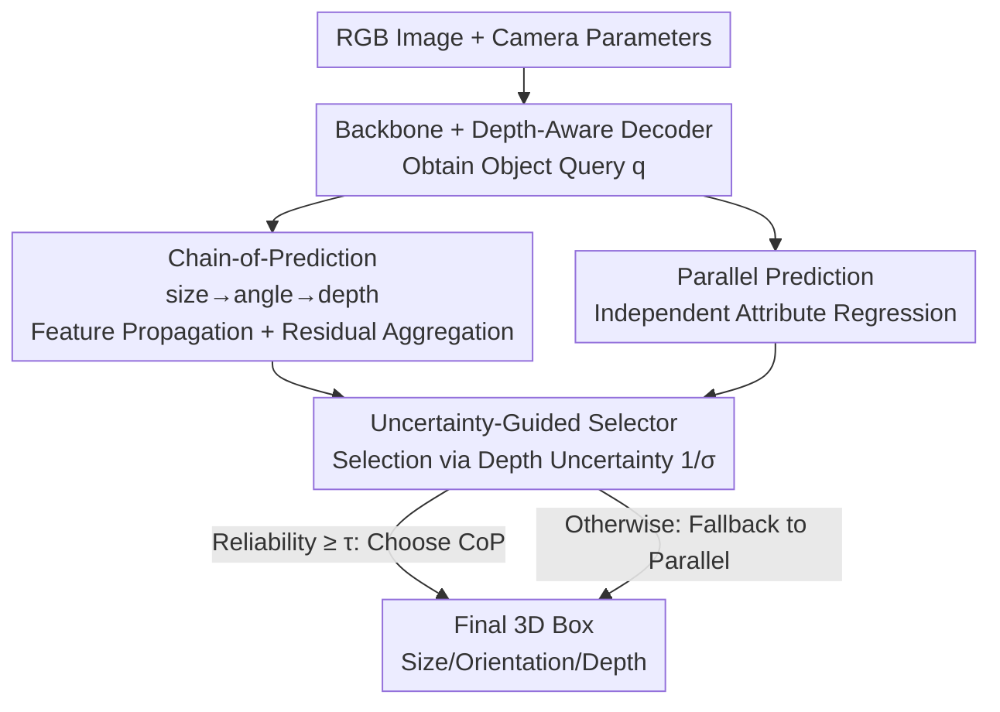

# Unleashing the Power of Chain-of-Prediction for Monocular 3D Object Detection

**Conference**: CVPR 2026  
**Paper**: [CVF Open Access](https://openaccess.thecvf.com/content/CVPR2026/html/Zhang_Unleashing_the_Power_of_Chain-of-Prediction_for_Monocular_3D_Object_Detection_CVPR_2026_paper.html)  
**Code**: https://github.com/alanzhangcs/MonoCoP  
**Area**: 3D Vision / Monocular 3D Detection  
**Keywords**: Monocular 3D Detection, Attribute Correlation, Chain-of-Prediction, Uncertainty Routing, Depth Estimation

## TL;DR
MonoCoP transforms the coupled attributes of size, orientation, and depth in monocular 3D detection from "independent parallel prediction" to **feature-level chain-of-prediction** (size→orientation→depth propagation with residual aggregation). It employs an **Uncertainty-Guided Selector** to dynamically switch between chain and parallel paths, significantly improving 3D detection performance on KITTI, nuScenes, and Waymo, especially for distant objects.

## Background & Motivation
**Background**: Monocular 3D detection (Mono3D) infers 3D dimensions $s=(w,h,l)$, orientation $\omega$, and depth $z_c$ from a single RGB image. Due to the absence of depth sensors like LiDAR or stereo cameras, the 3D→2D projection introduces depth ambiguity, making depth estimation the primary bottleneck. Common approaches (e.g., MonoDETR, MonoDGP) regress these 3D attributes **in parallel** using separate prediction heads.

**Limitations of Prior Work**: Parallel prediction treats each attribute as independent, ignoring that they are **coupled** through the same projection geometry. Objects with identical 2D boxes could be a "small car nearby" or a "large truck far away"; changing the orientation of the same vehicle also alters its 2D visual size. Consequently, multiple 3D configurations can result in nearly identical 2D appearances, making the estimation of individual attributes in isolation inherently underdetermined.

**Key Challenge**: Given attribute correlation, a straightforward remedy is **autoregressive prediction**: estimating size first, then orientation conditioned on size, and finally depth. However, the authors point out that traditional sequence prediction occurs at the **output value level**. If a previous step is incorrect (especially for occluded/truncated objects where size or orientation are inaccurate), errors magnify along the chain, degrading depth estimation. This creates a dilemma: parallel prediction discards correlations, while rigid sequential prediction accumulates errors—**neither is optimal**. Crucially, the benefit of modeling correlation **varies per object**: parallel prediction suffices for clearly visible objects, whereas occluded/vague objects truly require correlation modeling.

**Goal**: (1) Retain attribute correlation while avoiding error accumulation in sequential prediction; (2) Enable the model to autonomously decide **when** to utilize correlations and **when** to revert to independent prediction.

**Core Idea**: Shift "sequential conditioning" from the output layer to the **feature level** via Chain-of-Prediction (CoP), which gradually learns, propagates, and aggregates attribute-specific features for joint optimization in a single forward pass. This is complemented by an **Uncertainty-Guided Selector (GS)** that dynamically chooses the more reliable path between CoP and parallel prediction based on depth uncertainty.

## Method

### Overall Architecture
MonoCoP is built upon a DETR-style monocular detector (following the backbone, depth-aware decoder, and visual encoder of MonoDETR / MonoDGP). An image processed through the backbone and depth-aware decoder yields a set of object queries $q$, each outputting category, 2D box, 3D size, orientation, and depth. While category and 2D box prediction follow standard parallel heads, the **three 3D attribute heads (size / angle / depth)** are significantly redesigned.

For these attributes, MonoCoP maintains **dual paths**: the proposed **Chain-of-Prediction (CoP)**, which propagates features from size to orientation to depth with residual aggregation, and the traditional **parallel prediction** path. Both paths generate results for the same query, and the **Uncertainty-Guided Selector (GS)** selects the more credible output based on the predicted depth uncertainty. The intuition is: use CoP when correlations can be confidently estimated, and fallback to parallel prediction when uncertainty is high to avoid error propagation.

### Key Designs

**1. Chain-of-Prediction (CoP): Moving attribute correlation from output to feature level using three-stage feature flow.**

To address the "parallel lacks correlation, serial accumulates error" conflict, CoP conditions on **features** rather than output values. It follows three steps:

- **Feature Learning**: A lightweight AttributeNet (AN) extracts attribute-specific features from the object query $q$. Each sub-module is a two-layer MLP with activation: $A(q)=\sigma(qW_1)W_2$, yielding $f_s=A_s(q),\ f_a=A_a(q),\ f_d=A_d(q)$.
- **Feature Propagation**: The CoP chains these features, allowing the preceding attribute feature to **guide** the next: $f_s=A_s(q),\ f_a=A_a(f_s),\ f_d=A_d(f_a)$. The sequence is fixed as **3D Size → Orientation → Depth**, as the spatial understanding required for these three increases sequentially.
- **Feature Aggregation**: To prevent "feature forgetting" and error accumulation in pure chains, residual aggregation is introduced at each step:

$$\tilde f_s = A_s(q)+q,\quad \tilde f_a = A_a(\tilde f_s)+\tilde f_s,\quad \tilde f_d = A_d(\tilde f_a)+\tilde f_a.$$

This allows the depth estimation stage to access all information from size, orientation, and the original query. Unlike traditional output-level conditioning, feature-level propagation with residual aggregation enables **joint optimization**, preventing unidirectional error magnification.

**2. Uncertainty-Guided Selector (GS): Dynamic path selection to avoid unreliable correlation propagation.**

The reliability of attribute correlation **depends on the object**. For occluded objects, size and orientation estimates are inherently unreliable; forcing a chained prediction would degrade depth accuracy. GS enables "per-object adaptation."

It first performs **Uncertainty Estimation**: assuming the predicted depth $\hat z$ follows a Laplace distribution centered at the ground truth $z^*$ with scale $\sigma$: $p(z^*\mid\hat z,\sigma)=\frac{1}{2\sigma}\exp(-\frac{|z^*-\hat z|}{\sigma})$. The depth loss is minimized via negative log-likelihood:

$$\mathcal L_{depth}=\sqrt{2}\,e^{-\log\sigma}\,|\hat z - z^*| + \log\sigma,$$

forcing the model to output a confidence-representing $\sigma$. **Path Selection** defines reliability as inverse uncertainty $r=1/\sigma$. With a threshold hyperparameter $\tau$ and the CoP path reliability $\tilde r(\text{CoP})$:

$$b^*=\begin{cases}\text{CoP}, & \tilde r(\text{CoP})\ge\tau\\ \text{Par}, & \text{otherwise}\end{cases}$$

This ensures that the model benefits from correlations when they are confident and avoids "toxic" propagation when uncertainty is high. Ablations show GS achieves a routing accuracy of 82.18%, approaching the ground-truth oracle (100%) and far exceeding random selection (50%).

## Key Experimental Results

### Main Results
On KITTI Val/Test (IoU3D ≥ 0.7, Car, AP), MonoCoP achieves SoTA without extra data (LiDAR/depth), even outperforming methods that use extra data:

| Dataset/Setting | Metric | Ours (MonoCoP) | Previous Best (MonoDGP, CVPR25) | Gain |
|------|------|------|----------|------|
| KITTI Val | AP3D Easy/Mod/Hard | 32.06 / 23.98 / 20.64 | 30.76 / 22.34 / 19.02 | +1.30 / +1.64 / +1.62 |
| KITTI Val | APBEV Easy/Mod/Hard | 42.20 / 31.29 / 27.58 | 39.40 / 28.20 / 24.42 | +2.80 / +3.09 / +3.16 |
| KITTI Test | AP3D Easy | 27.54 | 26.35 | +1.19 |
| nuScenes Val | AP3D Mod (IoU 0.7) | 9.71 | 8.78 | +0.93 |
| Waymo Val L1 | APH3D All (IoU 0.5) | 11.65 | 10.06 | +1.59 |

MAE analysis by distance illustrates that MonoCoP maintains lower errors across all distance ranges compared to parallel models (MonoDETR/MonoDGP), with **improvements becoming more significant as distance increases**, confirming that modeling correlations effectively mitigates depth ambiguity for distant objects.

### Ablation Study

| Configuration | AP3D Mod (KITTI Val, IoU 0.7) | Description |
|------|---------|------|
| Baseline (Parallel) | 21.12 | Starting point |
| + CoP | 23.64 | Add chain-of-prediction (+2.52) |
| + CoP + GS (Full) | 23.98 | Add uncertainty routing (cumulative +2.86) |

Internal breakdown of CoP components and prediction order:

| Dimension | Configuration | AP3D Easy/Mod/Hard | Conclusion |
|------|------|------|------|
| CoP Components | FL Only | 29.67 / 21.74 / 18.23 | Small gain from feature learning alone |
| CoP Components | FL+FP | 29.33 / 22.22 / 19.26 | Propagation improves Moderate AP |
| CoP Components | FL+FP+FA | 32.06 / 23.98 / 20.64 | Residual aggregation is crucial |
| Prediction Order | z→s→ω | 30.54 / 22.54 / 19.37 | Inverse geometric dependency is worst |
| Prediction Order | ω→s→z | 29.87 / 23.08 / 19.62 | Suboptimal |
| Prediction Order | **s→ω→z** | 32.06 / 23.98 / 20.64 | Sequential geometric dependency is best |

### Key Findings
- **Feature Aggregation (FA) is the main performance driver**: Inclusion of FA boosts Moderate AP from 22.22 to 23.98, proving that raw chains suffer from feature forgetting and indicating that residual connections are essential.
- **The prediction order must follow geometric dependencies**: The sequence $s\to\omega\to z$ (Size → Orientation → Depth) is optimal. Placing depth first results in the worst performance, validating the hypothesis that depth requires the richest spatial context.
- **GS primarily improves Moderate/Hard cases**: The Full model shows slight degradation in the Easy set compared to CoP alone (clear objects rarely benefit from switching), but gains consistently on Moderate/Hard sets containing occluded objects.
- **Near-zero overhead**: Compared to MonoDGP, MonoCoP adds only +3.60M parameters and +2.78 GFLOPs while achieving a +2.86 AP3D gain (21.12→23.98), thanks to the lightweight two-layer MLPs in AttributeNet.

## Highlights & Insights
- **Accurate distinction between feature-level and output-level chains**: Prior sequential models (including point cloud detectors) conditioned on numeric outputs, which are inherently unidirectional and error-prone. MonoCoP’s shift to the feature level with residual aggregation enables joint optimization within a single forward pass.
- **Uncertainty as a switch**: Implementing an adaptive mechanism to decide whether to trust correlations—rather than using a global sequential approach—avoids contaminating predictions in uncertain scenarios. The 82% routing accuracy is a robust adaptive design.
- **Solid motivation**: The work begins with empirical Pearson correlation (depth-size $r=0.35$, depth-orientation $r=0.11$) and analytical pinhole projection derivation ($dz_c/d\omega\neq0$) to justify geometric coupling.
- **Plug-and-play**: Both modules are lightweight and can be easily integrated into other DETR-based monocular 3D detectors.

## Limitations & Future Work
- **GS Limitations**: The GS routing is not perfect (82% accuracy) and introduces slight overhead/regressions in Easy cases, suggesting room for improvement in switching mechanisms for clear objects.
- **Weak Correlations**: Real-world depth-orientation correlation is relatively weak ($r=0.11$). CoP gains are concentrated in subsets with high depth ambiguity (distance/occlusions), with limited universal gain.
- **Hyperparameter Sensitivity**: The threshold $\tau$ is manually set; its sensitivity and cross-dataset transferability are not fully discussed. Furthermore, GS relies solely on depth uncertainty, ignoring size and orientation uncertainties.
- **Fixed Order**: The prediction order is hardcoded as $s\to\omega\to z$. Future work could explore adaptive ordering per object or extended attribute chains.

## Related Work & Insights
- **vs Parallel Prediction (MonoDETR / MonoDGP)**: These regress size/angle/depth via independent heads. MonoCoP explicitly models correlations in the feature layer with adaptive routing, showing significantly lower error for distant objects.
- **vs Traditional Sequential Prediction (e.g., [38, 76] in LiDAR)**: These use step-by-step conditioning on output values, leading to error accumulation. MonoCoP optimizes jointly via feature propagation and residual aggregation.
- **vs Attribute Alternatives (HTL [43] / CoOp [85])**: HTL (phased optimization) and CoOp (learnable embeddings) show marginal gains or regressions in comparison. MonoCoP significantly outperforms them (Mod 23.98 vs 21.23 / 18.42), proving the feature-chain + uncertainty-routing approach is better suited for Mono3D geometric structures.

## Rating
- Novelty: ⭐⭐⭐⭐ Shifting sequential conditioning to features + uncertainty routing is novel and geometerically supported.
- Experimental Thoroughness: ⭐⭐⭐⭐⭐ Triple datasets + MAE analysis + comprehensive ablations on components/order/routing.
- Writing Quality: ⭐⭐⭐⭐ Clear logical flow from motivation to method; strong visualizations.
- Value: ⭐⭐⭐⭐ Near-zero cost, plug-and-play, and practical for addressing monocular depth ambiguity.

<!-- RELATED:START -->

## Related Papers

- [\[CVPR 2026\] Towards Intrinsic-Aware Monocular 3D Object Detection](towards_intrinsic-aware_monocular_3d_object_detection.md)
- [\[CVPR 2026\] LocateAnything3D: Vision-Language 3D Detection with Chain-of-Sight](locateanything3d_vision-language_3d_detection_with_chain-of-sight.md)
- [\[CVPR 2026\] RaGS: Unleashing 3D Gaussian Splatting from 4D Radar and Monocular Cue for 3D Object Detection](rags_unleashing_3d_gaussian_splatting_from_4d_radar_and_monocular_cue_for_3d_obj.md)
- [\[CVPR 2026\] MonoSAOD: Monocular 3D Object Detection with Sparsely Annotated Label](monosaod_monocular_3d_object_detection_with_sparsely_annotated_label.md)
- [\[CVPR 2026\] GeoSAM2: Unleashing the Power of SAM2 for 3D Part Segmentation](geosam2_unleashing_the_power_of_sam2_for_3d_part_segmentation.md)

<!-- RELATED:END -->
