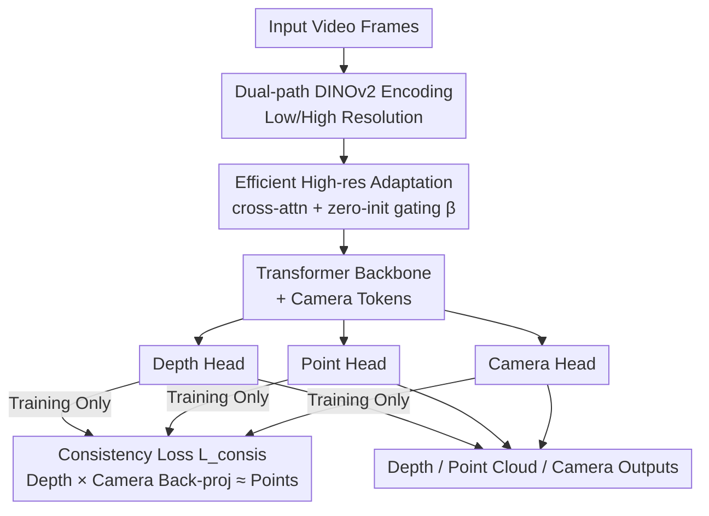

# Unlocking the Power of Critical Factors for 3D Visual Geometry Estimation

**Conference**: CVPR 2026  
**arXiv**: [2604.21713](https://arxiv.org/abs/2604.21713)  
**Code**: https://github.com/aim-uofa/CARVE (Available)  
**Area**: 3D Vision  
**Keywords**: Feed-forward visual geometry estimation, point cloud reconstruction, video depth, camera pose, ablation study

## TL;DR
This paper uses a rigorous set of ablations to uncover which training factors truly determine performance in feed-forward multi-frame visual geometry estimation (represented by VGGT). It discovers that commonly used learnable confidence losses and spatial gradient losses actually hinder performance, and local region alignment causes accuracy drops. Based on these findings, it proposes a consistency loss combined with an efficient high-resolution adaptation module, integrated into the CARVE model, achieving leading and robust results across 7 benchmarks for point cloud reconstruction, video depth, and camera pose estimation.

## Background & Motivation
**Background**: Restoring 3D point clouds, camera parameters, and depth from monocular video currently follows two paths. The optimization-based approach (SfM / MVS / SLAM) relies on feature matching to minimize reprojection error, but reconstructions are sparse and dependent on reliable correspondences. The learning-based approach performs end-to-end regression of 3D attributes, further divided into single-frame methods (e.g., MoGe) and multi-frame methods (e.g., DUSt3R, VGGT, Pi3).

**Limitations of Prior Work**: An unusual observation is that while multi-frame methods leverage cross-frame information and provide better consistency, they often fail to beat strong single-frame methods in per-frame accuracy. The advantage of multi-frame methods is usually vaguely attributed to "carefully designed training objectives, high-resolution input, and reasonable training curricula," but which factors actually work and to what extent has never been systematically quantified.

**Key Challenge**: Performance improvements are entangled with a variety of "seemingly reasonable" designs (learnable confidence weighting, spatial gradient loss, local region alignment, direct high-resolution input). Some of these designs might actually be counterproductive but have never been isolated for verification.

**Goal**: (1) Systematically isolate and quantitatively verify critical performance factors via rigorous ablation; (2) Integrate the advantages of geometric constraints from optimization and high-resolution information into a feed-forward model at low cost.

**Key Insight**: Perform controlled experiments directly on a representative multi-frame method, VGGT—fixing all other variables and changing only one dimension (data, loss, alignment, or resolution) to observe how the Rank changes.

**Core Idea**: Instead of piling up "advanced-looking" losses, identify which designs are truly effective and which are harmful. Reassemble the training recipe with "fixed inverse-depth weighting + sequence/frame-level alignment + geometric consistency loss + efficient high-resolution fusion" to create CARVE.

## Method

### Overall Architecture
The paper follows a two-step process. The first step is **Diagnosis**: Using VGGT as the baseline (DINOv2 encoder patches images into tokens, sent to a transformer along with learnable camera tokens, then depth/point/camera heads output depth maps $\hat{0pt}\in\mathbb{R}^{T\times H\times W}$, world-coordinate point maps $\hat{\mathbf{P}}\in\mathbb{R}^{T\times H\times W\times 3}$, and camera parameters $\hat{\mathbf{g}}\in\mathbb{R}^{T\times 9}$ (quaternion, translation, FoV)). The ViT is frozen, and only the rest is trained while performing controlled ablations across data, loss, and resolution, using "Average Rank↓" across all metrics to quantify the real contribution of each factor. The second step is **Improvement**: Fixing the successful recipe discovered during diagnosis (larger/diverse data, fixed inverse-depth weights, sequence + frame-level alignment) and adding two new components—a geometric consistency loss $\mathcal{L}_{\text{consis}}$ (constraining depth, camera, and point cloud to satisfy projection geometry during training) and an efficient high-resolution adaptation module (using cross-attention to fuse high-res features into the low-res backbone as residuals), collectively forming CARVE.

The following is the inference architecture and training constraints of CARVE (training recipe choices like data/loss weighting are training settings, not nodes in the diagram):

### Key Designs

**1. Systematic Three-Factor Ablation: Disproving "Empirical Intuition" item by item**

This is the diagnostic core of the paper, addressing the vague attribution of multi-frame advantages. On VGGT, the authors fixed other variables and moved only one dimension: ① **Data**—Moving from Data1 (high-quality only) → Data2 (increased diversity, maintained quality) → Data3 (added noisy data), the average Rank improved monotonically from 2.50 → 2.25 → 1.00. This shows that even for SOTA models with large-scale pre-training, expanding data diversity and quantity still unlocks performance; noisy data is not a hindrance but a benefit. ② **Alignment Strategy**—How predicted results are aligned to GT before loss calculation is critical: adding frame-level scale-shift alignment ($\mathcal{L}_{\text{F}}$) to sequence-level global alignment improves performance, but adding local 3D spherical region alignment ($\mathcal{L}_{\text{S}}$, aligning point clouds within local spheres of radius $r_j$) causes a drop—local alignment over-caters to local areas and destroys global geometry. Both conclusions are counter-intuitive but solidified by ablation.

**2. Counter-intuitive Loss Weighting: Replacing learnable confidence/spatial gradients with fixed inverse-depth weights**

Addressing a pain point: The learnable confidence loss $\mathcal{L}_{\text{conf}}(\mathbf{W})=\mathbb{E}_{p\in\mathcal{M}}|-\alpha\log\mathbf{W}_p|$ and spatial gradient loss $\mathcal{L}_{\text{sg}}$ inherited by VGGT seem reasonable but are actually harmful. The authors found that $\mathcal{L}_{\text{sg}}$ focuses too much on local neighborhood pixel differences at the cost of overall accuracy; learnable confidence is worse—the model finds a shortcut by lowering $\mathbf{W}_p$ for difficult areas to reduce the total loss, thus "escaping" hard regions instead of learning them. The alternative is fixing the weight map to the **inverse of depth** $\mathbf{W}_{\text{inv}}$ (i.e., $\mathcal{L}_{\text{reg}}(\mathbf{W}_{\text{inv}})$), which naturally makes the model focus on closer regions without providing a shortcut to escape difficult ones. In ablation, Rank dropped from 2.00 (reg+conf) to 1.33 (reg with $\mathbf{W}_{\text{inv}}$). Furthermore, temporal gradient loss $\mathcal{L}_{\text{tg}}$ (supervising temporal differences between adjacent frames) was also found to be negative (Rank spiked to 5.17 when added). The conclusion is firm: less is more; dropping these "advanced" losses is better.

**3. Consistency Loss $\mathcal{L}_{\text{consis}}$: Injecting projection geometry constraints into training**

Addressing a pain point: Predicted depth maps, camera parameters, and point clouds do not naturally satisfy the geometric constraint that "2D pixels back-projected via depth and camera should return to 3D point clouds," often leading to internal contradictions. Instead of using this as a post-processing filter for inaccurate regions as in optimization methods, this paper makes it a training loss. Specifically, focal length $\hat{f}_x=\frac{W}{2\tan(\hat{\bm\theta}_x/2)}$ is calculated from predicted FoV, the principal point $\hat{c}_x=W/2$ is set to the image center to form intrinsic $\hat{\mathbf{K}}$, quaternions $\hat{\mathbf{r}}$ are converted to rotation matrix $\hat{\mathbf{R}}$, and each pixel is back-projected into the world system using depth:

$$\hat{\mathbf{P}}_{\text{unproj}}(p)=\hat{\mathbf{R}}\big(\hat{0pt}(p)\,\hat{\mathbf{K}}^{-1}p\big)+\hat{\mathbf{t}},\quad \mathcal{L}_{\text{consis}}=\mathbb{E}_{p\in\mathcal{M}}\big|\hat{\mathbf{P}}_{\text{unproj}}(p)-\hat{\mathbf{P}}(p)\big|$$

This forces consistency between "points from depth+camera back-projection" and "points directly predicted by the point head," linking the three heads in a differentiable perspective projection chain to improve robustness and precision.

**4. Efficient High-res Adaptation: Cross-attention + Zero-init gated fusion of dual-resolution features**

Addressing a pain point: High-resolution input generally improves results, but upsampling the image 2× increases tokens by 4× and attention complexity by 16×—in practice, VGGT at high-res sees TFLOPs ×4, VRAM ×3~4, and FPS drops to 0.1×. Instead of direct high-res input, the same encoder extracts low-res features $\hat{\mathbf{f}}_{\text{img\_low}}$ and high-res features $\hat{\mathbf{f}}_{\text{img\_high}}$. Using low-res features as query and high-res features as key/value, intra-frame cross-attention is performed, with the result added back to the backbone as a **residual** multiplied by a **zero-initialized** learnable gate $\beta$:

$$\hat{\mathbf{f}}_{\text{img}}=\hat{\mathbf{f}}_{\text{img\_low}}+\beta\cdot\mathrm{CrossAttn}(\hat{\mathbf{f}}_{\text{img\_low}},\hat{\mathbf{f}}_{\text{img\_high}})$$

Zero-initialization (referencing ResNet residual concepts) ensures the model is equivalent to the original low-res model at the start of training, preserving VGGT pre-trained weights while gradually learning to utilize high-res details. The fused feature dimension remains identical to low-res features, allowing seamless replacement in the transformer. The depth/point heads only upsample features before the final few convolutions. This design not only outperforms "no high-res" but also beats the brute-force "direct upsampling" approach while requiring only 0.3×~0.4× VRAM and 0.5× TFLOPs, with inference FPS improved by up to 6×.

### Loss & Training
The final training loss solidifies the diagnostic conclusions: regression loss uses fixed inverse-depth weights $\mathcal{L}_{\text{reg}}(\mathbf{W}_{\text{inv}})$ + frame-level scale-shift alignment $\mathcal{L}_{\text{F}}$ + consistency loss $\mathcal{L}_{\text{consis}}$, camera loss $\mathcal{L}_{\text{cam}}=\mathbb{E}_t\|\hat{\mathbf{g}}_t-\mathbf{g}_t\|$, while **discarding** $\mathcal{L}_{\text{sg}}$, $\mathcal{L}_{\text{conf}}$, $\mathcal{L}_{\text{tg}}$, and $\mathcal{L}_{\text{S}}$. Training starts with VGGT pre-trained weights, frozen ViT feature extractors, dynamic batches (up to 24 frames), and 30K iterations. Evaluation is performed on uniformly sampled keyframes (max 200 frames/video), with predicted point clouds/depth/camera translation aligned to GT per-sequence before loss calculation.

## Key Experimental Results

**Metrics**: C-L1 is Chamfer L1 distance for point cloud reconstruction (↓); F@τ is F-score at threshold τ (↑, in %); Rel is Absolute Relative error for depth (↓); δ is depth accuracy for δ<1.25 (↑); ATE is Absolute Trajectory Error; RPE-R/RPE-T are relative pose rotation/translation errors (↓); FoV Rel is Relative Field of View error (↓); Rank is the average rank across all metrics (↓ is better).

### Main Results

Point Cloud Reconstruction (C-L1↓ / F@25↑, vs. strong baselines VGGT, Pi3):

| Dataset | Metric | CARVE | VGGT | Pi3 |
|--------|------|-------|------|-----|
| KITTI | C-L1↓ | **0.238** | 0.296 | 0.273 |
| KITTI | F@25↑ | **0.767** | 0.688 | 0.749 |
| 7-Scenes | C-L1↓ | **0.043** | 0.049 | 0.049 |
| TUM | C-L1↓ | **0.029** | 0.051 | 0.032 |
| HAMMER | C-L1↓ | **0.012** | 0.035 | 0.013 |
| Combined Rank↓ | — | **1.42 / 1.92** | 2.75 / 3.00 | 1.67 / 1.17 |

Video Depth Estimation (Average Rank↓ across 7 datasets): CARVE **1.50** vs Pi3 1.57 vs VGGT 3.21; significant leads on difficult sets like HO3D (Rel 0.220) and HAMMER (Rel 0.020).
Camera Pose and Intrinsics (KITTI/7-Scenes/TUM/HO3D): CARVE Rank **1.69** vs Pi3 2.31 vs VGGT 2.69; FoV Rel is lowest on most sets.

Efficiency (Single H200, Seq Length 32):

| Model | Resolution | Params (M) | FPS |
|------|--------|---------|-----|
| VGGT | 518² | 1189 | 24.85 |
| VGGT | 1036² | 1189 | 2.54 |
| CARVE | 1036² | 1214 | **15.26** |

At 1036² resolution, CARVE adds only 25M params over VGGT but runs at 6× the FPS; at 128 frames, VGGT-1036² OOMs, while CARVE remains operational.

### Ablation Study

| Configuration | Average Rank↓ | Description |
|------|-----------|------|
| Data1 → Data2 → Data3 | 2.50→2.25→1.00 | More and diverse data is better (including noisy data) |
| $\mathcal{L}_{\text{reg}}$+$\mathcal{L}_{\text{conf}}$+$\mathcal{L}_{\text{sg}}$ (VGGT) | 2.08 | Original losses |
| $\mathcal{L}_{\text{reg}}$+$\mathcal{L}_{\text{conf}}$ | 2.00 | Removing $\mathcal{L}_{\text{sg}}$ is actually better |
| $\mathcal{L}_{\text{reg}}(\mathbf{W}_{\text{inv}})$ | 1.33 | Fixed inverse-depth weighting, best single item |
| +$\mathcal{L}_{\text{sg}}$ | 4.17 | Reintroducing spatial gradient loss causes heavy drop |
| +$\mathcal{L}_{\text{tg}}$ | 5.17 | Temporal gradient loss is most harmful |
| +$\mathcal{L}_{\text{F}}$ | 2.33 | Frame-level alignment is beneficial |
| +$\mathcal{L}_{\text{F}}$+$\mathcal{L}_{\text{S}}$ | 3.08 | Adding local alignment causes a drop |
| +$\mathcal{L}_{\text{F}}$+$\mathcal{L}_{\text{consis}}$ (Our Loss) | 1.92 | Consistency loss brings robust improvement |
| w/o High-res → w/ Efficient High-res | 1.42→1.33 | High-res adaptation adds further gains |

### Key Findings
- **Data remains the primary productivity factor**: Even for SOTA models with large pre-training, expanding data diversity/quantity yields monotonic gains, and noisy data helps—indicating current visual geometry models are far from data saturation.
- **"Advanced" losses are mostly counterproductive**: Learnable confidence allows the model to take shortcuts by avoiding hard areas, and spatial/temporal gradient losses focus too much on local details. All three should be removed; a simple fixed inverse-depth weight is the optimal single configuration.
- **Alignment granularity has a sweet spot**: Sequence-level plus frame-level alignment is good, but finer local region alignment is excessive and destroys global geometric consistency.
- **Use high-resolution "smartly"**: Direct upsampling is computationally explosive and not necessarily better. Cross-attn residual fusion + zero-init gating saves computation while outperforming brute-force upsampling. The authors hypothesize this is due to multi-resolution feature complementarity and avoiding conflicts between high-res input and low-res pre-trained weights.

## Highlights & Insights
- **The courage to "do subtractions"**: The most "aha" moment of this paper is its courage to disprove and remove widespread designs like confidence loss and spatial/temporal gradient losses. Much of the performance gain comes from removing designs that were actually hindering the model. This "rigorous ablation-driven negative result" provides high-value information to the feed-forward geometry community.
- **The shortcut loophole in confidence loss**: The insight that learnable weights allow the model to reduce loss by "lowering weights on hard areas" rather than "learning hard areas" is sharp. This can be transferred to any task using learnable uncertainty weighting (depth, optical flow, segmentation), serving as a warning against self-adaptive confidence.
- **Engineering ingenuity of zero-init gating**: Zero-initializing $\beta$ makes the new high-res branch equivalent to an identity map at the start of training, avoiding damage to pre-trained weights. This is a general paradigm for "painless module additions" to pre-trained large models (similar to ControlNet/LoRA) and can be applied to other feed-forward models needing input modality or resolution expansion.
- **Consistency loss as a geometric closed loop**: Using a differentiable perspective projection chain to force self-consistency among depth/camera/point outputs injects geometric constraints from the optimization school into feed-forward training without requiring post-processing.

## Limitations & Future Work
- **Essentially a "recipe reconstruction" rather than a new architecture**: The core backbone remains VGGT; contributions are focused on training recipe diagnosis and two incremental modules. Novelty is more in systematic insight than paradigm shift.
- **Questionable generalizability of conclusions**: All ablations were performed on VGGT. Whether conclusions like "confidence/gradient losses are harmful" or "local alignment drops performance" hold for other architectures like Pi3 or DUSt3R has not been verified.
- **Mixed results against Pi3**: In some scenarios like ETH3D point clouds or KITTI depth, Pi3 still leads; CARVE is not a total sweep. Different datasets have varying difficulties, and average Rank can mask performance trade-offs in specific scenes.
- **High-res still requires dual-path encoding**: Although efficient adaptation saves computation, it still requires running the encoder twice to extract high and low-res features, incurring extra overhead compared to pure low-res models. Sensitivity regarding the gating $\beta$ and resolution ratios is not fully explored.

## Related Work & Insights
- **vs. VGGT (Baseline)**: CARVE stands on the shoulders of VGGT, inheriting its encoder+transformer+3-head structure but stripping away its confidence/spatial gradient losses and adding inverse-depth weights, consistency loss, and efficient high-res adaptation. It outperforms VGGT on nearly all benchmarks and is 6× faster at high-res.
- **vs. Pi3**: Pi3 utilizes a permutation-equivariant design to remove fixed reference views, representing a different architectural path. CARVE wins through training recipes and high-res fusion without changing the macro-architecture; the two trade leads across datasets, with CARVE slightly better in overall Rank.
- **vs. MoGe (Single-frame)**: CARVE adopts the inverse-depth weights and frame-level scale-shift alignment from MoGe but notes that MoGe's local region alignment $\mathcal{L}_{\text{S}}$ is counterproductive in multi-frame settings—revealing that good single-frame designs cannot always be blindly copied.
- **vs. Optimization-based (SfM/SLAM)**: Optimization methods treat geometric projection constraints as explicit minimization targets; CARVE embeds the same constraints as differentiable training losses, combining geometric rigor with feed-forward speed and density.

## Rating
- Novelty: ⭐⭐⭐⭐ Rigorous ablation-driven negative results + two practical incremental modules; high insight value despite inheriting VGGT backbone.
- Experimental Thoroughness: ⭐⭐⭐⭐⭐ Three tasks, 7 benchmarks, and full-dimensional ablations (data/loss/resolution) with complete efficiency metrics.
- Writing Quality: ⭐⭐⭐⭐ Logical clarity, actionable conclusions, and clear mapping between formulas and ablation tables.
- Value: ⭐⭐⭐⭐⭐ The reproducible recipe of "what designs actually work" is directly useful to the feed-forward geometry community; code is open-source.

## Rating
- Novelty: TBD
- Experimental Thoroughness: TBD
- Writing Quality: TBD
- Value: TBD

<!-- RELATED:START -->

## Related Papers

- [\[CVPR 2026\] DVGT: Driving Visual Geometry Transformer](dvgt_driving_visual_geometry_transformer.md)
- [\[CVPR 2026\] Unlocking 3D Affordance Segmentation with 2D Semantic Knowledge](unlocking_3d_affordance_segmentation_with_2d_semantic_knowledge.md)
- [\[CVPR 2026\] Homaloidal parametrization for detecting critical two-view configurations](homaloidal_parametrization_for_detecting_critical_two-view_configurations.md)
- [\[CVPR 2026\] MoRE: 3D Visual Geometry Reconstruction Meets Mixture-of-Experts](more_3d_visual_geometry_reconstruction_meets_mixture-of-experts.md)
- [\[CVPR 2026\] Fast Spatial Tracking with Visual Geometry Transformer](fast_spatial_tracking_with_visual_geometry_transformer.md)

<!-- RELATED:END -->
