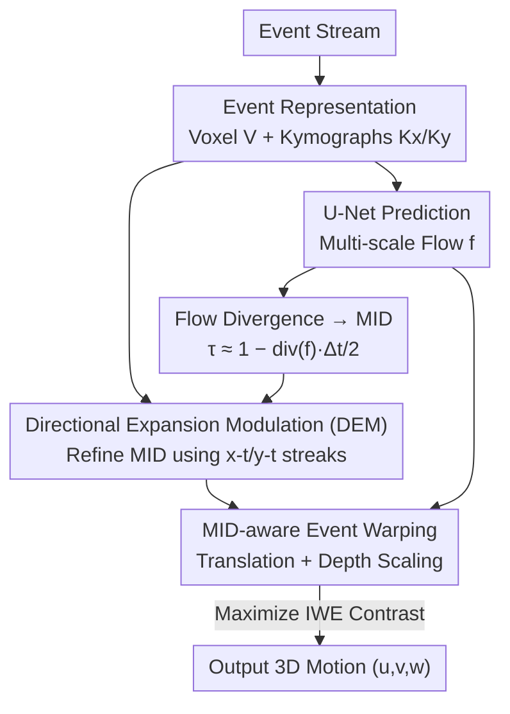

# Unsupervised 3D Motion Estimation Using Event Camera

**Conference**: CVPR 2026  
**Paper**: [CVF Open Access](https://openaccess.thecvf.com/content/CVPR2026/html/Han_Unsupervised_3d_Motion_Estimation_Using_Event_Camera_CVPR_2026_paper.html)  
**Area**: 3D Vision / Event Camera  
**Keywords**: Event-based camera, 3D motion estimation, optical flow, motion in depth, contrast maximization, unsupervised learning

## TL;DR
Leveraging the clue that event cameras exhibit dilation/contraction streaks on different projection axes reflecting depth changes, this paper derives an analytical relationship between optical flow divergence and "motion in depth" (MID) to provide initial values. This is refined by a Directional Expansion Modulation (DEM) module. Finally, MID is incorporated into event-level warping and jointly optimized using contrast maximization, enabling fully unsupervised estimation of both 2D optical flow and motion along the line of sight. It achieves accuracy far exceeding unsupervised baselines on CarlaEvent3D.

## Background & Motivation

**Background**: The 3D motion of scene points is typically decomposed into two parts: 2D optical flow $(u,v)$ on the image plane and "Motion in Depth" (MID, denoted as $w$ or depth ratio $\tau$) along the camera's line of sight. Prevailing learning methods (E-RAFT, ScaleFlow, EmoTive, etc.) follow a supervised regression route, regressing directly from densely labeled 3D motion fields.

**Limitations of Prior Work**: Supervised methods rely heavily on the distribution of labeled samples and do not explicitly introduce geometric constraints governing motion, making them prone to overfitting to specific motion patterns of a dataset and failing in unseen environments. Existing unsupervised solutions, while using photometric/geometric consistency to avoid labeling, mostly depend on synchronized stereo camera pairs, requiring precise extrinsic calibration and suffering from geometric distortion and projection ambiguity inherent in image representations.

**Key Challenge**: Unsupervised 3D motion estimation faces two fundamental obstacles. First, motion along the line of sight is **unobservable**—simultaneously estimating optical flow and MID requires strong priors, which are absent in unsupervised settings. Second, optical flow and MID are **coupled** via projection geometry: the motion of each pixel originates from both 2D translation and depth-induced scaling (perspective effect), making them naturally difficult to separate from observations.

**Key Insight**: Event cameras record per-pixel brightness changes asynchronously with microsecond latency, providing extremely high temporal resolution and motion continuity. The authors observed a key phenomenon: when projecting the event stream onto different axes ($x-y, x-t, y-t$), the $x-t$ and $y-t$ projections expose **locally dilating/contracting streaks** that encode relative depth changes and motion geometry—complementary clues absent in image representations but crucial for decoupling MID.

**Core Idea**: Transform "unobservable MID" into "observable" using dilation/contraction clues in event projections. Derive initial MID values analytically from optical flow divergence, refine them with a specialized module, and integrate MID back into contrast maximization-based event warping. This allows optical flow and MID to be jointly optimized under a unified objective, disambiguating each other.

## Method

### Overall Architecture
The input is an event stream $\epsilon=\{x_i,y_i,t_i,p_i\}$, and the output is the per-pixel 3D motion $(u,v,w)$. The pipeline consists of three steps: first, events are voxelized and fed into a U-Net encoder-decoder with recurrent units to predict multi-scale optical flow; then, an analytical formula (Eq. 7) is used to calculate a **rough motion in depth** $\hat\tau$ directly from the optical flow divergence; next, the DEM module combines event "kymographs" to refine $\hat\tau$ into $\tilde\tau$; finally, during training, the scaling introduced by MID is incorporated into event warping alongside optical flow displacement to generate an Image of Warped Events (IWE), optimized jointly under a contrast maximization objective. The entire process requires no 3D motion labels.

### Key Designs

**1. Analytical Bridge: Optical Flow Divergence → MID (Converting Unobservable to Observable via Geometry)**

MID is inherently unobservable, forcing supervised methods to rely on brute-force regression. The authors start from the pinhole camera model: a 3D point $(X,Y,Z)$ projects to $x=fX/Z, y=fY/Z$. Assuming motion purely along the line of sight, instantaneous flow satisfies $u=-x\dot Z/Z, v=-y\dot Z/Z$. Calculating the divergence of the flow field:

$$\text{div}(f)=\frac{\partial u}{\partial x}+\frac{\partial v}{\partial y}=-2\alpha-(x\partial_x\alpha+y\partial_y\alpha),\quad \alpha=\frac{\dot Z}{Z}$$

In local neighborhoods where depth changes smoothly, ignoring the spatial derivative term $(x\partial_x\alpha+y\partial_y\alpha)$ yields $\dot Z/Z\approx-\tfrac12\text{div}(f)$. Discretizing for consecutive timestamps—defining MID as the depth ratio $\tau=Z(t+\Delta t)/Z(t)$—and applying a first-order Taylor expansion leads to the core relationship:

$$\tau\approx 1-\frac{1}{2}\,\text{div}(f)\,\Delta t \quad (\text{Eq.7})$$

The value of this equation lies in that **MID does not need to be regressed from scratch but can be read directly from the divergence of the estimated optical flow field**. Outward flow (negative divergence) implies an approaching object (decreasing depth), while inward flow implies recession. This links "unobservable depth" to "observable flow," providing initial values for unsupervised estimation. The trade-off is the assumption of "locally rigid patches + dominant translational motion," resulting in a rough initial value $\hat\tau$ that is subsequently relaxed by the network.

**2. Directional Expansion Modulation (DEM) (Recovering Ignored Depth Gradients via Event Projection Streaks)**

Eq. 7 discards spatial derivative terms, leading to maximum errors in areas with large depth gradients (e.g., nearby ground, object boundaries). DEM compensates for this. It does not rely on optical flow but directly examines the dilation/contraction streaks on $x-t$ and $y-t$ projections (kymographs). First, directional expansion rates are extracted from temporal projection features $F_{ht}, F_{wt}$ using 1D convolutions:

$$e_h=\tanh\!\big(\text{Conv}^h_{1D}(F_{ht})\big),\quad e_w=\tanh\!\big(\text{Conv}^w_{1D}(F_{wt})\big)$$

These are broadcast across spatial dimensions and concatenated into a dual-axis expansion prior $E\in\mathbb{R}^{2\times H\times W}$, which is embedded into the feature domain via a lightweight 2D convolution to modulate context features $F_c$ extracted by the flow encoder: $F_m=F_c\odot\text{Conv2D}(E)$. A compact self-attention block aggregates long-range spatial context, followed by dilated depth-wise separable convolutions (rates $\{1,2,4\})$ to propagate directional clues across scales, fusing into a dense **MID residual map** $R$. This residual is added to $\hat\tau$ to obtain the refined estimate $\tilde\tau$, which is finally linearly rescaled as $\tau=0.75\tilde\tau+1.25$ for numerical stability. In short, DEM "retrieves" the depth variation that flow divergence cannot capture from the dilation streaks in event projections.

**3. MID-aware Event-level Warping (Integrating Depth Scaling into Contrast Maximization while Avoiding Event Collapse)**

Understanding MID is insufficient; it must participate in the unsupervised training objective. Traditional contrast maximization frameworks only use optical flow to warp all events to a reference time $t_r$: $\binom{x_i^{t_r}}{y_i^{t_r}}=\binom{x_i}{y_i}+(t_r-t_i)\binom{u}{v}$. Proper alignment results in a sharp, high-contrast IWE. However, depth changes cause perspective scaling that optical flow warping does not model. Directly applying image-based dilation/contraction on local patches fails because events are asynchronous sparse points, which easily triggers the known "event collapse" degradation.

The authors' solution is to rewrite scaling at the **event level**. From the pinhole model, the 2D projection area is $A_{2d}=(f/Z)^2A_{3d}$, so the 2D scale ratio between two moments is $s=\sqrt{A_1^{2d}/A_0^{2d}}=Z_0/Z_1=1/\text{MID}$. Since events trigger asynchronously, the scaling for each event is linearly interpolated by its timestamp: $\lambda_j=\frac{t_1-t_j}{t_1-t_0}, s_j=1+\lambda_j(s-1)$, ensuring smooth deformation over time. The depth-induced displacement of an event relative to the patch center $(x_m,y_m)$ is:

$$\binom{\Delta x_j^{t_1}}{\Delta y_j^{t_1}}=\binom{(s_j-1)x_j+(1-s_j)x_m}{(s_j-1)y_j+(1-s_j)y_m}$$

By superimposing this depth-scaling displacement onto the optical flow displacement, the final warped position for each event is obtained, unifying translational and scaling motion. The training uses a contrast maximization objective (measuring per-pixel temporal variance of warped timestamps) with Charbonnier smoothness regularization. Because scaling is calculated point-wise via interpolation relative to the patch center, there is no need to construct structured patch correspondences, fundamentally avoiding collapse caused by rigid scaling of sparse events.

### Loss & Training
The final objective is the contrast maximization loss (per-pixel temporal variance of warped timestamps, encouraging spatial-temporal alignment of events from the same physical edge into a sharp IWE), plus Charbonnier smoothness priors to regularize adjacent motion estimates and maintain local consistency. Both forward and backward warping (to the end and start timestamps) are performed. Training uses Adam with a learning rate of $10^{-4}$, global norm gradient clipping of 100, batch size 4, for 100 epochs, with a backward update every 5 forward passes to stabilize training. Each event window is fixed at 6000 events, with 10 temporal bins for $x-y$ voxels and a temporal resolution of 120 for $x-t/y-t$ projections.

## Key Experimental Results

The dataset is CarlaEvent3D, featuring six weather conditions: Sunset, Noon, Night, Cloudy, Foggy, and Rainy. Since contrast maximization assumes constant illumination (events triggered only by motion, not lighting changes), the model is **trained only on the Sunset sequence** but tested across all six weather types to evaluate generalization.

### Main Results (3D Motion Estimation, EPE↓ / F1↓ / log-mid↓)
SL = Supervised, USL = Unsupervised. Results for Sunset, Night, and Cloudy:

| Method | Type | Sunset EPE | Sunset F1 | Night EPE | Cloudy EPE | Cloudy F1 |
|------|------|-----------|-----------|-----------|-----------|-----------|
| EMoTive | SL | 1.852 | 19.22 | 2.008 | 2.629 | 24.16 |
| EV-FlowNet | USL | 3.597 | 50.25 | 3.152 | 2.925 | 39.05 |
| Expansion | USL | 8.499 | 56.63 | 7.963 | 8.583 | 59.86 |
| **Ours** | USL | **3.520** | **44.59** | 3.392 | **2.833** | **34.83** |

Among all unsupervised methods, Ours achieves the best EPE/F1 and drastically reduces the EPE of the strong baseline Optical Expansion from the 8.5 range to the 3.5 range. While errors remain higher than supervised methods, the gap is remarkably small considering the zero-label Sunset-only training and high generalization.

### Scene Flow Estimation (EPE3D↓ / ACC0.1↑)
ACC0.1 represents the percentage of points with 3D error < 10cm, highlighting fine local accuracy:

| Method | Type | Sunset EPE3D | Sunset ACC0.1 | Night ACC0.1 | Rainy ACC0.1 |
|------|------|-------------|---------------|--------------|--------------|
| EMoTive | SL | 0.176 | 43.8% | 42.9% | 37.1% |
| Expansion | USL | 0.812 | 2.3% | 1.4% | 2.4% |
| **Ours** | USL | 1.062 | **12.7%** | **13.2%** | **14.3%** |

While EPE3D is similar to Expansion, ACC0.1 achieves a **6–7x** improvement, indicating that Ours provides more compact and consistent error distributions—thanks to the MID refinement by DEM.

### Ablation Study

| Configuration | EPE↓ | log-mid↓ | Description |
|------|------|---------|------|
| w/o DEM | 3.38 | 644.56 | Rough MID via Eq. 7 only |
| w/ DEM (Full) | **3.29** | **364.01** | After DEM refinement |

Removing DEM results in significantly discontinuous MID and nearly doubles the log-mid (644.56 vs 364.01). Furthermore, the drop in MID accuracy negatively impacts final optical flow accuracy via warping (EPE 3.38 vs 3.29).

### Key Findings
- DEM is the vital link for MID quality: removing it causes log-mid to spike from 364 to 645, making MID visualizations appear disjointed.
- MID errors from Eq. 7 are **primarily concentrated on the nearby ground and object boundaries**—where depth gradients are large, rendering the ignored spatial derivative terms non-negligible, which is consistent with the theoretical analysis.
- Performance drops in Noon and Rainy: the former due to frequent solar glare and the latter due to puddles and raindrops triggering non-motion induced events, violating the brightness constancy assumption.
- Low-texture ground regions trigger sparse events, providing insufficient motion clues and resulting in larger 3D motion errors that propagate to scene flow reconstruction.

## Highlights & Insights
- **Geometric ingenuity in making the "unobservable" observable**: Using flow divergence to analytically derive MID allows utilizing the expansion/convergence of the flow field to expose depth changes without direct supervision—the pivot of this unsupervised scheme.
- **Event-level scaling to avoid collapse**: Interpolating scaling for sparse events by timestamp and calculating displacement relative to the patch center avoids the need for structured patch correspondences. This mechanism bypasses the optimization degradation caused by rigid scaling and is a valuable trick for any work porting image-side warping to events.
- **Cross-projection axis clues**: Using dilation streaks in $x-t/y-t$ kymographs as depth clues for DEM suggests that multi-axis projections of event streams are an underexploited gold mine of geometric information.
- **Generalization as a primary sell**: The "train on one weather, test on six" setup is rigorous, presenting generalization as a core strength rather than an afterthought.

## Limitations & Future Work
- **Brightness constancy constraint**: Contrast maximization requires events to be motion-triggered. Scenes with significant illumination interference, such as Noon (sunlight) and Rainy (reflections/raindrops), show clear performance degradation, as these noises cannot yet be reliably suppressed.
- **Failure in sparse regions**: In low-texture areas like the near-camera ground, sparse events lead to insufficient clues, causing inaccurate 3D motion estimates that contaminate downstream scene flow.
- **Simplified assumptions of Eq. 7**: While partially relaxed by the network, the assumptions of local rigidity and dominant translation still lead to errors at sharp depth gradients (boundaries). Incorporating explicit boundary or depth-gradient-aware terms might further reduce log-mid.
- Verification is limited to CarlaEvent3D synthetic data; performance on real-world event camera data remains an open question.

## Related Work & Insights
- **vs Optical Expansion [37]**: This uses affine transforms between local projections to estimate MID. Under asynchronous sparse events and complex motion, local correspondences are unreliable, producing noisy depth fields (ACC0.1 only 2–3%). Ours uses analytical relations + continuous event-level scaling without explicit patch correspondence, yielding smoother MID (ACC0.1 up 6–7x).
- **vs EV-FlowNet [39]**: A classic unsupervised event-based flow network that only estimates 2D flow. Ours explicitly models the coupling of planar and depth motion, achieving lower EPE and adding a depth motion dimension.
- **vs EMoTive / ScaleFlow / E-RAFT (Supervised)**: These regress 3D motion fields directly and depend on dense labels. They offer higher accuracy but limited generalization; Ours sacrifices some absolute accuracy for zero-label training and cross-weather robustness.
- **vs Contrast Maximization Framework [Gallego et al.]**: Ours adopts the event alignment philosophy but is the first to integrate depth-induced scaling into warping via event-level temporal interpolation, extending the framework's boundary from 2D flow to 3D motion.

## Rating
- Novelty: ⭐⭐⭐⭐ Connects flow divergence analytical MID, event projection dilation clues, and event-level scaling warping into a self-consistent unsupervised 3D motion scheme with clear geometric intuition.
- Experimental Thoroughness: ⭐⭐⭐⭐ Extensive cross-weather testing and dual-task evaluation (3D motion & scene flow) with ablation. Synthetic-only data is the main limitation.
- Writing Quality: ⭐⭐⭐⭐ Geometric derivations are well-linked, and motives are consistent with error analyses. Formulas align well with figures.
- Value: ⭐⭐⭐⭐ Provides a reusable geometric bridge and event-level warping paradigm for unsupervised 3D motion estimation, showing practical potential for robotics and autonomous driving.

<!-- RELATED:START -->

## Related Papers

- [\[CVPR 2026\] FastEventDGS: Deformable Gaussian Splatting for Fast Dynamic Scenes from a Single Event Camera](fasteventdgs_deformable_gaussian_splatting_for_fast_dynamic_scenes_from_a_single.md)
- [\[CVPR 2026\] AIMDepth: Asymmetric Image-Event Mamba for Monocular Depth Estimation](aimdepth_asymmetric_image-event_mamba_for_monocular_depth_estimation.md)
- [\[CVPR 2026\] Geometric-Photometric Event-based 3D Gaussian Ray Tracing](geometric-photometric_event-based_3d_gaussian_ray_tracing.md)
- [\[CVPR 2026\] Depth Hypothesis Guided Iterative Refinement for Event-Image Monocular Depth Estimation](depth_hypothesis_guided_iterative_refinement_for_event-image_monocular_depth_est.md)
- [\[CVPR 2026\] UniDAC: Universal Metric Depth Estimation for Any Camera](unidac_universal_metric_depth_estimation_for_any_camera.md)

<!-- RELATED:END -->
