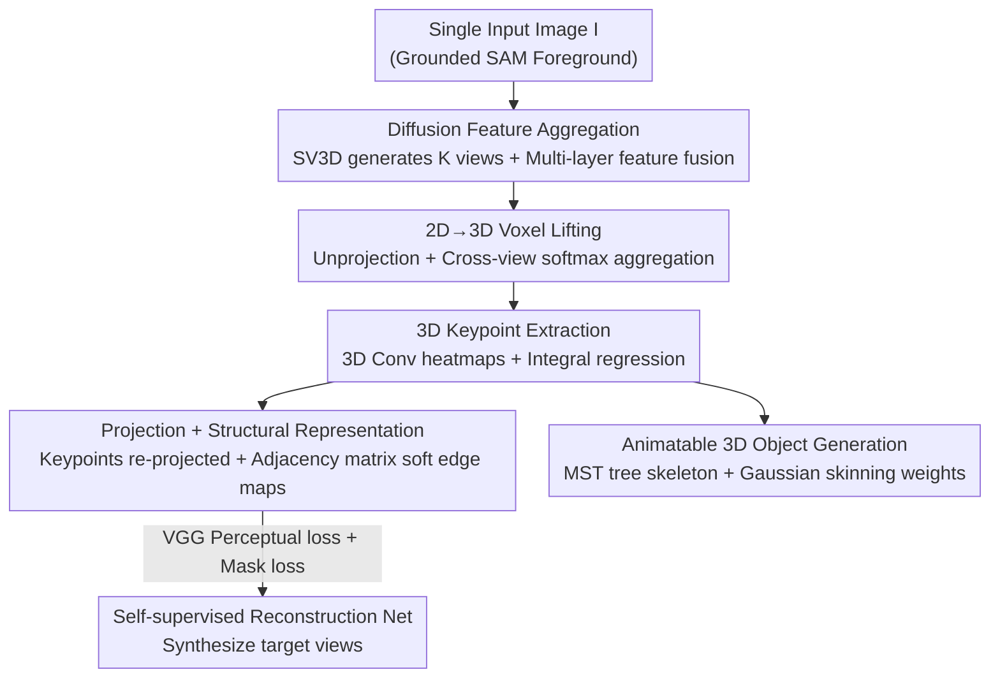

# Unsupervised Monocular 3D Keypoint Discovery from Multi-View Diffusion Priors

**Conference**: CVPR 2026  
**arXiv**: [2507.12336](https://arxiv.org/abs/2507.12336)  
**Code**: None  
**Area**: 3D Vision / Diffusion Models  
**Keywords**: Unsupervised Keypoints, Monocular 3D, Multi-view Diffusion Priors, Voxel Features, Self-supervised Reconstruction

## TL;DR
KeyDiff3D treats pre-trained multi-view diffusion models as "sources of geometric priors"—using them both to generate multi-view images from a single image for self-supervision and to extract implicit 3D geometric cues from intermediate features to be lifted into explicit voxels. Consequently, it predicts accurate and generalizable 3D keypoints from a single image without any 3D annotations, camera parameters, or multi-view acquisition (achieving 119mm MPJPE on Human3.6M single-view, surpassing all single-view unsupervised baselines and matching some multi-view methods).

## Background & Motivation

**Background**: 3D keypoints (human joints, facial landmarks, etc.) are compact, interpretable representations of object geometry, forming the basis for downstream tasks such as pose estimation, animation, and interaction analysis. Supervised methods require thousands of 3D annotations, which are expensive and only cover well-researched categories like humans. Unsupervised keypoint discovery (KeypointNet, BKinD-3D, Honari et al.) trains networks through image reconstruction to bypass manual labeling, theoretically allowing extension to any category.

**Limitations of Prior Work**: Existing unsupervised 3D methods still require "calibrated, object-centric multi-view images" as input or reconstruction targets. Obtaining such data requires controlled, synchronized multi-camera acquisition environments, which significantly limits the diversity of multi-view datasets and makes it difficult to generalize to in-the-wild and long-tail categories. In other words, they merely trade "annotation cost" for "multi-view acquisition cost."

**Key Challenge**: Monocular images are far easier to obtain than multi-view images and are the key entry point for scalable 3D understanding. However, recovering 3D structure from a single image without camera parameters or annotations is an inherently under-constrained problem—depth ambiguity and occlusion make monocular 3D keypoints almost a "no-man's land." The challenge lies in the trade-off between **Scalability (single image only)** and **3D Solvability (requires multi-view geometric constraints)**.

**Goal**: To build an unsupervised monocular 3D keypoint framework that can be trained with unconstrained single-view images, perform inference on a single image, and generalize to in-the-wild and out-of-domain scenarios.

**Key Insight**: The authors observe that pre-trained **multi-view diffusion models** (e.g., SV3D) encode strong 3D geometric priors while generating geometrically consistent novel views. Since the diffusion model "understands 3D," it can play two roles: generating multi-view images as supervision and acting as a multi-view feature extractor to reveal implicit priors.

**Core Idea**: Use multi-view diffusion models to replace expensive multi-view acquisition, "explicitizing" its implicit 3D priors into voxel features to regress 3D keypoints from a single image.

## Method

### Overall Architecture
The input is a single image $I$, and the output is a set of 3D keypoints $\mathbf{S}=\{\mathbf{s}_n\}_{n=1}^N$ ($\mathbf{s}_n\in\mathbb{R}^3$) and a learnable adjacency matrix $\mathcal{A}\in\mathbb{R}^{N\times N}$ (describing connection weights between keypoints). The pipeline consists of three main blocks: first, **Diffusion Feature Aggregation**, using a diffusion model to generate multiple views from a single image and extracting multi-layer intermediate features; then, **3D Keypoint Extraction**, unprojecting these 2D multi-view features into 3D voxel features and regressing 3D keypoints; finally, re-projecting the predicted 3D keypoints back to each generated view to create keypoint heatmaps + soft edge maps, which are fed into a reconstruction network for **Self-supervised Training**. All supervision signals come from diffusion-generated images, requiring no ground truth. After training, an external **Animatable 3D Object Generation** pipeline can bind the keypoints with the diffusion-reconstructed mesh into a drivable skeleton.

Critically, the diffusion model is serving as a "geometric feature extractor" rather than just an "image generator" (using generated images directly as input introduces noise), extracting intermediate features from its U-Net decoder which contain purer 3D priors than the rendered images.

### Key Designs

**1. Diffusion Feature Aggregation: Using Diffusion as a Feature Extractor, Not Just an Image Generator**

The most direct approach would be to use diffusion-generated multi-view images as input or targets, but the images themselves contain noise and artifacts. Instead, the authors extract **intermediate features** from the diffusion model. Specifically, denoising from pure noise $t=T$ to a target step $\tau=500$ and caching intermediate features from U-Net decoder layers. Following Diffusion Hyperfeatures, a lightweight aggregation network is trained to upsample multi-layer features $\mathbf{f}_l$ to a uniform resolution, project them to a unified channel dimension $C'$ via bottlenecks $B_l$, and perform a weighted sum using learnable scalar weights $w_l$:

$$\mathbf{F}_{\text{agg}}=\sum_{l=1}^{L}w_l\cdot B_l(\mathbf{f}_l),\quad \mathbf{F}_{\text{agg}}\in\mathbb{R}^{C'\times K\times H\times W}.$$

The aggregation network is driven by self-supervised objectives to select pose-related features consistent across multiple generated views. Ablations prove this step is vital: replacing diffusion features with ResNet50/CLIP/DINOv2 drops MPJPE from 121 to 136~143, indicating the 3D geometric awareness in multi-view diffusion features is significantly stronger.

**2. 2D→3D Voxel Lifting: Transforming Implicit Priors into Explicit 3D Volumes**

With multi-view 2D features, how to convert them to 3D? The authors define a regular voxel grid of $M\times M\times M$ ($M=72$), aligned with the world space of the diffusion model. A shallow keypoint head $\phi_{\text{kp}}$ converts aggregated features into keypoint features $\mathbf{F}_{\text{kp}}$. For each voxel center $\mathbf{x}$, camera projection matrices $\mathbf{P}_k$ project it onto the $k$-th view’s image plane to get sub-pixel coordinates $u_k(\mathbf{x})$, and features $\mathbf{f}_k(\mathbf{x})$ are bi-linearly sampled. Multi-view features are aggregated via softmax attention:

$$\mathbf{V}(\mathbf{x})=\sum_{k=1}^{K}\omega_k\cdot\mathbf{f}_k(\mathbf{x}),\quad \omega_k=\text{softmax}_k(\{\mathbf{f}_k\}_{k=1}^K).$$

The softmax weights automatically down-weight occluded or unreliable views. This step transforms the "implicit" 3D cues in diffusion into "explicit" voxels $\mathbf{V}\in\mathbb{R}^{C''\times M\times M\times M}$. Ablations show that "2D detection then triangulation" (MPJPE 129.6) is worse than direct voxel modeling (121.3), proving explicit 3D modeling is more geometrically self-consistent.

**3. 3D Keypoint Extraction (Integral Regression): Fully Differentiable Localization**

Voxel features pass through a 3D convolutional network $\phi_{\text{vol}}$ to output a 3D heatmap $\mathbf{H}_n\in\mathbb{R}^{M\times M\times M}$ for each keypoint. Coordinates are calculated as the expected position via integral regression (soft-argmax):

$$\mathbf{s}_n=\sum_{\mathbf{x}\in\Omega}\mathbf{x}\cdot\text{softmax}(\mathbf{H}_n(\mathbf{x})).$$

This expectation form makes the entire process from heatmap to coordinates differentiable, allowing end-to-end backpropagation using reconstruction loss.

**4. Projection + Soft Edge Maps + Self-supervised Reconstruction: Diffusion Images as Supervision**

Without ground truth, where does supervision come from? Predicted 3D keypoints are projected back to $K$ diffusion-generated views using $\mathbf{P}_k$ to obtain 2D keypoints $\mathbf{S}^{(k)}$. To further constrain the structure, differentiable Gaussian segments are drawn between every pair of keypoints $(i,j)$ to form a soft edge map: calculating the distance $d$ from pixel to segment and rendering $\mathbf{L}_{ij}(u)=w_{ij}\exp(-d^2/(2\sigma^2))$, where edge weights $w_{ij}=\text{softplus}(A_{ij})$ are gated by a learnable adjacency matrix $\mathcal{A}$. Edge maps $\mathbf{E}^{(k)}$ are aggregated by taking the pixel-wise maximum and concatenated with the heatmaps to feed into a reconstruction network. The network uses the appearance features of the input image and these structural cues to synthesize target views $\hat{I}^{(k)}$, supervised by the diffusion-generated reference $I^{(k)}$. This loop forces keypoints to "position" themselves where they can explain multi-view appearance, while the structure (adjacency graph) emerges.

### Loss & Training
Reconstruction uses VGG Perceptual loss + Mask loss, averaged over $K$ views:

$$\mathcal{L}=\frac{1}{K}\sum_{k=1}^{K}\left(\lambda_{\text{vgg}}\cdot\mathcal{L}_{\text{vgg}}^{(k)}+\lambda_{\text{mask}}\cdot\mathcal{L}_{\text{mask}}^{(k)}\right),$$

where $\mathcal{L}_{\text{vgg}}^{(k)}=\|\psi(\hat{I}^{(k)})-\psi(I^{(k)})\|_1$ and $\mathcal{L}_{\text{mask}}^{(k)}=\|\mathbf{E}^{(k)}-\mathbf{M}^{(k)}\|_2^2$ (aligning edge maps with diffusion foreground binary masks). The input image undergoes random affine augmentation. Hyperparameters: $\lambda_{\text{vgg}}=1.0$, $\lambda_{\text{mask}}=0.5$.

Backbone uses SV3D-p (generating 21 geometrically consistent views; $K=4$ used during training: input view + 3 generated views), $\tau=500$, $T=1000$. Pre-processing uses Grounded SAM for foreground segmentation. AdamW optimizer (lr $1\times10^{-4}$ except for the reconstruction net at $1\times10^{-3}$). Training for 20,000 steps on 2×A100 (40GB) with batch size 4; $M=72$, default $N=18$ keypoints.

**Animatable 3D Object Generation (Inference Pipeline)**: Uses Gaussian Frosting (based on 3DGS) to reconstruct a mesh + 3D Gaussians from generated views. A Minimum Spanning Tree (MST) is computed on the dense edge graph of keypoints to extract an $N-1$ edge tree skeleton. Skinning weights $\mathbf{W}_{i,l}$ for vertices to edges are calculated via a Gaussian distance function. Since predictions are naturally aligned with the diffusion coordinate system, the object can be driven like a conventional skeleton without additional registration.

## Key Experimental Results

### Main Results

3D keypoint estimation on Human3.6M (MPJPE/N-MPJPE/P-MPJPE in mm, lower is better; `*` denotes the six-action subset):

| Method | Views | Keypoints | Regressor | MPJPE | P-MPJPE |
| :--- | :---: | :---: | :---: | :---: | :---: |
| KeypointNet [56] | 1 | 32 | 2-hid MLP | 158.7 | 112.9 |
| Honari et al. [16] (single view) | 1 | 32 | 2-hid MLP | 125.73 | 89.05 |
| BKinD-3D [54] | 2 | 15 | Linear | 155 | 117 |
| BKinD-3D [54] | 4 | 15 | Linear | 125 | 105 |
| **Ours** | **1** | 32 | 2-hid MLP | **119.07** | **85.37** |
| **Ours** | **1** | 18 | 2-hid MLP | 121.34 | 85.26 |
| Ours `*` | 1 | 18 | 2-hid MLP | 85.47 | 66.73 |

Key Findings: Using only a single view, **Ours surpasses all single-view unsupervised baselines**, and the 119mm MPJPE is already better than multi-view BKinD-3D (155 for 2 views, 125 for 4 views). P-MPJPE also outperforms monocular pose methods using human-specific priors—even though Ours uses none.

On CUB-200-2011 (2D keypoints obtained by projecting 3D): Ours CUB-aligned 5.16, CUB-all 7.7, comparable to 2D-specific methods like StableKeypoints (5.06/5.4). Note that 2D evaluation does not fully capture 3D advantages.

### Ablation Study

| Configuration | MPJPE | N-MPJPE | P-MPJPE | Description |
| :--- | :---: | :---: | :---: | :--- |
| (a) ResNet50 Features | 138.97 | 136.34 | 101.55 | Generic 2D backbone |
| (a) CLIP Features | 143.23 | 139.96 | 103.13 | Generic 2D backbone |
| (a) DINOv2 Features | 136.17 | 133.53 | 101.91 | Generic 2D backbone |
| (a) **Ours (SV3D)** | **121.34** | **118.29** | **85.26** | Diffusion features |
| (b) 2D Detection + Triangulation | 129.63 | 126.96 | 93.68 | Alternative lifting |
| (b) **3D Features → 3D Keypoints** | **121.34** | **118.29** | **85.26** | Voxel modeling |
| (c) 1 View (Input only) | 166.29 | 157.94 | 104.22 | Insufficient cues |
| (c) 2 Views | 132.36 | 129.41 | 92.36 | |
| (c) 3 Views | 121.58 | 118.75 | 86.59 | Near saturation |
| (c) 4 Views | 121.34 | 118.29 | 85.26 | Default |

### Key Findings
- **Diffusion features are the primary driver of performance**: Replacing them with ResNet50/CLIP/DINOv2 drops performance by 15~22mm, proving multi-view diffusion intermediate features contain much stronger 3D priors.
- **3D voxel modeling is superior to 2D triangulation**: Explicit 3D modeling (121.3) is more geometrically consistent than "2D detection + triangulation" (129.6).
- **Diminishing returns for view counts**: Large gain from 1 view (166) to 2 views (132), with returns saturating after 3 views; $K=4$ is a good precision/efficiency trade-off.

## Highlights & Insights
- **"Diffusion as a Geometric Extractor" instead of an "Image Generator"**: The core insight is that generated images have noise, but intermediate features contain purer 3D priors—quantifiably proven by the 15mm+ gap. This idea is transferable to any 3D-aware task (depth, normals, correspondence).
- **Zeroing out acquisition costs with Diffusion**: The bottleneck for traditional unsupervised 3D keypoints is calibrated multi-camera setup. Ours "fabricates" geometrically consistent multi-views for supervision, unlocking in-the-wild and long-tail categories (birds, dogs, pandas).
- **Inherent alignment with Diffusion coordinates**: Because keypoints and the reconstructed mesh share the same world space, the object can be driven by MST skeleton + Gaussian skinning without manual rigging or registration.
- **Emergence of Adjacency Graph**: Edge weights $w_{ij}$ allow the connection structure to emerge during self-supervised reconstruction rather than being pre-defined, enabling cross-species generalization.

## Limitations & Future Work
- **Heavy dependence on multi-view diffusion quality**: Priors come from SV3D; categories where diffusion fails to generate consistent views (extreme deformation, occlusion, rare topology) will degrade keypoints.
- **Absolute accuracy is still relatively high**: 119mm MPJPE is not yet accurate enough for downstream applications like medical motion capture and is inherently limited by monocular depth ambiguity.
- **Lack of 3D ground truth for animal categories**: Categories like CUB/Stanford Dogs lack 3D GT, necessitating qualitative analysis or 2D projection metrics which cannot directly verify 3D structure accuracy.
- **Inference overhead**: Extracting features requires diffusion denoising to $\tau=500$ (generating 21 views + caching layers + 3D CNN), raising concerns about real-time capability.

## Related Work & Insights
- **vs BKinD-3D [54] / Honari et al. [16]**: They also do unsupervised 3D keypoints but require calibrated multi-view images for training/inference; Ours uses diffusion to "create" multi-views, requiring only single-view images and outperforming their 2-view settings.
- **vs KeypointNet [56]**: Both target single-image inference, but KeypointNet requires multi-view consistency constraints (multi-view input) during training; Ours needs only single images by augmenting geometry with diffusion priors.
- **vs StableKeypoints [15]**: StableKeypoints uses 2D diffusion for unsupervised 2D keypoints; Ours extends this to 3D, using spatial priors of multi-view diffusion for monocular 3D estimation.
- **vs Monocular Human Pose (Sosa/Kundu/Yang)**: These rely on human-specific priors (bone ratios, joint connectivity); Ours outperforms them on P-MPJPE without such priors, allowing seamless migration to non-human categories.

## Rating
- Novelty: ⭐⭐⭐⭐⭐ First to use multi-view diffusion priors for both supervision and features to solve unsupervised monocular 3D keypoints.
- Experimental Thoroughness: ⭐⭐⭐⭐ Quantitative human results + qualitative animal/out-of-domain results, though 3D GT for animals is missing.
- Writing Quality: ⭐⭐⭐⭐ Clear logic, comprehensive formulas, and well-defined pipeline.
- Value: ⭐⭐⭐⭐⭐ Decouples unsupervised 3D from multi-view acquisition, generalizes to any category, and provides animatable 3D object generation.

<!-- RELATED:START -->

## Related Papers

- [\[CVPR 2026\] SPE-MVS: Spatial Position Encoding Enhanced Multi-View Stereo with Monocular Depth Priors](spe-mvs_spatial_position_encoding_enhanced_multi-view_stereo_with_monocular_dept.md)
- [\[CVPR 2026\] Unsupervised Multi-Scale Segmentation of 3D Subcellular World with Stable Diffusion Foundation Model](unsupervised_multi-scale_segmentation_of_3d_subcellular_world_with_stable_diffus.md)
- [\[CVPR 2026\] VDFE: Difference-Aware 3D Scene Editing with Non-Intrusive Video Diffusion Priors for Multi-View Consistency and Efficiency](vdfe_difference-aware_3d_scene_editing_with_non-intrusive_video_diffusion_priors.md)
- [\[CVPR 2026\] Iris: Bringing Real-World Priors into Diffusion Model for Monocular Depth Estimation](iris_bringing_realworld_priors_into_diffusion_model_for_monocular_depth_estimation.md)
- [\[CVPR 2026\] Generative Diffusion Priors for 3D Mapping of the Dark Universe](generative_diffusion_priors_for_3d_mapping_of_the_dark_universe.md)

<!-- RELATED:END -->
