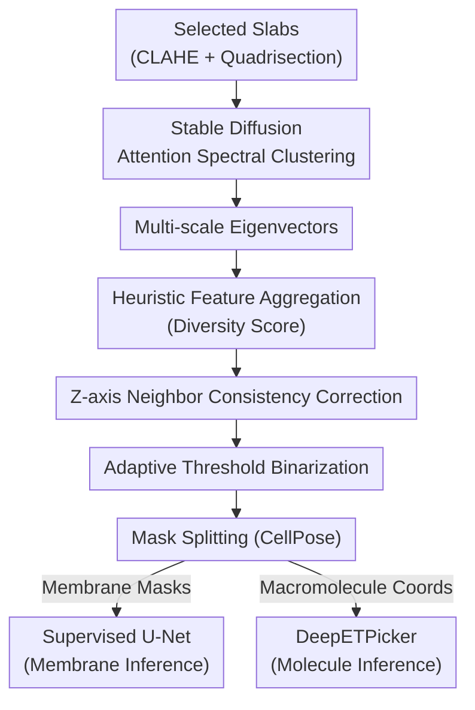

# Unsupervised Multi-Scale Segmentation of 3D Subcellular World with Stable Diffusion Foundation Model

**Conference**: CVPR 2026  
**Paper**: [CVF Open Access](https://openaccess.thecvf.com/content/CVPR2026/html/Uddin_Unsupervised_Multi-Scale_Segmentation_of_3D_Subcellular_World_with_Stable_Diffusion_CVPR_2026_paper.html)  
**Area**: 3D Vision / Unsupervised Segmentation  
**Keywords**: Cryo-electron tomography, unsupervised segmentation, Stable Diffusion features, spectral clustering, subcellular structures

## TL;DR
Without training or manual annotation, this work directly utilizes attention features from a pre-trained Stable Diffusion model for spectral clustering, combined with heuristic feature aggregation and adaptive thresholding. This framework segments multi-scale subcellular structures—ranging from large membranes to small ribosomes—in cryo-electron tomograms (cryo-ET). Downstream models trained on the resulting pseudo-labels approach the performance of expert manual annotations.

## Background & Motivation
**Background**: Cryo-electron tomography (cryo-ET) enables the simultaneous 3D visualization of large-scale membranes/organelles and small-scale macromolecular complexes (ribosomes, proteasomes, etc.) in their native cellular environment. Extracting biological information requires the segmentation of these subcellular structures, currently dominated by supervised 3D U-Net models like Membrain and DeePiCt.

**Limitations of Prior Work**: Supervised methods face three major hurdles. First, individual tomograms are massive (typically $4000 \times 4000 \times 2000$ voxels), making voxel-wise annotation slow and expensive. Second, a single model usually handles only one scale—either large membranes or small molecules—precluding unified multi-scale processing. Third, significant domain gaps exist between different experiments and samples; models trained on one cell type suffer severe performance drops on others.

**Key Challenge**: High-quality segmentation depends on large-scale annotation, yet cryo-ET labels are the most scarce and non-transferable resource—the performance ceiling of supervised learning is strictly bounded by the annotation bottleneck. Existing unsupervised methods for natural images (FreeSOLO, LOST, CutLER) fail entirely due to the vast domain difference between cryo-ET and natural images.

**Goal**: To develop a unified unsupervised segmentation framework that is scale-agnostic (membranes + macromolecules) and domain-agnostic (different experiments/species) without manual labeling, requiring only a few representative slices from the user to initialize.

**Key Insight**: It is observed that the attention layers of the pre-trained Stable Diffusion U-Net contain strong spatial localization information—the visual "where" pathway. Although trained almost exclusively on natural images, its query-key embeddings generalize well enough to characterize "objectness" (location and category count), allowing transfer to the disparate imaging modality of cryo-ET.

**Core Idea**: Treat Stable Diffusion as a training-free feature extractor. Perform spectral clustering on features from all attention layers to obtain eigenvectors, which are then converted into multi-scale masks using heuristic aggregation and adaptive thresholding tailored for cryo-ET. Finally, use these masks as pseudo-labels to train downstream models for full-dataset inference.

## Method

### Overall Architecture
The pipeline addresses the challenge of segmenting structures with vast scale differences without labels. The core mechanism is to "generate credible pseudo-labels using general features from foundation models, then scale this capability to the entire dataset." The workflow is: users select a few structure-rich slices (slabs) → apply CLAHE enhancement and quadrisection → extract features from Stable Diffusion attention layers followed by spectral clustering to obtain eigenvectors → aggregate eigenvectors into a feature map via a heuristic strategy and binarize using adaptive thresholds → split masks into "membrane" and "macromolecule" channels using CellPose → train a U-Net for membranes and a DeepETPicker for molecules using these pseudo-labels to infer the entire dataset. Note: Stable Diffusion and CellPose are off-the-shelf; the only "training" is gradient optimization on the eigenvectors.

### Key Designs

**1. Leveraging Stable Diffusion "Where" Pathway + All-layer Attention**

Cryo-ET images differ significantly from natural images. To bypass the lack of labels, query-key embeddings are extracted directly from all attention layers of the pre-trained Stable Diffusion conditional U-Net. Specifically, $512\times512$ quadrants are divided into $N=4096$ visual tokens (patch size 8). For each layer $l$, the $(Q_l, K_l)$ pairs are used to construct an affinity matrix:

$$A_l(i,j)=\exp\!\left(\frac{Q_l(i)\,K_l(j)^\top}{\sqrt{d}}\right)$$

Crucially, all 16 layers are used rather than just the last one. While methods like FreeSOLO/CutLER use only final-layer features, "objectness" is distributed across layers. Multi-scale structures in cryo-ET require complementary features: large membranes rely on shallow global structures, while small molecules rely on deep local textures. Stable Diffusion is chosen over ResNet/ViT because its query-key embeddings provide superior spatial cues.

**2. Cross-layer Spectral Clustering + Gradient Optimization**

Given a set of affinity matrices $\mathbf{A}=\{A_1,\dots,A_L\}$, spectral clustering extracts objectness into separable features. The standard eigenvalue problem for a single matrix is $(D-A)X=\lambda DX$. For multiple matrices, this is approximated as an optimization objective over the expectation:

$$\max_{X}\ \mathbb{E}_{A\in\mathbf{A}}\!\left[g(X)^\top D^{-1}A\,g(X)\right]\quad \text{s.t.}\quad X^\top X=\mathbf{I}$$

$X$ is treated as a learnable feature map and optimized via gradient descent (Adam, lr=0.002, 2000 steps) to minimize $\mathbb{E}_{A}\big|g(X)^\top D_A^{-1}A\,g(X)-1\big|+\|X^\top X-I\|_F$. Subsequent orthogonalization ensures different channels correspond to distinct structural components, yielding $C$ eigenvectors (reshaped to $64\times64$ maps).

**3. Diversity Score Driven Heuristic Aggregation**

To determine which eigenvectors correspond to subcellular structures, a "diversity score" is defined to quantify structural richness. A map $I$ is divided into patches $I_{ij}$, and the standard deviation of local standard deviations is calculated:

$$\mathrm{DiversityScore}(I)=\mathrm{std}\big(\{\sigma_{ij}\}\big)$$

The eigenvector with the highest score serves as the "base." Other maps are iteratively merged if they are similar to the base, increase the diversity score upon merging, and do not introduce excessive noise (measured by contour count). This greedy aggregation allows the capture of both membranes and molecules without noise interference.

**4. Z-axis Consistency Correction + Adaptive Thresholding**

Adjacent slices effectively capture the same structures. SSIM is used to measure similarity between adjacent aggregated maps. If slice $z$ differs from $z-1$ and $z+1$, but the neighbors are similar ($\mathrm{sim}(F^{z+1},F^{z-1})>0.9$ and $\mathrm{sim}(F^{z+1},F^{z})<0.8$), slice $z$ is replaced by the neighbor average. Otherwise, weighted smoothing is applied: $F^{z}=0.5F^{z}+0.25F^{z-1}+0.25F^{z+1}$. Gaussian adaptive thresholding (block size $b=15$, $C=3$) is then applied to generate binary masks $M$, effectively handling the high noise and uneven intensity of cryo-ET.

**5. Mask Splitting + Downstream Magnification**

Membranes (elongated surfaces) and macromolecules (small spheres) are split using pre-trained CellPose. Macromolecules are extracted directly as they resemble "cells" in the CellPose domain. The remaining foreground (membranes) is refined via morphological operations. Finally, the membrane masks train a U-Net (Dice + CE loss) and the molecule coordinates train a DeepETPicker to process the entire dataset.

### Loss & Training
Unsupervised optimization occurs only on the eigenvectors: Adam, lr=0.002, 2000 iterations on a single NVIDIA A5000. Downstream U-Net uses Dice + Cross-Entropy loss. DeepETPicker follows official configurations. Only 100 slices (1.33% of the S. Pombe dataset) were used as input for the pipeline.

## Key Experimental Results

### Main Results
Evaluation on S. Pombe cryo-ET data. Membrane segmentation is evaluated by Dice, and macromolecule localization by F1.

Membrane Segmentation Dice (VPP S. Pombe):

| Method | Type | TS_0008 (Train) | Overall |
|------|------|------|------|
| Supervised U-Net | Supervised | 0.665 | 0.324 |
| SAM | Off-the-shelf | 0.03 | 0.048 |
| FreeSOLO | Unsupervised | 0.002 | 0.003 |
| CutLER | Unsupervised | 0.007 | 0.003 |
| **Ours** | Unsupervised | 0.508 | **0.309** |

Ours achieves an Overall Dice of 0.309, only ~4% lower than the fully supervised U-Net (0.324). Natural image unsupervised methods (SAM, FreeSOLO, CutLER) fail completely (Dice ≤0.05).

Macromolecule Localization F1 ($n$ = number of expert labels):

| Method | Training Coords | Overall F1 |
|------|------|------|
| CrYOLO | n=500 | 0.31 |
| DeepETPicker | n=100 | 0.35 |
| DeepETPicker | n=500 | 0.57 |
| **Ours** | 88 Pseudo-coords | **0.43** |

Ours achieves F1=0.43 using 88 pseudo-labels, outperforming DeepETPicker trained on 100 ground truth labels (+22.84%) and CrYOLO on 500 labels (+38.71%).

### Ablation Study
Key findings from ablation (Supp. Mat. S11):
- **All-layer Attention**: Necessary for multi-scale complementarity; using only the last layer results in significant information loss.
- **Stable Diffusion vs. Others**: SD features provided the highest quality "where" cues compared to other VFMs.
- **Z-axis Correction**: Vital for correcting erroneous feature maps and ensuring volumetric continuity.

### Key Findings
- **Approaching Supervision**: Membrane segmentation performance is within 4% of supervised models without any manual labels.
- **Pseudo-label Efficiency**: 88 pseudo-labels can outperform 100 expert labels, suggesting that the spatial coverage of pseudo-labels compensates for individual coordinate precision.
- **Cross-domain Value**: Successfully segmented actin filaments in C. Elegans and human RPE cells where supervised models failed to generalize.

## Highlights & Insights
- **Generative Models for Discriminative Tasks**: Using Stable Diffusion for segmentation leverages spatial positioning in its attention maps—a strong example of VFM task re-purposing.
- **Diversity Score**: A lightweight yet effective heuristic for structural richness that naturally handles multi-scale co-occurrence.
- **All-layer Complementarity**: Explicitly using multiple layers to address multi-scale needs is a valuable strategy for any VFM-based segmentation feature extraction.
- **Efficiency Paradox**: Using 1.33% of slices as a lever for the whole volume is a practical engineering template for massive 3D scientific data.

## Limitations & Future Work
- **Coarse Classification**: Only distinguishes "membranes" and "molecules" by intensity/morphology; fine-grained organelle classification (e.g., ER vs. Mitochondria) requires further post-processing.
- **Computational Cost**: Eigenvector optimization takes 7–8 minutes per slab on one GPU, presenting a bottleneck for large slab selections.
- **Evaluation Bias**: Quantitative results primarily rely on the S. Pombe dataset (the only fully annotated one); cross-species verification remains qualitative.

## Related Work & Insights
- **vs FreeSOLO / CutLER**: Those methods use only last-layer features and fail (Dice ≈0.003) on cryo-ET, highlighting the need for domain-specific cross-layer aggregation.
- **vs Supervised Models**: Eliminates the need for per-experiment training and manual annotation while maintaining comparable performance.
- **vs SAM**: Off-the-shelf SAM performs poorly (0.048 Dice), proving that general segmentation models cannot solve multi-scale cryo-ET segmentation out of the box.

## Rating
- **Novelty**: ⭐⭐⭐⭐⭐ First use of Stable Diffusion all-layer attention + spectral clustering for multi-scale unsupervised cryo-ET segmentation.
- **Experimental Thoroughness**: ⭐⭐⭐⭐ Strong quantitative vs. supervised benchmarks and cross-domain qualitative proof, though quantitative cross-domain data is limited.
- **Writing Quality**: ⭐⭐⭐⭐ Clear logic and formulas; heuristic conditions are well-justified.
- **Value**: ⭐⭐⭐⭐⭐ Directly addresses the cryo-ET annotation bottleneck with a framework that approaches supervised performance.

<!-- RELATED:START -->

## Related Papers

- [\[CVPR 2026\] WonderZoom: Multi-Scale 3D World Generation](wonderzoom_multi-scale_3d_world_generation.md)
- [\[CVPR 2026\] Unsupervised Monocular 3D Keypoint Discovery from Multi-View Diffusion Priors](unsupervised_monocular_3d_keypoint_discovery_from_multi-view_diffusion_priors.md)
- [\[CVPR 2026\] PatchScene: Patch-based Voxel Diffusion Model for Large-Scale Scene Completion](patchscene_patch-based_voxel_diffusion_model_for_large-scale_scene_completion.md)
- [\[CVPR 2026\] OLATverse: A Large-scale Real-world Object Dataset with Precise Lighting Control](olatverse_a_large-scale_real-world_object_dataset_with_precise_lighting_control.md)
- [\[CVPR 2026\] Iris: Bringing Real-World Priors into Diffusion Model for Monocular Depth Estimation](iris_bringing_realworld_priors_into_diffusion_model_for_monocular_depth_estimation.md)

<!-- RELATED:END -->
