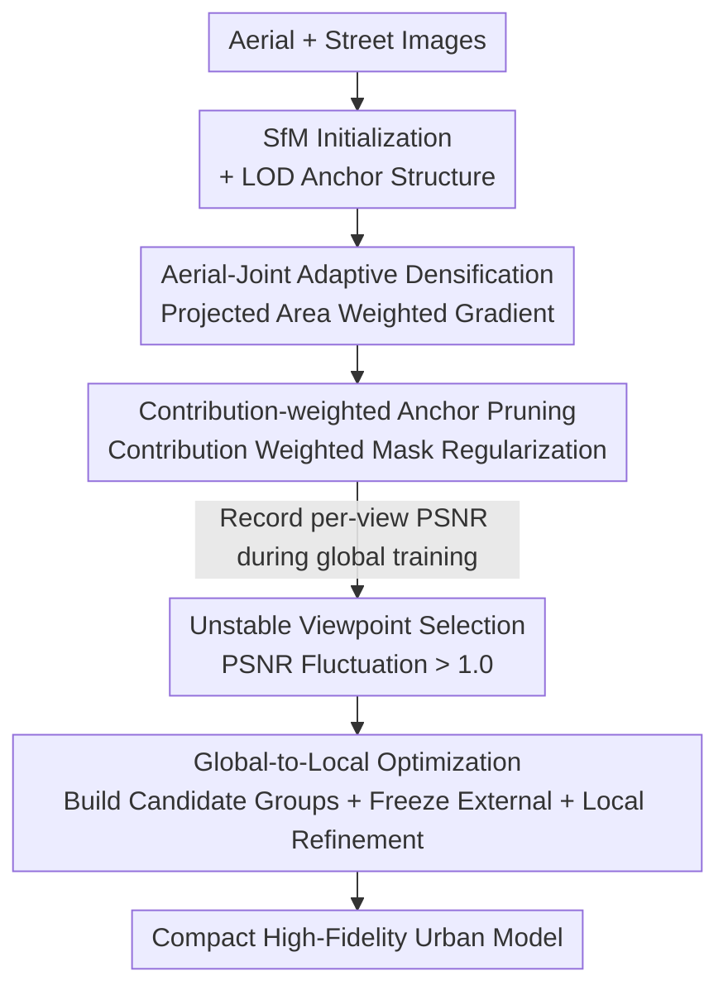

# Urban-GS: A Unified 3D Gaussian Splatting Framework for Compact and High-Fidelity Aerial-to-Street Reconstruction

**Conference**: CVPR 2026  
**Paper**: [CVF Open Access](https://openaccess.thecvf.com/content/CVPR2026/html/Wang_Urban-GS_A_Unified_3D_Gaussian_Splatting_Framework_for_Compact_and_CVPR_2026_paper.html)  
**Code**: To be confirmed  
**Area**: 3D Vision  
**Keywords**: 3D Gaussian Splatting, urban reconstruction, aerial-street joint, adaptive densification, anchor pruning

## TL;DR
Urban-GS unifies drone aerial viewpoints and street-level viewpoints into a single 3D Gaussian Splatting framework. It employs "projected area weighted densification + contribution weighted anchor pruning + global-to-local two-stage optimization" to simultaneously address cross-view scale conflicts, memory explosion, and under-optimized regions. It outperforms the SOTA Horizon-GS in rendering quality across multiple urban scenes while reducing anchor storage by an average of 41%.

## Background & Motivation

**Background**: 3DGS enables real-time high-fidelity rendering of urban scenes, but most methods rely on a **single type of viewpoint**—either purely aerial (e.g., CityGaussian, DoGaussian) or purely street-level (e.g., Hierarchical-3DGS). Aerial views provide large-scale global geometry, while street views provide ground details; the two are naturally complementary.

**Limitations of Prior Work**: Models trained on a single viewpoint type exhibit significant needle-like artifacts and blurriness when the rendering viewpoint deviates significantly from the training viewpoints (e.g., switching from aerial top-down to street-level eye-level, or large horizontal/vertical translations). To achieve a unified urban model for seamless navigation across aerial and ground views, these two types of viewpoints must be reconstructed **jointly**. However, joint training introduces three difficult problems: ① Extreme differences in scene detail scales between viewpoint types lead to **gradient accumulation conflicts** during densification, preventing Gaussians from growing where they should; ② Capturing multi-scale details requires a massive number of Gaussians, leading to **explosive memory and computational overhead**; ③ Highly unbalanced viewpoint distribution and occlusions leave some areas chronically **under-supervised**, making them difficult to optimize even with extended training.

**Key Challenge**: The authors discovered a counter-intuitive phenomenon: **merging** aerial and street views for densification yields worse results than using **aerial-only** or **street-only** views (see Tab. 1). This indicates the problem is not a "lack of information," but rather that existing densification criteria (a **simple average** of position gradients across all views) suppress Gaussians that have high contribution in some views but are nearly invisible in others.

**Goal**: To resolve cross-view densification conflicts, compress storage, and remediate under-optimized regions within a single framework.

**Key Insight**: The authors investigated the counter-intuitive phenomenon and found that "aerial/street" labels are irrelevant to the radiance field itself. The actual driver is the **drastic change in the projected radius (area) of Gaussians**. Differences in observation distance cause the projected area of the same Gaussian to vary greatly across views, and simple gradient averaging masks local high contributions.

**Core Idea**: Use "projected area" as a weight to re-weight gradients and pruning criteria, allowing densification and pruning decisions to be based on "actual contribution" rather than "viewpoint labels" or "simple averages." An additional PSNR fluctuation-driven local refinement stage is added to compensate for under-optimized regions.

## Method

### Overall Architecture
Urban-GS takes aerial and street image sets as input and initializes anchors with an LOD structure via SfM (based on the structured representation of Scaffold-GS, where each anchor decodes $k$ neural Gaussians). Training is divided into **two main stages**:

- **Global Training**: Joint modeling on all viewpoints. Two modules collaborate: **Aerial-Joint Adaptive Densification (AJAD)** ensures "growth in necessary areas," and **Contribution-weighted Anchor Pruning (CAP)** "removes useless anchors," resulting in a high-quality, memory-efficient global model. Meanwhile, the PSNR curve of each viewpoint is continuously recorded.
- **Local Refinement**: After global training, "unstable viewpoints" are identified based on PSNR fluctuations. A candidate viewpoint group sharing anchors is built for each unstable viewpoint. Parameters outside the group are frozen during targeted local optimization to remediate under-optimized areas.

### Key Designs

**1. Aerial-Joint Adaptive Densification (AJAD): Reclaiming suppressed Gaussians via projected area weighting**

The bottleneck stems from the counter-intuitive phenomenon: merging aerial and street views for densification is inferior to single-view densification. The authors quantified this in Tab. 1 and identified the root cause via gradient/projected radius distribution plots (Fig. 3): several neural Gaussians have high gradients in aerial views (sufficient to trigger densification) but near-zero gradients in street views. The original 3DGS criterion (Eq. 3) calculates a **simple arithmetic average** of position gradients across all views. These Gaussians are pulled down by low-gradient views, dropping the total mean below the threshold $\tau_{pos}$, preventing necessary densification. Further analysis shows that position gradient magnitude is essentially proportional to the **projected area** of the Gaussian (covering more pixels), and drastic changes in projected area stem from the massive difference in observation distances between aerial and street views.

The solution is to average gradients weighted by the projected area (approximated by the number of contributing pixels $|P_i^v|$), giving "near-distance large-projection" views a greater say in the densification decision for that Gaussian:

$$\frac{\sum_{v\in V}|P_i^v|\cdot\sqrt{\left(\sum_{p\in P_i^v}\frac{\partial L_p^v}{\partial \mu_{i,x}^v}\right)^2+\left(\sum_{p\in P_i^v}\frac{\partial L_p^v}{\partial \mu_{i,y}^v}\right)^2}}{\sum_{v\in V}|P_i^v|}>\tau_{pos}$$

This improvement discards manual "aerial/street" labels in favor of scale itself. The authors note that scale conflicts exist not just between aerial and street views, but also **within aerial views** (different altitudes) and **within street views** (foreground vs. background). Thus, the "two-stage sampling by viewpoint type" used in Horizon-GS is an oversimplification, whereas area weighting is a more fundamental and general approach.

**2. Contribution-weighted Anchor Pruning (CAP): Protecting "sparse but critical" anchors from global deletion**

Capturing multi-scale details requires many anchors, leading to memory explosion and necessitating pruning. The authors combine structured representation with a learnable probability mask: each anchor $a$ is assigned a learnable mask score, and a differentiable binary $M_a\in\{0,1\}$ is sampled via Gumbel-Softmax and multiplied into alpha-blending (Eq. 7). Anchors with $M_a=0$ do not participate in rendering and are pruned if they remain zero. MaskGaussian originally used a global regularization $L_{mask}=(\frac{1}{N}\sum_i M_i)^2$ to suppress masks.

However, in aerial-street joint scenes, many details are inherently **view-specific and sparsely visible**: fine street-level ground details are invisible from the air, and large areas visible from the air are often occluded at street level. Global mask regularization might mistakenly prune these locally critical anchors due to their "low observation frequency," even if they are vital for local details. The authors modify the regularization to be **contribution-weighted**: first, the contribution $w_i^v$ of a neural Gaussian in a view is defined as the ratio of its $T\cdot\sigma$ on contributing pixels to the maximum $T\cdot\sigma$ of those pixels (Eq. 9). These are aggregated by projected area to get $w_i$ (Eq. 10). The final regularization is:

$$L_m=\frac{1}{kN}\sum_{i=1}^{kN}(1-w_i)m_i$$

Anchors with higher contribution ($w_i$) have smaller $(1-w_i)$, meaning they face a smaller penalty for their mask being high and are more likely to be preserved. This allows aggressive pruning of redundant anchors with a larger loss weight $\lambda_m$ while safely retaining high-contribution anchors. In ablation, using $\lambda_m=0.003$ resulted in higher quality and fewer anchors than MaskGaussian with $\lambda_m=0.001$.

**3. Global-to-Local Optimization (GLO): Locating under-optimized regions via PSNR fluctuations**

Unbalanced viewpoint distribution and occlusion cause global training with uniform sampling to suffer from imbalance, where "some views fit well, while others never do." The key observation is that under-optimized regions exhibit **persistent PSNR fluctuation rather than convergence** in late-stage training. Thus, the PSNR of each viewpoint is monitored during global training; a viewpoint is judged as an **unstable viewpoint** $v_{us}$ if the maximum difference among the last three recorded values exceeds 1.0.

For each unstable viewpoint, an optimization group $V_{us}$ is built: candidate viewpoints are included if they share enough rendered anchors with the target viewpoint:

$$\frac{|A_{target}\cap A_{candidate}|}{\min(|A_{target}|,|A_{candidate}|)}>\tau_{group}$$

where $A$ is the set of anchors contributing to the rendered view. During local refinement, each group is optimized **independently** for a fixed number of iterations, sampling only from within the group. To prevent catastrophic forgetting, **all MLP parameters and anchors outside the target set $A_{target}$ are frozen**, allowing only target anchors and newly generated local anchors to be trainable. This "focus on under-optimized areas" sampling stabilizes gradient accumulation and parameter updates, being far more effective than simply training for 20k more steps with uniform sampling (see Tab. 8).

### Loss & Training
The framework follows Horizon-GS with $L_1$, $L_{ssim}$, and the volume regularization $L_{vol}$ from Scaffold-GS. It adds depth supervision $L_d=\frac{1}{hw}\sum|D-\hat D|$ to ensure Gaussians cover the complete geometry, and an alpha-mask regularization $L_o$ (Eq. 13) to suppress artifacts from the sky, moving vehicles, and pedestrians. Combined with the proposed mask regularization $L_m$, the total objective is:

$$L=L_1+\lambda_{ssim}L_{ssim}+\lambda_{vol}L_{vol}+\lambda_d L_d+\lambda_o L_o+\lambda_m L_m$$

Total training is 100k iterations: 80k global (densification stops at 40k) + 20k local (densification stops at 10k). In the first 10k of the local stage, each group is optimized independently for 200 iterations/group; the final 10k returns to uniform sampling. $\lambda_m=0.003$, $\tau_{group}=0.1$. Training is performed on a single A100-80G; rendering speed is measured on an RTX 4090.

## Key Experimental Results

### Main Results
Comparison of novel view rendering on 5 urban scenes from the Horizon-GS dataset (selected PSNR/SSIM/LPIPS):

| Scene | Metrics | Horizon-GS (SOTA) | Urban-GS (Ours) |
|------|------|-------------------|-----------------|
| Colosseum | PSNR / SSIM / LPIPS | 26.16 / 0.898 / 0.135 | **26.88 / 0.913 / 0.132** |
| Elvenruin | PSNR / SSIM / LPIPS | 28.10 / 0.875 / 0.155 | **28.78 / 0.899 / 0.128** |
| Citysample | PSNR / SSIM / LPIPS | 26.46 / 0.854 / 0.224 | **27.66 / 0.886 / 0.185** |
| Road | PSNR / SSIM / LPIPS | 21.40 / 0.657 / 0.349 | **21.72 / 0.691 / 0.312** |
| Park | PSNR / SSIM / LPIPS | 22.64 / 0.710 / 0.304 | **22.87 / 0.722 / 0.288** |

Efficiency comparison (fewer anchors is better, higher FPS is better):

| Scene | Horizon-GS Anchors / FPS | Urban-GS Anchors / FPS |
|------|----------------------|--------------------|
| Colosseum | 2332k / 64.7 | **1801k / 83.3** |
| Elvenruin | 2903k / 57.2 | **1856k / 95.8** |
| Road | 6071k / 67.9 | **2712k / 89.8** |
| Park | 9756k / 42.2 | **2143k / 83.1** |

SSIM/LPIPS (closer to human perception) lead significantly, anchors are reduced by 41% on average, and FPS is markedly improved. On the UC-GS dataset, except for PSNR being slightly lower than Horizon-GS in a few scenarios like View(+1m), SSIM/LPIPS remain superior with clearer details.

### Ablation Study
Main component ablation (Average of Elvenruin/Citysample/Road):

| Config | PSNR↑ | SSIM↑ | LPIPS↓ | Anchors↓ | Description |
|------|-------|-------|--------|----------|------|
| Baseline | 25.20 | 0.797 | 0.257 | 2774k | Start point |
| + AJAD | 25.66 | 0.820 | 0.209 | 9713k | Densification recovers details; quality jumps but anchors surge |
| + CAP | 25.50 | 0.815 | 0.216 | 2785k | Anchors cut from 9713k to 2785k; quality drop is minimal |
| + GLO | **26.05** | **0.825** | **0.208** | **2682k** | Local refinement boosts quality further; anchors decrease slightly |

Densification strategy comparison (replacing AJAD):

| Config | PSNR↑ | SSIM↑ | LPIPS↓ | Description |
|------|-------|-------|--------|------|
| Base (3DGS Criterion) | 25.20 | 0.797 | 0.257 | Simple gradient average |
| w/ Hier-GS (Max Gradient) | 25.47 | 0.813 | 0.213 | Sensitive to outlier gradients |
| w/ Abs-GS (Same-dir Grad) | 25.25 | 0.806 | 0.229 | Does not account for projected area changes |
| w/ ours (Area-weighted) | **25.66** | **0.820** | **0.209** | Best performance |

### Key Findings
- **AJAD and CAP form an "Expansion-Contraction" duo**: AJAD ensures necessary densification occurs, causing anchors to surge from 2774k to 9713k while quality improves significantly; CAP immediately prunes redundant anchors back to 2785k without significant quality loss. Both are indispensable—densification alone explodes memory, and pruning alone cannot recover details.
- **Contribution-weighted pruning tolerates higher pruning intensity**: With $\lambda_m=0.003$, naive MaskGaussian quality collapsed (PSNR 24.99), whereas the proposed method saw only a slight dip (PSNR 25.50) while using fewer anchors and outperforming the $\lambda_m=0.001$ version of MaskGaussian. This proves "retention by contribution" is more reliable than "retention by observation frequency."
- **Under-optimized zones require targeted sampling, not more iterations**: Compared to GLO, simply training 20k extra steps with uniform sampling (PSNR 25.59) yielded almost no gain, while GLO provided clear benefits (PSNR 26.05), validating that "allocating attention to difficult zones" is more effective than "generic over-training."
- **SSIM/LPIPS leads are larger than PSNR leads**: The authors emphasize these metrics align better with human perception, corresponding visually to fewer needle-like artifacts and less blurriness in details like storefronts and railings.

## Highlights & Insights
- **Reducing "viewpoint type" problems to "projected area" problems**: The most significant "aha" moment is that the authors did not stop at the surface conclusion of "aerial-street scale conflict." Instead, they used gradient/projected radius distributions to prove the actual variable is projected area. This refutes the viewpoint-type-based stage assumption of Horizon-GS, yielding a criterion that generalizes to **intra-viewpoint scale changes**.
- **Unified application of area weighting**: The weighting logic using $|P_i^v|$ is applied consistently in both Eq. 6 (densification) and Eq. 10 (pruning aggregation), providing an elegant and unified mechanism.
- **PSNR fluctuation as an "under-optimization detector"**: Using fluctuations in the existing PSNR curves during training to unsupervisedly locate difficult viewpoints avoids the need for extra labels or uncertainty modeling. This lightweight signal could be repurposed for active-learning-style sample scheduling.
- **Local refinement with external frozen parameters**: Implementating "fine-tune local while preserving global" by freezing MLP parameters and anchors outside the target set is a clean solution to catastrophic forgetting.

## Limitations & Future Work
- **High training cost**: 100k iterations on a single A100-80G, with anchors surging to nearly 10 million (9713k) during global densification, creates high peak memory pressure. The two-stage process and group optimization also complicate the training pipeline.
- **Reliance on manual thresholds**: Criteria for unstable viewpoints (PSNR diff > 1.0), view group threshold $\tau_{group}=0.1$, and $\gamma_{scale}$ are hand-tuned hyperparameters. The paper lack a discussion on their sensitivity across scenes, which might require re-tuning for significantly different datasets.
- **Static scene assumption**: While alpha-mask regularization suppresses moving vehicles, pedestrians, and the sky, the underlying reconstruction remains static. Dynamic urban elements are "masked out" rather than modeled.
- **Future Directions**: Exploring continuous, adaptive-threshold densification scheduling; replacing manual grouping thresholds with uncertainty or geometric priors; and making local refinement incremental/online to reduce the extra overhead of a separate second stage.

## Related Work & Insights
- **vs. Horizon-GS**: Both perform aerial-street joint reconstruction. Horizon-GS treats aerial and street views as independent sets using a coarse-to-fine approach (aerial for coarse geometry, street for details) with fixed sampling. The proposed method argues this ignores **intra-class scale changes** and that fixed sampling limits generalization, instead using area-weighted densification + contribution pruning + local refinement for a win-win in quality and efficiency (-41% anchors, higher FPS).
- **vs. UC-GS**: UC-GS introduces cross-view uncertainty to enhance detail in extrapolated views but cannot handle large scale changes between aerial and ground views; the proposed method designs criteria specifically for these scale changes.
- **vs. Hier-GS / Abs-GS (Densification)**: Hier-GS uses max gradients, which are sensitive to outliers. Abs-GS uses directional gradients to solve large Gaussian densification but ignores projected area shifts. Area weighting is superior in aerial-street scenarios.
- **vs. MaskGaussian (Pruning)**: MaskGaussian uses global mask regularization based on observation frequency, which may delete sparse but critical local anchors. The proposed contribution-weighted regularization decides based on "actual contribution to local details," allowing for more aggressive pruning.

## Rating
- Novelty: ⭐⭐⭐⭐ Reframing aerial-street scale conflict as a projected area problem and applying it to densification and pruning is insightful. However, it builds on existing components from Scaffold-GS, MaskGaussian, and Horizon-GS.
- Experimental Thoroughness: ⭐⭐⭐⭐ Extensive comparison on 7 scenes across two datasets + component-wise ablation + detailed controls for densification/pruning/optimization. The primary weakness is the lack of systematic reports on training time and peak memory.
- Writing Quality: ⭐⭐⭐⭐ Clear narrative (counter-intuitive phenomenon → root cause analysis → solution) with well-supported figures. Some equations and symbols are slightly dense.
- Value: ⭐⭐⭐⭐ Unified aerial-street reconstruction is a practical demand for autonomous driving, digital twins, and AR-VR. The combination of higher quality and 41% storage reduction is highly practical, and the methodology provides transferable insights for multi-scale reconstruction.

<!-- RELATED:START -->

## Related Papers

- [\[CVPR 2026\] VAD-GS: Visibility-Aware Densification for 3D Gaussian Splatting in Dynamic Urban Scenes](vad-gs_visibility-aware_densification_for_3d_gaussian_splatting_in_dynamic_urban.md)
- [\[CVPR 2026\] Seele: A Unified Acceleration Framework for Real-Time Gaussian Splatting on Mobile Devices](seele_a_unified_acceleration_framework_for_real-time_gaussian_splatting_on_mobil.md)
- [\[CVPR 2026\] 3D Gaussian Splatting with Self-Constrained Priors for High Fidelity Surface Reconstruction](3d_gaussian_splatting_with_self-constrained_priors_for_high_fidelity_surface_rec.md)
- [\[CVPR 2026\] HyperGaussians: High-Dimensional Gaussian Splatting for High-Fidelity Animatable Face Avatars](hypergaussians_high-dimensional_gaussian_splatting_for_high-fidelity_animatable_.md)
- [\[CVPR 2026\] Uni3R: Unified 3D Reconstruction and Semantic Understanding via Generalizable Gaussian Splatting from Unposed Multi-View Images](uni3r_unified_3d_reconstruction_and_semantic_understanding_via_generalizable_gau.md)

<!-- RELATED:END -->
