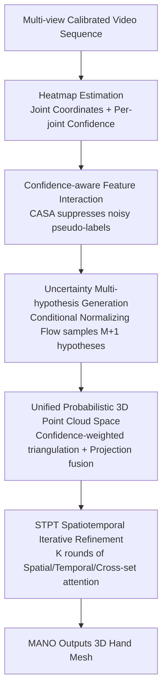

# UST-Hand: An Uncertainty-aware Spatiotemporal Point Cloud Interaction Network for 3D Self-supervised Hand Pose Estimation

**Conference**: CVPR2026  
**arXiv**: [2605.17742](https://arxiv.org/abs/2605.17742)  
**Code**: None  
**Area**: 3D Vision / Human Understanding  
**Keywords**: Self-supervised hand pose estimation, uncertainty modeling, normalizing flows, probabilistic point clouds, spatiotemporal attention

## TL;DR
UST-Hand utilizes conditional normalizing flows to model 2D hand joints from each view as a **probabilistic distribution** rather than deterministic points. By sampling multiple hypotheses and triangulating them into a unified probabilistic 3D point cloud space, followed by iterative refinement using a Spatiotemporal Point Transformer (STPT), the model reduces the Mean Per Vertex Position Error (MPVPE) by up to 37.8% relative to previous SOTAs under self-supervised settings with noisy 2D pseudo-labels.

## Background & Motivation
**Background**: 3D hand pose/mesh estimation performs well with large-scale accurately labeled data, but precise 3D hand annotations are extremely expensive and time-consuming. To remove annotation dependency, self-supervised methods (e.g., S2Hand, HaMuCo) use **pseudo-labels** produced by off-the-shelf 2D joint detectors for supervision—relying on "rendering output vs. input image discrepancy" or "multi-view consistency" as optimization signals to gradually refine the pose.

**Limitations of Prior Work**: 2D pseudo-labels exhibit significant noise (especially during occlusion or truncation), yet existing methods treat these pseudo-labels as **deterministic ground truth**. This allows noise to dominate training, leading to instability and overfitting to incorrect labels. Furthermore, most methods perform cross-view interaction in 2D visual space without fully exploiting fine-grained spatial correlations and temporal dynamics in 3D space.

**Key Challenge**: Single-view 2D estimation is inherently **ambiguous and uncertain** (the 2D-to-3D lifting is one-to-many). Deterministic methods "flatten" this uncertainty into a single point, discarding information for disambiguation and leaving no room for noise—if a pseudo-label in one view is wrong, the deterministic aggregation is biased (deterministic collapse).

**Goal**: ① Stabilize training under noisy supervision; ② Utilize multi-view and temporal cues within a continuous 3D space for pose disambiguation and fine-grained spatiotemporal modeling.

**Key Insight**: Rather than eliminating single-view uncertainty, it should be **preserved and explicitly modeled**. By representing each joint position as a probability distribution and sampling a set of hypotheses, "reliable views speak more, while occluded views speak less but still participate," allowing for mutual disambiguation in a unified probabilistic 3D space.

**Core Idea**: Model hand pose distributions using **Conditional Normalizing Flows**, sample multiple hypotheses, lift them into a **unified probabilistic 3D point cloud space**, and perform iterative refinement with a **Spatiotemporal Point Transformer**—replacing "deterministic points" with "probabilities" to combat pseudo-label noise.

## Method

### Overall Architecture
UST-Hand takes a set of **calibrated and synchronized** multi-view video sequences $\mathcal{I}=\{I_{v,t}\}$ ($V$ views, $T$ frames) and outputs 21 3D joints $\mathcal{J}^{3D}$ and 778 MANO mesh vertices $\mathcal{V}^{3D}$. During training, **only** pseudo-labels $\mathcal{J}^{2D}_{\text{pse}}$ from offline 2D detectors are used. The pipeline decouples "2D detection noise" and "3D lifting" into two collaborative stages: **(1) Probabilistic 2D Multi-hypothesis Generation**—using a CNN backbone for heatmaps and per-joint confidence, fusing cross-view features via confidence-aware interaction, and sampling joint hypotheses using conditional normalizing flows; **(2) 3D Point Cloud Spatiotemporal Interaction**—triangulating hypotheses into a unified probabilistic point cloud space, iteratively refining via STPT, and outputting meshes via MANO.

### Key Designs

**1. Confidence-Aware Spatiotemporal Architecture (CASA): Silencing low-quality pseudo-labels in cross-view aggregation**

A major flaw in deterministic methods is treating all views equally. UST-Hand uses a residual CNN backbone for multi-scale heatmaps, solving for coordinates $\mathbf{p}_i=\sum_{h_u,h_v}(h_u,h_v)\cdot\tilde{\mathbf{H}}_i$ and **confidence** $\text{conf}_i=\max(\mathbf{H}_i)$ (serving as a reliability indicator). Spatial-aware joint features $\mathbf{G}_{\text{pose}}$ and joint-aligned local features $\mathbf{G}_{\text{jaf}}$ are concatenated into $\mathbf{G}_{\text{init}}$. Confidence is **directly embedded into features** $\tilde{\mathbf{G}}=[\mathbf{G}_{\text{init}}\,\|\,\mathbf{c}]$ before self-attention. Low-confidence tokens naturally produce smaller query/key magnitudes and weaker affinity, thus their influence on the fusion result is **adaptively suppressed** without hard thresholding.

**2. Uncertainty Multi-hypothesis Generation: Replacing "points" with "hypothesis bundles"**

UST-Hand uses a conditional normalizing flow (RealNVP) to learn an **invertible mapping** between a latent prior $\mathbf{z}\sim\mathcal{N}(0,I)$ and 2D joint positions $\mathbf{x}$, conditioned on cross-view features $\mathbf{F}_{\text{fuse}}$: $\mathbf{x}=f_\theta(\mathbf{z};\mathbf{F}_{\text{fuse}})$. The conditional distribution is:

$$\hat{p}(\mathbf{x}\mid\mathbf{F}_{\text{fuse}})=p(\mathbf{z})\left|\det\frac{\partial f_\theta(\mathbf{z},\mathbf{F}_{\text{fuse}})}{\partial\mathbf{z}}\right|^{-1}.$$

The model maximizes log-likelihood $\log\hat{p}(\mathbf{x}_{\text{pse}}\mid\mathbf{F}_{\text{fuse}})$ during training. At inference, it samples $M+1$ hypotheses $\{\mathbf{x}_0;\mathbf{x}_r\}$. This predicts a **soft, continuous reliability distribution**, preventing noisy evidence from dominating aggregation and significantly improving training stability.

**3. Unified Probabilistic 3D Point Cloud Space: Lifting 2D uncertainty to a 3D geometric field**

The sampled hypotheses undergo **confidence-weighted DLT triangulation** to generate point clouds $\mathcal{P}=\{P_A;P_Q\}$ in world coordinates. The **anchor point cloud** $P_A$ (from $\mathbf{x}_r$) is **fixed** to preserve distributional uncertainty as an "evidence bank." The **query point cloud** $P_Q$ (from $\mathbf{x}_0$) is the refinement target. Perspective features are projected back and fused using a "Projection Fusion Module" to inject visual semantics into the geometric space.

**4. Spatiotemporal Point Transformer (STPT): Iterative refinement via spatial-temporal-cross-set attention**

STPT refines $P_Q$ through a dual-stage attention. **Spatial Self-Attention** captures intra-frame geometry using relative position encoding $\delta_s$. **Temporal Self-Attention** captures motion patterns across frames. Finally, **Cross-set Attention** allows query features to interact with the anchor point cloud $P_A$, introducing preserved distributional uncertainty into the final pose. This iterates $K$ times before the MANO layer generates the mesh.

### Loss & Training
The total loss consists of four weighted terms:
$$\mathcal{L}=\lambda_0\mathcal{L}_{\text{hmap}}+\lambda_1\mathcal{L}_{\text{hm2d}}+\lambda_2\mathcal{L}_{nll}+\lambda_3\mathcal{L}_{\text{proj2d}}.$$
$\mathcal{L}_{\text{hmap}}$ supervises heatmaps; $\mathcal{L}_{\text{hm2d}}$ supervises 2D joints; $\mathcal{L}_{nll}$ is the negative log-likelihood for the normalizing flow; $\mathcal{L}_{\text{proj2d}}$ projects refined points back to 2D seeking pseudo-label consistency, **weighted by $\text{conf}_i$** to further suppress noise. Hyperparameters: $\lambda_0=0.001, \lambda_1=10, \lambda_2=0.1, \lambda_3=10$.

## Key Experimental Results

### Main Results
Evaluated on HanCo (8 views), DexYCB-MV (8 views), and OakInk-MV (4 views) against HaMuCo (multi-view self-supervised SOTA) and Wilor (strong offline detector).

| Dataset | Metric | UST-Hand | HaMuCo | Gain |
|--------|------|---------|--------|------|
| HanCo | MPVPE↓ | **5.82** | 9.35 | −37.8% |
| HanCo | AUC-V↑ | **0.884** | 0.813 | +0.071 |
| DexYCB-MV | MPVPE↓ | **8.16** | 9.54 | −14.5% |
| OakInk-MV | MPVPE↓ | **10.02** | 13.04 | −23.2% |

### Ablation Study (HanCo, MPVPE)

| Configuration | MPVPE↓ | vs. Full Model | Note |
|------|--------|------|------|
| Full model | 5.82 | — | Complete UST-Hand |
| w/o heatmap (conf=1) | 6.42 | +10.3% | Removed confidence-weighted initialization |
| w/o projection fusion | 6.14 | +5.5% | 2D features only, no geo-visual correspondence |
| w/o STPT | 6.05 | +4.0% | No spatiotemporal iterative refinement |

### Key Findings
- **Confidence-weighted initialization is critical**: Setting confidence to 1 dropped performance by up to 17.3% (OakInk), validating the use of confidence to distinguish pseudo-label quality.
- **Robustness to pseudo-label quality**: Under low-quality OpenPose labels, UST-Hand outperformed HaMuCo by 14.8%. Deterministic methods overfit noise, while uncertainty modeling "denoises."
- **Advantage in sparse views**: In 2/4/6/8 view settings, MPJPE was consistently lower than HaMuCo by ~3mm, showing high robustness against deterministic collapse even with few views.

## Highlights & Insights
- **Paradigm shift: "Preserve" rather than "Eliminate" uncertainty**: Facing noisy supervision, this method avoids cleaning pseudo-labels and instead models them as distributions, using multi-view/temporal cues for evidence-based disambiguation.
- **Systemic Soft-Gating**: Confidence is used as a unified mechanism across CASA, triangulation, and loss weighting, allowing low-quality signals to be automatically downweighted.
- **Anchor-Query decoupling**: The anchor cloud preserves evidence while the query cloud converges on the solution. This "evidence pool + moving query" structure is transferable to other noisy 3D tasks.

## Limitations & Future Work
- **Strict multi-view calibration dependency**: The core strength relies on calibrated and synchronized cameras for triangulation and cross-view fusion.
- **Pseudo-label ceiling**: Performance is still bounded by detector quality; using 2D GT supervision significantly outperforms pseudo-labels.
- **Computational cost**: Sampling $M+1$ hypotheses and $K$ iterations of STPT increases complexity; sensitivity analysis for these hyperparameters was not fully provided.

## Related Work & Insights
- **vs. HaMuCo**: While both use multi-view self-supervision, HaMuCo operates in 2D visual space with deterministic labels. UST-Hand's probabilistic 3D point cloud approach is significantly more robust (MPVPE −37.8%).
- **vs. Normalizing Flow methods**: Previous applications of multiple hypotheses often targeted 2D-to-3D lifting; UST-Hand is unique in lifting these into a **global probabilistic point cloud** for spatiotemporal disambiguation.

## Rating
- Novelty: ⭐⭐⭐⭐⭐
- Experimental Thoroughness: ⭐⭐⭐⭐
- Writing Quality: ⭐⭐⭐⭐
- Value: ⭐⭐⭐⭐⭐

<!-- RELATED:START -->

## Related Papers

- [\[CVPR 2026\] PAD-Hand: Physics-Aware Diffusion for Hand Motion Recovery](pad-hand_physics-aware_diffusion_for_hand_motion_recovery.md)
- [\[CVPR 2026\] Rethinking Pose Refinement in 3D Gaussian Splatting under Pose Prior and Geometric Uncertainty](rethinking_pose_refinement_in_3d_gaussian_splatting_under_pose_prior_and_geometr.md)
- [\[CVPR 2026\] SCAPO: Self-Supervised Category-Level Articulated Pose Estimation from a Single 3D Observation](scapo_self-supervised_category-level_articulated_pose_estimation_from_a_single_3.md)
- [\[CVPR 2026\] ForeHOI: Feed-forward 3D Object Reconstruction from Daily Hand-Object Interaction Videos](forehoi_feed-forward_3d_object_reconstruction_from_daily_hand-object_interaction.md)
- [\[CVPR 2026\] Glove2Hand: Synthesizing Natural Hand-Object Interaction from Multi-Modal Sensing Gloves](glove2hand_synthesizing_natural_hand-object_interaction_from_multi-modal_sensing.md)

<!-- RELATED:END -->
