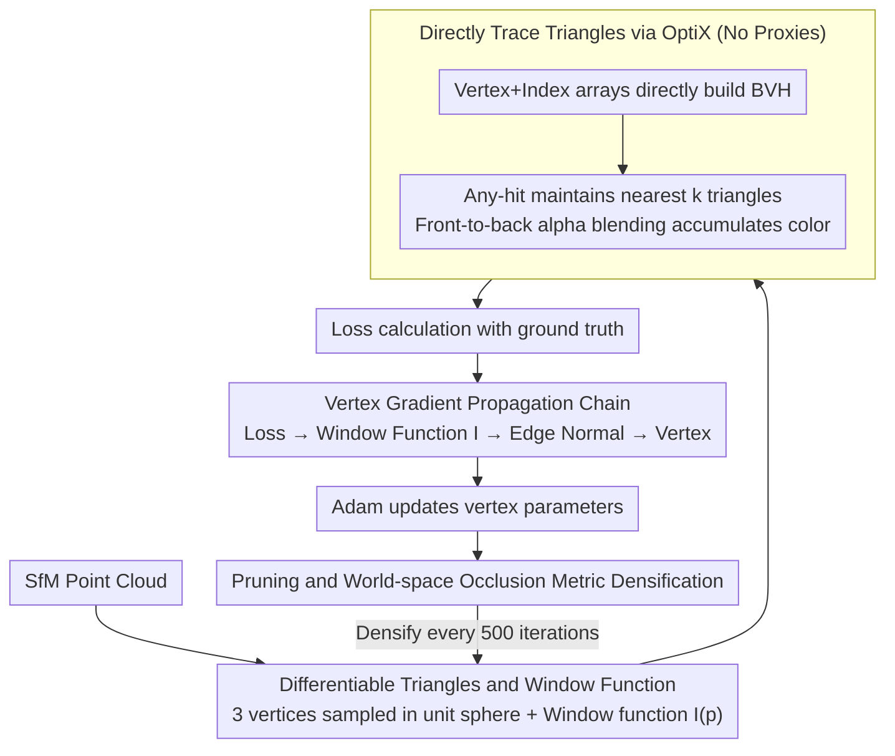

# UTrice: Unifying Primitives in Differentiable Ray Tracing and Rasterization via Triangles for Particle-Based 3D Scenes

**Conference**: CVPR 2026  
**arXiv**: [2512.04421](https://arxiv.org/abs/2512.04421)  
**Code**: [https://github.com/waizui/UTrice](https://github.com/waizui/UTrice)  
**Area**: 3D Vision  
**Keywords**: Differentiable Ray Tracing, Triangle Primitives, 3D Gaussian Splatting, Novel View Synthesis, BVH Acceleration

## TL;DR

UTrice proposes replacing Gaussian ellipsoids with triangles as a unified primitive for differentiable ray tracing, enabling direct triangle tracing within OptiX BVH without proxy geometries. While maintaining real-time rendering performance, it significantly outperforms 3DGRT in rendering quality and is naturally compatible with triangles optimized by the rasterization method Triangle Splatting, achieving primitive unification between rasterization and ray tracing.

## Background & Motivation

**Background**: 3D Gaussian Splatting (3DGS) has become a mainstream method for novel view synthesis due to its excellent rendering quality and real-time performance. Subsequent works like 2DGS replace 3D Gaussians with 2D planar Gaussian disks, and Triangle Splatting (3DTS) further utilizes triangles, continuing to improve fidelity and training speed. Meanwhile, ray tracing, a classic technique in computer graphics, enables physically realistic effects such as depth of field, refraction, and ambient lighting. 3DGRT was the first to introduce ray tracing into the 3DGS framework.

**Limitations of Prior Work**: The core issue of 3DGRT is that Gaussian kernels are defined on infinitely smooth convex supports and cannot serve directly as geometric primitives for BVH. Consequently, 3DGRT must construct an icosahedron as a proxy geometry for each Gaussian particle to enclose it before performing ray intersection tests. This introduces significant overhead: proxy construction consumes memory, BVH construction time accounts for a large portion of the total runtime, and custom intersection tests increase implementation complexity.

**Key Challenge**: Gaussian particles themselves are unsuitable as a unified primitive for both ray tracing and rasterization. Rasterization methods can project and then sort-blend, but ray tracing requires precise geometric intersections within a BVH. The unbounded nature of Gaussians forces a reliance on proxy geometries, leading to two rendering pipelines using different primitive representations that cannot be unified.

**Goal**: (1) Eliminate the dependency on proxy geometries in ray tracing to reduce BVH construction and intersection testing costs; (2) Achieve a single primitive for both rasterization and ray tracing to allow seamless integration between the two pipelines; (3) Maintain or improve rendering quality while sustaining real-time performance.

**Key Insight**: Inspired by Triangle Splatting, triangles are the most universal primitives in computer graphics, naturally supporting BVH acceleration structures and hardware ray tracing without any proxy geometry. If triangles can be converted into differentiable, optimizable primitives for ray tracing, all aforementioned issues can be resolved simultaneously.

**Core Idea**: Use differentiable triangles to directly replace Gaussians and proxy geometries as ray tracing primitives. Through a carefully designed window function and gradient propagation chain, end-to-end optimization of triangles is achieved in the ray tracing pipeline, while maintaining natural compatibility with the rasterization pipeline.

## Method

### Overall Architecture

The UTrice workflow is as follows: The input is an SfM point cloud. First, triangles are initialized (sampling three vertices within a unit sphere) according to the Triangle Splatting approach. Then, the index buffer for these triangles is calculated, and the vertex arrays and index buffer are passed directly to OptiX to build the BVH. In the ray tracing stage, each ray uses a $k$-element buffer to record the information of the $k$ nearest intersected triangles, iteratively processing until a termination condition is met. After calculating the loss between the rendering results and the ground truth, gradients are backpropagated to triangle parameters via a custom CUDA kernel and updated using the Adam optimizer. Pruning and world-space densification periodically adjust the triangle distribution. The entire training iterates in this loop—no proxy geometries are required throughout, as triangles serve directly as the primitives within the BVH.

### Key Designs

**1. Differentiable Triangles and Window Function: Turning hard-edged triangles into optimizable primitives with smooth gradients**

Triangles are originally hard-edged geometries—either a hit or a miss—making it impossible to derive derivatives with respect to their shape. UTrice assigns a set of continuous parameters to each triangle: three vertices $\mathbf{v}_1, \mathbf{v}_2, \mathbf{v}_3 \in \mathbb{R}^3$, spherical harmonic encoded color $c$ (degree 3), a smoothing factor $\sigma$, and opacity $o$. At a point $\mathbf{p}$ where a ray $r_o + t r_d$ intersects the triangle plane, a window function is defined to turn a "hit" into a continuous response with gradients:

$$I(\mathbf{p}) = \text{ReLU}\left(\frac{\phi(\mathbf{p})}{\phi(\mathbf{s})}\right)^\sigma$$

Where $\mathbf{s}$ is the triangle incenter, and $\phi(\mathbf{p}) = \max_{i \in \{1,2,3\}} L_i(\mathbf{p})$, where $L_i(\mathbf{p}) = \mathbf{n}_i \cdot \mathbf{p} + d_i$ is the signed distance from $\mathbf{p}$ to the $i$-th edge. This function is 1 at the incenter, 0 on the three edges, and 0 outside the triangle. The smoothing factor $\sigma$ controls the internal decay rate: as $\sigma \to 0$, the triangle is nearly solid; as $\sigma$ increases, the response becomes more sensitive to position. A key difference is that it is defined in world space rather than the image space of 3DTS. The authors prove that $I$ remains invariant under linear transformations for the same $\sigma$. Thus, triangles optimized via 3DTS rasterization can be fed directly into the UTrice ray tracer, providing the mathematical basis for "primitive unification."

**2. Direct Triangle Tracing on OptiX: Eliminating proxy geometries and custom intersection tests**

The difficulty in 3DGRT lies in the fact that Gaussian kernels have no boundaries and cannot enter a BVH directly, necessitating icosahedron proxies and custom intersection tests. By switching to triangles, this burden disappears: OptiX requires only vertex arrays and index buffers to build a BVH, as triangles are native primitives of hardware ray tracing. The Ray Generation program casts rays, and the Any-hit program uses insertion sort to maintain the $k$ nearest triangles along the ray direction, accumulating colors via front-to-back alpha blending:

$$\mathcal{C} = \sum_{i=1}^{N} T_i \alpha_i c_i, \quad T_i = \prod_{j=1}^{i-1}(1 - \alpha_j)$$

Termination occurs when cumulative transmittance falls below a threshold or all triangles are traversed. This saves memory and BVH construction overhead from proxy geometries and eliminates custom bounding box logic. Furthermore, the interface accepts only ray origin and direction arrays, decoupling it from camera models and naturally allowing extension to LiDAR, fisheye, and other non-pinhole imaging.

**3. Vertex Gradient Propagation Chain: Allowing loss to drive triangle rotation and scaling directly**

Triangles do not have explicit position or scale parameters like Gaussians; all geometric information is hidden in the three vertices. Thus, the optimizer must be able to backpropagate rendering loss all the way to vertex coordinates. UTrice establishes a propagation chain: loss $\to$ window function $I$ $\to$ edge normal $\mathbf{n}_i$ $\to$ vertex $\mathbf{v}_i$, where edge normals are constructed via cross products:

$$\mathbf{N}_i = [(\mathbf{v}_i - \mathbf{v}_{i+2}) \times (\mathbf{v}_{i+1} - \mathbf{v}_{i+2})] \times (\mathbf{v}_{i+1} - \mathbf{v}_i)$$

Normalization yields $\mathbf{n}_i = \mathbf{N}_i / \|\mathbf{N}_i\|$. When $\sigma > 0$, the response varies across the interior of the triangle. The gradients of these responses follow the chain back to the vertices, allowing the optimizer to rotate and scale the triangles to fit the ground truth. The authors emphasize that this formula was stabilized through trial and error—the combination of cross products and normalization creates the differentiable link from the window function to the vertices, which is essential for making "vertices as the sole learnable parameters" design feasible.

**4. Pruning and World-space Occlusion Metric Densification: Correctly distinguishing triangle sizes in world space**

Pruning filters out useless triangles from three perspectives: those with too low opacity, those where $\omega = T \cdot o \cdot \rho$ (transmittance × opacity × window response) is below a threshold, and those hit by fewer than two camera views. Densification is the most challenging part when moving from image space to world space—3DTS uses projected footprints in image space to measure triangle size, but UTrice optimization occurs in world space where no image footprint exists. The authors introduce a world-space occlusion metric: measuring the angle between the vector from each vertex to the ray origin and the vector from the triangle centroid to the ray origin. This uses an angle rather than pixel area to measure "how large" an object is, ensuring that small triangles near the camera and large triangles far away are treated equivalently, naturally incorporating the distance factor. Two mechanisms handle different issues: view-based pruning blocks extremely small gradients produced by degenerate triangles (which would otherwise cause multi-multiplication underflow into NaN and crash training), and the world-space occlusion metric ensures MCMC densification can still distinguish sizes in world space, without which training speed would drop 5x or fail to converge.

### Loss & Training

The total loss function is:

$$\mathcal{L} = (1 - \lambda_c)\mathcal{L}_1 + \lambda_c \mathcal{L}_{\text{D-SSIM}} + \lambda_o \mathcal{L}_o + \lambda_n \mathcal{L}_n + \lambda_s \mathcal{L}_s$$

Where $\mathcal{L}_1$ and $\mathcal{L}_{\text{D-SSIM}}$ are pixel-level and structural similarity losses, $\mathcal{L}_n$ is the normal loss (from 2DGS), $\mathcal{L}_o$ is the opacity loss, and $\mathcal{L}_s$ is a size loss encouraging larger triangle areas: $\mathcal{L}_s = 2 \cdot \|(\mathbf{v}_1 - \mathbf{v}_0) \times (\mathbf{v}_2 - \mathbf{v}_0)\|_2^{-1}$. Training uses PyTorch + custom CUDA kernels, the Adam optimizer, a densification interval of 500 iterations, with densification occurring from 500 to 25,000 iterations.

## Key Experimental Results

### Main Results

Evaluated on Mip-NeRF 360 and Tanks & Temples datasets, compared against 3DGS, 2DGS, 3DTS, and 3DGRT:

| Method | Mip-NeRF360 PSNR↑ | SSIM↑ | LPIPS↓ | T&T PSNR↑ | SSIM↑ | LPIPS↓ |
|------|----------|-------|--------|----------|-------|--------|
| 3DGS | 28.69 | 0.870 | 0.182 | 23.14 | 0.841 | 0.183 |
| 2DGS | 28.56 | 0.862 | 0.190 | 23.13 | 0.832 | 0.212 |
| 3DTS | 28.95 | 0.876 | 0.153 | 23.06 | 0.842 | 0.164 |
| 3DGRT | 28.32 | 0.859 | 0.235 | 22.76 | 0.844 | 0.201 |
| **UTrice** | **28.70** | **0.866** | **0.163** | **22.88** | **0.849** | **0.150** |

UTrice improves the LPIPS metric by approximately **30%** (0.235→0.163) over 3DGRT and by about **25%** (0.201→0.150) on T&T, demonstrating significantly better perceptual quality and detail preservation. Regarding rendering speed:

| Method | Mip-NeRF360 FPS↑ | T&T FPS↑ |
|------|----------|----------|
| 3DGRT (performance) | 78 | 190 |
| 3DGRT (quality) | 55 | 143 |
| UTrice | 37 | 119 |

UTrice is approximately 30% slower than 3DGRT (quality), but its pipeline is not yet fully optimized and remains within the near-real-time range.

### Ablation Study

| Configuration | PSNR↑ | SSIM↑ | LPIPS↓ | Description |
|------|-------|-------|--------|-------------|
| Full model | 28.70 | 0.866 | 0.163 | Complete model |
| w/o World-space occlusion metric | N/A | N/A | N/A | bicycle scene training 5x slower, failed to converge |
| w/o View-based pruning | N/A | N/A | N/A | stump scene generated NaN, training crashed |
| w/o $\mathcal{L}_n$ | 28.69 | 0.865 | 0.163 | Slight quality degradation |
| w/o $\mathcal{L}_s$ | 28.54 | 0.864 | 0.164 | Quality drop, triangle count increased by 0.1% |

### Key Findings

- **The world-space occlusion metric is essential**: Without it, MCMC densification cannot distinguish between large and small triangles, leading directly to training failure. This is the most critical adaptation when moving from image space to world-space ray tracing.
- **View-based pruning prevents numerical instability**: Minute gradients from degenerate triangles can underflow to NaN during multi-step multiplications; view-based pruning avoids this by removing triangles hit by only a single view.
- **3DGRT over-smooths in high-frequency regions**: The smooth nature of Gaussian kernels leads to detail loss and even introduces high-frequency color noise in distant regions (e.g., glass areas in the truck scene). UTrice does not suffer from these issues.
- **UTrice uses a comparable number of primitives to 3DTS** (averaging 3.32M vs 3.22M on Mip-NeRF360), which is much fewer than 3DGRT (3.36M), with a more pronounced advantage on T&T (2.19M vs 3.88M).

## Highlights & Insights

- **Primitive unification is the core contribution**: Because the window function is invariant under linear transformations in world space, triangles optimized via 3DTS rasterization can be rendered directly using UTrice ray tracing. This means one can train with a fast rasterization pipeline and then switch to a ray tracing pipeline for depth of field or refraction, achieving a seamless transition.
- **The approach to eliminating proxy geometries is elegant**: Much of the complexity in 3DGRT comes from icosahedron proxies and custom intersection tests. UTrice eliminates these in one go by changing the primitive, turning BVH construction into a native triangle-based process supported by OptiX.
- **The world-space occlusion metric** is a transferable trick: Any method optimizing primitives in world space (rather than through image-space projection) can benefit from using angles instead of pixel area to measure primitive size, naturally accounting for distance.
- **Generality of the ray input interface**: The ray tracer accepts only ray origin and direction arrays and does not depend on any specific camera model, allowing direct extension to panoramic, fisheye, LiDAR, and other non-pinhole imaging systems.

## Limitations & Future Work

- **High primitive count**: The generated triangle soup lacks mesh connectivity, leading to redundant storage of adjacent vertices, which increases memory and computational costs. A shared-vertex mesh structure could be considered to reduce redundancy.
- **Training speed about 2x slower than 3DGRT**: The pipeline includes computational redundancies and lacks mechanisms to handle extreme triangles (extremely small or large).
- **PSNR lower than 3DGS**: Planar primitives (triangles, 2D Gaussians) generally perform worse in PSNR than 3D Gaussians because the smooth kernels of 3D Gaussians artificially inflate PSNR (which is actually a side effect of over-smoothing).
- **Room for rendering speed optimization**: The current implementation is unoptimized (37 FPS vs 55 FPS). Engineering optimizations are expected to bring performance closer to or beyond 3DGRT.
- **Support for only single bounces**: Current refraction and reflection effects use only single bounces without a full dielectric BSDF model, limiting physical accuracy.

## Related Work & Insights

- **vs 3DGRT**: 3DGRT uses Gaussians with icosahedron proxies for ray tracing, requiring custom BVH primitives and intersection tests; UTrice uses triangles directly, leveraging native OptiX support for simpler and more efficient BVH construction. UTrice leads significantly in LPIPS (~30%) but has slightly lower FPS (37 vs 55).
- **vs Triangle Splatting (3DTS)**: 3DTS uses triangles for rasterization, whereas UTrice uses the same triangles for ray tracing. Both use the same primitive. UTrice's rendering quality is close to 3DTS in perceptual metrics but gains additional ray tracing effects like depth of field and refraction.
- **vs 2DGS**: Both use planar primitives, but 2DGS uses 2D Gaussian disks while UTrice uses triangles. Triangles are more universal and better at preserving high-frequency details and sharp edges.
- This paper's "unified primitive" concept provides an inspirational framework for any 3D representation method that needs to support multiple rendering paradigms.

## Rating

- Novelty: ⭐⭐⭐⭐ The idea of replacing Gaussians with triangles for ray tracing is natural but effective; the core contribution lies in the differentiable triangle gradient design and world-space adaptation.
- Experimental Thoroughness: ⭐⭐⭐⭐ Comprehensive comparisons on standard datasets, with ablations revealing the necessity of key components, though it lacks more diverse scenes and downstream application validation.
- Writing Quality: ⭐⭐⭐⭐ Clear structure, well-articulated motivation, and complete mathematical derivations (including supplementary material), with effective visual aids.
- Value: ⭐⭐⭐⭐ Achieves primitive unification between rasterization and ray tracing, providing a foundational framework for utilizing both rendering paradigms simultaneously, with high practical value.

<!-- RELATED:START -->

## Related Papers

- [\[CVPR 2026\] Geometric-Photometric Event-based 3D Gaussian Ray Tracing](geometric-photometric_event-based_3d_gaussian_ray_tracing.md)
- [\[CVPR 2026\] D-Prism: Differentiable Primitives for Structured Dynamic Modeling](d-prism_differentiable_primitives_for_structured_dynamic_modeling.md)
- [\[CVPR 2026\] Prune Wisely, Reconstruct Sharply: Compact 3D Gaussian Splatting via Adaptive Pruning and Difference-of-Gaussian Primitives](prune_wisely_reconstruct_sharply_compact_3d_gaussian_splatting_via_adaptive_prun.md)
- [\[CVPR 2026\] DiffSoup: Direct Differentiable Rasterization of Triangle Soup for Extreme Radiance Field Simplification](diffsoup_direct_differentiable_rasterization_of_triangle_soup_for_extreme_radian.md)
- [\[ICCV 2025\] Radiant Foam: Real-Time Differentiable Ray Tracing](../../ICCV2025/3d_vision/radiant_foam_real-time_differentiable_ray_tracing.md)

<!-- RELATED:END -->
