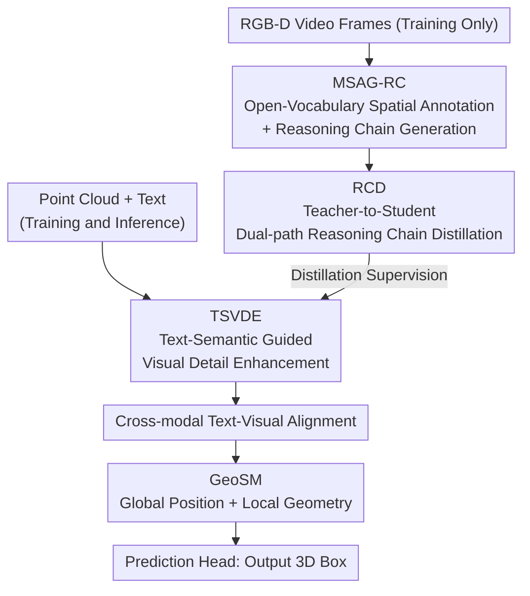

# UZ3DVG: Unaided Zero-Shot 3D Visual Grounding with Generated Language Conditions

**Conference**: CVPR 2026  
**Paper**: [CVF Open Access](https://openaccess.thecvf.com/content/CVPR2026/html/Tan_UZ3DVG_Unaided_Zero-Shot_3D_Visual_Grounding_with_Generated_Language_Conditions_CVPR_2026_paper.html)  
**Code**: https://github.com/tanwb/UZ3DVG  
**Area**: 3D Vision  
**Keywords**: Zero-Shot 3D Visual Grounding, Point Cloud, Reasoning Chain Distillation, Pseudo-label, Geometry-aware

## TL;DR
UZ3DVG completely excludes the VLM from the inference pipeline. It leverages RGB-D scenes during training to automatically generate "3D spatial description pseudo-labels + reasoning chains," then distills this reasoning logic into a lightweight student network. This allows the inference stage to rely **solely on point clouds and text**—without any dependence on 2D images or LLM/VLM interaction. It achieves zero-shot SOTA on ScanRefer and NR3D while reaching an inference speed of 7.69 FPS (approximately 38x faster than existing methods).

## Background & Motivation
**Background**: 3D Visual Grounding (3DVG) aims to localize target objects within a point cloud scene based on natural language descriptions (e.g., "the black table against the right wall, surrounded by chairs"). While mainstream fully supervised methods (EDA, MCLN, TSP3D) offer high precision, they depend on expensive "language-3D box" manual alignments like ScanRefer or ReferIt3D, making them difficult to scale to new scenes.

**Limitations of Prior Work**: To bypass manual annotations, recent zero-shot approaches (ZSVG3D, SeeGround, VLM-Grounder) invoke LLMs/VLMs **at inference time**. These methods render 3D scenes into multi-view 2D images and feed them to a VLM for multi-turn reasoning. However, VLMs cannot directly process point clouds and are both slow and computationally expensive: SeeGround reaches only 0.2 FPS, while ZSVG3D achieves 0.14 FPS. Furthermore, these methods require the deployment of both 2D imagery pipelines and external large models.

**Key Challenge**: The "no annotation" benefit of zero-shot learning is currently coupled with "VLM-dependent inference." Obtaining the open-vocabulary reasoning capabilities of a VLM typically means accepting high latency, dependency on 2D images, and external model coupling. Can the reasoning capability of a VLM be utilized without keeping the VLM in the inference loop?

**Goal**: The paper addresses three sub-problems: (1) How to automatically generate high-quality 3D spatial annotations and structured reasoning supervision from open scenes without human labels; (2) How to compress VLM spatial reasoning logic into a lightweight, VLM-free network; (3) How to enable visual features extracted by sparse convolutions to effectively model spatial relationships like "left/right/above."

**Key Insight**: The authors observe that in the context of 3DVG, the VLM primarily serves as a "supervision signal producer." The spatial descriptions and reasoning chains it generates can be produced offline and distilled. In other words, the VLM can be transformed from an "online inference referee" into an "offline training teacher."

**Core Idea**: Utilize a VLM to offline generate "spatial description pseudo-labels + reasoning chains" as supervision. This reasoning logic is distilled into a lightweight student network, allowing the inference phase to independently complete localization based only on point clouds and text (termed the "Unaided" paradigm).

## Method

### Overall Architecture
UZ3DVG consists of **training** and **inference** phases, the distinction of which is the core contribution of the paper.

During training, two branches run in parallel: First, the **MSAG-RC** (Multi-source Spatial Annotation and Reasoning Chain Generator) converts RGB-D video frames into "3D spatial description pseudo-labels + structured reasoning chains." This supervision is fed into a large teacher network to extract reasoning knowledge. Then, through **RCD** (Reasoning Chain Distillation), the reasoning logic is transferred to a lightweight student network. On the student side, text features are complemented with fine-grained visual details via **TSVDE** (Text-Semantic Guided Visual Detail Enhancement). These are aligned with SpConv point cloud features and processed by **GeoSM** (Geometry-aware Spatial Modeling) to explicitly model global layouts and local geometry before a prediction head outputs the 3D boxes.

During inference, MSAG-RC, the teacher network, and the reasoning chains are all discarded. **Only point clouds and text** pass through the student network → cross-modal alignment → GeoSM → prediction head to complete localization. This architectural choice is the reason for the 7.69 FPS performance, as no 2D rendering or VLM calls exist on the critical path.

### Key Designs

**1. MSAG-RC: Converting RGB-D into 3D Spatial Pseudo-labels and Reasoning Chains**

This step addresses the lack of manual annotations and the representation gap between 2D images and 3D localization. The process starts with an open-vocabulary detector (Grounding DINO) predicting coarse 2D boxes $b^{2D}_{i,j}$ on RGB images, followed by SAM2 to refine these into pixel-level masks $M_{i,j}=\mathrm{SAM2}(I_i, b^{2D}_{i,j})$. After filtering invalid depths, valid pixels are back-projected to scene coordinates using camera intrinsics $K_d$ and poses:

$$\widetilde{P}_{i,j} = A\, T^{(i)}_{c2w}\, D_i[u,v]\, K_d^{-1}[u,v,1]^\top$$

Axis-aligned 3D pseudo-boxes $b^{3D}_{i,j}=[c_{i,j}, s_{i,j}]$ are derived from point cloud extrema, with center $c_{i,j}=(p^{max}+p^{min})/2$ and size $s=p^{max}-p^{min}$. Once object-level 3D geometry is obtained, a symbolic-logic spatial prompt constructor is used to feed the category $\kappa$, pseudo-boxes, spatial context $C$, and annotated RGB images to a VLM. The VLM generates room-level natural language spatial descriptions $d_{i,j}$. Subsequently, using a predefined template, the VLM produces reasoning chains $R_{i,j}$ containing an **Anchor / References / Reasoning** structure. The system self-checks the consistency between $R_{i,j}$ and $d_{i,j}$ to correct localization failures, finally returning $(d_{i,j}, R_{i,j}, \gamma_{i,j})$, where $\gamma$ is a self-evaluated confidence score.

**2. RCD: Dual-path Reasoning Chain Distillation**

To bridge the gap between foundation model knowledge and the 3DVG task, RCD employs a "Teacher-Student Distillation" framework. The **Teacher Network** encodes the Anchor, Reference, and Reasoning components of the chain into $C^{tea}_{chain}$ using a frozen RoBERTa. A **Quality Gate** filters noise based on global context, while self-attention models logical dependencies. The enhanced representations are fused with teacher visual features via bi-directional cross-modal attention to produce aligned $(V^{tea}_{out}, T^{tea}_{out})$. The **Student Network** is isomorphic but smaller, using a lightweight query generator to "hallucinate" three reasoning components $R^{stu}_{comp}$ to mimic the teacher.

Distillation occurs at three levels: consistency of reasoning components and global representations $L_r=L^{comp}_r+L^{global}_r$; and the definition of **Reasoning Gain** $G^{tea}=T^{tea}_{out}-T_{ovsd}$ and $G^{stu}=T^{stu}_{out}-T_{ovsd}$. The loss $L_g=L_{cos}+L_{mse}+L_{mag}$ constrains the direction and magnitude of this gain—distilling *how much* and *in what direction* the teacher enhanced the features rather than the absolute features themselves.

**3. GeoSM: Explicit Global and Local Geometry for Sparse Features**

Reasoning chains often utilize spatial predicates like "left of" or "above." To ensure visual features can map these to the 3D scene, GeoSM injects geometric priors. For the **Global** aspect, coordinates of visual features are normalized and processed via sinusoidal position encoding:

$$\hat{p}_i = 2\cdot\frac{p_i - p_{min}}{p_{max}-p_{min}+\varepsilon} - 1$$

resulting in global layout features $f^{pos}_i$. For the **Local** aspect, a KNN neighborhood is constructed for each point $p_i$ to calculate relative displacements $\Delta p_{ij}=p_j-p_i$, which are fused with neighbor features through an MLP and max pooling to obtain local relationship features $f^{rel}_i$. The combined $g_i=[f^{pos}_i, f^{rel}_i]$ is added back to the original visual features.

**4. TSVDE: Text-Semantic Guided Visual Detail Enhancement**

The reasoning chain requires fine-grained visual evidence. Unlike conventional uniform upsampling, TSVDE uses text semantics and reasoning-enhanced visual features to perform **similarity-guided sampling**. This focuses on magnifying regions highly aligned with the text semantics, effectively bringing in the details required by the reasoning chain.

### Loss & Training
The total loss comprises the localization loss and three distillation losses:

$$L_{total} = \lambda_{rec}L_{rec} + \lambda_g L_g + \lambda_v L_v + \lambda_r L_r$$

where $L_{rec}$ includes bounding box regression $L_{bbox}$ and classification $L_{cls}$. $L_g$, $L_v$, and $L_r$ supervise the reasoning gain, visual features, and reasoning component distillation, respectively.

## Key Experimental Results

### Main Results
On the ScanRefer validation set (9,508 descriptions), UZ3DVG leads in the zero-shot setting with superior speed:

| Setting | Method | Overall Acc@0.25 | Overall Acc@0.5 | Multiple Acc@0.5 | FPS |
|------|------|------|------|------|------|
| Mask3D Refined | ZSVG3D (CVPR'24) | 36.40 | 32.70 | 24.60 | 0.14 |
| Mask3D Refined | SeeGround (CVPR'25) | 44.10 | 39.40 | 30.00 | 0.20 |
| Mask3D Refined | **UZ3DVG** | **45.42** | **41.08** | **36.33** | **7.69** |
| Non-Mask3D | ZSVG3D | 20.00 | 17.60 | 14.60 | 0.21 |
| Non-Mask3D | **UZ3DVG** | **43.13** | **35.05** | **31.21** | **9.43** |

With Mask3D refinement, it outperforms SeeGround by 1.32/1.68 points and is approximately 38x faster. Without Mask3D, it surpasses ZSVG3D by 23.13/17.45 points with a 45x speedup. On the "Multiple" subset, which is most challenging for spatial discrimination, it exceeds SeeGround by 6.49/6.33 points, indicating that reasoning chain distillation significantly improves spatial judgment.

### Ablation Study
Ablation of the three modules (ScanRefer, with Mask3D refinement):

| TSVDE | RCD | GeoSM | Acc@0.25 | Acc@0.5 |
|------|------|------|------|------|
| ✗ | ✗ | ✗ | 40.75 | 37.18 |
| ✓ | ✗ | ✗ | 41.83 | 38.21 |
| ✓ | ✓ | ✗ | 43.26 | 39.65 |
| ✓ | ✗ | ✓ | 43.15 | 39.47 |
| ✓ | ✓ | ✓ | **45.42** | **41.08** |

### Key Findings
- **MSAG-RC is the primary contributor**: Upgrading from pure 2D descriptions to MSAG-RC (3D projection + context enhancement) boosts Acc@0.5 by 16.64 points, demonstrating that grounding 2D detections in 3D is critical.
- **Synergistic effect between modules**: RCD (+2.51/2.47) and GeoSM (+2.40/2.29) provide comparable gains, while TSVDE provides a smaller but necessary improvement.
- **Diminishing returns of pseudo-labels**: Gains are significant from 10K to 30K samples, but plateau at 40K, likely due to pseudo-label noise offsetting quantity benefits.
- **VLM quality determines the upper bound**: Doubao-seed-1.6 slightly outperforms Qwen3-VL-Plus, showing that pseudo-label quality directly impacts student performance.

## Highlights & Insights
- **Paradigm Innovation**: Moving the VLM from an online referee to an offline teacher is a major shift. This proves that VLM reasoning capabilities can be distilled once, resulting in massive inference speed gains (38-45x).
- **Distilling "Reasoning Gain"**: Defining the distillation target as the *change* in features caused by reasoning ($G=T_{out}-T_{ovsd}$) is a clever way to focus on the logic rather than the raw representation.
- **Structured Reasoning Chains**: Explicitly defining Anchor/Reference/Reasoning components transforms vague "spatial reasoning" into a structured, distillable format.
- **Geometric Prior Injection**: Explicitly adding global position and local relative displacement compensates for the inherent spatial relationship weaknesses in sparse convolutions.

## Limitations & Future Work
- **Gap with Supervised Methods**: Performance still lags behind fully supervised models like MCLN or TSP3D on the Multiple subset.
- **Heavily Dependent on VLM Selection**: The student's performance is capped by the generation quality of the offline VLM.
- **Dependency on RGB-D for training**: While inference is point-cloud-only, training requires RGB-D sequences with poses, which may not be available for all datasets.

## Related Work & Insights
- **vs. ZSVG3D / SeeGround**: These methods render views and call VLMs at inference time, making them slow and dependent on external APIs. UZ3DVG moves this to training, achieving higher accuracy and far superior speed.
- **vs. Weakly Supervised 3DVG**: Weakly supervised methods generally achieve around 22% accuracy; UZ3DVG's zero-shot pseudo-label approach (45.42%) is significantly more effective.
- **Insight**: Distilling reasoning from large models into offline supervision is a viable strategy for any task plagued by high LLM/VLM inference latency.

## Rating
- Novelty: ⭐⭐⭐⭐⭐ 
- Experimental Thoroughness: ⭐⭐⭐⭐ 
- Writing Quality: ⭐⭐⭐⭐ 
- Value: ⭐⭐⭐⭐⭐ 

<!-- RELATED:START -->

## Related Papers

- [\[CVPR 2026\] MonoVLM: Monocular 3D Visual Grounding with Vision Language Models](monovlm_monocular_3d_visual_grounding_with_vision_language_models.md)
- [\[CVPR 2026\] Zero-Shot Depth Completion with Vision-Language Model](zero-shot_depth_completion_with_vision-language_model.md)
- [\[CVPR 2026\] ORD: Object-Relation Decoupling for Generalized 3D Visual Grounding](ord_object-relation_decoupling_for_generalized_3d_visual_grounding.md)
- [\[CVPR 2025\] SeeGround: See and Ground for Zero-Shot Open-Vocabulary 3D Visual Grounding](../../CVPR2025/3d_vision/seeground_see_and_ground_for_zero-shot_open-vocabulary_3d_visual_grounding.md)
- [\[CVPR 2026\] Zoo3D: Zero-Shot 3D Object Detection at Scene Level](zoo3d_zero-shot_3d_object_detection_at_scene_level.md)

<!-- RELATED:END -->
