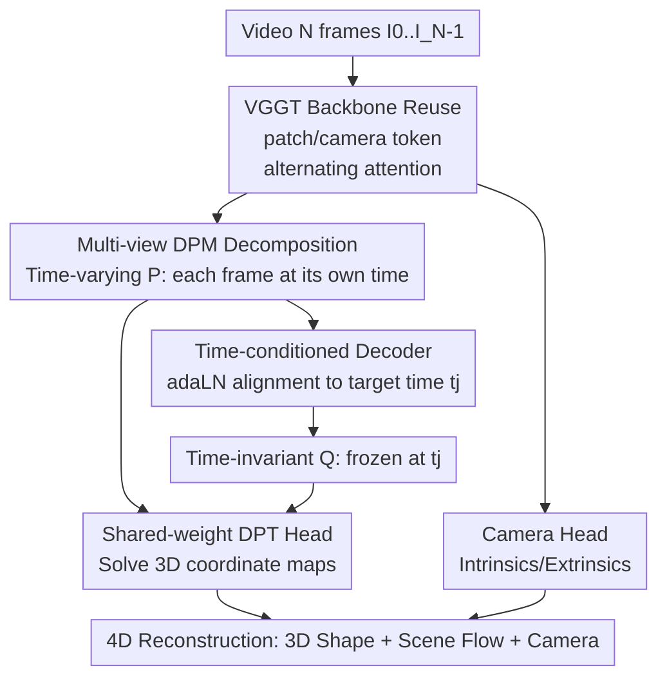

# V-DPM: 4D Video Reconstruction with Dynamic Point Maps

**Conference**: CVPR 2026  
**Paper**: [CVF Open Access](https://openaccess.thecvf.com/content/CVPR2026/html/Sucar_V-DPM_4D_Video_Reconstruction_with_Dynamic_Point_Maps_CVPR_2026_paper.html)  
**Area**: 3D Vision / 4D Dynamic Reconstruction  
**Keywords**: Dynamic Point Maps, Feed-forward 4D Reconstruction, Scene Flow, VGGT, Video Depth  

## TL;DR
V-DPM extends "Dynamic Point Maps (DPM)," which previously only handled image pairs, to entire videos. Through a two-stage "time-varying + time-invariant" point map decomposition and a time-conditioned decoder, the model fine-tunes the pre-trained static reconstructor VGGT using a small amount of synthetic data. It achieves single-pass feed-forward 4D reconstruction—simultaneously recovering 3D shapes, camera parameters, and the motion of every point in the scene—with 2-view errors approximately 5 times lower than previous SOTA.

## Background & Motivation
**Background**: Feed-forward 3D reconstruction has progressed rapidly in recent years, driven primarily by the "view-invariant point map" proposed by DUSt3R. It encodes 3D shape and camera motion into a "3D coordinate map" at the same resolution as the image, which is ideal for direct regression by neural networks. Subsequent works (VGGT, Fast3R, etc.) further extended this from image pairs to multi-view single-pass feed-forwarding, resulting in fast and accurate multi-view reconstructors.

**Limitations of Prior Work**: The original definition of point maps assumes a **static** scene, making it unable to represent motion. However, real-world applications (film, robotics, AR) almost always require reconstructing dynamic scenes that move and deform. Existing 4D works either avoid point maps (a category outside MonST3R) or use point maps but must attach an additional 2D point tracker to obtain scene flow, leading to a fragmented pipeline.

**Key Challenge**: Dynamic Point Map (DPM, [17]) originally solved the unified representation problem for "expressing 3D shape + 3D motion + camera intrinsics/extrinsics simultaneously," achieving view invariance **and** time invariance. However, like DUSt3R, it only computes DPMs for **image pairs**. Once the input exceeds two frames, it must revert to pairwise prediction followed by optimization-based post-processing for fusion, which is slow and loses cross-frame temporal context. Furthermore, "correctly" generalizing pairwise DPMs to multiple frames is not obvious: naively letting all three indices traverse $N$ timestamps would generate $N^3$ point maps, which is computationally infeasible.

**Goal**: Design a network that can ingest an entire video in a **single feed-forward pass** and directly output 4D reconstruction (the 3D position of each pixel + its motion over time) without training from scratch or requiring massive 4D labeled datasets.

**Key Insight**: The authors discovered two exploitable facts. First, the $N^3$ point maps are highly redundant—by expressing all point maps relative to a single reference viewpoint $\pi_0$, the point maps of other viewpoints can be derived via rigid body transformations once the camera is recovered, reducing $N^3$ directly to $N^2$. Second, strong reconstructors like VGGT, pre-trained on **static** data, produce point maps that differ only slightly from the "time-varying point maps" required for dynamic scenes. They can serve as a base for fine-tuning, bypassing the bottleneck of 4D data scarcity.

**Core Idea**: Decompose multi-view 4D reconstruction into two steps: "first predict time-varying point maps $\mathcal{P}$, then use a time-conditioned decoder to align them to a unified reference time to obtain time-invariant point maps $\mathcal{Q}$." The overall architecture predicts only $2N-1$ point maps and grafts this structure onto VGGT for light fine-tuning.

## Method

### Overall Architecture
The input to V-DPM is a video of $N$ frames $I_0,\dots,I_{N-1}$ (with timestamps $t_i$, treated as frame indices). The output consists of two sets of point maps: a set of **time-varying** point maps $\mathcal{P}$, describing the 3D shape of each frame at its **own timestamp**; and a set of **time-invariant** point maps $\mathcal{Q}$, aligning points from all frames to a **unified reference timestamp** $t_j$. With these two sets and the camera parameters, the model can fully reconstruct the dynamic scene's 3D shape, camera motion, and the 3D motion of each pixel over time (scene flow).

The DPM representation is denoted as $P_i(t_j,\pi_k)\in\mathbb{R}^{3\times H\times W}$: the subscript $i$ indicates that the pixels of this point map are aligned with image $I_i$, $\pi_k$ is the reference viewpoint for the coordinates, and $t_j$ is the timestamp of these 3D points. The key is that $t_j$ and $\pi_k$ **do not have to equal** the image's own $t_i$ and $\pi_i$. This "misalignment" allows the same representation to encode both shape and motion. For example, checking $P_0(t_0,\pi_0)(u)=P_1(t_0,\pi_0)(v)$ determines if pixels in two frames correspond (by pulling them to the same time and viewpoint); whereas $P_0(t_1,\pi_0)(u)-P_0(t_0,\pi_0)(u)$ directly provides the scene flow for pixel $u$.

The overall computation is serial across two stages (see diagram below): Stage 1 has the network predict time-varying point maps $\mathcal{P}$ (3D points for each frame at its own time under a unified viewpoint $\pi_0$). This part is nearly isomorphic to the static point maps originally output by VGGT, allowing direct reuse of pre-trained weights. Stage 2 uses a time-conditioned decoder to "transport" the features from Stage 1 to the target timestamp $t_j$, outputting time-invariant point maps $\mathcal{Q}$. Changing $t_j$ only requires rerunning the decoder and reusing the backbone computation, efficiently "freezing" the entire scene at any arbitrary moment.

### Key Designs

**1. Multi-view DPM Decomposition: Compressing $N^3$ Point Maps into Two Sets of $2N-1$ Maps**

Naively generalizing DPM to $N$ frames would let the image index $i$, timestamp index $j$, and viewpoint index $k$ each traverse $N$ values, producing $N^3$ maps. The authors' first cut is "viewpoint normalization": point maps that differ only in viewpoint $\pi_k$ are related by a rigid body transformation. Thus, once cameras are recovered, expressing all maps in a common viewpoint $\pi_0$ reduces $N^3$ to $N^2$ without loss. However, $N^2$ is still too many. The second cut involves selecting two useful subsets and computing them **sequentially**:

Stage 1 predicts **time-varying point maps** $\mathcal{P}=(P_0(t_0,\pi_0), P_1(t_1,\pi_0),\dots,P_{N-1}(t_{N-1},\pi_0))$, representing 3D points for each frame at its own time in a unified viewpoint. It lacks time invariance and cannot calculate scene flow directly, but it is nearly identical to the outputs of MonST3R and VGGT, facilitating the reuse of pre-training. Stage 2 predicts **time-invariant point maps** $\mathcal{Q}=(P_0(t_j,\pi_0),\dots,P_{N-1}(t_j,\pi_0))$, bringing all points to a single reference timestamp $t_j$ to achieve both viewpoint and time invariance. Together, there are exactly $2N-1$ maps ($\mathcal{P}$ has $N$, and $\mathcal{Q}$ shares the $j$-th map with $\mathcal{P}$ given a fixed $t_j$). This "$\mathcal{P}$ then $\mathcal{Q}$" decomposition is clever because it splits the difficult task into two logical steps the network can learn: to determine $P_1(t_j,\pi_0)$, the second stage only needs to match the already computed $P_1(t_1,\pi_0)$ and $P_j(t_j,\pi_0)$ to infer "how the point moves."

**2. Time-conditioned Decoder: Using Target Time Token + adaLN to "Freeze" Points at Any Moment**

The core difficulty of Stage 2 is that the target timestamp $t_j$ may not correspond to any input frame; it must be fed as an **extra input**, requiring the network to reason about motion across all frames. The authors added a **time-conditioned Transformer decoder** consisting of alternating frame attention and global attention blocks. It processes the same backbone features $\hat{p}_i$ used by the time-varying DPT head. The decoder iteratively aligns these features to $P_j(t_j,\pi_0)$ (whose features remain fixed as an anchor).

"Informing the decoder of the target timestamp $t_j$" is implemented via two changes: first, a **target time token** $t_j$ is inserted into the VGGT input, becoming an output token $\hat{t}_j$ via the backbone; second, each Transformer block in the decoder uses **adaptive LayerNorm (adaLN)** for conditioning (following FiLM/DiT). Instead of learned scales/shifts in LayerNorm, it uses a linear projection of $\hat{t}_j$ to modulate the normalized patch tokens, with the self-attention output further gated by a second projection. This injects the continuous "timestamp" condition in a lightweight, differentiable manner without disrupting feature distributions. During inference, the backbone runs once to get $\hat{p}_i$; to freeze at a different time, one only needs to swap $\hat{t}_j$ and rerun the decoder, saving significant computation. The decoder output finally passes through a **DPT point map head shared with the original VGGT** to ensure the output feature distribution matches the backbone.

**3. Grafting Pre-trained VGGT + Minimal Synthetic Data Fine-tuning: Bypassing 4D Labeled Data Scarcity**

The major obstacle for 4D reconstruction is the extreme difficulty of obtaining large-scale dynamic 4D data. V-DPM addresses this by **maximizing the reuse of static pre-training**: it uses the powerful VGGT, trained on purely static scenes, as the backbone. V-DPM removes the redundant depth prediction branch and reuses the mechanism for extracting tokens from four backbone layers and decoding them via a DPT head to produce time-varying maps $\mathcal{P}$. The camera pose regressor is kept to output intrinsics/extrinsics, with only the time-conditioned decoder added and the whole system fine-tuned. Fine-tuning uses a **mixed static + dynamic** dataset (Static: ScanNet++, BlendedMVS; Dynamic: Kubric-F, Kubric-G, PointOdyssey, Waymo), expanded into video clips. The model is trained on 5/9/19 frame segments (longer segments aid generalization to complex motion) using DPM's confidence-calibrated loss and VGGT's camera pose regression loss. One detail: GT point maps are scaled to a "unit mean distance to origin," allowing the network to predict the correct scale like VGGT. This scheme proves that strong priors learned on static data can be transformed into dynamic reconstructors with "moderate compute + synthetic data."

### Loss & Training
The supervision signal = DPM's confidence-calibrated point map loss + VGGT-style camera pose regression loss. The model is trained on mixed static and dynamic datasets with video segments sampled at 5/9/19 frames. GT point maps are normalized to unit mean norm, and scale prediction is left to the network. Due to hardware limits, fine-tuning is capped at 20-frame segments, but it generalizes to ~50 frames. Longer sequences (hundreds of frames) use a sliding window with bundle-adjustment-like optimization during testing to fuse overlapping window predictions.

## Key Experimental Results

### Main Results: 2-view 4D Reconstruction (End-Point Error, lower is better)
Evaluated on PointOdyssey / Kubric-F / Kubric-G / Waymo datasets following the DPM protocol (sampling two frames with 2-level or 8-level intervals). EPE is measured in the world coordinate system of the first frame's viewpoint $\pi_0$ (implicitly testing camera and point tracking accuracy). The table shows average magnitude across four point maps for a 2-frame interval:

| Method | PointOdyssey | Kubric-F | Kubric-G | Waymo |
|------|------|------|------|------|
| St4RTrack | ~0.147 | ~0.149 | ~0.182 | ~0.226 |
| TraceAnything | ~0.161 | ~0.070 | ~0.087 | ~0.150 |
| DPM | ~0.115 | ~0.032 | ~0.040 | ~0.083 |
| **V-DPM** | **~0.031** | **~0.018** | **~0.024** | **~0.064** |

V-DPM leads significantly across all four benchmarks, with errors ~5x lower than the previously best St4RTrack / TraceAnything and an order of magnitude lower than DPM. This confirms that V-DPM on VGGT is an effective strategy and that static pre-trained models can generalize to dynamic scenes with moderate fine-tuning.

### Ablation Study: Video-level 3D Dense Tracking (10-frame segment, Tracking EPE)
Tracking 3D points from the first frame in a 10-frame segment (interval 2) to evaluate "joint video processing" vs. "pairwise prediction":

| Method | PointOdyssey | Kubric-F | Kubric-G | Waymo | Note |
|------|------|------|------|------|------|
| DPM | 0.114 | 0.088 | 0.109 | 0.103 | Pairwise only, no temporal context |
| V-DPM (2-view input) | 0.037 | 0.066 | 0.079 | 0.094 | Degraded to pairwise mode |
| **V-DPM (Full Video)** | **0.032** | **0.027** | **0.035** | **0.042** | Joint processing of segments |

DPM's accuracy drops significantly in video settings compared to two-view experiments (unable to utilize temporal context), whereas V-DPM maintains accuracy; forcing V-DPM into "pairwise input" leads to a significant performance drop. This proves **joint reasoning of temporal dynamics across the video** is the core gain for V-DPM.

### Key Findings
- **Joint Video Processing > Pairwise Processing**: V-DPM's full-segment EPE is consistently lower than the "degraded 2-view input" (e.g., Kubric-F 0.027 vs 0.066). Temporal context from joint inference is the core gain.
- **Static Pre-training Transfers to Dynamic**: Fine-tuning the static-trained VGGT with minimal synthetic 4D data achieves 2-view SOTA, validating the "lightweight modification" route using strong static priors and time-conditioned decoders.
- **Unified Representation Value**: Unlike methods that only recover dynamic depth, V-DPM recovers the 3D motion (scene flow) for every point. Qualitatively, trajectories are smoother and more consistent, and reconstruction remains reasonable in sequences like fishtanks or tennis players where other methods fail.

## Highlights & Insights
- **The "time-varying then time-invariant" decomposition is ingenious**: It breaks the difficult goal of "simultaneous viewpoint + time invariance" into two logical steps the network can handle—reconstruction at respective times (isomorphic to static point maps) followed by alignment to a unified time via a decoder (matching point maps to infer motion).
- **Target time as a controllable token + adaLN modulation**: Injecting the "frozen time" as a continuous condition allows the backbone to run once while the decoder switches $t_j$. This makes "continuous time query" a first-class citizen and saves compute.
- **Complexity convergence from $N^3 \to N^2 \to 2N-1$**: Using "viewpoint normalization via rigid transformation" and "selecting two useful subsets" suppresses the combinatorial explosion into a linear scale.
- **The "Aha" moment**: A static reconstructor that **never saw dynamic data** became a 4D SOTA via moderate synthetic fine-tuning—reaffirming that geometric priors from large-scale pre-training have strong cross-task transferability.

## Limitations & Future Work
- **Reliance on backbone limits**: V-DPM's performance is capped by its VGGT backbone. It trails $\pi^3$ in video depth/camera pose because the latter uses a stronger backbone and more data. 
- **Long sequences depend on optimization-based post-processing**: Restricted by hardware to 20-frame fine-tuning, sequences of hundreds of frames still require sliding windows and bundle-adjustment fusion. End-to-end capability for long videos remains an open problem.
- **Small training data scale**: Using only 6 datasets is a disadvantage compared to concurrent works. The sim-to-real gap for complex motions remains unquantified.

## Related Work & Insights
- **vs DUSt3R / VGGT**: They output static point maps only. V-DPM reuses their architecture and weights, adding time-varying/invariant maps to upgrade the static reconstructor to 4D.
- **vs DPM [17]**: DPM pioneered the unified representation but was pairwise-only. V-DPM extends it natively to full videos, achieving an order of magnitude lower error by utilizing temporal context.
- **vs MonST3R / St4RTrack**: These either lack unified point maps or require external 2D trackers. V-DPM provides shape, motion, and cameras in one go with ~5x lower 2-view EPE.

## Rating
- Novelty: ⭐⭐⭐⭐ Native extension of DPM to video with two-stage decomposition and time-conditioned decoders is a clear innovation.
- Experimental Thoroughness: ⭐⭐⭐⭐ Covers 4D reconstruction, tracking, depth, and pose across multiple tasks with significant 2-view gains.
- Writing Quality: ⭐⭐⭐⭐ Clear motivation and derivation of the $N^3 \to 2N-1$ reduction. Excellent coordination between text and figures.
- Value: ⭐⭐⭐⭐ Provides a data-efficient, backbone-agnostic route for upgrading static reconstructors to 4D, with direct value for robotics and AR.

<!-- RELATED:START -->

## Related Papers

- [\[CVPR 2026\] DynamicVGGT: Learning Dynamic Point Maps for 4D Scene Reconstruction in Autonomous Driving](dynamicvggt_learning_dynamic_point_maps_for_4d_scene_reconstruction_in_autonomou.md)
- [\[CVPR 2026\] PackUV: Packed Gaussian UV Maps for 4D Volumetric Video](packuv_packed_gaussian_uv_maps_for_4d_volumetric_video.md)
- [\[CVPR 2026\] Vista4D: Video Reshooting with 4D Point Clouds](vista4d_video_reshooting_with_4d_point_clouds.md)
- [\[ICCV 2025\] Dynamic Point Maps: A Versatile Representation for Dynamic 3D Reconstruction](../../ICCV2025/3d_vision/dynamic_point_maps_a_versatile_representation_for_dynamic_3d_reconstruction.md)
- [\[CVPR 2026\] Mesh4D: 4D Mesh Reconstruction and Tracking from Monocular Video](mesh4d_4d_mesh_reconstruction_and_tracking_from_monocular_video.md)

<!-- RELATED:END -->
