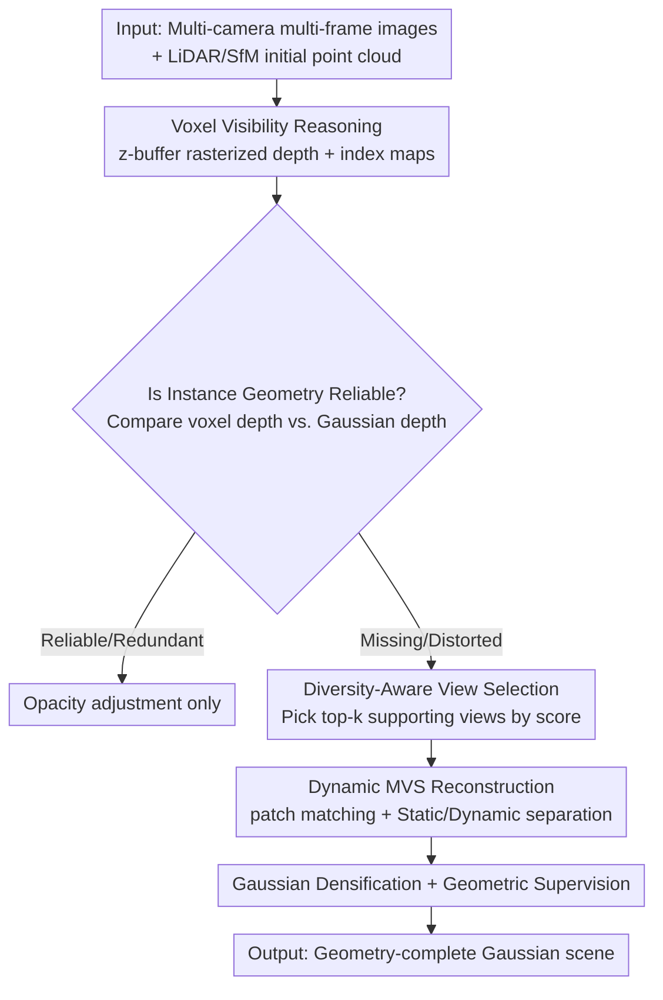

# VAD-GS: Visibility-Aware Densification for 3D Gaussian Splatting in Dynamic Urban Scenes

**Conference**: CVPR 2026  
**Paper**: [CVF Open Access](https://openaccess.thecvf.com/content/CVPR2026/html/Zhang_VAD-GS_Visibility-Aware_Densification_for_3D_Gaussian_Splatting_in_Dynamic_Urban_CVPR_2026_paper.html)  
**Code**: Project Page mias.group/VAD-GS/ (Code TBD)  
**Area**: 3D Vision  
**Keywords**: 3D Gaussian Splatting, Dynamic Urban Scenes, Visibility Reasoning, Multi-View Stereo, Densification

## TL;DR
VAD-GS targets the issues of sparse point clouds and minimal camera overlap in autonomous driving scenes. By utilizing voxel visibility reasoning, it proactively identifies instances with missing or distorted geometry. It then selects supporting views across cameras and timestamps for Multi-View Stereo (MVS) reconstruction to supplement missing structures as reliable geometric priors for initializing new Gaussians. This approach extends MVS-based densification to moving objects for the first time, achieving state-of-the-art rendering quality and geometric consistency on Waymo and nuScenes.

## Background & Motivation

**Background**: 3D Gaussian Splatting (3DGS) enables high-fidelity real-time novel view synthesis and has been significantly extended for urban scene reconstruction (e.g., StreetGaussians, OmniRe, PVG). The standard practice involves accumulating initial point clouds from SfM or LiDAR and densifying during training solely by cloning or splitting existing Gaussians, guided by photometric error gradients to optimize geometry.

**Limitations of Prior Work**: This paradigm relies on two assumptions that fail in urban scenarios. First, quality depends heavily on the completeness of the initial point cloud; however, vehicle-mounted cameras are outward-facing with overlaps often below 15%, making stereo matching unreliable. nuScenes uses 32-beam LiDAR, providing only ~34k points per frame with highly uneven coverage; many structures (e.g., traffic signs above the LiDAR's vertical FOV) lack initial points entirely. Second, clone/split operations can only replicate from *existing* Gaussians and cannot reconstruct *missing* structures from scratch.

**Key Challenge**: When geometry is missing from the initial point cloud, the resulting photometric error is incorrectly attributed to background structures (e.g., trees or buildings behind a sign). Consequently, gradients cause the splitting or cloning of Gaussians that should remain static, occluded, or are otherwise invisible. This results in improved training view rendering at the cost of distorted underlying geometry, which fails from unseen perspectives (corrupted depth and normal maps). This is a fundamental flaw of a paradigm that only responds passively to photometric error.

**Limitations of Prior Work**: Methods like GeoTexDensifier and DNGaussian introduce depth/normal priors to guide splitting but only repair areas where Gaussians already exist. GaussianPro utilizes patch matching to supplement geometric points, handling uninitialized regions, but is restricted to static scenes and single-camera adjacent frames, discarding long-range temporal and cross-camera cues required for dynamic objects.

**Core Idea**: Instead of passively following photometric errors, the goal is to **proactively evaluate structural integrity and reconstruct**. Voxel visibility reasoning identifies unreliable geometry, selects supporting views with the strongest stereo constraints, and uses MVS to fill missing structures as geometric priors for initializing Gaussians. This process is further extended to objects in motion.

## Method

### Overall Architecture
VAD-GS takes multi-camera multi-frame images and LiDAR/SfM initial point clouds as input, outputting a Gaussian scene with completed geometry and geometric prior constraints. The pipeline operates independently for **every** static or dynamic instance: initial points are voxelized for visibility reasoning to determine geometric reliability by comparing "voxel depth vs. Gaussian rendered depth." For flagged instances, top-k supporting views (cross-camera, cross-time) are selected via a diversity score and fed into patch-matching MVS for dense reconstruction. The reconstructed reliable 3D points serve both to initialize new Gaussians (densification) and as depth/normal supervision in the loss function. The entire densification process is integrated into the 3DGS framework via CUDA, taking ~48 ms and triggering only when missing geometry is detected, incurring negligible overhead.

### Key Designs

**1. Voxel Visibility Reasoning: Using z-buffer for clear visibility and locating missing geometry**

The pain point is that single-view point sampling provides insufficient coverage, while aggregating all points across time lacks occlusion awareness—rays might pass through occluded structures, leading to incorrect updates. VAD-GS voxelizes the initial point cloud for uniform density and defines the visibility of each voxel as the union of observation views associated with its internal points. Classic z-buffering is then applied to "visible voxels" to produce two maps: a **rasterized depth map** (more reliable than sparse points + k-NN, with error bounded by voxel resolution, and naturally filtering occluded voxels behind incomplete foregrounds) and a **2D index map** (storing the index of the first struck visible voxel per pixel ray to map pixels to 3D structures for fast lookup of positions, normals, and adjacency).

Missing geometry is located via a depth comparison: instances (cars, trees, etc.) are segmented offline, and pixels are mapped to voxels via the index map. For each instance, two depths are compared: voxel z-buffer depth $d_{voxel}$ and Gaussian rendered depth $d_{gs}$. If $d_{gs}$ is consistently smaller than $d_{voxel}$, the geometry is complete or redundant (adjust opacity); if $d_{gs}$ is missing or significantly larger than $d_{voxel}$, the geometry is uninitialized or distorted and the instance is marked for re-initialization. This is triggered if the ratio of rendered depth to voxel depth > 1.1 or if >25% of an instance's pixels have cumulative opacity < 0.7.

**2. Diversity-Aware View Selection: Using a geometric score to pick views with strong stereo constraints**

MVS quality depends heavily on view selection. While adjacent frames from a single camera suffice for static scenes, driving scenes involve dynamic objects and ego-motion. Views must be selected across different cameras and timestamps to balance frustum overlap and triangulation quality. A geometric diversity score $s$ for two views is defined:

$$s = \frac{N \, d_R^\top d_S}{\sqrt{t_x^2 + t_y^2}} \cdot \frac{1}{|t_z| + \epsilon} \cdot \sin\theta$$

Where $N$ is the number of co-visible voxels, $d_R, d_S$ are distance vectors from viewpoints to voxels, $t=(t_x,t_y,t_z)^\top$ is relative translation, and $\theta$ is the orientation difference. Higher scores reflect stronger stereo cues (dense/near voxels, large lateral translation $t_x, t_y$, low longitudinal translation $t_z$, and large orientation difference). A top-k subset ($k=4$) is selected for each reference view using a maximum weight k-clique optimization to ensure diversity among the supporting views themselves.

**3. Extending MVS to Dynamic Objects: Using visible voxels as occlusion-aware prompts**

Patch-matching MVS assumes local planes: pixel $p$ is associated with a 3D plane $z\,n^\top K^{-1}\tilde{p} + d = 0$. This works for static scenes but fails for dynamic ones. While rigid vehicles can be treated as static by transforming views into their local coordinate systems, precise foreground/background masks are difficult to obtain. 3D boxes produce masks that blur boundaries, causing background pixels to mislead matching and break local geometric consistency.

VAD-GS solves this by using the **visible voxels** from step 1 as segmentation prompts. These voxels inherently contain occlusion cues, providing more accurate instance-level prompts. Patch matching is restricted to "static regions across all relevant views" or "dynamic regions," minimizing cross-region interference. Additionally, Gaussian rendering results serve as initial guesses for patch matching, reducing random resampling when consistent matches are scarce.

### Loss & Training
The total loss is a weighted sum of four terms:

$$L = L_{color} + \lambda_{normal} L_{normal} + \lambda_{hard} L_{hard} + \lambda_{soft} L_{soft}$$

Where $L_{color}$ is the photometric error; $L_{normal}$ is the angular error between rendered and patch-matched normals; $L_{hard}$ and $L_{soft}$ measure depth error using fixed and learnable opacities, respectively. Weights are set to $\lambda_{normal}=0.02$ and $\lambda_{depth}=0.1$. $L_{hard}$ is disabled after 80% of training. Views are sampled without replacement to mitigate imbalance, and voxel visibility densification occurs every 5 full sampling cycles. Experiments were conducted on a single RTX 4090.

## Key Experimental Results

### Main Results
Waymo Open (8 dynamic sequences, ~100 frames each, 5 cameras + 5 LiDAR, ~177k points/frame). PSNR* represents evaluation on dynamic objects only.

| Method | PSNR↑ | PSNR*↑ | SSIM↑ | LPIPS↓ |
|------|-------|--------|-------|--------|
| 3DGS | 29.64 | 21.25 | 0.918 | 0.117 |
| EmerNeRF | 30.87 | 21.67 | 0.905 | 0.133 |
| PVG | 31.82 | 24.68 | 0.910 | 0.122 |
| OmniRe | 31.12 | 25.20 | 0.902 | 0.123 |
| StreetGS | 34.61 | 30.23 | 0.938 | 0.079 |
| **VAD-GS** | **35.59** | **31.31** | **0.950** | **0.047** |

VAD-GS leads across all metrics: ~+2.8% PSNR over the next best, ~+3.6% PSNR* for dynamic objects, and significant gains in SSIM/LPIPS. The authors note that the Waymo improvement slightly underestimates the potential, as the baseline "front-camera only" setup restricts VAD-GS's primary advantage: cross-camera cues.

nuScenes (32-beam LiDAR, ~34k points/frame, sparser and more uneven) per-scene results (selection, "#G" refers to Gaussian count):

| Scene | StreetGS PSNR↑ | StreetGS SSIM↑ | VAD-GS PSNR↑ | VAD-GS SSIM↑ |
|------|------|------|------|------|
| Scene 00 | 22.87 | 0.65 | **25.54** | **0.81** |
| Scene 03 | 24.18 | 0.77 | **26.57** | **0.88** |
| Scene 06 | 23.58 | 0.70 | **25.64** | **0.83** |
| Scene 05 | 20.20 | 0.50 | 20.06 | **0.56** |

In most scenes, SSIM improved by > 0.06 and PSNR by > 0.78 dB. The exception is Scene 05, where a straight-line trajectory resulted in sparse viewpoint sampling and minimal camera overlap, hindering cross-camera cues.

### Ablation Study
On nuScenes, removing components (components are interdependent; removing visibility reasoning disables the others):

| Config | PSNR↑ | PSNR*↑ | SSIM↑ | LPIPS↓ | Note |
|------|-------|--------|-------|--------|------|
| w/o Voxel Visibility | 23.79 | 22.75 | 0.753 | 0.215 | Photometric-only densification, distorted geometry |
| w/o View Selection | 23.92 | 22.83 | 0.757 | 0.212 | Fixed continuous frames, background mismatch causing floaters |
| w/o Geometric Loss | 24.59 | 22.78 | 0.764 | 0.194 | Slightly better PSNR but rough surfaces at large offsets |
| Full Model | 24.51 | **23.16** | **0.765** | 0.199 | Best dynamic PSNR* and geometric consistency |

### Key Findings
- **Voxel visibility reasoning is the foundation**: Removing it causes PSNR to drop to 23.79, and geometry is severely distorted by incorrect gradients.
- **View selection saves dynamic objects and reduces floaters**: Removing it and using fixed frames results in severe floater artifacts due to a lack of static/dynamic separation.
- **Geometric loss presents an interesting trade-off**: Removing it slightly improves photometric metrics (PSNR/LPIPS) due to appearance overfitting. However, the full model achieves superior dynamic PSNR* and geometric quality at large viewpoint offsets, showing that geometric loss sacrifices training-view appearance for generalized geometry.
- **Gaussian count increase is targeted**: The higher #G in VAD-GS stems from purposeful densification in under-represented areas rather than uncontrolled growth in well-initialized regions.

## Highlights & Insights
- **Paradigm shift from "Reactive" to "Proactive"**: Conventional densification follows photometric error gradients. VAD-GS proactively assesses structural integrity and uses stereo geometry to fill gaps, which is key to fixing "totally missing structures."
- **Triple-use of visible voxels**: The z-buffer rasterization provides dense depth supervision, pixel-to-3D index mapping, and occlusion-aware prompts for instance segmentation, avoiding the sparse LiDAR/aggregated occlusion trade-off.
- **Extending static MVS to dynamic multi-camera setups**: By transforming rigid bodies to local coordinates and isolating static/dynamic regions using visible voxels, patch-matching becomes viable for moving objects—an engineering contribution missing in works like GaussianPro.
- **Transferable Insight**: Using "rendered depth vs. geometric prior depth" comparisons as a trigger for reconstruction can be applied to other NVS/reconstruction tasks to replace indiscriminate global densification.

## Limitations & Future Work
- **Rigid-body assumption**: To facilitate dynamic MVS, the method enforces rigid constraints. For non-rigid objects like pedestrians, densification reverts to standard gradient-based methods, which is why LPIPS isn't always optimal in pedestrian-heavy scenes.
- **Dependency on external modules**: The workflow relies on the quality of offline instance segmentation. Inaccurate segmentation directly impacts missing geometry detection and MVS region isolation.
- **Trajectory constraints**: In scenes with straight-line ego-motion and sparse viewpoints (e.g., Scene 05), minimal cross-camera overlap negates the method's advantages.
- **Quantitative evaluation of geometric completion**: Lacking geometric ground truth for unseen trajectories, completion quality relies on qualitative visualization at large offsets rather than quantitative metrics.

## Related Work & Insights
- **vs StreetGaussians / OmniRe / PVG**: These model dynamic foregrounds as rigid groups or periodic Gaussians, but new Gaussians still rely on clone/split from initial points. VAD-GS uses cross-camera MVS to supplement missing geometry, creating a gap on sparse datasets like nuScenes.
- **vs GeoTexDensifier / DNGaussian**: These use depth/normal priors to guide splitting but only improve regions where Gaussians already exist. VAD-GS can generate Gaussians in entirely uninitialized voids.
- **vs GaussianPro**: Both use patch matching for geometry, but GaussianPro is limited to static scenes and single-camera adjacent frames. VAD-GS extends MVS consistency to dynamic, multi-camera driving scenes, providing both densification and scene consistency constraints.

## Rating
- Novelty: ⭐⭐⭐⭐ Introducing proactive visibility reasoning + multi-camera MVS to dynamic 3DGS densification fills a significant gap in dynamic scene reconstruction.
- Experimental Thoroughness: ⭐⭐⭐⭐ Extensive testing on Waymo and nuScenes with per-scene and ablation results; however, lacks quantitative geometric evaluation.
- Writing Quality: ⭐⭐⭐⭐ Solid motivation and clear diagrams; some formulas are dense and require careful reading.
- Value: ⭐⭐⭐⭐ Directly addresses the pain point of sparse point cloud reconstruction in autonomous driving simulations; rigid-body assumption is the main boundary.

<!-- RELATED:START -->

## Related Papers

- [\[CVPR 2026\] Urban-GS: A Unified 3D Gaussian Splatting Framework for Compact and High-Fidelity Aerial-to-Street Reconstruction](urban-gs_a_unified_3d_gaussian_splatting_framework_for_compact_and_high-fidelity.md)
- [\[CVPR 2026\] NVGS: Neural Visibility for Occlusion Culling in 3D Gaussian Splatting](nvgs_neural_visibility_for_occlusion_culling_in_3d_gaussian_splatting.md)
- [\[CVPR 2026\] Part$^{2}$GS: Part-aware Modeling of Articulated Objects using 3D Gaussian Splatting](part2gs_part-aware_modeling_of_articulated_objects_using_3d_gaussian_splatting.md)
- [\[CVPR 2026\] Uncertainty-driven 3D Gaussian Splatting Active Mapping via Anisotropic Visibility Field](uncertainty-driven_3d_gaussian_splatting_active_mapping_via_anisotropic_visibili.md)
- [\[CVPR 2026\] EDGS: Eliminating Densification for Efficient Convergence of 3DGS](edgs_eliminating_densification_for_efficient_convergence_of_3dgs.md)

<!-- RELATED:END -->
