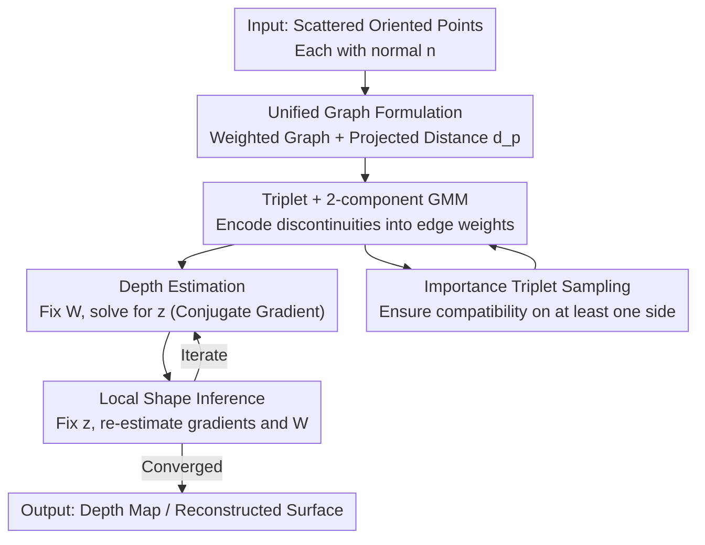

# Variational Graph-based Normal Integration

**Conference**: CVPR 2026  
**Paper**: [CVF Open Access](https://openaccess.thecvf.com/content/CVPR2026/html/Chen_Variational_Graph-based_Normal_Integration_CVPR_2026_paper.html)  
**Area**: 3D Vision / Surface Reconstruction / Normal Integration  
**Keywords**: Normal Integration, Depth Discontinuity, Directed Weighted Graph, Variational Inference, Scattered Point Clouds

## TL;DR
This paper reformulates the "normal map → depth" integration problem as a unified optimization objective on a directed weighted graph. It explicitly models depth discontinuities using triplets combined with a two-component Gaussian Mixture Model (GMM), and employs variational inference to alternatingly solve for depth and graph weights. This approach not only outperforms the current SOTA (BiNI) on regular grids but also directly handles scattered oriented points, which grid-based methods fail to process.

## Background & Motivation
**Background**: Normal integration is a classical inverse problem—given a normal map, it reconstructs the depth of each pixel. It serves as a crucial post-processing step for low-level 3D vision tasks like photometric stereo, shape-from-shading, and single-view dense reconstruction. Traditional methods treat the surface as a scalar height field $z(u,v)$, store gradients $p=-n_x/n_z,\ q=-n_y/n_z$ on a regular grid, and minimize an energy functional (Eq 1) using PDE solvers. Currently, Bilateral Normal Integration (BiNI) and its variants are the strongest performers, using semi-differentiable connectivity patterns to parameterize weight functions for handling depth discontinuities.

**Limitations of Prior Work**: This paradigm is constrained by "regular grids." Depth discontinuities cause spatial irregularities, and grid-based numerical differentiation (axis-aligned differences along fixed $u/v$ axes) naturally fails to capture such irregularities. Furthermore, modern data increasingly appears as **scattered oriented points** (position + normal but no regular topology), for which methods like BiNI—requiring regular grids and axis-aligned comparators—lack direct support.

**Key Challenge**: The paper notes that "model complexity" and "solver complexity" are inversely related. A flexible geometric model is needed to parameterize surfaces with randomly distributed points and explicitly model depth discontinuities, while a stable optimizer is required to handle these points and reliably estimate parameters. Existing methods decouple these tasks heuristically: field conservation is handled by separate routines, and depth discontinuities are managed by pixel-wise, axis-aligned comparators, resulting in a fragmented pipeline.

**Goal**: To design a unified framework for "semi-differentiable surfaces" (piecewise smooth surfaces allowing depth fractures) that can express depth discontinuities, stably recover depth, and treat both regular grids and scattered points **identically**.

**Core Idea**: Relocate normal integration to a **directed weighted graph**. Each point is a vertex, and each directed edge encodes geometric compatibility (using a "projected point-to-plane distance" metric). Edge weights $w_{ij}$ indicate whether an edge crosses a depth fracture. Integration thus becomes a weighted least-squares minimization of point-to-plane distances on the graph, solved via variational inference by alternating between "depth" and "graph weights."

## Method

### Overall Architecture
The input consists of oriented points sampled from a surface (each with a normal $\vec{n}$), and the output is the depth $z$ (or log-depth $d$ for perspective cases) along the line of sight. The framework is built in three steps:

1.  **Graph Construction**: A directed graph (e.g., KNN, $K=8$) is built offline based on $x\text{-}y$ coordinates. For each directed edge from point $i$ to neighbor $j$, an orthogonality equation is established for "point $i$ to the tangent plane of point $j$." The **projected point-to-plane distance** $d_p(i,j)$ quantifies geometric compatibility. The unified weighted least-squares objective is $\sum_{ij} w_{ij} d_p(z_i,z_j)$ (Eq 7), shared by both grid and scattered data.

2.  **Triplet + Gaussian Mixture**: Each center point and its two neighbors form a triplet, modeled as a sample generated jointly by two Gaussian components representing the neighbors. Depth discontinuities are reflected in the imbalance of the posterior probabilities (edge weights).

3.  **Variational Inference**: Depth $\vec{z}$ is solved while weights $W$ are fixed (Depth Estimation stage), and weights $W$ are inferred while depth is fixed (Local Shape Inference stage). These stages iterate alternatingly, resembling a "continuous deformation" of an initial plane toward the target shape.

The pipeline is an iterative loop illustrated below:

### Key Designs

**1. Unified Graph Formulation: Point-to-Plane Distance**

Existing methods rely on axis-aligned numerical differences, which fail to capture irregular depth fractures. This method adopts a geometric perspective: for each directed edge from $i$ to neighbor $j$, an orthogonality condition $(\vec{x}_i + d_{ij}\vec{r}_i - \vec{x}_j)\cdot\vec{n}_j = 0$ is formulated. Expanding this yields the **projected point-to-plane distance**:

$$d_p(i,j) = (\bar{x}_j-\bar{x}_i)\cdot\vec{n}_j + (z_j - z_i)\,\vec{r}_i\cdot\vec{n}_j,$$

This is an asymmetric signed distance that vanishes when points are coplanar. Normal integration is rewritten as minimizing $\sum_{i,j} w_{ij}\, d_p(z_i,z_j)$ (Eq 7). This formulation is powerful because it depends only on coordinates, normals, and connectivity, making it identical for orthographic and perspective projections, as well as grid and scattered points.

**2. Triplet + Two-component GMM: Closed-form Posterior Edge Weights**

Weights $w_{ij}$ are inferred using **triplets**: a center point $\vec{x}_0$ and two neighbors $\vec{x}_{+1},\vec{x}_{-1}$. The center point $\vec{x}_0$ is modeled as a sample jointly generated by Gaussian components from its neighbors (Eq 8):

$$p(\vec{x}_0) = \pi_{+1}\mathcal{N}(\vec{x}_0\,|\,\vec{x}_{+1},\vec{n}_{+1}) + \pi_{-1}\mathcal{N}(\vec{x}_0\,|\,\vec{x}_{-1},\vec{n}_{-1}),$$

where $\mathcal{N}(\vec{x}_0|\vec{x}_{+1},\vec{n}_{+1}) = e^{-d_p^2(0,+1)\cdot k}$. Edge weights are the posterior probabilities with a closed-form solution:

$$w_{0,+1} = \sigma_k\!\big(d_p^2(0,-1) - d_p^2(0,+1)\big),\qquad w_{0,+1}+w_{0,-1}=1,$$

This design naturally distinguishes three neighborhood cases: no discontinuity (equal weights), single-sided discontinuity (weight shifts to the compatible side), and double-sided discontinuity (excluded via sampling). BiScale (BiNI) is shown to be a **restricted special case** of this framework with fixed priors and axis-aligned triplets.

**3. Variational Inference: Continuous Shape Deformation**

Depth $\vec{z}$ and the weight matrix $W$ are interdependent in the optimality condition $D_z^\top W D_z\,\vec{z} = -D_z^\top W\vec{b}$. Iteration $t$ consists of two steps: **Depth Estimation** (solving for $\vec{z}^{t+1}$ given $W^t$ via conjugate gradient) and **Local Shape Inference** (re-estimating the gradient field $\vec{g}(x,y)$ given $\vec{z}^{t+1}$ and updating $W^{t+1}$). Estimating the gradient field rather than individual points ensures consistency across vertices shared by multiple triplets. The process resembles a surface **continuously deforming** from an initial state to the target geometry.

**4. Importance Triplet Sampling: Avoiding Degenerate Configurations**

To avoid cases where a center point is disconnected from both neighbors, **importance edge sampling** is used. The first neighbor $\vec{x}_{0,+1}$ is chosen as the most compatible (minimum $d_p$), and the second neighbor $\vec{x}_{0,-1}$ is chosen such that the angle between the two edges is closest to $\pi$. This filtering of unsolvable configurations ensures stable convergence.

### Loss & Training
The method is optimization-based with no learned parameters. The core is the weighted least-squares objective (Eq 7), leading to the weighted normal equation $D_z^\top W D_z\,\vec{z} = -D_z^\top W\vec{b}$. Both depth and gradient field estimation are solved using **Conjugate Gradient** for large-scale sparse systems.

## Key Experimental Results

### Main Results
Evaluated using Mean Absolute Depth Error (MADE) on the DiLiGenT-MV dataset. Table for orthographic, front view:

| Method | bear | buddha | cow | pot | reading |
|------|------|--------|-----|-----|---------|
| **GNI (Ours)** | **0.60** | **1.91** | 5.62 | **0.59** | **2.42** |
| BiNI | 0.74 | 2.07 | **0.65** | 1.30 | 14.73 |
| IPF | 24.29 | 8.23 | 2.50 | 4.07 | 33.59 |
| MD | 0.68 | 6.73 | 1.67 | 1.33 | 10.50 |

GNI outperforms BiNI on 4 out of 5 models, with a significant improvement on "reading" (14.73 to 2.42).

### Ablation Study
On scattered points (Halton sampling, ~20% points, no axis-alignment), comparing the effect of triplet sampling:

| Configuration | bear | buddha | cow | pot | reading | Description |
|------|------|--------|-----|-----|---------|------|
| GNI (with sampling) | 1.26 | 6.05 | 18.72 | 1.29 | 5.08 | Full model |
| GNI (no sampling) | 1.91 | 7.71 | 35.70 | 1.73 | 10.14 | Baseline |

Removing triplet sampling doubles the error on models like "reading," proving its criticality for maintaining depth edges.

### Key Findings
- **Triplet sampling is central** for depth discontinuities; without it, errors typically double.
- **Performance is consistent** across grid and scattered representations, though scattered sampling "amplifies" errors due to the difficulty of identifying fractures in occluded regions.
- **Self-occlusion** is the primary source of failure (e.g., "buddha" side view), as it partitions the object into disconnected components within a single connected graph component—a fundamentally ambiguous case for single-view integration.

## Highlights & Insights
- **Generalization**: Abstracting normal integration from "grid PDE" to "weighted least-squares on a graph" allows a single $d_p$ distance to handle orthographic/perspective and grid/scattered data uniformly.
- **Theoretical Elegance**: Using GMM posterior as edge weights provides a differentiable, iterative framework that generalizes BiNI.
- **Iterative Interpretation**: Viewing variational inference as "continuous shape deformation" provides a clear geometric intuition for the optimization process.

## Limitations & Future Work
- **Sampling Dependency**: The method assumes approximately uniform sampling; it struggles with highly irregular distributions found in real-world point clouds like "horse" or "torso."
- **Single-view Occlusions**: Relative depth between disconnected parts remains unresolvable without additional priors or multi-view data.
- **Optimization Speed**: As a per-instance optimization solving large sparse systems, its scalability and speed compared to learned/amortized methods remain a factor.

## Related Work & Insights
- **vs BiNI**: BiNI is a restricted special case of the proposed framework. By generalizing to random triplets and geometric distances, GNI extends support to scattered points and improves grid performance.
- **vs Traditional Baselines (IPF/MD)**: GNI's error is often an order of magnitude lower, demonstrating the necessity of explicit discontinuity modeling.
- **vs Learning-based Methods**: Most learning-based point cloud filtering assumes known depth; GNI solves the harder problem of recovering depth from normals alone without prescribed topology.

## Rating
- Novelty: ⭐⭐⭐⭐⭐ Unified graph formulation and variational framework are mathematically solid.
- Experimental Thoroughness: ⭐⭐⭐⭐ Excellent grid/scattered coverage; lacks extensive speed/scalability benchmarks for massive point clouds.
- Writing Quality: ⭐⭐⭐⭐ Rigorous derivation and clear geometric explanations; high dense-math threshold.
- Value: ⭐⭐⭐⭐ Highly practical for photometric stereo and single-view reconstruction back-ends.

<!-- RELATED:START -->

## Related Papers

- [\[CVPR 2025\] Feature-Preserving Mesh Decimation for Normal Integration](../../CVPR2025/3d_vision/feature-preserving_mesh_decimation_for_normal_integration.md)
- [\[CVPR 2026\] VENI: Variational Encoder for Natural Illumination](veni_variational_encoder_for_natural_illumination.md)
- [\[CVPR 2026\] ArtPro: Self-Supervised Articulated Object Reconstruction with Adaptive Integration of Mobility Proposals](artpro_self-supervised_articulated_object_reconstruction_with_adaptive_integrati.md)
- [\[CVPR 2026\] GP-4DGS: Probabilistic 4D Gaussian Splatting from Monocular Video via Variational Gaussian Processes](gp-4dgs_probabilistic_4d_gaussian_splatting_from_monocular_video_via_variational.md)
- [\[CVPR 2026\] BrickNet: Graph-Backed Generative Brick Assembly](bricknet_graph-backed_generative_brick_assembly.md)

<!-- RELATED:END -->
