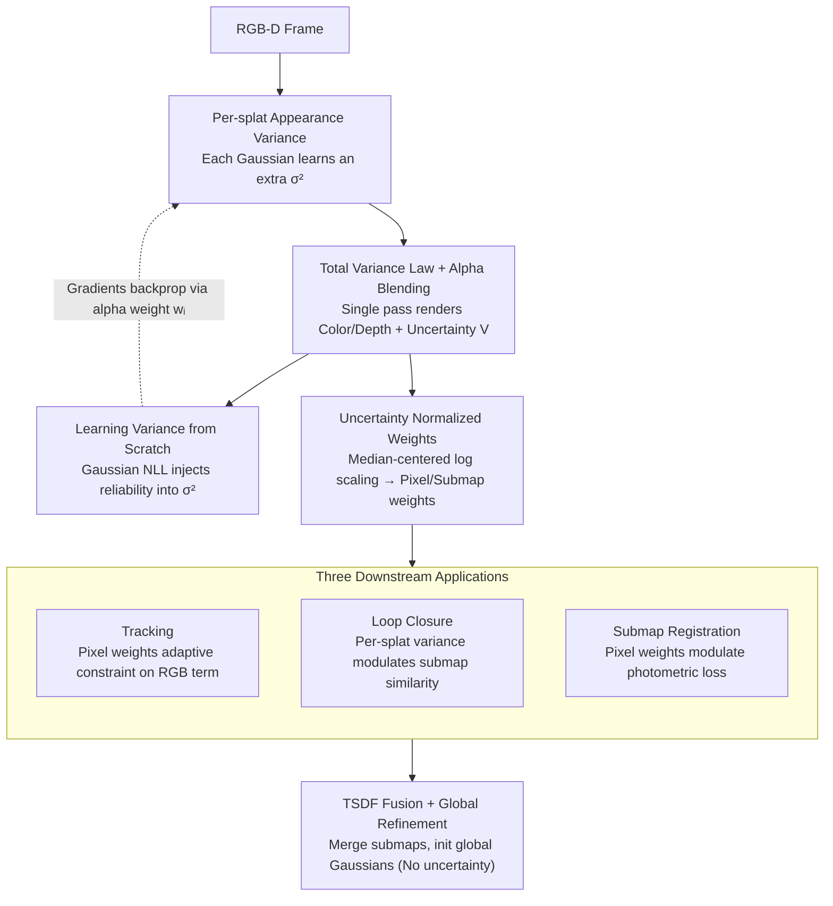

# VarSplat: Uncertainty-aware 3D Gaussian Splatting for Robust RGB-D SLAM

**Conference**: CVPR2026  
**arXiv**: [2603.09673](https://arxiv.org/abs/2603.09673)  
**Code**: [Project Page](https://anhthuan1999.github.io/varsplat/)  
**Area**: 3D Vision  
**Keywords**: 3D Gaussian Splatting, SLAM, uncertainty modeling, RGB-D, alpha blending

## TL;DR

Ours proposes VarSplat, the first 3DGS-SLAM system that learns **per-splat appearance variance** $\sigma^2$ and renders a **pixel-wise uncertainty map** $V$ via the Law of Total Variance. This uncertainty is unified across tracking, submap registration, and loop closure, achieving robust and leading performance across four datasets.

## Background & Motivation

3DGS-SLAM achieves fast differentiable rendering through the rasterization of anisotropic Gaussians, significantly surpassing NeRF-SLAM in reconstruction quality and speed. However, existing methods suffer from a critical flaw: **measurement reliability is not explicitly modeled**. When scenes contain low-texture regions, transparent surfaces, reflective surfaces, or depth-discontinuity boundaries, uniform photometric weights lead to drift in pose estimation.

**Limitations of Prior Work** in uncertainty modeling:

- **Geometric Uncertainty** (e.g., depth variance in CG-SLAM, pixel-wise depth uncertainty in UncLe-SLAM): Models only geometric dimensions, ignoring appearance instability.
- **Pre-trained Predictors** (e.g., WildGS-SLAM predicting uncertainty maps based on DINOv2 features): Relies on external models and cannot be optimized end-to-end.
- **Termination Probability** (e.g., Uni-SLAM's termination-probability field): Uncertainty does not originate from the rasterizer itself.

The **Core Idea** of VarSplat is to directly learn the appearance variance $\sigma_i^2$ of each Gaussian and propagate it to a pixel-wise uncertainty $V$ through the Law of Total Variance and alpha blending, all within a single rasterization pass.

## Core Problem

1. How to explicitly model appearance uncertainty in 3DGS without introducing additional networks or pre-trained models?
2. How to efficiently propagate per-splat variance into a pixel-wise uncertainty map?
3. How to unify the use of uncertainty across the three key stages of SLAM: tracking, registration, and loop closure?

## Method

### Overall Architecture

VarSplat targets a neglected issue in 3DGS-SLAM: measurement reliability is not explicitly modeled. In regions with low texture, transparency, reflections, or depth discontinuities, uniform photometric weights bias pose estimation. The **Core Idea** is to learn an appearance variance $\sigma_i^2$ for each Gaussian, propagate it via the Law of Total Variance + alpha blending into a pixel-wise uncertainty map $V$ during a single rasterization, and then apply this uncertainty to tracking, submap registration, and loop closure. This ensures stronger supervision in reliable regions while automatically down-weighting unreliable ones.

### Key Designs

**1. Per-splat Appearance Variance + Law of Total Variance: Single-pass Uncertainty Rendering**

Standard 3DGS assigns $\mu_i, \alpha_i, s_i, \Sigma_i, c_i$ to each Gaussian. VarSplat adds a three-channel appearance variance $\sigma_i^2 \in \mathbb{R}^3$, representing the uncertainty around the mean color of the splat. A submap is denoted as $P^s = \{G_i^s(\mu_i, \Sigma_i, \alpha_i, s_i, c_i, \sigma_i^2) \mid i=1,\ldots,N^s\}$. This differs from spatial covariance $\Sigma_i$ (geometry) and SH coefficients (mean appearance). Even if SH correctly models view-dependent colors, slight view changes at boundaries or reflections alter visibility and alpha weights, causing inconsistent observations; here, $\sigma_i^2$ learns higher values. Using standard alpha blending weights $w_i = T_i \alpha_i$, rendered values $C = \sum_i w_i c_i$ and $D = \sum_i w_i z_i$ are obtained. Uncertainty is decomposed by the Law of Total Variance:

$$\text{Var}[X] = \mathbb{E}[\text{Var}[X|Z]] + \text{Var}(\mathbb{E}[X|Z])$$

The first term (expected per-splat variance) is $\sum_i w_i \sigma_i^2$, and the second term (variance of splat means) is $\sum_i w_i c_i^2 - (\sum_i w_i c_i)^2$. Combined:

$$V = \sum_i w_i(\sigma_i^2 + c_i^2) - \left(\sum_i w_i c_i\right)^2$$

Crucially, $V$ shares the same rasterization pass as color/depth, requiring no additional forward passes or Monte Carlo sampling, thus maintaining real-time performance.

**2. Learning Variance from Scratch: Injecting Reliability via Gaussian NLL**

Submaps are managed via existing strategies. Variance is not supervised by labels but learned from scratch using Negative Log-Likelihood (NLL), inspired by ActiveNeRF:

$$\mathcal{L}_{\text{var}} = \frac{1}{2V}\left(\|\hat{I}-I\|_2^2 + \|\hat{D}-D\|_2^2\right) + \log(V)$$

**Design Motivation**: Squared L2 (MSE) is used rather than L1, as L1 corresponds to a Laplace distribution which would violate the Gaussian assumption. Incorporating both color and depth residuals allows the variance to reflect integrated geometric and appearance reliability. The gradient $\frac{\partial \mathcal{L}_{\text{var}}}{\partial \sigma_i^2} = \frac{\partial \mathcal{L}_{\text{var}}}{\partial V} \cdot w_i$ propagates variance back to each splat via alpha weights.

**3. Uncertainty Normalized Weights + Three Downstream Applications**

To convert variance into usable weights, median-centered log scaling is applied for pixel-level and splat-level weights:

$$\widetilde{w}_p = \exp[-(\log V - \widetilde{V})/\tau], \quad \widetilde{w}_s = \exp[-(\log \sigma^2 - \widetilde{\sigma^2})/\tau]$$

$\widetilde{V}$ and $\widetilde{\sigma^2}$ are the medians of the corresponding log quantities. During **Tracking**, pixel weights adaptively constrain the RGB term $\mathcal{L}_{\text{track}} = \sum \lambda_c (\widetilde{w_p} \odot \|\hat{I}-I\|_1) + (1-\lambda_c)\|\hat{D}-D\|_1$; variance parameters are frozen to avoid conflicts with pose optimization. **Loop Closure** modulates submap similarity using per-splat variance, calculating a weighted opacity ratio $r = \frac{\sum_j \widetilde{w_s} \alpha_j}{\sum_j \alpha_j}$. **Registration** localizes query frames to database submaps using pixel weights to modulate the photometric loss. Finally, TSDF fusion merges submaps to initialize global Gaussians for final refinement (where uncertainty is not used as unstable regions were already handled).

### Loss & Training

Total Mapping Loss:

$$\mathcal{L}_{\text{map}} = \lambda_{\text{color}} \cdot \mathcal{L}_{\text{color}} + \lambda_{\text{depth}} \cdot \mathcal{L}_{\text{depth}} + \lambda_{\text{reg}} \cdot \mathcal{L}_{\text{reg}} + \lambda_{\text{var}} \cdot \mathcal{L}_{\text{var}}$$

Where $\mathcal{L}_{\text{color}}$ combines L1 and SSIM, $\mathcal{L}_{\text{depth}}$ is the depth L1 loss, $\mathcal{L}_{\text{reg}}$ constrains Gaussian scale, and $\mathcal{L}_{\text{var}}$ is the Gaussian NLL.

## Key Experimental Results

### Main Results (ATE RMSE ↓, cm)

| Dataset | Prev. SOTA | VarSplat | Gain |
|--------|---------|----------|------|
| Replica (Avg. 8 scenes) | LoopSplat: 0.26 | **0.23** | ~12% |
| ScanNet++ (Avg. 5 scenes) | LoopSplat: 2.05 | **1.69** | ~18% |
| TUM-RGBD (Avg. 5 scenes) | LoopSplat: 3.33 | **3.20** | ~4% |
| ScanNet (Avg. 6 scenes) | Loopy-SLAM: 7.7 | **6.5** | ~16% |

### Rendering & Reconstruction Performance

| Metric | Dataset | VarSplat | Comparison (LoopSplat) |
|------|--------|----------|------------------|
| PSNR ↑ | Replica | 37.15 | 36.63 |
| SSIM ↑ | Replica | 0.986 | 0.985 |
| LPIPS ↓ | Replica | 0.109 | 0.112 |
| Depth L1 ↓ | Replica | 0.50 | 0.51 |
| F1 ↑ | Replica | 90.2% | 90.4% |
| NVS PSNR ↑ | ScanNet++ | **21.33** | 21.30 |

### Ablation Study

Incremental effect of uncertainty across three stages (ScanNet 6-scene Avg. ATE RMSE):

- No Uncertainty: 8.20 → +Tracking: 7.63 → +Loop Closure: 7.49 → +Registration (Full): **6.53** (Total improvement ~20%).

Runtime (Replica/Room0, A100 80GB): Mapping 1.9s/f, Tracking 2.0s/f, comparable to LoopSplat (1.2s/1.8s).

## Highlights & Insights

1. **Mathematical Elegance**: Propagates per-splat variance to pixel-wise uncertainty via the Law of Total Variance without Monte Carlo sampling, keeping it within a single rasterization pass.
2. **End-to-End Learning**: Variance $\sigma_i^2$ is an optimizable parameter, requiring no pre-trained models.
3. **Unified Application**: A single uncertainty signal serves tracking (pixel-level), loop closure (submap-level), and registration (pixel-level).
4. **Freezing Strategy**: Freezing variance during tracking and loop detection prevents gradient conflicts, a sound design choice.
5. **Significant Robustness**: Shows much greater stability than baselines on real-world datasets (ScanNet/ScanNet++/TUM-RGBD).

## Limitations & Future Work

1. **RGB-D Only**: Has not been extended to pure RGB (monocular/stereo) scenarios.
2. **Computational Overhead**: Mapping time increased from 1.2s/f to 1.9s/f (+58%), which may impact real-time sensitive applications.
3. **Discarding Uncertainty during Fusion**: TSDF fusion and final refinement do not use $V$, potentially losing reconstruction quality in unstable areas.
4. **Variance Modeling Assumption**: Uses isotropic per-channel variance $\sigma_i^2 \in \mathbb{R}^3$, neglecting cross-channel covariance.
5. **Dynamic Scenes**: Does not account for dynamic objects, potentially failing in dynamic environments.

## Related Work & Insights

| Method | Uncertainty Type | Source | Online Learning | Single Pass |
|------|------------|------|---------|---------|
| CG-SLAM | Depth Variance | Geometry-driven | ✓ | ✓ |
| Uni-SLAM | Termination Prob. | Implicit Field | ✓ | ✗ |
| WildGS-SLAM | DINOv2 Feature Map | Pre-trained | ✗ | ✓ |
| ActiveNeRF | Pixel Variance | Neural Network | ✓ | ✗ |
| **VarSplat** | **Per-splat App. Var.** | **Total Variance Law** | **✓** | **✓** |

**Key Insight**: VarSplat's advantage lies in uncertainty stemming directly from the 3DGS representation itself (not external models), propagated via closed-form formulas (not sampling), and optimized end-to-end online.

## Related Work & Insights

- The **Variance Freezing Strategy** is useful: selectively training/freezing variance parameters across stages avoids gradient conflicts, offering general guidance for multi-task optimization.
- The decomposition $V = \mathbb{E}[\text{Var}] + \text{Var}(\mathbb{E})$ can be generalized to uncertainty estimation for other 3DGS attributes like semantics or normals.
- Similar uncertainty weighting can be transferred to other 3DGS-based tasks: active view selection in NVS, scene completion, and semantic segmentation.

## Rating

- Novelty: ⭐⭐⭐⭐ — The derivation using the Law of Total Variance + alpha blending is clean and elegant, providing a natural uncertainty solution for 3DGS.
- Experimental Thoroughness: ⭐⭐⭐⭐⭐ — Covers 4 datasets (synthetic + real), compares with 12+ baselines, and ablates three downstream tasks.
- Writing Quality: ⭐⭐⭐⭐ — Clear derivations, well-articulated motivation, and organized experiments.
- Value: ⭐⭐⭐⭐ — Establishes an efficient and practical uncertainty modeling paradigm for 3DGS-SLAM systems.

<!-- RELATED:START -->

## Related Papers

- [\[CVPR 2026\] AERGS-SLAM: Auto-Exposure-Robust Stereo 3D Gaussian Splatting SLAM](aergs-slam_auto-exposure-robust_stereo_3d_gaussian_splatting_slam.md)
- [\[CVPR 2026\] Rethinking Pose Refinement in 3D Gaussian Splatting under Pose Prior and Geometric Uncertainty](rethinking_pose_refinement_in_3d_gaussian_splatting_under_pose_prior_and_geometr.md)
- [\[CVPR 2026\] ODGS-SLAM: Omnidirectional Gaussian Splatting SLAM](odgs-slam_omnidirectional_gaussian_splatting_slam.md)
- [\[ECCV 2024\] CG-SLAM: Efficient Dense RGB-D SLAM in a Consistent Uncertainty-Aware 3D Gaussian Field](../../ECCV2024/3d_vision/cg-slam_efficient_dense_rgb-d_slam_in_a_consistent_uncertainty-aware_3d_gaussian.md)
- [\[CVPR 2026\] UST-Hand: An Uncertainty-aware Spatiotemporal Point Cloud Interaction Network for 3D Self-supervised Hand Pose Estimation](ust-hand_an_uncertainty-aware_spatiotemporal_point_cloud_interaction_network_for.md)

<!-- RELATED:END -->
